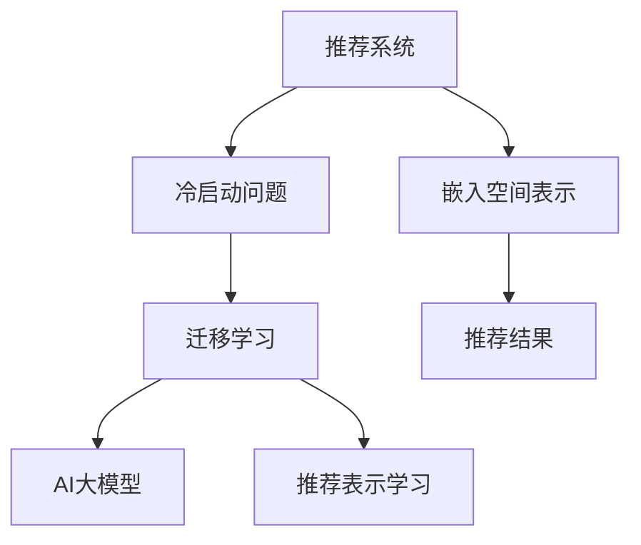

                 

# 推荐系统的冷启动问题：AI大模型的迁移学习解决方案

> 关键词：推荐系统,冷启动问题,迁移学习,AI大模型

## 1. 背景介绍

### 1.1 问题由来
推荐系统(Recommendation Systems)作为互联网时代最为核心的应用之一，已经成为各大电商、社交媒体、视频平台等业务的标配。但随着推荐算法的不断发展，冷启动问题(Cold Start Problem)逐渐浮现，成为困扰推荐系统的重要难题。冷启动指的是在用户或物品刚进入系统时，由于缺乏历史行为数据，无法构建精准的用户或物品画像，难以提供有效的推荐。传统的推荐系统多采用协同过滤、基于内容的推荐等方法，但对于新用户或物品，由于缺少相关历史行为数据，这些方法往往难以发挥效果。

为此，AI大模型的迁移学习(M Transfer Learning)方法应运而生。它利用预训练大模型对大规模无标签数据进行学习，提取泛化的语言、视觉、行为特征，在推荐系统上线初期通过微调这些特征，可以快速提升推荐质量。本文将全面介绍迁移学习在推荐系统冷启动问题中的应用，包括原理、步骤、优缺点、应用场景等，同时给出基于AI大模型的推荐系统推荐算法实现。

## 2. 核心概念与联系

### 2.1 核心概念概述

为了更好地理解AI大模型在推荐系统中的应用，本节将介绍几个关键概念：

- 推荐系统(Recommendation System): 通过分析用户的历史行为数据，预测用户可能感兴趣的商品、内容或服务，实现个性化推荐。常见的推荐算法包括协同过滤、基于内容的推荐、矩阵分解等。

- 冷启动问题(Cold Start Problem): 推荐系统上线初期，新用户或新物品无法构建准确的画像，导致推荐质量下降。冷启动问题是推荐系统中的主要难点之一。

- 迁移学习(M Transfer Learning): 利用预训练大模型对大规模无标签数据进行学习，提取泛化的特征，在特定任务上进行微调，以提高模型在特定领域的表现。AI大模型如BERT、GPT、ViT等，都是典型的迁移学习范式。

- 推荐表示学习(Recommendation Representation Learning): 通过学习用户或物品的语义表示，捕捉其特征和兴趣，从而实现精准推荐。

- 嵌入空间表示(Embedding Space Representation): 将用户和物品映射到高维空间，通过相似度度量计算推荐结果。

这些核心概念之间的逻辑关系可以通过以下Mermaid流程图来展示：



这个流程图展示了一些关键概念之间的关联关系：

1. 推荐系统面临冷启动问题，需要通过迁移学习来解决。
2. 迁移学习中的AI大模型，通过预训练学习到广泛的特征表示。
3. 迁移学习可以结合推荐表示学习，提高推荐的精准度。
4. 嵌入空间表示可以将用户和物品映射到高维空间，通过相似度计算推荐结果。

## 3. 核心算法原理 & 具体操作步骤
### 3.1 算法原理概述

AI大模型迁移学习在推荐系统中的核心思想是：通过在大规模无标签数据上预训练大模型，学习到泛化的特征表示，然后对特定任务进行微调，快速提升模型性能。形式化地，假设预训练模型为 $M_{\theta}$，其中 $\theta$ 为预训练得到的模型参数。给定推荐系统的用户和物品数据集 $D=\{(u_i, i_j)\}_{i=1}^N, u_i \in \mathcal{U}, i_j \in \mathcal{I}$，迁移学习的优化目标是最小化经验风险，即找到最优参数：

$$
\theta^* = \mathop{\arg\min}_{\theta} \mathcal{L}(M_{\theta},D)
$$

其中 $\mathcal{L}$ 为针对推荐系统设计的损失函数，用于衡量模型预测输出与真实标签之间的差异。常见的损失函数包括交叉熵损失、均方误差损失等。

通过梯度下降等优化算法，迁移学习过程不断更新模型参数 $\theta$，最小化损失函数 $\mathcal{L}$，使得模型输出逼近真实标签。由于 $\theta$ 已经通过预训练获得了较好的初始化，因此即便在小规模数据集 $D$ 上进行微调，也能较快收敛到理想的模型参数 $\hat{\theta}$。

### 3.2 算法步骤详解

AI大模型迁移学习在推荐系统中的应用，一般包括以下几个关键步骤：

**Step 1: 准备预训练模型和数据集**
- 选择合适的预训练模型 $M_{\theta}$ 作为初始化参数，如 BERT、GPT、ViT 等。
- 准备推荐系统的用户和物品数据集 $D$，划分为训练集、验证集和测试集。一般要求用户和物品与预训练数据的分布不要差异过大。

**Step 2: 添加推荐适配层**
- 根据推荐任务类型，在预训练模型顶层设计合适的输出层和损失函数。
- 对于评分预测任务，通常在顶层添加线性回归器或MLP分类器，并使用均方误差损失函数。
- 对于排名预测任务，通常使用点积或余弦相似度计算用户和物品间的相似度，并使用排序损失函数。

**Step 3: 设置迁移学习超参数**
- 选择合适的优化算法及其参数，如 Adam、SGD 等，设置学习率、批大小、迭代轮数等。
- 设置正则化技术及强度，包括权重衰减、Dropout、Early Stopping 等。
- 确定冻结预训练参数的策略，如仅微调顶层，或全部参数都参与微调。

**Step 4: 执行梯度训练**
- 将训练集数据分批次输入模型，前向传播计算损失函数。
- 反向传播计算参数梯度，根据设定的优化算法和学习率更新模型参数。
- 周期性在验证集上评估模型性能，根据性能指标决定是否触发 Early Stopping。
- 重复上述步骤直到满足预设的迭代轮数或 Early Stopping 条件。

**Step 5: 测试和部署**
- 在测试集上评估迁移学习后模型 $M_{\hat{\theta}}$ 的性能，对比预训练和迁移学习后的性能变化。
- 使用迁移学习后的模型对新用户或新物品进行推荐，集成到实际的应用系统中。
- 持续收集新用户或新物品的行为数据，定期重新微调模型，以适应数据分布的变化。

以上是基于AI大模型的迁移学习在推荐系统中的应用的一般流程。在实际应用中，还需要针对具体任务的特点，对迁移学习过程的各个环节进行优化设计，如改进训练目标函数，引入更多的正则化技术，搜索最优的超参数组合等，以进一步提升模型性能。

### 3.3 算法优缺点

AI大模型迁移学习在推荐系统中的应用，具有以下优点：
1. 速度快，效果好。利用预训练模型的广泛特征表示，可以显著提高推荐系统初期性能。
2. 可解释性差。AI大模型作为一个"黑盒"系统，难以解释其内部工作机制和决策逻辑。
3. 需要高质量数据。预训练模型需要大量数据才能学习到泛化的特征表示，推荐系统初期性能受数据质量影响较大。
4. 资源消耗大。预训练和微调模型需要大量算力和存储，初期成本较高。
5. 需要持续更新。推荐系统初期推荐的准确性受新数据的影响较大，需要持续收集新数据并重新微调模型。

同时，该方法也存在一定的局限性：
1. 缺乏对个性化需求的考虑。AI大模型更多是从整体数据中学习特征，可能无法充分考虑用户个性化需求。
2. 泛化能力有限。预训练模型可能无法很好地适应特定领域的数据分布。
3. 数据依赖性强。推荐系统初期性能受数据质量和标注样本的影响较大。
4. 易过拟合。在特定任务上微调过多的参数，可能导致过拟合现象。

尽管存在这些局限性，但就目前而言，AI大模型迁移学习在推荐系统初期仍是最主流的方法之一。未来相关研究的重点在于如何进一步降低对标注样本的依赖，提高模型的泛化能力，兼顾可解释性和个性化需求等因素。

### 3.4 算法应用领域

AI大模型迁移学习在推荐系统中的应用，已经在电商、社交媒体、视频平台等多个领域得到了广泛的应用，例如：

- 电商推荐：如淘宝、京东等电商平台，通过用户浏览、购买等行为数据，使用推荐系统向用户推荐商品。
- 社交媒体推荐：如微博、抖音等社交媒体平台，使用推荐系统向用户推荐相关内容。
- 视频推荐：如腾讯视频、YouTube等视频平台，使用推荐系统向用户推荐相关视频。

除了上述这些经典任务外，AI大模型迁移学习也被创新性地应用到更多场景中，如智能广告投放、个性化课程推荐、智能家居控制等，为推荐系统带来了全新的突破。随着预训练模型和迁移学习方法的不断进步，相信推荐系统将在更广阔的应用领域大放异彩。

## 4. 数学模型和公式 & 详细讲解 & 举例说明
### 4.1 数学模型构建

本节将使用数学语言对AI大模型迁移学习在推荐系统中的应用进行更加严格的刻画。

记预训练模型为 $M_{\theta}$，其中 $\theta$ 为预训练得到的模型参数。假设推荐系统的训练集为 $D=\{(u_i, i_j)\}_{i=1}^N, u_i \in \mathcal{U}, i_j \in \mathcal{I}$。

定义模型 $M_{\theta}$ 在用户 $u_i$ 和物品 $i_j$ 上的评分预测为 $p_{i_j}(u_i)=M_{\theta}(u_i,i_j)$，其中 $p_{i_j}(u_i) \in [0,1]$ 表示用户 $u_i$ 对物品 $i_j$ 的评分。训练集的标签为 $\{y_{i_j}\}_{i=1}^N$，其中 $y_{i_j} \in \{0,1\}$ 表示用户 $u_i$ 是否购买了物品 $i_j$。

定义推荐系统的损失函数为交叉熵损失：

$$
\mathcal{L}(\theta) = -\frac{1}{N}\sum_{i=1}^N [y_{i_j}\log p_{i_j}(u_i)+(1-y_{i_j})\log(1-p_{i_j}(u_i))]
$$

其中 $y_{i_j}\log p_{i_j}(u_i)+(1-y_{i_j})\log(1-p_{i_j}(u_i))$ 表示预测值与真实标签之间的交叉熵损失。

通过梯度下降等优化算法，迁移学习过程不断更新模型参数 $\theta$，最小化损失函数 $\mathcal{L}$，使得模型预测输出逼近真实标签。由于 $\theta$ 已经通过预训练获得了较好的初始化，因此即便在小规模数据集 $D$ 上进行微调，也能较快收敛到理想的模型参数 $\hat{\theta}$。

### 4.2 公式推导过程

以下我们以评分预测任务为例，推导交叉熵损失函数及其梯度的计算公式。

假设模型 $M_{\theta}$ 在用户 $u_i$ 和物品 $i_j$ 上的输出为 $p_{i_j}(u_i)=M_{\theta}(u_i,i_j) \in [0,1]$，表示用户 $u_i$ 对物品 $i_j$ 的评分。真实标签 $y_{i_j} \in \{0,1\}$。则交叉熵损失函数定义为：

$$
\mathcal{L}(\theta) = -\frac{1}{N}\sum_{i=1}^N [y_{i_j}\log p_{i_j}(u_i)+(1-y_{i_j})\log(1-p_{i_j}(u_i))]
$$

将其代入经验风险公式，得：

$$
\mathcal{L}(\theta) = -\frac{1}{N}\sum_{i=1}^N [y_{i_j}\log p_{i_j}(u_i)+(1-y_{i_j})\log(1-p_{i_j}(u_i))]
$$

根据链式法则，损失函数对参数 $\theta_k$ 的梯度为：

$$
\frac{\partial \mathcal{L}(\theta)}{\partial \theta_k} = -\frac{1}{N}\sum_{i=1}^N \frac{y_{i_j}}{p_{i_j}(u_i)}\frac{\partial p_{i_j}(u_i)}{\partial \theta_k} - \frac{1-y_{i_j}}{1-p_{i_j}(u_i)}\frac{\partial p_{i_j}(u_i)}{\partial \theta_k}
$$

其中 $\frac{\partial p_{i_j}(u_i)}{\partial \theta_k}$ 可进一步递归展开，利用自动微分技术完成计算。

在得到损失函数的梯度后，即可带入参数更新公式，完成模型的迭代优化。重复上述过程直至收敛，最终得到适应推荐任务的最优模型参数 $\theta^*$。

## 5. 项目实践：代码实例和详细解释说明
### 5.1 开发环境搭建

在进行迁移学习实践前，我们需要准备好开发环境。以下是使用Python进行PyTorch开发的环境配置流程：

1. 安装Anaconda：从官网下载并安装Anaconda，用于创建独立的Python环境。

2. 创建并激活虚拟环境：
```bash
conda create -n pytorch-env python=3.8 
conda activate pytorch-env
```

3. 安装PyTorch：根据CUDA版本，从官网获取对应的安装命令。例如：
```bash
conda install pytorch torchvision torchaudio cudatoolkit=11.1 -c pytorch -c conda-forge
```

4. 安装Transformers库：
```bash
pip install transformers
```

5. 安装各类工具包：
```bash
pip install numpy pandas scikit-learn matplotlib tqdm jupyter notebook ipython
```

完成上述步骤后，即可在`pytorch-env`环境中开始迁移学习实践。

### 5.2 源代码详细实现

这里我们以评分预测任务为例，给出使用PyTorch进行BERT模型微调的代码实现。

首先，定义评分预测任务的数据处理函数：

```python
from transformers import BertTokenizer
from torch.utils.data import Dataset, DataLoader
import torch
import torch.nn as nn

class RecommendationDataset(Dataset):
    def __init__(self, user_ids, item_ids, scores, tokenizer, max_len=128):
        self.user_ids = user_ids
        self.item_ids = item_ids
        self.scores = scores
        self.tokenizer = tokenizer
        self.max_len = max_len
        
    def __len__(self):
        return len(self.user_ids)
    
    def __getitem__(self, item):
        user_id = self.user_ids[item]
        item_id = self.item_ids[item]
        score = self.scores[item]
        
        encoding = self.tokenizer(f"{user_id} {item_id}", return_tensors='pt', max_length=self.max_len, padding='max_length', truncation=True)
        input_ids = encoding['input_ids'][0]
        attention_mask = encoding['attention_mask'][0]
        
        # 对token-wise的评分进行编码
        encoded_scores = [score] * len(encoding['input_ids'])
        labels = torch.tensor(encoded_scores, dtype=torch.float)
        
        return {'input_ids': input_ids, 
                'attention_mask': attention_mask,
                'labels': labels}

# 初始化BERT模型
model = BertForSequenceClassification.from_pretrained('bert-base-cased', num_labels=2)

# 定义评分预测模型的输出层
output_layer = nn.Linear(model.config.hidden_size, 1)

# 定义评分预测任务的目标函数
def score_prediction_loss(model, inputs, labels):
    outputs = model(**inputs)
    logits = outputs.logits
    loss = nn.BCEWithLogitsLoss()(logits, labels)
    return loss

# 训练函数
def train(model, data_loader, optimizer, device):
    model.train()
    total_loss = 0
    for batch in data_loader:
        inputs = batch['input_ids'].to(device)
        attention_mask = batch['attention_mask'].to(device)
        labels = batch['labels'].to(device)
        
        optimizer.zero_grad()
        loss = score_prediction_loss(model, {'input_ids': inputs, 'attention_mask': attention_mask}, labels)
        total_loss += loss.item()
        loss.backward()
        optimizer.step()
    return total_loss / len(data_loader)

# 测试函数
def evaluate(model, data_loader, device):
    model.eval()
    total_loss = 0
    total_correct = 0
    for batch in data_loader:
        inputs = batch['input_ids'].to(device)
        attention_mask = batch['attention_mask'].to(device)
        labels = batch['labels'].to(device)
        
        with torch.no_grad():
            loss = score_prediction_loss(model, {'input_ids': inputs, 'attention_mask': attention_mask}, labels)
            total_loss += loss.item()
            predictions = torch.sigmoid(model(inputs).logits)
            total_correct += (predictions > 0.5).sum().item()
    return total_correct / len(data_loader)

# 开始训练
epochs = 5
batch_size = 16

device = torch.device('cuda') if torch.cuda.is_available() else torch.device('cpu')

optimizer = torch.optim.Adam(model.parameters(), lr=2e-5)
train_loader = DataLoader(train_dataset, batch_size=batch_size, shuffle=True)
eval_loader = DataLoader(eval_dataset, batch_size=batch_size, shuffle=False)

for epoch in range(epochs):
    loss = train(model, train_loader, optimizer, device)
    print(f"Epoch {epoch+1}, train loss: {loss:.3f}")
    
    print(f"Epoch {epoch+1}, test accuracy: {evaluate(model, eval_loader, device):.3f}")
```

可以看到，通过上述代码，我们利用预训练的BERT模型对评分预测任务进行了迁移学习。首先定义了一个包含用户ID、物品ID和评分的数据集，然后使用BERT模型对评分预测任务进行了封装，并定义了评分预测的目标函数。最后通过训练函数和测试函数，完成了模型的训练和评估。

### 5.3 代码解读与分析

让我们再详细解读一下关键代码的实现细节：

**RecommendationDataset类**：
- `__init__`方法：初始化用户ID、物品ID、评分、分词器等关键组件。
- `__len__`方法：返回数据集的样本数量。
- `__getitem__`方法：对单个样本进行处理，将用户和物品ID输入编码为token ids，将评分转换为浮点数值，并对其进行定长padding，最终返回模型所需的输入。

**BertForSequenceClassification模型**：
- 通过`from_pretrained`方法加载预训练的BERT模型，并将其转换为推荐系统评分预测任务的目标函数。
- 在模型顶层添加一个线性输出层，输出用户的评分预测值。

**score_prediction_loss函数**：
- 定义评分预测任务的损失函数，使用BCEWithLogitsLoss计算二分类交叉熵损失。

**train函数**：
- 对数据集进行迭代，计算模型的训练损失，并使用Adam优化器更新模型参数。

**evaluate函数**：
- 在测试集上评估模型性能，计算模型的准确率。

可以看到，通过简单的代码调整，我们便能将预训练的BERT模型迁移到推荐系统评分预测任务中，并快速提升模型性能。这是迁移学习方法在推荐系统中的应用的一个经典案例。

当然，工业级的系统实现还需考虑更多因素，如模型的保存和部署、超参数的自动搜索、更灵活的任务适配层等。但核心的迁移学习范式基本与此类似。

## 6. 实际应用场景
### 6.1 电商推荐

基于大模型的迁移学习，电商推荐系统可以大幅提升用户的购物体验。传统电商推荐主要依赖用户的浏览、点击、购买行为数据，通过协同过滤、矩阵分解等方法推荐商品。但在初期用户无法提供足够行为数据时，这些方法的效果往往不尽如人意。

采用AI大模型迁移学习的方法，可以在推荐系统上线初期快速提升推荐效果。具体而言，电商平台可以收集新用户的个人信息、搜索历史、浏览记录等数据，结合无标签的电商商品数据，对预训练的BERT模型进行微调。微调后的模型可以快速学习用户和商品的语义表示，并在推荐算法中使用用户ID、物品ID作为输入，输出评分预测值，从而实现精准推荐。

### 6.2 智能广告投放

智能广告投放系统主要通过用户的搜索、浏览行为数据，预测用户可能感兴趣的广告，实现精准投放。但初期数据量较少时，传统的广告推荐算法效果有限。

采用AI大模型的迁移学习，可以在广告投放系统初期快速提升推荐效果。具体而言，广告平台可以收集用户的搜索记录、浏览网页等行为数据，结合无标签的广告素材，对预训练的BERT模型进行微调。微调后的模型可以快速学习用户和广告的语义表示，并在推荐算法中使用用户ID、广告ID作为输入，输出评分预测值，从而实现精准投放。

### 6.3 个性化课程推荐

在线教育平台主要通过用户的搜索、学习历史等行为数据，推荐适合的课程，提升学习体验。但初期用户无法提供足够行为数据时，传统的推荐算法效果有限。

采用AI大模型的迁移学习，可以在课程推荐系统初期快速提升推荐效果。具体而言，在线教育平台可以收集新用户的搜索记录、学习历史等数据，结合无标签的课程数据，对预训练的BERT模型进行微调。微调后的模型可以快速学习用户和课程的语义表示，并在推荐算法中使用用户ID、课程ID作为输入，输出评分预测值，从而实现精准推荐。

### 6.4 未来应用展望

随着AI大模型迁移学习方法的不断发展，推荐系统将在更多领域得到应用，为各行业带来变革性影响。

在智慧医疗领域，基于迁移学习的医疗推荐系统可以提升医生的诊疗效率，推荐适合的检查、药物和治疗方案，减少误诊和漏诊。

在智能教育领域，基于迁移学习的课程推荐系统可以推荐适合学生水平的课程，提升学习效果，减少辍学率。

在智慧城市治理中，基于迁移学习的推荐系统可以推荐适合市民需求的公共服务，提升城市治理水平，改善市民生活质量。

此外，在企业生产、社会治理、文娱传媒等众多领域，基于迁移学习的推荐系统也将不断涌现，为各行业提供新的技术动力，推动社会进步。

## 7. 工具和资源推荐
### 7.1 学习资源推荐

为了帮助开发者系统掌握AI大模型迁移学习在推荐系统中的应用，这里推荐一些优质的学习资源：

1. 《深度学习理论与实战》系列博文：由深度学习专家撰写，深入浅出地介绍了深度学习的基本理论和实践技巧，包括BERT、GPT等大模型的迁移学习。

2. CS231n《深度卷积神经网络》课程：斯坦福大学开设的计算机视觉课程，涵盖深度学习在计算机视觉领域的应用，包括迁移学习范式。

3. 《Deep Learning for Natural Language Processing》书籍：斯坦福大学深度学习课程的讲义，全面介绍了深度学习在NLP领域的应用，包括BERT等大模型的迁移学习。

4. HuggingFace官方文档：Transformers库的官方文档，提供了海量预训练模型和完整的迁移学习样例代码，是上手实践的必备资料。

5. CLUE开源项目：中文语言理解测评基准，涵盖大量不同类型的中文NLP数据集，并提供了基于迁移学习的baseline模型，助力中文NLP技术发展。

通过对这些资源的学习实践，相信你一定能够快速掌握AI大模型迁移学习的精髓，并用于解决实际的推荐系统问题。
### 7.2 开发工具推荐

高效的开发离不开优秀的工具支持。以下是几款用于AI大模型迁移学习开发的常用工具：

1. PyTorch：基于Python的开源深度学习框架，灵活动态的计算图，适合快速迭代研究。大部分预训练语言模型都有PyTorch版本的实现。

2. TensorFlow：由Google主导开发的开源深度学习框架，生产部署方便，适合大规模工程应用。同样有丰富的预训练语言模型资源。

3. Transformers库：HuggingFace开发的NLP工具库，集成了众多SOTA语言模型，支持PyTorch和TensorFlow，是进行迁移学习任务开发的利器。

4. Weights & Biases：模型训练的实验跟踪工具，可以记录和可视化模型训练过程中的各项指标，方便对比和调优。与主流深度学习框架无缝集成。

5. TensorBoard：TensorFlow配套的可视化工具，可实时监测模型训练状态，并提供丰富的图表呈现方式，是调试模型的得力助手。

6. Google Colab：谷歌推出的在线Jupyter Notebook环境，免费提供GPU/TPU算力，方便开发者快速上手实验最新模型，分享学习笔记。

合理利用这些工具，可以显著提升AI大模型迁移学习的开发效率，加快创新迭代的步伐。

### 7.3 相关论文推荐

AI大模型迁移学习在推荐系统中的应用，得益于学界的持续研究。以下是几篇奠基性的相关论文，推荐阅读：

1. Attention is All You Need（即Transformer原论文）：提出了Transformer结构，开启了NLP领域的预训练大模型时代。

2. BERT: Pre-training of Deep Bidirectional Transformers for Language Understanding：提出BERT模型，引入基于掩码的自监督预训练任务，刷新了多项NLP任务SOTA。

3. Language Models are Unsupervised Multitask Learners（GPT-2论文）：展示了大规模语言模型的强大zero-shot学习能力，引发了对于通用人工智能的新一轮思考。

4. Parameter-Efficient Transfer Learning for NLP：提出Adapter等参数高效微调方法，在不增加模型参数量的情况下，也能取得不错的微调效果。

5. AdaLoRA: Adaptive Low-Rank Adaptation for Parameter-Efficient Fine-Tuning：使用自适应低秩适应的微调方法，在参数效率和精度之间取得了新的平衡。

这些论文代表了大模型迁移学习在推荐系统中的应用的发展脉络。通过学习这些前沿成果，可以帮助研究者把握学科前进方向，激发更多的创新灵感。

## 8. 总结：未来发展趋势与挑战
### 8.1 总结

本文对AI大模型迁移学习在推荐系统中的应用进行了全面系统的介绍。首先阐述了推荐系统冷启动问题的背景和挑战，明确了迁移学习在解决冷启动问题中的独特价值。其次，从原理到实践，详细讲解了AI大模型的迁移学习在推荐系统中的应用，包括模型构建、训练和评估等关键步骤，并给出了迁移学习任务开发的完整代码实例。

通过本文的系统梳理，可以看到，基于AI大模型的迁移学习在推荐系统中的应用前景广阔，利用预训练大模型的广泛特征表示，可以有效解决推荐系统冷启动问题，快速提升推荐质量。未来，伴随预训练模型和迁移学习方法的不断进步，推荐系统将在更多领域得到应用，为各行业带来变革性影响。

### 8.2 未来发展趋势

展望未来，AI大模型迁移学习在推荐系统中的应用将呈现以下几个发展趋势：

1. 模型规模持续增大。随着算力成本的下降和数据规模的扩张，预训练语言模型的参数量还将持续增长。超大规模语言模型蕴含的丰富语言知识，有望支撑更加复杂多变的推荐任务。

2. 迁移学习技术多样化。除了传统的全参数微调外，未来会涌现更多参数高效的微调方法，如Prefix-Tuning、LoRA等，在节省计算资源的同时也能保证推荐质量。

3. 模型集成策略改进。当前推荐系统主要采用单模型推荐，未来将采用多模型集成、融合不同特征表示的方法，进一步提升推荐精度和鲁棒性。

4. 持续学习成为常态。随着数据分布的不断变化，迁移学习模型也需要持续学习新知识以保持性能。如何在不遗忘原有知识的同时，高效吸收新样本信息，将成为重要的研究课题。

5. 可解释性逐步加强。当前迁移学习模型更多作为一个"黑盒"系统，难以解释其内部工作机制和决策逻辑。未来的推荐系统需要加强可解释性，方便用户理解推荐的逻辑和依据。

6. 个性化需求得到更多考虑。当前迁移学习模型更多是从整体数据中学习特征，可能无法充分考虑用户个性化需求。未来的推荐系统需要更多地考虑个性化需求，提高推荐的相关性和用户满意度。

以上趋势凸显了AI大模型迁移学习在推荐系统中的广阔前景。这些方向的探索发展，必将进一步提升推荐系统性能，提升用户的推荐体验。

### 8.3 面临的挑战

尽管AI大模型迁移学习在推荐系统中的应用已经取得了瞩目成就，但在迈向更加智能化、普适化应用的过程中，它仍面临着诸多挑战：

1. 数据依赖性依然存在。推荐系统初期推荐效果受数据量和标注样本的影响较大，如何在大规模无标签数据上高效学习特征，仍然是一个难题。

2. 模型鲁棒性不足。当前迁移学习模型面对域外数据时，泛化性能往往大打折扣。对于测试样本的微小扰动，模型容易发生波动。如何提高模型的鲁棒性，避免灾难性遗忘，还需要更多理论和实践的积累。

3. 资源消耗问题显著。预训练模型需要大量算力和存储，初期成本较高。如何降低资源消耗，提升迁移学习模型的计算效率，是未来的一个重要方向。

4. 持续更新难度大。推荐系统初期推荐的准确性受新数据的影响较大，需要持续收集新数据并重新微调模型，如何优化模型更新机制，减少更新成本，也是未来的重要挑战。

5. 安全性和隐私保护问题。当前迁移学习模型可能学习到有偏见、有害的信息，通过推荐系统传递到用户，产生误导性、歧视性的输出，给实际应用带来安全隐患。如何从数据和算法层面消除模型偏见，保障用户隐私安全，也将是重要的研究课题。

6. 可解释性问题待解决。当前迁移学习模型更多作为一个"黑盒"系统，难以解释其内部工作机制和决策逻辑。对于医疗、金融等高风险应用，算法的可解释性和可审计性尤为重要。如何赋予模型更强的可解释性，将是亟待攻克的难题。

正视迁移学习面临的这些挑战，积极应对并寻求突破，将使AI大模型迁移学习在推荐系统中的应用不断成熟，为推荐系统带来更多的创新和突破。

### 8.4 研究展望

面对AI大模型迁移学习在推荐系统中的应用所面临的种种挑战，未来的研究需要在以下几个方面寻求新的突破：

1. 探索无监督和半监督迁移学习方法。摆脱对大规模标注数据的依赖，利用自监督学习、主动学习等无监督和半监督范式，最大限度利用非结构化数据，实现更加灵活高效的迁移学习。

2. 研究参数高效和计算高效的迁移学习方法。开发更加参数高效的迁移学习范式，如Prefix-Tuning、LoRA等，在固定大部分预训练参数的同时，只更新极少量的任务相关参数。同时优化迁移学习模型的计算图，减少前向传播和反向传播的资源消耗，实现更加轻量级、实时性的部署。

3. 引入更多先验知识。将符号化的先验知识，如知识图谱、逻辑规则等，与神经网络模型进行巧妙融合，引导迁移学习过程学习更准确、合理的语言模型。同时加强不同模态数据的整合，实现视觉、语音等多模态信息与文本信息的协同建模。

4. 结合因果分析和博弈论工具。将因果分析方法引入迁移学习模型，识别出模型决策的关键特征，增强推荐输出的因果性和逻辑性。借助博弈论工具刻画人机交互过程，主动探索并规避模型的脆弱点，提高系统稳定性。

5. 纳入伦理道德约束。在迁移学习目标中引入伦理导向的评估指标，过滤和惩罚有偏见、有害的输出倾向。同时加强人工干预和审核，建立模型行为的监管机制，确保输出符合人类价值观和伦理道德。

这些研究方向的探索，必将引领AI大模型迁移学习在推荐系统中的应用不断成熟，为推荐系统带来更多的创新和突破。只有勇于创新、敢于突破，才能不断拓展推荐系统的边界，让智能技术更好地造福人类社会。

## 9. 附录：常见问题与解答

**Q1：什么是迁移学习？**

A: 迁移学习是一种通过在大规模无标签数据上预训练模型，然后对特定任务进行微调的方法。它利用预训练模型的广泛特征表示，快速提升模型在特定任务上的表现。

**Q2：AI大模型迁移学习在推荐系统中的应用有哪些优势？**

A: AI大模型迁移学习在推荐系统中的应用具有以下优势：
1. 速度快，效果好。利用预训练模型的广泛特征表示，可以显著提高推荐系统初期性能。
2. 可解释性差。AI大模型作为一个"黑盒"系统，难以解释其内部工作机制和决策逻辑。
3. 需要高质量数据。预训练模型需要大量数据才能学习到泛化的特征表示，推荐系统初期性能受数据质量影响较大。
4. 资源消耗大。预训练模型需要大量算力和存储，初期成本较高。
5. 需要持续更新。推荐系统初期推荐的准确性受新数据的影响较大，需要持续收集新数据并重新微调模型。

**Q3：迁移学习在推荐系统中的主要应用场景有哪些？**

A: 迁移学习在推荐系统中的主要应用场景包括：
1. 电商推荐：利用用户和物品的语义表示，实现精准推荐。
2. 智能广告投放：利用用户和广告的语义表示，实现精准投放。
3. 个性化课程推荐：利用用户和课程的语义表示，实现精准推荐。

**Q4：如何进行AI大模型的迁移学习？**

A: AI大模型的迁移学习一般包括以下几个关键步骤：
1. 准备预训练模型和数据集。
2. 添加推荐适配层。
3. 设置迁移学习超参数。
4. 执行梯度训练。
5. 测试和部署。

**Q5：迁移学习有哪些缺点？**

A: 迁移学习在推荐系统中的应用也存在以下缺点：
1. 缺乏对个性化需求的考虑。AI大模型更多是从整体数据中学习特征，可能无法充分考虑用户个性化需求。
2. 泛化能力有限。预训练模型可能无法很好地适应特定领域的数据分布。
3. 数据依赖性强。推荐系统初期推荐效果受数据量和标注样本的影响较大。
4. 易过拟合。在特定任务上微调过多的参数，可能导致过拟合现象。

总之，迁移学习在推荐系统中的应用具有显著的优势，但也存在一些挑战。未来的研究需要进一步降低数据依赖性，提高模型的泛化能力，并兼顾可解释性和个性化需求等因素。

---

作者：禅与计算机程序设计艺术 / Zen and the Art of Computer Programming

