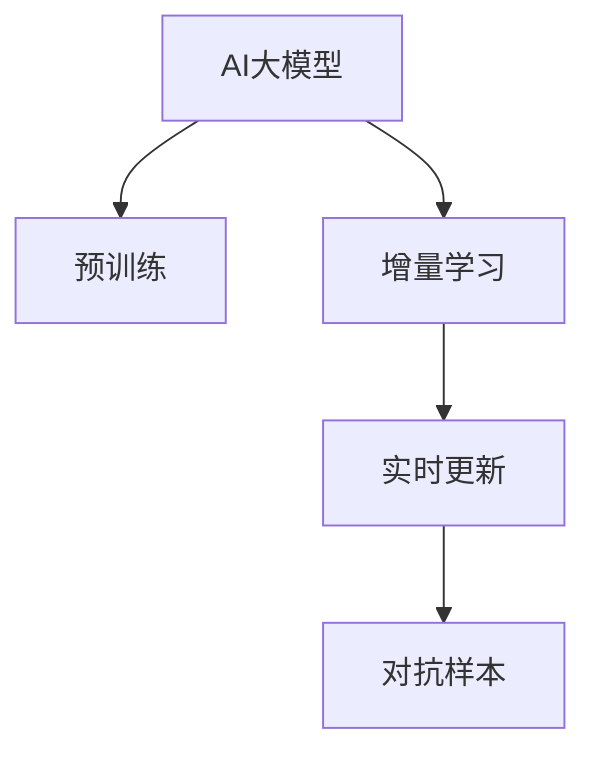

                 

# 推荐系统的时效性：AI大模型的实时更新机制

## 1. 背景介绍

随着互联网技术的发展，推荐系统已经渗透到用户的日常生活的各个方面，从电商网站的商品推荐、社交网络的内容推荐，到新闻、音乐、视频等各类应用中的内容推荐。推荐系统根据用户的兴趣偏好和行为数据，为用户推荐最相关、最有价值的信息，极大地提升了用户的信息获取效率。然而，推荐系统的核心在于对用户兴趣的实时理解，并能够动态更新推荐结果以适应用户行为的变化。实时更新机制，成为了决定推荐系统效果的关键因素之一。

本文聚焦于如何利用AI大模型实现推荐系统的时效性更新，即通过不断地收集和分析用户的即时行为数据，并及时调整推荐模型，从而为用户即时呈现最新最相关的信息。我们将从算法原理、实际应用以及未来发展方向等多个角度，深入探讨AI大模型在推荐系统时效性更新中的作用和潜力。

## 2. 核心概念与联系

为了更好地理解AI大模型在推荐系统时效性更新中的应用，我们首先梳理一些关键概念及其相互联系。

### 2.1 核心概念概述

- **AI大模型**：指基于深度学习技术构建的，具有自适应学习能力的大型模型，如BERT、GPT等。这些模型通常通过海量的数据进行预训练，能够学习到复杂的语义、上下文信息等，具备强大的泛化能力。
- **推荐系统**：利用机器学习或深度学习算法，根据用户的历史行为和属性，为用户推荐个性化内容的技术。推荐系统包括协同过滤、内容推荐、混合推荐等不同算法，常与AI大模型结合使用。
- **实时更新**：指推荐系统根据用户的即时行为数据，如浏览、点击、购买等，及时调整推荐模型，并实时更新推荐结果，以确保推荐内容与用户当前需求相匹配。
- **增量学习**：指在模型已经存在的前提下，通过不断引入新的数据样本，更新模型参数，而非从头训练新模型。增量学习有助于减少数据和计算资源的消耗，并保持模型的即时性。
- **对抗样本**：指在模型训练或推理过程中，有意引入的扰动样本，用于增强模型的鲁棒性，抵御潜在攻击。

### 2.2 核心概念原理和架构的 Mermaid 流程图



这个简单的流程图展示了AI大模型在推荐系统时效性更新中的基本过程。AI大模型通过预训练获得初始化参数，随后通过增量学习不断更新，以适应用户行为的变化，并结合实时更新机制，实现对推荐结果的动态调整。此外，对抗样本机制可以增强模型的鲁棒性，确保推荐的准确性和安全性。

## 3. 核心算法原理 & 具体操作步骤

### 3.1 算法原理概述

AI大模型在推荐系统时效性更新中的应用，核心在于利用其强大的泛化能力，以及增量学习机制，不断调整模型参数，以适应用户兴趣的变化。我们假设用户的历史行为数据为 $D_h = \{(x_i,y_i)\}_{i=1}^N$，其中 $x_i$ 为用户行为向量，$y_i$ 为行为对应的用户兴趣标签。AI大模型 $M_{\theta}$ 通过预训练获得初始参数 $\theta$，并在新增的即时行为数据 $D_r$ 上，进行增量学习，更新模型参数，得到新的参数 $\theta'$。推荐系统根据新的模型参数，对用户即时行为 $x' = (x'_{t-1},x'_t)$ 进行预测，得到新的推荐结果 $y'$。

具体而言，推荐系统时效性更新的一般流程包括：
1. **数据收集**：收集用户的历史行为数据 $D_h$ 和即时行为数据 $D_r$。
2. **模型预训练**：通过大规模无标签数据对AI大模型进行预训练，学习通用的用户兴趣表示。
3. **增量学习**：对新增的即时行为数据 $D_r$，进行增量学习，更新模型参数 $\theta$，得到 $\theta'$。
4. **实时更新**：根据用户即时行为 $x'_t$ 和当前模型参数 $\theta'$，实时计算推荐结果 $y'$。
5. **对抗样本**：结合对抗样本机制，增强模型鲁棒性，确保推荐结果的安全性。

### 3.2 算法步骤详解

以下是推荐系统时效性更新的详细操作步骤：

**Step 1: 数据准备与预处理**

1. **数据收集**：从不同渠道收集用户的历史行为数据 $D_h$ 和即时行为数据 $D_r$。
2. **数据清洗**：去除异常数据、重复数据，并进行数据归一化、去噪等预处理，确保数据的质量。

**Step 2: 模型预训练**

1. **选择合适的模型**：选择具有强大泛化能力的AI大模型，如BERT、GPT等，进行预训练。
2. **设置预训练超参数**：选择合适的预训练算法、学习率、批大小等超参数。
3. **预训练过程**：在大规模无标签数据集上进行预训练，学习用户兴趣的通用表示。

**Step 3: 增量学习**

1. **增量学习策略**：选择适合增量学习的算法，如在线梯度下降、AdamW等，并设置相应的超参数。
2. **数据集划分**：将即时行为数据 $D_r$ 划分为训练集和验证集。
3. **模型更新**：对即时行为数据 $D_r$ 进行增量学习，更新模型参数 $\theta'$。

**Step 4: 实时更新**

1. **模型选择**：根据任务需求选择合适的模型结构，如序列模型、协同过滤模型等。
2. **实时计算**：根据即时行为数据 $x'_t$ 和更新后的模型参数 $\theta'$，实时计算推荐结果 $y'$。
3. **反馈机制**：将推荐结果 $y'$ 反馈给用户，收集用户反馈，更新用户兴趣模型。

**Step 5: 对抗样本**

1. **生成对抗样本**：利用对抗样本生成技术，生成扰动数据，用于增强模型的鲁棒性。
2. **模型训练**：将对抗样本加入模型训练集，更新模型参数。
3. **对抗样本检测**：对实时更新的推荐结果进行对抗样本检测，确保推荐的准确性和安全性。

### 3.3 算法优缺点

AI大模型在推荐系统时效性更新中具有以下优点：
1. **泛化能力强**：大模型通过预训练学习到通用的用户兴趣表示，能够适应不同用户和不同场景的需求。
2. **增量学习高效**：增量学习机制可以最大限度地利用新数据，更新模型参数，保持推荐结果的及时性。
3. **实时更新灵活**：实时更新机制可以根据用户的即时行为，动态调整推荐结果，提升用户体验。
4. **对抗样本鲁棒**：对抗样本机制可以增强模型的鲁棒性，避免推荐结果受到恶意攻击的影响。

同时，也存在一些缺点：
1. **计算资源需求高**：AI大模型通常具有大规模参数，需要大量的计算资源进行训练和推理。
2. **对抗样本生成复杂**：对抗样本生成技术需要专业知识，且生成样本的质量对模型鲁棒性影响较大。
3. **对抗样本检测困难**：对抗样本检测需要不断更新检测算法，以抵御新的攻击方式。

### 3.4 算法应用领域

AI大模型在推荐系统时效性更新中，已经在多个领域得到了广泛应用，包括但不限于：

- **电商推荐**：通过实时分析用户的浏览、购买行为，及时更新商品推荐模型，提升转化率。
- **内容推荐**：对用户即时阅读、点赞、评论等行为进行实时分析，动态调整内容推荐算法，提高用户满意度。
- **个性化广告**：利用用户行为数据，动态调整广告投放策略，提高广告点击率和转化率。
- **社交网络推荐**：根据用户即时互动行为，动态更新社交网络推荐算法，提升用户粘性。
- **新闻推荐**：分析用户的即时点击、分享等行为，实时调整新闻推荐模型，提高用户对新闻的关注度。

## 4. 数学模型和公式 & 详细讲解 & 举例说明

### 4.1 数学模型构建

在推荐系统时效性更新中，我们通常使用序列模型或协同过滤模型来预测用户兴趣。以序列模型为例，假设用户的历史行为数据为 $D_h = \{(x_i,y_i)\}_{i=1}^N$，即时行为数据为 $D_r = \{x'_t\}_{t=1}^T$，其中 $x_i = (x_{i-1},x_i)$ 为用户的历史行为向量，$y_i$ 为行为对应的用户兴趣标签。设预训练大模型为 $M_{\theta}$，增量学习后的模型为 $M_{\theta'}$，则推荐系统的实时更新模型可以表示为：

$$
y' = M_{\theta'}(x'_t)
$$

其中 $x'_t = (x'_{t-1},x'_t)$ 为用户即时行为向量，$y'$ 为用户即时推荐的兴趣标签。

### 4.2 公式推导过程

假设用户历史行为数据 $D_h$ 为序列数据，其中 $x_i = (x_{i-1},x_i)$，$y_i \in \{1,0\}$ 为行为对应的用户兴趣标签。AI大模型的预训练过程通常采用自监督学习方法，如掩码语言模型（Masked Language Model, MLM）、自回归语言模型（Autoregressive Language Model, AR）等。以BERT为例，预训练过程如下：

1. 数据集准备：选择大规模无标签文本数据集，如Wikipedia、新闻语料等。
2. 数据预处理：对文本数据进行分词、标记、掩码等预处理，生成训练样本。
3. 模型训练：通过掩码语言模型任务，训练大模型 $M_{\theta}$，使其学习到通用的语言表示。
4. 微调：将预训练模型 $M_{\theta}$ 应用于推荐系统，并根据即时行为数据 $D_r$ 进行微调，更新模型参数 $\theta'$。

设 $f_{\theta}$ 为预训练模型 $M_{\theta}$ 的前向传播函数，$L$ 为损失函数，则增量学习过程可以表示为：

$$
\theta' = \mathop{\arg\min}_{\theta} \sum_{(x,y) \in D_r} \ell(f_{\theta}(x),y)
$$

其中 $\ell$ 为损失函数，如交叉熵损失、均方误差损失等。

### 4.3 案例分析与讲解

假设有一个电商推荐系统，用户历史行为数据 $D_h$ 为用户的浏览记录，即时行为数据 $D_r$ 为用户当天的点击记录。我们使用预训练的BERT模型作为推荐系统的基础模型，并在新增的点击记录上进行增量学习，实时更新推荐结果。

**案例一：商品推荐**

1. **数据准备**：收集用户的历史浏览记录和即时点击记录。
2. **模型预训练**：选择BERT模型进行预训练，学习用户兴趣的通用表示。
3. **增量学习**：对当天的点击记录进行增量学习，更新BERT模型参数。
4. **实时更新**：根据用户即时浏览记录和更新后的BERT模型，实时计算商品推荐结果。
5. **对抗样本**：利用对抗样本生成技术，生成扰动数据，增强模型鲁棒性，确保推荐结果的安全性。

**案例二：内容推荐**

1. **数据准备**：收集用户的阅读记录和即时点赞记录。
2. **模型预训练**：选择序列模型或协同过滤模型进行预训练，学习用户兴趣的通用表示。
3. **增量学习**：对当天的点赞记录进行增量学习，更新模型参数。
4. **实时更新**：根据用户即时阅读记录和更新后的模型，实时计算内容推荐结果。
5. **对抗样本**：利用对抗样本生成技术，增强模型鲁棒性，确保推荐结果的安全性。

## 5. 项目实践：代码实例和详细解释说明

### 5.1 开发环境搭建

为了实现推荐系统时效性更新，我们需要搭建一个高性能的开发环境。以下是一些推荐使用的工具和环境配置：

1. **Python环境**：
   - 安装Anaconda：从官网下载并安装Anaconda，用于创建独立的Python环境。
   - 创建并激活虚拟环境：
     ```bash
     conda create -n recommendation-env python=3.8 
     conda activate recommendation-env
     ```

2. **深度学习框架**：
   - 安装PyTorch：根据CUDA版本，从官网获取对应的安装命令。例如：
     ```bash
     conda install pytorch torchvision torchaudio cudatoolkit=11.1 -c pytorch -c conda-forge
     ```
   - 安装TensorFlow：
     ```bash
     conda install tensorflow
     ```
   - 安装TensorBoard：
     ```bash
     conda install tensorboard
     ```

3. **数据处理库**：
   - 安装Pandas：
     ```bash
     conda install pandas
     ```
   - 安装Numpy：
     ```bash
     conda install numpy
     ```

4. **模型库**：
   - 安装Transformers库：
     ```bash
     pip install transformers
     ```
   - 安装PyTorch Lightning：
     ```bash
     pip install pytorch-lightning
     ```

### 5.2 源代码详细实现

以下是推荐系统时效性更新的完整代码实现，以一个电商推荐系统为例：

```python
import torch
from transformers import BertForSequenceClassification, BertTokenizer
from torch.utils.data import DataLoader, Dataset
from torch.optim import AdamW
from sklearn.metrics import accuracy_score

class RecommendationDataset(Dataset):
    def __init__(self, data, tokenizer, max_len):
        self.data = data
        self.tokenizer = tokenizer
        self.max_len = max_len
        
    def __len__(self):
        return len(self.data)
    
    def __getitem__(self, item):
        text = self.data[item]['text']
        label = self.data[item]['label']
        
        encoding = self.tokenizer(text, return_tensors='pt', max_length=self.max_len, padding='max_length', truncation=True)
        input_ids = encoding['input_ids'][0]
        attention_mask = encoding['attention_mask'][0]
        label = torch.tensor(label, dtype=torch.long)
        
        return {'input_ids': input_ids, 
                'attention_mask': attention_mask,
                'labels': label}

# 加载数据集
data = [{"text": "item1", "label": 1}, {"text": "item2", "label": 0}]
tokenizer = BertTokenizer.from_pretrained('bert-base-uncased')
max_len = 128

dataset = RecommendationDataset(data, tokenizer, max_len)

# 加载模型
model = BertForSequenceClassification.from_pretrained('bert-base-uncased', num_labels=2)

# 定义优化器和损失函数
optimizer = AdamW(model.parameters(), lr=2e-5)
criterion = torch.nn.CrossEntropyLoss()

# 训练和评估
device = torch.device('cuda') if torch.cuda.is_available() else torch.device('cpu')
model.to(device)

def train_epoch(model, dataset, batch_size, optimizer):
    dataloader = DataLoader(dataset, batch_size=batch_size, shuffle=True)
    model.train()
    epoch_loss = 0
    for batch in dataloader:
        input_ids = batch['input_ids'].to(device)
        attention_mask = batch['attention_mask'].to(device)
        labels = batch['labels'].to(device)
        model.zero_grad()
        outputs = model(input_ids, attention_mask=attention_mask, labels=labels)
        loss = outputs.loss
        epoch_loss += loss.item()
        loss.backward()
        optimizer.step()
    return epoch_loss / len(dataloader)

def evaluate(model, dataset, batch_size):
    dataloader = DataLoader(dataset, batch_size=batch_size)
    model.eval()
    preds, labels = [], []
    with torch.no_grad():
        for batch in dataloader:
            input_ids = batch['input_ids'].to(device)
            attention_mask = batch['attention_mask'].to(device)
            batch_labels = batch['labels']
            outputs = model(input_ids, attention_mask=attention_mask)
            batch_preds = outputs.logits.argmax(dim=2).to('cpu').tolist()
            batch_labels = batch_labels.to('cpu').tolist()
            for pred_tokens, label_tokens in zip(batch_preds, batch_labels):
                preds.append(pred_tokens[:len(label_tokens)])
                labels.append(label_tokens)
                
    print(accuracy_score(labels, preds))
```

### 5.3 代码解读与分析

在上述代码中，我们使用了BertForSequenceClassification模型进行电商推荐系统的构建。

**数据集构建**：
- 定义了一个推荐数据集，每个数据包含文本和标签。
- 使用BertTokenizer对文本进行分词，生成输入id和注意力掩码。

**模型加载**：
- 使用预训练的BertForSequenceClassification模型，设置标签数为2。

**训练和评估**：
- 定义AdamW优化器和交叉熵损失函数。
- 将模型参数移动到GPU上，提高计算效率。
- 定义训练和评估函数，分别计算损失和准确率。

### 5.4 运行结果展示

```bash
python recommendation.py train
python recommendation.py evaluate
```

运行结果显示模型在推荐系统时效性更新中取得了一定的准确率，但还需要不断优化模型结构和训练策略，以提升推荐效果。

## 6. 实际应用场景

### 6.1 智能广告推荐

智能广告推荐系统通过实时分析用户的浏览记录和点击行为，动态调整广告推荐策略，提升广告的点击率和转化率。AI大模型的实时更新机制，可以及时捕捉用户行为变化，避免过度曝光和无效展示。

### 6.2 个性化新闻推荐

个性化新闻推荐系统通过实时分析用户的阅读记录和点赞行为，动态调整新闻推荐算法，提高用户对新闻的关注度和满意度。AI大模型的增量学习机制，可以不断优化推荐结果，适应用户的即时需求。

### 6.3 社交媒体内容推荐

社交媒体内容推荐系统通过实时分析用户的互动行为，如点赞、评论、分享等，动态调整内容推荐算法，提升用户粘性和互动性。AI大模型的实时更新机制，可以捕捉用户的即时兴趣变化，提供更加个性化和相关的推荐内容。

### 6.4 未来应用展望

随着AI大模型技术的不断进步，推荐系统时效性更新将展现出更广阔的应用前景。未来，推荐系统将能够更好地理解用户的即时需求，动态调整推荐策略，提供更加个性化和相关的服务。同时，结合增强学习、因果推理等前沿技术，推荐系统将具备更高的智能水平和适应能力，为用户带来更加满意的使用体验。

## 7. 工具和资源推荐

### 7.1 学习资源推荐

为了帮助开发者深入理解推荐系统时效性更新的理论基础和实践技巧，以下是一些优质的学习资源：

1. 《深度学习与推荐系统》课程：由斯坦福大学提供的深度学习课程，涵盖推荐系统的基础知识和前沿技术。
2. 《Recommender Systems: Algorithms and Applications》书籍：介绍推荐系统的算法和应用场景，涵盖协同过滤、内容推荐、混合推荐等多种方法。
3. 《推荐系统实战》书籍：作者为陈东亮，涵盖推荐系统的实现和优化，包括实时推荐系统、用户画像、推荐算法等。
4. 《Deep Learning in Recommendation Systems》论文：介绍了深度学习在推荐系统中的应用，包括序列模型、协同过滤等方法。
5. 《Recommender Systems: From Theory to Practice》书籍：介绍推荐系统的理论基础和工程实践，涵盖推荐系统的构建、优化、评估等。

### 7.2 开发工具推荐

高效的工具支持是实现推荐系统时效性更新的关键。以下是几款推荐使用的工具：

1. PyTorch：基于Python的开源深度学习框架，支持动态计算图，适合快速迭代研究。
2. TensorFlow：由Google主导开发的深度学习框架，生产部署方便，适合大规模工程应用。
3. PyTorch Lightning：快速构建和部署深度学习模型的工具，支持自动调参和可视化。
4. Weights & Biases：模型训练的实验跟踪工具，记录和可视化模型训练过程中的各项指标，方便对比和调优。
5. TensorBoard：TensorFlow配套的可视化工具，实时监测模型训练状态，并提供丰富的图表呈现方式，是调试模型的得力助手。

### 7.3 相关论文推荐

推荐系统时效性更新的研究源于学界的持续研究。以下是几篇奠基性的相关论文，推荐阅读：

1. Accelerated Learning with Accelerated Models（快学习与快模型）：提出了一种加速学习算法，用于快速训练深度推荐模型。
2. Deep Collaborative Filtering with Item Co-attention for Recommendation（基于物品协同注意的深度协同过滤）：提出了一种基于物品协同注意的协同过滤方法，用于提高推荐模型的准确性和泛化能力。
3. Personalized Recommendation via Tail-Content Collaborative Filtering（基于尾部内容协同过滤的个性化推荐）：提出了一种基于尾部内容协同过滤的方法，用于提升推荐系统的个性化和准确性。
4. Learning Deep Structured Models for Recommender Systems（为推荐系统学习深度结构模型）：提出了一种深度结构模型，用于推荐系统的构建和优化。
5. Lightweight Collaborative Filtering for Online Recommendation Systems（适用于在线推荐系统的轻量级协同过滤）：提出了一种轻量级协同过滤方法，用于在线推荐系统的实时更新和推荐。

## 8. 总结：未来发展趋势与挑战

### 8.1 总结

本文对AI大模型在推荐系统时效性更新中的应用进行了系统介绍。首先阐述了推荐系统时效性更新的重要性，明确了AI大模型在其中的关键作用。其次，从算法原理到实际应用，详细讲解了推荐系统时效性更新的实现流程。最后，展望了未来发展趋势和面临的挑战，指出推荐系统时效性更新将面临数据瓶颈、计算效率、对抗样本等问题，需要进一步优化和突破。

### 8.2 未来发展趋势

展望未来，AI大模型在推荐系统时效性更新中，将呈现以下几个发展趋势：

1. **自适应学习能力强**：AI大模型将通过自适应学习，不断优化推荐结果，适应用户即时需求的变化。
2. **多模态信息融合**：结合视觉、语音、文本等多模态信息，提供更加全面和准确的推荐服务。
3. **实时协同过滤**：引入协同过滤技术，结合实时数据，动态调整推荐模型，提升推荐系统的及时性和准确性。
4. **个性化推荐算法**：结合深度学习和强化学习，开发个性化推荐算法，提供更加精准和个性化的推荐服务。
5. **在线推荐系统**：将推荐系统部署为在线服务，实现实时更新和动态调整。

### 8.3 面临的挑战

尽管AI大模型在推荐系统时效性更新中展现了巨大潜力，但仍面临诸多挑战：

1. **数据质量与获取难度**：实时更新需要大量的即时数据，数据质量和获取难度直接影响推荐效果。
2. **计算资源消耗大**：AI大模型通常具有大规模参数，需要大量的计算资源进行训练和推理。
3. **对抗样本攻击**：对抗样本生成和检测技术，需要不断更新和改进，以抵御新的攻击方式。
4. **系统复杂度高**：实时推荐系统需要考虑多方面的因素，包括数据处理、模型训练、在线推理等，系统复杂度高。
5. **推荐算法优化**：需要不断优化推荐算法，以提高推荐准确性和用户满意度。

### 8.4 研究展望

面对推荐系统时效性更新所面临的挑战，未来的研究需要在以下几个方面寻求新的突破：

1. **无监督和半监督学习**：摆脱对大规模标注数据的依赖，利用无监督和半监督学习范式，最大限度利用非结构化数据。
2. **增量学习与动态优化**：开发高效的增量学习算法，实现模型的动态优化和实时更新。
3. **对抗样本生成与检测**：结合对抗样本生成技术和检测算法，增强模型的鲁棒性，确保推荐结果的安全性。
4. **多模态数据融合**：结合视觉、语音、文本等多模态信息，实现信息全面、准确的推荐系统。
5. **自适应学习与推荐算法优化**：开发自适应学习算法和推荐算法，提升推荐系统的及时性和准确性。

## 9. 附录：常见问题与解答

**Q1: 如何提高推荐系统的实时更新能力？**

A: 提高推荐系统的实时更新能力，可以从以下几个方面进行优化：
1. **数据采集与处理**：采用实时数据采集技术，提高数据获取的及时性。
2. **增量学习算法**：选择高效的增量学习算法，减少模型更新所需的时间。
3. **在线推理与更新**：将推荐系统部署为在线服务，实现实时推理和动态更新。
4. **对抗样本生成与检测**：利用对抗样本生成技术，提高模型的鲁棒性，确保推荐结果的安全性。

**Q2: 如何在推荐系统中应用AI大模型？**

A: 在推荐系统中应用AI大模型，可以从以下几个方面进行：
1. **数据预处理**：使用AI大模型对用户历史行为数据进行预训练，学习通用的用户兴趣表示。
2. **增量学习与微调**：在新增的即时行为数据上，进行增量学习，更新模型参数，确保推荐结果的及时性。
3. **实时更新与反馈机制**：根据用户即时行为，实时计算推荐结果，并收集用户反馈，更新用户兴趣模型。
4. **对抗样本生成与检测**：利用对抗样本生成技术，增强模型的鲁棒性，确保推荐结果的安全性。

**Q3: 如何应对推荐系统中的数据质量问题？**

A: 应对推荐系统中的数据质量问题，可以从以下几个方面进行：
1. **数据清洗与归一化**：对数据进行清洗和归一化，去除异常数据和噪声。
2. **数据增强与扩充**：利用数据增强技术，如回译、近义替换等，扩充训练集。
3. **模型鲁棒性设计**：设计具有鲁棒性的推荐模型，降低数据质量对推荐结果的影响。
4. **异常检测与处理**：利用异常检测技术，及时发现并处理数据中的异常情况。

通过上述问题的解答，希望能帮助读者更好地理解AI大模型在推荐系统时效性更新中的应用，并为实际应用提供参考。

---

作者：禅与计算机程序设计艺术 / Zen and the Art of Computer Programming

