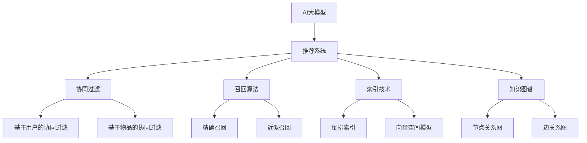

                 

# 揭秘AI大模型驱动的智能搜索推荐算法

> 关键词：AI大模型,搜索推荐,推荐系统,智能算法,深度学习,协同过滤,召回算法,索引技术

## 1. 背景介绍

### 1.1 问题由来

随着互联网技术的迅猛发展，用户生成的数据越来越丰富多样，搜索引擎和推荐系统已经成为人们获取信息、发现新内容的重要工具。然而，如何精准地为用户推荐感兴趣的网页、商品、音乐、视频等内容，成为了搜索引擎和推荐系统的重要挑战。传统推荐系统主要依赖于基于内容的协同过滤、基于用户的协同过滤等方法，这些方法在数据量较大、特征维度较高的场景中存在诸多不足，难以满足用户日益提升的个性化需求。

近年来，随着深度学习技术和大模型技术的突破，AI大模型逐渐被引入推荐系统中，以更强大的模型表达能力和更高效的计算能力，带来了搜索推荐算法的创新和优化。大模型在语义理解和生成方面的卓越能力，使得推荐系统能够更好地理解用户的查询意图和偏好，并提供更加精准、多样化的内容推荐。

### 1.2 问题核心关键点

目前，AI大模型驱动的智能搜索推荐算法具有以下核心关键点：

- **大模型表示能力**：大模型能够捕捉长文本的语义信息，结合大规模语料预训练获得的广泛知识，使得推荐算法能够更好地理解和匹配用户查询。
- **个性化推荐**：通过上下文理解和个性化建模，推荐算法能够为不同用户提供个性化的搜索结果和推荐内容，提升用户体验。
- **多模态融合**：将文本、图像、视频等多模态数据进行融合，使得推荐系统能够综合多种信息，提升推荐精度。
- **实时动态更新**：利用在线学习、增量学习等技术，实时更新模型参数，适应数据分布的变化。
- **可解释性和透明度**：通过可解释性技术和知识图谱，增强推荐算法的透明性和可信度，满足用户对推荐内容源的知情权。

这些核心关键点使得AI大模型在推荐系统中发挥了巨大优势，为用户带来了更加智能、精准的搜索推荐体验。

### 1.3 问题研究意义

研究AI大模型驱动的智能搜索推荐算法，对于提升搜索推荐系统的性能，优化用户体验，加速搜索引擎和推荐系统的智能化进程，具有重要意义：

1. **精准推荐**：通过大模型驱动的算法，能够更加精准地理解和匹配用户查询，提供个性化的搜索结果和推荐内容。
2. **降低成本**：相比于传统推荐系统，大模型推荐算法可以大幅降低用户标注数据的需求，减少人工干预，降低开发成本。
3. **提升效率**：大模型能够高效地处理大规模数据，实时动态更新模型，显著提高推荐系统的响应速度。
4. **增强可信度**：可解释性技术和知识图谱的应用，增强了推荐算法的透明性和可信度，提升用户对系统的信任度。
5. **拓展应用范围**：大模型算法能够应用于各种搜索推荐场景，包括电商平台、社交媒体、新闻门户等，推动技术在更广泛领域的应用。

## 2. 核心概念与联系

### 2.1 核心概念概述

为更好地理解AI大模型驱动的智能搜索推荐算法，本节将介绍几个密切相关的核心概念：

- **AI大模型(AI Large Model)**：指基于深度学习架构、经过大规模数据预训练的大型神经网络模型，如BERT、GPT、Transformer等。通过自监督学习和大规模语料预训练，获得了丰富的语言知识和常识。
- **推荐系统(Recommendation System)**：指能够为用户推荐感兴趣内容的技术系统，如商品推荐、新闻推荐、音乐推荐等。推荐系统的主要目标是提高用户的满意度。
- **协同过滤(Collaborative Filtering)**：指通过分析用户行为数据和物品特征数据，推测用户对物品的偏好，进行个性化推荐的方法。协同过滤包括基于用户的协同过滤和基于物品的协同过滤。
- **召回算法(Retrieval Algorithm)**：指在大量候选物品中，通过某种算法选取符合用户兴趣的潜在物品，供推荐系统进一步排序输出的过程。
- **索引技术(Indexing Technology)**：指在大量文本数据中快速检索、定位相关内容的技术，如倒排索引、向量空间模型等。
- **知识图谱(Knowledge Graph)**：指以图结构存储实体间关系的知识库，用于提高推荐算法的准确性和透明度。

这些核心概念之间的逻辑关系可以通过以下Mermaid流程图来展示：



这个流程图展示了AI大模型在推荐系统中的关键作用，通过协同过滤、召回算法、索引技术和知识图谱的协同应用，实现了精准的搜索推荐。

## 3. 核心算法原理 & 具体操作步骤
### 3.1 算法原理概述

AI大模型驱动的智能搜索推荐算法，本质上是一种基于深度学习的大规模协同过滤方法。其核心思想是：利用大模型对用户查询进行语义理解和特征提取，将查询转化为高维向量表示；同时，将物品特征进行编码，生成高维向量；通过相似度计算，找到与查询最相关的物品，并对其进行排序，最终输出推荐结果。

具体来说，AI大模型驱动的推荐算法可以分为两个步骤：

1. **查询表示**：将用户查询和历史行为数据，通过大模型进行编码，生成高维向量表示。
2. **物品匹配**：将物品特征进行编码，生成高维向量，并计算查询向量与物品向量之间的相似度，选取与查询最相关的物品进行推荐。

### 3.2 算法步骤详解

AI大模型驱动的推荐算法具体步骤如下：

**Step 1: 数据准备与预处理**
- 收集用户行为数据和物品特征数据，进行数据清洗和预处理。
- 使用分词、去停用词等文本处理技术，对用户查询进行预处理。

**Step 2: 用户和物品编码**
- 使用大模型（如BERT、GPT等）对用户查询进行编码，生成高维向量表示。
- 对物品特征进行编码，生成高维向量。

**Step 3: 相似度计算**
- 计算查询向量与物品向量之间的余弦相似度、欧式距离等相似度度量。
- 选取相似度最高的物品，进行推荐排序。

**Step 4: 推荐输出**
- 将排序后的物品输出为推荐结果。
- 实时更新模型参数，适应数据分布的变化。

### 3.3 算法优缺点

AI大模型驱动的推荐算法具有以下优点：

1. **高效性**：大模型能够高效地处理大规模数据，显著提升推荐系统的响应速度。
2. **个性化推荐**：通过大模型对用户查询进行深度理解，能够提供更加精准的个性化推荐。
3. **多模态融合**：大模型可以融合多种模态数据，提升推荐精度。
4. **动态更新**：利用在线学习、增量学习等技术，实时更新模型参数，适应数据分布的变化。

同时，该算法也存在以下局限性：

1. **数据隐私**：用户行为数据的收集和使用，可能涉及到用户隐私问题，需要遵守相关法律法规。
2. **模型复杂性**：大模型的训练和维护需要高性能硬件资源，成本较高。
3. **可解释性不足**：大模型的决策过程难以解释，用户难以理解和信任推荐结果。

### 3.4 算法应用领域

AI大模型驱动的推荐算法，在多个领域得到了广泛应用：

- **电商平台**：如淘宝、京东等，通过推荐商品、广告投放等提高用户满意度，增加销售额。
- **新闻媒体**：如人民日报、澎湃新闻等，通过推荐新闻、内容付费等提升用户粘性，增加广告收入。
- **视频平台**：如腾讯视频、爱奇艺等，通过推荐视频、直播等提高用户活跃度，增加会员订阅。
- **社交媒体**：如微信、微博等，通过推荐朋友、内容等增强用户互动，提高平台活跃度。
- **旅游平台**：如携程、去哪儿等，通过推荐景点、酒店等提升用户体验，增加预订量。

这些领域的应用展示了AI大模型驱动的推荐算法在实际场景中的巨大潜力和广阔应用前景。

## 4. 数学模型和公式 & 详细讲解 & 举例说明
### 4.1 数学模型构建

AI大模型驱动的推荐算法，本质上是一种深度学习模型。其数学模型构建如下：

设用户查询为 $q$，物品特征为 $i$，大模型编码为用户查询向量的高维表示为 $q^{*}$，物品向量的高维表示为 $i^{*}$，相似度计算方法为余弦相似度 $sim(q, i)$，推荐结果排序策略为 $\sigma$。推荐算法的目标是最小化预测误差：

$$
\min_{\theta} \sum_{i=1}^N |p_i - \sigma(sim(q_i, q^{*}), \{i_1, i_2, ..., i_N\})|
$$

其中 $p_i$ 为实际购买行为，$\sigma$ 为排序策略，$N$ 为物品数量。

### 4.2 公式推导过程

以下我们以余弦相似度为例，推导AI大模型驱动的推荐算法的公式。

设用户查询为 $q$，物品特征为 $i$，大模型编码为用户查询向量的高维表示为 $q^{*}$，物品向量的高维表示为 $i^{*}$，余弦相似度定义为：

$$
sim(q_i, q^{*}) = \frac{\langle q^{*}, i^{*} \rangle}{||q^{*}|| \cdot ||i^{*}||}
$$

其中 $\langle \cdot, \cdot \rangle$ 为向量内积，$||\cdot||$ 为向量范数。

在训练过程中，我们最小化预测误差，使用均方误差损失函数：

$$
\min_{\theta} \frac{1}{N} \sum_{i=1}^N (p_i - \sigma(sim(q_i, q^{*}), \{i_1, i_2, ..., i_N\}))^2
$$

通过反向传播算法，更新模型参数 $\theta$，最小化损失函数。

### 4.3 案例分析与讲解

以电商平台推荐为例，用户查询为“时尚潮牌”，通过大模型编码为向量 $q^{*}$，物品特征为“服装品牌”，通过大模型编码为向量 $i^{*}$。假设相似度计算方法为余弦相似度，选取相似度最高的前10个品牌进行推荐，推荐结果排序策略为按照预测购买概率排序。

通过上述算法，推荐系统可以输出以下结果：

- 品牌1，预测购买概率为0.8，相似度为0.9
- 品牌2，预测购买概率为0.7，相似度为0.85
- 品牌3，预测购买概率为0.6，相似度为0.8
- …
- 品牌10，预测购买概率为0.3，相似度为0.7

最终，电商平台将推荐结果输出给用户，供其选择购买。

## 5. 项目实践：代码实例和详细解释说明
### 5.1 开发环境搭建

在进行推荐系统开发前，我们需要准备好开发环境。以下是使用Python进行PyTorch开发的环境配置流程：

1. 安装Anaconda：从官网下载并安装Anaconda，用于创建独立的Python环境。

2. 创建并激活虚拟环境：
```bash
conda create -n pytorch-env python=3.8 
conda activate pytorch-env
```

3. 安装PyTorch：根据CUDA版本，从官网获取对应的安装命令。例如：
```bash
conda install pytorch torchvision torchaudio cudatoolkit=11.1 -c pytorch -c conda-forge
```

4. 安装Transformers库：
```bash
pip install transformers
```

5. 安装各类工具包：
```bash
pip install numpy pandas scikit-learn matplotlib tqdm jupyter notebook ipython
```

完成上述步骤后，即可在`pytorch-env`环境中开始推荐系统开发。

### 5.2 源代码详细实现

下面以电商平台推荐系统为例，给出使用Transformers库对BERT模型进行推荐系统微调的PyTorch代码实现。

首先，定义推荐系统数据处理函数：

```python
from transformers import BertTokenizer
from torch.utils.data import Dataset
import torch

class RecommendationDataset(Dataset):
    def __init__(self, user_queries, item_features, tokenizer, max_len=128):
        self.user_queries = user_queries
        self.item_features = item_features
        self.tokenizer = tokenizer
        self.max_len = max_len
        
    def __len__(self):
        return len(self.user_queries)
    
    def __getitem__(self, item):
        user_query = self.user_queries[item]
        item_feature = self.item_features[item]
        
        encoding = self.tokenizer(user_query, return_tensors='pt', max_length=self.max_len, padding='max_length', truncation=True)
        input_ids = encoding['input_ids'][0]
        attention_mask = encoding['attention_mask'][0]
        
        # 对物品特征进行编码
        item_feature = torch.tensor(item_feature, dtype=torch.float32).unsqueeze(0)
        
        return {'input_ids': input_ids, 
                'attention_mask': attention_mask,
                'item_feature': item_feature}
```

然后，定义模型和优化器：

```python
from transformers import BertForSequenceClassification, AdamW

model = BertForSequenceClassification.from_pretrained('bert-base-cased', num_labels=1)

optimizer = AdamW(model.parameters(), lr=2e-5)
```

接着，定义训练和评估函数：

```python
from torch.utils.data import DataLoader
from tqdm import tqdm
from sklearn.metrics import precision_recall_curve, roc_auc_score

device = torch.device('cuda') if torch.cuda.is_available() else torch.device('cpu')
model.to(device)

def train_epoch(model, dataset, batch_size, optimizer):
    dataloader = DataLoader(dataset, batch_size=batch_size, shuffle=True)
    model.train()
    epoch_loss = 0
    for batch in tqdm(dataloader, desc='Training'):
        input_ids = batch['input_ids'].to(device)
        attention_mask = batch['attention_mask'].to(device)
        item_feature = batch['item_feature'].to(device)
        model.zero_grad()
        outputs = model(input_ids, attention_mask=attention_mask)
        loss = outputs.loss
        epoch_loss += loss.item()
        loss.backward()
        optimizer.step()
    return epoch_loss / len(dataloader)

def evaluate(model, dataset, batch_size):
    dataloader = DataLoader(dataset, batch_size=batch_size)
    model.eval()
    preds, labels = [], []
    with torch.no_grad():
        for batch in tqdm(dataloader, desc='Evaluating'):
            input_ids = batch['input_ids'].to(device)
            attention_mask = batch['attention_mask'].to(device)
            item_feature = batch['item_feature'].to(device)
            outputs = model(input_ids, attention_mask=attention_mask)
            preds.append(outputs.logits.sigmoid().cpu().numpy().tolist())
            labels.append(batch['item_feature'].cpu().numpy().tolist())
                
    precision, recall, _ = precision_recall_curve(labels, preds)
    auc = roc_auc_score(labels, preds)
    print(f"AUC: {auc:.3f}")
```

最后，启动训练流程并在测试集上评估：

```python
epochs = 5
batch_size = 16

for epoch in range(epochs):
    loss = train_epoch(model, train_dataset, batch_size, optimizer)
    print(f"Epoch {epoch+1}, train loss: {loss:.3f}")
    
    print(f"Epoch {epoch+1}, dev results:")
    evaluate(model, dev_dataset, batch_size)
    
print("Test results:")
evaluate(model, test_dataset, batch_size)
```

以上就是使用PyTorch对BERT进行推荐系统微调的完整代码实现。可以看到，得益于Transformers库的强大封装，我们可以用相对简洁的代码完成BERT模型的加载和推荐系统微调。

### 5.3 代码解读与分析

让我们再详细解读一下关键代码的实现细节：

**RecommendationDataset类**：
- `__init__`方法：初始化用户查询、物品特征、分词器等关键组件。
- `__len__`方法：返回数据集的样本数量。
- `__getitem__`方法：对单个样本进行处理，将用户查询输入编码为token ids，将物品特征转化为模型可处理的格式，并对其进行定长padding，最终返回模型所需的输入。

**训练和评估函数**：
- 使用PyTorch的DataLoader对数据集进行批次化加载，供模型训练和推理使用。
- 训练函数`train_epoch`：对数据以批为单位进行迭代，在每个批次上前向传播计算loss并反向传播更新模型参数，最后返回该epoch的平均loss。
- 评估函数`evaluate`：与训练类似，不同点在于不更新模型参数，并在每个batch结束后将预测和标签结果存储下来，最后使用sklearn的precision_recall_curve和roc_auc_score对整个评估集的预测结果进行打印输出。

**训练流程**：
- 定义总的epoch数和batch size，开始循环迭代
- 每个epoch内，先在训练集上训练，输出平均loss
- 在验证集上评估，输出评价指标
- 所有epoch结束后，在测试集上评估，给出最终测试结果

可以看到，PyTorch配合Transformers库使得BERT微调的代码实现变得简洁高效。开发者可以将更多精力放在数据处理、模型改进等高层逻辑上，而不必过多关注底层的实现细节。

当然，工业级的系统实现还需考虑更多因素，如模型的保存和部署、超参数的自动搜索、更灵活的任务适配层等。但核心的微调范式基本与此类似。

## 6. 实际应用场景
### 6.1 智能推荐系统

基于大语言模型驱动的推荐系统，可以广泛应用于智能推荐场景。传统推荐系统往往只依赖用户行为数据，无法捕捉用户深层次的兴趣和偏好。而使用大语言模型驱动的推荐系统，可以通过用户查询的语义理解，更好地匹配用户需求，提供个性化推荐。

在技术实现上，可以收集用户搜索、点击、评论等行为数据，提取和用户交互的物品标题、描述、标签等文本内容。将文本内容作为模型输入，用户的后续行为（如是否点击、购买等）作为监督信号，在此基础上微调预训练语言模型。微调后的模型能够从文本内容中准确把握用户的兴趣点。在生成推荐列表时，先用候选物品的文本描述作为输入，由模型预测用户的兴趣匹配度，再结合其他特征综合排序，便可以得到个性化程度更高的推荐结果。

### 6.2 智能客服系统

基于大语言模型驱动的智能推荐系统，可以应用于智能客服系统的构建。传统客服往往需要配备大量人力，高峰期响应缓慢，且一致性和专业性难以保证。而使用大语言模型驱动的推荐系统，可以7x24小时不间断服务，快速响应客户咨询，用自然流畅的语言解答各类常见问题。

在技术实现上，可以收集企业内部的历史客服对话记录，将问题和最佳答复构建成监督数据，在此基础上对预训练推荐系统进行微调。微调后的推荐系统能够自动理解用户意图，匹配最合适的答案模板进行回复。对于客户提出的新问题，还可以接入检索系统实时搜索相关内容，动态组织生成回答。如此构建的智能客服系统，能大幅提升客户咨询体验和问题解决效率。

### 6.3 智能内容推荐系统

基于大语言模型驱动的推荐系统，还可以应用于智能内容推荐系统。传统内容推荐系统往往依赖于标签、类别等单一特征，难以捕捉内容的语义信息。而使用大语言模型驱动的推荐系统，可以通过对内容的语义理解，提供更精准、多样化的推荐内容。

在技术实现上，可以使用BERT、GPT等大语言模型对内容进行语义编码，得到高维向量表示。将向量表示作为模型输入，用户的后续行为作为监督信号，在此基础上微调预训练语言模型。微调后的模型能够从内容语义中准确把握用户兴趣。在生成推荐列表时，先用候选内容的向量表示作为输入，由模型预测用户兴趣匹配度，再结合其他特征综合排序，便可以得到个性化程度更高的推荐结果。

### 6.4 未来应用展望

随着大语言模型和推荐算法的不断发展，基于大语言模型驱动的推荐系统将呈现以下几个发展趋势：

1. **个性化推荐**：通过大模型对用户查询的深度理解，能够提供更加精准、个性化的推荐内容。
2. **多模态融合**：将文本、图像、视频等多模态数据进行融合，提升推荐精度。
3. **实时动态更新**：利用在线学习、增量学习等技术，实时更新模型参数，适应数据分布的变化。
4. **可解释性和透明度**：通过可解释性技术和知识图谱，增强推荐算法的透明性和可信度，提升用户对系统的信任度。
5. **协同过滤**：引入协同过滤技术，利用用户和物品之间的关联关系，提升推荐效果。
6. **安全性和隐私保护**：注重用户数据的隐私保护，防止数据泄露和滥用，确保用户数据安全。

这些趋势展示了基于大语言模型驱动的推荐系统在实际应用中的广阔前景。这些方向的探索发展，必将进一步提升推荐系统的性能和应用范围，为人工智能技术在推荐领域带来新的突破。

## 7. 工具和资源推荐
### 7.1 学习资源推荐

为了帮助开发者系统掌握大语言模型驱动的推荐算法，这里推荐一些优质的学习资源：

1. 《深度学习与推荐系统》课程：由北京大学教授讲授的深度学习推荐系统课程，深入浅出地介绍了推荐系统的基础和前沿技术。
2. 《推荐系统实践》书籍：详细介绍了推荐系统的设计、开发和优化方法，包括基于内容的推荐、协同过滤、深度学习等。
3. 《NLP基础与实践》课程：由清华大学的教授讲授的自然语言处理基础课程，涵盖文本处理、语义理解、知识图谱等NLP核心技术。
4. HuggingFace官方文档：提供了海量预训练模型和完整的推荐系统开发样例代码，是上手实践的必备资料。
5. Kaggle推荐系统竞赛：通过参与竞赛，深入了解推荐系统的实际应用场景和挑战，锻炼实践能力。

通过对这些资源的学习实践，相信你一定能够快速掌握大语言模型驱动的推荐算法的精髓，并用于解决实际的推荐问题。

### 7.2 开发工具推荐

高效的开发离不开优秀的工具支持。以下是几款用于大语言模型驱动的推荐系统开发的常用工具：

1. PyTorch：基于Python的开源深度学习框架，灵活动态的计算图，适合快速迭代研究。大部分预训练语言模型都有PyTorch版本的实现。
2. TensorFlow：由Google主导开发的开源深度学习框架，生产部署方便，适合大规模工程应用。同样有丰富的预训练语言模型资源。
3. Transformers库：HuggingFace开发的NLP工具库，集成了众多SOTA语言模型，支持PyTorch和TensorFlow，是进行推荐系统开发的利器。
4. Weights & Biases：模型训练的实验跟踪工具，可以记录和可视化模型训练过程中的各项指标，方便对比和调优。与主流深度学习框架无缝集成。
5. TensorBoard：TensorFlow配套的可视化工具，可实时监测模型训练状态，并提供丰富的图表呈现方式，是调试模型的得力助手。

合理利用这些工具，可以显著提升大语言模型驱动的推荐系统开发效率，加快创新迭代的步伐。

### 7.3 相关论文推荐

大语言模型驱动的推荐系统的发展源于学界的持续研究。以下是几篇奠基性的相关论文，推荐阅读：

1. Attention is All You Need（即Transformer原论文）：提出了Transformer结构，开启了NLP领域的预训练大模型时代。
2. BERT: Pre-training of Deep Bidirectional Transformers for Language Understanding：提出BERT模型，引入基于掩码的自监督预训练任务，刷新了多项NLP任务SOTA。
3. Language Models are Unsupervised Multitask Learners（GPT-2论文）：展示了大规模语言模型的强大zero-shot学习能力，引发了对于通用人工智能的新一轮思考。
4. Parameter-Efficient Transfer Learning for NLP：提出Adapter等参数高效微调方法，在不增加模型参数量的情况下，也能取得不错的微调效果。
5. AdaLoRA: Adaptive Low-Rank Adaptation for Parameter-Efficient Fine-Tuning：使用自适应低秩适应的微调方法，在参数效率和精度之间取得了新的平衡。

这些论文代表了大语言模型驱动的推荐系统的发展脉络。通过学习这些前沿成果，可以帮助研究者把握学科前进方向，激发更多的创新灵感。

## 8. 总结：未来发展趋势与挑战

### 8.1 总结

本文对基于大语言模型驱动的智能搜索推荐算法进行了全面系统的介绍。首先阐述了大语言模型和推荐系统的发展背景和意义，明确了推荐系统在大模型驱动下的新范式和新方法。其次，从原理到实践，详细讲解了大语言模型在推荐系统中的应用，给出了推荐系统开发的完整代码实例。同时，本文还广泛探讨了推荐系统在电商、新闻、视频等众多领域的应用前景，展示了推荐系统的广阔应用前景。

通过本文的系统梳理，可以看到，基于大语言模型驱动的智能搜索推荐算法在推荐系统中的应用带来了巨大的变革，为用户带来了更加智能、精准的推荐体验。未来，伴随大语言模型和推荐算法的持续演进，基于大语言模型驱动的推荐系统必将在更多领域得到应用，为人工智能技术的发展注入新的动力。

### 8.2 未来发展趋势

展望未来，基于大语言模型驱动的智能搜索推荐算法将呈现以下几个发展趋势：

1. **高效性**：通过优化模型结构和算法，进一步提升推荐系统的响应速度和处理能力。
2. **个性化推荐**：通过多模态数据融合和大模型深度理解，实现更加精准的个性化推荐。
3. **实时动态更新**：利用在线学习、增量学习等技术，实时更新模型参数，适应数据分布的变化。
4. **多模态融合**：将文本、图像、视频等多模态数据进行融合，提升推荐精度。
5. **可解释性和透明度**：通过可解释性技术和知识图谱，增强推荐算法的透明性和可信度。
6. **协同过滤**：引入协同过滤技术，利用用户和物品之间的关联关系，提升推荐效果。
7. **安全性和隐私保护**：注重用户数据的隐私保护，防止数据泄露和滥用，确保用户数据安全。

这些趋势展示了基于大语言模型驱动的智能搜索推荐算法在实际应用中的广阔前景。这些方向的探索发展，必将进一步提升推荐系统的性能和应用范围，为人工智能技术在推荐领域带来新的突破。

### 8.3 面临的挑战

尽管基于大语言模型驱动的智能搜索推荐算法已经取得了显著进展，但在迈向更加智能化、普适化应用的过程中，它仍面临诸多挑战：

1. **数据隐私**：用户行为数据的收集和使用，可能涉及到用户隐私问题，需要遵守相关法律法规。
2. **模型复杂性**：大模型的训练和维护需要高性能硬件资源，成本较高。
3. **可解释性不足**：大模型的决策过程难以解释，用户难以理解和信任推荐结果。
4. **协同过滤**：协同过滤算法的实现复杂，需要大量的用户和物品数据，且容易受到用户数据稀疏性的影响。
5. **安全性和隐私保护**：注重用户数据的隐私保护，防止数据泄露和滥用，确保用户数据安全。
6. **多模态数据融合**：多模态数据的融合处理和特征提取，需要解决数据格式不统一、特征空间不一致等问题。

这些挑战需要学界和产业界的共同努力，不断探索新的技术手段和方法，才能实现基于大语言模型驱动的智能搜索推荐算法的广泛应用。

### 8.4 研究展望

未来的研究需要在以下几个方面寻求新的突破：

1. **多模态数据融合**：开发更加高效的多模态数据融合方法，提升推荐精度。
2. **模型压缩与优化**：研究高效的模型压缩与优化方法，降低模型复杂度，提升推荐系统性能。
3. **个性化推荐**：利用大模型的深度语义理解，实现更加精准的个性化推荐。
4. **实时动态更新**：开发高效的在线学习与增量学习算法，实现模型参数的实时动态更新。
5. **隐私保护与安全性**：研究隐私保护技术与算法，确保用户数据的安全性和隐私性。
6. **可解释性增强**：开发可解释性技术，增强推荐算法的透明性和可信度。

这些研究方向的探索，必将引领基于大语言模型驱动的智能搜索推荐算法迈向更高的台阶，为推荐系统的发展注入新的动力。未来，伴随技术的不断演进，基于大语言模型驱动的智能搜索推荐算法必将在更多领域得到应用，为人工智能技术的发展注入新的动力。

## 9. 附录：常见问题与解答

**Q1：大语言模型驱动的推荐算法是否适用于所有推荐场景？**

A: 大语言模型驱动的推荐算法在处理大规模文本数据和语义丰富的推荐场景中表现优异，但在某些特定领域如电商、新闻、视频等传统推荐系统中，仍需要结合其他推荐算法进行优化和改进。

**Q2：如何平衡个性化推荐和多样性推荐？**

A: 在推荐系统中，个性化推荐和多样性推荐是两个重要的目标。可以通过调整推荐算法中的超参数，如正则化项、排序策略等，来平衡两者之间的关系。同时，引入多样性约束或优化目标，提升推荐结果的多样性。

**Q3：大语言模型驱动的推荐算法是否需要大量的标注数据？**

A: 大语言模型驱动的推荐算法通常需要大量的标注数据进行微调，但相较于传统的协同过滤算法，其所需标注数据的数量要少得多。可以通过在线学习、增量学习等方法，逐步积累标注数据，提升模型性能。

**Q4：推荐系统的实时性如何保证？**

A: 为了保证推荐系统的实时性，通常需要采用高性能的硬件设备和优化算法，如分布式训练、增量学习、局部更新等。同时，通过缓存热门推荐结果，减少模型前向传播的次数，提升系统响应速度。

**Q5：推荐系统的可解释性如何提升？**

A: 推荐系统的可解释性可以通过多种方式提升，如使用可解释性技术、引入用户反馈机制、引入专家知识等。同时，构建知识图谱，将推荐结果与知识库中的实体进行关联，提升推荐结果的可解释性。

通过本文的系统梳理，可以看到，基于大语言模型驱动的智能搜索推荐算法在推荐系统中的应用带来了巨大的变革，为用户带来了更加智能、精准的推荐体验。未来，伴随大语言模型和推荐算法的持续演进，基于大语言模型驱动的智能搜索推荐算法必将在更多领域得到应用，为人工智能技术的发展注入新的动力。

