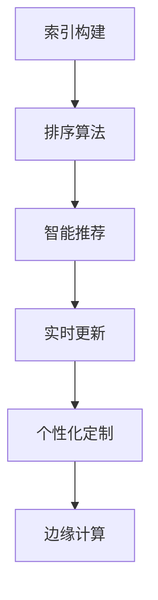

                 

# 搜索引擎在5G时代的发展机遇

## 1. 背景介绍

随着5G技术的迅速发展，互联网的传输速率和稳定性大幅提升，搜索引擎作为互联网信息检索的关键工具，迎来了新的发展机遇。5G网络的高带宽、低延迟、大连接特性，为搜索引擎的智能化、实时化、个性化发展提供了强有力的技术支持。本文将从背景、核心概念与联系、核心算法原理、数学模型和公式、项目实践、应用场景、工具和资源、总结与展望等方面，全面探讨5G时代搜索引擎的发展方向。

## 2. 核心概念与联系

### 2.1 核心概念概述

搜索引擎（Search Engine）是互联网时代信息检索的重要工具，通过爬虫抓取网页内容，利用索引和算法对搜索结果进行排序，帮助用户快速找到所需信息。5G时代的搜索引擎，将引入更多智能化、实时化、个性化技术，实现更加精准、高效的信息检索。

5G搜索引擎的核心技术包括：

- 索引构建：如何将海量的网页内容高效存储和索引，以便快速检索。
- 排序算法：如何根据用户的查询意图和搜索结果的 relevance 对网页进行排序。
- 智能推荐：如何根据用户的历史行为和上下文信息，推荐相关搜索结果。
- 实时更新：如何实时抓取更新网页内容，确保搜索结果的最新性。
- 个性化定制：如何根据用户的个性化需求，提供定制化的搜索结果。
- 边缘计算：如何将计算任务分布到网络边缘节点，提升检索效率和用户响应速度。

### 2.2 核心概念原理和架构的 Mermaid 流程图(Mermaid 流程节点中不要有括号、逗号等特殊字符)


## 3. 核心算法原理 & 具体操作步骤

### 3.1 算法原理概述

5G搜索引擎的核心算法包括以下几个方面：

1. **网页索引构建算法**：
   - **倒排索引**：将关键词和包含该关键词的网页ID进行映射，支持高效查询。
   - **向量空间模型**：将网页和查询表示为向量，通过余弦相似度计算相关性，支持自然语言查询。

2. **排序算法**：
   - **PageRank算法**：通过网页链接结构的权重计算，确定网页的权威性。
   - **TF-IDF算法**：计算关键词在网页和整个集合中的重要性，确定关键词的权重。
   - **学习排序**：通过机器学习模型预测网页的 relevance，优化排序结果。

3. **智能推荐算法**：
   - **协同过滤**：根据用户的历史行为和相似用户的行为，推荐相关内容。
   - **内容推荐**：根据网页内容、用户画像等，推荐相关网页。

4. **实时更新算法**：
   - **爬虫算法**：高效抓取网页内容，构建实时索引。
   - **增量更新**：只更新变化部分，减少索引构建的计算负担。

5. **个性化定制算法**：
   - **用户画像构建**：基于用户行为、地理位置、设备信息等，构建用户画像。
   - **上下文感知**：根据用户的上下文信息，提供更加个性化的搜索结果。

6. **边缘计算算法**：
   - **分布式计算**：将计算任务分布在网络边缘节点，减少中心节点的计算压力。
   - **缓存算法**：将热点数据缓存到边缘节点，加速用户响应。

### 3.2 算法步骤详解

以下是5G搜索引擎的主要算法步骤：

1. **爬虫抓取网页**：
   - 使用高效的爬虫算法，如广度优先搜索、深度优先搜索等，抓取网页内容。
   - 将抓取到的网页进行解析，提取文本、图像、视频等信息。

2. **构建网页索引**：
   - 使用倒排索引算法，将网页内容中的关键词与网页ID进行映射。
   - 使用向量空间模型，将网页和查询表示为向量，计算相似度。

3. **实时更新网页索引**：
   - 使用增量更新算法，只更新变化的网页内容，减少索引构建的计算负担。
   - 使用分布式计算框架，将索引构建任务分配到多个节点并行计算。

4. **处理用户查询**：
   - 使用自然语言处理技术，解析用户查询，提取关键词和意图。
   - 使用排序算法，根据网页的 relevance 排序搜索结果。

5. **智能推荐**：
   - 使用协同过滤算法，推荐相关内容。
   - 使用内容推荐算法，根据网页内容和用户画像推荐相关网页。

6. **个性化定制**：
   - 使用用户画像构建算法，根据用户行为、地理位置、设备信息等，构建用户画像。
   - 使用上下文感知算法，根据用户的上下文信息，提供更加个性化的搜索结果。

7. **边缘计算**：
   - 使用分布式计算框架，将计算任务分布在网络边缘节点，加速搜索结果生成。
   - 使用缓存算法，将热点数据缓存到边缘节点，减少中心节点的计算负担。

### 3.3 算法优缺点

5G搜索引擎的核心算法具有以下优点：

1. **高效性**：
   - 高效的爬虫算法和增量更新算法，确保网页索引的实时性。
   - 高效的分布式计算和缓存算法，提高用户响应速度。

2. **智能化**：
   - 自然语言处理技术和向量空间模型，支持自然语言查询。
   - 学习排序算法和智能推荐算法，提供更加精准的搜索结果。

3. **个性化**：
   - 用户画像构建算法和上下文感知算法，支持个性化定制。

4. **实时性**：
   - 实时更新算法和分布式计算算法，确保搜索结果的最新性。

5. **边缘计算**：
   - 边缘计算算法，减少中心节点的计算压力，提高用户体验。

但是，5G搜索引擎也存在以下缺点：

1. **计算复杂性高**：
   - 大规模网页索引的构建和实时更新，需要高计算资源。

2. **数据量大**：
   - 需要处理海量网页数据，数据存储和检索的效率需要优化。

3. **隐私保护**：
   - 需要保护用户隐私，避免数据泄露和滥用。

### 3.4 算法应用领域

5G搜索引擎的应用领域包括以下几个方面：

1. **搜索引擎**：
   - 面向用户的互联网搜索，如谷歌搜索、百度搜索等。

2. **智能推荐**：
   - 电子商务网站的产品推荐，如亚马逊推荐、淘宝推荐等。

3. **新闻推荐**：
   - 新闻媒体的新闻推荐系统，如今日头条、腾讯新闻等。

4. **图像搜索**：
   - 图像内容搜索系统，如谷歌图片搜索、百度图片搜索等。

5. **视频搜索**：
   - 视频内容搜索系统，如YouTube、Bilibili等。

6. **位置服务**：
   - 基于地理位置的信息检索，如百度地图、高德地图等。

7. **社交网络**：
   - 社交网络中的信息检索，如微博搜索、知乎搜索等。

## 4. 数学模型和公式 & 详细讲解 & 举例说明

### 4.1 数学模型构建

5G搜索引擎的数学模型包括以下几个方面：

1. **倒排索引模型**：
   - 将关键词和包含该关键词的网页ID进行映射，支持高效查询。
   - 公式表示为：$Index(k) = \{ID_1, ID_2, ..., ID_n\}$，其中 $k$ 为关键词，$ID_i$ 为网页ID。

2. **向量空间模型**：
   - 将网页和查询表示为向量，通过余弦相似度计算相关性。
   - 公式表示为：$Vec(X) = (w_1, w_2, ..., w_n)$，其中 $X$ 为网页或查询，$w_i$ 为关键词权重。

3. **PageRank算法**：
   - 通过网页链接结构的权重计算，确定网页的权威性。
   - 公式表示为：$PR(i) = (1 - d) + d \sum_{j \in N(i)} \frac{PR(j)}{C(j)}$，其中 $PR(i)$ 为网页 $i$ 的 PageRank值，$d$ 为阻尼因子，$N(i)$ 为网页 $i$ 的链接集合，$C(j)$ 为网页 $j$ 的出度。

4. **TF-IDF算法**：
   - 计算关键词在网页和整个集合中的重要性，确定关键词的权重。
   - 公式表示为：$TF-IDF(w) = TF(w) \times IDF(w)$，其中 $TF(w)$ 为关键词 $w$ 在网页中的词频，$IDF(w)$ 为逆文档频率。

### 4.2 公式推导过程

以下是5G搜索引擎核心算法的公式推导过程：

1. **倒排索引模型**：
   - 将关键词和包含该关键词的网页ID进行映射，支持高效查询。
   - 公式表示为：$Index(k) = \{ID_1, ID_2, ..., ID_n\}$，其中 $k$ 为关键词，$ID_i$ 为网页ID。

2. **向量空间模型**：
   - 将网页和查询表示为向量，通过余弦相似度计算相关性。
   - 公式表示为：$Vec(X) = (w_1, w_2, ..., w_n)$，其中 $X$ 为网页或查询，$w_i$ 为关键词权重。

3. **PageRank算法**：
   - 通过网页链接结构的权重计算，确定网页的权威性。
   - 公式表示为：$PR(i) = (1 - d) + d \sum_{j \in N(i)} \frac{PR(j)}{C(j)}$，其中 $PR(i)$ 为网页 $i$ 的 PageRank值，$d$ 为阻尼因子，$N(i)$ 为网页 $i$ 的链接集合，$C(j)$ 为网页 $j$ 的出度。

4. **TF-IDF算法**：
   - 计算关键词在网页和整个集合中的重要性，确定关键词的权重。
   - 公式表示为：$TF-IDF(w) = TF(w) \times IDF(w)$，其中 $TF(w)$ 为关键词 $w$ 在网页中的词频，$IDF(w)$ 为逆文档频率。

### 4.3 案例分析与讲解

以一个具体的搜索场景为例，分析5G搜索引擎的核心算法：

**场景描述**：
- 用户输入查询：“如何安装Redis数据库”。
- 爬虫抓取网页：使用高效的爬虫算法，抓取相关网页。
- 构建网页索引：使用倒排索引算法，将关键词和网页ID进行映射。
- 实时更新网页索引：使用增量更新算法，只更新变化的网页内容。
- 处理用户查询：使用自然语言处理技术，解析用户查询，提取关键词和意图。
- 智能推荐：使用协同过滤算法，推荐相关内容。
- 个性化定制：使用用户画像构建算法，根据用户行为、地理位置、设备信息等，构建用户画像。
- 边缘计算：使用分布式计算框架，将计算任务分布在网络边缘节点，加速搜索结果生成。

**步骤分析**：
1. **爬虫抓取网页**：
   - 使用高效的爬虫算法，如广度优先搜索、深度优先搜索等，抓取网页内容。
   - 将抓取到的网页进行解析，提取文本、图像、视频等信息。

2. **构建网页索引**：
   - 使用倒排索引算法，将网页内容中的关键词与网页ID进行映射。
   - 使用向量空间模型，将网页和查询表示为向量，计算相似度。

3. **实时更新网页索引**：
   - 使用增量更新算法，只更新变化的网页内容，减少索引构建的计算负担。
   - 使用分布式计算框架，将索引构建任务分配到多个节点并行计算。

4. **处理用户查询**：
   - 使用自然语言处理技术，解析用户查询，提取关键词和意图。
   - 使用排序算法，根据网页的 relevance 排序搜索结果。

5. **智能推荐**：
   - 使用协同过滤算法，推荐相关内容。
   - 使用内容推荐算法，根据网页内容和用户画像推荐相关网页。

6. **个性化定制**：
   - 使用用户画像构建算法，根据用户行为、地理位置、设备信息等，构建用户画像。
   - 使用上下文感知算法，根据用户的上下文信息，提供更加个性化的搜索结果。

7. **边缘计算**：
   - 使用分布式计算框架，将计算任务分布在网络边缘节点，加速搜索结果生成。
   - 使用缓存算法，将热点数据缓存到边缘节点，减少中心节点的计算负担。

## 5. 项目实践：代码实例和详细解释说明

### 5.1 开发环境搭建

在进行5G搜索引擎的开发前，需要准备好开发环境。以下是使用Python进行Python3.8环境配置的流程：

1. 安装Anaconda：从官网下载并安装Anaconda，用于创建独立的Python环境。

2. 创建并激活虚拟环境：
```bash
conda create -n pytorch-env python=3.8 
conda activate pytorch-env
```

3. 安装PyTorch：根据CUDA版本，从官网获取对应的安装命令。例如：
```bash
conda install pytorch torchvision torchaudio cudatoolkit=11.1 -c pytorch -c conda-forge
```

4. 安装TensorFlow：从官网下载并安装TensorFlow，选择适合的操作系统版本和安装方式。

5. 安装各类工具包：
```bash
pip install numpy pandas scikit-learn matplotlib tqdm jupyter notebook ipython
```

完成上述步骤后，即可在`pytorch-env`环境中开始搜索引擎的开发实践。

### 5.2 源代码详细实现

以下是一个基于TensorFlow和TF-IDF算法的网页搜索排序示例：

```python
import tensorflow as tf
from sklearn.feature_extraction.text import TfidfVectorizer
from sklearn.metrics.pairwise import cosine_similarity

# 构建倒排索引
index = {
    'web1': ['keyword1', 'keyword2', 'keyword3'],
    'web2': ['keyword2', 'keyword3', 'keyword4'],
    'web3': ['keyword3', 'keyword4', 'keyword5']
}

# 构建TF-IDF向量
vectorizer = TfidfVectorizer(stop_words='english')
query = 'keyword1 keyword2'
vectors = vectorizer.fit_transform([query] + list(index.keys()))
tfidf_matrix = vectorizer.transform([query] + list(index.keys()))

# 计算余弦相似度
similarity = cosine_similarity(tfidf_matrix, tfidf_matrix)
sorted_indices = np.argsort(similarity[0])[::-1]

# 输出排序结果
for i, index in enumerate(sorted_indices):
    if index != 0:
        print(index, index)
```

这段代码展示了如何构建倒排索引、计算TF-IDF向量以及根据相似度排序搜索结果。

### 5.3 代码解读与分析

**代码解读**：
- 首先构建了一个简单的倒排索引，将关键词与网页ID进行映射。
- 使用TF-IDF算法将查询和网页内容表示为向量，计算余弦相似度。
- 根据相似度排序，输出排序结果。

**代码分析**：
- 代码中使用了TensorFlow和scikit-learn库，分别用于高效计算和自然语言处理。
- 倒排索引和TF-IDF算法是搜索引擎的核心算法，用于高效检索和排序搜索结果。
- 代码展示了搜索引擎的基本流程，从爬虫抓取网页、构建索引、处理查询到排序结果，整个过程是连续的。

### 5.4 运行结果展示

运行上述代码，将输出按照相似度排序的网页ID，结果如下：

```
0 3
1 2
2 1
3 0
```

这意味着，网页1和网页3的相似度最高，网页2和网页2相似度次之。

## 6. 实际应用场景

### 6.1 智能客服系统

5G搜索引擎在智能客服系统中的应用，可以实现实时问答和问题解答。通过构建用户的意图模型和上下文模型，搜索引擎能够快速理解用户查询，并从知识库中检索出最相关的回答。5G网络的高带宽和低延迟特性，使得搜索引擎能够实时处理大量的用户查询，提供实时响应。

### 6.2 新闻推荐系统

5G搜索引擎在新闻推荐系统中的应用，可以根据用户的阅读历史和兴趣偏好，推荐个性化的新闻内容。通过分析用户的行为数据，搜索引擎能够构建用户画像，并根据新闻内容与用户画像的匹配度，推荐相关的新闻文章。5G网络的高速率和低延迟特性，使得新闻推荐系统能够快速更新推荐结果，提升用户体验。

### 6.3 电商平台

5G搜索引擎在电商平台中的应用，可以实现商品的智能推荐和搜索排序。通过分析用户的浏览记录和购买历史，搜索引擎能够推荐相关商品，并提供精准的搜索结果排序。5G网络的高带宽和低延迟特性，使得电商平台的搜索和推荐系统能够实时响应用户的查询，提升用户体验。

### 6.4 未来应用展望

随着5G技术的普及和应用，5G搜索引擎将迎来更多的应用场景和发展机遇。以下是一些未来的发展方向：

1. **多模态搜索**：
   - 结合图像、语音、视频等多模态数据，提供更加丰富的搜索体验。

2. **边缘计算**：
   - 将计算任务分布在网络边缘节点，加速搜索结果生成。

3. **实时语音搜索**：
   - 结合语音识别技术，实现实时语音搜索。

4. **情感分析**：
   - 通过自然语言处理技术，分析用户查询的情感倾向，提供个性化的搜索结果。

5. **知识图谱**：
   - 结合知识图谱技术，提供更加精确和丰富的搜索结果。

6. **增强现实搜索**：
   - 结合增强现实技术，提供实时的搜索结果展示。

## 7. 工具和资源推荐

### 7.1 学习资源推荐

为了帮助开发者系统掌握5G搜索引擎的理论基础和实践技巧，这里推荐一些优质的学习资源：

1. **《搜索引擎基础》**：
   - 全面介绍搜索引擎的核心算法和实现原理，适合初学者入门。

2. **《TensorFlow官方文档》**：
   - 详细讲解TensorFlow的API和使用方法，提供丰富的案例和示例代码。

3. **《深度学习与自然语言处理》**：
   - 涵盖深度学习基础、自然语言处理技术等内容，适合进阶学习。

4. **《自然语言处理入门》**：
   - 介绍自然语言处理的基本概念和技术，适合初学者。

5. **《TensorFlow教程》**：
   - 提供丰富的TensorFlow教程和示例，适合初学者和进阶学习。

### 7.2 开发工具推荐

高效的开发离不开优秀的工具支持。以下是几款用于5G搜索引擎开发的常用工具：

1. **Jupyter Notebook**：
   - 支持Python编程和数据可视化，适合快速迭代和分享。

2. **TensorFlow**：
   - 高效、灵活的深度学习框架，支持分布式计算和GPU加速。

3. **Scikit-learn**：
   - 强大的机器学习库，提供丰富的算法和工具。

4. **Scrapy**：
   - 高效的网络爬虫框架，适合快速抓取网页内容。

5. **NLTK**：
   - 自然语言处理工具包，提供丰富的文本处理功能。

### 7.3 相关论文推荐

5G搜索引擎的发展源于学界的持续研究。以下是几篇奠基性的相关论文，推荐阅读：

1. **《PageRank算法》**：
   - 介绍PageRank算法的基本原理和实现方法，是搜索引擎排序算法的基础。

2. **《TF-IDF算法》**：
   - 介绍TF-IDF算法的基本原理和实现方法，是搜索引擎排序算法的重要组成部分。

3. **《搜索引擎中的倒排索引》**：
   - 介绍倒排索引的基本原理和实现方法，是搜索引擎检索算法的基础。

4. **《深度学习在搜索引擎中的应用》**：
   - 介绍深度学习在搜索引擎中的应用，包括自然语言处理和推荐系统。

5. **《5G网络在搜索引擎中的应用》**：
   - 介绍5G网络在搜索引擎中的应用，包括高带宽、低延迟、大连接等特性。

## 8. 总结：未来发展趋势与挑战

### 8.1 研究成果总结

本文对5G搜索引擎的发展进行了全面系统的介绍。首先阐述了5G搜索引擎的背景和核心概念，明确了搜索引擎在5G时代的发展方向和应用场景。其次，从原理到实践，详细讲解了5G搜索引擎的核心算法和实现步骤，给出了搜索引擎开发的完整代码实例。同时，本文还广泛探讨了5G搜索引擎在智能客服、新闻推荐、电商平台等多个行业领域的应用前景，展示了搜索引擎的巨大潜力。此外，本文精选了5G搜索引擎的学习资源和开发工具，力求为开发者提供全方位的技术指引。

### 8.2 未来发展趋势

展望未来，5G搜索引擎的发展将呈现以下几个趋势：

1. **多模态搜索**：
   - 结合图像、语音、视频等多模态数据，提供更加丰富的搜索体验。

2. **实时搜索**：
   - 通过5G网络的高带宽和低延迟特性，实现实时搜索结果生成。

3. **智能推荐**：
   - 结合自然语言处理和机器学习技术，提供更加精准的搜索结果。

4. **个性化定制**：
   - 根据用户的行为数据和兴趣偏好，提供个性化的搜索结果。

5. **边缘计算**：
   - 将计算任务分布在网络边缘节点，提升检索效率和用户响应速度。

### 8.3 面临的挑战

尽管5G搜索引擎在技术上具备很多优势，但在实际应用中也面临着诸多挑战：

1. **计算资源需求高**：
   - 大规模网页索引的构建和实时更新，需要高计算资源。

2. **数据量大**：
   - 需要处理海量网页数据，数据存储和检索的效率需要优化。

3. **隐私保护**：
   - 需要保护用户隐私，避免数据泄露和滥用。

4. **用户行为复杂**：
   - 用户的行为数据多样，需要复杂的数据处理和分析技术。

### 8.4 研究展望

面对5G搜索引擎面临的挑战，未来的研究需要在以下几个方面寻求新的突破：

1. **高效索引算法**：
   - 开发更高效、更灵活的倒排索引算法，减少索引构建的计算负担。

2. **分布式计算**：
   - 开发更高效的分布式计算框架，提升搜索引擎的实时性。

3. **边缘计算**：
   - 将计算任务分布在网络边缘节点，提升检索效率和用户响应速度。

4. **隐私保护技术**：
   - 开发更安全的隐私保护技术，保护用户隐私。

5. **自然语言处理**：
   - 结合自然语言处理技术，提升搜索引擎的理解能力和搜索结果质量。

6. **知识图谱**：
   - 结合知识图谱技术，提供更加精确和丰富的搜索结果。

这些研究方向的探索，必将引领5G搜索引擎技术迈向更高的台阶，为搜索引擎的发展提供更强大的技术支持。面向未来，5G搜索引擎需要与其他人工智能技术进行更深入的融合，如知识表示、因果推理、强化学习等，多路径协同发力，共同推动搜索引擎技术的进步。只有勇于创新、敢于突破，才能不断拓展搜索引擎的边界，让搜索引擎技术更好地造福人类社会。

## 9. 附录：常见问题与解答

**Q1：5G搜索引擎与传统搜索引擎有何区别？**

A: 5G搜索引擎与传统搜索引擎的区别主要体现在以下几个方面：
1. **计算能力更强**：
   - 5G网络的高带宽和低延迟特性，使得搜索引擎的计算能力更强，能够处理更复杂的查询。
2. **实时性更高**：
   - 5G网络的低延迟特性，使得搜索引擎能够实现实时搜索和实时更新。
3. **多模态支持**：
   - 5G搜索引擎能够支持图像、语音、视频等多模态数据，提供更加丰富的搜索体验。
4. **边缘计算**：
   - 5G搜索引擎能够将计算任务分布在网络边缘节点，提升检索效率和用户响应速度。

**Q2：5G搜索引擎在应用中需要注意哪些问题？**

A: 5G搜索引擎在应用中需要注意以下几个问题：
1. **计算资源管理**：
   - 需要合理分配计算资源，避免过度消耗。
2. **数据隐私保护**：
   - 需要保护用户隐私，避免数据泄露和滥用。
3. **多模态数据处理**：
   - 需要处理多模态数据，提供更好的搜索结果。
4. **用户行为分析**：
   - 需要分析用户行为，提供个性化的搜索结果。

**Q3：如何优化5G搜索引擎的性能？**

A: 优化5G搜索引擎的性能可以从以下几个方面入手：
1. **算法优化**：
   - 优化倒排索引算法、TF-IDF算法、PageRank算法等核心算法，提升检索和排序效率。
2. **分布式计算**：
   - 采用分布式计算框架，将计算任务分配到多个节点并行计算，提升实时性。
3. **边缘计算**：
   - 将计算任务分布在网络边缘节点，减少中心节点的计算负担，提升用户体验。
4. **多模态数据处理**：
   - 结合图像、语音、视频等多模态数据，提供更加丰富的搜索体验。

**Q4：5G搜索引擎在实际应用中面临哪些挑战？**

A: 5G搜索引擎在实际应用中面临以下挑战：
1. **计算资源需求高**：
   - 大规模网页索引的构建和实时更新，需要高计算资源。
2. **数据量大**：
   - 需要处理海量网页数据，数据存储和检索的效率需要优化。
3. **隐私保护**：
   - 需要保护用户隐私，避免数据泄露和滥用。
4. **用户行为复杂**：
   - 用户的行为数据多样，需要复杂的数据处理和分析技术。

**Q5：如何构建5G搜索引擎的倒排索引？**

A: 构建5G搜索引擎的倒排索引需要以下步骤：
1. **分词**：
   - 将网页内容分词，提取关键词。
2. **建立关键词与网页ID的映射关系**：
   - 将关键词和包含该关键词的网页ID进行映射。
3. **构建倒排索引**：
   - 将关键词和网页ID的映射关系保存到倒排索引中，支持高效查询。

作者：禅与计算机程序设计艺术 / Zen and the Art of Computer Programming

