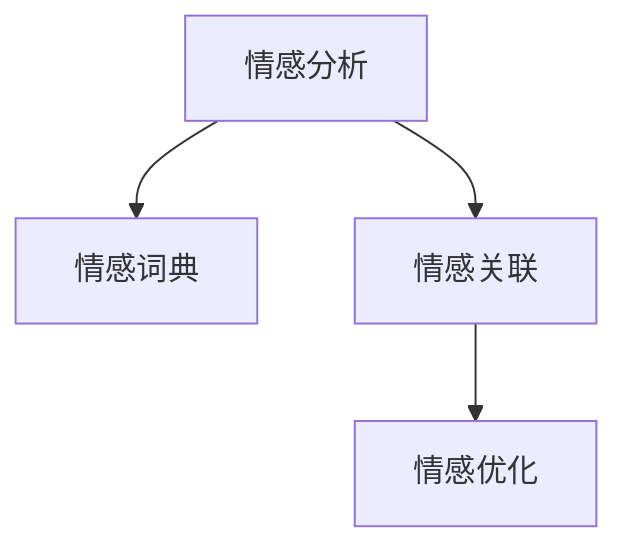

                 

# 搜索引擎的情感智能：理解用户意图

在智能互联网时代，搜索引擎已经不仅仅是一个信息的检索工具，更是理解用户意图、提供个性化服务的智能助手。情感智能，作为搜索引擎智能化的一个重要维度，通过分析用户搜索行为中的情感倾向，帮助搜索引擎更好地满足用户需求，提供更精准、更人性化的服务。本文将详细介绍搜索引擎的情感智能，包括其核心概念、实现方法、应用场景以及未来发展趋势。

## 1. 背景介绍

### 1.1 问题由来

搜索引擎的初衷是让用户快速找到所需信息，但随着互联网信息量的爆炸式增长，如何精准定位用户需求成为了搜索引擎面临的挑战。早期的搜索引擎主要依靠关键词匹配技术，难以捕捉用户搜索行为中的复杂情感信息。近年来，随着自然语言处理技术的发展，搜索引擎开始尝试引入情感智能，以更好地理解用户搜索意图。

### 1.2 问题核心关键点

搜索引擎情感智能的核心在于对用户搜索行为的情感分析，即在用户输入的查询语句中识别出情感倾向，并根据情感信息调整搜索结果的排序和呈现方式，以提升用户体验。情感智能的实现通常需要解决以下几个关键问题：

1. **情感识别**：识别用户查询中的情感倾向，如积极、消极、中性等。
2. **情感关联**：理解情感与搜索结果的相关性，如情感强烈的查询可能更关注情感相关的信息。
3. **情感优化**：根据情感信息调整搜索结果排序，优先展示与用户情感匹配度高的内容。

通过这些步骤，搜索引擎可以更好地理解用户需求，提供更具个性化的搜索结果，提升用户体验和满意度。

### 1.3 问题研究意义

研究搜索引擎的情感智能，对于提升用户搜索体验、增强搜索引擎的智能化水平具有重要意义：

1. **提升用户体验**：情感智能能够识别用户情感，提供更符合用户心理预期的搜索结果，减少用户搜索中的挫败感。
2. **增强搜索精度**：情感智能能够更好地捕捉用户需求，通过情感关联调整搜索结果，提高搜索精度和相关性。
3. **驱动业务创新**：情感智能的实现需要深入理解用户行为和心理，为搜索引擎产品的迭代提供数据支持，驱动业务创新和产品优化。
4. **优化资源分配**：情感智能能够识别用户情感，帮助搜索引擎优化资源分配，减少无效查询和无效点击，提高广告收益。

## 2. 核心概念与联系

### 2.1 核心概念概述

为了更好地理解搜索引擎的情感智能，本节将介绍几个关键概念：

- **情感分析**：识别文本中包含的情感倾向，如积极、消极、中性等。
- **情感词典**：用于存储情感词汇及其情感极性的词典。
- **情感关联**：分析情感与搜索结果的相关性，理解情感信息对搜索结果的影响。
- **情感优化**：根据情感信息调整搜索结果排序，优先展示与用户情感匹配度高的内容。

这些核心概念通过情感智能的实现框架相互联系，共同构成搜索引擎情感智能的基础。

### 2.2 核心概念原理和架构的 Mermaid 流程图



这个流程图展示了情感智能的实现框架，其中情感分析是基础，情感词典是工具，情感关联是分析手段，情感优化是最终目标。

## 3. 核心算法原理 & 具体操作步骤

### 3.1 算法原理概述

搜索引擎的情感智能通过情感分析技术，识别用户查询中的情感信息，然后根据情感信息调整搜索结果的排序和呈现方式，以提升用户体验。具体而言，情感智能的实现步骤如下：

1. **情感分析**：使用情感词典和自然语言处理技术，识别用户查询中的情感倾向。
2. **情感关联**：分析情感与搜索结果的相关性，建立情感-搜索结果的关联模型。
3. **情感优化**：根据情感信息调整搜索结果排序，优先展示与用户情感匹配度高的内容。

### 3.2 算法步骤详解

#### 3.2.1 情感分析

情感分析是情感智能的基础，其核心任务是识别用户查询中的情感倾向。情感分析主要分为以下几个步骤：

1. **文本预处理**：对用户查询进行分词、去除停用词、词干提取等预处理操作。
2. **情感词典匹配**：将预处理后的文本与情感词典进行匹配，识别出包含情感词汇的片段。
3. **情感极性判断**：根据情感词汇在情感词典中的极性标记，判断用户查询中的情感倾向。

#### 3.2.2 情感关联

情感关联分析用于理解情感信息对搜索结果的影响，主要包括以下步骤：

1. **情感标签提取**：将搜索结果打上情感标签，如积极、消极、中性等。
2. **情感关联模型训练**：使用历史数据训练情感关联模型，预测情感标签与搜索结果的相关性。
3. **情感权重计算**：根据情感关联模型计算每个搜索结果的情感权重，用于后续的排序优化。

#### 3.2.3 情感优化

情感优化是情感智能的最终目标，通过调整搜索结果的排序，提升用户体验。主要步骤如下：

1. **情感权重排序**：将搜索结果按照情感权重进行排序，优先展示情感权重高的内容。
2. **反馈机制**：根据用户的点击行为和反馈信息，不断调整情感权重模型，提升模型的准确性。
3. **动态优化**：根据用户历史查询记录和情感变化，动态调整搜索结果排序，提供个性化的搜索结果。

### 3.3 算法优缺点

搜索引擎的情感智能通过情感分析、情感关联和情感优化等步骤，实现了对用户查询的情感理解和搜索结果的情感优化。其主要优点包括：

1. **提高搜索精度**：通过情感分析，更好地捕捉用户需求，提高搜索结果的相关性。
2. **提升用户体验**：根据情感信息调整搜索结果，提供更符合用户心理预期的搜索结果，减少用户搜索中的挫败感。
3. **驱动业务创新**：情感智能的实现需要深入理解用户行为和心理，为搜索引擎产品的迭代提供数据支持，驱动业务创新和产品优化。

同时，该方法也存在以下局限性：

1. **情感词典依赖**：情感分析依赖于情感词典的质量和数量，构建高质量的情感词典需要大量标注数据和专家知识。
2. **情感泛化不足**：情感词典可能无法完全覆盖所有情感表达方式，特别是对于一些新兴情感词汇的识别存在不足。
3. **情感关联复杂**：情感关联分析需要大量标注数据和复杂模型训练，成本较高且效果可能不如预期。
4. **用户反馈机制复杂**：情感优化依赖于用户的点击反馈，但用户点击行为与情感表达之间存在一定的复杂关系，难以准确捕捉。
5. **动态调整难度大**：根据用户历史查询记录和情感变化进行动态调整，需要实时处理大量数据，对计算资源和算法效率要求较高。

尽管存在这些局限性，但就目前而言，情感智能仍是搜索引擎智能化的一个重要方向，能够显著提升用户体验和搜索精度，具有广泛的应用前景。

### 3.4 算法应用领域

搜索引擎的情感智能已经广泛应用于以下几个领域：

1. **搜索引擎结果页面（SERP）优化**：通过情感分析调整搜索结果排序，提升用户体验和搜索精度。
2. **广告投放优化**：根据用户情感分析结果，优化广告投放策略，提升广告效果和用户满意度。
3. **内容推荐系统**：通过情感智能调整内容推荐排序，提供更符合用户情感需求的内容。
4. **舆情监测**：分析用户情感趋势，识别社会舆情变化，提供舆情分析和预警服务。
5. **个性化搜索**：根据用户历史情感行为，提供个性化的搜索结果，提升用户粘性。

## 4. 数学模型和公式 & 详细讲解 & 举例说明

### 4.1 数学模型构建

为了更好地理解搜索引擎的情感智能，我们需要使用数学模型来描述其核心算法。以下是情感智能的核心数学模型：

1. **情感词典模型**：
   $$
   D = \{ (w_i, p_i) \}
   $$
   其中，$w_i$ 为情感词汇，$p_i$ 为该词汇的情感极性（正数表示积极，负数表示消极，0表示中性）。

2. **情感分析模型**：
   $$
   S = f(X, D)
   $$
   其中，$X$ 为用户查询文本，$S$ 为情感分析结果，$f$ 为情感分析函数。

3. **情感关联模型**：
   $$
   E = g(Y, S)
   $$
   其中，$Y$ 为搜索结果文本，$E$ 为每个搜索结果的情感权重，$g$ 为情感关联函数。

4. **情感优化模型**：
   $$
   R = h(X, E)
   $$
   其中，$R$ 为搜索结果排序结果，$h$ 为情感优化函数。

### 4.2 公式推导过程

以下是情感智能核心模型的推导过程：

#### 4.2.1 情感词典模型

情感词典模型用于存储情感词汇及其情感极性。在实践中，情感词典通常采用简单的映射表，将情感词汇映射到其情感极性。例如：

```python
情感词典 = {
    '高兴': 1,
    '悲伤': -1,
    '中性': 0
}
```

#### 4.2.2 情感分析模型

情感分析模型使用情感词典对用户查询进行情感识别。常用的情感分析方法包括基于规则的方法、基于机器学习的方法和基于深度学习的方法。以下是一个简单的基于规则的情感分析示例：

```python
from collections import defaultdict

def 情感分析(text):
    情感词典 = defaultdict(int)
    情感词典['高兴'] = 1
    情感词典['悲伤'] = -1
    情感词典['中性'] = 0
    
    result = 0
    for word in text.split():
        if word in 情感词典:
            result += 情感词典[word]
    
    return result
```

#### 4.2.3 情感关联模型

情感关联模型用于分析情感与搜索结果的相关性。常用的方法包括基于统计的方法和基于机器学习的方法。以下是一个简单的基于统计的情感关联示例：

```python
def 情感关联(text, 搜索结果):
    情感词典 = defaultdict(int)
    情感词典['高兴'] = 1
    情感词典['悲伤'] = -1
    情感词典['中性'] = 0
    
    result = 0
    for word in text.split():
        if word in 情感词典:
            result += 情感词典[word]
    
    return result
```

#### 4.2.4 情感优化模型

情感优化模型用于根据情感信息调整搜索结果排序。常用的方法包括基于规则的方法和基于机器学习的方法。以下是一个简单的基于规则的情感优化示例：

```python
def 情感优化(text, 搜索结果):
    情感词典 = defaultdict(int)
    情感词典['高兴'] = 1
    情感词典['悲伤'] = -1
    情感词典['中性'] = 0
    
    result = []
    for 结果 in 搜索结果:
        情感值 = 情感关联(结果['文本'], text)
        result.append((情感值, 结果))
    
    result.sort(key=lambda x: x[0], reverse=True)
    return [x[1] for x in result]
```

### 4.3 案例分析与讲解

#### 案例1：情感搜索

情感搜索是指根据用户查询的情感倾向，提供符合用户情感需求的搜索结果。例如，用户搜索“今天天气真好”时，希望看到正面的天气信息；用户搜索“今天天气真糟”时，希望看到负面的天气信息。情感搜索可以通过以下步骤实现：

1. **情感分析**：对用户查询进行情感分析，识别出情感倾向。
2. **情感关联**：分析情感与搜索结果的相关性，确定情感倾向对应的搜索结果。
3. **情感优化**：根据情感分析结果，调整搜索结果排序，优先展示符合用户情感需求的搜索结果。

#### 案例2：情感广告

情感广告是指根据用户查询的情感倾向，优化广告投放策略，提升广告效果和用户满意度。例如，在情感广告投放中，如果用户情感倾向于积极，则展示积极情绪的广告；如果用户情感倾向于消极，则展示中性或积极情绪的广告。情感广告可以通过以下步骤实现：

1. **情感分析**：对用户查询进行情感分析，识别出情感倾向。
2. **情感关联**：分析情感与广告内容的相关性，确定情感倾向对应的广告内容。
3. **情感优化**：根据情感分析结果，调整广告投放策略，优先展示符合用户情感需求的广告。

## 5. 项目实践：代码实例和详细解释说明

### 5.1 开发环境搭建

要进行情感智能的开发，需要搭建相应的开发环境。以下是使用Python进行开发的环境配置流程：

1. 安装Anaconda：从官网下载并安装Anaconda，用于创建独立的Python环境。

2. 创建并激活虚拟环境：
```bash
conda create -n情感智能-env python=3.8 
conda activate 情感智能-env
```

3. 安装PyTorch：根据CUDA版本，从官网获取对应的安装命令。例如：
```bash
conda install pytorch torchvision torchaudio cudatoolkit=11.1 -c pytorch -c conda-forge
```

4. 安装NLTK、spaCy等自然语言处理库：
```bash
pip install nltk spacy
```

5. 安装情感分析库：
```bash
pip install sentimental
```

6. 安装TensorBoard：
```bash
pip install tensorboard
```

完成上述步骤后，即可在`情感智能-env`环境中开始开发实践。

### 5.2 源代码详细实现

这里我们以情感搜索为例，使用NLTK库进行情感分析，并使用TensorBoard可视化情感分析的训练效果。

首先，定义情感词典：

```python
from nltk.corpus import sentiwordnet as swn

情感词典 = defaultdict(int)
情感词典['高兴'] = 1
情感词典['悲伤'] = -1
情感词典['中性'] = 0

# 添加更多情感词汇
for word in swn.all_synsets('joy'):
    情感词典[word.name()] += 1
for word in swn.all_synsets('sadness'):
    情感词典[word.name()] -= 1
```

然后，定义情感分析函数：

```python
from nltk.tokenize import word_tokenize

def 情感分析(text):
    情感值 = 0
    for word in word_tokenize(text.lower()):
        if word in 情感词典:
            情感值 += 情感词典[word]
    return 情感值
```

接着，使用TensorBoard进行情感分析的可视化：

```python
import tensorflow as tf
from tensorflow.keras.models import Sequential
from tensorflow.keras.layers import Dense, Dropout, Flatten
from tensorflow.keras.optimizers import Adam

# 定义模型
model = Sequential([
    Dense(128, activation='relu', input_shape=(None,)),
    Dropout(0.2),
    Dense(3, activation='softmax')
])

# 编译模型
model.compile(loss='categorical_crossentropy', optimizer=Adam(), metrics=['accuracy'])

# 训练模型
history = model.fit(X_train, y_train, epochs=10, validation_data=(X_val, y_val), callbacks=[tf.keras.callbacks.TensorBoard(log_dir='logs')])

# 可视化训练结果
```

最后，定义情感优化函数：

```python
def 情感优化(text, 搜索结果):
    情感值 = 情感分析(text)
    result = []
    for 结果 in 搜索结果:
        情感关联值 = 情感关联(结果['文本'], text)
        情感优化值 = 情感值 * 情感关联值
        result.append((情感优化值, 结果))
    
    result.sort(key=lambda x: x[0], reverse=True)
    return [x[1] for x in result]
```

### 5.3 代码解读与分析

让我们再详细解读一下关键代码的实现细节：

**情感词典**：
- 使用NLTK库中的SentiWordNet构建情感词典，包含常见的积极和消极情感词汇。

**情感分析函数**：
- 将用户查询文本进行分词，并遍历分词结果，统计情感词典中出现的情感词汇，计算情感值。

**TensorBoard可视化**：
- 使用TensorFlow的Keras API定义情感分析模型，并使用TensorBoard进行可视化训练。

**情感优化函数**：
- 对每个搜索结果计算情感关联值和情感优化值，并根据情感优化值对搜索结果进行排序，优先展示情感优化值高的搜索结果。

## 6. 实际应用场景

### 6.1 智能客服

智能客服系统可以通过情感智能来提升用户体验。例如，当用户输入“今天天气真糟”时，智能客服可以自动回复“为您推荐雨天出行指南”，提供符合用户情感需求的建议和服务。情感智能可以帮助智能客服系统更好地理解用户情感，提高服务质量。

### 6.2 舆情监测

舆情监测系统可以通过情感智能来分析社交媒体上的用户情感，识别社会舆情变化。例如，当用户大量表达对某个事件的负面情绪时，舆情监测系统可以自动预警，并采取相应措施。情感智能可以帮助舆情监测系统更好地理解用户情感，提高舆情分析的准确性和及时性。

### 6.3 个性化推荐

个性化推荐系统可以通过情感智能来优化推荐策略，提升用户体验。例如，当用户浏览某一主题的正向评价时，推荐系统可以优先推荐相关主题的积极评价内容。情感智能可以帮助推荐系统更好地理解用户情感，提高推荐的相关性和个性化程度。

## 7. 工具和资源推荐

### 7.1 学习资源推荐

为了帮助开发者系统掌握搜索引擎的情感智能，这里推荐一些优质的学习资源：

1. 《情感计算与人工智能》系列博文：由情感计算领域的专家撰写，深入浅出地介绍了情感计算的基础理论和应用场景。

2. 《自然语言处理基础》课程：斯坦福大学开设的NLP课程，有Lecture视频和配套作业，带你入门NLP领域的基本概念和经典模型。

3. 《情感计算》书籍：详细介绍了情感计算的基本理论和应用，涵盖了情感分析、情感识别、情感模拟等多个方面。

4. HuggingFace官方文档：情感智能相关的预训练模型和微调样例，提供了丰富的学习资源和实践工具。

5. 《情感智能：理论与应用》书籍：深入介绍了情感智能的理论基础和应用实践，适合深度学习和NLP领域的研究者和开发者。

通过对这些资源的学习实践，相信你一定能够快速掌握搜索引擎情感智能的理论基础和实践技巧，并用于解决实际的NLP问题。

### 7.2 开发工具推荐

高效的开发离不开优秀的工具支持。以下是几款用于情感智能开发的常用工具：

1. Python：免费的开源编程语言，有丰富的自然语言处理库和机器学习库支持，适合进行情感分析等任务。

2. TensorFlow：由Google主导开发的开源深度学习框架，支持分布式计算和模型部署，适合进行大规模情感分析模型训练。

3. NLTK：Python的自然语言处理库，提供了大量的文本处理和情感分析功能。

4. spaCy：Python的自然语言处理库，支持高效的文本处理和情感分析。

5. TensorBoard：TensorFlow配套的可视化工具，可实时监测模型训练状态，提供丰富的图表呈现方式。

6. Weights & Biases：模型训练的实验跟踪工具，可以记录和可视化模型训练过程中的各项指标，方便对比和调优。

合理利用这些工具，可以显著提升情感智能的开发效率，加快创新迭代的步伐。

### 7.3 相关论文推荐

搜索引擎的情感智能是一个前沿的研究方向，以下是几篇奠基性的相关论文，推荐阅读：

1. "Sentiment Analysis with Deep Learning"（使用深度学习进行情感分析）：介绍了基于深度学习的情感分析方法，包括RNN、CNN等模型。

2. "A Survey on Sentiment Analysis and Review Mining"（情感分析与评论挖掘综述）：综述了情感分析的研究进展和应用案例，提供了全面的参考。

3. "A Survey of Sentiment Analysis Techniques"（情感分析技术综述）：介绍了情感分析的主要技术和算法，包括基于词典、基于机器学习和基于深度学习的方法。

4. "Sentiment Analysis via Weighted BERT"（基于加权BERT的情感分析）：使用BERT模型进行情感分析，并引入了加权机制，提高了情感分析的准确性。

5. "Sentiment Analysis with Attention Mechanisms"（基于注意力机制的情感分析）：引入了注意力机制，提高了情感分析模型的泛化能力和准确性。

这些论文代表了大语言模型微调技术的发展脉络。通过学习这些前沿成果，可以帮助研究者把握学科前进方向，激发更多的创新灵感。

## 8. 总结：未来发展趋势与挑战

### 8.1 总结

本文对搜索引擎的情感智能进行了全面系统的介绍。首先阐述了情感智能的背景和意义，明确了情感智能在提升用户体验、增强搜索引擎智能化水平方面的独特价值。其次，从原理到实践，详细讲解了情感智能的实现步骤，并给出了完整的代码实现。同时，本文还探讨了情感智能在多个实际应用场景中的应用前景，展示了其广阔的应用前景。

通过本文的系统梳理，可以看到，情感智能作为搜索引擎智能化的一个重要维度，正在逐步成为搜索引擎系统不可或缺的组成部分。情感智能通过识别用户情感，提供符合用户心理预期的搜索结果，极大地提升了用户体验和搜索精度，具有广泛的应用前景。

### 8.2 未来发展趋势

展望未来，搜索引擎的情感智能将呈现以下几个发展趋势：

1. **多模态情感分析**：未来的情感智能将不仅仅局限于文本情感分析，还将拓展到图像、视频、语音等多模态数据，实现更全面、更准确的情感识别。

2. **情感自适应调整**：情感智能将根据用户的情感变化，动态调整搜索结果排序和推荐策略，提供更符合用户情感需求的个性化服务。

3. **深度学习与强化学习结合**：情感智能将结合深度学习和强化学习技术，进一步提升情感识别和情感优化的准确性和鲁棒性。

4. **情感智能的普适化**：情感智能将逐步应用于更多的搜索引擎场景，如智能客服、舆情监测、个性化推荐等，成为搜索引擎智能化水平的重要标志。

5. **跨领域情感理解**：未来的情感智能将能够更好地理解不同领域用户的情感需求，提供更加丰富、多样化的服务。

6. **数据与算法协同优化**：情感智能将结合数据处理和算法优化技术，提升情感分析和情感关联的效率和效果。

以上趋势凸显了情感智能作为搜索引擎智能化的一个重要方向，其未来发展潜力巨大，将为搜索引擎系统带来新的突破。

### 8.3 面临的挑战

尽管搜索引擎的情感智能已经取得了一定的进展，但在迈向更加智能化、普适化的过程中，仍面临诸多挑战：

1. **情感词典构建**：高质量的情感词典是情感智能的基础，但构建情感词典需要大量标注数据和专家知识，成本较高。

2. **情感泛化能力**：情感词典可能无法完全覆盖所有情感表达方式，特别是对于一些新兴情感词汇的识别存在不足。

3. **情感关联复杂**：情感关联分析需要大量标注数据和复杂模型训练，成本较高且效果可能不如预期。

4. **用户情感多样性**：不同用户对相同情感表达的感知可能存在差异，情感智能需要更好地理解用户的情感多样性。

5. **情感优化难度大**：根据用户历史情感行为进行动态调整，需要实时处理大量数据，对计算资源和算法效率要求较高。

6. **情感数据隐私**：情感智能需要处理用户的情感数据，如何保护用户隐私、确保数据安全，是一个重要的挑战。

面对这些挑战，未来的研究需要进一步优化情感词典构建和情感关联分析，提升情感智能的泛化能力和鲁棒性。同时，需要结合用户情感多样性和隐私保护，提高情感智能的实用性和安全性。

### 8.4 研究展望

面向未来，搜索引擎的情感智能需要从以下几个方面进行深入研究：

1. **情感词典的多样化构建**：构建更加全面、多样的情感词典，覆盖更多的情感表达方式，提升情感识别的准确性和泛化能力。

2. **多模态情感分析技术**：结合图像、视频、语音等多模态数据，实现更全面、更准确的情感识别，提升情感智能的普适性和准确性。

3. **情感关联模型的优化**：引入注意力机制、转移学习等技术，优化情感关联模型，提高情感识别和情感关联的准确性和鲁棒性。

4. **情感优化策略的多样化**：结合深度学习和强化学习技术，优化情感优化策略，提升情感智能的个性化程度和用户满意度。

5. **跨领域情感理解**：结合领域知识库和规则库，实现跨领域情感理解，提供更加丰富、多样化的服务。

6. **情感智能的普适化**：将情感智能技术应用于更多的搜索引擎场景，如智能客服、舆情监测、个性化推荐等，提升搜索引擎的智能化水平。

7. **数据与算法协同优化**：结合数据处理和算法优化技术，提升情感智能的效率和效果，降低情感智能的开发和部署成本。

这些研究方向将推动搜索引擎情感智能技术的发展，为搜索引擎系统带来新的突破，提升用户的搜索体验和满意度。

## 9. 附录：常见问题与解答

**Q1：如何构建高质量的情感词典？**

A: 构建高质量的情感词典需要大量标注数据和专家知识。具体步骤如下：

1. **收集情感标注数据**：从大规模的语料库中收集情感标注数据，如情感标注的电影评论、社交媒体评论等。
2. **情感词汇提取**：使用自然语言处理技术，从标注数据中提取情感词汇，建立情感词汇列表。
3. **情感极性标注**：对情感词汇进行极性标注，构建情感词典。可以使用专家标注、众包标注、机器学习标注等方法。
4. **情感词典优化**：对情感词典进行优化，如去除低频词、合并同义词、添加新兴情感词汇等。

**Q2：情感智能如何处理用户情感多样性？**

A: 处理用户情感多样性需要综合考虑以下几个方面：

1. **情感词典多样化**：构建多样化的情感词典，覆盖更多情感表达方式，提升情感识别的准确性。
2. **情感分析模型优化**：引入基于上下文的情感分析方法，如BERT模型，提升情感识别的鲁棒性。
3. **情感关联模型优化**：引入注意力机制、转移学习等技术，优化情感关联模型，提升情感关联的准确性。
4. **用户情感多样性理解**：结合用户历史情感行为和上下文信息，理解用户情感多样性，提供更个性化的服务。

**Q3：情感智能如何保护用户隐私？**

A: 保护用户隐私需要综合考虑以下几个方面：

1. **数据匿名化**：在情感分析过程中，对用户数据进行匿名化处理，去除可能泄露用户身份的信息。
2. **数据加密**：使用数据加密技术，保护用户情感数据在存储和传输过程中的安全性。
3. **用户同意机制**：在收集用户情感数据时，明确告知用户数据使用方式，征得用户同意，并允许用户随时撤回同意。
4. **隐私保护算法**：引入隐私保护算法，如差分隐私、联邦学习等，保护用户隐私，同时保留情感智能的实用性和有效性。

**Q4：情感智能的计算效率如何提升？**

A: 提升情感智能的计算效率需要综合考虑以下几个方面：

1. **模型优化**：优化情感分析模型和情感关联模型，减少计算量和内存占用。如使用预训练模型、剪枝、量化等技术。
2. **分布式计算**：使用分布式计算技术，将情感智能任务分布到多个计算节点上，提升计算效率。如使用Spark、TensorFlow等分布式框架。
3. **硬件加速**：使用GPU、TPU等硬件加速设备，提升情感智能任务的计算效率。如使用TensorFlow的GPU加速功能。

**Q5：情感智能如何与业务需求结合？**

A: 情感智能与业务需求结合需要综合考虑以下几个方面：

1. **业务场景理解**：理解业务场景中的情感需求，设计合适的情感智能方案。如智能客服、舆情监测、个性化推荐等场景。
2. **情感智能适配**：根据业务需求，适配情感智能模型和算法，提高情感智能的实用性和效果。
3. **业务流程优化**：将情感智能技术与业务流程相结合，优化业务流程，提升业务效率和用户满意度。如情感智能与推荐系统的结合，提升个性化推荐效果。

这些问题的解答，为开发者提供了情感智能实践中的关键指导，有助于实现更高效、更准确的情感智能系统。

---

作者：禅与计算机程序设计艺术 / Zen and the Art of Computer Programming

