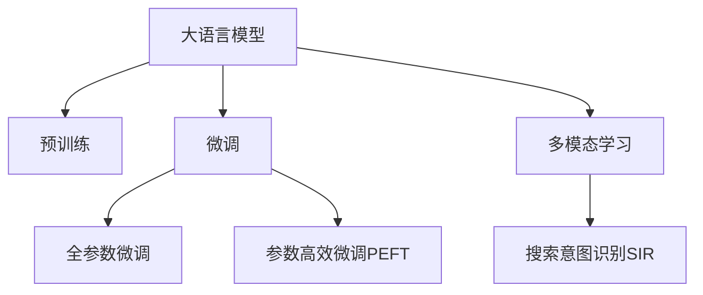

                 

# 搜索意图识别：大模型带来的突破

## 1. 背景介绍

### 1.1 问题由来

随着互联网的迅猛发展，搜索引擎已经成为信息获取的主要工具。然而，传统的搜索引擎往往只能返回最相关的网页，对于用户真实搜索意图（搜索目的）的识别却相对薄弱。例如，用户搜索“如何照顾新生小猫”，结果可能只返回了如何购买小猫的文章，却忽略了用户真正关心的是照顾小猫的方法。

针对这一问题，搜索意图识别（Search Intent Recognition）技术应运而生。该技术通过分析用户搜索关键词和上下文信息，精准识别出用户的真实搜索意图，从而提供更贴合需求的搜索结果。传统的意图识别方法依赖人工规则、统计模型等，但在海量数据和复杂语境下，效果往往不尽人意。而基于大模型的搜索意图识别技术，通过在大规模无标签数据上进行预训练，学习到丰富的语言表示和知识，能够更高效、准确地实现意图识别，推动搜索引擎的智能化升级。

### 1.2 问题核心关键点

搜索意图识别技术的核心在于如何从用户输入中提取出真正的搜索目的，并映射到对应的搜索结果。常见的方法包括：

- 自然语言处理：将用户搜索输入转化为向量表示，通过相似度计算找出最相关的意图类别。
- 序列建模：利用循环神经网络(RNN)或变换器(Transformer)等序列模型，分析搜索输入的时序关系，识别出意图。
- 多模态学习：结合搜索输入中的文本、图像、语音等多种信息源，提升意图识别的全面性。
- 交互学习：通过用户反馈不断更新模型，提升意图识别的准确性。

目前，基于大模型的搜索意图识别方法已经在电商、医疗、金融等多个领域得到了广泛应用，极大地提升了用户体验和信息检索的效率。

### 1.3 问题研究意义

研究搜索意图识别技术，对于提升搜索引擎的用户体验、优化搜索结果、推动互联网应用智能化进程具有重要意义：

1. 改善搜索结果相关性：通过理解用户的真实意图，搜索引擎能够提供更匹配、更相关的搜索结果，提高用户的满意度。
2. 优化信息检索效率：意图识别技术能够帮助用户快速找到所需信息，减少不必要的数据浏览，提升信息检索效率。
3. 拓展业务应用场景：在电商、医疗、金融等领域，准确识别用户意图能够带来更多的个性化服务和商业机会。
4. 推动互联网应用创新：意图识别技术能够使搜索引擎和其他应用服务更智能，推动互联网应用的创新和发展。
5. 辅助数据决策：意图识别技术能够帮助企业从用户行为中提取更多有价值的信息，辅助企业决策。

## 2. 核心概念与联系

### 2.1 核心概念概述

为更好地理解基于大模型的搜索意图识别方法，本节将介绍几个密切相关的核心概念：

- 搜索意图识别（Search Intent Recognition, SIR）：通过自然语言处理技术，分析用户搜索输入，识别出用户的真实搜索目的，并将其映射到对应的搜索结果的标签。
- 大语言模型（Large Language Model, LLM）：以自回归(如GPT)或自编码(如BERT)模型为代表的大规模预训练语言模型。通过在大规模无标签文本语料上进行预训练，学习通用的语言表示，具备强大的语言理解和生成能力。
- 预训练(Pre-training)：指在大规模无标签文本语料上，通过自监督学习任务训练通用语言模型的过程。常见的预训练任务包括言语建模、遮挡语言模型等。
- 微调(Fine-tuning)：指在预训练模型的基础上，使用下游任务的少量标注数据，通过有监督学习优化模型在特定任务上的性能。
- 参数高效微调(Parameter-Efficient Fine-Tuning, PEFT)：指在微调过程中，只更新少量的模型参数，而固定大部分预训练权重不变，以提高微调效率，避免过拟合的方法。
- 多模态学习（Multi-modal Learning）：结合文本、图像、语音等多种信息源，提升意图识别的全面性。

这些核心概念之间的逻辑关系可以通过以下Mermaid流程图来展示：



这个流程图展示了大语言模型的核心概念及其之间的关系：

1. 大语言模型通过预训练获得基础能力。
2. 微调是对预训练模型进行任务特定的优化，可以分为全参数微调和参数高效微调（PEFT）。
3. 多模态学习是一种将不同模态数据整合到模型中的方法，提升意图识别的全面性。
4. 搜索意图识别技术通过理解用户输入，精准识别出用户的真实意图，提升搜索结果的相关性。

这些概念共同构成了搜索意图识别技术的学习框架，使其能够更好地理解用户的搜索意图，从而提供更精准、高效的服务。

## 3. 核心算法原理 & 具体操作步骤
### 3.1 算法原理概述

基于大模型的搜索意图识别，本质上是一个有监督的微调过程。其核心思想是：将预训练的大语言模型视作一个强大的"特征提取器"，通过在特定任务的标注数据上进行有监督的微调，使得模型输出能够匹配意图标签，从而获得针对特定搜索意图优化的模型。

形式化地，假设预训练模型为 $M_{\theta}$，其中 $\theta$ 为预训练得到的模型参数。给定搜索意图识别任务的训练集 $D=\{(x_i, y_i)\}_{i=1}^N, x_i \in \mathcal{X}, y_i \in \{Intent_1, Intent_2, \ldots, Intent_k\}$，微调的目标是找到新的模型参数 $\hat{\theta}$，使得：

$$
\hat{\theta}=\mathop{\arg\min}_{\theta} \mathcal{L}(M_{\theta},D)
$$

其中 $\mathcal{L}$ 为针对搜索意图识别任务设计的损失函数，用于衡量模型预测输出与真实标签之间的差异。常见的损失函数包括交叉熵损失、负对数似然损失等。

通过梯度下降等优化算法，微调过程不断更新模型参数 $\theta$，最小化损失函数 $\mathcal{L}$，使得模型输出逼近真实标签。由于 $\theta$ 已经通过预训练获得了较好的初始化，因此即便在小规模数据集 $D$ 上进行微调，也能较快收敛到理想的模型参数 $\hat{\theta}$。

### 3.2 算法步骤详解

基于大模型的搜索意图识别一般包括以下几个关键步骤：

**Step 1: 准备预训练模型和数据集**
- 选择合适的预训练语言模型 $M_{\theta}$ 作为初始化参数，如 BERT、GPT 等。
- 准备搜索意图识别任务的标注数据集 $D$，划分为训练集、验证集和测试集。一般要求标注数据与预训练数据的分布不要差异过大。

**Step 2: 添加任务适配层**
- 根据任务类型，在预训练模型顶层设计合适的输出层和损失函数。
- 对于多分类任务，通常在顶层添加线性分类器和交叉熵损失函数。
- 对于序列标注任务，通常使用序列标注模型的解码器输出概率分布，并以负对数似然为损失函数。

**Step 3: 设置微调超参数**
- 选择合适的优化算法及其参数，如 AdamW、SGD 等，设置学习率、批大小、迭代轮数等。
- 设置正则化技术及强度，包括权重衰减、Dropout、Early Stopping等。
- 确定冻结预训练参数的策略，如仅微调顶层，或全部参数都参与微调。

**Step 4: 执行梯度训练**
- 将训练集数据分批次输入模型，前向传播计算损失函数。
- 反向传播计算参数梯度，根据设定的优化算法和学习率更新模型参数。
- 周期性在验证集上评估模型性能，根据性能指标决定是否触发 Early Stopping。
- 重复上述步骤直到满足预设的迭代轮数或 Early Stopping 条件。

**Step 5: 测试和部署**
- 在测试集上评估微调后模型 $M_{\hat{\theta}}$ 的性能，对比微调前后的精度提升。
- 使用微调后的模型对新样本进行推理预测，集成到实际的应用系统中。
- 持续收集新的数据，定期重新微调模型，以适应数据分布的变化。

以上是基于大模型的搜索意图识别的一般流程。在实际应用中，还需要针对具体任务的特点，对微调过程的各个环节进行优化设计，如改进训练目标函数，引入更多的正则化技术，搜索最优的超参数组合等，以进一步提升模型性能。

### 3.3 算法优缺点

基于大模型的搜索意图识别方法具有以下优点：
1. 简单高效。只需准备少量标注数据，即可对预训练模型进行快速适配，获得较大的性能提升。
2. 通用适用。适用于各种NLP下游任务，包括分类、匹配、生成等，设计简单的任务适配层即可实现微调。
3. 参数高效。利用参数高效微调技术，在固定大部分预训练参数的情况下，仍可取得不错的提升。
4. 效果显著。在学术界和工业界的诸多任务上，基于微调的方法已经刷新了最先进的性能指标。

同时，该方法也存在一定的局限性：
1. 依赖标注数据。微调的效果很大程度上取决于标注数据的质量和数量，获取高质量标注数据的成本较高。
2. 迁移能力有限。当目标任务与预训练数据的分布差异较大时，微调的性能提升有限。
3. 负面效果传递。预训练模型的固有偏见、有害信息等，可能通过微调传递到下游任务，造成负面影响。
4. 可解释性不足。微调模型的决策过程通常缺乏可解释性，难以对其推理逻辑进行分析和调试。

尽管存在这些局限性，但就目前而言，基于大模型的微调方法仍是大语言模型应用的主流范式。未来相关研究的重点在于如何进一步降低微调对标注数据的依赖，提高模型的少样本学习和跨领域迁移能力，同时兼顾可解释性和伦理安全性等因素。

### 3.4 算法应用领域

基于大模型的搜索意图识别方法已经在搜索引擎、智能客服、电子商务、金融等多个领域得到了广泛应用，为NLP技术落地应用提供了新的方向。

**在搜索引擎中的应用**
- 实时意图的更新：搜索引擎可以通过分析用户的输入，实时更新搜索结果，满足用户的即时需求。
- 个性化搜索推荐：搜索引擎根据用户的搜索历史和意图，推荐个性化的搜索结果，提升用户体验。

**在智能客服中的应用**
- 自动意图识别：智能客服系统通过分析用户输入，自动识别出用户的意图，并调用相应的服务模块进行回答。
- 多轮对话理解：智能客服系统能够理解用户的对话历史，提供多轮对话的精准回应。

**在电子商务中的应用**
- 推荐系统：根据用户的搜索意图和浏览历史，推荐相关商品或服务。
- 客户画像分析：通过分析用户的搜索行为，构建用户画像，进行精准营销。

**在金融领域中的应用**
- 智能理财：根据用户的搜索意图，推荐合适的理财产品。
- 风险评估：通过分析用户的搜索内容，评估其金融风险水平。

除了上述这些经典任务外，大语言模型搜索意图识别还被创新性地应用到更多场景中，如智能推荐、内容生成、聊天机器人等，为NLP技术带来了全新的突破。随着预训练模型和微调方法的不断进步，相信基于大模型的搜索意图识别技术将在更广阔的应用领域大放异彩。

## 4. 数学模型和公式 & 详细讲解
### 4.1 数学模型构建

本节将使用数学语言对基于大模型的搜索意图识别过程进行更加严格的刻画。

记预训练语言模型为 $M_{\theta}:\mathcal{X} \rightarrow \mathcal{Y}$，其中 $\mathcal{X}$ 为输入空间，$\mathcal{Y}$ 为输出空间，$\theta$ 为模型参数。假设搜索意图识别任务的训练集为 $D=\{(x_i,y_i)\}_{i=1}^N, x_i \in \mathcal{X}, y_i \in \{Intent_1, Intent_2, \ldots, Intent_k\}$。

定义模型 $M_{\theta}$ 在数据样本 $(x,y)$ 上的损失函数为 $\ell(M_{\theta}(x),y)$，则在数据集 $D$ 上的经验风险为：

$$
\mathcal{L}(\theta) = \frac{1}{N}\sum_{i=1}^N \ell(M_{\theta}(x_i),y_i)
$$

微调的优化目标是最小化经验风险，即找到最优参数：

$$
\theta^* = \mathop{\arg\min}_{\theta} \mathcal{L}(\theta)
$$

在实践中，我们通常使用基于梯度的优化算法（如SGD、Adam等）来近似求解上述最优化问题。设 $\eta$ 为学习率，$\lambda$ 为正则化系数，则参数的更新公式为：

$$
\theta \leftarrow \theta - \eta \nabla_{\theta}\mathcal{L}(\theta) - \eta\lambda\theta
$$

其中 $\nabla_{\theta}\mathcal{L}(\theta)$ 为损失函数对参数 $\theta$ 的梯度，可通过反向传播算法高效计算。

### 4.2 公式推导过程

以下我们以多分类任务为例，推导交叉熵损失函数及其梯度的计算公式。

假设模型 $M_{\theta}$ 在输入 $x$ 上的输出为 $\hat{y}=M_{\theta}(x) \in [0,1]^k$，表示样本属于每个意图标签的概率向量。真实标签 $y \in \{1,2,\ldots,k\}$。则多分类交叉熵损失函数定义为：

$$
\ell(M_{\theta}(x),y) = -\sum_{i=1}^k y_i \log \hat{y}_i
$$

将其代入经验风险公式，得：

$$
\mathcal{L}(\theta) = -\frac{1}{N}\sum_{i=1}^N \sum_{j=1}^k y_{ij} \log \hat{y}_{ij}
$$

根据链式法则，损失函数对参数 $\theta_k$ 的梯度为：

$$
\frac{\partial \mathcal{L}(\theta)}{\partial \theta_k} = -\frac{1}{N}\sum_{i=1}^N \sum_{j=1}^k (y_{ij} - \hat{y}_{ij}) \frac{\partial \hat{y}_{ij}}{\partial \theta_k}
$$

其中 $\frac{\partial \hat{y}_{ij}}{\partial \theta_k}$ 可进一步递归展开，利用自动微分技术完成计算。

在得到损失函数的梯度后，即可带入参数更新公式，完成模型的迭代优化。重复上述过程直至收敛，最终得到适应搜索意图识别任务的最优模型参数 $\theta^*$。

## 5. 项目实践：代码实例和详细解释说明
### 5.1 开发环境搭建

在进行搜索意图识别实践前，我们需要准备好开发环境。以下是使用Python进行PyTorch开发的环境配置流程：

1. 安装Anaconda：从官网下载并安装Anaconda，用于创建独立的Python环境。

2. 创建并激活虚拟环境：
```bash
conda create -n pytorch-env python=3.8 
conda activate pytorch-env
```

3. 安装PyTorch：根据CUDA版本，从官网获取对应的安装命令。例如：
```bash
conda install pytorch torchvision torchaudio cudatoolkit=11.1 -c pytorch -c conda-forge
```

4. 安装Transformers库：
```bash
pip install transformers
```

5. 安装各类工具包：
```bash
pip install numpy pandas scikit-learn matplotlib tqdm jupyter notebook ipython
```

完成上述步骤后，即可在`pytorch-env`环境中开始搜索意图识别实践。

### 5.2 源代码详细实现

下面我以搜索意图识别任务为例，给出使用Transformers库对BERT模型进行搜索意图识别的PyTorch代码实现。

首先，定义搜索意图识别任务的数据处理函数：

```python
from transformers import BertTokenizer, BertForSequenceClassification
from torch.utils.data import Dataset
import torch

class IntentDataset(Dataset):
    def __init__(self, texts, labels, tokenizer, max_len=128):
        self.texts = texts
        self.labels = labels
        self.tokenizer = tokenizer
        self.max_len = max_len
        
    def __len__(self):
        return len(self.texts)
    
    def __getitem__(self, item):
        text = self.texts[item]
        label = self.labels[item]
        
        encoding = self.tokenizer(text, return_tensors='pt', max_length=self.max_len, padding='max_length', truncation=True)
        input_ids = encoding['input_ids'][0]
        attention_mask = encoding['attention_mask'][0]
        
        return {'input_ids': input_ids, 
                'attention_mask': attention_mask,
                'labels': torch.tensor(label, dtype=torch.long)}
```

然后，定义模型和优化器：

```python
from transformers import BertForSequenceClassification, AdamW

model = BertForSequenceClassification.from_pretrained('bert-base-cased', num_labels=10)

optimizer = AdamW(model.parameters(), lr=2e-5)
```

接着，定义训练和评估函数：

```python
from torch.utils.data import DataLoader
from tqdm import tqdm
from sklearn.metrics import classification_report

device = torch.device('cuda') if torch.cuda.is_available() else torch.device('cpu')
model.to(device)

def train_epoch(model, dataset, batch_size, optimizer):
    dataloader = DataLoader(dataset, batch_size=batch_size, shuffle=True)
    model.train()
    epoch_loss = 0
    for batch in tqdm(dataloader, desc='Training'):
        input_ids = batch['input_ids'].to(device)
        attention_mask = batch['attention_mask'].to(device)
        labels = batch['labels'].to(device)
        model.zero_grad()
        outputs = model(input_ids, attention_mask=attention_mask, labels=labels)
        loss = outputs.loss
        epoch_loss += loss.item()
        loss.backward()
        optimizer.step()
    return epoch_loss / len(dataloader)

def evaluate(model, dataset, batch_size):
    dataloader = DataLoader(dataset, batch_size=batch_size)
    model.eval()
    preds, labels = [], []
    with torch.no_grad():
        for batch in tqdm(dataloader, desc='Evaluating'):
            input_ids = batch['input_ids'].to(device)
            attention_mask = batch['attention_mask'].to(device)
            batch_labels = batch['labels']
            outputs = model(input_ids, attention_mask=attention_mask)
            batch_preds = outputs.logits.argmax(dim=2).to('cpu').tolist()
            batch_labels = batch_labels.to('cpu').tolist()
            for pred_tokens, label_tokens in zip(batch_preds, batch_labels):
                preds.append(pred_tokens[:len(label_tokens)])
                labels.append(label_tokens)
                
    print(classification_report(labels, preds))
```

最后，启动训练流程并在测试集上评估：

```python
epochs = 5
batch_size = 16

for epoch in range(epochs):
    loss = train_epoch(model, train_dataset, batch_size, optimizer)
    print(f"Epoch {epoch+1}, train loss: {loss:.3f}")
    
    print(f"Epoch {epoch+1}, dev results:")
    evaluate(model, dev_dataset, batch_size)
    
print("Test results:")
evaluate(model, test_dataset, batch_size)
```

以上就是使用PyTorch对BERT进行搜索意图识别任务微调的完整代码实现。可以看到，得益于Transformers库的强大封装，我们可以用相对简洁的代码完成BERT模型的加载和微调。

### 5.3 代码解读与分析

让我们再详细解读一下关键代码的实现细节：

**IntentDataset类**：
- `__init__`方法：初始化文本、标签、分词器等关键组件。
- `__len__`方法：返回数据集的样本数量。
- `__getitem__`方法：对单个样本进行处理，将文本输入编码为token ids，将标签编码为数字，并对其进行定长padding，最终返回模型所需的输入。

**模型训练和评估**：
- 使用PyTorch的DataLoader对数据集进行批次化加载，供模型训练和推理使用。
- 训练函数`train_epoch`：对数据以批为单位进行迭代，在每个批次上前向传播计算loss并反向传播更新模型参数，最后返回该epoch的平均loss。
- 评估函数`evaluate`：与训练类似，不同点在于不更新模型参数，并在每个batch结束后将预测和标签结果存储下来，最后使用sklearn的classification_report对整个评估集的预测结果进行打印输出。

**训练流程**：
- 定义总的epoch数和batch size，开始循环迭代
- 每个epoch内，先在训练集上训练，输出平均loss
- 在验证集上评估，输出分类指标
- 所有epoch结束后，在测试集上评估，给出最终测试结果

可以看到，PyTorch配合Transformers库使得BERT微调的代码实现变得简洁高效。开发者可以将更多精力放在数据处理、模型改进等高层逻辑上，而不必过多关注底层的实现细节。

当然，工业级的系统实现还需考虑更多因素，如模型的保存和部署、超参数的自动搜索、更灵活的任务适配层等。但核心的微调范式基本与此类似。

## 6. 实际应用场景
### 6.1 电商推荐系统

基于大语言模型的搜索意图识别，可以广泛应用于电商推荐系统的构建。传统推荐系统往往依赖用户的浏览历史和购买行为数据，难以准确把握用户的真实意图。而使用搜索意图识别技术，可以更好地理解用户的搜索目的，从而提供更贴合需求的推荐内容。

在技术实现上，可以收集用户搜索记录和点击行为数据，提取和用户搜索相关的关键词信息。将关键词作为模型输入，用户的后续行为（如点击、购买等）作为监督信号，在此基础上对预训练语言模型进行微调。微调后的模型能够从关键词中准确把握用户的意图，生成推荐列表时，先用候选物品的描述作为输入，由模型预测用户的兴趣匹配度，再结合其他特征综合排序，便可以得到个性化程度更高的推荐结果。

### 6.2 金融产品推荐

在金融领域，通过搜索意图识别技术，可以根据用户的搜索意图，推荐合适的理财产品、保险产品等。例如，用户搜索“理财收益高”，系统可以推荐高收益的理财方案。用户搜索“保险保障全”，系统可以推荐全面的保险产品。这样，系统能够更好地理解用户需求，提供更加精准、个性化的服务，从而提升用户体验和满意度。

### 6.3 智能客服系统

智能客服系统通过搜索意图识别技术，可以理解用户的意图，提供更精准的客服服务。例如，用户搜索“密码忘记”，系统可以自动推送密码重置功能；用户搜索“退货流程”，系统可以提供详细的退货指南。通过搜索意图识别，智能客服系统可以更高效地处理用户请求，提升客户服务质量。

### 6.4 未来应用展望

随着大语言模型和搜索意图识别技术的不断发展，其在更多领域的应用前景将进一步拓展。

在智慧医疗领域，通过搜索意图识别技术，可以分析用户的健康搜索历史，推荐相关医疗信息、预约服务等。在教育领域，可以分析学生的学习搜索记录，推荐合适的学习资源和辅导内容。在智能家居领域，可以理解用户的控制意图，自动调节家中的智能设备。

此外，在企业生产、社会治理、文娱传媒等众多领域，基于大模型的搜索意图识别技术也将不断涌现，为各行各业带来新的变革。相信随着技术的日益成熟，搜索意图识别技术将成为人工智能落地应用的重要范式，推动人工智能技术在更广泛场景下的应用和创新。

## 7. 工具和资源推荐
### 7.1 学习资源推荐

为了帮助开发者系统掌握搜索意图识别技术，这里推荐一些优质的学习资源：

1. 《Transformer from Scratch》系列博文：由大模型技术专家撰写，深入浅出地介绍了Transformer原理、BERT模型、搜索意图识别等前沿话题。

2. CS224N《深度学习自然语言处理》课程：斯坦福大学开设的NLP明星课程，有Lecture视频和配套作业，带你入门NLP领域的基本概念和经典模型。

3. 《Natural Language Processing with Transformers》书籍：Transformers库的作者所著，全面介绍了如何使用Transformers库进行NLP任务开发，包括搜索意图识别在内的诸多范式。

4. HuggingFace官方文档：Transformers库的官方文档，提供了海量预训练模型和完整的搜索意图识别样例代码，是上手实践的必备资料。

5. CLUE开源项目：中文语言理解测评基准，涵盖大量不同类型的中文NLP数据集，并提供了基于搜索意图识别的baseline模型，助力中文NLP技术发展。

通过对这些资源的学习实践，相信你一定能够快速掌握搜索意图识别技术的精髓，并用于解决实际的NLP问题。
###  7.2 开发工具推荐

高效的开发离不开优秀的工具支持。以下是几款用于搜索意图识别开发的常用工具：

1. PyTorch：基于Python的开源深度学习框架，灵活动态的计算图，适合快速迭代研究。大部分预训练语言模型都有PyTorch版本的实现。

2. TensorFlow：由Google主导开发的开源深度学习框架，生产部署方便，适合大规模工程应用。同样有丰富的预训练语言模型资源。

3. Transformers库：HuggingFace开发的NLP工具库，集成了众多SOTA语言模型，支持PyTorch和TensorFlow，是进行搜索意图识别开发的利器。

4. Weights & Biases：模型训练的实验跟踪工具，可以记录和可视化模型训练过程中的各项指标，方便对比和调优。与主流深度学习框架无缝集成。

5. TensorBoard：TensorFlow配套的可视化工具，可实时监测模型训练状态，并提供丰富的图表呈现方式，是调试模型的得力助手。

6. Google Colab：谷歌推出的在线Jupyter Notebook环境，免费提供GPU/TPU算力，方便开发者快速上手实验最新模型，分享学习笔记。

合理利用这些工具，可以显著提升搜索意图识别任务的开发效率，加快创新迭代的步伐。

### 7.3 相关论文推荐

搜索意图识别技术的发展源于学界的持续研究。以下是几篇奠基性的相关论文，推荐阅读：

1. Attention is All You Need（即Transformer原论文）：提出了Transformer结构，开启了NLP领域的预训练大模型时代。

2. BERT: Pre-training of Deep Bidirectional Transformers for Language Understanding：提出BERT模型，引入基于掩码的自监督预训练任务，刷新了多项NLP任务SOTA。

3. Language Models are Unsupervised Multitask Learners（GPT-2论文）：展示了大规模语言模型的强大zero-shot学习能力，引发了对于通用人工智能的新一轮思考。

4. Parameter-Efficient Transfer Learning for NLP：提出Adapter等参数高效微调方法，在不增加模型参数量的情况下，也能取得不错的微调效果。

5. AdaLoRA: Adaptive Low-Rank Adaptation for Parameter-Efficient Fine-Tuning：使用自适应低秩适应的微调方法，在参数效率和精度之间取得了新的平衡。

这些论文代表了大语言模型搜索意图识别技术的发展脉络。通过学习这些前沿成果，可以帮助研究者把握学科前进方向，激发更多的创新灵感。

## 8. 总结：未来发展趋势与挑战

### 8.1 总结

本文对基于大模型的搜索意图识别方法进行了全面系统的介绍。首先阐述了搜索意图识别技术的研究背景和意义，明确了其在提升搜索引擎用户体验、优化推荐系统性能等方面的重要价值。其次，从原理到实践，详细讲解了搜索意图识别的数学原理和关键步骤，给出了搜索意图识别任务开发的完整代码实例。同时，本文还广泛探讨了搜索意图识别在电商推荐、金融产品推荐、智能客服等多个领域的应用前景，展示了搜索意图识别技术的巨大潜力。

通过本文的系统梳理，可以看到，基于大模型的搜索意图识别技术正在成为NLP领域的重要范式，极大地拓展了预训练语言模型的应用边界，催生了更多的落地场景。得益于大规模语料的预训练，搜索意图识别技术在识别用户真实意图方面具备显著优势，能够提供更加精准、个性化的服务。未来，伴随预训练语言模型和搜索意图识别方法的不断进步，相信NLP技术将在更广阔的应用领域大放异彩，深刻影响人类的生产生活方式。

### 8.2 未来发展趋势

展望未来，搜索意图识别技术将呈现以下几个发展趋势：

1. 模型规模持续增大。随着算力成本的下降和数据规模的扩张，预训练语言模型的参数量还将持续增长。超大规模语言模型蕴含的丰富语言知识，有望支撑更加复杂多变的搜索意图识别任务。

2. 微调方法日趋多样。除了传统的全参数微调外，未来会涌现更多参数高效的微调方法，如Prefix-Tuning、LoRA等，在节省计算资源的同时也能保证搜索意图识别精度。

3. 持续学习成为常态。随着数据分布的不断变化，搜索意图识别模型也需要持续学习新知识以保持性能。如何在不遗忘原有知识的同时，高效吸收新样本信息，将成为重要的研究课题。

4. 标注样本需求降低。受启发于提示学习(Prompt-based Learning)的思路，未来的搜索意图识别方法将更好地利用大模型的语言理解能力，通过更加巧妙的任务描述，在更少的标注样本上也能实现理想的意图识别效果。

5. 多模态学习崛起。当前的搜索意图识别主要聚焦于纯文本数据，未来会进一步拓展到图像、视频、语音等多种信息源的整合，提升搜索意图识别的全面性。

6. 模型通用性增强。经过海量数据的预训练和多领域任务的微调，未来的搜索意图识别模型将具备更强大的常识推理和跨领域迁移能力，逐步迈向通用人工智能(AGI)的目标。

以上趋势凸显了搜索意图识别技术的广阔前景。这些方向的探索发展，必将进一步提升NLP系统的性能和应用范围，为人类认知智能的进化带来深远影响。

### 8.3 面临的挑战

尽管搜索意图识别技术已经取得了瞩目成就，但在迈向更加智能化、普适化应用的过程中，它仍面临着诸多挑战：

1. 标注成本瓶颈。虽然搜索意图识别技术在标注数据需求上有所降低，但对于长尾应用场景，难以获得充足的高质量标注数据，成为制约意图识别性能的瓶颈。如何进一步降低意图识别对标注样本的依赖，将是一大难题。

2. 模型鲁棒性不足。当前搜索意图识别模型面对域外数据时，泛化性能往往大打折扣。对于测试样本的微小扰动，意图识别模型的预测也容易发生波动。如何提高意图识别模型的鲁棒性，避免灾难性遗忘，还需要更多理论和实践的积累。

3. 推理效率有待提高。大规模语言模型虽然精度高，但在实际部署时往往面临推理速度慢、内存占用大等效率问题。如何在保证性能的同时，简化模型结构，提升推理速度，优化资源占用，将是重要的优化方向。

4. 可解释性亟需加强。当前搜索意图识别模型更像是"黑盒"系统，难以解释其内部工作机制和决策逻辑。对于医疗、金融等高风险应用，算法的可解释性和可审计性尤为重要。如何赋予意图识别模型更强的可解释性，将是亟待攻克的难题。

5. 安全性有待保障。搜索意图识别模型难免会学习到有偏见、有害的信息，通过意图识别传递到下游任务，产生误导性、歧视性的输出，给实际应用带来安全隐患。如何从数据和算法层面消除模型偏见，避免恶意用途，确保输出的安全性，也将是重要的研究课题。

6. 知识整合能力不足。现有的搜索意图识别模型往往局限于任务内数据，难以灵活吸收和运用更广泛的先验知识。如何让意图识别过程更好地与外部知识库、规则库等专家知识结合，形成更加全面、准确的信息整合能力，还有很大的想象空间。

正视搜索意图识别面临的这些挑战，积极应对并寻求突破，将是大语言模型意图识别走向成熟的必由之路。相信随着学界和产业界的共同努力，这些挑战终将一一被克服，大语言模型意图识别必将在构建人机协同的智能时代中扮演越来越重要的角色。

### 8.4 未来突破

面对搜索意图识别所面临的种种挑战，未来的研究需要在以下几个方面寻求新的突破：

1. 探索无监督和半监督搜索意图识别方法。摆脱对大规模标注数据的依赖，利用自监督学习、主动学习等无监督和半监督范式，最大限度利用非结构化数据，实现更加灵活高效的意图识别。

2. 研究参数高效和计算高效的搜索意图识别范式。开发更加参数高效的意图识别方法，在固定大部分预训练参数的同时，只更新极少量的任务相关参数。同时优化意图识别模型的计算图，减少前向传播和反向传播的资源消耗，实现更加轻量级、实时性的部署。

3. 融合因果和对比学习范式。通过引入因果推断和对比学习思想，增强意图识别模型建立稳定因果关系的能力，学习更加普适、鲁棒的语言表征，从而提升模型泛化性和抗干扰能力。

4. 引入更多先验知识。将符号化的先验知识，如知识图谱、逻辑规则等，与神经网络模型进行巧妙融合，引导搜索意图识别过程学习更准确、合理的语言模型。同时加强不同模态数据的整合，实现视觉、语音等多模态信息与文本信息的协同建模。

5. 结合因果分析和博弈论工具。将因果分析方法引入意图识别模型，识别出模型决策的关键特征，增强输出解释的因果性和逻辑性。借助博弈论工具刻画人机交互过程，主动探索并规避模型的脆弱点，提高系统稳定性。

6. 纳入伦理道德约束。在模型训练目标中引入伦理导向的评估指标，过滤和惩罚有偏见、有害的输出倾向。同时加强人工干预和审核，建立模型行为的监管机制，确保输出符合人类价值观和伦理道德。

这些研究方向的探索，必将引领搜索意图识别技术迈向更高的台阶，为构建安全、可靠、可解释、可控的智能系统铺平道路。面向未来，搜索意图识别技术还需要与其他人工智能技术进行更深入的融合，如知识表示、因果推理、强化学习等，多路径协同发力，共同推动自然语言理解和智能交互系统的进步。只有勇于创新、敢于突破，才能不断拓展语言模型的边界，让智能技术更好地造福人类社会。

## 9. 附录：常见问题与解答

**Q1：搜索意图识别是否适用于所有NLP任务？**

A: 搜索意图识别在大多数NLP任务上都能取得不错的效果，特别是对于数据量较小的任务。但对于一些特定领域的任务，如医学、法律等，仅仅依靠通用语料预训练的模型可能难以很好地适应。此时需要在特定领域语料上进一步预训练，再进行微调，才能获得理想效果。此外，对于一些需要时效性、个性化很强的任务，如对话、推荐等，搜索意图识别方法也需要针对性的改进优化。

**Q2：如何选择合适的学习率？**

A: 搜索意图识别学习率一般要比预训练时小1-2个数量级，如果使用过大的学习率，容易破坏预训练权重，导致过拟合。一般建议从1e-5开始调参，逐步减小学习率，直至收敛。也可以使用warmup策略，在开始阶段使用较小的学习率，再逐渐过渡到预设值。需要注意的是，不同的优化器(如AdamW、Adafactor等)以及不同的学习率调度策略，可能需要设置不同的学习率阈值。

**Q3：采用大模型搜索意图识别时会面临哪些资源瓶颈？**

A: 目前主流的预训练大模型动辄以亿计的参数规模，对算力、内存、存储都提出了很高的要求。GPU/TPU等高性能设备是必不可少的，但即便如此，超大批次的训练和推理也可能遇到显存不足的问题。因此需要采用一些资源优化技术，如梯度积累、混合精度训练、模型并行等，来突破硬件瓶颈。同时，模型的存储和读取也可能占用大量时间和空间，需要采用模型压缩、稀疏化存储等方法进行优化。

**Q4：如何缓解搜索意图识别过程中的过拟合问题？**

A: 过拟合是搜索意图识别面临的主要挑战，尤其是在标注数据不足的情况下。常见的缓解策略包括：
1. 数据增强：通过回译、近义替换等方式扩充训练集
2. 正则化：使用L2正则、Dropout、Early Stopping等避免过拟合
3. 对抗训练：引入对抗样本，提高模型鲁棒性
4. 参数高效微调：只调整少量参数(如Adapter、Prefix等)，减小过拟合风险
5. 多模型集成：训练多个意图识别模型，取平均输出，抑制过拟合

这些策略往往需要根据具体任务和数据特点进行灵活组合。只有在数据、模型、训练、推理等各环节进行全面优化，才能最大限度地发挥大模型搜索意图识别的威力。

**Q5：搜索意图识别模型在落地部署时需要注意哪些问题？**

A: 将搜索意图识别模型转化为实际应用，还需要考虑以下因素：
1. 模型裁剪：去除不必要的层和参数，减小模型尺寸，加快推理速度
2. 量化加速：将浮点模型转为定点模型，压缩存储空间，提高计算效率
3. 服务化封装：将模型封装为标准化服务接口，便于集成调用
4. 弹性伸缩：根据请求流量动态调整资源配置，平衡服务质量和成本
5. 监控告警：实时采集系统指标，设置异常告警阈值，确保服务稳定性
6. 安全防护：采用访问鉴权、数据脱敏等措施，保障数据和模型安全

大语言模型搜索意图识别为NLP应用开启了广阔的想象空间，但如何将强大的性能转化为稳定、高效、安全的业务价值，还需要工程实践的不断打磨。唯有从数据、算法、工程、业务等多个维度协同发力，才能真正实现人工智能技术在垂直行业的规模化落地。总之，搜索意图识别需要开发者根据具体任务，不断迭代和优化模型、数据和算法，方能得到理想的效果。

---

作者：禅与计算机程序设计艺术 / Zen and the Art of Computer Programming

