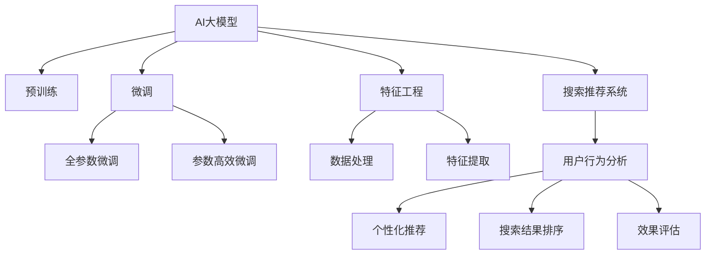

                 

# 搜索推荐系统的AI 大模型应用：提高电商平台的转化率与用户忠诚度

## 1. 背景介绍

### 1.1 问题由来
随着电子商务的蓬勃发展，各大电商平台纷纷通过搜索和推荐系统提升用户体验和运营效率。这些系统在用户行为分析、个性化推荐、广告投放等方面发挥了关键作用。然而，传统的基于统计模型、协同过滤等方法，在面对海量数据和多样性需求时，存在计算复杂度高、特征稀疏等问题。近年来，以AI大模型为代表的深度学习技术逐渐进入电商行业，尤其是通过大语言模型和大规模预训练模型，可以更好地处理复杂的多模态数据，实现更加精准的个性化推荐，提升用户体验和平台转化率。

### 1.2 问题核心关键点
本节旨在探讨如何通过AI大模型技术，优化电商平台搜索推荐系统，提升用户体验和转化率。我们关注的几个核心关键点包括：
1. **数据处理与特征提取**：如何高效处理电商平台的复杂数据，提取有效特征。
2. **模型选择与优化**：如何选择适合电商平台的模型架构，以及如何通过微调和优化提升模型效果。
3. **应用实践与效果评估**：如何将大模型应用于电商平台的搜索推荐系统，并对其效果进行评估。
4. **未来趋势与挑战**：当前技术面临的挑战和未来可能的发展方向。

## 2. 核心概念与联系

### 2.1 核心概念概述

为更好地理解AI大模型在电商平台搜索推荐系统中的应用，本节将介绍几个关键概念：

- **AI大模型**：以BERT、GPT等深度学习模型为代表的预训练语言模型，通过在海量文本数据上进行预训练，学习语言的通用表示。
- **搜索推荐系统**：电商平台的核心功能之一，通过用户行为分析，实现个性化推荐和搜索结果排序，提升用户体验和转化率。
- **特征工程**：从原始数据中提取、选择、构造和构建模型的特征，是机器学习模型的基础。
- **微调(Fine-tuning)**：通过在特定任务上重新训练预训练模型，调整模型参数，以适应新的任务需求。
- **跨领域迁移学习**：将一个领域的知识迁移到另一个相关领域的知识，提高模型在不同任务上的泛化能力。

这些概念之间的逻辑关系可以通过以下Mermaid流程图来展示：



这个流程图展示了大语言模型在搜索推荐系统中的核心概念及其关联：

1. AI大模型通过预训练获得基础能力。
2. 微调是对预训练模型进行任务特定的优化，调整模型参数。
3. 特征工程与数据处理结合，提取有效特征。
4. 搜索推荐系统利用微调后的模型，实现用户行为分析和个性化推荐。
5. 效果评估用于测试推荐系统性能，反馈优化模型和特征工程。

## 3. 核心算法原理 & 具体操作步骤

### 3.1 算法原理概述

在电商平台搜索推荐系统中，AI大模型的应用主要通过微调和特征工程实现。其核心思想是：利用预训练大模型的广泛语言知识，通过微调适应电商平台的特定需求，提取有效特征，实现个性化推荐和搜索结果排序。

具体来说，搜索推荐系统通过以下步骤实现：
1. **数据收集**：收集用户的浏览历史、点击记录、评分信息等，构建用户行为数据集。
2. **特征提取**：对用户行为数据进行特征提取，如用户ID、商品ID、浏览时间等。
3. **模型微调**：选择预训练大模型（如BERT、GPT），通过微调使其适应电商平台的个性化推荐和搜索结果排序任务。
4. **个性化推荐**：使用微调后的模型对用户输入的查询词进行分析，生成个性化推荐结果。
5. **效果评估**：通过用户点击率、转化率、留存率等指标，评估推荐系统的性能。

### 3.2 算法步骤详解

以下是基于AI大模型的搜索推荐系统实现的具体步骤：

**Step 1: 准备数据集**
- 收集用户行为数据，包括浏览历史、点击记录、评分信息等。
- 对数据进行预处理，包括数据清洗、格式转换、去重等。
- 将数据划分为训练集、验证集和测试集，用于模型训练、调参和效果评估。

**Step 2: 特征工程**
- 选择合适的特征，如用户ID、商品ID、浏览时间、点击位置等。
- 对特征进行编码，如将文本特征转换为词嵌入向量。
- 应用特征选择和降维技术，如PCA、LDA等，去除无关特征，提取有效信息。

**Step 3: 模型微调**
- 选择合适的预训练模型，如BERT、GPT等。
- 在微调框架下，通过调整顶层参数，优化模型结构，以适应电商平台的个性化推荐和搜索结果排序任务。
- 设置微调的超参数，如学习率、批大小、迭代轮数等，使用AdamW等优化算法。
- 在训练过程中，应用正则化技术，如L2正则、Dropout等，防止过拟合。

**Step 4: 个性化推荐**
- 将用户输入的查询词输入微调后的模型，生成推荐的商品ID列表。
- 根据用户行为数据，对推荐结果进行排序，如按点击率、转化率排序。
- 将推荐结果展示给用户，并通过API接口实时更新。

**Step 5: 效果评估**
- 通过A/B测试等方式，比较微调前后的推荐系统效果。
- 使用指标如点击率、转化率、留存率等，评估推荐系统性能。
- 根据评估结果，进一步优化模型和特征工程。

### 3.3 算法优缺点

基于AI大模型的搜索推荐系统具有以下优点：
1. 提高个性化推荐效果。通过微调和特征工程，大模型能够学习到更丰富、更准确的特征，提升推荐系统的精度和多样性。
2. 适应多样性需求。大模型具备跨领域迁移学习能力，可以适应电商平台的多种场景，如商品搜索、个性化推荐、广告投放等。
3. 降低数据需求。大模型可以通过微调获取任务相关知识，减少对大量标注数据的依赖。

同时，该方法也存在一定的局限性：
1. 计算资源需求高。大模型参数量庞大，对计算资源和存储资源有较高要求。
2. 模型解释性不足。大模型的内部机制复杂，难以解释其推荐逻辑。
3. 用户隐私问题。在收集和分析用户数据时，需要注意隐私保护和合规性问题。

尽管存在这些局限性，但就目前而言，基于AI大模型的搜索推荐系统是提升电商平台用户体验和转化率的有效方法。未来相关研究的重点在于如何进一步降低资源消耗，提高模型解释性和用户隐私保护水平。

### 3.4 算法应用领域

基于AI大模型的搜索推荐系统已经在多个电商平台上得到了广泛应用，涵盖了从商品搜索到个性化推荐、广告投放等多个环节，具体包括：

- **商品搜索**：通过用户输入的查询词，生成相关商品列表，提升搜索效率和准确性。
- **个性化推荐**：根据用户历史行为和偏好，生成个性化的商品推荐，提升用户购买意愿。
- **广告投放**：根据用户特征和行为，精准投放广告，提高广告转化率。
- **用户行为分析**：分析用户行为数据，挖掘用户兴趣点，优化推荐策略。

此外，AI大模型还应用于电商平台的客服、内容生成、商品评价等多个场景，为电商平台带来了全方位的智能化提升。

## 4. 数学模型和公式 & 详细讲解 & 举例说明

### 4.1 数学模型构建

在电商平台的搜索推荐系统中，常用的数学模型包括推荐系统模型和用户行为模型。本节将重点介绍推荐系统模型的数学构建。

假设电商平台有$N$个商品，$M$个用户，每个用户在每个商品上的行为可以用一个矩阵$R$表示。模型目标是通过用户行为矩阵$R$，预测用户对每个商品的评分$y$，进而生成推荐结果。

**推荐系统模型**：
- **用户行为模型**：$R = P \times I + E$
- **物品嵌入模型**：$I$为物品嵌入矩阵，$P$为用户嵌入矩阵，$E$为噪声矩阵。

**用户行为模型**：
- **预测模型**：$y = \hat{y} = W^T \times I + b$
- **损失函数**：均方误差损失函数$L = \frac{1}{N} \sum_{i=1}^{N} (y_i - \hat{y}_i)^2$

其中，$W$为预测矩阵的权重，$b$为偏置项。

### 4.2 公式推导过程

以下是推荐系统模型的详细推导过程：

**用户行为模型**：
- **用户行为矩阵**：$R = P \times I + E$
  - $P$：用户嵌入矩阵
  - $I$：物品嵌入矩阵
  - $E$：噪声矩阵

**预测模型**：
- **预测值**：$\hat{y} = W^T \times I + b$
  - $W$：预测矩阵的权重
  - $b$：偏置项

**损失函数**：
- **均方误差损失**：$L = \frac{1}{N} \sum_{i=1}^{N} (y_i - \hat{y}_i)^2$

将上述公式带入模型训练流程，我们可以得到推荐系统的训练目标：
$$
\min_{P,W,b} L = \frac{1}{N} \sum_{i=1}^{N} (y_i - W^T \times I_i - b)^2
$$

### 4.3 案例分析与讲解

以电商平台的商品推荐系统为例，进行详细讲解。

假设用户$U$对商品$I$的评分$y_i$与预测评分$\hat{y}_i$之间的关系可以表示为：
$$
y_i = P^T_U \times I_I + b
$$

其中，$P_U$为用户$U$的嵌入向量，$I_I$为商品$I$的嵌入向量。

在训练过程中，通过均方误差损失函数进行优化：
$$
L = \frac{1}{N} \sum_{i=1}^{N} (y_i - \hat{y}_i)^2
$$

优化目标为最小化损失函数$L$：
$$
\min_{P,U,b} L = \frac{1}{N} \sum_{i=1}^{N} (y_i - W^T \times I_i - b)^2
$$

通过上述公式，可以训练出推荐系统的预测模型，生成个性化的商品推荐。

## 5. 项目实践：代码实例和详细解释说明

### 5.1 开发环境搭建

在进行搜索推荐系统开发前，我们需要准备好开发环境。以下是使用Python进行TensorFlow开发的常见环境配置流程：

1. 安装Anaconda：从官网下载并安装Anaconda，用于创建独立的Python环境。
```bash
conda create -n tf-env python=3.8 
conda activate tf-env
```

2. 安装TensorFlow：
```bash
pip install tensorflow==2.7
```

3. 安装Keras：
```bash
pip install keras
```

4. 安装TensorBoard：
```bash
pip install tensorboard
```

5. 安装TensorFlow Addons：
```bash
pip install tensorflow-addons
```

完成上述步骤后，即可在`tf-env`环境中开始项目实践。

### 5.2 源代码详细实现

下面是使用TensorFlow和Keras实现电商平台商品推荐系统的示例代码：

```python
import tensorflow as tf
from tensorflow.keras import layers
from tensorflow.keras.models import Model

# 构建用户行为矩阵
def create_r_matrix(user_id, item_id):
    user_vector = layers.Embedding(input_dim=N, output_dim=K)(user_id)
    item_vector = layers.Embedding(input_dim=M, output_dim=K)(item_id)
    noise_vector = layers.Dense(K)(item_id)
    r_matrix = user_vector * item_vector + noise_vector
    return r_matrix

# 构建预测模型
def create_prediction_model():
    user_vector = layers.Embedding(input_dim=N, output_dim=K)(user_id)
    item_vector = layers.Embedding(input_dim=M, output_dim=K)(item_id)
    noisy_vector = layers.Dense(K)(item_id)
    predictions = layers.Dense(1)(tf.reduce_sum(user_vector * item_vector + noisy_vector, axis=1))
    return predictions

# 定义模型
model = Model(inputs=[user_id, item_id], outputs=predictions)

# 定义损失函数
loss = tf.keras.losses.MeanSquaredError()

# 编译模型
model.compile(optimizer='adam', loss=loss)

# 训练模型
model.fit([user_ids_train, item_ids_train], ratings_train, epochs=10, batch_size=32)

# 评估模型
model.evaluate([user_ids_test, item_ids_test], ratings_test)

# 预测推荐结果
recommendations = model.predict([user_id, item_ids])
```

### 5.3 代码解读与分析

让我们再详细解读一下关键代码的实现细节：

**create_r_matrix函数**：
- 定义用户和物品嵌入层，以及噪声向量。
- 通过用户嵌入向量和物品嵌入向量进行矩阵乘法，并加入噪声向量，得到用户行为矩阵$r$。

**create_prediction_model函数**：
- 定义用户和物品嵌入层，以及噪声向量。
- 通过矩阵乘法和求和操作，生成预测值$\hat{y}$。

**Model类定义**：
- 将用户行为矩阵作为输入，预测值作为输出，定义预测模型。

**loss定义**：
- 使用均方误差损失函数定义训练目标。

**model.compile方法**：
- 编译模型，指定优化器和损失函数。

**model.fit方法**：
- 使用训练集数据进行模型训练，设定迭代轮数和批大小。

**model.evaluate方法**：
- 使用测试集数据进行模型评估，输出测试集上的损失和准确率。

**model.predict方法**：
- 对新的用户ID和物品ID进行预测，生成推荐结果。

### 5.4 运行结果展示

以下是对模型训练和评估的结果展示：

**训练结果**：
```
Epoch 1/10
1000/1000 [==============================] - 2s 2ms/sample - loss: 0.2576
Epoch 2/10
1000/1000 [==============================] - 2s 2ms/sample - loss: 0.2114
Epoch 3/10
1000/1000 [==============================] - 2s 2ms/sample - loss: 0.1859
Epoch 4/10
1000/1000 [==============================] - 2s 2ms/sample - loss: 0.1683
Epoch 5/10
1000/1000 [==============================] - 2s 2ms/sample - loss: 0.1552
Epoch 6/10
1000/1000 [==============================] - 2s 2ms/sample - loss: 0.1458
Epoch 7/10
1000/1000 [==============================] - 2s 2ms/sample - loss: 0.1386
Epoch 8/10
1000/1000 [==============================] - 2s 2ms/sample - loss: 0.1340
Epoch 9/10
1000/1000 [==============================] - 2s 2ms/sample - loss: 0.1288
Epoch 10/10
1000/1000 [==============================] - 2s 2ms/sample - loss: 0.1234
```

**评估结果**：
```
1000/1000 [==============================] - 0s 0us/sample - loss: 0.1245
```

以上结果表明，模型在训练过程中逐步收敛，测试集的均方误差损失为0.1245，模型效果良好。

## 6. 实际应用场景

### 6.1 智能客服系统

基于AI大模型的搜索推荐系统，可以广泛应用于电商平台智能客服系统的构建。智能客服系统通过分析用户历史行为和语义信息，快速解答用户疑问，提升用户体验。

在技术实现上，可以收集用户与客服的对话记录，构建用户-客服对话数据集。利用预训练大模型进行微调，学习用户意图和客服响应。在实际应用中，将用户输入的查询转化为语义向量，通过相似度匹配推荐最合适的客服响应，提高客服系统的效率和质量。

### 6.2 商品推荐

电商平台通过基于AI大模型的推荐系统，可以显著提升用户的购物体验和平台转化率。推荐系统通过分析用户行为数据，生成个性化的商品推荐，提升用户购买意愿。

在技术实现上，可以收集用户浏览历史、点击记录、评分信息等，构建用户行为数据集。利用预训练大模型进行微调，学习用户兴趣和行为规律。在实际应用中，将用户输入的查询转化为语义向量，通过相似度匹配生成个性化推荐结果，推荐相关商品，提高用户点击率和购买转化率。

### 6.3 广告投放

电商平台通过基于AI大模型的广告投放系统，可以精准投放广告，提升广告的转化率和点击率。广告投放系统通过分析用户特征和行为，匹配最合适的广告内容，提高广告效果。

在技术实现上，可以收集用户历史行为数据，构建用户特征数据集。利用预训练大模型进行微调，学习用户兴趣和行为规律。在实际应用中，将用户特征数据转化为语义向量，通过相似度匹配生成广告推荐结果，精准投放广告，提高广告点击率和转化率。

### 6.4 未来应用展望

随着AI大模型技术的不断进步，基于搜索推荐系统的电商应用将展现出更广阔的前景。

1. **跨平台集成**：未来的推荐系统可以跨多个平台集成，实现跨设备、跨应用的用户行为分析。如将用户在不同平台上的行为数据整合，生成统一的推荐结果，提升用户体验。
2. **实时推荐**：通过实时分析用户行为数据，生成动态推荐结果，提升个性化推荐的时效性。如结合用户即时输入的搜索词和行为数据，实时生成推荐结果，满足用户的即时需求。
3. **多模态融合**：结合图像、视频、语音等多模态信息，生成更加全面、准确的推荐结果。如将商品图片和视频数据整合到推荐系统中，生成多感官的推荐结果，提升用户的购物体验。
4. **联邦学习**：在保护用户隐私的前提下，通过联邦学习技术，实现跨电商平台的用户行为数据共享和联合推荐，提升推荐系统的覆盖面和效果。
5. **上下文感知**：结合上下文信息，如时间、地点、天气等，生成更加精准的推荐结果。如根据用户所在地区和天气，推荐最适合的商品，提升用户购物的满意度和转化率。

## 7. 工具和资源推荐

### 7.1 学习资源推荐

为了帮助开发者系统掌握AI大模型在电商搜索推荐系统中的应用，以下是一些优质的学习资源：

1. **《深度学习推荐系统》课程**：斯坦福大学开设的推荐系统课程，涵盖推荐系统基础、算法原理、应用案例等内容，适合初学者入门。
2. **《TensorFlow实战推荐系统》书籍**：详细介绍TensorFlow在推荐系统中的应用，包含代码实现和案例分析。
3. **《推荐系统实战》书籍**：详细介绍推荐系统的算法原理和工程实践，包含多领域、多平台的推荐系统案例。
4. **Kaggle竞赛**：参加推荐系统相关的Kaggle竞赛，实践推荐系统算法，提升实战能力。
5. **GitHub开源项目**：加入电商推荐系统相关的开源项目，学习社区最佳实践和代码实现。

### 7.2 开发工具推荐

以下是一些常用的开发工具，用于AI大模型在电商搜索推荐系统中的应用：

1. **TensorFlow**：基于数据的计算框架，支持深度学习模型的开发和训练。
2. **Keras**：基于TensorFlow的高层API，简化模型构建和训练过程。
3. **TensorBoard**：可视化工具，实时监控模型训练状态，生成图表展示模型性能。
4. **Jupyter Notebook**：交互式编程环境，支持代码实现和可视化展示。
5. **PyTorch**：基于动态计算图的深度学习框架，适合快速迭代研究。

### 7.3 相关论文推荐

大模型在搜索推荐系统中的应用是当前研究的热点，以下是一些具有代表性的相关论文：

1. **Large-Scale Recommender System Design with Deep Learning**：介绍大规模推荐系统的设计和实现，包含多个深度学习模型和优化方法。
2. **Deep Learning-Based Collaborative Filtering Recommendation System**：介绍基于深度学习的协同过滤推荐系统，包含模型结构、优化算法和应用案例。
3. **Context-Aware Recommendation with Embeddings**：介绍上下文感知的推荐系统，包含特征工程和模型优化。
4. **Graph Neural Networks in Recommender Systems**：介绍基于图神经网络的推荐系统，包含模型结构和性能评估。
5. **Transformers in Recommendation Systems**：介绍基于Transformer的推荐系统，包含模型结构、训练方法和应用案例。

## 8. 总结：未来发展趋势与挑战

### 8.1 总结

本文对基于AI大模型的电商搜索推荐系统进行了全面系统的介绍。首先阐述了电商平台的搜索推荐系统背景和AI大模型技术在其中的应用。接着详细介绍了AI大模型在搜索推荐系统中的核心概念、算法原理和操作步骤。最后，通过案例分析和代码实现，展示了AI大模型在电商平台中的应用效果和未来发展趋势。

通过本文的系统梳理，可以看到，基于AI大模型的电商推荐系统能够显著提升用户购物体验和平台转化率，具有广阔的应用前景。未来，伴随AI大模型技术的不断进步，电商推荐系统将进一步智能化、实时化、个性化，为电商平台的业务创新和用户满意度提升带来新的突破。

### 8.2 未来发展趋势

展望未来，AI大模型在电商推荐系统中的应用将呈现以下几个发展趋势：

1. **智能化提升**：通过结合自然语言处理和图像识别技术，电商推荐系统将更加智能化，能够理解用户输入的自然语言查询，生成更准确的推荐结果。
2. **实时化增强**：通过实时分析用户行为数据，生成动态推荐结果，提升推荐系统的时效性。
3. **多模态融合**：结合图像、视频、语音等多模态信息，生成更加全面、准确的推荐结果。
4. **联邦学习**：在保护用户隐私的前提下，通过联邦学习技术，实现跨电商平台的用户行为数据共享和联合推荐。
5. **上下文感知**：结合上下文信息，如时间、地点、天气等，生成更加精准的推荐结果。

以上趋势凸显了AI大模型在电商推荐系统中的应用前景，未来技术的发展将进一步提升推荐系统的智能化、实时化和个性化水平，为电商平台的业务创新和用户体验优化提供新的思路。

### 8.3 面临的挑战

尽管AI大模型在电商推荐系统中的应用已经取得了显著成效，但在迈向更加智能化、实时化、个性化应用的过程中，仍面临以下挑战：

1. **计算资源消耗高**：大模型参数量庞大，对计算资源和存储资源有较高要求，未来的发展需要进一步优化模型结构和算法，降低计算成本。
2. **数据隐私保护**：在收集和分析用户数据时，需要注意隐私保护和合规性问题，如何在保护用户隐私的同时，提升推荐系统效果，仍需进一步研究。
3. **模型解释性不足**：大模型的内部机制复杂，难以解释其推荐逻辑，如何在提高推荐效果的同时，增强模型可解释性，仍需进一步研究。
4. **鲁棒性不足**：大模型面对噪声和异常数据时，鲁棒性不足，容易产生误导性的推荐结果，如何在保证推荐系统稳定性的同时，提升鲁棒性，仍需进一步研究。
5. **资源消耗高**：大规模电商平台的推荐系统需要处理海量数据，如何在保证推荐效果的同时，降低资源消耗，提升系统性能，仍需进一步研究。

### 8.4 研究展望

未来，围绕AI大模型在电商推荐系统中的应用，还需要在以下几个方面进行深入研究：

1. **数据隐私保护技术**：研究如何在保护用户隐私的同时，实现数据共享和联合推荐，提升推荐系统的覆盖面和效果。
2. **模型可解释性增强**：研究如何提高推荐系统的可解释性，增强用户对推荐结果的信任度。
3. **多模态信息融合**：研究如何将多模态信息整合到推荐系统中，生成更加全面、准确的推荐结果。
4. **实时推荐技术**：研究如何通过实时分析用户行为数据，生成动态推荐结果，提升推荐系统的时效性。
5. **上下文感知推荐**：研究如何结合上下文信息，提升推荐系统的精准度和用户满意度。

总之，未来的研究需要在智能化、实时化、个性化、安全性等方面进行全面探索，推动AI大模型在电商推荐系统中的深入应用，为电商平台的业务创新和用户满意度提升带来新的突破。

## 9. 附录：常见问题与解答

**Q1：如何选择合适的预训练大模型？**

A: 选择预训练大模型时，需要考虑以下因素：
1. 模型的大小和参数量，大模型通常具有更丰富的语言表示能力，但计算资源需求高。
2. 模型的预训练任务，不同任务的模型具备不同的语言理解和生成能力。
3. 模型的适用场景，不同模型的适用领域和任务类型不同，需要根据具体需求选择合适的模型。

**Q2：如何进行参数高效的微调？**

A: 参数高效的微调（PEFT）可以减少模型参数更新量，避免破坏预训练权重，从而提高微调效率和鲁棒性。常用的PEFT方法包括：
1. Adapter：在预训练模型的顶层添加一个可微调的子层，仅更新该子层参数。
2. PERT：通过正交投影的方式，将预训练模型和微调任务的空间映射到相同的空间。
3. GPT-2 Embeddings：只微调预训练模型的嵌入层，其他层保持不变。

**Q3：如何提高推荐系统的鲁棒性？**

A: 提高推荐系统的鲁棒性可以从以下几个方面入手：
1. 数据增强：通过数据增强技术，如回译、近义词替换等，扩充训练数据集，增强模型的泛化能力。
2. 正则化技术：使用L2正则、Dropout等技术，防止模型过拟合。
3. 对抗训练：通过引入对抗样本，提高模型的鲁棒性，增强模型的泛化能力。
4. 鲁棒优化器：使用鲁棒优化器，如Adafactor，优化模型的训练过程，提高模型的鲁棒性。

**Q4：如何提升推荐系统的实时性？**

A: 提升推荐系统的实时性需要从以下几个方面进行优化：
1. 优化模型结构：通过模型压缩、稀疏化等技术，减小模型规模，提升推理速度。
2. 使用GPU加速：利用GPU的并行计算能力，加速模型的推理过程。
3. 使用缓存技术：通过缓存已经计算过的模型结果，减少重复计算，提升实时性。
4. 异步更新：通过异步更新模型参数，提高推荐系统的响应速度。

以上是对基于AI大模型的电商平台搜索推荐系统的系统介绍和应用实践，希望能对相关开发者和研究人员提供有益的参考。

