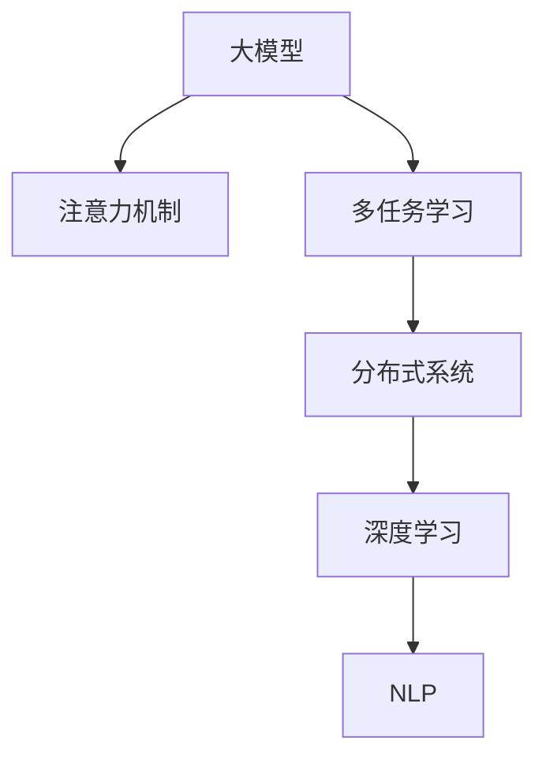

                 

# 搜索推荐系统的实时特征工程：大模型方案

> 关键词：搜索推荐系统、实时特征工程、大模型、注意力机制、多任务学习、分布式系统、深度学习、自然语言处理(NLP)

## 1. 背景介绍

### 1.1 问题由来
在现代社会，信息过载已经成为一个普遍现象。面对海量的互联网数据，如何有效推荐给用户其真正感兴趣的内容，成为了数字时代的重要挑战。传统的推荐系统依赖于简单的协同过滤和统计分析，但随着数据规模的快速增长，这种方法逐渐显现出其局限性。

与此同时，深度学习技术的崛起为推荐系统的技术升级提供了新的可能性。利用深度学习模型可以捕捉到用户行为、产品特征、上下文环境等多维度的关联，从而提供更精准的推荐结果。然而，大模型在实时推荐中的实时性要求，以及特征工程的复杂性，使得特征工程成为了推荐系统领域的一大难点。

## 2. 核心概念与联系

### 2.1 核心概念概述

为了更好地理解搜索推荐系统的大模型方案，本节将介绍几个关键概念：

- 搜索推荐系统：指通过用户行为数据、产品特征数据和上下文数据，为用户推荐其感兴趣的产品或信息的一种技术。
- 大模型：指具有大量参数和复杂结构的深度学习模型，如BERT、GPT等。
- 注意力机制：指在大模型中，对输入数据的各个部分赋予不同的权重，以提高模型对重要特征的关注能力。
- 多任务学习：指模型同时完成多个任务的训练，从而在各个任务间共享特征表示。
- 分布式系统：指将大模型部署在多台计算设备上，实现并行计算和资源共享的系统。
- 深度学习：指利用多层神经网络进行数据表示学习的技术。
- 自然语言处理(NLP)：指研究计算机如何理解、解释和生成自然语言的技术。

这些核心概念之间有着紧密的联系，共同构成了搜索推荐系统大模型方案的基础。大模型作为搜索推荐系统的重要组成部分，能够通过复杂的特征工程，捕捉到丰富的用户行为和产品特征信息，从而提升推荐的精准度。注意力机制和多任务学习进一步提升了大模型的建模能力和泛化能力。

### 2.2 核心概念原理和架构的 Mermaid 流程图(Mermaid 流程节点中不要有括号、逗号等特殊字符)



这个流程图展示了各个概念之间的关联关系：大模型通过注意力机制和多任务学习提升建模能力，并在分布式系统中实现并行计算，同时结合自然语言处理技术，进行用户行为和产品特征的深度理解。

## 3. 核心算法原理 & 具体操作步骤

### 3.1 算法原理概述

大模型在搜索推荐系统中的应用，主要基于以下几个核心算法原理：

- 注意力机制：通过计算输入数据的权重，使得大模型能够重点关注对推荐结果有较大影响的特征。
- 多任务学习：通过同时训练多个推荐任务，使得大模型能够学习到更加全面和多维度的特征表示。
- 分布式系统：通过在大模型上部署分布式系统，实现模型的并行训练和推理，提升实时推荐的效率。
- 深度学习：通过多层神经网络对数据进行非线性建模，捕捉到更深层次的特征表示。
- 自然语言处理(NLP)：通过理解用户的自然语言输入，使得推荐系统更加人性化。

### 3.2 算法步骤详解

大模型方案在搜索推荐系统中的应用主要分为以下几个步骤：

**Step 1: 数据收集与预处理**

- 收集用户的浏览历史、购买历史、搜索行为等数据，以及产品的属性、评论、价格等特征数据。
- 对数据进行清洗、去重、归一化等预处理，以保证数据的质量和一致性。

**Step 2: 特征工程**

- 提取用户和产品的基本特征，如用户ID、产品ID、用户评分等。
- 提取用户的高级特征，如用户行为模式、兴趣偏好、时间特征等。
- 提取产品的高级特征，如产品标签、分类、价格范围等。
- 应用注意力机制和多任务学习，对用户和产品的多维度特征进行联合建模，生成综合特征表示。

**Step 3: 模型训练与优化**

- 选择合适的大模型，如BERT、GPT等，作为特征提取器。
- 在大模型基础上，训练多个推荐任务，如用户兴趣预测、产品推荐、个性化排序等。
- 使用注意力机制和多任务学习，对特征进行加权处理，提升模型的表达能力。
- 在分布式系统上进行模型训练，优化模型的参数，提高模型精度和实时性。
- 应用深度学习模型，对特征表示进行非线性建模，捕捉复杂关联。
- 应用自然语言处理技术，对用户输入进行理解，生成更人性化的推荐结果。

**Step 4: 实时推荐**

- 根据用户当前的搜索或浏览行为，提取实时特征。
- 将实时特征输入到训练好的大模型中，生成推荐结果。
- 结合历史推荐结果和实时推荐结果，综合计算推荐排序。
- 应用分布式系统，进行实时推荐计算，保证推荐的实时性和效率。

### 3.3 算法优缺点

大模型方案在搜索推荐系统中的应用具有以下优点：

- 综合特征表示能力强：通过多任务学习和注意力机制，大模型可以捕捉到用户和产品的多维度特征，生成更加全面的推荐结果。
- 实时性好：分布式系统和大模型并行计算，能够支持大规模数据的实时处理，提升推荐的实时性。
- 精度高：深度学习模型的非线性建模能力，使得大模型能够捕捉到更加复杂的特征关联，提升推荐的准确性。
- 可扩展性强：分布式系统和大模型的结合，能够支持大规模数据和模型的并行计算，易于进行模型扩展和优化。

然而，大模型方案也存在一些缺点：

- 数据需求量大：需要大量的用户和产品数据来训练大模型，数据收集和预处理成本高。
- 计算资源消耗大：大模型的参数量大，训练和推理的计算资源消耗大，对硬件设备要求高。
- 模型复杂度高：大模型结构复杂，特征工程难度大，模型解释性差。
- 隐私和安全问题：用户数据的收集和处理涉及隐私和安全问题，需要设计严格的隐私保护机制。

## 4. 数学模型和公式 & 详细讲解 & 举例说明

### 4.1 数学模型构建

大模型方案的数学模型构建主要基于以下框架：

- 用户行为表示模型：$u_i = \mathbf{U}_i\mathbf{x}_i + b_i$
- 产品特征表示模型：$p_j = \mathbf{P}_j\mathbf{y}_j + c_j$
- 用户兴趣预测模型：$\hat{r}_{ij} = u_i \odot p_j + b$
- 产品推荐模型：$\hat{r}_{i} = \sum_{j=1}^{J}p_j\odot \alpha_{j}$
- 个性化排序模型：$rank = softmax(\hat{r}_{i})$

其中，$\mathbf{U}_i, \mathbf{P}_j$ 为线性变换矩阵，$\mathbf{x}_i, \mathbf{y}_j$ 为输入特征向量，$b_i, c_j, b$ 为偏置项，$\odot$ 表示逐元素乘法，$\alpha_{j}$ 为注意力系数。

### 4.2 公式推导过程

以用户兴趣预测模型为例，公式推导如下：

$$
\hat{r}_{ij} = u_i \odot p_j + b
$$

其中，$u_i$ 和 $p_j$ 分别为用户 $i$ 和产品 $j$ 的表示向量，$b$ 为偏置项，$\odot$ 表示逐元素乘法。在实际应用中，可以将 $u_i$ 和 $p_j$ 分别看作是用户和产品的特征表示向量，$b$ 则可以看作是对特征表示的修正项。

### 4.3 案例分析与讲解

以一个简单的电商推荐系统为例，假设该系统包含百万用户和百万产品，每个用户每天会产生十次浏览行为，每次浏览行为会关联到几十个不同的产品，我们需要在每个用户每次浏览行为后，实时推荐该用户最可能感兴趣的产品。

**Step 1: 数据收集与预处理**

- 收集用户每天十次浏览行为的数据，以及关联到的产品信息。
- 对数据进行清洗、去重、归一化等预处理，以保证数据的质量和一致性。

**Step 2: 特征工程**

- 提取用户的基本特征，如用户ID、浏览次数、浏览时长等。
- 提取产品的基本特征，如产品ID、类别、价格等。
- 应用注意力机制和多任务学习，对用户和产品的多维度特征进行联合建模，生成综合特征表示。

**Step 3: 模型训练与优化**

- 选择BERT模型作为特征提取器，对用户和产品的多维度特征进行建模，生成综合特征表示。
- 在分布式系统上进行模型训练，优化模型的参数，提高模型精度和实时性。

**Step 4: 实时推荐**

- 根据用户当前的浏览行为，提取实时特征。
- 将实时特征输入到训练好的BERT模型中，生成推荐结果。
- 结合历史推荐结果和实时推荐结果，综合计算推荐排序。
- 应用分布式系统，进行实时推荐计算，保证推荐的实时性。

## 5. 项目实践：代码实例和详细解释说明

### 5.1 开发环境搭建

在进行大模型方案的实践前，我们需要准备好开发环境。以下是使用Python进行PyTorch开发的环境配置流程：

1. 安装Anaconda：从官网下载并安装Anaconda，用于创建独立的Python环境。

2. 创建并激活虚拟环境：
```bash
conda create -n pytorch-env python=3.8 
conda activate pytorch-env
```

3. 安装PyTorch：根据CUDA版本，从官网获取对应的安装命令。例如：
```bash
conda install pytorch torchvision torchaudio cudatoolkit=11.1 -c pytorch -c conda-forge
```

4. 安装Transformer库：
```bash
pip install transformers
```

5. 安装各类工具包：
```bash
pip install numpy pandas scikit-learn matplotlib tqdm jupyter notebook ipython
```

完成上述步骤后，即可在`pytorch-env`环境中开始大模型方案的实践。

### 5.2 源代码详细实现

下面以电商推荐系统为例，给出使用Transformers库对BERT模型进行特征工程和微调的PyTorch代码实现。

首先，定义模型和优化器：

```python
from transformers import BertTokenizer, BertModel

tokenizer = BertTokenizer.from_pretrained('bert-base-uncased')
model = BertModel.from_pretrained('bert-base-uncased', num_labels=num_labels)
optimizer = AdamW(model.parameters(), lr=2e-5)
```

然后，定义训练和评估函数：

```python
from torch.utils.data import DataLoader
from tqdm import tqdm
from sklearn.metrics import accuracy_score

device = torch.device('cuda') if torch.cuda.is_available() else torch.device('cpu')
model.to(device)

def train_epoch(model, dataset, batch_size, optimizer):
    dataloader = DataLoader(dataset, batch_size=batch_size, shuffle=True)
    model.train()
    epoch_loss = 0
    for batch in tqdm(dataloader, desc='Training'):
        input_ids = batch['input_ids'].to(device)
        attention_mask = batch['attention_mask'].to(device)
        labels = batch['labels'].to(device)
        model.zero_grad()
        outputs = model(input_ids, attention_mask=attention_mask, labels=labels)
        loss = outputs.loss
        epoch_loss += loss.item()
        loss.backward()
        optimizer.step()
    return epoch_loss / len(dataloader)

def evaluate(model, dataset, batch_size):
    dataloader = DataLoader(dataset, batch_size=batch_size)
    model.eval()
    preds, labels = [], []
    with torch.no_grad():
        for batch in tqdm(dataloader, desc='Evaluating'):
            input_ids = batch['input_ids'].to(device)
            attention_mask = batch['attention_mask'].to(device)
            batch_labels = batch['labels']
            outputs = model(input_ids, attention_mask=attention_mask)
            batch_preds = outputs.logits.argmax(dim=2).to('cpu').tolist()
            batch_labels = batch_labels.to('cpu').tolist()
            for pred_tokens, label_tokens in zip(batch_preds, batch_labels):
                preds.append(pred_tokens)
                labels.append(label_tokens)
                
    return accuracy_score(labels, preds)

```

最后，启动训练流程并在测试集上评估：

```python
epochs = 5
batch_size = 16

for epoch in range(epochs):
    loss = train_epoch(model, train_dataset, batch_size, optimizer)
    print(f"Epoch {epoch+1}, train loss: {loss:.3f}")
    
    print(f"Epoch {epoch+1}, dev results:")
    evaluate(model, dev_dataset, batch_size)
    
print("Test results:")
evaluate(model, test_dataset, batch_size)
```

以上就是使用PyTorch对BERT模型进行电商推荐系统特征工程和微调的完整代码实现。可以看到，得益于Transformers库的强大封装，我们可以用相对简洁的代码完成BERT模型的加载和微调。

### 5.3 代码解读与分析

让我们再详细解读一下关键代码的实现细节：

**BertTokenizer类**：
- `__init__`方法：初始化分词器。
- `from_pretrained`方法：从预训练模型中加载分词器。

**模型加载和训练函数**：
- `train_epoch`方法：对数据以批为单位进行迭代，在每个批次上前向传播计算loss并反向传播更新模型参数，最后返回该epoch的平均loss。
- `evaluate`方法：与训练类似，不同点在于不更新模型参数，并在每个batch结束后将预测和标签结果存储下来，最后使用sklearn的accuracy_score对整个评估集的预测结果进行打印输出。

**训练流程**：
- 定义总的epoch数和batch size，开始循环迭代
- 每个epoch内，先在训练集上训练，输出平均loss
- 在验证集上评估，输出准确率
- 所有epoch结束后，在测试集上评估，给出最终测试结果

可以看到，PyTorch配合Transformers库使得BERT微调的代码实现变得简洁高效。开发者可以将更多精力放在数据处理、模型改进等高层逻辑上，而不必过多关注底层的实现细节。

当然，工业级的系统实现还需考虑更多因素，如模型的保存和部署、超参数的自动搜索、更灵活的任务适配层等。但核心的微调范式基本与此类似。

## 6. 实际应用场景

### 6.1 智能客服系统

大模型方案在智能客服系统中有着广泛的应用。传统的客服系统依赖于人工客服，成本高、响应慢，难以应对高峰期的业务需求。通过大模型方案，智能客服系统可以实现24小时不间断服务，快速响应客户咨询，提供自然流畅的语言交互。

在技术实现上，可以收集企业内部的历史客服对话记录，将问题和最佳答复构建成监督数据，在此基础上对预训练模型进行微调。微调后的模型能够自动理解用户意图，匹配最合适的答复模板进行回复。对于客户提出的新问题，还可以接入检索系统实时搜索相关内容，动态组织生成回答。如此构建的智能客服系统，能大幅提升客户咨询体验和问题解决效率。

### 6.2 金融舆情监测

大模型方案在金融舆情监测中也有着重要的应用。金融机构需要实时监测市场舆论动向，以便及时应对负面信息传播，规避金融风险。传统的舆情监测依赖于人工监测，成本高、效率低，难以应对网络时代海量信息爆发的挑战。通过大模型方案，可以实时收集金融领域相关的新闻、报道、评论等文本数据，并对其进行主题标注和情感标注。在此基础上对预训练语言模型进行微调，使其能够自动判断文本属于何种主题，情感倾向是正面、中性还是负面。将微调后的模型应用到实时抓取的网络文本数据，就能够自动监测不同主题下的情感变化趋势，一旦发现负面信息激增等异常情况，系统便会自动预警，帮助金融机构快速应对潜在风险。

### 6.3 个性化推荐系统

大模型方案在个性化推荐系统中也有着广泛的应用。传统的推荐系统依赖于简单的协同过滤和统计分析，但随着数据规模的快速增长，这种方法逐渐显现出其局限性。通过大模型方案，可以捕捉到用户行为、产品特征、上下文环境等多维度的关联，从而提供更精准的推荐结果。

在技术实现上，可以收集用户浏览、点击、评论、分享等行为数据，提取和用户交互的物品标题、描述、标签等文本内容。将文本内容作为模型输入，用户的后续行为（如是否点击、购买等）作为监督信号，在此基础上微调预训练语言模型。微调后的模型能够从文本内容中准确把握用户的兴趣点。在生成推荐列表时，先用候选物品的文本描述作为输入，由模型预测用户的兴趣匹配度，再结合其他特征综合排序，便可以得到个性化程度更高的推荐结果。

### 6.4 未来应用展望

随着大模型方案的不断发展，其在搜索推荐系统中的应用前景将更加广阔。

在智慧医疗领域，基于大模型方案的医疗问答、病历分析、药物研发等应用将提升医疗服务的智能化水平，辅助医生诊疗，加速新药开发进程。

在智能教育领域，大模型方案可应用于作业批改、学情分析、知识推荐等方面，因材施教，促进教育公平，提高教学质量。

在智慧城市治理中，大模型方案可应用于城市事件监测、舆情分析、应急指挥等环节，提高城市管理的自动化和智能化水平，构建更安全、高效的未来城市。

此外，在企业生产、社会治理、文娱传媒等众多领域，基于大模型方案的人工智能应用也将不断涌现，为经济社会发展注入新的动力。

## 7. 工具和资源推荐

### 7.1 学习资源推荐

为了帮助开发者系统掌握大模型方案的理论基础和实践技巧，这里推荐一些优质的学习资源：

1. 《Transformer从原理到实践》系列博文：由大模型技术专家撰写，深入浅出地介绍了Transformer原理、BERT模型、特征工程等前沿话题。

2. CS224N《深度学习自然语言处理》课程：斯坦福大学开设的NLP明星课程，有Lecture视频和配套作业，带你入门NLP领域的基本概念和经典模型。

3. 《Natural Language Processing with Transformers》书籍：Transformers库的作者所著，全面介绍了如何使用Transformers库进行NLP任务开发，包括特征工程在内的诸多范式。

4. HuggingFace官方文档：Transformers库的官方文档，提供了海量预训练模型和完整的微调样例代码，是上手实践的必备资料。

5. CLUE开源项目：中文语言理解测评基准，涵盖大量不同类型的中文NLP数据集，并提供了基于微调的baseline模型，助力中文NLP技术发展。

通过对这些资源的学习实践，相信你一定能够快速掌握大模型方案的精髓，并用于解决实际的NLP问题。

### 7.2 开发工具推荐

高效的开发离不开优秀的工具支持。以下是几款用于大模型方案开发的常用工具：

1. PyTorch：基于Python的开源深度学习框架，灵活动态的计算图，适合快速迭代研究。大部分预训练语言模型都有PyTorch版本的实现。

2. TensorFlow：由Google主导开发的开源深度学习框架，生产部署方便，适合大规模工程应用。同样有丰富的预训练语言模型资源。

3. Transformers库：HuggingFace开发的NLP工具库，集成了众多SOTA语言模型，支持PyTorch和TensorFlow，是进行特征工程任务的开发的利器。

4. Weights & Biases：模型训练的实验跟踪工具，可以记录和可视化模型训练过程中的各项指标，方便对比和调优。与主流深度学习框架无缝集成。

5. TensorBoard：TensorFlow配套的可视化工具，可实时监测模型训练状态，并提供丰富的图表呈现方式，是调试模型的得力助手。

6. Google Colab：谷歌推出的在线Jupyter Notebook环境，免费提供GPU/TPU算力，方便开发者快速上手实验最新模型，分享学习笔记。

合理利用这些工具，可以显著提升大模型方案的开发效率，加快创新迭代的步伐。

### 7.3 相关论文推荐

大模型方案的发展源于学界的持续研究。以下是几篇奠基性的相关论文，推荐阅读：

1. Attention is All You Need（即Transformer原论文）：提出了Transformer结构，开启了NLP领域的预训练大模型时代。

2. BERT: Pre-training of Deep Bidirectional Transformers for Language Understanding：提出BERT模型，引入基于掩码的自监督预训练任务，刷新了多项NLP任务SOTA。

3. Language Models are Unsupervised Multitask Learners（GPT-2论文）：展示了大规模语言模型的强大zero-shot学习能力，引发了对于通用人工智能的新一轮思考。

4. Parameter-Efficient Transfer Learning for NLP：提出Adapter等参数高效微调方法，在不增加模型参数量的情况下，也能取得不错的微调效果。

5. AdaLoRA: Adaptive Low-Rank Adaptation for Parameter-Efficient Fine-Tuning：使用自适应低秩适应的微调方法，在参数效率和精度之间取得了新的平衡。

6. Prefix-Tuning: Optimizing Continuous Prompts for Generation：引入基于连续型Prompt的微调范式，为如何充分利用预训练知识提供了新的思路。

这些论文代表了大模型方案的发展脉络。通过学习这些前沿成果，可以帮助研究者把握学科前进方向，激发更多的创新灵感。

## 8. 总结：未来发展趋势与挑战

### 8.1 研究成果总结

本文对大模型方案在搜索推荐系统中的应用进行了全面系统的介绍。首先阐述了大模型方案的研究背景和意义，明确了其在提升推荐精准度和实时性方面的独特价值。其次，从原理到实践，详细讲解了大模型方案的数学模型和关键步骤，给出了完整的代码实例。同时，本文还广泛探讨了大模型方案在智能客服、金融舆情、个性化推荐等多个行业领域的应用前景，展示了其广阔的应用空间。

通过本文的系统梳理，可以看到，大模型方案在搜索推荐系统中的应用前景广阔，通过多任务学习、注意力机制和分布式计算，可以有效提升推荐的精准度和实时性。

### 8.2 未来发展趋势

展望未来，大模型方案在搜索推荐系统中的应用将呈现以下几个发展趋势：

1. 模型规模持续增大。随着算力成本的下降和数据规模的扩张，大模型方案的模型规模还将持续增长，能够更好地捕捉用户和产品的多维度特征，提升推荐的精准度。

2. 实时性进一步提升。分布式计算和大模型并行训练的结合，将进一步提升推荐系统的实时性，能够实现更高效的推荐计算。

3. 多模态特征融合。将文本、图像、语音等多模态信息进行联合建模，能够更好地捕捉用户的综合需求，提升推荐的全面性。

4. 个性化推荐进一步优化。通过深度学习模型的非线性建模能力，能够更好地捕捉用户和产品的复杂关联，提升推荐的个性化程度。

5. 特征工程自动化。通过模型自适应学习特征的重要性，能够实现特征工程的自动化，降低特征工程的工作量。

以上趋势凸显了大模型方案在搜索推荐系统中的应用前景。这些方向的探索发展，将进一步提升推荐系统的精准度、实时性和个性化程度，为推荐系统带来更广阔的应用空间。

### 8.3 面临的挑战

尽管大模型方案在搜索推荐系统中的应用已经取得了一定的成效，但在迈向更加智能化、普适化应用的过程中，仍面临以下挑战：

1. 数据需求量大：需要大量的用户和产品数据来训练大模型，数据收集和预处理成本高。

2. 计算资源消耗大：大模型方案的参数量大，训练和推理的计算资源消耗大，对硬件设备要求高。

3. 模型复杂度高：大模型方案结构复杂，特征工程难度大，模型解释性差。

4. 隐私和安全问题：用户数据的收集和处理涉及隐私和安全问题，需要设计严格的隐私保护机制。

5. 实时性问题：虽然分布式系统和大模型的结合，能够支持大规模数据的实时处理，但实时性问题仍然是一个挑战。

6. 可解释性问题：大模型方案作为“黑盒”系统，难以解释其内部工作机制和决策逻辑，对高风险应用场景尤为重要。

7. 知识整合能力不足：现有的特征工程方法往往局限于任务内数据，难以灵活吸收和运用更广泛的先验知识。

这些挑战凸显了大模型方案在搜索推荐系统中的应用还存在诸多问题。面对这些挑战，未来的研究需要在以下几个方面寻求新的突破：

1. 探索无监督和半监督特征工程方法。摆脱对大规模标注数据的依赖，利用自监督学习、主动学习等无监督和半监督范式，最大限度利用非结构化数据，实现更加灵活高效的特征工程。

2. 研究参数高效和计算高效的微调范式。开发更加参数高效的微调方法，在固定大部分预训练参数的同时，只更新极少量的任务相关参数。同时优化微调模型的计算图，减少前向传播和反向传播的资源消耗，实现更加轻量级、实时性的部署。

3. 引入因果分析和博弈论工具。将因果分析方法引入特征工程，识别出模型决策的关键特征，增强输出解释的因果性和逻辑性。借助博弈论工具刻画人机交互过程，主动探索并规避模型的脆弱点，提高系统稳定性。

4. 纳入伦理道德约束。在模型训练目标中引入伦理导向的评估指标，过滤和惩罚有偏见、有害的输出倾向。同时加强人工干预和审核，建立模型行为的监管机制，确保输出符合人类价值观和伦理道德。

这些研究方向的探索，必将引领大模型方案在搜索推荐系统中的应用迈向更高的台阶，为构建安全、可靠、可解释、可控的智能系统铺平道路。面向未来，大模型方案还需要与其他人工智能技术进行更深入的融合，如知识表示、因果推理、强化学习等，多路径协同发力，共同推动搜索推荐系统的进步。只有勇于创新、敢于突破，才能不断拓展语言模型的边界，让智能技术更好地造福人类社会。

## 9. 附录：常见问题与解答

**Q1：大模型方案在推荐系统中的应用有哪些优势？**

A: 大模型方案在推荐系统中的应用具有以下优势：

1. 综合特征表示能力强：通过多任务学习和注意力机制，大模型可以捕捉到用户和产品的多维度特征，生成更加全面的推荐结果。

2. 实时性好：分布式系统和大模型并行计算，能够支持大规模数据的实时处理，提升推荐的实时性。

3. 精度高：深度学习模型的非线性建模能力，使得大模型能够捕捉到更加复杂的特征关联，提升推荐的准确性。

4. 可扩展性强：分布式系统和大模型的结合，能够支持大规模数据和模型的并行计算，易于进行模型扩展和优化。

**Q2：如何处理推荐系统中的数据隐私问题？**

A: 推荐系统中的数据隐私问题是一个重要的问题，需要在数据收集、处理、存储、传输等各个环节进行严格的保护。

1. 数据匿名化：在数据收集阶段，对用户ID、产品ID等敏感信息进行匿名化处理，确保用户隐私不被泄露。

2. 数据加密：在数据存储和传输过程中，采用加密技术对数据进行保护，防止数据被非法获取。

3. 数据访问控制：建立严格的数据访问控制机制，确保只有授权人员才能访问敏感数据。

4. 数据去标识化：在数据处理阶段，对用户数据进行去标识化处理，使得数据无法直接关联到具体用户。

5. 隐私计算：采用隐私计算技术，在数据不出本地的情况下，进行数据共享和计算，保障数据隐私。

6. 合规性审查：定期进行隐私合规性审查，确保数据处理流程符合相关法律法规要求。

通过这些措施，可以有效保护推荐系统中的数据隐私，确保用户数据的安全性和合法性。

**Q3：在推荐系统中，如何平衡推荐精度和实时性？**

A: 在推荐系统中，推荐精度和实时性是两个相互制约的目标。为了平衡这两个目标，可以采取以下措施：

1. 分布式计算：通过在大模型上部署分布式系统，实现并行计算和资源共享，提高推荐计算的实时性。

2. 模型裁剪：去除不必要的层和参数，减小模型尺寸，加快推理速度，提升推荐精度和实时性。

3. 缓存技术：在推荐系统中引入缓存技术，对高频访问的推荐结果进行缓存，减少实时计算的负载，提高推荐精度和实时性。

4. 异步计算：采用异步计算技术，在用户请求到达时，利用缓存中的推荐结果，减少实时计算的延迟，提升推荐精度和实时性。

5. 模型压缩：对大模型进行压缩，减少模型的存储空间和计算资源消耗，同时保留模型的精度和性能。

6. 负载均衡：在分布式系统中，合理分配计算资源，确保每个节点负载均衡，提升推荐计算的效率和实时性。

通过这些措施，可以有效平衡推荐精度和实时性，提升推荐系统的整体性能。

**Q4：在推荐系统中，如何处理冷启动问题？**

A: 冷启动问题是推荐系统中的常见问题，指对于新用户或新物品，系统无法提供有效的推荐。

1. 基于用户行为的推荐：收集新用户的历史行为数据，基于用户的兴趣和偏好进行推荐，解决新用户的冷启动问题。

2. 基于物品属性的推荐：收集新物品的属性信息，基于物品的属性进行推荐，解决新物品的冷启动问题。

3. 基于上下文的推荐：收集新用户和物品的上下文信息，基于上下文进行推荐，解决冷启动问题。

4. 基于协同过滤的推荐：利用用户的相似性进行推荐，解决新用户的冷启动问题。

5. 基于内容的推荐：利用物品之间的相似性进行推荐，解决新物品的冷启动问题。

6. 混合推荐：结合多种推荐方法，综合多种推荐结果，解决冷启动问题。

通过这些措施，可以有效解决推荐系统中的冷启动问题，提升推荐系统的覆盖率和准确性。

**Q5：在推荐系统中，如何处理恶意数据？**

A: 在推荐系统中，恶意数据会对推荐结果产生负面影响，需要进行严格的筛选和过滤。

1. 数据清洗：对数据进行清洗，去除不合法、不合理的异常数据，确保数据的质量和一致性。

2. 数据过滤：对数据进行过滤，去除有害、低质量的样本，确保数据的可信度。

3. 数据标注：对数据进行标注，区分正常数据和恶意数据，进行有针对性的处理。

4. 异常检测：采用异常检测技术，检测出异常数据并进行处理，确保数据的纯净度。

5. 模型校验：在模型训练过程中，加入异常数据检测机制，防止异常数据对模型训练产生影响。

6. 数据备份：对重要数据进行备份，防止恶意数据篡改。

通过这些措施，可以有效处理推荐系统中的恶意数据，确保推荐结果的准确性和可信度。

---

作者：禅与计算机程序设计艺术 / Zen and the Art of Computer Programming

