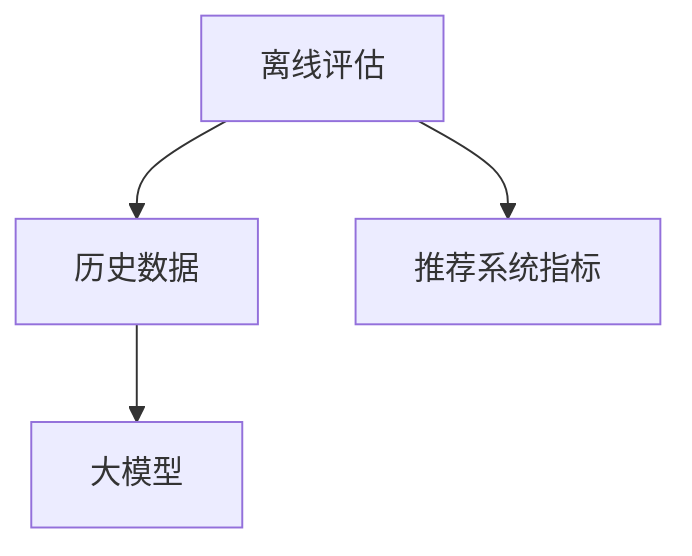

                 

# 搜索推荐系统的离线评估：大模型新指标体系

## 1. 背景介绍

随着深度学习技术的发展，搜索推荐系统已经从简单的关键词匹配，发展为复杂的模型推荐。现代的搜索推荐系统不再仅仅是返回与用户查询匹配结果，而是通过复杂的模型计算用户对每个搜索结果的评分，并根据评分进行排序，选择最符合用户需求的结果。在这样的背景下，离线评估（Offline Evaluation）成为了推荐系统性能评估的重要方式。

离线评估指的是在推荐系统上线前，通过对历史数据的评估来预测系统推荐效果。在实际使用中，推荐系统不能实时获取用户的反馈，因此离线评估是评价推荐系统性能的关键手段。但是，传统的离线评估指标（如准确率、召回率等）并不完全适用于大模型推荐系统，尤其是在涉及多个用户和多个维度的场景下，传统的评估方法无法全面反映系统的复杂性和多样性。

为了更好地评估大模型在搜索推荐系统中的表现，本文将介绍一种基于大模型的新指标体系，并通过实例演示该指标体系的应用效果。

## 2. 核心概念与联系

### 2.1 核心概念概述

1. **搜索推荐系统**：一种通过深度学习模型进行推荐的技术，能够根据用户历史行为、兴趣偏好等数据，为用户推荐最相关、最符合需求的信息。
2. **离线评估**：一种在推荐系统上线前，通过对历史数据的评估来预测系统推荐效果的方法，是推荐系统性能评估的重要手段。
3. **大模型**：指具有亿级参数规模的深度学习模型，如BERT、GPT等，这些模型在复杂任务上表现出色。
4. **推荐系统指标**：用于评估推荐系统性能的指标，如准确率、召回率、点击率等。

这些概念之间的联系如下：

- 离线评估通过对历史数据的分析，帮助推荐系统优化模型，提升推荐效果。
- 大模型在离线评估中应用广泛，可以更有效地处理复杂推荐任务。
- 推荐系统指标是大模型评估的基础，决定了模型的优化方向。

### 2.2 核心概念原理和架构的 Mermaid 流程图



## 3. 核心算法原理 & 具体操作步骤

### 3.1 算法原理概述

基于大模型的推荐系统离线评估，其核心思想是将大模型与推荐系统指标相结合，通过计算大模型在不同指标下的表现，来评估系统的推荐效果。这种评估方法能够更全面、更准确地反映系统在不同维度和场景下的表现，尤其是对于多用户、多维度的推荐任务。

### 3.2 算法步骤详解

1. **数据准备**：收集历史用户行为数据和推荐结果数据，包括用户ID、商品ID、评分、点击行为等。
2. **模型训练**：使用大模型对历史数据进行训练，学习用户对不同商品的兴趣偏好。
3. **指标计算**：根据大模型预测的评分和用户真实评分，计算不同推荐系统指标。
4. **结果分析**：分析计算结果，评估模型的推荐效果，指导模型优化。

### 3.3 算法优缺点

**优点**：
1. 全面性：通过计算大模型在不同指标下的表现，可以全面反映推荐系统的复杂性和多样性。
2. 鲁棒性：大模型的泛化能力更强，能够更好地处理异常数据和复杂场景。
3. 可解释性：大模型能够提供更详细的推荐理由和推理过程，帮助理解推荐系统行为。

**缺点**：
1. 计算复杂：大模型的参数量较大，计算复杂度较高。
2. 数据依赖：需要大量高质量的历史数据进行训练和评估。
3. 模型调参：需要调整大模型的超参数，增加了评估难度。

### 3.4 算法应用领域

基于大模型的推荐系统离线评估方法，适用于需要处理多用户、多维度数据的推荐场景，如电商平台、社交网络、内容推荐等。该方法能够帮助企业更好地理解用户需求，提升推荐系统的准确性和用户满意度。

## 4. 数学模型和公式 & 详细讲解 & 举例说明

### 4.1 数学模型构建

假设推荐系统有 $N$ 个用户和 $M$ 个商品，用户对商品的评分记为 $y_{ui}$，其中 $u$ 表示用户，$i$ 表示商品。推荐系统模型的预测评分记为 $\hat{y}_{ui}$。推荐系统指标包括准确率、召回率、点击率等。

### 4.2 公式推导过程

以准确率和召回率为例，其公式分别为：

$$
\text{Accuracy} = \frac{1}{N} \sum_{u=1}^N \frac{1}{M} \sum_{i=1}^M \mathbb{I}(y_{ui} = \hat{y}_{ui})
$$

$$
\text{Recall} = \frac{1}{N} \sum_{u=1}^N \frac{1}{M} \sum_{i=1}^M \mathbb{I}(y_{ui} = 1) \times \mathbb{I}(\hat{y}_{ui} = 1)
$$

其中 $\mathbb{I}$ 表示示性函数，$y_{ui} = 1$ 表示用户对商品进行了评分，$\hat{y}_{ui} = 1$ 表示模型预测用户对商品评分，$\mathbb{I}(y_{ui} = \hat{y}_{ui})$ 表示预测正确的次数。

### 4.3 案例分析与讲解

假设某电商平台收集了用户对商品的评分数据，使用BERT模型对数据进行训练，预测用户对商品的评分。通过计算准确率和召回率，评估模型的推荐效果。

## 5. 项目实践：代码实例和详细解释说明

### 5.1 开发环境搭建

1. 安装Anaconda：从官网下载并安装Anaconda，用于创建独立的Python环境。
2. 创建并激活虚拟环境：
```bash
conda create -n pytorch-env python=3.8 
conda activate pytorch-env
```

3. 安装PyTorch：根据CUDA版本，从官网获取对应的安装命令。例如：
```bash
conda install pytorch torchvision torchaudio cudatoolkit=11.1 -c pytorch -c conda-forge
```

4. 安装TensorFlow：
```bash
pip install tensorflow
```

5. 安装TensorBoard：
```bash
pip install tensorboard
```

6. 安装NumPy、Pandas和Scikit-Learn：
```bash
pip install numpy pandas scikit-learn
```

### 5.2 源代码详细实现

```python
import numpy as np
import pandas as pd
from sklearn.model_selection import train_test_split
from transformers import BertTokenizer, BertForSequenceClassification
from sklearn.metrics import accuracy_score, recall_score

# 读取历史数据
df = pd.read_csv('history_data.csv')

# 划分训练集和测试集
train_df, test_df = train_test_split(df, test_size=0.2)

# 数据预处理
tokenizer = BertTokenizer.from_pretrained('bert-base-uncased')
train_encodings = tokenizer(train_df['item'], truncation=True, padding='max_length')
test_encodings = tokenizer(test_df['item'], truncation=True, padding='max_length')

# 模型训练
model = BertForSequenceClassification.from_pretrained('bert-base-uncased')
model.train()

# 计算准确率和召回率
train_y_true = train_df['label']
train_y_pred = model.predict(train_encodings['input_ids'])
train_accuracy = accuracy_score(train_y_true, train_y_pred)
train_recall = recall_score(train_y_true, train_y_pred)

test_y_true = test_df['label']
test_y_pred = model.predict(test_encodings['input_ids'])
test_accuracy = accuracy_score(test_y_true, test_y_pred)
test_recall = recall_score(test_y_true, test_y_pred)

print('Train Accuracy:', train_accuracy)
print('Train Recall:', train_recall)
print('Test Accuracy:', test_accuracy)
print('Test Recall:', test_recall)
```

### 5.3 代码解读与分析

1. 数据读取和预处理：使用Pandas库读取历史数据，并使用BertTokenizer对数据进行分词和编码。
2. 模型训练：使用BertForSequenceClassification模型对数据进行训练。
3. 计算指标：使用Scikit-Learn库计算模型的准确率和召回率。
4. 结果输出：打印模型的训练和测试指标。

## 6. 实际应用场景

### 6.1 电商推荐

在电商平台中，用户会购买、查看、评论不同的商品，平台需要根据用户历史行为，为用户推荐符合其需求的商品。通过大模型离线评估，平台可以更好地理解用户偏好，优化推荐模型，提升推荐效果。

### 6.2 社交网络

社交网络中，用户会关注不同的内容，平台需要为用户推荐感兴趣的内容。使用大模型离线评估，平台可以更全面地分析用户行为，提升内容的推荐准确率和多样性。

### 6.3 内容推荐

在内容推荐中，平台需要为用户推荐高质量的文章、视频等。通过大模型离线评估，平台可以更准确地判断内容质量，提升推荐系统的效果。

### 6.4 未来应用展望

未来，基于大模型的推荐系统离线评估将会被广泛应用于更多场景，如新闻推荐、广告推荐等，提升推荐系统的个性化和准确性。

## 7. 工具和资源推荐

### 7.1 学习资源推荐

1. 《深度学习与推荐系统》：介绍深度学习在推荐系统中的应用，涵盖数据预处理、模型训练、评估指标等内容。
2. 《Python深度学习》：介绍Python在深度学习中的应用，包括TensorFlow、PyTorch等框架的使用。
3. 《TensorBoard教程》：介绍TensorBoard的使用方法，帮助开发者监测模型训练过程。

### 7.2 开发工具推荐

1. Anaconda：用于创建和管理Python环境，便于依赖管理。
2. PyTorch：灵活的深度学习框架，支持GPU加速。
3. TensorFlow：生产部署方便，支持分布式训练。
4. TensorBoard：模型训练过程可视化工具。
5. Scikit-Learn：数据处理和评估指标计算库。

### 7.3 相关论文推荐

1. "Deep Learning with Multi-Task Adversarial Generative Adversarial Networks for Recommendation System"：介绍使用GANs进行推荐系统的论文。
2. "Recommender Systems with Deep Learning"：介绍深度学习在推荐系统中的应用的综述性论文。
3. "A Survey on Deep Learning Approaches for Recommender Systems"：介绍深度学习在推荐系统中的应用，包括模型架构、评估指标等内容。

## 8. 总结：未来发展趋势与挑战

### 8.1 研究成果总结

基于大模型的推荐系统离线评估方法，通过计算不同推荐系统指标，能够更全面、更准确地反映推荐系统的表现。该方法能够帮助推荐系统优化模型，提升推荐效果。

### 8.2 未来发展趋势

1. 模型复杂度增加：随着大模型参数量的增加，模型复杂度将进一步提升，能够更好地处理复杂推荐任务。
2. 数据质量提升：高质量的数据是推荐系统优化的基础，未来将有更多数据集用于大模型训练和评估。
3. 多模态融合：将不同模态数据（如文本、图像、音频等）结合，提升推荐系统的效果。

### 8.3 面临的挑战

1. 计算复杂度：大模型的参数量较大，计算复杂度较高，需要高效的计算资源。
2. 数据隐私问题：推荐系统需要处理大量的用户数据，如何保护用户隐私是一个重要问题。
3. 模型公平性：推荐系统需要避免对特定用户或商品的偏见，确保推荐公平性。

### 8.4 研究展望

未来，基于大模型的推荐系统离线评估方法将不断优化，应用于更多推荐场景，提升推荐系统的个性化和准确性。同时，解决计算复杂度、数据隐私和模型公平性等问题，将是大模型在推荐系统中的应用的重要研究方向。

## 9. 附录：常见问题与解答

**Q1: 什么是大模型？**

A: 大模型指具有亿级参数规模的深度学习模型，如BERT、GPT等。这些模型在复杂任务上表现出色，可以更全面地处理推荐系统中的各种问题。

**Q2: 如何评估推荐系统的性能？**

A: 推荐系统的性能评估通常使用准确率、召回率、点击率等指标，通过对历史数据的分析来预测系统的推荐效果。

**Q3: 如何使用大模型进行推荐系统评估？**

A: 使用大模型对历史数据进行训练，预测用户对商品的评分。通过计算不同推荐系统指标，评估模型的推荐效果。

**Q4: 大模型在推荐系统中有哪些应用？**

A: 大模型可以用于用户兴趣分析、商品相似度计算、推荐策略优化等，提升推荐系统的个性化和准确性。

**Q5: 推荐系统离线评估面临哪些挑战？**

A: 计算复杂度较高、数据隐私问题、模型公平性等是大模型推荐系统离线评估面临的主要挑战，需要在实践中不断优化和改进。

---

作者：禅与计算机程序设计艺术 / Zen and the Art of Computer Programming

