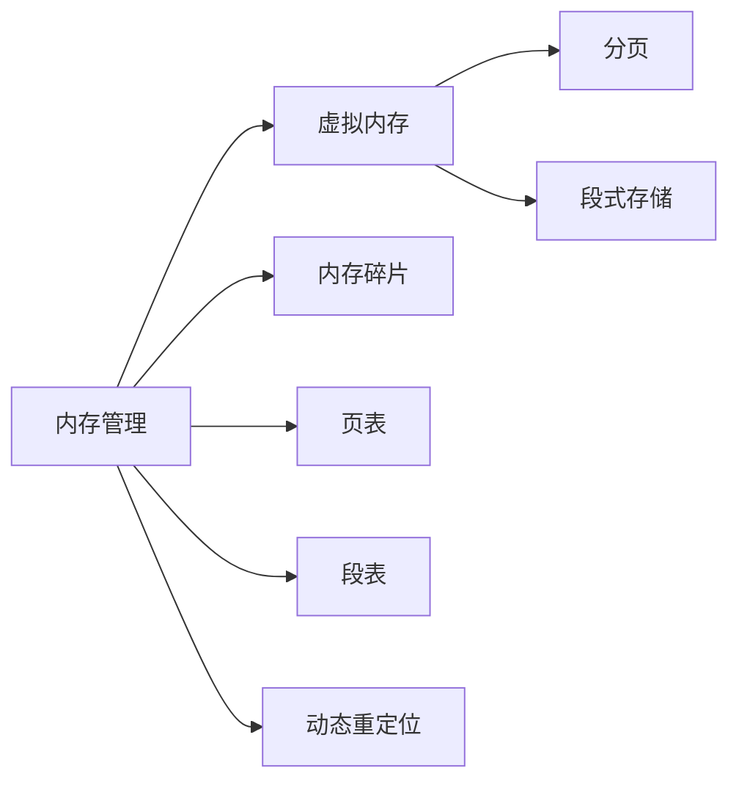

                 

# 操作系统的内存管理机制分析

## 1. 背景介绍

操作系统（Operating System, OS）是计算机系统的核心组件，负责管理和调度计算机资源，为应用程序提供运行环境。内存管理是操作系统中最重要的任务之一，直接关系到系统性能和稳定性。一个优秀的内存管理机制能够有效地利用内存资源，避免内存碎片和泄漏，确保程序的可靠运行。本文将深入探讨操作系统的内存管理机制，分析其核心概念、算法原理和实际应用。

## 2. 核心概念与联系

### 2.1 核心概念概述

为了更好地理解操作系统的内存管理机制，我们将介绍几个核心概念：

- **内存管理（Memory Management）**：操作系统对计算机内存资源的管理和调度，包括分配、回收、共享等操作。
- **虚拟内存（Virtual Memory）**：一种通过将磁盘空间模拟为内存空间的技术，用于解决实际内存不足的问题。
- **分页（Paging）**：将内存空间分割成固定大小的页（Page），每个页对应一个连续的磁盘块，实现内存和磁盘空间的映射。
- **段式存储（Segmentation）**：将内存空间划分为多个段（Segment），每个段对应一个逻辑单元，实现内存的逻辑结构化管理。
- **内存碎片（Memory Fragmentation）**：由于频繁的内存分配和回收，内存空间中会产生无法利用的小块区域，称为内存碎片。
- **页表（Page Table）**：用于记录内存页和磁盘块之间的映射关系，实现从虚拟地址到物理地址的转换。
- **段表（Segment Table）**：与页表类似，用于记录内存段和逻辑地址之间的映射关系。
- **动态重定位（Dynamic Relocation）**：在程序运行时动态地改变程序的地址空间，实现代码和数据的动态加载和卸载。

这些核心概念构成了操作系统的内存管理机制，帮助系统高效利用内存资源，实现程序的稳定运行。

### 2.2 核心概念原理和架构的 Mermaid 流程图



这个流程图展示了内存管理与虚拟内存、分页、段式存储等核心概念之间的联系。

## 3. 核心算法原理 & 具体操作步骤

### 3.1 算法原理概述

操作系统的内存管理算法主要分为两种：基于分页的内存管理算法和基于段式的内存管理算法。这两种算法各有优缺点，适用于不同的应用场景。

#### 3.1.1 分页内存管理算法

分页内存管理算法将内存空间划分为固定大小的页，每个页对应一个连续的磁盘块。系统在加载程序时，将程序的虚拟地址空间映射到内存的某个物理页上。当程序需要访问某个地址时，系统根据页表将虚拟地址转换为物理地址，然后访问对应的内存页。

#### 3.1.2 段式内存管理算法

段式内存管理算法将内存空间划分为多个段，每个段对应一个逻辑单元。段的大小可以根据程序的逻辑结构来确定，系统为每个段分配一段连续的内存空间。当程序需要访问某个地址时，系统根据段表将虚拟地址转换为物理地址，然后访问对应的内存段。

### 3.2 算法步骤详解

#### 3.2.1 分页内存管理算法步骤

1. **初始化**：为系统分配固定大小的物理内存空间，为程序预留一部分空间。
2. **地址映射**：程序启动时，将程序的虚拟地址空间映射到内存的某个物理页上。
3. **虚拟到物理地址转换**：当程序访问某个虚拟地址时，根据页表将虚拟地址转换为物理地址。
4. **页面置换**：当内存空间不足时，系统根据一定的策略选择被替换的页，将新的页加载到内存中。

#### 3.2.2 段式内存管理算法步骤

1. **初始化**：为系统分配固定大小的物理内存空间，为程序预留一部分空间。
2. **地址映射**：程序启动时，将程序的虚拟地址空间映射到内存的某个物理段上。
3. **虚拟到物理地址转换**：当程序访问某个虚拟地址时，根据段表将虚拟地址转换为物理地址。
4. **段增长**：当程序需要更多的内存时，系统为程序分配新的物理段，并将虚拟地址空间映射到新的物理段上。

### 3.3 算法优缺点

#### 3.3.1 分页内存管理算法的优缺点

**优点**：

- **灵活性高**：由于页的大小固定，系统可以根据实际需要灵活分配内存，提高了内存利用率。
- **支持虚拟内存**：分页内存管理支持虚拟内存技术，可以通过将部分页面加载到磁盘上，解决内存不足的问题。

**缺点**：

- **效率较低**：分页内存管理需要频繁地进行虚拟地址到物理地址的转换，增加了系统开销。
- **地址空间较大**：分页内存管理需要为每个页分配固定的物理地址空间，浪费了一些内存空间。

#### 3.3.2 段式内存管理算法的优缺点

**优点**：

- **逻辑性较强**：段式内存管理根据程序的逻辑结构进行内存分配，便于程序的逻辑结构化管理。
- **支持动态重定位**：段式内存管理支持动态重定位技术，可以在程序运行时动态地改变地址空间，实现代码和数据的动态加载和卸载。

**缺点**：

- **灵活性较低**：段式内存管理需要为每个段分配连续的内存空间，灵活性较低。
- **效率较低**：段式内存管理需要频繁地进行虚拟地址到物理地址的转换，增加了系统开销。

### 3.4 算法应用领域

操作系统的内存管理算法在各个应用领域都有广泛的应用：

- **操作系统**：操作系统需要管理计算机的内存资源，为应用程序提供稳定的运行环境。
- **数据库系统**：数据库系统需要高效地管理内存中的数据，支持事务的并发访问和数据的一致性。
- **分布式系统**：分布式系统需要高效地管理多台机器的内存资源，支持大规模数据的存储和处理。
- **嵌入式系统**：嵌入式系统需要在有限的内存空间中高效地管理内存资源，支持实时任务的处理。
- **云服务平台**：云服务平台需要管理大量的内存资源，为不同用户提供稳定的服务。

这些应用领域对内存管理提出了不同的要求，操作系统需要根据具体场景选择合适的内存管理算法，确保系统的稳定性和性能。

## 4. 数学模型和公式 & 详细讲解 & 举例说明

### 4.1 数学模型构建

操作系统的内存管理机制可以通过数学模型来描述。假设系统有 $N$ 个物理页和 $M$ 个虚拟页，每个页大小为 $P$ 字节。系统为每个虚拟页分配一个物理页，记为 $P(i)$，$i=1,2,...,M$。虚拟页的虚拟地址为 $V_{i,j}$，对应的物理地址为 $P_{i,j}$。

### 4.2 公式推导过程

**分页内存管理算法**：

1. **虚拟地址到物理地址的转换**：

   $$
   P_{i,j} = P(i) + jP
   $$

   其中 $i$ 表示虚拟页所在的物理页号，$j$ 表示虚拟页在物理页中的偏移量。

2. **页面置换算法**：

   常用的页面置换算法包括 LRU（Least Recently Used）、FIFO（First-In-First-Out）、Clock 算法等。这里以 LRU 算法为例进行推导：

   $$
   \minimize \sum_{i=1}^{N} \sum_{j=1}^{M} \rho(P_{i,j})
   $$

   其中 $\rho$ 表示页面的使用频率，$P_{i,j}$ 表示页面 $j$ 在第 $i$ 个物理页中的位置。

   优化目标是最小化系统的页面置换次数和页面置换开销。

**段式内存管理算法**：

1. **虚拟地址到物理地址的转换**：

   假设程序被划分为 $N$ 个段，每个段大小为 $S_i$ 字节，段号为 $i=1,2,...,N$。假设第 $i$ 个段的第 $j$ 个虚拟页所在的物理地址为 $P_{i,j}$，则：

   $$
   P_{i,j} = S_1 + ... + S_{i-1} + P_i + jS_i
   $$

   其中 $P_i$ 表示第 $i$ 个段的起始物理地址。

2. **段增长策略**：

   常用的段增长策略包括固定大小、可变大小等。这里以固定大小为例进行推导：

   假设第 $i$ 个段的最大大小为 $S_i$，则当第 $i$ 个段的空间不足时，系统为该段分配新的物理地址空间，并将虚拟地址空间映射到新的物理段上：

   $$
   P_{i,j}' = P_i + S_i + jS_i
   $$

   其中 $P_{i,j}'$ 表示新的物理地址，$j$ 表示新的虚拟页在新的物理段中的偏移量。

### 4.3 案例分析与讲解

假设有一个程序被划分为 3 个段，每个段大小为 4KB，系统有 8 个物理页，每个页大小为 4KB。程序启动时，系统为每个段分配一个物理段，每个段的大小为 4KB。

1. **分页内存管理算法**：

   程序启动时，系统为每个段分配一个物理页，如下所示：

   | 虚拟页 | 段 | 物理页 | 虚拟地址 | 物理地址 |
   | ------ | -- | ------ | -------- | -------- |
   | 1      | 1  | 1      | 0        | 0        |
   | 2      | 1  | 2      | 4KB      | 8KB      |
   | 3      | 2  | 1      | 8KB      | 8KB      |
   | 4      | 2  | 2      | 12KB     | 12KB     |
   | 5      | 3  | 1      | 16KB     | 16KB     |
   | 6      | 3  | 2      | 20KB     | 20KB     |
   | 7      | 3  | 3      | 24KB     | 24KB     |
   | 8      | 3  | 4      | 28KB     | 28KB     |

   当程序需要访问虚拟地址为 16KB 时，根据页表进行虚拟地址到物理地址的转换：

   $$
   P_{i,j} = P(1) + jP = 0 + 16KB = 16KB
   $$

   因此，程序访问物理地址为 16KB 的内存页。

2. **段式内存管理算法**：

   程序启动时，系统为每个段分配一个物理段，如下所示：

   | 虚拟页 | 段 | 物理页 | 虚拟地址 | 物理地址 |
   | ------ | -- | ------ | -------- | -------- |
   | 1      | 1  | 1      | 0        | 0        |
   | 2      | 1  | 2      | 4KB      | 4KB      |
   | 3      | 2  | 1      | 8KB      | 8KB      |
   | 4      | 2  | 2      | 12KB     | 12KB     |
   | 5      | 3  | 1      | 16KB     | 16KB     |
   | 6      | 3  | 2      | 20KB     | 20KB     |
   | 7      | 3  | 3      | 24KB     | 24KB     |
   | 8      | 3  | 4      | 28KB     | 28KB     |

   当程序需要访问虚拟地址为 16KB 时，根据段表进行虚拟地址到物理地址的转换：

   $$
   P_{i,j} = S_1 + ... + S_{i-1} + P_i + jS_i = 0 + 4KB + 8KB + 16KB \times 1 = 28KB
   $$

   因此，程序访问物理地址为 28KB 的内存段。

## 5. 项目实践：代码实例和详细解释说明

### 5.1 开发环境搭建

要进行内存管理机制的实践，我们需要搭建一个开发环境。以下是在 Linux 系统上搭建开发环境的步骤：

1. 安装 C++ 编译器：在 Linux 上，可以使用 GCC 编译器。
2. 安装操作系统内核源代码：可以从操作系统官网下载内核源代码，例如 Linux 内核源代码可以从 https://www.kernel.org 下载。
3. 编译和安装内核：使用 Make 工具编译内核，并使用 make install 安装内核。
4. 配置系统环境：在 Linux 系统中，可以使用 Make menuconfig 或 make menuconfig-gui 配置内核选项。

### 5.2 源代码详细实现

以下是一个简单的内存管理算法的实现，以 LRU 算法为例：

```cpp
#include <iostream>
#include <vector>
#include <unordered_map>
#include <queue>

class MemoryManager {
public:
    MemoryManager(int num_pages) : num_pages_(num_pages) {
        // 初始化页表和置换队列
        page_table_ = std::unordered_map<int, int>();
        replacement_queue_ = std::queue<int>();
    }

    int allocate_page(int virtual_address) {
        // 将虚拟地址映射到物理地址
        int physical_address = virtual_address / num_pages_;
        if (page_table_.find(physical_address) == page_table_.end()) {
            // 如果物理地址不存在，分配一个物理页并放入队列
            page_table_[physical_address] = num_pages_;
            replacement_queue_.push(physical_address);
            return physical_address;
        } else {
            // 如果物理地址已经存在，根据 LRU 算法选择被替换的页
            if (replacement_queue_.size() >= num_pages_) {
                int victim_page = replacement_queue_.front();
                replacement_queue_.pop();
                replacement_queue_.push(physical_address);
                page_table_[victim_page] = num_pages_;
                return victim_page;
            } else {
                replacement_queue_.push(physical_address);
                return physical_address;
            }
        }
    }

    void deallocate_page(int virtual_address) {
        int physical_address = virtual_address / num_pages_;
        if (page_table_.find(physical_address) != page_table_.end()) {
            // 将物理地址从队列中移除并释放
            replacement_queue_.pop();
            page_table_.erase(physical_address);
        }
    }

    void print_page_table() {
        std::cout << "Page Table: " << std::endl;
        for (auto& entry : page_table_) {
            std::cout << "Virtual Address: " << entry.first << " Physical Address: " << entry.second << std::endl;
        }
    }

private:
    int num_pages_;
    std::unordered_map<int, int> page_table_;
    std::queue<int> replacement_queue_;
};

int main() {
    MemoryManager memory_manager(4);
    memory_manager.allocate_page(0);
    memory_manager.allocate_page(4);
    memory_manager.allocate_page(8);
    memory_manager.allocate_page(12);
    memory_manager.deallocate_page(0);
    memory_manager.allocate_page(16);
    memory_manager.allocate_page(20);
    memory_manager.deallocate_page(12);
    memory_manager.deallocate_page(8);
    memory_manager.deallocate_page(16);
    memory_manager.print_page_table();
    return 0;
}
```

这个示例代码实现了一个简单的 LRU 算法，用于分配和释放物理页。在分配页面时，如果物理页表中已经存在对应的物理地址，根据 LRU 算法选择被替换的页。在释放页面时，将物理地址从队列中移除并释放。

### 5.3 代码解读与分析

以下是代码的详细解读和分析：

1. **类 MemoryManager**：
   - **构造函数**：初始化内存管理器的参数，包括物理页数和页表、置换队列。
   - **allocate_page** 方法：分配页面时，将虚拟地址映射到物理地址，根据 LRU 算法选择被替换的页。
   - **deallocate_page** 方法：释放页面时，将物理地址从队列中移除并释放。
   - **print_page_table** 方法：打印当前的页表。

2. **main** 函数：
   - 创建一个内存管理器，分配和释放页面，最后打印当前的页表。

## 6. 实际应用场景

### 6.1 智能机器人

在智能机器人中，内存管理机制扮演着重要的角色。机器人需要高效地管理内部和外部存储资源，支持任务的实时处理和调度。内存管理机制能够确保机器人在复杂的动态环境中稳定运行，提高任务的执行效率和准确性。

### 6.2 嵌入式系统

嵌入式系统对内存管理提出了极高的要求，需要在有限的内存空间中高效地管理资源。内存管理机制需要根据系统的特点和需求进行优化，确保系统的高效运行和稳定性。

### 6.3 云服务

云服务需要在多个服务器之间高效地管理内存资源，支持大规模数据的存储和处理。内存管理机制需要根据云计算环境的特点和需求进行优化，确保系统的高效运行和扩展性。

## 7. 工具和资源推荐

### 7.1 学习资源推荐

为了深入学习操作系统的内存管理机制，以下是一些推荐的学习资源：

1. 《操作系统导论》（Introduction to Operating Systems）：这本书介绍了操作系统的基本概念和原理，包括内存管理机制。
2. 《计算机操作系统》（Operating System Concepts）：这本书是计算机操作系统的经典教材，详细介绍了内存管理机制的原理和实现。
3. 《深入理解计算机系统》（Computer Systems: A Programmer's Perspective）：这本书介绍了计算机系统的底层原理，包括内存管理机制。
4. 《现代操作系统》（Modern Operating Systems）：这本书介绍了现代操作系统的设计和实现，包括内存管理机制。

### 7.2 开发工具推荐

为了高效地实现和测试内存管理机制，以下是一些推荐的开发工具：

1. GCC 编译器：支持 C++ 编程语言，提供了高效的编译和优化功能。
2. Make 工具：用于自动化编译和构建系统，支持复杂的编译依赖和优化策略。
3. Valgrind 工具：用于检测内存泄漏和错误，提供了强大的内存调试和分析功能。
4. GDB 调试器：用于调试和分析程序的内存使用情况，提供了详细的内存调试信息。

### 7.3 相关论文推荐

为了深入了解内存管理机制的研究进展，以下是一些推荐的相关论文：

1. "Virtual Memory: Concepts and Design"：这篇文章介绍了虚拟内存的设计和实现，包括分页、段式存储等算法。
2. "Fragmentation in Paging and Segmentation Systems"：这篇文章介绍了内存碎片的产生和解决方法，包括内存分配和回收策略。
3. "Efficient Paging and Segmentation for Virtual Memory"：这篇文章介绍了高效的内存管理算法，包括页面置换和段增长策略。
4. "Memory Management Techniques for Modern Operating Systems"：这篇文章介绍了现代操作系统中的内存管理机制，包括虚拟内存、分页、段式存储等算法。

## 8. 总结：未来发展趋势与挑战

### 8.1 研究成果总结

操作系统的内存管理机制是计算机系统中重要的组成部分，其设计和实现直接影响系统的性能和稳定性。现代操作系统中的内存管理机制主要包括虚拟内存、分页、段式存储等算法，支持动态分配和回收内存，避免内存碎片和泄漏。

### 8.2 未来发展趋势

未来操作系统的内存管理机制将朝着以下几个方向发展：

1. **内存虚拟化**：通过虚拟化技术，将物理内存资源分配给多个虚拟机或容器，提高内存利用率和安全性。
2. **内存池化**：将多个小块内存合并成大块内存，减少内存碎片，提高内存利用率。
3. **内存压缩**：使用压缩算法将内存中的数据进行压缩，减少内存占用，提高内存利用率。
4. **内存管理自动化**：通过自动化技术，优化内存管理算法，提高系统的稳定性和性能。

### 8.3 面临的挑战

尽管现代操作系统的内存管理机制已经较为成熟，但仍面临一些挑战：

1. **内存碎片问题**：由于频繁的内存分配和回收，内存空间中会产生无法利用的小块区域，导致内存碎片问题。
2. **内存泄漏问题**：程序中的内存泄漏会导致内存占用过高，影响系统的稳定性和性能。
3. **内存安全性问题**：内存管理机制需要确保内存的安全性，防止程序中的内存访问越界等问题。

### 8.4 研究展望

未来的研究需要针对内存管理机制进行深入探索，以下是一些研究展望：

1. **新的内存管理算法**：研究新的内存管理算法，提高内存利用率和系统性能。
2. **内存压缩技术**：研究新的内存压缩算法，减少内存占用，提高内存利用率。
3. **内存管理自动化**：研究自动化内存管理技术，提高系统的稳定性和性能。
4. **内存安全技术**：研究内存安全技术，确保内存的安全性和可靠性。

## 9. 附录：常见问题与解答

**Q1：分页内存管理算法和段式内存管理算法有什么区别？**

A: 分页内存管理算法将内存空间划分为固定大小的页，每个页对应一个连续的磁盘块，实现内存和磁盘空间的映射。段式内存管理算法将内存空间划分为多个段，每个段对应一个逻辑单元，实现内存的逻辑结构化管理。分页内存管理支持虚拟内存技术，而段式内存管理支持动态重定位技术。

**Q2：如何减少内存碎片？**

A: 内存碎片是指由于频繁的内存分配和回收，内存空间中会产生无法利用的小块区域。减少内存碎片的方法包括：

1. 内存池化：将多个小块内存合并成大块内存，减少内存碎片。
2. 压缩算法：使用压缩算法将内存中的数据进行压缩，减少内存占用。
3. 内存池分配器：使用内存池分配器，将内存分配给多个对象共享，减少内存碎片。

**Q3：如何在嵌入式系统中进行内存管理？**

A: 嵌入式系统对内存管理提出了更高的要求，需要在有限的内存空间中高效地管理资源。在嵌入式系统中，内存管理机制需要考虑以下因素：

1. 内存分配器：使用高效的内存分配器，减少内存碎片。
2. 内存池：将内存分配给多个对象共享，提高内存利用率。
3. 动态重定位：支持动态重定位技术，实现代码和数据的动态加载和卸载。

**Q4：如何使用 Valgrind 工具检测内存泄漏？**

A: Valgrind 工具是一款强大的内存调试工具，可以检测程序中的内存泄漏问题。使用 Valgrind 工具检测内存泄漏的步骤如下：

1. 安装 Valgrind 工具。
2. 编写程序，使用内存分配函数分配内存。
3. 在程序中插入内存泄漏检测代码。
4. 使用 Valgrind 工具运行程序，并检测内存泄漏问题。

通过 Valgrind 工具检测内存泄漏，可以有效地发现和解决程序中的内存泄漏问题，确保程序的稳定性和性能。

---

作者：禅与计算机程序设计艺术 / Zen and the Art of Computer Programming

