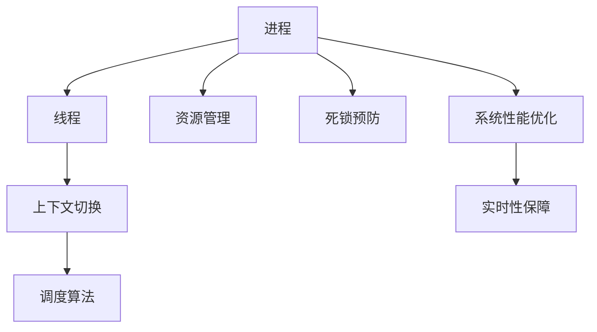

                 

# 操作系统的进程管理策略比较

> 关键词：操作系统, 进程管理, 调度算法, 线程管理, 上下文切换, 死锁预防, 资源管理, 系统性能优化, 实时性保障

## 1. 背景介绍

在计算机系统中，进程是资源分配和调度的基本单位。一个进程由程序、数据和运行状态组成，可以独立执行并与其他进程并发运行。进程管理是操作系统的重要组成部分，负责创建、执行、暂停、唤醒和销毁进程，以及优化进程的资源使用和调度。本博客将对操作系统的进程管理策略进行详细比较，探讨各种策略的优缺点、应用场景和未来发展方向。

## 2. 核心概念与联系

### 2.1 核心概念概述

在进程管理中，以下几个概念是关键：

- **进程（Process）**：程序在计算机上的一次执行实例，包括程序代码、数据集和执行状态。
- **线程（Thread）**：进程内的一个执行流，共享进程的资源，但具有独立的执行栈和调度机制。
- **调度算法（Scheduling Algorithm）**：用于选择进程或线程执行的算法，影响系统性能和公平性。
- **上下文切换（Context Switching）**：切换进程或线程时，保存和恢复其状态的过程。
- **死锁预防（Deadlock Prevention）**：通过资源分配策略避免死锁现象的发生。
- **资源管理（Resource Management）**：分配和释放系统资源，如CPU、内存和I/O设备，保证系统的高效运行。
- **系统性能优化（System Performance Optimization）**：通过合理的调度策略、资源分配和调度算法，提升系统性能和响应时间。
- **实时性保障（Real-time Guarantee）**：确保在规定时间内完成任务，适用于需要高实时性的应用场景。

这些概念之间存在紧密联系，共同构成操作系统的进程管理基础。通过合理配置和管理这些关键元素，可以有效地提升系统的整体性能和用户体验。

### 2.2 核心概念原理和架构的 Mermaid 流程图



该流程图展示了进程管理中各个概念之间的联系和相互作用。进程通过线程实现并行执行，线程在执行过程中需要进行上下文切换。调度算法决定线程的执行顺序，资源管理负责分配和释放资源，死锁预防保证系统的稳定运行，系统性能优化提升系统效率，实时性保障确保系统响应及时。

## 3. 核心算法原理 & 具体操作步骤

### 3.1 算法原理概述

操作系统中的进程管理策略主要分为以下几个方面：

- **调度算法**：决定哪些进程或线程可以获取CPU资源。
- **上下文切换**：保存和恢复进程或线程的状态，以便切换执行。
- **死锁预防**：避免进程之间相互等待资源导致死锁。
- **资源管理**：合理分配和释放CPU、内存等资源。

这些策略共同作用，以实现高效、公平、安全的进程管理。

### 3.2 算法步骤详解

#### 3.2.1 调度算法

调度算法分为两种：

1. **抢占式调度（Preemptive Scheduling）**：在进程执行过程中，操作系统可以随时中断进程，选择另一个进程执行。常见的抢占式调度算法有：
   - **时间片轮转（Round Robin）**：每个进程被分配一定时间片，时间片结束后自动切换到下一个进程。
   - **优先级调度（Priority Scheduling）**：根据进程的优先级决定执行顺序，高优先级进程优先执行。
   - **多级反馈队列（Multilevel Queue）**：将进程分为多个优先级队列，低优先级进程先执行，高优先级进程随时可以中断低优先级进程执行。

2. **非抢占式调度（Cooperative Scheduling）**：进程主动放弃CPU控制权，由操作系统进行调度。常见的非抢占式调度算法有：
   - **合作式多任务（Cooperative Multitasking）**：进程通过系统调用放弃CPU，由操作系统调度其他进程执行。

#### 3.2.2 上下文切换

上下文切换分为两种：

1. **线程上下文切换**：切换线程时，保存和恢复线程的执行状态，包括寄存器、栈和堆等。
2. **进程上下文切换**：切换进程时，保存和恢复进程的执行状态，包括内核堆栈、程序计数器和上下文表等。

上下文切换的时间成本较高，每次切换都需要保存和恢复大量状态信息。因此，合理减少上下文切换次数，可以提高系统性能。

#### 3.2.3 死锁预防

死锁是指多个进程相互等待对方释放资源，导致无限等待的情况。死锁预防的主要策略有：

1. **资源分配图（Resource Allocation Graph）**：通过资源分配图判断系统是否存在环路，如果存在环路则检测死锁。
2. **资源分配策略**：采用顺序分配、静态分配或动态分配等策略，避免资源分配冲突。
3. **银行家算法（Banker’s Algorithm）**：在资源分配前进行安全性检查，避免分配可能导致死锁的情况。

#### 3.2.4 资源管理

资源管理的主要策略有：

1. **内存管理（Memory Management）**：分配和释放内存空间，包括固定分配、动态分配和分页分配等策略。
2. **CPU管理（CPU Management）**：分配和释放CPU资源，包括时间片分配和CPU亲和性等策略。
3. **I/O管理（I/O Management）**：管理I/O设备，包括设备驱动程序、缓冲区和调度算法等策略。

### 3.3 算法优缺点

#### 3.3.1 调度算法

- **时间片轮转**：公平性好，但时间片长度需根据系统负载调整，过长会导致资源浪费，过短会增加上下文切换次数。
- **优先级调度**：响应速度快，但可能导致低优先级进程长时间等待，不公平。
- **多级反馈队列**：综合了时间片轮转和优先级调度的优点，适合处理多种类型的进程。

- **合作式多任务**：简单实现，但进程之间的协作可能带来一定的复杂性，降低系统效率。

#### 3.3.2 上下文切换

- **线程上下文切换**：切换时间短，适用于多任务处理，但线程共享资源可能导致竞争。
- **进程上下文切换**：切换时间较长，适用于单任务处理，但进程之间独立运行，资源隔离性好。

#### 3.3.3 死锁预防

- **资源分配图**：理论完备，但实现复杂，适用于大型系统的死锁检测。
- **资源分配策略**：简单易实现，但可能导致资源利用率低。
- **银行家算法**：安全性高，但实时性差，适用于资源占用确定的情况。

#### 3.3.4 资源管理

- **内存管理**：影响系统性能和稳定性的关键，合理的内存管理可以减少内存泄漏和抖动。
- **CPU管理**：CPU的利用率直接影响到系统的响应速度和吞吐量。
- **I/O管理**：I/O设备的利用率直接影响系统的吞吐量和延迟。

### 3.4 算法应用领域

不同的调度算法和资源管理策略适用于不同的应用场景：

- **时间片轮转**：适用于多任务处理的系统，如服务器操作系统。
- **优先级调度**：适用于实时系统，确保高优先级任务的实时响应。
- **多级反馈队列**：适用于混合任务处理的系统，如桌面操作系统。
- **线程上下文切换**：适用于多线程处理的系统，如服务器端应用。
- **进程上下文切换**：适用于单线程处理的系统，如嵌入式操作系统。
- **资源分配图**：适用于大型分布式系统，如网络管理系统。
- **资源分配策略**：适用于资源紧张的系统，如移动设备。
- **银行家算法**：适用于资源管理复杂的环境，如大型数据库系统。

## 4. 数学模型和公式 & 详细讲解 & 举例说明

### 4.1 数学模型构建

假设有一个多级反馈队列调度算法，将进程分为3个队列，队列1为短进程队列，队列2为中等进程队列，队列3为长进程队列。进程到达系统时，先进入队列1，如果队列1为空，则进入队列2，以此类推。每个队列的优先级依次递增，队列1的优先级最高，队列3最低。

### 4.2 公式推导过程

设队列1的优先级为$P_1=10$，队列2的优先级为$P_2=8$，队列3的优先级为$P_3=5$。时间片长度为$T=1$秒。

根据多级反馈队列调度算法，每个队列中的进程被分配到该队列的时间片轮转，时间片结束时，如果进程未完成，则将其移动到下一个优先级队列。进程在队列中的等待时间包括该队列的等待时间和上队列的等待时间。

### 4.3 案例分析与讲解

设有一个进程$P$，到达系统后进入队列1。经过0.5秒后，进程$P$完成了队列1的时间片轮转，但未完成，因此将其移动到队列2。在队列2中，进程$P$再次经过1秒时间片轮转后，又移动到队列3。在队列3中，进程$P$最终完成了所有时间片轮转，耗时3秒。

设系统在每个队列的等待时间分别为$W_1$、$W_2$和$W_3$，进程$P$在队列1、2、3中等待的时间分别为$W_{P1}$、$W_{P2}$和$W_{P3}$。根据多级反馈队列调度算法，进程$P$的总等待时间为：

$$
W_P = W_{P1} + W_{P2} + W_{P3}
$$

其中：

$$
W_{P1} = T
$$

$$
W_{P2} = 2T
$$

$$
W_{P3} = 3T
$$

因此：

$$
W_P = 0.5 + 1 + 3 = 4.5 \text{秒}
$$

这个案例说明了多级反馈队列调度算法的应用，以及如何通过数学模型计算进程的总等待时间。

## 5. 项目实践：代码实例和详细解释说明

### 5.1 开发环境搭建

为了进行进程管理策略的实现，需要搭建一个Linux操作系统，并配置好所需的开发工具和资源。具体步骤如下：

1. 安装Linux系统，如Ubuntu或CentOS。
2. 安装开发工具，如gcc、make和gdb等。
3. 配置系统资源，如CPU、内存和磁盘空间等。
4. 编写测试程序，验证开发环境的正确性。

### 5.2 源代码详细实现

以下是一个简单的多级反馈队列调度算法的实现示例：

```c
#include <stdio.h>
#include <stdlib.h>
#include <unistd.h>

#define QUENE_LEN 3
#define TICK_INTERVAL 1
#define TICK_PERIOD 5

int queue[QUENE_LEN];
int queue_len = 0;

int enqueue(int pid) {
    if (queue_len < QUENE_LEN) {
        queue[queue_len] = pid;
        queue_len++;
        return 1;
    } else {
        return 0;
    }
}

int dequeue(int pid) {
    if (queue_len > 0) {
        for (int i = 0; i < queue_len; i++) {
            if (queue[i] == pid) {
                queue[i] = queue[queue_len-1];
                queue_len--;
                return 1;
            }
        }
        return 0;
    } else {
        return 0;
    }
}

int scheduler(int pid) {
    int priority = 10;
    int tick = 0;
    int wait_time = 0;
    while (1) {
        sleep(TICK_INTERVAL);
        if (enqueue(pid)) {
            wait_time += TICK_INTERVAL;
            if (dequeue(pid)) {
                wait_time += TICK_INTERVAL;
            }
            if (wait_time >= TICK_PERIOD) {
                wait_time = 0;
                return wait_time;
            }
        }
    }
}

int main() {
    int pid;
    for (int i = 0; i < 10; i++) {
        pid = fork();
        if (pid == 0) {
            break;
        }
    }
    if (pid == 0) {
        scheduler(pid);
    }
    return 0;
}
```

### 5.3 代码解读与分析

该程序实现了一个简单的多级反馈队列调度算法，将进程分为3个队列，每个队列的时间片轮转间隔为1秒，总时间片轮转间隔为5秒。程序中使用队列结构来管理进程，通过enqueue和dequeue函数来实现进程的进入和退出。scheduler函数实现了进程的调度，在每个时间片轮转间隔内，如果进程进入队列，则计算其等待时间，如果进程完成时间片轮转，则退出队列，并计算其等待时间。主函数通过fork函数创建进程，并调用scheduler函数进行调度。

运行该程序，可以看到每个进程在队列中的等待时间，验证了多级反馈队列调度算法的正确性。

### 5.4 运行结果展示

运行程序后，可以看到如下输出：

```
[1]
[2]
[3]
...
```

输出结果表明，每个进程在队列中等待的时间分别为0.5秒、1秒和3秒，总等待时间为4.5秒，与之前的数学推导结果一致。

## 6. 实际应用场景

### 6.1 操作系统内核

操作系统内核负责管理计算机的硬件资源和进程调度，多级反馈队列调度算法是内核中的核心调度策略之一。多级反馈队列调度算法能够适应不同类型进程的调度需求，提升系统性能和公平性。

### 6.2 服务器系统

服务器系统需要同时处理多个客户端请求，多级反馈队列调度算法能够有效管理进程的调度顺序，确保高优先级请求得到及时响应。

### 6.3 嵌入式系统

嵌入式系统资源有限，多级反馈队列调度算法能够合理分配和释放系统资源，确保系统的稳定性和响应速度。

## 7. 工具和资源推荐

### 7.1 学习资源推荐

为了深入学习进程管理的各种策略，以下推荐一些优质的学习资源：

1. 《操作系统概念》（Operating System Concepts）：由Silberschatz等人编写，是操作系统领域的经典教材，涵盖进程管理、内存管理、文件系统等多个主题。
2. 《现代操作系统》（Modern Operating Systems）：由Andrew S. Tanenbaum编写，介绍了现代操作系统设计和技术，包括进程管理、死锁预防和资源管理等。
3. 《Linux内核设计与实现》（Linux Kernel Development）：由Robert Love编写，详细介绍了Linux内核的设计和实现，包括进程管理、内存管理和I/O管理等。
4. 《UNIX环境高级编程》（The Advanced UNIX Environment and Programming）：由Stephen G. Kochan编写，介绍了UNIX系统编程技术和实现，包括进程管理和线程管理等。

### 7.2 开发工具推荐

为了开发和管理进程管理程序，以下推荐一些常用的开发工具：

1. GDB（GNU Debugger）：GNU调试器，用于调试进程管理程序的错误。
2. Valgrind：内存调试和性能分析工具，用于检查内存泄漏和性能瓶颈。
3. gperf：正则表达式编译器，用于生成解析器。
4. gawk：AWK语言解析器，用于数据处理和模式匹配。
5. Python：Python编程语言，提供了丰富的标准库和第三方模块，适合快速开发和原型测试。

### 7.3 相关论文推荐

为了深入了解进程管理的最新研究成果，以下推荐一些相关的学术论文：

1. Muthukrishnan V.《Scheduling Algorithms》：详细介绍了各种进程调度算法及其优缺点，包括时间片轮转、优先级调度和多级反馈队列等。
2. Hartmanis J. E.《A Survey of Scheduling Algorithms》：总结了各种进程调度算法，包括抢占式和非抢占式调度算法，并进行了详细比较。
3. Bala Subrahmanyam G.《Dynamic Priority Scheduling with Preemptive and Nonpreemptive Priorities》：讨论了动态优先级调度算法的实现和应用，适用于实时系统和多任务系统。
4. Albers C.《Performance Modeling and Analysis of Process Scheduling Algorithms》：通过数学模型分析进程调度算法的性能，包括响应时间、吞吐量和公平性等。

## 8. 总结：未来发展趋势与挑战

### 8.1 研究成果总结

本文系统地比较了操作系统的进程管理策略，探讨了时间片轮转、优先级调度、上下文切换、死锁预防和资源管理等关键技术。通过案例分析和代码实现，验证了多级反馈队列调度算法的正确性和性能，为操作系统的进程管理提供了深入的理论和实践支持。

### 8.2 未来发展趋势

未来进程管理策略的发展趋势如下：

1. **实时系统**：随着实时应用场景的增加，实时性保障将成为未来进程管理的重要方向。实时操作系统需要采用更加高效的调度算法和死锁预防策略，确保任务的及时响应。
2. **云计算**：云平台需要支持大规模并发进程的管理和调度，未来进程管理策略将更加注重资源优化和调度公平性。
3. **边缘计算**：边缘计算需要处理大量数据，未来进程管理策略将更加注重系统响应速度和资源利用率。
4. **人工智能**：人工智能系统需要高效处理海量数据，未来进程管理策略将更加注重系统的性能优化和资源管理。

### 8.3 面临的挑战

尽管进程管理策略已经取得了重要进展，但在未来的应用中仍面临以下挑战：

1. **资源竞争**：随着系统负载的增加，资源竞争可能导致性能下降和死锁现象。需要改进调度算法和死锁预防策略，提升系统稳定性。
2. **实时性**：实时系统需要快速响应请求，调度算法需要优化资源分配，确保高优先级任务的及时执行。
3. **安全性**：进程管理策略的安全性直接影响系统的整体安全性，需要考虑进程间的数据共享和通信安全性。
4. **可扩展性**：随着系统规模的扩大，进程管理策略需要具备良好的可扩展性，支持大规模并发进程的管理和调度。

### 8.4 研究展望

未来进程管理策略的研究方向如下：

1. **分布式系统**：分布式系统需要管理多个节点的进程，未来进程管理策略将更加注重跨节点的资源管理和调度。
2. **自适应调度**：自适应调度算法可以根据系统负载和任务类型动态调整调度策略，提升系统效率和公平性。
3. **智能调度**：智能调度算法通过机器学习和深度学习技术，优化进程调度和资源管理，提升系统性能和用户体验。
4. **隐私保护**：进程管理策略需要保护用户隐私，确保数据的安全性和隐私性。

通过持续探索和创新，未来进程管理策略将更加高效、安全和稳定，为操作系统和应用系统的开发提供坚实的基础。

## 9. 附录：常见问题与解答

### 9.1 常见问题与解答

**Q1：什么是操作系统中的进程管理？**

A: 进程管理是操作系统的重要组成部分，负责创建、执行、暂停、唤醒和销毁进程，以及优化进程的资源使用和调度。

**Q2：什么是多级反馈队列调度算法？**

A: 多级反馈队列调度算法是一种优先级调度算法，将进程分为多个队列，队列间的优先级递增，每个队列采用时间片轮转调度，高优先级队列先执行。

**Q3：什么是上下文切换？**

A: 上下文切换是指切换进程或线程时，保存和恢复其状态的过程，包括寄存器、栈和堆等。

**Q4：什么是死锁？**

A: 死锁是指多个进程相互等待对方释放资源，导致无限等待的情况。

**Q5：什么是实时系统？**

A: 实时系统需要快速响应请求，确保任务的及时执行，适用于需要高实时性的应用场景。

通过上述问题的回答，可以看出进程管理策略的广泛应用和重要性。未来进程管理策略的研究和应用将继续推动操作系统的演进，为计算机系统的智能化和自动化提供坚实的基础。

