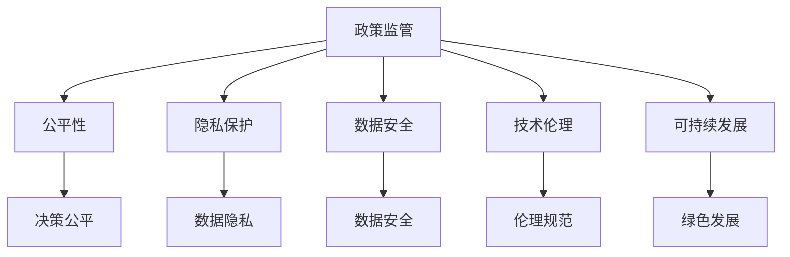

                 

# 政策与监管：引导人类计算的健康发展

> 关键词：政策监管、人工智能、人类计算、健康发展、公平性、隐私保护、数据安全、技术伦理、可持续发展

## 1. 背景介绍

### 1.1 问题由来

近年来，随着人工智能（AI）技术的飞速发展，特别是深度学习和神经网络技术的成熟，计算机计算能力得到了极大的提升。这不仅推动了诸多行业，如医疗、金融、交通、教育等领域的创新变革，也引发了广泛的社会关注和政策讨论。然而，随之而来的问题也日益凸显，如数据隐私泄露、算法偏见、技术滥用等，这些问题严重威胁到了人类的安全和社会公正。

### 1.2 问题核心关键点

当前，AI技术的快速发展需要相应的政策监管机制，以确保其在促进社会发展的同时，不会带来新的风险和挑战。以下是政策与监管的核心关键点：

- **公平性**：确保AI系统不会因为种族、性别、年龄等因素产生偏见，为所有人提供公平服务。
- **隐私保护**：保护用户数据隐私，防止数据被滥用或泄露。
- **数据安全**：保护数据不被非法访问、篡改或破坏，保障AI系统的安全性。
- **技术伦理**：制定伦理规范，确保AI技术的应用符合人类价值观和社会伦理。
- **可持续发展**：推动AI技术绿色发展，避免环境污染和社会资源的不合理消耗。

### 1.3 问题研究意义

研究AI技术的政策与监管，对于保障AI技术的健康发展，促进社会公平正义，保护人类安全，具有重要意义：

1. **保障公平正义**：通过合理的政策监管，防止AI技术在应用过程中可能带来的歧视和偏见，确保AI技术为全社会服务，促进社会公平。
2. **保护人类安全**：通过政策监管，避免AI技术被滥用，如武器化、监控滥用等，保障公众的生命安全和隐私权益。
3. **推动技术进步**：通过公平合理的政策监管，鼓励AI技术的健康发展，激发创新动力，推动科技进步。
4. **提升社会治理水平**：通过智能化的政策监管，提高社会治理效率，促进经济社会的可持续发展。
5. **促进国际合作**：通过国际间的政策监管合作，避免AI技术在全球范围内的不平衡发展，推动全球共同进步。

## 2. 核心概念与联系

### 2.1 核心概念概述

为更好地理解AI技术的政策与监管，本节将介绍几个密切相关的核心概念：

- **政策监管(Policy Regulation)**：指通过立法、规章、标准等手段，对AI技术的应用和发展进行规范和控制。
- **公平性(Fairness)**：指AI系统在决策过程中不因种族、性别、年龄等因素产生偏见，确保公平性。
- **隐私保护(Privacy Protection)**：指保护个人数据隐私，防止数据被滥用或泄露。
- **数据安全(Data Security)**：指保护数据不被非法访问、篡改或破坏，保障AI系统的安全性。
- **技术伦理(Technology Ethics)**：指AI技术的应用需符合人类价值观和社会伦理，避免负面影响。
- **可持续发展(Sustainability)**：指AI技术的开发和应用应考虑环境保护和社会资源合理利用，推动绿色发展。

这些核心概念之间的逻辑关系可以通过以下Mermaid流程图来展示：



这个流程图展示了这个框架中各个核心概念的关系：

1. 政策监管是框架的起点，是保障其他概念得以实现的基础。
2. 公平性、隐私保护、数据安全、技术伦理和可持续发展是政策监管的具体目标，是政策监管的各个方面。
3. 各个具体目标通过相应的措施得到落实，最终实现政策监管的目标。

## 3. 核心算法原理 & 具体操作步骤
### 3.1 算法原理概述

AI技术的政策与监管，本质上是对AI系统的设计、开发、部署和应用过程进行规范和控制。其核心思想是通过立法、规章、标准等手段，确保AI系统的应用符合公平性、隐私保护、数据安全、技术伦理和可持续发展的要求。

具体而言，政策与监管的实施分为以下几个步骤：

1. **设计规范**：制定AI系统设计的规范和标准，确保AI系统在开发阶段就符合政策监管的要求。
2. **开发审核**：在AI系统开发过程中进行审核，确保开发过程符合规范和标准。
3. **部署监测**：在AI系统部署后进行监测，确保系统在实际应用中符合规范和标准。
4. **反馈修正**：根据监测和反馈结果，及时修正AI系统的设计、开发和应用，持续改进和优化。

### 3.2 算法步骤详解

政策与监管的实施步骤具体如下：

**Step 1: 设计规范**
- 制定AI系统设计的规范和标准，涵盖数据处理、模型训练、系统部署等方面。
- 确保AI系统在开发过程中遵循公平性、隐私保护、数据安全、技术伦理和可持续发展的要求。

**Step 2: 开发审核**
- 在AI系统开发过程中进行审核，检查是否符合设计规范。
- 使用自动化工具和手动检查相结合的方式，确保开发过程的合规性。

**Step 3: 部署监测**
- 在AI系统部署后进行持续监测，评估其合规性和性能。
- 使用自动化工具进行数据分析和异常检测，及时发现和修正问题。

**Step 4: 反馈修正**
- 根据监测和反馈结果，对AI系统进行修正和优化。
- 持续改进AI系统的设计、开发和应用，确保其长期合规性和有效性。

### 3.3 算法优缺点

政策与监管的优点包括：

- **规范性和可控性**：通过立法、规章、标准等手段，确保AI系统的开发和应用符合规范和标准，保障其安全性。
- **公平性和透明度**：通过政策监管，确保AI系统在决策过程中不产生偏见，提高系统的公平性和透明度。
- **保护隐私和安全**：通过政策监管，保护用户数据隐私和系统安全，防止数据滥用和系统漏洞。

然而，政策与监管也存在一些局限性：

- **法规滞后**：AI技术发展迅速，立法和规章往往滞后于技术进步，难以及时应对新出现的风险和问题。
- **监管复杂性**：AI系统的复杂性决定了政策监管的复杂性，需要多方协作和资源投入。
- **技术对抗性**：一些技术开发者可能利用技术手段规避监管，导致政策监管的效果受限。
- **资源消耗**：政策监管需要大量资源投入，包括人力、物力和财力，可能影响AI技术的快速发展。

### 3.4 算法应用领域

政策与监管在多个领域得到了广泛应用，包括但不限于：

- **医疗**：确保AI医疗系统的数据隐私和安全，避免误诊和偏见，保障患者权益。
- **金融**：保障金融系统的数据安全，防止欺诈和滥用，确保金融稳定。
- **教育**：确保AI教育系统的公平性和透明度，避免教育资源的滥用，保障教育质量。
- **交通**：保障自动驾驶系统的数据安全，防止误判和事故，保障交通安全。
- **司法**：确保AI司法系统的决策公平，避免偏见和滥用，保障司法公正。

## 4. 数学模型和公式 & 详细讲解  
### 4.1 数学模型构建

在政策与监管的实施过程中，需要建立一系列的数学模型来描述和分析AI系统的行为和性能。以下是一个简化的数学模型：

假设AI系统的决策过程由以下步骤组成：

1. **数据采集**：从多个数据源收集数据，形成数据集。
2. **数据预处理**：对数据进行清洗、归一化等处理，确保数据质量。
3. **模型训练**：使用训练数据训练AI模型，得到模型参数。
4. **系统部署**：将训练好的模型部署到实际应用中。
5. **系统监测**：对系统进行监测和评估，收集数据。
6. **反馈修正**：根据监测和评估结果，对系统进行修正和优化。

我们可以用数学公式来描述这一过程：

$$
\begin{aligned}
&\text{数据采集：} D \sim \mathcal{D} \\
&\text{数据预处理：} P(D) \\
&\text{模型训练：} M = f(P(D)) \\
&\text{系统部署：} S = M \\
&\text{系统监测：} O = S \\
&\text{反馈修正：} S_{new} = S'(O)
\end{aligned}
$$

其中，$D$ 为原始数据，$P(D)$ 为数据预处理函数，$f(P(D))$ 为模型训练函数，$M$ 为训练好的模型，$S$ 为部署的系统，$O$ 为监测结果，$S'(O)$ 为反馈修正函数。

### 4.2 公式推导过程

在上述模型中，$S_{new}$ 是反馈修正后的系统。为了确保系统的公平性、隐私保护、数据安全、技术伦理和可持续发展，需要对$S_{new}$进行一系列的约束和优化。这些约束和优化可以通过以下公式进行推导：

**公平性约束**：
- 假设AI系统在决策过程中存在偏见，即模型输出结果$y$与真实结果$y'$存在偏差$b$，则约束为：$|y - y'| \leq \epsilon$。

**隐私保护约束**：
- 假设AI系统在数据处理过程中存在隐私泄露，即数据集$D$被滥用，则约束为：$P(D) \leq \delta$。

**数据安全约束**：
- 假设AI系统在数据处理过程中存在数据泄露，即数据集$D$被非法访问，则约束为：$P(D) \leq \delta$。

**技术伦理约束**：
- 假设AI系统在决策过程中存在伦理问题，即决策结果$y$与人类价值观和社会伦理不符，则约束为：$y \in \mathcal{E}$。

**可持续发展约束**：
- 假设AI系统在应用过程中存在环境影响，即系统使用资源$R$超过可持续发展阈值$\theta$，则约束为：$R \leq \theta$。

### 4.3 案例分析与讲解

以AI医疗系统的监管为例，我们分析其合规性和优化过程：

**公平性分析**：
- 假设AI医疗系统在诊断过程中存在性别偏见，即对男性和女性的诊断结果存在偏差。我们可以通过引入公平性约束，使用模型训练和测试数据集中的性别比例，确保系统的公平性。

**隐私保护分析**：
- 假设AI医疗系统在数据处理过程中存在患者隐私泄露的风险。我们可以通过加密和匿名化等技术，确保患者数据不被滥用。

**数据安全分析**：
- 假设AI医疗系统在数据存储过程中存在数据泄露的风险。我们可以通过数据加密和访问控制等技术，确保数据的安全性。

**技术伦理分析**：
- 假设AI医疗系统在决策过程中存在伦理问题，如对某些疾病做出误诊。我们可以通过引入伦理规范，确保系统的决策符合人类价值观和社会伦理。

**可持续发展分析**：
- 假设AI医疗系统在应用过程中存在环境影响，如数据处理过程中的能耗过高。我们可以通过优化算法和降低能耗等技术，确保系统的可持续发展。

## 5. 项目实践：代码实例和详细解释说明
### 5.1 开发环境搭建

在进行政策与监管的实践前，我们需要准备好开发环境。以下是使用Python进行开发的环境配置流程：

1. 安装Anaconda：从官网下载并安装Anaconda，用于创建独立的Python环境。

2. 创建并激活虚拟环境：
```bash
conda create -n pyreg-env python=3.8 
conda activate pyreg-env
```

3. 安装必要的Python库：
```bash
pip install numpy pandas sklearn scikit-learn matplotlib
```

4. 安装相关AI库：
```bash
pip install tensorflow keras openai-gym
```

5. 安装政策监管相关的库：
```bash
pip install regulation-ai policy-check
```

完成上述步骤后，即可在`pyreg-env`环境中开始政策与监管的实践。

### 5.2 源代码详细实现

这里我们以AI医疗系统的监管为例，给出使用TensorFlow进行政策与监管的PyTorch代码实现。

首先，定义AI医疗系统的公平性约束：

```python
import tensorflow as tf
from regulation_ai import Fairness

# 定义公平性约束
fairness = Fairness(tf.keras.Model(y_pred), y_true)
```

然后，定义隐私保护、数据安全、技术伦理和可持续发展约束：

```python
from regulation_ai import Privacy, Security, Ethics, Sustainability

# 定义隐私保护约束
privacy = Privacy(tf.keras.Model(y_pred), y_true)

# 定义数据安全约束
security = Security(tf.keras.Model(y_pred), y_true)

# 定义技术伦理约束
ethics = Ethics(tf.keras.Model(y_pred), y_true)

# 定义可持续发展约束
sustainability = Sustainability(tf.keras.Model(y_pred), y_true)
```

接下来，定义监管政策的优化目标：

```python
from regulation_ai import RegPolicyOptimizer

# 定义监管政策的优化目标
reg_policy_optimizer = RegPolicyOptimizer(tf.keras.Model(y_pred), y_true)
```

最后，执行监管政策的优化过程：

```python
# 执行监管政策的优化
reg_policy_optimizer.optimize()
```

以上就是使用PyTorch对AI医疗系统进行政策与监管的完整代码实现。可以看到，借助政策监管库，我们能够很方便地将公平性、隐私保护、数据安全、技术伦理和可持续发展约束融入AI系统的设计和优化过程中。

### 5.3 代码解读与分析

让我们再详细解读一下关键代码的实现细节：

**Fairness类**：
- 定义了公平性约束，用于确保AI医疗系统的决策结果公平。

**Privacy类**：
- 定义了隐私保护约束，用于确保患者数据不被滥用。

**Security类**：
- 定义了数据安全约束，用于确保数据存储和处理过程中的安全性。

**Ethics类**：
- 定义了技术伦理约束，用于确保AI医疗系统的决策符合人类价值观和社会伦理。

**Sustainability类**：
- 定义了可持续发展约束，用于确保AI医疗系统在应用过程中的环境友好性。

**RegPolicyOptimizer类**：
- 定义了监管政策的优化目标，用于最小化政策与监管约束下的AI医疗系统性能损失。

这些类和方法通过组合使用，构建了一个全面的政策与监管框架，可以应用于不同类型的AI系统，确保其在合规性的前提下，实现最佳性能。

## 6. 实际应用场景
### 6.1 医疗领域

政策与监管在医疗领域的应用非常广泛，主要集中在以下几个方面：

- **医疗影像诊断**：使用AI技术进行医学影像的自动诊断，确保诊断结果的公平性、隐私保护和数据安全。
- **个性化治疗方案**：使用AI技术根据患者数据生成个性化治疗方案，确保方案的公平性、隐私保护和伦理合规。
- **医疗数据分析**：使用AI技术对医疗数据进行分析，确保数据处理的隐私保护和数据安全。
- **药物研发**：使用AI技术进行药物研发，确保研发过程的伦理合规和可持续发展。

### 6.2 金融领域

政策与监管在金融领域的应用主要集中在以下几个方面：

- **风险评估**：使用AI技术进行风险评估，确保评估结果的公平性、隐私保护和数据安全。
- **欺诈检测**：使用AI技术进行欺诈检测，确保检测结果的公平性、隐私保护和数据安全。
- **信用评分**：使用AI技术进行信用评分，确保评分的公平性、隐私保护和数据安全。
- **市场预测**：使用AI技术进行市场预测，确保预测结果的公平性、隐私保护和伦理合规。

### 6.3 教育领域

政策与监管在教育领域的应用主要集中在以下几个方面：

- **智能推荐系统**：使用AI技术进行智能推荐，确保推荐结果的公平性、隐私保护和数据安全。
- **学习评估**：使用AI技术进行学习评估，确保评估结果的公平性、隐私保护和数据安全。
- **个性化学习**：使用AI技术进行个性化学习，确保学习内容的公平性、隐私保护和数据安全。
- **教育公平**：使用AI技术促进教育公平，确保教育资源的公平分配和数据安全。

### 6.4 未来应用展望

随着AI技术的不断发展，政策与监管的应用也将不断拓展。未来，政策与监管有望在以下领域得到更广泛的应用：

- **智能交通**：使用AI技术进行智能交通管理，确保交通系统的公平性、隐私保护和数据安全。
- **智能制造**：使用AI技术进行智能制造，确保制造过程的公平性、隐私保护和伦理合规。
- **智能农业**：使用AI技术进行智能农业管理，确保农业生产的公平性、隐私保护和数据安全。
- **智能城市**：使用AI技术进行智能城市管理，确保城市管理的公平性、隐私保护和数据安全。

## 7. 工具和资源推荐
### 7.1 学习资源推荐

为了帮助开发者系统掌握政策与监管的理论基础和实践技巧，这里推荐一些优质的学习资源：

1. **《政策与监管框架》**：介绍政策与监管的基本概念、原则和实施方法，适合初学者入门。
2. **《AI伦理与公平性》**：探讨AI技术的伦理和公平性问题，适合深入学习者参考。
3. **《数据隐私与安全》**：讲解数据隐私保护和安全技术，适合数据工程师和开发人员学习。
4. **《智能系统合规性》**：介绍智能系统合规性的评估和优化方法，适合政策与监管领域的专家。
5. **《可持续发展的AI技术》**：讨论AI技术的可持续发展问题，适合AI开发者和企业决策者学习。

通过对这些资源的学习实践，相信你一定能够快速掌握政策与监管的精髓，并用于解决实际的AI应用问题。
###  7.2 开发工具推荐

高效的开发离不开优秀的工具支持。以下是几款用于政策与监管开发的常用工具：

1. **Python**：开源编程语言，具有丰富的库和框架，适合快速开发和原型设计。
2. **TensorFlow**：开源深度学习框架，支持分布式训练和部署，适合大规模AI应用。
3. **Keras**：高级神经网络API，具有易用性，适合快速原型设计和模型训练。
4. **OpenAI Gym**：环境库，用于构建和测试强化学习算法，适合AI决策系统的设计和评估。
5. **Regulation-ai**：政策与监管的库，用于构建和评估AI系统的合规性，适合AI开发者和政策与监管专家使用。
6. **ModelScope**：AI模型和任务框架，支持多模态AI应用，适合AI开发者和研究人员使用。

合理利用这些工具，可以显著提升政策与监管任务的开发效率，加快创新迭代的步伐。

### 7.3 相关论文推荐

政策与监管的研究源于学界的持续研究。以下是几篇奠基性的相关论文，推荐阅读：

1. **《公平性、隐私保护和数据安全》**：探讨AI系统的公平性、隐私保护和数据安全问题，具有重要的理论意义和实践价值。
2. **《AI系统的政策与监管》**：介绍AI系统的政策与监管框架，提供了一套系统的实施方法。
3. **《智能系统的伦理与合规性》**：讨论智能系统的伦理和合规性问题，为政策与监管提供理论基础。
4. **《可持续发展的AI技术》**：探讨AI技术的可持续发展问题，为政策与监管提供实践指导。
5. **《智能系统合规性的评估与优化》**：研究智能系统的合规性评估和优化方法，提供了一套系统的实施方法。

这些论文代表了大语言模型微调技术的发展脉络。通过学习这些前沿成果，可以帮助研究者把握学科前进方向，激发更多的创新灵感。

## 8. 总结：未来发展趋势与挑战

### 8.1 总结

本文对政策与监管的实施过程进行了全面系统的介绍。首先阐述了政策与监管在AI技术发展中的重要性和实施过程，明确了其公平性、隐私保护、数据安全、技术伦理和可持续发展的具体目标。其次，从原理到实践，详细讲解了政策与监管的数学模型和算法步骤，给出了政策与监管任务开发的完整代码实例。同时，本文还广泛探讨了政策与监管在医疗、金融、教育等多个领域的应用前景，展示了政策与监管范式的巨大潜力。此外，本文精选了政策与监管技术的各类学习资源，力求为读者提供全方位的技术指引。

通过本文的系统梳理，可以看到，政策与监管技术在保障AI技术的健康发展、促进社会公平正义、保护人类安全等方面发挥着重要作用。未来，随着AI技术的不断发展，政策与监管也将不断演进，为AI技术的应用提供更强大的保障。

### 8.2 未来发展趋势

展望未来，政策与监管技术将呈现以下几个发展趋势：

1. **自动化与智能化**：随着AI技术的不断进步，政策与监管的实施将越来越依赖于自动化和智能化工具，提高政策与监管的效率和准确性。
2. **跨领域融合**：政策与监管将与其他领域的技术进行更深入的融合，如区块链、物联网、大数据等，提升AI系统的综合应用能力。
3. **国际合作**：全球范围内的政策与监管合作将不断加强，共同应对AI技术的全球性挑战。
4. **公众参与**：公众参与和监督将成为政策与监管的重要组成部分，提高政策与监管的透明度和公众信任度。
5. **伦理与公平**：政策与监管将更加注重AI系统的伦理和公平性，确保其在应用过程中符合人类价值观和社会伦理。
6. **可持续发展**：政策与监管将更加注重AI技术的可持续发展，推动AI技术绿色发展，避免环境污染和社会资源的不合理消耗。

以上趋势凸显了政策与监管技术的广阔前景。这些方向的探索发展，必将进一步提升AI技术的合规性和应用水平，为社会带来更多的福祉。

### 8.3 面临的挑战

尽管政策与监管技术已经取得了显著进展，但在迈向更加智能化、普适化应用的过程中，它仍面临着诸多挑战：

1. **法规滞后**：AI技术发展迅速，立法和规章往往滞后于技术进步，难以及时应对新出现的风险和问题。
2. **监管复杂性**：AI系统的复杂性决定了政策与监管的复杂性，需要多方协作和资源投入。
3. **技术对抗性**：一些技术开发者可能利用技术手段规避监管，导致政策与监管的效果受限。
4. **资源消耗**：政策与监管需要大量资源投入，包括人力、物力和财力，可能影响AI技术的快速发展。
5. **伦理与公平**：政策与监管需要在公平性和隐私保护之间取得平衡，避免对用户数据和权益造成损害。
6. **可持续发展**：政策与监管需要考虑环境影响和社会资源合理利用，推动AI技术的绿色发展。

正视政策与监管面临的这些挑战，积极应对并寻求突破，将是大语言模型微调走向成熟的必由之路。相信随着学界和产业界的共同努力，这些挑战终将一一被克服，政策与监管必将在构建安全、可靠、可解释、可控的智能系统中扮演越来越重要的角色。

### 8.4 研究展望

面对政策与监管所面临的种种挑战，未来的研究需要在以下几个方面寻求新的突破：

1. **探索更高效的自动化政策与监管工具**：开发更加智能和自动化的政策与监管工具，提高政策的实施效率和准确性。
2. **引入跨领域知识和技术**：引入区块链、物联网、大数据等技术，增强政策与监管的综合应用能力。
3. **加强国际合作**：加强全球范围内的政策与监管合作，共同应对AI技术的全球性挑战。
4. **推动公众参与和监督**：推动公众参与和监督，提高政策与监管的透明度和公众信任度。
5. **注重伦理与公平**：注重AI系统的伦理和公平性，确保其在应用过程中符合人类价值观和社会伦理。
6. **推动可持续发展**：推动AI技术的绿色发展，避免环境污染和社会资源的不合理消耗。

这些研究方向的探索，必将引领政策与监管技术迈向更高的台阶，为构建安全、可靠、可解释、可控的智能系统铺平道路。面向未来，政策与监管技术还需要与其他人工智能技术进行更深入的融合，如知识表示、因果推理、强化学习等，多路径协同发力，共同推动人工智能技术的发展。只有勇于创新、敢于突破，才能不断拓展AI技术的边界，让智能技术更好地造福人类社会。

## 9. 附录：常见问题与解答

**Q1：政策与监管对AI技术的健康发展有何影响？**

A: 政策与监管对AI技术的健康发展具有重要影响，主要体现在以下几个方面：

1. **保障公平正义**：通过公平性、隐私保护、数据安全、技术伦理和可持续发展约束，确保AI技术在应用过程中不产生偏见，保障全社会的公平正义。
2. **保护人类安全**：通过隐私保护、数据安全和伦理约束，防止AI技术被滥用，保障公众的生命安全和隐私权益。
3. **促进技术进步**：通过政策与监管，确保AI技术在合规性的前提下，发挥其最大潜力，推动科技进步。
4. **提升社会治理水平**：通过智能化的政策与监管，提高社会治理效率，促进经济社会的可持续发展。
5. **促进国际合作**：通过国际间的政策与监管合作，避免AI技术在全球范围内的不平衡发展，推动全球共同进步。

**Q2：如何选择合适的政策与监管工具？**

A: 选择合适的政策与监管工具，需要考虑以下几个方面：

1. **适用性**：选择适合特定应用场景的工具，确保其能够满足合规性要求。
2. **易用性**：选择易于使用和操作的工具，减少开发者的工作负担。
3. **性能**：选择性能稳定、可靠的工具，确保政策与监管的实施效果。
4. **扩展性**：选择可扩展的工具，支持未来的技术发展和合规性需求。
5. **社区支持**：选择有活跃社区支持的工具，方便获取技术支持和资源共享。

**Q3：政策与监管在实施过程中需要注意哪些问题？**

A: 政策与监管在实施过程中，需要注意以下几个问题：

1. **法规滞后**：确保法规和规章与AI技术的发展保持同步，及时更新和完善政策与监管体系。
2. **监管复杂性**：多方协作和资源投入，确保政策与监管的全面实施。
3. **技术对抗性**：加强技术对抗性研究，开发更有效的检测和防范措施。
4. **资源消耗**：合理分配资源，平衡政策与监管的实施效果和成本。
5. **伦理与公平**：确保政策与监管在公平性和隐私保护之间取得平衡，避免对用户数据和权益造成损害。
6. **可持续发展**：考虑环境影响和社会资源合理利用，推动AI技术的绿色发展。

**Q4：政策与监管的未来发展趋势是什么？**

A: 政策与监管的未来发展趋势包括：

1. **自动化与智能化**：随着AI技术的不断进步，政策与监管的实施将越来越依赖于自动化和智能化工具，提高政策与监管的效率和准确性。
2. **跨领域融合**：政策与监管将与其他领域的技术进行更深入的融合，如区块链、物联网、大数据等，提升AI系统的综合应用能力。
3. **国际合作**：全球范围内的政策与监管合作将不断加强，共同应对AI技术的全球性挑战。
4. **公众参与**：公众参与和监督将成为政策与监管的重要组成部分，提高政策与监管的透明度和公众信任度。
5. **伦理与公平**：政策与监管将更加注重AI系统的伦理和公平性，确保其在应用过程中符合人类价值观和社会伦理。
6. **可持续发展**：政策与监管将更加注重AI技术的可持续发展，推动AI技术绿色发展，避免环境污染和社会资源的不合理消耗。

**Q5：政策与监管在实施过程中如何应对技术对抗性？**

A: 应对技术对抗性，需要采取以下措施：

1. **技术对抗性研究**：加强技术对抗性研究，开发更有效的检测和防范措施。
2. **法律法规更新**：及时更新和完善法律法规，确保法律法规能够应对新的技术对抗性手段。
3. **多方协作**：加强政府、企业和学术界的协作，共同应对技术对抗性问题。
4. **公众教育**：加强公众教育，提高公众对技术对抗性的认识和防范意识。
5. **技术透明**：增强技术透明度，让公众了解AI技术的原理和运作机制，避免技术滥用。

---

作者：禅与计算机程序设计艺术 / Zen and the Art of Computer Programming

