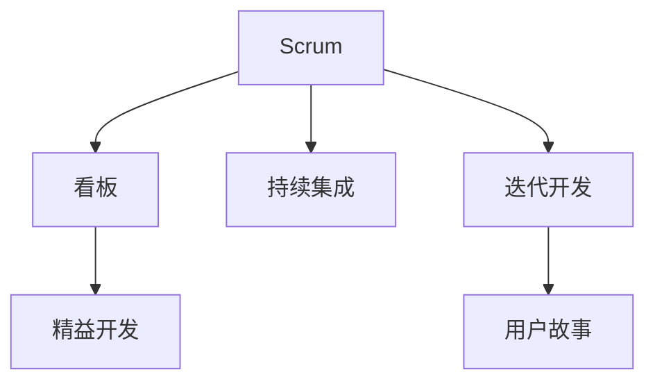

                 

# 敏捷开发方法：Scrum与看板方法

> 关键词：敏捷开发,Scrum,看板方法,项目管理,软件开发,迭代,持续集成,精益开发

## 1. 背景介绍

### 1.1 问题由来
敏捷开发方法在过去几十年中已经成为软件开发领域的主流范式。敏捷方法的核心思想是通过持续的反馈和迭代，使得软件产品能够更好地满足客户需求和市场变化。敏捷方法的具体形式有很多种，其中Scrum和看板方法是最为流行的两种。

### 1.2 问题核心关键点
Scrum和看板方法在敏捷开发的实践中有许多共通点，也有各自的独特之处。Scrum方法更加侧重于团队的协作和计划，而看板方法则更加侧重于流程的可视化和优化。理解这两种方法的理论基础和实践技巧，对于软件开发团队的高效协作和管理至关重要。

## 2. 核心概念与联系

### 2.1 核心概念概述

为更好地理解Scrum和看板方法，本节将介绍几个密切相关的核心概念：

- Scrum方法论：一种敏捷开发框架，通过迭代式的Sprint和Sprint回顾，实现产品的持续改进和交付。
- 看板方法：一种敏捷项目管理工具，通过可视化流程和限额管理，促进任务的流式管理和优化。
- 持续集成(CI)：在软件开发过程中，频繁集成和测试代码，以快速发现和修复问题，提高软件质量。
- 精益开发：一种旨在通过消除浪费和提高价值实现快速交付的方法论。
- 迭代开发：将大的软件开发任务分解为小的、可管理的部分，通过迭代开发逐步实现产品功能。
- 用户故事(User Stories)：一种以用户为中心的需求表达方式，用于描述用户希望软件实现的功能。

这些核心概念之间的逻辑关系可以通过以下Mermaid流程图来展示：



这个流程图展示了他们的核心概念及相互关系：

1. Scrum方法通过Sprint和Sprint回顾，实现迭代开发和持续改进。
2. 看板方法通过可视化流程和限额管理，优化迭代开发过程。
3. 持续集成通过频繁集成和测试代码，保证软件质量。
4. 精益开发通过消除浪费和提高价值，提升开发效率。
5. 迭代开发将大的任务分解为小的、可管理的部分，逐步实现产品功能。
6. 用户故事用于描述用户希望软件实现的功能，是敏捷开发的基础。

这些核心概念共同构成了敏捷开发的核心方法论，使得团队能够高效地管理项目，快速响应市场变化，实现高质量的软件交付。

## 3. 核心算法原理 & 具体操作步骤
### 3.1 算法原理概述

Scrum和看板方法虽然在具体实践上有所不同，但它们都遵循敏捷开发的核心理念，即通过持续的反馈和迭代，实现产品的持续改进和交付。其核心算法原理可以概括为：

- **迭代开发**：将大的任务分解为小的、可管理的部分，通过迭代开发逐步实现产品功能。
- **反馈机制**：在每个迭代结束时，进行Sprint回顾或看板评审，收集反馈并持续改进。
- **可见性**：通过可视化工具，如看板、燃尽图等，使得任务和进度对团队成员和客户都可见，促进透明和协作。

### 3.2 算法步骤详解

以下是Scrum和看板方法的具体操作步骤：

**Scrum方法步骤**：
1. **产品待办列表(Backlog)管理**：由产品负责人维护待办列表，将客户需求和技术任务转化为用户故事，并根据优先级排序。
2. **Sprint规划会议**：团队根据待办列表和迭代周期，规划当前Sprint的任务和目标。
3. **Sprint迭代**：团队在Sprint期间执行任务，并保持每日站会，确保进度和沟通。
4. **Sprint回顾会议**：Sprint结束后，团队进行回顾，总结经验教训，制定改进措施。
5. **产品演示会议**：团队向客户展示Sprint成果，获取反馈。

**看板方法步骤**：
1. **看板布局设计**：根据项目特点设计看板布局，如待办列表、进行中任务、已完成任务等。
2. **任务可视化**：将任务贴在看板的不同列上，明确任务状态和责任人。
3. **WIP限制**：设定每列任务的WIP（工作在进度中）限制，防止过度承诺和堆积。
4. **每日站会**：团队成员在每日站会上汇报任务进展，协调解决问题。
5. **任务转移**：根据任务进度，及时调整任务状态，推进任务流程。

### 3.3 算法优缺点

Scrum和看板方法各有优缺点：

**Scrum方法优点**：
1. **严格的迭代过程**：通过Sprint和Sprint回顾，确保了每个迭代都有明确的目标和成果。
2. **团队协作和透明度**：每日站会和Sprint回顾提高了团队协作和透明度。
3. **稳定性和可控性**：通过固定的Sprint周期，确保了项目进度的稳定性和可控性。

**Scrum方法缺点**：
1. **仪式感较强**：Scrum方法对仪式和流程的依赖较强，容易在执行过程中流于形式。
2. **不适用于所有团队**：对于非自组织的团队，Scrum方法可能难以发挥其优势。

**看板方法优点**：
1. **流程可视化**：通过看板，能够实时查看任务状态和进度，促进透明和优化。
2. **灵活性高**：看板方法没有固定的迭代周期，可以根据项目需求灵活调整。
3. **适应性强**：看板方法适用于各种规模的团队和项目类型。

**看板方法缺点**：
1. **依赖个人自律**：看板方法依赖团队成员的自律和自我管理，可能导致执行偏差。
2. **缺乏明确目标**：没有固定的迭代周期，可能导致项目进度不够稳定。

### 3.4 算法应用领域

Scrum和看板方法在软件开发、项目管理、流程优化等领域有着广泛的应用：

- **软件开发**：在敏捷开发中，Scrum和看板方法广泛应用于产品迭代、需求管理和团队协作。
- **项目管理**：在项目管理中，Scrum和看板方法帮助团队更好地进行任务分配和进度跟踪。
- **流程优化**：在业务流程管理中，Scrum和看板方法通过可视化流程，提升业务流程的效率和质量。

此外，Scrum和看板方法也被广泛应用于项目管理和组织管理中，如项目管理办公室(PMO)、人力资源管理等。

## 4. 数学模型和公式 & 详细讲解 & 举例说明
### 4.1 数学模型构建

敏捷开发方法的理论基础主要围绕着迭代和持续改进的核心理念，可以概括为以下数学模型：

- **迭代次数**：设 $n$ 为迭代次数，$n \in \mathbb{N}^+$。
- **任务量**：设 $T$ 为任务总量，$T \in \mathbb{R}^+$。
- **任务完成度**：设 $P_t$ 为第 $t$ 次迭代的任务完成度，$P_t \in [0,1]$，且 $P_1 \geq P_2 \geq \ldots \geq P_n$。

假设每次迭代的任务完成度相等，即 $P_t = \frac{1}{n} \sum_{i=1}^n P_i$。

### 4.2 公式推导过程

通过上述数学模型，可以推导出敏捷开发中的一些关键公式：

1. **任务完成度**：
   $$
   P_t = \frac{t}{n}
   $$

2. **任务剩余量**：
   $$
   R_t = T - \sum_{i=1}^t P_i
   $$

3. **任务完成率**：
   $$
   R = \frac{\sum_{t=1}^n P_t}{T}
   $$

4. **迭代进度**：
   $$
   P = \frac{1}{n} \sum_{i=1}^n P_i
   $$

这些公式在敏捷开发中广泛应用于任务管理和进度跟踪。

### 4.3 案例分析与讲解

以一个软件开发项目为例，假设项目总任务量为100个任务，迭代次数为5次，每次迭代完成的任务量相等。通过上述公式计算任务完成度、任务剩余量和任务完成率：

- **任务完成度**：
  $$
  P_1 = \frac{1}{5} = 0.2
  $$
  $$
  P_2 = P_1 = 0.2
  $$
  $$
  P_3 = P_1 = 0.2
  $$
  $$
  P_4 = P_1 = 0.2
  $$
  $$
  P_5 = P_1 = 0.2
  $$

- **任务剩余量**：
  $$
  R_1 = 100 - 0 = 100
  $$
  $$
  R_2 = 100 - 0.4 = 96
  $$
  $$
  R_3 = 100 - 0.8 = 92
  $$
  $$
  R_4 = 100 - 1.2 = 88
  $$
  $$
  R_5 = 100 - 1.6 = 84
  $$

- **任务完成率**：
  $$
  R = \frac{0.2 + 0.2 + 0.2 + 0.2 + 0.2}{100} = 0.6
  $$

通过这些计算，可以看到项目在第5次迭代时，已经完成了60%的任务。这些数据有助于项目经理和团队成员进行任务分配和进度跟踪。

## 5. 项目实践：代码实例和详细解释说明
### 5.1 开发环境搭建

在进行敏捷开发实践前，我们需要准备好开发环境。以下是使用Jira和Confluence进行敏捷开发的环境配置流程：

1. 安装Jira：从官网下载并安装Jira，用于敏捷项目管理。
2. 安装Confluence：从官网下载并安装Confluence，用于文档管理和知识共享。
3. 配置数据库：Jira和Confluence默认使用MySQL或PostgreSQL作为数据库，需要根据环境进行配置。
4. 配置邮件通知：设置Jira和Confluence的邮件通知功能，方便团队成员及时获取任务和文档更新信息。

完成上述步骤后，即可在Jira和Confluence上开始敏捷开发实践。

### 5.2 源代码详细实现

以下是使用Jira进行Scrum开发的Python代码实现。

首先，创建一个Scrum任务板，用于管理任务状态和进度：

```python
from jira import Jira

jira = Jira('https://your-jira.com', username='your-username', password='your-password')

board_id = jira.get_board('板ID')
list_id_done = jira.get_list(board_id, 'done')
list_id_inprogress = jira.get_list(board_id, 'in-progress')

# 查询所有未完成的任务
inprogress_tasks = jira.search_issues('status in (' + ','.join([list_id_done.id, list_id_inprogress.id]) + ')')
```

然后，查询当前迭代的任务和成员，进行每日站会：

```python
current_sprint = jira.get_sprint('迭代ID')
current_members = jira.get_members('成员ID')

# 每日站会
for task in inprogress_tasks:
    print(f'Task: {task.key}\nDescription: {task.description}\nAssignee: {task.assignee.name}')
```

最后，完成Sprint回顾和产品演示会议：

```python
# Sprint回顾会议
backlog = jira.get_issues('labels in (产品待办列表)')

for task in backlog:
    print(f'Task: {task.key}\nDescription: {task.description}\nAssignee: {task.assignee.name}')

# 产品演示会议
for task in backlog:
    print(f'Task: {task.key}\nDescription: {task.description}\nAssignee: {task.assignee.name}\n状态: {task.status.name}')
```

### 5.3 代码解读与分析

让我们再详细解读一下关键代码的实现细节：

**Jira任务板创建**：
- `jira.get_board()`：获取任务板对象，并指定板的ID。
- `jira.get_list()`：获取任务板中的列表对象，并指定列表的ID。

**任务查询**：
- `jira.search_issues()`：根据任务状态查询所有未完成的任务，指定查询条件。

**每日站会**：
- `for`循环遍历未完成任务，输出任务描述和分配人。

**Sprint回顾会议**：
- `jira.get_issues()`：根据标签查询所有产品待办列表的任务。

**产品演示会议**：
- 输出所有产品待办列表的任务，以及任务的状态。

这些代码通过Jira API，实现了敏捷开发中的任务管理和每日站会。开发者可以根据具体需求，扩展和优化代码，实现更全面的敏捷开发实践。

## 6. 实际应用场景
### 6.1 软件开发团队

敏捷开发方法在软件开发团队中得到了广泛的应用。传统的瀑布式开发方法在市场变化快速、需求不稳定的环境下，难以快速响应和交付。而敏捷开发方法通过迭代开发和持续反馈，确保了软件产品的稳定性和可控性。

在实践中，开发团队可以采用Scrum或看板方法，将项目分解为小的、可管理的部分，并通过每日站会和Sprint回顾，不断优化开发过程，提升软件质量。例如，一家金融科技公司通过采用Scrum方法，成功开发了一个高频交易系统，能够在毫秒级别内处理海量订单，满足了金融市场对系统快速响应的需求。

### 6.2 项目管理办公室

敏捷开发方法在项目管理办公室(PMO)中也得到了广泛应用。PMO通过引入敏捷方法论，帮助各个项目团队提高项目管理效率，实现项目的高效交付。

在实践中，PMO可以使用看板方法，通过可视化任务和进度，促进团队协作和透明。例如，一家大型跨国企业的PMO通过采用看板方法，成功管理了多个全球性项目，实现了项目的协调一致和高效交付。

### 6.3 流程优化

敏捷开发方法在业务流程优化中也有着广泛应用。通过引入敏捷方法论，企业能够优化业务流程，提升业务效率和质量。

在实践中，企业可以通过看板方法，将业务流程可视化，识别和优化流程中的瓶颈和浪费。例如，一家物流公司通过采用看板方法，成功优化了仓储管理流程，实现了物资调度和配送的高效协调。

### 6.4 未来应用展望

随着敏捷开发方法的发展，未来将在更多领域得到应用，为组织和企业带来变革性影响：

1. **敏捷文化**：敏捷方法论不仅应用于软件开发，还将深入到组织的各个层面，推动组织的敏捷转型。
2. **多学科协作**：敏捷方法将促进多学科协作，实现跨部门和跨团队的协同工作。
3. **持续学习**：敏捷方法通过持续反馈和迭代，实现团队和组织的持续学习和提升。
4. **数据驱动**：敏捷方法将更多地依赖数据驱动决策，提升组织管理的科学性。
5. **自动化**：敏捷方法将推动更多流程的自动化，提高工作效率和质量。
6. **敏捷应用场景**：敏捷方法将广泛应用于软件开发、项目管理、流程优化、组织管理等多个领域，推动各行业的数字化转型。

敏捷开发方法将在未来进一步发挥其价值，成为推动组织和企业创新和发展的核心驱动力。

## 7. 工具和资源推荐
### 7.1 学习资源推荐

为了帮助开发者系统掌握敏捷开发方法，这里推荐一些优质的学习资源：

1. 《Scrum敏捷项目管理》书籍：深入讲解Scrum方法论，提供实战案例和工具推荐。
2. 《看板方法与流程优化》课程：由专家讲解看板方法的理论基础和实践技巧，提供详细的案例分析。
3. Scrum Alliance官方培训：提供Scrum认证课程和专业培训，帮助开发者掌握Scrum方法论。
4. 精益开发与敏捷方法论的论文：深入研究精益开发和敏捷方法论的理论基础，提供前沿的学术观点和实践案例。
5. Jira和Confluence官方文档：提供详细的API文档和用户手册，帮助开发者高效使用敏捷开发工具。

通过对这些资源的学习实践，相信你一定能够系统掌握敏捷开发方法，并在实际开发中取得良好的效果。

### 7.2 开发工具推荐

高效的工具支持是敏捷开发成功的关键。以下是几款用于敏捷开发和管理的常用工具：

1. Jira：一款领先的敏捷项目管理工具，支持Scrum、看板等多种敏捷方法论，提供任务管理、问题追踪等功能。
2. Confluence：一款文档管理和知识共享工具，支持看板和文档整合，提供团队协作和知识沉淀的平台。
3. Trello：一款看板管理工具，简单易用，适合小型团队和项目管理。
4. Asana：一款任务管理和协作工具，支持看板和甘特图等多种视图，适用于团队协作和项目管理。
5. GitHub：一款代码托管平台，支持敏捷开发和持续集成，提供版本控制和代码协作功能。

合理利用这些工具，可以显著提升敏捷开发和项目管理的效率，加快创新迭代的步伐。

### 7.3 相关论文推荐

敏捷开发方法的发展离不开学界的持续研究。以下是几篇奠基性的相关论文，推荐阅读：

1. 《Scrum: A framework for improving software project management》：Scrum方法论的奠基之作，详细介绍了Scrum方法论的理论基础和实践技巧。
2. 《Kanban: One, two, three》：看板方法的理论基础，探讨了看板方法的原理和实践应用。
3. 《Continuous delivery and its emergence in industry》：持续集成和持续交付的理论基础，探讨了持续交付的实现方法和最佳实践。
4. 《Agile software development: principles, patterns, and practices》：敏捷软件开发方法论的权威之作，详细介绍了敏捷开发的方法和实践。
5. 《Agile project management with Scrum》：Scrum方法论的实战指南，提供详细的项目管理和团队协作策略。

这些论文代表了大敏捷开发方法的发展脉络。通过学习这些前沿成果，可以帮助研究者把握学科前进方向，激发更多的创新灵感。

## 8. 总结：未来发展趋势与挑战
### 8.1 总结

本文对敏捷开发方法中的Scrum和看板方法进行了全面系统的介绍。首先阐述了Scrum和看板方法的研究背景和应用价值，明确了敏捷开发的核心思想。其次，从原理到实践，详细讲解了Scrum和看板方法的理论基础和具体操作步骤，给出了敏捷开发任务管理的完整代码实例。同时，本文还广泛探讨了Scrum和看板方法在软件开发、项目管理、流程优化等多个领域的应用前景，展示了敏捷开发方法在行业中的广泛应用。此外，本文精选了敏捷开发方法的各类学习资源，力求为读者提供全方位的技术指引。

通过本文的系统梳理，可以看到，敏捷开发方法已经成为软件开发和项目管理的重要范式，极大地提升了项目管理和软件开发的高效性和灵活性。未来，伴随敏捷方法的发展和演化，敏捷开发将在更多领域得到应用，为组织和企业带来更大的创新和发展机遇。

### 8.2 未来发展趋势

展望未来，敏捷开发方法将呈现以下几个发展趋势：

1. **敏捷文化普及**：敏捷方法将从软件开发领域扩展到各个行业，成为组织管理和创新的重要手段。
2. **敏捷工具创新**：敏捷工具将进一步创新和优化，提升敏捷开发和项目管理的能力。
3. **敏捷与精益结合**：敏捷方法将更多地与精益思想结合，提升敏捷开发的科学性和效率。
4. **敏捷生态系统**：敏捷开发将构建起完整的生态系统，涵盖敏捷工具、敏捷方法论、敏捷实践等多个方面。
5. **敏捷技术融合**：敏捷开发将与人工智能、大数据等新兴技术结合，推动敏捷开发向更加智能和高效的方向发展。
6. **全球化应用**：敏捷方法将跨越文化和地域的界限，在全球范围内推广和应用。

以上趋势凸显了敏捷开发方法的广阔前景。这些方向的探索发展，必将进一步提升敏捷开发的高效性和科学性，为组织和企业带来更大的创新和发展机遇。

### 8.3 面临的挑战

尽管敏捷开发方法已经取得了瞩目成就，但在迈向更加智能化、普适化应用的过程中，它仍面临着诸多挑战：

1. **组织变革困难**：敏捷方法要求组织和管理方式的变革，对于传统企业的变革阻力较大。
2. **团队协作难度**：敏捷方法需要团队高度协作和沟通，对于团队的自我管理和自我驱动能力要求较高。
3. **项目风险管理**：敏捷方法通过迭代和持续反馈，减少了计划偏差，但也带来了项目风险管理的新挑战。
4. **敏捷文化差异**：敏捷方法在不同组织和文化背景下的适应性和接受度不同，需要灵活调整和优化。
5. **技术工具限制**：敏捷方法依赖于先进的工具和平台支持，对于技术工具的依赖较强。

这些挑战需要敏捷开发者和组织管理者共同应对，通过持续的实践和改进，才能实现敏捷方法的全面推广和应用。

### 8.4 研究展望

面对敏捷开发面临的挑战，未来的研究需要在以下几个方面寻求新的突破：

1. **敏捷与数字化转型结合**：将敏捷方法与数字化转型结合，推动组织向数字化方向转型。
2. **敏捷与精益开发融合**：将敏捷方法与精益开发融合，实现更加高效和低成本的敏捷开发。
3. **敏捷与人工智能结合**：将敏捷方法与人工智能结合，提升敏捷开发的高效性和智能化。
4. **敏捷与大数据结合**：将敏捷方法与大数据结合，实现数据驱动的敏捷开发。
5. **敏捷与云计算结合**：将敏捷方法与云计算结合，实现敏捷开发的弹性化和自动化。

这些研究方向的探索，必将引领敏捷开发方法迈向更高的台阶，为组织和企业带来更大的创新和发展机遇。

## 9. 附录：常见问题与解答

**Q1：Scrum和看板方法是否适用于所有项目类型？**

A: Scrum和看板方法适用于各种规模和类型的项目，但不同的项目类型需要根据具体情况进行调整和优化。例如，对于需求变化不大的项目，可以采用看板方法，而对于需求变化较大的项目，可以采用Scrum方法。

**Q2：如何选择合适的敏捷方法论？**

A: 在选择敏捷方法论时，需要考虑项目的特点和团队的情况。对于需求变化较大的项目，可以选择Scrum方法，而对于需求相对稳定的项目，可以选择看板方法。同时，需要考虑团队成员的技能和经验，选择适合的方法论，避免不适应导致的执行偏差。

**Q3：敏捷开发中的每日站会有哪些注意事项？**

A: 每日站会是敏捷开发中非常重要的环节，需要注意以下几点：
1. 保持简洁高效，尽量控制在15分钟以内。
2. 关注任务的进展和问题，避免讨论无关内容。
3. 鼓励团队成员主动分享问题和挑战，寻求解决方案。
4. 保持透明和协作，避免信息孤岛和沟通障碍。

**Q4：敏捷开发中的任务可视化有哪些优点？**

A: 任务可视化在敏捷开发中有以下优点：
1. 清晰可见任务状态和进度，促进透明度和协作。
2. 及时识别任务瓶颈和问题，优化流程。
3. 提高任务完成度和项目进度，提升工作效率。

**Q5：敏捷开发中如何进行持续集成和持续交付？**

A: 持续集成和持续交付是敏捷开发中的重要实践，可以通过以下方式实现：
1. 频繁集成代码，及时发现和修复问题。
2. 自动化测试和部署，提高交付速度和质量。
3. 版本控制和持续交付工具的支持，如Jenkins、GitLab CI等。
4. 持续监控和反馈，及时优化和改进。

这些方法能够保证敏捷开发中的高质量交付，提升团队效率和客户满意度。

---

作者：禅与计算机程序设计艺术 / Zen and the Art of Computer Programming

