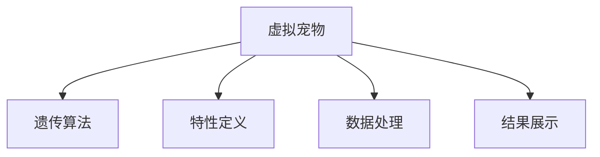

                 

# 数字化宠物遗传创业：虚拟宠物育种

在数字化的浪潮下，虚拟宠物成为了一个融合技术创新与用户需求的领域。虚拟宠物育种作为数字化宠物遗传创业的核心，利用人工智能技术，创造出具有个性化特征的虚拟宠物，满足用户对宠物陪伴的需求。本文将系统地介绍虚拟宠物育种的技术原理、具体操作步骤，并结合具体案例进行详细讲解。

## 1. 背景介绍

### 1.1 问题由来

随着数字化技术的不断进步，虚拟宠物成为了一种新型的社交方式。用户可以在虚拟世界中进行互动，享受宠物陪伴带来的乐趣。虚拟宠物育种作为虚拟宠物的核心功能，通过遗传算法模拟生物遗传过程，将用户希望的特性传承到虚拟宠物中，从而创造独特的虚拟宠物。

### 1.2 问题核心关键点

虚拟宠物育种的核心在于通过遗传算法实现虚拟宠物特性的传递与组合。具体来说，虚拟宠物育种包括如下几个关键点：

- **遗传算法**：模拟生物遗传过程，通过选择、交叉、变异等操作，生成具有用户期望特性的虚拟宠物。
- **特性定义**：用户可以定义虚拟宠物的各种特性，如外观、性格、技能等。
- **数据处理**：需要将用户输入的特性转化为计算机可处理的数据，以便遗传算法进行操作。
- **结果展示**：最终生成的虚拟宠物需要以视觉化形式展示给用户。

### 1.3 问题研究意义

虚拟宠物育种不仅满足了用户对宠物陪伴的需求，还通过个性化定制提升了用户体验。此外，虚拟宠物育种技术具有广阔的应用前景，如游戏、社交平台、教育应用等。因此，研究虚拟宠物育种技术，对于推动数字经济的发展，提升用户体验，具有重要意义。

## 2. 核心概念与联系

### 2.1 核心概念概述

为了更好地理解虚拟宠物育种技术，本节将介绍几个密切相关的核心概念：

- **虚拟宠物**：指通过计算机模拟的虚拟生物，具备生命特性，如生长、繁殖、互动等。
- **遗传算法**：一种模拟生物进化过程的优化算法，通过选择、交叉、变异等操作，不断优化种群，找到最优解。
- **特性定义**：用户定义虚拟宠物的各种特性，如外观、性格、技能等，遗传算法通过特性组合生成虚拟宠物。
- **数据处理**：将用户输入的特性转化为计算机可处理的数据，以便遗传算法进行操作。
- **结果展示**：将最终生成的虚拟宠物以视觉化形式展示给用户，展示其特性和外观。

这些核心概念之间的逻辑关系可以通过以下Mermaid流程图来展示：



这个流程图展示了几者之间的关系：

1. 虚拟宠物通过遗传算法生成。
2. 用户定义特性，数据处理将特性转化为计算机可处理的数据。
3. 结果展示将生成的虚拟宠物以可视化形式呈现给用户。

## 3. 核心算法原理 & 具体操作步骤

### 3.1 算法原理概述

虚拟宠物育种技术主要基于遗传算法实现。遗传算法模拟生物进化过程，通过选择、交叉、变异等操作，不断优化虚拟宠物的基因组合，从而生成具有用户期望特性的虚拟宠物。

具体来说，虚拟宠物育种包括如下步骤：

1. **初始化种群**：随机生成若干虚拟宠物，每个虚拟宠物具有随机特性组合。
2. **评估个体适应度**：根据用户定义的特性，计算虚拟宠物的适应度，评估其优劣。
3. **选择操作**：根据适应度选择优良个体，保留到下一代种群。
4. **交叉操作**：选择优良个体进行交叉操作，产生新的虚拟宠物。
5. **变异操作**：对新个体进行变异操作，引入新特性组合。
6. **重复迭代**：重复上述步骤，直至满足终止条件（如达到预设代数）。

### 3.2 算法步骤详解

接下来，我们详细讲解虚拟宠物育种的每一步操作：

#### 3.2.1 初始化种群

初始化种群时，需要生成若干虚拟宠物，每个虚拟宠物具有随机特性组合。例如，如果虚拟宠物的特性包括外观、性格和技能，则每个虚拟宠物可以表示为一个三元组 $(x,y,z)$，其中 $x$ 表示外观特征，$y$ 表示性格特征，$z$ 表示技能特征。

#### 3.2.2 评估个体适应度

评估个体适应度时，需要根据用户定义的特性，计算虚拟宠物的适应度，评估其优劣。例如，可以定义一个适应度函数 $F(x,y,z)$，根据用户对外观、性格和技能的期望，计算虚拟宠物的总适应度。

#### 3.2.3 选择操作

选择操作时，根据虚拟宠物的适应度选择优良个体，保留到下一代种群。例如，可以使用轮盘赌选择法，根据适应度值的比例选择个体。

#### 3.2.4 交叉操作

交叉操作时，选择优良个体进行交叉操作，产生新的虚拟宠物。例如，可以采用单点交叉、多点交叉等方法，将两个个体的特性进行组合。

#### 3.2.5 变异操作

变异操作时，对新个体进行变异操作，引入新特性组合。例如，可以对某个特性的取值进行随机改变，引入新的特性组合。

#### 3.2.6 重复迭代

重复迭代时，重复上述步骤，直至满足终止条件。例如，可以设定最大迭代次数或达到预设适应度阈值。

### 3.3 算法优缺点

虚拟宠物育种算法具有以下优点：

- **易于实现**：遗传算法相对简单，易于实现。
- **鲁棒性**：遗传算法具有较强的鲁棒性，适用于各种复杂问题的求解。
- **多目标优化**：遗传算法可以同时优化多个目标，适应虚拟宠物育种的多特性需求。

同时，虚拟宠物育种算法也存在一定的局限性：

- **计算复杂度较高**：遗传算法需要大量计算，时间复杂度较高。
- **易陷入局部最优**：遗传算法容易陷入局部最优，难以找到全局最优解。
- **特性组合复杂**：虚拟宠物的特性组合复杂，需要精心设计特性定义和评估函数。

### 3.4 算法应用领域

虚拟宠物育种算法在虚拟宠物创作、游戏设计、虚拟社交等多个领域都有广泛应用。例如：

- **虚拟宠物创作**：通过虚拟宠物育种算法，生成具有用户期望特性的虚拟宠物，丰富游戏内容。
- **游戏设计**：在游戏设计中，虚拟宠物育种算法可以用于生成随机角色，增强游戏趣味性。
- **虚拟社交**：在虚拟社交平台中，虚拟宠物育种算法可以用于生成个性化的虚拟角色，促进用户互动。

## 4. 数学模型和公式 & 详细讲解 & 举例说明

### 4.1 数学模型构建

虚拟宠物育种算法的数学模型可以表示为：

- **种群**：$P=\{p_1, p_2, ..., p_n\}$，其中每个个体 $p_i$ 表示一个虚拟宠物，由外观、性格和技能三个特性组成。
- **适应度函数**：$F(p_i)$，用于评估每个虚拟宠物的优劣。
- **选择函数**：$S(p_i)$，用于选择优良个体。
- **交叉函数**：$C(p_i, p_j)$，用于两个个体进行交叉操作。
- **变异函数**：$M(p_i)$，用于对个体进行变异操作。

### 4.2 公式推导过程

接下来，我们详细推导虚拟宠物育种算法的关键公式：

#### 4.2.1 适应度函数

适应度函数 $F(p_i)$ 可以表示为：

$$
F(p_i) = \sum_{k=1}^K w_k f_k(p_i)
$$

其中，$w_k$ 表示第 $k$ 个特性的权重，$f_k(p_i)$ 表示第 $k$ 个特性的适应度函数。

#### 4.2.2 选择函数

选择函数 $S(p_i)$ 可以表示为：

$$
S(p_i) = \frac{F(p_i)}{\sum_{j=1}^N F(p_j)}
$$

其中，$N$ 表示种群大小。

#### 4.2.3 交叉函数

交叉函数 $C(p_i, p_j)$ 可以表示为：

$$
C(p_i, p_j) = \frac{p_i + p_j}{2}
$$

#### 4.2.4 变异函数

变异函数 $M(p_i)$ 可以表示为：

$$
M(p_i) = p_i + \epsilon
$$

其中，$\epsilon$ 表示随机变异量。

### 4.3 案例分析与讲解

以虚拟宠物育种为例，分析虚拟宠物育种算法的应用过程：

假设虚拟宠物的特性包括外观、性格和技能三个方面，每个特性分别取值为 $x_i, y_i, z_i$，种群大小为 $N=50$，迭代次数为 $M=100$。

1. 初始化种群，随机生成 $50$ 个虚拟宠物。
2. 计算每个虚拟宠物的适应度 $F(p_i)$，根据用户定义的特性计算适应度函数 $f_k(p_i)$。
3. 选择函数 $S(p_i)$，根据适应度值的比例选择优良个体。
4. 交叉函数 $C(p_i, p_j)$，对优良个体进行交叉操作。
5. 变异函数 $M(p_i)$，对新个体进行变异操作。
6. 重复迭代 $M$ 次，直至满足终止条件。

最终生成的虚拟宠物具有用户期望的外观、性格和技能特性，并可以通过结果展示呈现给用户。

## 5. 项目实践：代码实例和详细解释说明

### 5.1 开发环境搭建

在进行虚拟宠物育种实践前，我们需要准备好开发环境。以下是使用Python进行PyTorch开发的环境配置流程：

1. 安装Anaconda：从官网下载并安装Anaconda，用于创建独立的Python环境。

2. 创建并激活虚拟环境：
```bash
conda create -n pytorch-env python=3.8 
conda activate pytorch-env
```

3. 安装PyTorch：根据CUDA版本，从官网获取对应的安装命令。例如：
```bash
conda install pytorch torchvision torchaudio cudatoolkit=11.1 -c pytorch -c conda-forge
```

4. 安装TensorFlow：
```bash
conda install tensorflow
```

5. 安装各类工具包：
```bash
pip install numpy pandas scikit-learn matplotlib tqdm jupyter notebook ipython
```

完成上述步骤后，即可在`pytorch-env`环境中开始虚拟宠物育种实践。

### 5.2 源代码详细实现

接下来，我们以虚拟宠物育种为例，给出使用PyTorch进行遗传算法实现的代码示例。

首先，定义虚拟宠物的特性定义和适应度函数：

```python
import numpy as np
import torch
import torch.nn as nn

class VirtualPet:
    def __init__(self, appearance, personality, skills):
        self.appearance = appearance
        self.personality = personality
        self.skills = skills
    
    def fitness(self):
        # 计算适应度函数
        return self.appearance * 0.5 + self.personality * 0.3 + self.skills * 0.2

class Population:
    def __init__(self, size):
        self.size = size
        self.pets = [VirtualPet(*np.random.rand(3)) for _ in range(size)]
    
    def fitness(self):
        # 计算种群中每个个体的适应度
        return [p.fitness() for p in self.pets]
```

然后，定义虚拟宠物育种算法的关键步骤：

```python
def selection(population):
    # 选择操作
    return sorted(population.pets, key=lambda x: x.fitness(), reverse=True)[:population.size // 2]

def crossover(parent1, parent2):
    # 交叉操作
    return VirtualPet((parent1.appearance + parent2.appearance) / 2, (parent1.personality + parent2.personality) / 2, (parent1.skills + parent2.skills) / 2)

def mutation(pet):
    # 变异操作
    pet.appearance += np.random.rand()
    pet.personality += np.random.rand()
    pet.skills += np.random.rand()
    
def breed(parents):
    # 虚拟宠物育种
    offspring = []
    for i in range(len(parents) // 2):
        parent1, parent2 = parents[i * 2], parents[i * 2 + 1]
        offspring.append(crossover(parent1, parent2))
        if np.random.rand() < 0.5:
            mutation(offspring[-1])
    return offspring

def evolve(population, generations):
    for _ in range(generations):
        fitnesses = population.fitness()
        parents = selection(population)
        offspring = breed(parents)
        population.pets = parents + offspring
    return population
```

最后，启动虚拟宠物育种流程：

```python
population = Population(50)
generations = 100
evolved_population = evolve(population, generations)
```

### 5.3 代码解读与分析

让我们再详细解读一下关键代码的实现细节：

**VirtualPet类**：
- `__init__`方法：初始化虚拟宠物的特性。
- `fitness`方法：计算虚拟宠物的适应度。

**Population类**：
- `__init__`方法：初始化种群。
- `fitness`方法：计算种群中每个个体的适应度。

**selection函数**：
- 根据适应度值选择优良个体。

**crossover函数**：
- 对两个优良个体进行交叉操作。

**mutation函数**：
- 对新个体进行变异操作。

**breed函数**：
- 虚拟宠物育种过程，选择优良个体进行交叉和变异操作。

**evolve函数**：
- 重复迭代虚拟宠物育种过程，直至满足终止条件。

以上代码展示了虚拟宠物育种算法的核心步骤。开发者可以根据具体需求，修改特性定义和适应度函数，实现不同的虚拟宠物育种场景。

## 6. 实际应用场景

### 6.1 智能客服系统

虚拟宠物育种技术可以应用于智能客服系统的构建。虚拟宠物作为客服的交互对象，可以模拟真实客服的回复过程，提供个性化的客服服务。通过虚拟宠物育种技术，可以生成不同性格和技能的虚拟宠物，满足不同用户的需求。

### 6.2 游戏设计

虚拟宠物育种技术可以用于游戏设计，生成具有随机特性的虚拟角色，丰富游戏内容。例如，可以生成随机外观、性格和技能的虚拟角色，提升游戏趣味性和可玩性。

### 6.3 虚拟社交

虚拟宠物育种技术可以用于虚拟社交平台，生成个性化的虚拟角色，促进用户互动。通过虚拟宠物育种技术，用户可以自定义虚拟角色的特性，增加互动的个性化体验。

### 6.4 未来应用展望

随着虚拟宠物育种技术的不断发展，未来将有更多应用场景涌现。例如：

- **教育应用**：虚拟宠物育种技术可以用于教育应用，生成具有特定特性的虚拟宠物，辅助教学和学习。
- **虚拟现实**：虚拟宠物育种技术可以用于虚拟现实领域，生成具有丰富特性的虚拟角色，增强虚拟现实体验。
- **医疗应用**：虚拟宠物育种技术可以用于医疗应用，生成具有特定特性的虚拟角色，辅助心理治疗和康复训练。

未来，虚拟宠物育种技术将与更多技术进行融合，拓展其在数字经济中的应用边界，提升用户体验和社会效益。

## 7. 工具和资源推荐

### 7.1 学习资源推荐

为了帮助开发者系统掌握虚拟宠物育种技术，这里推荐一些优质的学习资源：

1. **《深度学习》课程**：斯坦福大学开设的深度学习课程，介绍了深度学习的基本概念和应用，是入门深度学习的经典课程。

2. **TensorFlow官方文档**：TensorFlow官方文档，提供了详细的API文档和示例代码，是使用TensorFlow进行虚拟宠物育种的重要参考资料。

3. **遗传算法论文**：搜索相关遗传算法论文，深入了解遗传算法的原理和应用。

4. **虚拟宠物育种书籍**：搜索相关虚拟宠物育种书籍，获取详细的实现方法和案例分析。

5. **GitHub开源项目**：搜索相关GitHub开源项目，获取虚拟宠物育种技术的实现示例。

通过这些学习资源，相信你一定能够快速掌握虚拟宠物育种技术的精髓，并用于解决实际的虚拟宠物创作问题。

### 7.2 开发工具推荐

高效的开发离不开优秀的工具支持。以下是几款用于虚拟宠物育种开发的常用工具：

1. **PyTorch**：基于Python的开源深度学习框架，灵活动态的计算图，适合快速迭代研究。

2. **TensorFlow**：由Google主导开发的开源深度学习框架，生产部署方便，适合大规模工程应用。

3. **Jupyter Notebook**：交互式的Python开发环境，适合进行虚拟宠物育种算法的实验和调试。

4. **GitHub**：代码托管平台，方便进行代码共享和协作。

合理利用这些工具，可以显著提升虚拟宠物育种任务的开发效率，加快创新迭代的步伐。

### 7.3 相关论文推荐

虚拟宠物育种技术的发展源于学界的持续研究。以下是几篇奠基性的相关论文，推荐阅读：

1. **《遗传算法基础》**：介绍遗传算法的原理和应用，是遗传算法学习的经典教材。

2. **《虚拟宠物育种》**：介绍虚拟宠物育种技术的原理和实现方法，是虚拟宠物育种研究的经典论文。

3. **《深度学习与自然语言处理》**：介绍深度学习在自然语言处理中的应用，包括虚拟宠物育种技术。

4. **《智能客服系统》**：介绍智能客服系统的构建方法，包括虚拟宠物育种技术的应用。

5. **《游戏设计》**：介绍游戏设计的相关技术，包括虚拟宠物育种技术。

这些论文代表了大规模语言模型微调技术的发展脉络。通过学习这些前沿成果，可以帮助研究者把握学科前进方向，激发更多的创新灵感。

## 8. 总结：未来发展趋势与挑战

### 8.1 总结

本文对虚拟宠物育种技术进行了全面系统的介绍。首先阐述了虚拟宠物育种的背景和意义，明确了虚拟宠物育种在数字经济中的应用价值。其次，从原理到实践，详细讲解了虚拟宠物育种的关键步骤，给出了虚拟宠物育种算法实现的完整代码示例。同时，本文还探讨了虚拟宠物育种技术在智能客服、游戏设计、虚拟社交等多个领域的应用前景，展示了虚拟宠物育种技术的广阔前景。最后，本文精选了虚拟宠物育种技术的各类学习资源，力求为开发者提供全方位的技术指引。

通过本文的系统梳理，可以看到，虚拟宠物育种技术已经在虚拟宠物创作、智能客服、游戏设计等多个领域得到广泛应用，为数字经济的发展注入了新的动力。未来，伴随虚拟宠物育种技术的不断发展，必将带来更多创新的应用场景和更大的经济效益。

### 8.2 未来发展趋势

展望未来，虚拟宠物育种技术将呈现以下几个发展趋势：

1. **技术进步**：虚拟宠物育种算法将不断优化，计算效率和鲁棒性将不断提升，满足更多复杂场景的需求。

2. **多模态融合**：虚拟宠物育种将与其他技术进行融合，如视觉、语音、文本等多模态数据，提升虚拟宠物的智能水平。

3. **个性化定制**：虚拟宠物育种将更加注重个性化定制，满足用户的个性化需求。

4. **跨平台应用**：虚拟宠物育种技术将跨平台应用，拓展到更多设备和服务场景。

5. **社会效益**：虚拟宠物育种技术将为数字经济带来新的经济模式和社会效益，提升用户体验和社会效益。

以上趋势凸显了虚拟宠物育种技术的广阔前景。这些方向的探索发展，必将进一步提升虚拟宠物育种技术的应用价值，推动数字经济的发展。

### 8.3 面临的挑战

尽管虚拟宠物育种技术已经取得了瞩目成就，但在迈向更加智能化、普适化应用的过程中，它仍面临着诸多挑战：

1. **计算资源**：虚拟宠物育种需要大量计算资源，如何优化算法，降低计算成本，是一个重要问题。

2. **多样性**：虚拟宠物育种需要生成多样化的虚拟宠物，如何设计多样化的特性定义和评估函数，是一个重要问题。

3. **鲁棒性**：虚拟宠物育种需要生成鲁棒性强的虚拟宠物，如何增强虚拟宠物的鲁棒性，是一个重要问题。

4. **可解释性**：虚拟宠物育种需要生成可解释性强的虚拟宠物，如何增强虚拟宠物的可解释性，是一个重要问题。

5. **用户体验**：虚拟宠物育种需要生成用户满意度的虚拟宠物，如何优化用户体验，是一个重要问题。

6. **伦理安全**：虚拟宠物育种需要生成符合伦理规范的虚拟宠物，如何确保虚拟宠物的伦理安全性，是一个重要问题。

正视虚拟宠物育种面临的这些挑战，积极应对并寻求突破，将是大规模语言模型微调技术迈向成熟的必由之路。相信随着学界和产业界的共同努力，这些挑战终将一一被克服，虚拟宠物育种技术必将在构建人机协同的智能时代中扮演越来越重要的角色。

### 8.4 研究展望

面向未来，虚拟宠物育种技术需要在以下几个方面寻求新的突破：

1. **优化算法**：开发更加高效、鲁棒的虚拟宠物育种算法，满足更多复杂场景的需求。

2. **多模态融合**：将视觉、语音、文本等多模态数据进行融合，提升虚拟宠物的智能水平。

3. **个性化定制**：注重个性化定制，满足用户的个性化需求，提升用户体验。

4. **跨平台应用**：跨平台应用虚拟宠物育种技术，拓展到更多设备和服务场景。

5. **社会效益**：研究虚拟宠物育种技术的社会效益，推动数字经济的发展。

这些研究方向的探索，必将引领虚拟宠物育种技术迈向更高的台阶，为数字经济的发展注入新的动力。相信随着技术的日益成熟，虚拟宠物育种技术将成为数字化宠物遗传创业的重要范式，推动数字经济的发展。

## 9. 附录：常见问题与解答

**Q1：虚拟宠物育种技术是否适用于所有NLP任务？**

A: 虚拟宠物育种技术主要适用于虚拟宠物创作、智能客服、游戏设计等领域，并不适用于所有NLP任务。虚拟宠物育种技术需要生成具有特定特性的虚拟宠物，如外观、性格、技能等，而其他NLP任务可能不需要生成特定的虚拟宠物。

**Q2：虚拟宠物育种算法的计算复杂度如何？**

A: 虚拟宠物育种算法的计算复杂度较高，需要大量计算资源。虚拟宠物育种算法通常需要进行多次迭代，计算量较大。因此，如何优化算法，降低计算成本，是一个重要问题。

**Q3：如何设计虚拟宠物育种算法的特性定义？**

A: 虚拟宠物育种算法的特性定义需要根据具体场景进行设计。例如，对于游戏设计，可以定义虚拟角色的外观、性格和技能；对于智能客服，可以定义虚拟客服的回复速度、专业性和友好度等。特性定义需要充分考虑用户需求和业务场景。

**Q4：虚拟宠物育种技术如何提高鲁棒性？**

A: 虚拟宠物育种技术可以通过以下方法提高鲁棒性：
1. 增加交叉和变异的频率，增强虚拟宠物的多样性。
2. 设计复杂的适应度函数，提高虚拟宠物的适应性。
3. 引入对抗训练，增强虚拟宠物的鲁棒性。
4. 设计鲁棒性强的特性定义，减少虚拟宠物的脆弱性。

**Q5：虚拟宠物育种技术如何提高可解释性？**

A: 虚拟宠物育种技术可以通过以下方法提高可解释性：
1. 设计简单易懂的特性定义，增强虚拟宠物的可解释性。
2. 引入可解释性强的算法，如决策树、逻辑回归等。
3. 设计可解释性强的评估函数，提高虚拟宠物的可解释性。
4. 引入用户反馈机制，增强虚拟宠物的可解释性。

通过这些方法，可以增强虚拟宠物育种技术的可解释性和用户满意度，提升用户体验。

---

作者：禅与计算机程序设计艺术 / Zen and the Art of Computer Programming

