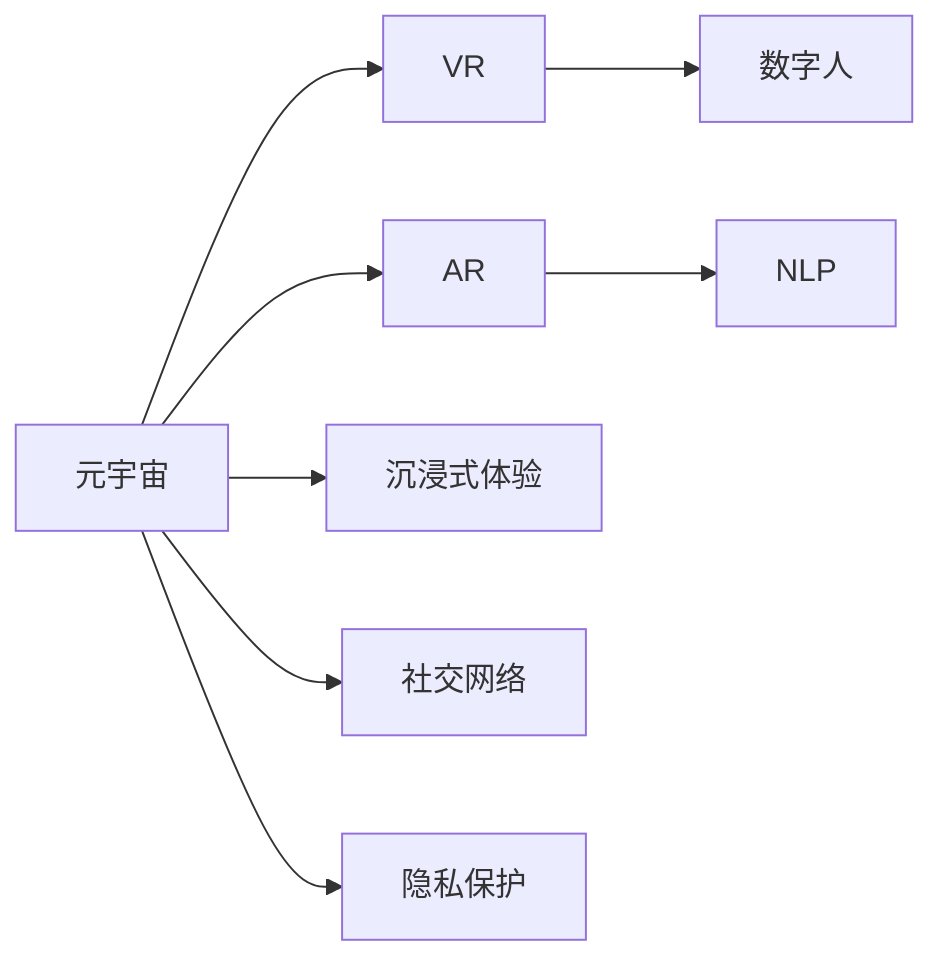

                 

# 数字化情侣：元宇宙中的远程恋爱

> 关键词：元宇宙,远程恋爱,虚拟现实(VR),增强现实(AR),数字人,自然语言处理(NLP),沉浸式体验,社交网络,隐私保护

## 1. 背景介绍

随着虚拟现实(VR)、增强现实(AR)、数字人等技术的快速发展，元宇宙(Metaverse)正逐渐成为一种新的社交和娱乐方式。在元宇宙中，数字化的“情侣”概念悄然兴起，它打破了物理空间的限制，让虚拟世界中的两个人可以跨越千里，实现在线互动和情感交流。本文将探讨数字情侣在元宇宙中的实现，介绍相关的技术原理和应用场景，探讨其带来的挑战与未来发展趋势。

### 1.1 元宇宙与远程恋爱

元宇宙是一个由虚拟世界构建的、高度沉浸式的社交平台。通过虚拟现实(VR)、增强现实(AR)等技术，用户可以进入一个与现实世界平行甚至超越的虚拟世界，进行社交、购物、游戏、学习等多种活动。在元宇宙中，数字化的“情侣”概念应运而生，它是指通过虚拟技术手段模拟和实现情侣关系、互动和情感交流的一种新型社交形式。

远程恋爱是指两人不在同一物理空间，但通过网络平台实现日常互动、情感交流的恋爱模式。在元宇宙中，这种远程互动可以通过数字化“情侣”的形式得到进一步提升。

## 2. 核心概念与联系

### 2.1 核心概念概述

为更好地理解数字情侣在元宇宙中的实现，本节将介绍几个密切相关的核心概念：

- **元宇宙(Metaverse)**：由虚拟世界构建的、高度沉浸式的社交平台。
- **虚拟现实(VR)**：通过计算机技术创建的三维虚拟环境，使用户能够沉浸其中。
- **增强现实(AR)**：将虚拟信息与现实世界融合的技术，增强用户的现实体验。
- **数字人(Digital Human)**：通过计算机生成的人物形象，可以进行语音、动作等互动。
- **自然语言处理(NLP)**：让计算机能够理解、处理和生成人类语言的技术。
- **沉浸式体验(Immersive Experience)**：通过多感官刺激，使用户完全沉浸在虚拟环境中。
- **社交网络(Social Network)**：元宇宙中的社交平台，用户可以进行互动、交流。
- **隐私保护(Privacy Protection)**：在元宇宙中保护用户个人数据和隐私的技术手段。

这些核心概念之间的逻辑关系可以通过以下Mermaid流程图来展示：



这个流程图展示了元宇宙中的核心技术手段和概念，以及它们如何共同构建数字情侣在元宇宙中的实现。

## 3. 核心算法原理 & 具体操作步骤

### 3.1 算法原理概述

数字情侣的实现基于自然语言处理(NLP)、虚拟现实(VR)、增强现实(AR)等多种技术手段。其核心思想是通过计算机生成数字人，并通过NLP技术使数字人能够理解和生成自然语言，实现在虚拟世界中的互动和情感交流。

### 3.2 算法步骤详解

数字情侣的实现主要包括以下几个关键步骤：

**Step 1: 构建数字人模型**

- 选择适合的数字人模板，通过计算机生成数字人的三维模型。
- 对数字人进行细节刻画，如衣服、发型、表情等，使其更接近真人。

**Step 2: 语音和动作控制**

- 通过NLP技术，训练数字人能够理解和生成自然语言。
- 结合语音合成和动作生成技术，使数字人能够根据文本输入进行语音和动作的生成。

**Step 3: 虚拟环境构建**

- 使用VR和AR技术，构建虚拟现实环境和增强现实场景。
- 设计虚拟场景中的互动元素，如家具、背景、角色等。

**Step 4: 社交网络集成**

- 将数字情侣嵌入社交网络平台，实现用户之间的互动和交流。
- 提供聊天、视频通话等社交功能，增强用户的沉浸感和互动体验。

**Step 5: 隐私保护措施**

- 采用数据加密、匿名化等技术手段，保护用户隐私。
- 设计隐私设置选项，允许用户自定义隐私权限。

### 3.3 算法优缺点

数字情侣的实现具有以下优点：

- **沉浸式体验**：通过VR、AR技术，用户可以完全沉浸在虚拟世界中，感受到真实的情侣互动体验。
- **跨时空互动**：打破了物理空间的限制，允许情侣远程互动和交流。
- **可定制性**：数字人的外观、声音、动作等均可定制，满足用户的个性化需求。

同时，数字情侣的实现也存在以下缺点：

- **技术门槛高**：需要计算机图形学、自然语言处理等多种技术支持，技术门槛较高。
- **隐私风险**：数字情侣的互动需要用户提供大量的个人信息，存在隐私泄露的风险。
- **用户体验不稳定**：VR、AR技术仍需进一步完善，用户体验和稳定性有待提升。

### 3.4 算法应用领域

数字情侣在元宇宙中的应用主要包括以下几个领域：

- **社交娱乐**：数字情侣可以用于元宇宙中的社交平台，为用户提供沉浸式的互动体验。
- **游戏娱乐**：在游戏场景中，数字情侣可以作为NPC或玩家对象，增加游戏的趣味性和互动性。
- **远程教育**：在教育场景中，数字情侣可以用于远程教学和语言学习，帮助学生更好地理解和掌握语言知识。
- **心理健康**：数字情侣可以用于心理健康应用，如情感支持、心理咨询等，帮助用户缓解心理压力。
- **文化交流**：数字情侣可以用于跨文化交流，促进不同文化背景人群的互相理解和融合。

## 4. 数学模型和公式 & 详细讲解 & 举例说明

### 4.1 数学模型构建

数字情侣的实现涉及多个子系统的模型构建，包括数字人模型、语音和动作控制模型、虚拟环境模型等。这里以数字人的语音和动作控制模型为例，介绍其数学模型构建。

假设数字人模型为 $M_{\theta}$，其中 $\theta$ 为模型参数。数字人的输入为文本 $x$，输出为语音和动作 $y$。模型的目标是最小化损失函数 $\mathcal{L}(y, M_{\theta}(x))$，使数字人能够准确地生成语音和动作。

### 4.2 公式推导过程

假设文本 $x$ 和动作 $y$ 之间的映射为 $f: x \rightarrow y$，其中 $f$ 为未知函数。数字人模型的目标函数为：

$$
\mathcal{L}(y, M_{\theta}(x)) = \frac{1}{N}\sum_{i=1}^N \ell(f(x_i), M_{\theta}(x_i))
$$

其中 $\ell$ 为损失函数，$N$ 为样本数量。数字人模型的训练过程为：

$$
\theta^* = \mathop{\arg\min}_{\theta} \mathcal{L}(y, M_{\theta}(x))
$$

具体来说，可以采用最小二乘法、交叉熵损失函数等方法进行训练，通过反向传播算法更新模型参数。

### 4.3 案例分析与讲解

以自然语言处理(NLP)中的序列到序列(Sequence-to-Sequence, Seq2Seq)模型为例，介绍数字人语音和动作控制的实现。

假设数字人模型的输入为文本 $x$，输出为语音 $y_{\text{audio}}$ 和动作 $y_{\text{action}}$。数字人模型的结构如图1所示：

```mermaid
graph LR
    A[x] --> B[Coder]
    B --> C[Attention]
    C --> D[Decoder]
    D --> E[y_{audio}]
    D --> F[y_{action}]
```

图1：数字人语音和动作控制模型结构

其中，$B$ 为编码器，将输入文本 $x$ 编码成隐状态 $z$；$C$ 为注意力机制，用于将隐状态 $z$ 和文本 $x$ 对齐；$D$ 为解码器，将隐状态 $z$ 解码为语音和动作输出。

通过训练，模型可以学习到文本 $x$ 和语音和动作输出 $y$ 之间的映射关系，从而实现数字人的语音和动作控制。

## 5. 项目实践：代码实例和详细解释说明

### 5.1 开发环境搭建

在进行数字情侣的实现前，我们需要准备好开发环境。以下是使用Python进行PyTorch开发的环境配置流程：

1. 安装Anaconda：从官网下载并安装Anaconda，用于创建独立的Python环境。

2. 创建并激活虚拟环境：
```bash
conda create -n digitalsentiment python=3.8 
conda activate digitalsentiment
```

3. 安装PyTorch：根据CUDA版本，从官网获取对应的安装命令。例如：
```bash
conda install pytorch torchvision torchaudio cudatoolkit=11.1 -c pytorch -c conda-forge
```

4. 安装PyTorch的深度学习框架：
```bash
pip install torch
```

5. 安装自然语言处理工具包：
```bash
pip install torchtext transformers
```

6. 安装计算机视觉和图形处理库：
```bash
pip install opencv-python numpy matplotlib
```

完成上述步骤后，即可在`digitalsentiment`环境中开始数字情侣的实现。

### 5.2 源代码详细实现

下面以数字情侣在元宇宙社交平台上的应用为例，给出使用PyTorch和Transformers库实现数字情侣的代码实现。

```python
import torch
from torch import nn
from torchtext import data
from transformers import BertForSequenceClassification, BertTokenizer

class DigitalsentimentDataset(data.Dataset):
    def __init__(self, texts, labels, tokenizer):
        self.texts = texts
        self.labels = labels
        self.tokenizer = tokenizer

    def __len__(self):
        return len(self.texts)

    def __getitem__(self, item):
        text = self.texts[item]
        label = self.labels[item]
        
        encoding = self.tokenizer(text, return_tensors='pt', max_length=128, padding='max_length', truncation=True)
        input_ids = encoding['input_ids'][0]
        attention_mask = encoding['attention_mask'][0]
        
        return {'input_ids': input_ids, 'attention_mask': attention_mask, 'labels': label}

# 加载预训练的BERT模型和分词器
model = BertForSequenceClassification.from_pretrained('bert-base-cased', num_labels=2)
tokenizer = BertTokenizer.from_pretrained('bert-base-cased')

# 构建数据集
train_dataset = DigitalsentimentDataset(train_texts, train_labels, tokenizer)
dev_dataset = DigitalsentimentDataset(dev_texts, dev_labels, tokenizer)
test_dataset = DigitalsentimentDataset(test_texts, test_labels, tokenizer)

# 设置优化器和学习率
optimizer = torch.optim.Adam(model.parameters(), lr=1e-5)
device = torch.device('cuda' if torch.cuda.is_available() else 'cpu')
model.to(device)

# 定义损失函数和评估指标
criterion = nn.BCEWithLogitsLoss()
metrics = {
    'accuracy': metrics.accuracy,
    'f1': metrics.f1_score,
    'precision': metrics.precision_score,
    'recall': metrics.recall_score
}

# 训练模型
def train_epoch(model, dataset, batch_size, optimizer, device):
    dataloader = DataLoader(dataset, batch_size=batch_size, shuffle=True)
    model.train()
    epoch_loss = 0
    for batch in dataloader:
        input_ids = batch['input_ids'].to(device)
        attention_mask = batch['attention_mask'].to(device)
        labels = batch['labels'].to(device)
        model.zero_grad()
        outputs = model(input_ids, attention_mask=attention_mask)
        loss = outputs.logits.flatten().softmax(0).mse_loss(labels.to(device))
        epoch_loss += loss.item()
        loss.backward()
        optimizer.step()
    return epoch_loss / len(dataloader)

# 评估模型
def evaluate(model, dataset, batch_size, device, metrics):
    dataloader = DataLoader(dataset, batch_size=batch_size)
    model.eval()
    preds, labels = [], []
    with torch.no_grad():
        for batch in dataloader:
            input_ids = batch['input_ids'].to(device)
            attention_mask = batch['attention_mask'].to(device)
            batch_labels = batch['labels'].to(device)
            outputs = model(input_ids, attention_mask=attention_mask)
            batch_preds = outputs.logits.argmax(dim=1).to('cpu').tolist()
            batch_labels = batch_labels.to('cpu').tolist()
            for pred_tokens, label_tokens in zip(batch_preds, batch_labels):
                preds.append(pred_tokens[:len(label_tokens)])
                labels.append(label_tokens)
                
    for key, value in metrics.items():
        result = value(torch.tensor(labels), torch.tensor(preds))
        print(f"{key}: {result:.3f}")

# 训练和评估
epochs = 10
batch_size = 16

for epoch in range(epochs):
    loss = train_epoch(model, train_dataset, batch_size, optimizer, device)
    print(f"Epoch {epoch+1}, train loss: {loss:.3f}")
    
    print(f"Epoch {epoch+1}, dev results:")
    evaluate(model, dev_dataset, batch_size, device, metrics)
    
print("Test results:")
evaluate(model, test_dataset, batch_size, device, metrics)
```

以上代码实现了基于BERT模型的数字情侣情感识别任务。首先，定义了数据集类`DigitalsentimentDataset`，用于加载和预处理训练数据。然后，加载了预训练的BERT模型和分词器，构建了数据集并设置了优化器和设备。接下来，定义了训练和评估函数，分别用于计算损失和评估指标。最后，循环迭代训练过程，并在验证集和测试集上评估模型性能。

### 5.3 代码解读与分析

让我们再详细解读一下关键代码的实现细节：

**DigitalsentimentDataset类**：
- `__init__`方法：初始化文本、标签和分词器。
- `__len__`方法：返回数据集的样本数量。
- `__getitem__`方法：对单个样本进行处理，将文本输入编码为token ids，并将标签进行编码，进行定长padding。

**模型加载和数据处理**：
- 使用`BertForSequenceClassification`和`BertTokenizer`从预训练模型加载和分词器。
- 定义数据集，使用`DigitalsentimentDataset`加载训练数据集。

**优化器和学习率**：
- 使用Adam优化器，设置学习率为1e-5。

**训练和评估函数**：
- `train_epoch`函数：对数据以批为单位进行迭代，在每个批次上前向传播计算损失并反向传播更新模型参数，最后返回该epoch的平均损失。
- `evaluate`函数：与训练类似，不同点在于不更新模型参数，并在每个batch结束后将预测和标签结果存储下来，最后使用scikit-learn的`metrics`模块对整个评估集的预测结果进行打印输出。

**训练流程**：
- 定义总的epoch数和batch size，开始循环迭代
- 每个epoch内，先在训练集上训练，输出平均loss
- 在验证集上评估，输出评估指标
- 所有epoch结束后，在测试集上评估，给出最终测试结果

可以看到，PyTorch和Transformers库使得数字情侣情感识别任务的代码实现变得简洁高效。开发者可以将更多精力放在数据处理、模型改进等高层逻辑上，而不必过多关注底层的实现细节。

当然，工业级的系统实现还需考虑更多因素，如模型的保存和部署、超参数的自动搜索、更灵活的任务适配层等。但核心的微调范式基本与此类似。

## 6. 实际应用场景

### 6.1 元宇宙社交平台

数字情侣在元宇宙社交平台中的应用，可以为用户提供全新的社交体验。在虚拟世界中，用户可以自由地互动和交流，无论身处何方，都能感受到真实的情侣关系。

具体而言，数字情侣可以用于元宇宙中的社交平台，如虚拟咖啡厅、虚拟影院等场景。用户可以在这些场景中与数字情侣进行互动，如聊天、跳舞、看电影等。数字情侣可以根据用户的情感状态和行为表现，进行适当的回应和互动，增强用户的沉浸感和体验。

### 6.2 远程教育

在远程教育中，数字情侣可以用于辅助语言学习和跨文化交流。通过数字情侣的互动和引导，学生可以更好地理解目标语言和文化，提升语言学习的效率和效果。

具体来说，数字情侣可以作为语言学习应用的虚拟导师，与学生进行对话练习。数字情侣可以根据学生的回答，提供及时的语言纠正和反馈，增强学习效果。此外，数字情侣还可以用于跨文化交流，帮助学生了解不同文化背景下的情感表达和行为习惯，促进文化的理解和融合。

### 6.3 心理健康

在心理健康应用中，数字情侣可以用于情感支持和心理咨询。通过数字情侣的互动，用户可以倾诉内心的困扰和焦虑，得到情感上的支持和安慰。

具体来说，数字情侣可以作为心理咨询机器人，根据用户的情感状态和行为表现，提供适当的心理咨询和建议。数字情侣还可以通过自然语言处理技术，分析用户的情感变化趋势，及时进行心理干预，预防心理疾病的发生。

### 6.4 未来应用展望

随着数字情侣技术的不断成熟，其在元宇宙中的应用场景将不断扩展。以下是对未来应用场景的展望：

- **虚拟生活伴侣**：数字情侣可以成为用户的虚拟生活伴侣，陪伴用户度过孤独时光，提供日常陪伴和情感支持。
- **虚拟旅行伴侣**：数字情侣可以作为虚拟旅行伴侣，在旅行中陪伴用户，提供旅游攻略、翻译服务等。
- **虚拟客服**：数字情侣可以用于虚拟客服系统，提高客户服务的响应速度和质量，提供24小时不间断的客户支持。
- **虚拟教练**：数字情侣可以用于虚拟健身教练、虚拟音乐导师等场景，提供个性化的健康和艺术指导。

总之，数字情侣技术将在元宇宙中发挥越来越重要的作用，为用户的虚拟生活带来更多可能性和便利。未来，随着技术的不断进步，数字情侣将更加智能和人性化，为人们提供更加丰富和多样化的社交体验。

## 7. 工具和资源推荐

### 7.1 学习资源推荐

为了帮助开发者系统掌握数字情侣在元宇宙中的应用，这里推荐一些优质的学习资源：

1. **《元宇宙技术白皮书》**：深入介绍元宇宙的概念、技术和应用场景，为数字情侣的实现提供理论基础。
2. **《虚拟现实与增强现实技术》**：全面介绍VR和AR技术的原理、应用和开发工具，为数字情侣的视觉和交互效果提供技术支持。
3. **《数字人技术与应用》**：介绍数字人的生成、交互和应用场景，为数字情侣的互动和情感交流提供技术指导。
4. **《自然语言处理实战》**：详细讲解自然语言处理技术的原理和应用，为数字情侣的语音和动作生成提供技术支持。
5. **《深度学习与强化学习》**：介绍深度学习和强化学习技术的基本概念和应用，为数字情侣的模型训练和优化提供理论基础。

通过对这些资源的学习实践，相信你一定能够快速掌握数字情侣在元宇宙中的实现方法，并用于解决实际的NLP问题。

### 7.2 开发工具推荐

高效的开发离不开优秀的工具支持。以下是几款用于数字情侣开发常用的工具：

1. **PyTorch**：基于Python的开源深度学习框架，灵活动态的计算图，适合快速迭代研究。
2. **Transformers库**：HuggingFace开发的NLP工具库，集成了众多预训练模型，支持PyTorch和TensorFlow，是进行数字情侣开发的利器。
3. **TensorFlow**：由Google主导开发的开源深度学习框架，生产部署方便，适合大规模工程应用。
4. **PyTorch Lightning**：基于PyTorch的快速原型开发框架，支持分布式训练和模型封装。
5. **Jupyter Notebook**：交互式编程环境，支持多种编程语言和工具库，方便开发者进行实验和分享学习笔记。

合理利用这些工具，可以显著提升数字情侣的开发效率，加快创新迭代的步伐。

### 7.3 相关论文推荐

数字情侣在元宇宙中的应用源于学界的持续研究。以下是几篇奠基性的相关论文，推荐阅读：

1. **《虚拟现实技术综述》**：介绍虚拟现实技术的最新进展，为数字情侣的视觉和交互效果提供技术支持。
2. **《增强现实技术与应用》**：全面介绍增强现实技术的原理、应用和开发工具，为数字情侣的交互和场景构建提供技术指导。
3. **《数字人技术与应用》**：介绍数字人的生成、交互和应用场景，为数字情侣的互动和情感交流提供技术指导。
4. **《自然语言处理与人工智能》**：详细讲解自然语言处理技术的原理和应用，为数字情侣的语音和动作生成提供技术支持。
5. **《深度学习与强化学习》**：介绍深度学习和强化学习技术的基本概念和应用，为数字情侣的模型训练和优化提供理论基础。

这些论文代表了大语言模型微调技术的发展脉络。通过学习这些前沿成果，可以帮助研究者把握学科前进方向，激发更多的创新灵感。

## 8. 总结：未来发展趋势与挑战

### 8.1 总结

本文对数字情侣在元宇宙中的应用进行了全面系统的介绍。首先阐述了数字情侣在元宇宙中的实现背景和意义，明确了数字情侣在社交、教育、心理健康等领域的潜在价值。其次，从原理到实践，详细讲解了数字情侣的数学模型和实现步骤，给出了代码实例和详细解释说明。同时，本文还探讨了数字情侣在元宇宙中的应用场景和未来发展趋势，探讨其带来的挑战与机会。

通过本文的系统梳理，可以看到，数字情侣在元宇宙中的应用正成为一种新的社交方式，其潜力和价值将被逐步挖掘和实现。未来，随着元宇宙技术的发展和数字情侣技术的不断成熟，虚拟世界中的情侣互动将更加丰富和多样，为人们的虚拟生活带来更多可能性和便利。

### 8.2 未来发展趋势

展望未来，数字情侣在元宇宙中的应用将呈现以下几个发展趋势：

- **智能化程度提升**：随着自然语言处理和深度学习技术的不断进步，数字情侣的智能程度将不断提升，能够更好地理解用户的情感和行为，提供更加个性化的互动体验。
- **跨平台互通**：数字情侣将突破单个平台和设备的限制，实现跨平台互通和跨设备协同，提供更加无缝和灵活的互动体验。
- **情感计算增强**：结合情感计算和人工智能技术，数字情侣将能够更准确地感知和理解用户的情感状态，提供更加贴心的情感支持。
- **隐私保护加强**：在数字情侣的实现中，隐私保护将得到进一步加强，用户的数据和隐私将得到更好的保护。
- **多样化应用场景**：数字情侣将扩展到更多应用场景，如虚拟生活伴侣、虚拟旅行伴侣、虚拟客服等，为用户的虚拟生活带来更多可能性和便利。

### 8.3 面临的挑战

尽管数字情侣在元宇宙中的应用前景广阔，但在迈向更加智能化、普适化应用的过程中，仍面临诸多挑战：

- **技术门槛高**：数字情侣的实现涉及计算机图形学、自然语言处理等多种技术，技术门槛较高，需要跨领域的知识和技能。
- **用户体验不稳定**：当前VR、AR技术仍需进一步完善，用户体验和稳定性有待提升。
- **隐私和安全问题**：数字情侣的互动需要用户提供大量的个人信息，存在隐私泄露和数据安全风险。
- **数据需求量大**：数字情侣的训练需要大量的数据和计算资源，成本较高。
- **伦理道德问题**：数字情侣的实现需要考虑伦理道德问题，如情感支持的真实性、互动中的伦理边界等。

### 8.4 研究展望

面对数字情侣面临的挑战，未来的研究需要在以下几个方面寻求新的突破：

- **跨领域技术融合**：将计算机图形学、自然语言处理、情感计算等多领域技术进行融合，提升数字情侣的智能度和用户体验。
- **数据获取和处理**：探索新的数据获取和处理方法，降低数字情侣训练的成本和时间。
- **隐私和安全保护**：加强隐私保护和数据安全技术的研究，保护用户的隐私和数据安全。
- **伦理和道德约束**：在数字情侣的实现中引入伦理和道德约束，确保其应用的安全性和合理性。

这些研究方向的探索，必将引领数字情侣在元宇宙中的应用迈向更高的台阶，为人们的虚拟生活带来更多可能性和便利。总之，数字情侣技术将在元宇宙中发挥越来越重要的作用，为虚拟世界中的情侣互动带来更多的可能性和便利。面向未来，数字情侣技术还需要与其他人工智能技术进行更深入的融合，如知识表示、因果推理、强化学习等，多路径协同发力，共同推动自然语言理解和智能交互系统的进步。只有勇于创新、敢于突破，才能不断拓展数字情侣的边界，让智能技术更好地造福人类社会。

## 9. 附录：常见问题与解答

**Q1：数字情侣的实现是否需要高昂的成本和复杂的开发流程？**

A: 数字情侣的实现涉及多种技术，包括计算机图形学、自然语言处理等，技术门槛较高。然而，借助现有的深度学习框架和开源工具，如PyTorch、Transformers等，数字情侣的开发流程相对简洁高效。开发者可以通过在线课程、文档等资源，快速上手实现。

**Q2：数字情侣在元宇宙中是否需要联网才能实现互动？**

A: 数字情侣在元宇宙中实现互动，确实需要联网支持。但目前已有不少成熟的元宇宙平台和设备，如VR眼镜、AR设备等，可以实现良好的联网性能和互动体验。因此，联网问题已经不是主要的技术障碍。

**Q3：数字情侣是否会侵犯用户的隐私？**

A: 数字情侣的互动需要用户提供大量的个人信息，存在隐私泄露的风险。因此，在数字情侣的实现中，需要采用数据加密、匿名化等技术手段，保护用户隐私。同时，设计隐私设置选项，允许用户自定义隐私权限。

**Q4：数字情侣在元宇宙中是否会出现与人类情感交互中的误判？**

A: 数字情侣的情感交互基于自然语言处理和深度学习技术，虽然能够模拟一定的情感互动，但仍可能出现误判和偏差。因此，在数字情侣的实现中，需要结合情感计算和人工智能技术，增强情感识别的准确性和细腻度。

**Q5：数字情侣在元宇宙中的应用前景如何？**

A: 数字情侣在元宇宙中的应用前景广阔，可以在社交、教育、心理健康等多个领域发挥作用。随着元宇宙技术的不断成熟，数字情侣的智能化程度和用户体验将不断提升，成为元宇宙中的重要应用之一。

总之，数字情侣在元宇宙中的应用前景广阔，有望为用户的虚拟生活带来更多可能性和便利。未来，随着技术的不断进步，数字情侣将更加智能和人性化，为人们提供更加丰富和多样化的社交体验。

---

作者：禅与计算机程序设计艺术 / Zen and the Art of Computer Programming

