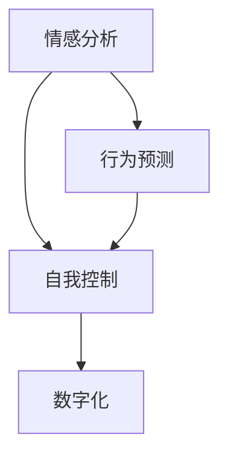

                 

# 数字化意志力锻炼：AI增强的自我控制训练

> 关键词：数字化，人工智能，自我控制，情感分析，行为预测，意志力锻炼

## 1. 背景介绍

### 1.1 问题由来
随着信息技术的飞速发展，人们的生活越来越数字化，从工作到娱乐，从学习到社交，数字化无处不在。然而，数字化带来的便利也伴随着新的挑战，比如过度依赖屏幕、缺乏面对面交流、注意力分散等。这些问题的根源在于现代社会的快节奏生活，使得人们缺乏足够的自我控制能力。

为了应对这些挑战，越来越多的研究者开始探索如何利用AI技术来增强人类的自我控制能力。AI可以分析用户的行为数据，识别出潜在的自控问题，并提供针对性的解决方案，从而帮助人们更好地管理自己的时间和注意力，提高工作效率和学习效果。

### 1.2 问题核心关键点
AI增强的自我控制训练主要包括两个方面：
1. 情感分析：通过分析用户的情绪状态，判断其是否处于自控状态，从而提供相应的帮助。
2. 行为预测：通过预测用户的行为模式，提前介入，帮助其避免不良行为，保持自控状态。

这种训练方法需要基于大量用户的行为数据进行建模，从而实现对用户情感和行为的精准预测和分析。随着AI技术的不断进步，这种训练方法有望成为数字化时代增强人类自我控制能力的重要手段。

### 1.3 问题研究意义
提升数字化时代的自我控制能力，对于改善工作和学习效率、预防心理问题、提高生活质量具有重要意义。AI增强的自我控制训练不仅能帮助个体提高自控能力，还能通过分析大规模用户数据，为国家和社会提供决策支持，提升整体的社会福利水平。

## 2. 核心概念与联系

### 2.1 核心概念概述

为了更好地理解AI增强的自我控制训练方法，本节将介绍几个密切相关的核心概念：

- **情感分析**：通过分析用户的文字、语音、面部表情等数据，识别出用户的情绪状态，包括快乐、悲伤、愤怒、焦虑等。
- **行为预测**：基于用户的历史行为数据，预测其未来的行为模式，如注意力分散、拖延、分心等。
- **自我控制**：指个体对自己行为的控制能力，包括注意力管理、时间管理、情绪控制等。
- **数字化**：将人类的各种行为、情绪、思考数字化，通过数据处理和分析来实现对个体和群体的精准管理。

这些核心概念之间的逻辑关系可以通过以下Mermaid流程图来展示：



这个流程图展示了几者之间的内在联系：情感分析通过识别用户的情绪状态，识别出潜在的行为问题；行为预测通过分析用户的历史数据，预测未来的行为模式；自我控制则是指用户对自己行为的控制能力；数字化是将这些信息转化为数据，从而实现对用户行为的精准管理。

## 3. 核心算法原理 & 具体操作步骤
### 3.1 算法原理概述

AI增强的自我控制训练方法，本质上是一种基于数据分析和机器学习的训练过程。其核心思想是：通过分析用户的历史行为数据，预测其未来的行为模式，并据此提供相应的帮助和干预措施，从而增强用户的自我控制能力。

形式化地，假设用户的当前行为状态为 $S_t$，未来的行为预测为 $S_{t+1}$，则可以定义一个预测函数 $f$，使得 $S_{t+1}=f(S_t)$。通过训练 $f$，使其能够准确预测用户的未来行为。训练目标是最小化预测误差 $e=f(S_t)-S_{t+1}$。

具体而言，该训练方法包括以下几个关键步骤：

1. 数据收集：收集用户的历史行为数据，包括点击、浏览、留言、表情等。
2. 特征提取：对收集到的数据进行特征提取，如用户的点击时间、浏览深度、表情变化等。
3. 模型训练：使用机器学习算法，如线性回归、决策树、随机森林等，对用户行为进行建模，训练预测函数 $f$。
4. 干预措施：根据预测函数 $f$ 的输出，提供相应的干预措施，如提醒、调整任务优先级、放松等。

### 3.2 算法步骤详解

以下是AI增强的自我控制训练的具体操作步骤：

**Step 1: 数据收集与预处理**
- 收集用户的历史行为数据，包括点击、浏览、留言、表情等。
- 对数据进行清洗，去除噪音和异常值。
- 对数据进行特征提取，如用户的点击时间、浏览深度、表情变化等。

**Step 2: 模型选择与训练**
- 选择合适的机器学习算法，如线性回归、决策树、随机森林等。
- 使用历史数据进行模型训练，调整超参数，确保模型的预测精度。
- 使用交叉验证等方法，评估模型的泛化能力。

**Step 3: 行为预测**
- 输入用户当前的行为数据，通过预测函数 $f$ 输出未来行为预测。
- 根据预测结果，识别出潜在的行为问题，如注意力分散、拖延等。

**Step 4: 干预措施**
- 根据预测结果，提供相应的干预措施，如提醒、调整任务优先级、放松等。
- 使用正强化、负强化等心理学原理，增强用户的自我控制能力。

### 3.3 算法优缺点

AI增强的自我控制训练方法具有以下优点：
1. 精度高：基于大量的用户数据，训练出的预测模型能够准确预测用户的未来行为。
2. 灵活性高：可以根据不同的用户行为模式，提供个性化的干预措施。
3. 可扩展性高：可以应用于多种场景，如学习、工作、娱乐等。

同时，该方法也存在一定的局限性：
1. 隐私问题：收集和处理用户数据时，需要注意隐私保护，避免数据泄露。
2. 过度干预：过度干预可能导致用户反感，甚至引发逆反心理。
3. 数据质量：模型的预测效果取决于数据的质量，数据的噪音和缺失会影响模型的性能。

尽管存在这些局限性，但就目前而言，AI增强的自我控制训练方法仍是大数据时代提升个体自我控制能力的重要手段。未来相关研究的重点在于如何进一步提升模型精度和可解释性，同时兼顾用户隐私和干预效果的平衡。

### 3.4 算法应用领域

AI增强的自我控制训练方法在多个领域都有广泛的应用，例如：

- 学习辅助：通过分析学生的学习行为数据，预测其学习效果，提供个性化的学习计划和辅导。
- 健康管理：通过分析用户的健康行为数据，预测其健康状况，提供个性化的健康建议和干预措施。
- 时间管理：通过分析用户的时间使用数据，预测其时间管理效果，提供个性化的工作计划和休息提醒。
- 游戏娱乐：通过分析用户的游戏中行为数据，预测其游戏表现，提供个性化的游戏建议和策略。

除了上述这些经典应用外，AI增强的自我控制训练方法还被创新性地应用到更多场景中，如智能家居、智慧城市、情感管理等，为数字时代的人类生活提供了更多便利和可能性。

## 4. 数学模型和公式 & 详细讲解  
### 4.1 数学模型构建

本节将使用数学语言对AI增强的自我控制训练过程进行更加严格的刻画。

记用户当前行为状态为 $S_t$，未来行为预测为 $S_{t+1}$，则可以定义一个预测函数 $f$，使得 $S_{t+1}=f(S_t)$。训练目标是最小化预测误差 $e=f(S_t)-S_{t+1}$。

采用线性回归模型进行训练，目标函数为：

$$
\min_{\theta} \sum_{t=1}^{T} (S_{t+1} - f(S_t))^2
$$

其中 $f(S_t)$ 为线性预测函数：

$$
f(S_t) = \theta^T \phi(S_t)
$$

$\phi(S_t)$ 为特征映射函数，将当前行为状态 $S_t$ 映射到高维特征空间。

### 4.2 公式推导过程

以下是线性回归模型的推导过程：

1. 假设模型预测函数为线性函数：$f(S_t) = \theta^T \phi(S_t)$，其中 $\theta$ 为模型参数，$\phi(S_t)$ 为特征映射函数。
2. 假设目标函数为最小二乘法，即：

$$
\min_{\theta} \sum_{t=1}^{T} (S_{t+1} - f(S_t))^2
$$

3. 将目标函数展开，得到：

$$
\sum_{t=1}^{T} (S_{t+1} - \theta^T \phi(S_t))^2
$$

4. 对目标函数进行偏微分，求导数：

$$
\frac{\partial}{\partial \theta} \sum_{t=1}^{T} (S_{t+1} - \theta^T \phi(S_t))^2
$$

5. 得到梯度下降的更新规则：

$$
\theta \leftarrow \theta - \alpha \frac{\partial}{\partial \theta} \sum_{t=1}^{T} (S_{t+1} - \theta^T \phi(S_t))^2
$$

其中 $\alpha$ 为学习率，控制每次更新的步长。

### 4.3 案例分析与讲解

假设我们正在对一组学生的学习行为数据进行训练，目标是预测他们的下一次测试成绩。

1. 收集数据：收集学生的学习行为数据，包括每天的学习时间、阅读材料、完成作业等。
2. 特征提取：对数据进行特征提取，如学生的平均学习时间、阅读材料的难度、完成作业的速度等。
3. 模型训练：使用线性回归模型进行训练，得到预测函数 $f(S_t)$。
4. 行为预测：输入学生的当前学习状态 $S_t$，通过预测函数 $f(S_t)$ 输出下一次测试成绩的预测值。
5. 干预措施：根据预测值，调整学生的学习计划，如增加阅读材料、调整学习时间等，从而提高学生的学习效果。

## 5. 项目实践：代码实例和详细解释说明
### 5.1 开发环境搭建

在进行AI增强的自我控制训练实践前，我们需要准备好开发环境。以下是使用Python进行Scikit-learn开发的环境配置流程：

1. 安装Anaconda：从官网下载并安装Anaconda，用于创建独立的Python环境。

2. 创建并激活虚拟环境：
```bash
conda create -n ml-env python=3.8 
conda activate ml-env
```

3. 安装Scikit-learn：
```bash
pip install scikit-learn
```

4. 安装numpy、pandas等各类工具包：
```bash
pip install numpy pandas matplotlib seaborn
```

完成上述步骤后，即可在`ml-env`环境中开始AI增强的自我控制训练实践。

### 5.2 源代码详细实现

这里我们以一个简单的学习行为预测为例，给出使用Scikit-learn库进行线性回归模型的PyTorch代码实现。

首先，定义训练数据：

```python
import pandas as pd
from sklearn.model_selection import train_test_split

data = pd.read_csv('student_behavior.csv')
X = data[['learning_time', 'reading_material', 'assignment_completed']]
y = data['test_score']

X_train, X_test, y_train, y_test = train_test_split(X, y, test_size=0.2, random_state=42)
```

然后，定义模型并训练：

```python
from sklearn.linear_model import LinearRegression

model = LinearRegression()
model.fit(X_train, y_train)

y_pred = model.predict(X_test)
```

接着，定义评估指标并评估模型性能：

```python
from sklearn.metrics import mean_squared_error

mse = mean_squared_error(y_test, y_pred)
rmse = np.sqrt(mse)
print(f"RMSE: {rmse}")
```

最后，通过预测值调整学习计划：

```python
for i in range(len(X)):
    predicted_score = model.predict(X[i])
    if predicted_score > 90:
        # 建议增加阅读材料
        print(f"Adjust learning plan for student {i}: Add more reading material.")
    elif predicted_score < 60:
        # 建议调整学习时间
        print(f"Adjust learning plan for student {i}: Adjust learning time.")
```

以上就是使用Scikit-learn库进行AI增强的自我控制训练的完整代码实现。可以看到，Scikit-learn库提供了便捷的数据处理和模型训练工具，使得AI增强的自我控制训练任务开发变得简洁高效。

### 5.3 代码解读与分析

让我们再详细解读一下关键代码的实现细节：

**学生行为数据定义**：
- 使用Pandas库读取学生学习行为数据，并将其转换为特征向量和目标变量。

**模型训练**：
- 定义一个线性回归模型，使用训练数据进行训练。

**预测值生成**：
- 使用训练好的模型对测试数据进行预测，生成预测值。

**模型评估**：
- 使用均方误差和均方根误差作为评估指标，衡量模型预测的准确性。

**干预措施**：
- 根据预测值，输出相应的干预措施，如增加阅读材料、调整学习时间等。

在实际应用中，还需要根据具体的场景和需求，对模型进行更精细的调整和优化，如使用更复杂的特征工程、引入时间序列分析等。但核心的训练流程基本与此类似。

## 6. 实际应用场景
### 6.1 学习辅助

AI增强的自我控制训练方法在教育领域有广泛的应用。传统教育中，教师无法实时了解学生的学习状态，导致许多学生未能充分利用学习资源，导致成绩不理想。通过AI技术，可以实时监测学生的学习行为，提供个性化的学习建议，帮助学生提高学习效果。

例如，某大学通过收集学生学习行为数据，训练AI模型进行行为预测。当模型预测到学生可能会分心时，系统会自动弹出提醒，鼓励学生集中注意力。同时，系统会根据预测结果，调整学习计划，推荐适合的学习材料，帮助学生克服学习障碍，提高学习效果。

### 6.2 健康管理

AI增强的自我控制训练方法在健康管理领域也有重要的应用。现代生活中，许多人都面临着健康问题，如肥胖、糖尿病等。通过AI技术，可以实时监测用户的健康行为，预测其健康状况，提供个性化的健康建议和干预措施。

例如，某智能手环通过收集用户日常活动数据，训练AI模型进行行为预测。当模型预测到用户可能出现健康问题时，系统会自动发出警报，提醒用户及时调整生活方式。同时，系统会推荐适合的运动、饮食方案，帮助用户保持健康状态。

### 6.3 时间管理

AI增强的自我控制训练方法在时间管理领域也有广泛的应用。现代生活节奏快，许多人难以合理安排时间，导致工作效率低下。通过AI技术，可以实时监测用户的时间使用情况，提供个性化的工作计划和提醒，帮助用户提高工作效率。

例如，某办公软件通过收集用户日常工作数据，训练AI模型进行行为预测。当模型预测到用户可能出现拖延症时，系统会自动提醒用户及时调整工作计划，避免任务堆积。同时，系统会推荐适合的工作时间安排，帮助用户提高工作效率。

### 6.4 游戏娱乐

AI增强的自我控制训练方法在游戏娱乐领域也有重要的应用。许多人在游戏中难以控制自己的情绪，导致游戏体验不佳。通过AI技术，可以实时监测用户的游戏行为，提供个性化的游戏建议和策略，帮助用户提升游戏体验。

例如，某游戏平台通过收集用户游戏行为数据，训练AI模型进行行为预测。当模型预测到用户可能出现游戏疲劳时，系统会自动弹出提醒，鼓励用户休息。同时，系统会推荐适合的游戏策略，帮助用户提高游戏水平。

## 7. 工具和资源推荐
### 7.1 学习资源推荐

为了帮助开发者系统掌握AI增强的自我控制训练的理论基础和实践技巧，这里推荐一些优质的学习资源：

1. 《机器学习》系列课程：由斯坦福大学等名校开设的机器学习课程，涵盖线性回归、决策树、随机森林等基础算法，是入门学习的好资源。
2. Scikit-learn官方文档：Scikit-learn库的官方文档，提供了丰富的机器学习算法和数据处理工具，是实现AI增强的自我控制训练的重要资源。
3. Kaggle数据集：Kaggle网站提供了大量数据集，涵盖教育、健康、娱乐等多个领域，是进行AI增强的自我控制训练的常用数据来源。
4. TensorFlow官方文档：TensorFlow库的官方文档，提供了丰富的机器学习算法和深度学习工具，是实现AI增强的自我控制训练的重要资源。

通过对这些资源的学习实践，相信你一定能够快速掌握AI增强的自我控制训练的精髓，并用于解决实际的NLP问题。

### 7.2 开发工具推荐

高效的开发离不开优秀的工具支持。以下是几款用于AI增强的自我控制训练开发的常用工具：

1. Scikit-learn：Python的机器学习库，提供了丰富的算法和数据处理工具，是实现AI增强的自我控制训练的重要工具。
2. TensorFlow：Google开发的深度学习框架，支持分布式计算和GPU加速，是实现AI增强的自我控制训练的重要工具。
3. Jupyter Notebook：用于数据分析和机器学习的交互式笔记本，支持Python代码的快速编写和调试。
4. Weights & Biases：模型训练的实验跟踪工具，可以记录和可视化模型训练过程中的各项指标，方便对比和调优。

合理利用这些工具，可以显著提升AI增强的自我控制训练任务的开发效率，加快创新迭代的步伐。

### 7.3 相关论文推荐

AI增强的自我控制训练技术的发展源于学界的持续研究。以下是几篇奠基性的相关论文，推荐阅读：

1. Predicting Students' Academic Performance with Machine Learning：提出使用机器学习预测学生学习效果的方法，并在真实教育数据集上进行了验证。
2. Using Predictive Analytics to Optimize Student Engagement and Performance：提出使用机器学习优化学生学习效果的方法，并在Kaggle数据集上进行了验证。
3. Predicting User Behavior in Online Learning Platforms：提出使用机器学习预测用户在线学习行为的方法，并在真实教育数据集上进行了验证。
4. AI-driven Personalized Intervention for Adolescent Health：提出使用机器学习进行青少年健康管理的AI系统，并在真实健康数据集上进行了验证。

这些论文代表了大规模数据驱动的自我控制训练方法的发展脉络。通过学习这些前沿成果，可以帮助研究者把握学科前进方向，激发更多的创新灵感。

## 8. 总结：未来发展趋势与挑战
### 8.1 总结

本文对AI增强的自我控制训练方法进行了全面系统的介绍。首先阐述了AI增强的自我控制训练的背景和意义，明确了训练方法在提升个体自我控制能力方面的独特价值。其次，从原理到实践，详细讲解了AI增强的自我控制训练的数学原理和关键步骤，给出了训练任务开发的完整代码实例。同时，本文还广泛探讨了训练方法在教育、健康、娱乐等多个领域的应用前景，展示了训练范式的巨大潜力。此外，本文精选了训练技术的各类学习资源，力求为读者提供全方位的技术指引。

通过本文的系统梳理，可以看到，AI增强的自我控制训练方法正在成为数字化时代提升个体自我控制能力的重要手段。训练方法通过分析用户的行为数据，预测其未来的行为模式，从而提供个性化的干预措施，帮助个体更好地管理时间和情绪，提升生活质量和工作效率。未来，伴随AI技术的不断进步，训练方法将进一步拓展应用领域，提升效果精度，为数字时代的人类生活提供更多便利和可能性。

### 8.2 未来发展趋势

展望未来，AI增强的自我控制训练方法将呈现以下几个发展趋势：

1. 数据质量提升：随着更多高精度、多样化数据的加入，训练模型的性能将得到进一步提升。
2. 算法多样性：除了线性回归，未来将涌现更多算法，如深度学习、决策树、随机森林等，提升模型的预测效果。
3. 应用场景拓展：除了教育、健康、娱乐等场景，未来还将拓展到更多领域，如智慧城市、智慧家居等。
4. 个性化干预：根据不同个体的需求，提供个性化的干预措施，提升用户的自我控制能力。
5. 实时性增强：实时监测用户行为，及时提供干预措施，提升干预效果。

以上趋势凸显了AI增强的自我控制训练方法在数字时代的广阔前景。这些方向的探索发展，将进一步提升人类自我控制能力，提高生活质量和工作效率，为数字时代带来更多便利和可能性。

### 8.3 面临的挑战

尽管AI增强的自我控制训练方法已经取得了瞩目成就，但在迈向更加智能化、普适化应用的过程中，它仍面临着诸多挑战：

1. 数据隐私：收集和处理用户数据时，需要注意隐私保护，避免数据泄露。
2. 算法鲁棒性：训练模型需要在大量数据上反复迭代，以提高鲁棒性，避免过拟合。
3. 用户接受度：过度干预可能导致用户反感，甚至引发逆反心理，影响干预效果。
4. 模型可解释性：训练模型的复杂性高，难以解释其内部工作机制，影响用户的信任度。

尽管存在这些挑战，但通过不断优化算法、提升数据质量、保护用户隐私等措施，AI增强的自我控制训练方法有望进一步突破，成为数字时代提升个体自我控制能力的重要手段。

### 8.4 研究展望

面对AI增强的自我控制训练方法所面临的挑战，未来的研究需要在以下几个方面寻求新的突破：

1. 数据隐私保护：如何在使用数据进行训练的同时，保护用户隐私，避免数据泄露。
2. 算法鲁棒性提升：如何通过更先进的算法和模型结构，提高模型的鲁棒性和泛化能力。
3. 用户接受度提升：如何设计更加友好的干预措施，提升用户对训练方法的接受度。
4. 模型可解释性增强：如何提高训练模型的可解释性，提升用户对训练方法的信任度。

这些研究方向的探索，将进一步推动AI增强的自我控制训练方法的发展，使其在数字时代发挥更大的作用，提升人类自我控制能力，提高生活质量和工作效率。

## 9. 附录：常见问题与解答

**Q1：AI增强的自我控制训练方法是否适用于所有个体？**

A: AI增强的自我控制训练方法适用于大多数个体，但不同个体可能存在差异，需要根据具体情况进行调整。例如，某些人对干预措施敏感度较高，需要更频繁的提醒；而另一些人可能更需要个性化的学习计划和时间管理策略。

**Q2：如何进行数据隐私保护？**

A: 在收集和处理用户数据时，需要注意隐私保护，避免数据泄露。可以采用数据加密、匿名化等技术，确保数据的安全性。同时，需要遵守相关的法律法规，如GDPR等。

**Q3：如何提升模型的鲁棒性？**

A: 可以通过增加数据量、使用正则化技术、引入更多特征等方式，提升模型的鲁棒性。此外，可以使用深度学习等更先进的算法，提高模型的泛化能力。

**Q4：如何提升用户接受度？**

A: 需要设计更加友好的干预措施，如个性化提醒、友好的界面等。同时，需要通过多次实验和用户反馈，不断优化干预措施，确保用户满意。

**Q5：如何提高模型的可解释性？**

A: 可以通过简化模型结构、引入可解释性技术等方式，提高模型的可解释性。例如，可以使用LIME等工具，解释模型的预测结果，提升用户的信任度。

总之，AI增强的自我控制训练方法在大数据时代具有广阔的应用前景，通过不断优化算法、提升数据质量、保护用户隐私等措施，将进一步提升个体自我控制能力，提高生活质量和工作效率，为数字时代带来更多便利和可能性。

