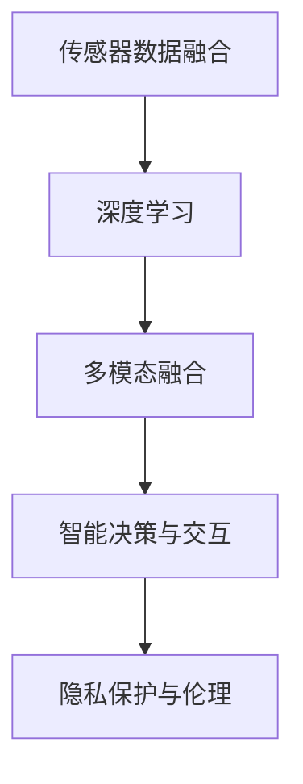

                 

# 数字化感知：AI增强人类感官

## 1. 背景介绍

### 1.1 问题由来

在数字时代的洪流中，人类社会的感知方式发生了根本性的变革。以往依赖于物理感官的方式正在逐渐被数字化感知取代。这种转变不仅改变了我们的生活和工作方式，也为人工智能(AI)技术的应用提供了广阔的天地。特别是近年来，AI技术在增强人类感官方面取得了显著进展，使得我们能够以全新的方式感知和理解世界。

AI增强人类感官的核心在于，利用先进的机器学习和深度学习技术，结合传感器数据和计算能力，扩展人类的视觉、听觉、触觉等感官功能，甚至在某些方面超越自然感知能力。这种增强不仅带来了前所未有的体验，也为人类的认知、决策、创造等方面注入了新的活力。

### 1.2 问题核心关键点

AI增强人类感官的核心关键点在于以下几个方面：

- **传感器数据融合**：将来自不同传感器（如摄像头、麦克风、压力传感器等）的数据进行融合，构建完整的数字化感知环境。
- **深度学习技术**：通过深度学习模型，从大量数据中学习复杂的模式和特征，提升感知精度和效率。
- **智能决策与交互**：基于感知数据，结合强化学习、自然语言处理等技术，实现智能决策和高效的人机交互。
- **多模态融合**：整合视觉、听觉、触觉等多模态数据，提升感知系统的鲁棒性和全面性。
- **隐私保护与伦理**：在增强感官的同时，确保数据隐私和安全，避免滥用和误用。

这些关键点相互交织，共同构建了AI增强人类感官的基础框架，为其在实际应用中提供了理论和技术支持。

## 2. 核心概念与联系

### 2.1 核心概念概述

为了更好地理解AI增强人类感官的原理和应用，本节将介绍几个核心概念：

- **传感器融合**：将来自不同传感器（如摄像头、麦克风、压力传感器等）的数据进行融合，构建完整的数字化感知环境。
- **深度学习**：利用深度神经网络从大量数据中学习复杂的模式和特征，提升感知精度和效率。
- **多模态融合**：整合视觉、听觉、触觉等多模态数据，提升感知系统的鲁棒性和全面性。
- **智能决策与交互**：基于感知数据，结合强化学习、自然语言处理等技术，实现智能决策和高效的人机交互。
- **隐私保护与伦理**：在增强感官的同时，确保数据隐私和安全，避免滥用和误用。

这些核心概念之间的逻辑关系可以通过以下Mermaid流程图来展示：



这个流程图展示了一组概念之间的相互关系：传感器数据融合是基础，深度学习是核心技术，多模态融合增强系统的鲁棒性，智能决策与交互实现高效的人机互动，隐私保护与伦理则是确保技术安全和合理使用的保障。

## 3. 核心算法原理 & 具体操作步骤

### 3.1 算法原理概述

AI增强人类感官的原理可以简单概括为：通过深度学习模型，对传感器数据进行分析和处理，然后结合多模态融合技术，将不同传感器数据融合在一起，构建完整的数字化感知环境。在这个基础上，利用强化学习、自然语言处理等技术，实现智能决策和高效的人机交互，并确保数据隐私和安全。

形式化地，假设传感器数据为 $X$，深度学习模型为 $M$，多模态融合技术为 $F$，智能决策与交互技术为 $I$，隐私保护与伦理技术为 $P$。则整个过程可以表示为：

$$
\hat{Y} = M(X) \\
Y = F(\hat{Y}) \\
Y' = I(Y) \\
Y'' = P(Y')
$$

其中，$\hat{Y}$ 表示通过深度学习模型处理后的数据，$Y$ 表示经过多模态融合后的数据，$Y'$ 表示进行智能决策与交互后的结果，$Y''$ 表示在隐私保护与伦理技术下处理后的结果。

### 3.2 算法步骤详解

AI增强人类感官的算法步骤主要包括以下几个关键步骤：

**Step 1: 传感器数据采集与预处理**

- 选择适合的传感器，采集所需的环境数据。例如，摄像头用于采集图像数据，麦克风用于采集音频数据，压力传感器用于检测物体接触等。
- 对采集到的数据进行预处理，包括去噪、归一化、降噪等操作，提高数据的可用性。

**Step 2: 深度学习模型训练**

- 选择合适的深度学习模型，如卷积神经网络(CNN)、循环神经网络(RNN)、长短时记忆网络(LSTM)等，作为数字化感知的基础。
- 准备训练数据集，使用标签化的数据进行模型训练，优化模型的参数和结构，提高模型的预测准确性。

**Step 3: 多模态数据融合**

- 将来自不同传感器（如视觉、听觉、触觉等）的数据进行融合，构建多模态数据集。
- 利用多模态融合技术，如特征融合、数据关联等，将不同传感器数据进行有效结合，提升感知系统的鲁棒性和全面性。

**Step 4: 智能决策与交互**

- 结合强化学习、自然语言处理等技术，对融合后的数据进行智能分析和决策，例如，语音识别、图像分类、情感分析等。
- 实现高效的人机交互，例如，通过语音助手、智能眼镜等设备，实时获取用户的反馈和指令，提升用户体验。

**Step 5: 隐私保护与伦理**

- 确保数据隐私和安全，例如，使用数据加密、匿名化等技术，防止数据泄露和滥用。
- 遵循伦理准则，例如，尊重用户隐私，避免滥用技术对社会造成负面影响。

### 3.3 算法优缺点

AI增强人类感官的算法具有以下优点：

- **全面性**：通过多模态数据融合，可以全面、准确地感知环境，提高系统的鲁棒性。
- **高效性**：利用深度学习技术，可以高效地处理大量数据，提升感知系统的实时性。
- **智能性**：结合智能决策与交互技术，可以实现高效的人机互动，提升用户体验。

同时，该算法也存在一些局限性：

- **数据依赖**：需要大量的标注数据进行模型训练，数据获取和标注成本较高。
- **技术复杂**：算法涉及多学科知识，实现难度较大，需要跨学科团队协作。
- **伦理挑战**：在增强感官的同时，如何保护数据隐私和避免技术滥用，是一个重要的挑战。

尽管存在这些局限性，但就目前而言，AI增强人类感官的算法仍是大数据时代的重要方向，有望在多个领域带来变革性影响。未来相关研究的重点在于如何进一步降低数据依赖，提高算法的可解释性和可控性，同时兼顾隐私保护和伦理安全性等因素。

### 3.4 算法应用领域

AI增强人类感官的算法已经在多个领域得到应用，例如：

- **医疗健康**：利用深度学习模型分析医学图像，辅助医生进行诊断；利用传感器数据监测患者的生理指标，实现远程医疗。
- **智能家居**：通过传感器数据和智能决策技术，实现自动化控制，提升家居生活的便捷性和舒适性。
- **自动驾驶**：结合视觉、雷达、激光雷达等传感器数据，进行环境感知和决策，提升驾驶安全性。
- **机器人技术**：利用多模态数据融合和智能决策技术，实现机器人的自主导航和交互。
- **虚拟现实(VR)/增强现实(AR)**：通过虚拟场景和传感器数据融合，增强用户体验，实现沉浸式交互。

除了上述这些经典应用外，AI增强人类感官的技术还被创新性地应用于更多场景中，如智能城市、智能安防、智能制造等，为社会治理和经济发展注入了新的动力。随着技术的不断演进，相信AI增强人类感官的应用领域将不断扩展，带来更多的创新和变革。

## 4. 数学模型和公式 & 详细讲解 & 举例说明

### 4.1 数学模型构建

为了更好地理解AI增强人类感官的数学原理，本节将介绍几个关键的数学模型：

- **深度学习模型**：以卷积神经网络(CNN)为例，假设输入数据为 $X$，输出数据为 $Y$，其中 $X$ 为输入的图像数据，$Y$ 为图像的类别标签。则卷积神经网络的目标是最小化损失函数 $L$，即：

$$
L(Y, Y') = \sum_i (Y_i - Y_i')^2
$$

其中 $Y_i'$ 表示网络对输入 $X$ 的预测，$Y_i$ 表示真实的标签。

- **多模态数据融合模型**：以加权融合为例，假设来自不同传感器的数据分别为 $X_1, X_2, ..., X_n$，其权重分别为 $w_1, w_2, ..., w_n$。则加权融合后的数据 $Y$ 可以表示为：

$$
Y = w_1 X_1 + w_2 X_2 + ... + w_n X_n
$$

### 4.2 公式推导过程

以深度学习模型为例，以下推导卷积神经网络的基本结构：

- **卷积层**：假设输入数据为 $X$，输出数据为 $Y$，卷积核为 $K$，卷积核的数量为 $N$，卷积层的大小为 $M$。则卷积操作可以表示为：

$$
Y_{ij} = \sum_k K_{ik} \ast X_{kj}
$$

其中 $\ast$ 表示卷积操作，$K_{ik}$ 为卷积核的第 $i$ 层第 $k$ 个特征的权重，$X_{kj}$ 为输入数据的第 $k$ 个特征在第 $j$ 个位置的值。

- **池化层**：假设输入数据为 $X$，输出数据为 $Y$，池化窗口大小为 $W$。则最大池化操作可以表示为：

$$
Y_{i,j} = \max(X_{i,j*W} \to X_{i,j*W+W-1})
$$

其中 $X_{i,j*W} \to X_{i,j*W+W-1}$ 表示在池化窗口内的所有值中取最大值。

### 4.3 案例分析与讲解

以医疗图像分析为例，利用深度学习模型进行图像分类。假设输入数据为医疗图像 $X$，输出数据为图像的类别标签 $Y$，其中类别标签包括正常、恶性肿瘤、良性肿瘤等。以下是具体的步骤：

1. **数据准备**：收集医疗图像和其对应的标签，划分训练集和测试集。
2. **模型构建**：构建卷积神经网络模型，包括卷积层、池化层、全连接层等。
3. **训练模型**：使用训练集对模型进行训练，优化模型的参数，最小化损失函数。
4. **测试模型**：使用测试集对模型进行测试，评估模型的分类精度。
5. **模型部署**：将训练好的模型部署到实际应用中，实现对医疗图像的分类。

## 5. 项目实践：代码实例和详细解释说明

### 5.1 开发环境搭建

在进行AI增强人类感官的项目实践前，我们需要准备好开发环境。以下是使用Python进行TensorFlow开发的环境配置流程：

1. 安装Anaconda：从官网下载并安装Anaconda，用于创建独立的Python环境。

2. 创建并激活虚拟环境：
```bash
conda create -n tf-env python=3.8 
conda activate tf-env
```

3. 安装TensorFlow：根据CUDA版本，从官网获取对应的安装命令。例如：
```bash
conda install tensorflow -c tf -c conda-forge
```

4. 安装各类工具包：
```bash
pip install numpy pandas scikit-learn matplotlib tqdm jupyter notebook ipython
```

完成上述步骤后，即可在`tf-env`环境中开始项目实践。

### 5.2 源代码详细实现

下面以医疗图像分类为例，给出使用TensorFlow进行深度学习模型训练的PyTorch代码实现。

首先，定义数据处理函数：

```python
import tensorflow as tf
from tensorflow.keras.preprocessing.image import ImageDataGenerator
import numpy as np

def load_data(data_path, batch_size=32):
    train_datagen = ImageDataGenerator(
        rescale=1./255,
        shear_range=0.2,
        zoom_range=0.2,
        horizontal_flip=True)
    test_datagen = ImageDataGenerator(rescale=1./255)
    
    train_generator = train_datagen.flow_from_directory(
        data_path,
        target_size=(224, 224),
        batch_size=batch_size,
        class_mode='categorical')
    
    test_generator = test_datagen.flow_from_directory(
        data_path,
        target_size=(224, 224),
        batch_size=batch_size,
        class_mode='categorical')
    
    return train_generator, test_generator
```

然后，定义模型和优化器：

```python
from tensorflow.keras.applications import VGG16
from tensorflow.keras.layers import Dense, GlobalAveragePooling2D, Flatten

model = VGG16(weights='imagenet', include_top=False, input_shape=(224, 224, 3))
for layer in model.layers:
    layer.trainable = False

x = Flatten()(model.output)
x = GlobalAveragePooling2D()(x)
x = Dense(256, activation='relu')(x)
x = Dense(3, activation='softmax')(x)

model.compile(optimizer='adam', loss='categorical_crossentropy', metrics=['accuracy'])
```

接着，定义训练和评估函数：

```python
from tensorflow.keras.callbacks import EarlyStopping

early_stopping = EarlyStopping(monitor='val_loss', patience=5)

def train_model(model, train_generator, val_generator, epochs=10, batch_size=32):
    model.fit(
        train_generator,
        epochs=epochs,
        steps_per_epoch=len(train_generator),
        validation_data=val_generator,
        validation_steps=len(val_generator),
        callbacks=[early_stopping]
    )
    return model
```

最后，启动训练流程并在测试集上评估：

```python
data_path = 'path/to/data'

train_generator, test_generator = load_data(data_path)
model = train_model(model, train_generator, test_generator)
model.evaluate(test_generator)
```

以上就是使用TensorFlow对医疗图像分类任务进行深度学习模型训练的完整代码实现。可以看到，TensorFlow的高级API使得模型构建和训练过程变得简洁高效。

### 5.3 代码解读与分析

让我们再详细解读一下关键代码的实现细节：

**load_data函数**：
- 使用ImageDataGenerator对数据进行归一化、翻转、缩放等预处理，构建训练集和测试集的生成器。
- 设置批量大小，用于每个epoch的批量处理。

**定义模型和优化器**：
- 使用预训练的VGG16模型，去除全连接层，保留卷积层作为基础特征提取器。
- 添加全连接层进行分类，使用softmax激活函数输出概率分布。
- 编译模型，设置优化器和损失函数，并定义评估指标。

**train_model函数**：
- 设置EarlyStopping回调，用于监控验证集上的损失，防止过拟合。
- 使用fit函数训练模型，指定训练集和验证集的数据生成器，设置epoch数和批量大小。
- 返回训练好的模型，并使用evaluate函数在测试集上评估模型性能。

在实际应用中，开发者可以根据具体任务对模型进行微调和优化，如调整网络结构、学习率、数据增强等。同时，还需要考虑实际应用场景的硬件资源限制，进行模型压缩和优化，确保模型的实时性和稳定性。

## 6. 实际应用场景

### 6.1 医疗健康

在医疗健康领域，AI增强人类感官的应用主要集中在医疗影像分析和远程监测。通过深度学习模型对医学图像进行分类和分析，可以帮助医生更准确地诊断疾病，提高诊疗效率。

例如，利用卷积神经网络对X光片进行自动诊断，可以识别出异常的骨骼结构和病变部位。利用传感器数据监测患者的生理指标，可以实时记录和分析患者的健康状况，实现远程医疗和个性化治疗。

### 6.2 智能家居

在智能家居领域，AI增强人类感官的应用主要集中在自动化控制和环境监测。通过传感器数据和智能决策技术，可以实现家居设备的智能控制，提升用户的生活质量和舒适度。

例如，利用摄像头和传感器数据检测家庭环境中的异常情况，如烟雾、火灾、漏水等，及时通知用户或采取相应措施。利用语音助手进行人机交互，实现语音控制家电、查询天气等操作。

### 6.3 自动驾驶

在自动驾驶领域，AI增强人类感官的应用主要集中在环境感知和决策。通过多模态数据融合和智能决策技术，可以实现车辆对环境的全面感知和高效决策。

例如，利用摄像头、雷达、激光雷达等传感器数据进行环境感知，结合深度学习模型进行图像和物体检测，实现车辆周围环境的实时感知。利用智能决策技术，结合道路规则和实时交通情况，进行路径规划和驾驶决策。

### 6.4 未来应用展望

随着AI技术的不断进步，AI增强人类感官的应用领域将进一步扩展，带来更多创新和变革。

在智慧城市治理中，AI增强人类感官的应用主要集中在智能交通、环境监测、公共安全等方面。通过传感器数据和智能决策技术，可以实现城市交通的智能管理、环境污染的实时监测、公共安全的实时预警。

在智能制造中，AI增强人类感官的应用主要集中在设备监控、质量控制、预测维护等方面。通过传感器数据和智能决策技术，可以实现设备的实时监控和故障预测，提高生产效率和产品质量。

此外，在教育、农业、金融等领域，AI增强人类感官的应用也将不断涌现，为各行各业带来新的发展机遇。

## 7. 工具和资源推荐

### 7.1 学习资源推荐

为了帮助开发者系统掌握AI增强人类感官的理论基础和实践技巧，这里推荐一些优质的学习资源：

1. **《深度学习》系列书籍**：由深度学习领域的专家撰写，全面介绍了深度学习的基本概念和应用，适合初学者入门。
2. **CS231n《计算机视觉：卷积神经网络》课程**：斯坦福大学开设的计算机视觉明星课程，涵盖深度学习在图像处理中的应用。
3. **《机器学习实战》书籍**：通过大量实践项目，帮助读者理解和掌握机器学习的基本算法和应用。
4. **Google AI 博客**：提供最新的AI技术和应用案例，涵盖深度学习、计算机视觉、自然语言处理等多个领域。
5. **ArXiv论文**：最新的AI研究成果，涵盖深度学习、计算机视觉、自然语言处理等多个方向。

通过对这些资源的学习实践，相信你一定能够快速掌握AI增强人类感官的精髓，并用于解决实际的AI应用问题。

### 7.2 开发工具推荐

高效的开发离不开优秀的工具支持。以下是几款用于AI增强人类感官开发的常用工具：

1. **TensorFlow**：由Google主导开发的深度学习框架，生产部署方便，适合大规模工程应用。
2. **PyTorch**：基于Python的开源深度学习框架，灵活便捷，适合快速迭代研究。
3. **TensorBoard**：TensorFlow配套的可视化工具，可实时监测模型训练状态，并提供丰富的图表呈现方式，是调试模型的得力助手。
4. **Weights & Biases**：模型训练的实验跟踪工具，可以记录和可视化模型训练过程中的各项指标，方便对比和调优。
5. **TensorFlow Extended (TFX)**：Google开源的端到端机器学习平台，提供数据标注、模型训练、部署等完整的流程支持。

合理利用这些工具，可以显著提升AI增强人类感官任务的开发效率，加快创新迭代的步伐。

### 7.3 相关论文推荐

AI增强人类感官的发展源于学界的持续研究。以下是几篇奠基性的相关论文，推荐阅读：

1. **《深度学习》系列论文**：由深度学习领域的专家撰写，涵盖了深度学习在各个领域的应用，是研究AI增强人类感官的重要参考资料。
2. **《计算机视觉：卷积神经网络》论文**：介绍深度学习在图像处理中的应用，详细讲解了卷积神经网络的结构和应用。
3. **《多模态深度学习》论文**：研究多模态数据融合和深度学习模型的应用，探索如何提高感知系统的全面性和鲁棒性。
4. **《强化学习》论文**：介绍强化学习的基本概念和应用，探索如何通过智能决策和交互提升用户体验。
5. **《隐私保护》论文**：研究数据隐私和安全的保护方法，探讨如何在增强感官的同时保护用户隐私。

这些论文代表了大规模数据感知技术的发展脉络。通过学习这些前沿成果，可以帮助研究者把握学科前进方向，激发更多的创新灵感。

## 8. 总结：未来发展趋势与挑战

### 8.1 研究成果总结

AI增强人类感官技术在医疗健康、智能家居、自动驾驶等众多领域已展现出巨大潜力。通过深度学习、多模态融合、智能决策与交互等技术，极大地提升了人类感官的感知能力，带来了前所未有的体验。

### 8.2 未来发展趋势

展望未来，AI增强人类感官技术将呈现以下几个发展趋势：

1. **多模态融合**：整合视觉、听觉、触觉等多模态数据，提升感知系统的鲁棒性和全面性。
2. **智能决策与交互**：结合强化学习、自然语言处理等技术，实现高效的人机互动，提升用户体验。
3. **隐私保护与伦理**：确保数据隐私和安全，避免滥用和误用，遵循伦理准则。
4. **跨领域应用**：拓展到更多领域，如智慧城市、智能制造、教育等，带来更多的创新和变革。
5. **个性化与自适应**：根据用户需求进行个性化定制，实现动态自适应，提升用户体验。

这些趋势凸显了AI增强人类感官技术的广阔前景，为其在实际应用中提供了更多可能。

### 8.3 面临的挑战

尽管AI增强人类感官技术已经取得了瞩目成就，但在迈向更加智能化、普适化应用的过程中，它仍面临着诸多挑战：

1. **数据依赖**：需要大量的标注数据进行模型训练，数据获取和标注成本较高。
2. **技术复杂**：算法涉及多学科知识，实现难度较大，需要跨学科团队协作。
3. **伦理挑战**：在增强感官的同时，如何保护数据隐私和避免技术滥用，是一个重要的挑战。
4. **性能瓶颈**：在实时性、稳定性、资源占用等方面仍存在性能瓶颈，需要进一步优化。
5. **可解释性**：AI增强人类感官技术的"黑盒"特性，缺乏可解释性，难以进行调试和优化。

尽管存在这些挑战，但通过不断优化算法、提高数据质量、加强跨学科合作，AI增强人类感官技术必将在未来迎来更多的突破和发展。

### 8.4 研究展望

面向未来，AI增强人类感官技术需要在以下几个方面寻求新的突破：

1. **无监督学习**：探索无监督学习和自适应学习方法，降低对标注数据的依赖。
2. **跨模态融合**：研究多模态数据融合和深度学习模型的应用，提高感知系统的全面性和鲁棒性。
3. **隐私保护**：研究数据隐私保护和伦理约束的技术手段，确保数据安全。
4. **跨领域应用**：拓展到更多领域，如智慧城市、智能制造、教育等，带来更多的创新和变革。
5. **可解释性**：研究可解释性技术，增强算法的透明性和可信度。

这些研究方向将引领AI增强人类感官技术的持续发展和应用创新，为人类认知智能的进化带来深远影响。

## 9. 附录：常见问题与解答

**Q1：AI增强人类感官技术是否适用于所有应用场景？**

A: AI增强人类感官技术在医疗健康、智能家居、自动驾驶等众多领域已展现出巨大潜力。但在某些特殊场景，如工业制造、军事领域，由于数据获取和隐私保护的限制，应用难度较大。开发者需要根据具体应用场景进行评估和优化。

**Q2：AI增强人类感官技术的核心是什么？**

A: AI增强人类感官技术的核心在于深度学习、多模态融合、智能决策与交互。通过深度学习模型对传感器数据进行分析和处理，然后利用多模态融合技术将不同传感器数据融合在一起，构建完整的数字化感知环境。最后结合智能决策与交互技术，实现高效的人机互动。

**Q3：AI增强人类感官技术在实际应用中需要注意哪些问题？**

A: 在实际应用中，需要注意以下几个问题：
1. 数据依赖：需要大量的标注数据进行模型训练，数据获取和标注成本较高。
2. 技术复杂：算法涉及多学科知识，实现难度较大，需要跨学科团队协作。
3. 伦理挑战：在增强感官的同时，如何保护数据隐私和避免技术滥用，是一个重要的挑战。
4. 性能瓶颈：在实时性、稳定性、资源占用等方面仍存在性能瓶颈，需要进一步优化。
5. 可解释性：AI增强人类感官技术的"黑盒"特性，缺乏可解释性，难以进行调试和优化。

**Q4：AI增强人类感官技术如何应用于医疗健康？**

A: 在医疗健康领域，AI增强人类感官的应用主要集中在医疗影像分析和远程监测。通过深度学习模型对医学图像进行分类和分析，可以帮助医生更准确地诊断疾病，提高诊疗效率。例如，利用卷积神经网络对X光片进行自动诊断，可以识别出异常的骨骼结构和病变部位。利用传感器数据监测患者的生理指标，可以实时记录和分析患者的健康状况，实现远程医疗和个性化治疗。

通过本文的系统梳理，可以看到，AI增强人类感官技术在多个领域已经取得了显著进展，有望在未来带来更多创新和变革。相信随着技术的不断演进，AI增强人类感官必将在构建人机协同的智能时代中扮演越来越重要的角色。面向未来，AI增强人类感官技术还需要与其他人工智能技术进行更深入的融合，如知识表示、因果推理、强化学习等，多路径协同发力，共同推动自然语言理解和智能交互系统的进步。只有勇于创新、敢于突破，才能不断拓展人类感官的边界，让智能技术更好地造福人类社会。

---

作者：禅与计算机程序设计艺术 / Zen and the Art of Computer Programming

