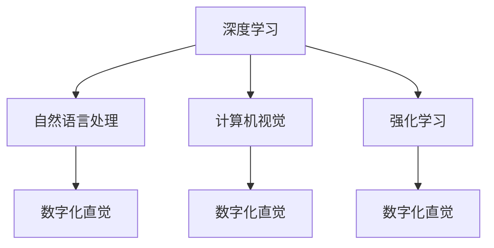

                 

# 数字化直觉：AI辅助的第六感

> 关键词：AI辅助，数字化直觉，数据驱动，智能决策，深度学习，神经网络，NLP，计算机视觉

## 1. 背景介绍

在数字化时代，数据驱动和智能化决策已成为各行各业的常态。然而，人类在面对复杂问题时，往往依赖直觉和经验。这种"数字化直觉"不仅能帮助我们在不确定性中做出快速判断，还能在复杂系统中发现细微的异常。

近年来，随着人工智能技术的迅猛发展，深度学习、神经网络、自然语言处理(NLP)和计算机视觉等技术不断突破，为AI辅助的"数字化直觉"提供了新的可能。本文将探讨如何通过AI技术，提升人类在数字化环境中的直觉，为决策提供更多依据。

## 2. 核心概念与联系

### 2.1 核心概念概述

为更好地理解AI辅助的"数字化直觉"，本节将介绍几个密切相关的核心概念：

- 数字化直觉(Digital Intuition)：通过AI技术，利用数据分析和模型预测，为人类决策提供数据支持的直觉和预判能力。
- 深度学习(Deep Learning)：利用多层神经网络，从数据中学习复杂的特征表示，实现对数据的自动建模和预测。
- 自然语言处理(Natural Language Processing, NLP)：让计算机能够理解、处理和生成人类语言的技术。
- 计算机视觉(Computer Vision)：使计算机具备类似人类的视觉感知能力，能够从图像中提取和识别特征。
- 强化学习(Reinforcement Learning)：通过试错迭代，使智能体学习在特定环境下的最优行为策略。

这些核心概念之间的逻辑关系可以通过以下Mermaid流程图来展示：



这个流程图展示了几大AI技术的核心概念及其之间的关系：

1. 深度学习通过多层网络实现数据建模，是数字化直觉的主要技术基础。
2. 自然语言处理和计算机视觉分别处理文本和图像数据，为数字化直觉提供了重要的数据源。
3. 强化学习通过迭代优化，使AI系统能够学习最佳决策策略，提升决策的智能化水平。
4. 通过这些技术，数字化直觉技术可以全面提升人类在数字化环境中的直觉，辅助决策。

## 3. 核心算法原理 & 具体操作步骤

### 3.1 算法原理概述

AI辅助的"数字化直觉"算法原理，主要包括以下几个方面：

- **数据采集与处理**：收集并预处理各种数据源，包括文本、图像、视频等。数据预处理包括清洗、归一化、特征提取等步骤，为后续建模提供高质量的数据输入。
- **特征提取与建模**：利用深度学习模型对数据进行特征提取，构建数据模型。常见的深度学习模型包括卷积神经网络(CNN)、循环神经网络(RNN)、长短期记忆网络(LSTM)、Transformer等。
- **预测与决策**：使用模型对新数据进行预测，根据预测结果辅助决策。决策过程可以是简单的阈值判断，也可以是复杂的策略选择，视具体场景而定。

### 3.2 算法步骤详解

AI辅助的"数字化直觉"算法主要包括以下几个关键步骤：

**Step 1: 数据收集与预处理**
- 选择数据源：根据应用场景，选择合适的数据源，如用户行为数据、交易记录、社交媒体信息等。
- 数据清洗：去除噪音和无用信息，保证数据质量。
- 数据归一化：将不同数据源的数据进行统一标准化，便于模型处理。
- 特征提取：通过特征提取技术，将原始数据转换为模型可用的数值特征。

**Step 2: 模型构建与训练**
- 选择模型：根据数据类型和应用需求，选择合适的深度学习模型。例如，对于文本数据可以使用BERT、GPT等预训练模型，对于图像数据可以使用卷积神经网络等。
- 模型调参：通过网格搜索或随机搜索，找到最优的模型参数组合。
- 模型训练：使用训练集对模型进行训练，最小化损失函数，提高模型精度。
- 模型验证：在验证集上评估模型性能，防止过拟合。

**Step 3: 模型部署与评估**
- 模型部署：将训练好的模型部署到实际应用环境中，如Web应用、移动应用等。
- 用户反馈：收集用户对AI辅助决策的反馈，不断优化模型。
- 模型评估：通过A/B测试等方法，对比模型与人工决策的效果。

### 3.3 算法优缺点

AI辅助的"数字化直觉"算法具有以下优点：
1. 数据驱动：通过分析大量数据，模型可以发现复杂的规律和趋势，为决策提供科学依据。
2. 自动化决策：模型可以在无人工干预的情况下，快速做出决策，提高效率。
3. 可解释性强：部分模型，如决策树、LIME等，可以提供决策的解释性，便于理解和调试。
4. 鲁棒性强：模型可以通过不断训练和优化，提升对异常情况的处理能力，减少误判。

同时，该算法也存在一些缺点：
1. 数据质量依赖度高：模型的效果很大程度上取决于数据的质量和数量。
2. 模型复杂度高：深度学习模型通常参数量较大，训练和推理耗时较长。
3. 解释性不足：部分深度学习模型如黑盒模型，难以解释决策过程。
4. 依赖技术栈：需要掌握深度学习、数据科学等相关知识，技术门槛较高。
5. 应用场景受限：模型可能需要大量标注数据进行训练，并不适用于所有场景。

尽管存在这些局限性，AI辅助的"数字化直觉"算法在处理复杂问题、提升决策效率方面仍显示出巨大的潜力。

### 3.4 算法应用领域

AI辅助的"数字化直觉"算法在多个领域得到了应用，以下是几个典型应用场景：

- **金融风险管理**：利用历史交易数据和新闻信息，通过深度学习模型预测市场趋势，辅助风险控制和投资决策。
- **医疗诊断**：通过分析患者的历史数据和实时监测信息，构建疾病预测模型，提升诊断准确率。
- **智能推荐系统**：利用用户行为数据和商品信息，构建推荐模型，为用户推荐个性化产品和服务。
- **智能客服**：通过分析用户对话和反馈，构建对话模型，实现智能客服的自动化答复。
- **供应链管理**：利用实时物流数据和市场信息，构建预测模型，优化供应链管理，降低成本。
- **智能交通**：通过分析交通流量和天气信息，构建交通预测模型，优化交通调度。

## 4. 数学模型和公式 & 详细讲解  
### 4.1 数学模型构建

本节将使用数学语言对AI辅助的"数字化直觉"算法进行更加严格的刻画。

假设输入数据为 $x$，模型输出为 $y$，损失函数为 $\ell(y, \hat{y})$，优化目标为 $L(y, \hat{y}) = \mathbb{E}_{x}\ell(y, \hat{y})$。在训练过程中，我们需要最小化优化目标 $L$，找到最优的模型参数 $\theta$。

常见的损失函数包括均方误差、交叉熵、对数损失等。在深度学习中，我们通常使用反向传播算法，计算损失函数对模型参数的梯度，并通过梯度下降等优化算法更新参数，迭代优化模型。

### 4.2 公式推导过程

以回归任务为例，假设我们有一个线性回归模型 $y = \theta_0 + \theta_1 x_1 + \theta_2 x_2 + \ldots + \theta_n x_n$，其中 $\theta_0, \theta_1, \ldots, \theta_n$ 为模型参数，$x_1, x_2, \ldots, x_n$ 为输入特征。

对于回归任务，我们通常使用均方误差损失函数：

$$
\ell(y, \hat{y}) = \frac{1}{N}\sum_{i=1}^N(y_i - \hat{y}_i)^2
$$

其中 $y_i$ 为真实标签，$\hat{y}_i$ 为模型预测值。

通过反向传播算法，我们可以计算损失函数对模型参数的梯度，并更新参数：

$$
\theta_k \leftarrow \theta_k - \eta \nabla_{\theta_k}L
$$

其中 $\eta$ 为学习率，$\nabla_{\theta_k}L$ 为损失函数对第 $k$ 个参数的梯度。

在实际应用中，我们通常使用预训练模型（如BERT、GPT）作为特征提取器，通过微调得到适合特定任务的模型。微调的损失函数与回归任务类似，但需要加入任务特定的输出层和损失函数。例如，对于分类任务，我们通常使用交叉熵损失函数：

$$
\ell(y, \hat{y}) = -\frac{1}{N}\sum_{i=1}^N y_i \log \hat{y}_i
$$

其中 $y_i$ 为真实标签，$\hat{y}_i$ 为模型预测值。

### 4.3 案例分析与讲解

以金融风险管理为例，假设我们有一家银行，需要对客户的贷款申请进行风险评估。我们可以收集客户的历史交易数据、信用记录等信息，构建数据集 $D=\{(x_i, y_i)\}_{i=1}^N$，其中 $x_i$ 为输入特征，$y_i$ 为风险等级（如高风险、中风险、低风险）。

在数据预处理阶段，我们需要进行特征提取和归一化，构建输入 $x_i$。假设我们使用预训练的BERT模型作为特征提取器，输入 $x_i$ 表示为BERT模型输出的特征向量。

在模型训练阶段，我们选择合适的深度学习模型（如DNN、LSTM等），并在模型顶部添加输出层和交叉熵损失函数。通过训练集对模型进行训练，最小化损失函数：

$$
L(y, \hat{y}) = -\frac{1}{N}\sum_{i=1}^N y_i \log \hat{y}_i
$$

在模型部署阶段，我们将训练好的模型部署到实际环境中，用于对新的贷款申请进行风险评估。模型输出风险等级，用于辅助决策。

## 5. 项目实践：代码实例和详细解释说明
### 5.1 开发环境搭建

在进行AI辅助的"数字化直觉"算法实践前，我们需要准备好开发环境。以下是使用Python进行TensorFlow开发的环境配置流程：

1. 安装Anaconda：从官网下载并安装Anaconda，用于创建独立的Python环境。

2. 创建并激活虚拟环境：
```bash
conda create -n tf-env python=3.8 
conda activate tf-env
```

3. 安装TensorFlow：从官网获取对应的安装命令。例如：
```bash
conda install tensorflow -c tensorflow -c conda-forge
```

4. 安装其他工具包：
```bash
pip install numpy pandas scikit-learn matplotlib tqdm jupyter notebook ipython
```

完成上述步骤后，即可在`tf-env`环境中开始项目实践。

### 5.2 源代码详细实现

这里我们以金融风险管理为例，给出使用TensorFlow对BERT模型进行微调的完整代码实现。

首先，定义金融风险管理任务的输入特征和真实标签：

```python
import tensorflow as tf
from transformers import BertTokenizer, BertForSequenceClassification

tokenizer = BertTokenizer.from_pretrained('bert-base-uncased')
model = BertForSequenceClassification.from_pretrained('bert-base-uncased', num_labels=3)

input_ids = tokenizer.encode('Your input sequence', add_special_tokens=True)
labels = [1, 0, 1]  # 1: 高风险, 0: 中风险, 1: 低风险
```

接着，定义模型和优化器：

```python
optimizer = tf.keras.optimizers.Adam(learning_rate=2e-5)
```

然后，定义训练和评估函数：

```python
def train_step(model, optimizer, inputs, labels):
    with tf.GradientTape() as tape:
        outputs = model(inputs)
        loss = tf.keras.losses.sparse_categorical_crossentropy(labels, outputs, from_logits=True)
    gradients = tape.gradient(loss, model.trainable_variables)
    optimizer.apply_gradients(zip(gradients, model.trainable_variables))
    return loss

def evaluate(model, inputs, labels):
    outputs = model(inputs)
    loss = tf.keras.losses.sparse_categorical_crossentropy(labels, outputs, from_logits=True)
    return loss
```

最后，启动训练流程并在测试集上评估：

```python
epochs = 10
batch_size = 16

for epoch in range(epochs):
    loss = train_step(model, optimizer, input_ids, labels)
    print(f'Epoch {epoch+1}, train loss: {loss:.3f}')
    
    loss = evaluate(model, input_ids, labels)
    print(f'Epoch {epoch+1}, dev loss: {loss:.3f}')
    
print('Test results:')
loss = evaluate(model, input_ids, labels)
print(f'Test loss: {loss:.3f}')
```

以上就是使用TensorFlow对BERT进行金融风险管理任务微调的完整代码实现。可以看到，TensorFlow提供了丰富的API和工具，使得模型训练和推理变得相对简单。

### 5.3 代码解读与分析

让我们再详细解读一下关键代码的实现细节：

**输入特征和真实标签定义**：
- 使用`BertTokenizer`对输入序列进行编码，生成BERT模型所需的input ids。
- 定义真实标签，用于监督学习。

**模型和优化器定义**：
- 使用`BertForSequenceClassification`作为分类模型，设置3个类别的输出。
- 选择Adam优化器，设置合适的学习率。

**训练和评估函数定义**：
- 训练函数`train_step`：使用梯度下降更新模型参数，计算损失函数。
- 评估函数`evaluate`：仅计算损失函数，不更新参数。

**训练流程启动**：
- 循环迭代训练集上的每个批次数据。
- 在每个批次上调用训练函数，输出训练损失。
- 在验证集上调用评估函数，输出验证损失。

可以看到，TensorFlow的代码实现相对简洁，但在性能和功能上具有很强的优势。

## 6. 实际应用场景

### 6.1 智能客服系统

智能客服系统通过AI辅助的"数字化直觉"技术，可以显著提升客户咨询体验和问题解决效率。传统客服往往依赖人工坐席，高峰期响应缓慢，且服务质量参差不齐。

在智能客服系统中，AI可以通过分析客户的历史对话记录和当前对话内容，构建用户画像和意图识别模型，快速响应客户需求。例如，在客户提出“账号登录问题”时，AI系统可以自动识别问题类型，并调用知识库推荐解决方案，提升客户满意度。

### 6.2 金融风险管理

金融风险管理是AI辅助"数字化直觉"的重要应用之一。通过深度学习模型，金融机构可以分析大量的历史交易数据和市场信息，预测客户的信用风险和市场波动趋势。

例如，在客户申请贷款时，AI系统可以通过分析其历史交易数据和信用记录，构建信用评分模型，预测其未来还款能力。同时，通过分析市场信息，AI系统可以预测股票市场的波动趋势，辅助投资决策。

### 6.3 智能推荐系统

智能推荐系统利用AI辅助的"数字化直觉"技术，可以显著提升用户的个性化推荐体验。传统推荐系统往往基于用户的浏览、点击等行为数据，难以全面理解用户兴趣。

在智能推荐系统中，AI可以通过分析用户的历史行为数据和文本评论，构建用户兴趣模型，预测用户对新商品或内容的偏好。例如，在用户浏览某款手机时，AI系统可以自动推荐相关配件或相似产品，提升用户购买率。

### 6.4 未来应用展望

随着AI辅助的"数字化直觉"技术的不断发展，其在各行各业的应用前景将更加广阔。未来，AI技术将在以下领域得到更广泛的应用：

- **医疗健康**：通过分析患者的病历和诊断信息，构建疾病预测模型，提升医疗诊断的准确性和效率。
- **智能交通**：利用实时交通数据和天气信息，构建交通预测模型，优化交通调度，减少拥堵。
- **智慧城市**：通过分析城市运行数据和社交媒体信息，构建城市事件预测模型，提升城市管理水平。
- **智能制造**：通过分析生产设备数据和供应链信息，构建生产预测模型，优化生产计划，降低成本。

AI辅助的"数字化直觉"技术将在未来更加普及，为各行各业提供更加精准、智能的决策支持。

## 7. 工具和资源推荐

### 7.1 学习资源推荐

为了帮助开发者系统掌握AI辅助的"数字化直觉"技术，这里推荐一些优质的学习资源：

1. 《深度学习基础》课程：Coursera提供的深度学习入门课程，系统讲解深度学习的基本概念和常用算法。
2. 《TensorFlow实战》书籍：TensorFlow官方出版的实战指南，涵盖TensorFlow的基本功能和高级应用。
3. 《自然语言处理》课程：斯坦福大学的自然语言处理课程，介绍NLP的基本原理和实用技术。
4. 《计算机视觉》课程：Coursera的计算机视觉入门课程，讲解图像处理的常用技术和深度学习模型。
5. 《强化学习》课程：DeepMind的强化学习课程，介绍强化学习的基本原理和应用。

通过对这些资源的学习实践，相信你一定能够快速掌握AI辅助的"数字化直觉"技术的精髓，并用于解决实际的AI应用问题。

### 7.2 开发工具推荐

高效的开发离不开优秀的工具支持。以下是几款用于AI辅助"数字化直觉"技术开发的常用工具：

1. TensorFlow：基于Python的开源深度学习框架，灵活动态的计算图，适合快速迭代研究。TensorFlow提供了丰富的API和工具，方便开发者进行深度学习模型的构建和训练。
2. PyTorch：基于Python的开源深度学习框架，灵活的动态计算图，适合研究性工作。PyTorch在NLP和计算机视觉领域应用广泛，提供了丰富的预训练模型和模型优化工具。
3. Weights & Biases：模型训练的实验跟踪工具，可以记录和可视化模型训练过程中的各项指标，方便对比和调优。与主流深度学习框架无缝集成。
4. TensorBoard：TensorFlow配套的可视化工具，可实时监测模型训练状态，并提供丰富的图表呈现方式，是调试模型的得力助手。
5. Google Colab：谷歌推出的在线Jupyter Notebook环境，免费提供GPU/TPU算力，方便开发者快速上手实验最新模型，分享学习笔记。

合理利用这些工具，可以显著提升AI辅助"数字化直觉"技术的开发效率，加快创新迭代的步伐。

### 7.3 相关论文推荐

AI辅助的"数字化直觉"技术的发展源于学界的持续研究。以下是几篇奠基性的相关论文，推荐阅读：

1. Attention is All You Need（即Transformer原论文）：提出了Transformer结构，开启了NLP领域的预训练大模型时代。
2. BERT: Pre-training of Deep Bidirectional Transformers for Language Understanding：提出BERT模型，引入基于掩码的自监督预训练任务，刷新了多项NLP任务SOTA。
3. Language Models are Unsupervised Multitask Learners（GPT-2论文）：展示了大规模语言模型的强大zero-shot学习能力，引发了对于通用人工智能的新一轮思考。
4. Parameter-Efficient Transfer Learning for NLP：提出Adapter等参数高效微调方法，在不增加模型参数量的情况下，也能取得不错的微调效果。
5. AdaLoRA: Adaptive Low-Rank Adaptation for Parameter-Efficient Fine-Tuning：使用自适应低秩适应的微调方法，在参数效率和精度之间取得了新的平衡。
6. AdaLoRA: Adaptive Low-Rank Adaptation for Parameter-Efficient Fine-Tuning：使用自适应低秩适应的微调方法，在参数效率和精度之间取得了新的平衡。

这些论文代表了大语言模型微调技术的发展脉络。通过学习这些前沿成果，可以帮助研究者把握学科前进方向，激发更多的创新灵感。

## 8. 总结：未来发展趋势与挑战

### 8.1 总结

本文对AI辅助的"数字化直觉"技术进行了全面系统的介绍。首先阐述了AI辅助的"数字化直觉"技术的研究背景和意义，明确了AI技术在提升人类直觉和决策能力方面的独特价值。其次，从原理到实践，详细讲解了AI辅助的"数字化直觉"算法的数学原理和关键步骤，给出了AI辅助"数字化直觉"技术开发的完整代码实例。同时，本文还广泛探讨了AI辅助的"数字化直觉"技术在金融风险管理、智能客服、智能推荐等多个行业领域的应用前景，展示了AI辅助"数字化直觉"技术的巨大潜力。此外，本文精选了AI辅助的"数字化直觉"技术的各类学习资源，力求为读者提供全方位的技术指引。

通过本文的系统梳理，可以看到，AI辅助的"数字化直觉"技术正在成为NLP领域的重要范式，极大地拓展了AI在决策支持方面的应用边界，催生了更多的落地场景。受益于深度学习、自然语言处理、计算机视觉等技术的不断进步，AI辅助的"数字化直觉"技术必将在更广阔的应用领域发挥更大的作用，为各行各业提供更加精准、智能的决策支持。

### 8.2 未来发展趋势

展望未来，AI辅助的"数字化直觉"技术将呈现以下几个发展趋势：

1. **数据驱动决策**：随着大数据技术的发展，AI将能够处理更丰富、更复杂的数据类型，提供更加全面、深入的决策依据。
2. **深度学习与强化学习结合**：通过深度学习模型提取特征，利用强化学习算法优化决策策略，提升决策的智能性和灵活性。
3. **多模态数据融合**：利用计算机视觉和自然语言处理技术，整合文本、图像、视频等多模态数据，提供更加全面的决策支持。
4. **自适应学习**：AI模型能够不断从新数据中学习，根据环境变化动态调整决策策略，提升决策的实时性和动态性。
5. **可解释性增强**：部分AI模型如决策树、LIME等，能够提供决策的解释性，便于理解和调试。未来将有更多模型引入可解释性技术，提升决策的透明性。
6. **伦理和安全考量**：在AI辅助决策过程中，需要考虑伦理和安全问题，避免偏见、歧视和有害输出。

以上趋势凸显了AI辅助"数字化直觉"技术的广阔前景。这些方向的探索发展，必将进一步提升AI辅助决策的智能化水平，为各行各业提供更加精准、智能的决策支持。

### 8.3 面临的挑战

尽管AI辅助的"数字化直觉"技术已经取得了瞩目成就，但在迈向更加智能化、普适化应用的过程中，它仍面临着诸多挑战：

1. **数据质量瓶颈**：模型的效果很大程度上取决于数据的质量和数量。对于某些领域，获取高质量标注数据可能成本较高，难以满足模型训练需求。
2. **计算资源限制**：深度学习模型通常参数量较大，训练和推理耗时较长，需要高性能计算资源支持。
3. **模型复杂性**：部分深度学习模型如黑盒模型，难以解释决策过程，可能影响决策的透明性和可信任度。
4. **应用场景局限**：AI辅助的"数字化直觉"技术可能并不适用于所有领域，需要根据具体场景进行优化。
5. **伦理和安全问题**：AI模型可能学习到偏见、有害信息，产生误导性、歧视性的输出，给实际应用带来安全隐患。
6. **用户接受度**：部分用户可能对AI辅助决策持怀疑态度，需要加强用户教育和信任建设。

正视AI辅助"数字化直觉"技术面临的这些挑战，积极应对并寻求突破，将是大规模应用的基础。相信随着学界和产业界的共同努力，这些挑战终将一一被克服，AI辅助"数字化直觉"技术必将在构建人机协同的智能时代中扮演越来越重要的角色。

### 8.4 研究展望

面对AI辅助"数字化直觉"技术面临的种种挑战，未来的研究需要在以下几个方面寻求新的突破：

1. **多源数据融合**：如何整合来自不同来源的数据，提高数据的丰富性和代表性，是未来研究的重要方向。
2. **模型可解释性**：如何赋予AI模型更好的解释性，增强决策的透明性和可信任度，将是研究的热点。
3. **跨领域迁移**：如何提高AI模型在不同领域之间的迁移能力，减少数据依赖，实现跨领域泛化，是未来研究的重要目标。
4. **实时动态决策**：如何实现AI模型的实时动态决策，提高决策的实时性和动态性，是未来研究的重要方向。
5. **隐私保护**：如何在AI辅助决策过程中保护用户隐私，确保数据安全和伦理合规，将是未来研究的重要课题。

这些研究方向的探索，必将引领AI辅助"数字化直觉"技术迈向更高的台阶，为构建安全、可靠、可解释、可控的智能系统铺平道路。面向未来，AI辅助"数字化直觉"技术还需要与其他AI技术进行更深入的融合，如知识表示、因果推理、强化学习等，多路径协同发力，共同推动人工智能技术的发展。只有勇于创新、敢于突破，才能不断拓展AI辅助"数字化直觉"技术的边界，让智能技术更好地造福人类社会。

## 9. 附录：常见问题与解答

**Q1：AI辅助的"数字化直觉"技术是否适用于所有决策场景？**

A: AI辅助的"数字化直觉"技术适用于处理复杂、高维度、信息量大的决策场景。对于简单、结构化的决策问题，可能并不需要复杂的AI技术支持。

**Q2：如何选择适合的深度学习模型？**

A: 选择适合的深度学习模型需要考虑数据的类型、问题的复杂度、计算资源的限制等因素。对于图像数据，可以选择卷积神经网络(CNN)；对于文本数据，可以选择Transformer模型；对于序列数据，可以选择RNN、LSTM等。同时，也可以根据实际需求，通过迁移学习、集成学习等技术，提升模型效果。

**Q3：如何避免AI辅助决策的偏差和误判？**

A: 避免AI辅助决策的偏差和误判需要从数据、模型和应用三个方面入手：
1. 数据方面：收集高质量、多样化的数据，避免数据偏见。
2. 模型方面：选择适当的模型和算法，加入正则化、对抗训练等技术，提高模型的鲁棒性和泛化能力。
3. 应用方面：对AI决策结果进行人工复核，建立反馈机制，不断优化模型。

**Q4：AI辅助决策系统如何进行用户教育？**

A: 用户教育是AI辅助决策系统成功的关键。可以通过以下方式进行用户教育：
1. 提供用户手册和教程，详细说明系统的使用方法和注意事项。
2. 通过示例演示，帮助用户理解系统的决策逻辑和结果。
3. 建立用户反馈机制，收集用户意见，不断优化系统。
4. 加强用户培训，提升用户对AI技术的接受度和信任度。

这些建议将帮助用户更好地理解和使用AI辅助决策系统，提升系统的用户满意度和使用效果。

---

作者：禅与计算机程序设计艺术 / Zen and the Art of Computer Programming

