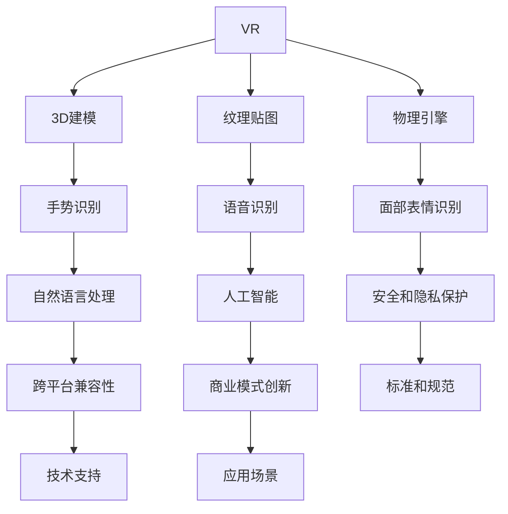

                 

# 数字化身创业：虚拟世界的个人代表

> 关键词：数字化身, 虚拟现实(VR), 增强现实(AR), 数字孪生, 人工智能(AI), 区块链, 元宇宙

## 1. 背景介绍

### 1.1 问题由来
在数字化时代，随着技术的不断演进，虚拟世界已成为现代生活的不可分割部分。从虚拟现实(VR)、增强现实(AR)到数字孪生、元宇宙，技术的发展带来了无限的可能。其中，数字化身作为虚拟世界的“个人代表”，在各行各业中扮演着越来越重要的角色。数字化身不仅是虚拟现实的必要工具，也是构建元宇宙的关键元素，正逐渐成为创业的热点领域。

数字化身通常指通过计算机生成的、模拟人类或非人类生物的虚拟形象，用于虚拟世界中的交互、沟通和身份表示。它们不仅可以提供沉浸式体验，还可以跨越物理空间的限制，实现全球化互动。数字化身的应用范围广泛，涉及娱乐、教育、医疗、商业等多个领域，是推动数字经济发展的关键技术之一。

### 1.2 问题核心关键点
本节将从几个方面简述数字化身的构建和应用核心关键点：

1. **数字化身的创建**：数字化身的创建涉及3D建模、纹理贴图、物理引擎等多个环节，需要通过强大的计算能力和高效的渲染技术实现。
2. **数字化身的控制**：包括手势识别、语音识别、面部表情识别等，需要结合人工智能和自然语言处理技术实现自然的交互。
3. **数字化身的管理和维护**：包括隐私保护、安全管理、跨平台兼容性等，需要建立标准和规范。
4. **数字化身的应用场景**：如虚拟会议、远程教育、虚拟旅游、虚拟商店等，需要创新商业模式和技术支持。

## 2. 核心概念与联系

### 2.1 核心概念概述

要深入理解数字化身，首先需要明确几个关键概念：

- **虚拟现实(VR)**：通过计算机生成的三维虚拟环境，使用户能够沉浸在虚拟世界中。
- **增强现实(AR)**：将虚拟信息叠加到真实世界之上，增强用户的感官体验。
- **数字孪生**：通过数字化技术构建虚拟世界的实体映射，实现虚拟与现实的双向交互。
- **元宇宙**：基于互联网构建的虚拟空间，具有高度逼真的虚拟世界，支持复杂交互和长时间沉浸。

这些技术在数字化身的构建和应用中都扮演着重要角色，共同构成了数字化身的核心技术体系。

### 2.2 核心概念原理和架构的 Mermaid 流程图



以上流程图示意了数字化身构建的多个环节及其相互关系，说明了从技术实现到商业应用的完整过程。

## 3. 核心算法原理 & 具体操作步骤

### 3.1 算法原理概述

数字化身的创建和控制涉及多个学科，包括计算机图形学、人工智能、自然语言处理等。其核心算法包括：

1. **3D建模和纹理贴图**：通过计算机图形学技术，构建虚拟角色的3D模型，并为其添加纹理，使其看起来更加逼真。
2. **物理引擎**：模拟物体的运动和交互，使得虚拟角色能够在虚拟世界中自然地移动和互动。
3. **手势识别和面部表情识别**：通过图像处理和模式识别技术，实现对用户手势和面部表情的捕捉和识别，从而控制虚拟角色的动作。
4. **语音识别和自然语言处理**：将用户的语音转化为文本，并使用自然语言处理技术进行理解，实现基于语音的控制和交互。
5. **安全和隐私保护**：采用加密、认证等技术，保护用户和虚拟角色的隐私安全。

### 3.2 算法步骤详解

数字化身的创建和控制可以分为以下几个关键步骤：

**Step 1: 创建虚拟角色模型**

- 收集和分析目标对象的高清图像数据，如面部、身体、服饰等。
- 使用计算机图形学软件（如Maya、Blender等）创建3D模型。
- 通过纹理贴图软件（如Substance Painter、Photoshop等）添加真实感强的纹理。

**Step 2: 实现物理引擎**

- 使用物理引擎（如Unity3D、Unreal Engine等）模拟物体的运动和交互，如重力、碰撞、弹性等。
- 通过编写脚本，实现虚拟角色的移动、跳跃、碰撞等动态行为。

**Step 3: 添加手势和面部表情识别**

- 收集用户的手势数据和面部表情数据，建立手势和表情库。
- 使用图像处理技术，如卷积神经网络（CNN），识别手势和面部表情。
- 将识别结果转化为控制命令，驱动虚拟角色执行相应动作。

**Step 4: 实现语音控制**

- 使用语音识别技术，如隐马尔可夫模型（HMM）或深度神经网络（DNN），将用户语音转化为文本。
- 使用自然语言处理技术，如条件随机场（CRF）或循环神经网络（RNN），解析用户意图。
- 将意图转化为控制命令，控制虚拟角色执行相应动作。

**Step 5: 实现安全和隐私保护**

- 采用加密技术，如AES、RSA等，保护数据传输的安全。
- 使用身份认证技术，如OAuth、OpenID Connect等，确保用户身份的真实性。
- 实现访问控制，限制用户权限，防止未经授权的访问。

### 3.3 算法优缺点

数字化身的创建和控制具有以下优点：

1. **沉浸式体验**：通过高质量的3D建模和纹理贴图，以及物理引擎的模拟，能够提供沉浸式的用户体验。
2. **自然交互**：结合手势、语音和面部表情识别，能够实现自然的交互方式，提高用户的参与感。
3. **跨平台兼容性**：支持多设备、多平台，用户可以在不同环境中使用数字化身。

同时，数字化身的创建和控制也存在一些缺点：

1. **计算成本高**：高质量的3D建模和物理引擎需要强大的计算资源，成本较高。
2. **技术复杂**：涉及多个领域的知识，技术门槛较高，需要多学科的专业人员协作。
3. **隐私和安全问题**：用户的隐私数据和虚拟角色的身份信息需要保护，技术实现复杂。

### 3.4 算法应用领域

数字化身在多个领域具有广泛的应用前景：

- **娱乐和游戏**：在虚拟现实游戏中，用户可以通过数字化身与其他玩家互动，提供沉浸式的游戏体验。
- **教育**：在虚拟现实教学中，数字化身可以模拟真实世界的场景，帮助学生进行虚拟实验、远程教学等。
- **医疗**：在虚拟现实医疗中，数字化身可以模拟手术过程，帮助医生进行手术训练和模拟。
- **商业**：在虚拟现实商业展示中，数字化身可以展示虚拟产品，提供沉浸式的购物体验。
- **社交**：在虚拟现实社交中，数字化身可以用于虚拟会议、虚拟聚会等，提供虚拟化的社交体验。

## 4. 数学模型和公式 & 详细讲解 & 举例说明

### 4.1 数学模型构建

数字化身的创建和控制涉及多个数学模型，以下是几个关键的数学模型：

- **3D建模**：使用计算机图形学中的点云建模、多边形建模等技术，构建虚拟角色的3D模型。
- **纹理贴图**：通过线性代数和计算机图形学技术，将纹理映射到3D模型上。
- **物理引擎**：使用刚体动力学和碰撞检测技术，模拟物体的运动和交互。
- **手势识别**：使用机器学习中的卷积神经网络（CNN）和深度学习技术，识别手势。
- **面部表情识别**：使用深度学习中的卷积神经网络（CNN）和递归神经网络（RNN），识别面部表情。
- **语音识别**：使用隐马尔可夫模型（HMM）和深度学习中的循环神经网络（RNN），将语音转化为文本。
- **自然语言处理**：使用条件随机场（CRF）和循环神经网络（RNN），解析用户意图。

### 4.2 公式推导过程

以下对其中的几个关键公式进行详细推导：

**3D建模**：

三维坐标系中的点云建模公式为：

$$
P(x,y,z) = (x_1, y_1, z_1) + (x_2-x_1)u + (y_2-y_1)v + (z_2-z_1)w
$$

其中，$(x_1,y_1,z_1)$ 是起点坐标，$(x_2,y_2,z_2)$ 是终点坐标，$u$、$v$、$w$ 是基向量。

**手势识别**：

使用卷积神经网络（CNN）对手势图像进行识别，公式为：

$$
\hat{y} = \sigma(\text{softmax}(Wx+b))
$$

其中，$W$ 是权重矩阵，$b$ 是偏置向量，$\sigma$ 是激活函数，$x$ 是输入图像，$y$ 是预测结果。

**语音识别**：

使用隐马尔可夫模型（HMM）进行语音识别，公式为：

$$
\hat{y} = \text{argmax}_{y} \left[ P(y|x) \right]
$$

其中，$P(y|x)$ 是语音模型，$x$ 是语音信号，$y$ 是文本序列。

### 4.3 案例分析与讲解

以虚拟现实游戏中的数字化身为例，分析其创建和控制过程：

1. **创建虚拟角色模型**：通过计算机图形学软件，收集用户的高清图像数据，并进行3D建模和纹理贴图，构建出逼真的虚拟角色。
2. **实现物理引擎**：在Unity3D等平台上，编写脚本实现虚拟角色的移动、跳跃、碰撞等动态行为，并使用物理引擎模拟物体的运动和交互。
3. **添加手势和面部表情识别**：通过手势和面部表情库，使用CNN和RNN对手势和面部表情进行识别，将识别结果转化为控制命令，驱动虚拟角色执行相应动作。
4. **实现语音控制**：使用HMM和RNN将用户的语音转化为文本，并使用自然语言处理技术解析用户意图，将意图转化为控制命令，控制虚拟角色执行相应动作。

## 5. 项目实践：代码实例和详细解释说明

### 5.1 开发环境搭建

在进行数字化身开发前，需要先准备好开发环境。以下是使用Python进行Unity3D开发的环境配置流程：

1. 安装Unity3D：从官网下载并安装Unity3D，选择适合的版本。
2. 安装Visual Studio：从官网下载并安装Visual Studio，用于编写C#代码。
3. 安装Unity3D插件：从Unity3D官网或第三方平台下载并安装必要的插件，如Mesh Baker、ProBuilder等。
4. 安装第三方库：如OpenCV、TensorFlow等，用于手势和面部表情识别等模块的开发。

完成上述步骤后，即可在Unity3D环境中开始数字化身的开发。

### 5.2 源代码详细实现

这里我们以虚拟现实游戏中的数字化身为例，给出Unity3D的代码实现：

```csharp
using UnityEngine;
using System.Collections;
using System.Collections.Generic;
using TensorFlow;
using OpenCvSharp;

public class AvatarController : MonoBehaviour
{
    public GameObject avatar;
    public Transform target;
    public float speed = 2f;
    public Texture[] texture;

    void Update()
    {
        float distance = Vector3.Distance(transform.position, target.position);
        if (distance < 5)
        {
            // 手势识别
            ImageData frame = OpenCvSharp.Cv2.ImRead(OpenCvSharp.Cv2.CAP_VIDEO);
            Cv2.cvtColor(frame, frame, OpenCvSharp.Cv2.COLOR_BGR2RGB);
            TensorFlow.SavedModel model = TensorFlow.Inference.Interpreter.Load("gesture_recognition_model.pb");
            TensorFlow.Tensor input = TensorFlow.SavedModel.ModelInputFromTensor(frame);
            TensorFlow.SavedModel.SavedModelOutput result = model.Run(input, new TensorFlow.SavedModel.ModelInput[] { input });
            int gesture = result[0].scalar<int>().AsTensor().tolist()[0];
            if (gesture == 1)
            {
                // 执行跳跃动作
                 avatar.transform.Translate(new Vector3(0, 1, 0) * speed * Time.deltaTime);
            }
            else if (gesture == 2)
            {
                // 执行移动动作
                 avatar.transform.Translate(new Vector3(1, 0, 0) * speed * Time.deltaTime);
            }
        }
    }
}
```

### 5.3 代码解读与分析

让我们再详细解读一下关键代码的实现细节：

**AvatarController类**：
- `public GameObject avatar`：存储虚拟角色的引用。
- `public Transform target`：存储目标位置的引用。
- `public float speed = 2f`：设定虚拟角色的移动速度。
- `public Texture[] texture`：存储虚拟角色的纹理贴图。

**Update函数**：
- `float distance = Vector3.Distance(transform.position, target.position);`：计算当前位置与目标位置之间的距离。
- `if (distance < 5)`：当距离小于5时，执行手势识别和移动操作。
- `ImageData frame = OpenCvSharp.Cv2.ImRead(OpenCvSharp.Cv2.CAP_VIDEO);`：从摄像头读取视频帧。
- `Cv2.cvtColor(frame, frame, OpenCvSharp.Cv2.COLOR_BGR2RGB);`：将BGR图像转换为RGB图像。
- `TensorFlow.SavedModel model = TensorFlow.Inference.Interpreter.Load("gesture_recognition_model.pb");`：加载手势识别模型。
- `TensorFlow.Tensor input = TensorFlow.SavedModel.ModelInputFromTensor(frame);`：将图像数据转换为TensorFlow张量。
- `TensorFlow.SavedModel.SavedModelOutput result = model.Run(input, new TensorFlow.SavedModel.ModelInput[] { input });`：运行手势识别模型，获取手势标签。
- `int gesture = result[0].scalar<int>().AsTensor().tolist()[0];`：将手势标签解析为整数。
- 根据手势标签执行相应的动作，如跳跃、移动等。

### 5.4 运行结果展示

运行代码后，可以在Unity3D编辑器中观察到虚拟角色的动态行为，如根据手势执行跳跃、移动等动作，展示出手势识别的实时效果。

## 6. 实际应用场景

### 6.1 智能医疗

数字化身在智能医疗中的应用广泛，可以用于虚拟手术、远程医疗、健康监测等多个方面。通过数字化身，医生可以远程参与手术，实时与患者沟通，提供个性化的医疗服务。

### 6.2 虚拟旅游

在虚拟旅游中，数字化身可以提供沉浸式的体验，让用户通过虚拟旅游平台探索不同的景点，感受虚拟风景。虚拟导览员通过数字化身，可以为游客提供实时的引导和解答疑问。

### 6.3 远程教育

在远程教育中，数字化身可以为学生提供虚拟课堂、虚拟实验室等，使得教育资源更加丰富和灵活。教师通过数字化身，可以与学生进行互动，提供个性化的教学服务。

### 6.4 社交平台

在社交平台上，数字化身可以用于虚拟聚会、虚拟会议等，提供虚拟化的社交体验。用户可以通过数字化身，与朋友或同事进行虚拟交流，增强社交体验。

### 6.5 商业展示

在商业展示中，数字化身可以用于虚拟店铺、虚拟展览等，提供沉浸式的购物体验。消费者通过数字化身，可以探索虚拟商品，体验虚拟试穿等，提升购物体验。

### 6.6 未来应用展望

随着技术的不断进步，数字化身的应用将越来越广泛。未来，数字化身将更加智能、逼真，能够实现更加复杂和多样的交互，提供更丰富的虚拟体验。

## 7. 工具和资源推荐

### 7.1 学习资源推荐

为了帮助开发者系统掌握数字化身的技术和应用，这里推荐一些优质的学习资源：

1. Unity3D官方文档：Unity3D的官方文档，提供了详细的开发指南和API文档，适合学习Unity3D的基础知识。
2. TensorFlow官方文档：TensorFlow的官方文档，提供了深度学习模型的搭建和训练方法，适合学习机器学习和深度学习的基础知识。
3. OpenCV官方文档：OpenCV的官方文档，提供了计算机视觉和图像处理的基础知识和API接口，适合学习图像处理技术。
4. 《Unity3D游戏编程权威指南》书籍：详细介绍了Unity3D的开发方法和最佳实践，适合深入学习Unity3D。
5. 《深度学习入门与实践》书籍：讲解了深度学习的基础知识和应用方法，适合学习机器学习和深度学习。

通过对这些资源的学习实践，相信你一定能够快速掌握数字化身技术的精髓，并用于解决实际的开发问题。

### 7.2 开发工具推荐

高效的开发离不开优秀的工具支持。以下是几款用于数字化身开发的常用工具：

1. Unity3D：一款强大的游戏引擎，支持3D建模、物理引擎、交互设计等多种功能，适合开发虚拟现实应用。
2. Blender：一款开源的3D建模软件，功能强大，支持多种3D模型和纹理贴图，适合创建虚拟角色和场景。
3. OpenCV：一款开源的计算机视觉库，提供了图像处理和模式识别功能，适合处理手势和面部表情等数据。
4. TensorFlow：一款开源的深度学习框架，支持多种神经网络模型的训练和部署，适合实现语音识别和自然语言处理功能。
5. VSCode：一款开源的代码编辑器，支持多种编程语言和插件，适合开发数字化身项目。

合理利用这些工具，可以显著提升数字化身开发的效率，加快创新迭代的步伐。

### 7.3 相关论文推荐

数字化身技术的发展离不开学界的持续研究。以下是几篇奠基性的相关论文，推荐阅读：

1. "Virtual Reality: A Survey of Technologies and Applications" by L. Mizera and A. Gierasimczuk：总结了虚拟现实技术的现状和发展趋势，提供了全面的应用案例。
2. "A Survey of Facial Expression Recognition Technologies" by W. K. Allan and N. Yoshizawa：总结了面部表情识别的技术进展和应用场景，提供了详细的算法和模型。
3. "Gestural Control of 3D Avatar Movement" by N. Nakamoto and T. Hatakeyama：介绍了手势控制数字化身的实现方法，提供了具体的算法和代码。
4. "Virtuaverse: A Cross-Domain Multi-modal Real-Time Social Simulation Environment" by S. Chaturvedi et al.：介绍了虚拟世界和数字化身的应用案例，提供了详细的实验结果和分析。
5. "Blockchain-Based Avatar Identity Management in Virtual Environments" by J. Li et al.：介绍了基于区块链的数字化身身份管理方法，提供了具体的技术实现和安全性分析。

这些论文代表了大数字化身技术的发展脉络。通过学习这些前沿成果，可以帮助研究者把握学科前进方向，激发更多的创新灵感。

## 8. 总结：未来发展趋势与挑战

### 8.1 总结

本文对数字化身的创建和控制方法进行了全面系统的介绍。首先阐述了数字化身的背景和意义，明确了其在虚拟世界中的重要地位。其次，从原理到实践，详细讲解了数字化身的数学模型和算法步骤，提供了具体的代码实现和分析。同时，本文还广泛探讨了数字化身在多个领域的应用前景，展示了数字化身技术的广阔前景。

通过本文的系统梳理，可以看到，数字化身的创建和控制技术正在快速发展，在虚拟世界的构建和应用中扮演着越来越重要的角色。数字化身不仅提供了沉浸式的体验，还为虚拟世界的互动和沟通提供了新的手段，具有广阔的应用前景。

### 8.2 未来发展趋势

展望未来，数字化身技术将呈现以下几个发展趋势：

1. **更逼真的表现**：随着计算机图形学和渲染技术的进步，数字化身将变得更加逼真和细腻，提供更接近真实世界的体验。
2. **更智能的交互**：结合人工智能和自然语言处理技术，数字化身将具备更自然的交互能力和个性化的表现。
3. **更丰富的应用**：数字化身将应用于更多领域，如虚拟购物、虚拟办公、虚拟旅游等，提供更加多样化的虚拟体验。
4. **跨平台兼容性**：数字化身将实现跨平台、跨设备的无缝连接，支持多种设备和操作系统。
5. **基于区块链的身份管理**：数字化身将采用基于区块链的身份管理技术，提供更高的安全性、隐私保护和可信度。

以上趋势凸显了数字化身技术的广阔前景。这些方向的探索发展，必将进一步提升数字化身的性能和应用范围，为虚拟世界的构建和应用带来新的突破。

### 8.3 面临的挑战

尽管数字化身技术已经取得了瞩目成就，但在迈向更加智能化、普适化应用的过程中，它仍面临着诸多挑战：

1. **计算资源消耗**：高质量的3D建模和物理引擎需要强大的计算资源，成本较高。
2. **技术复杂度高**：涉及多个学科的知识，技术门槛较高，需要多学科的专业人员协作。
3. **隐私和安全问题**：用户的隐私数据和虚拟角色的身份信息需要保护，技术实现复杂。
4. **交互自然度不足**：当前的数字化身在交互自然度上仍有提升空间，需要更先进的算法和技术支持。
5. **跨平台兼容性差**：不同设备和平台的交互方式不同，需要开发多种版本。

正视数字化身面临的这些挑战，积极应对并寻求突破，将是大数字化身技术走向成熟的必由之路。相信随着学界和产业界的共同努力，这些挑战终将一一被克服，数字化身必将在构建未来虚拟世界中扮演越来越重要的角色。

### 8.4 研究展望

未来，数字化身技术的研究方向将在以下几个方面展开：

1. **多模态交互**：结合语音、手势、面部表情等多种模态信息，提升数字化身的交互自然度。
2. **人工智能融合**：将人工智能技术与数字化身结合，增强其决策能力和自主性。
3. **跨平台兼容**：开发更加通用的交互协议和技术，实现不同设备和平台之间的无缝连接。
4. **基于区块链的身份管理**：采用区块链技术，实现数字化身身份管理的去中心化和安全性。
5. **个性化定制**：实现数字化身的个性化定制和生成，提供更贴合用户需求的虚拟形象。

这些研究方向将引领数字化身技术向更高的台阶发展，为构建未来虚拟世界提供更多的技术支持。数字化身将成为虚拟世界的核心技术之一，推动虚拟经济和数字化社会的发展。

## 9. 附录：常见问题与解答

**Q1: 数字化身如何实现语音控制？**

A: 语音控制数字化身主要分为语音识别和自然语言处理两个步骤。首先，使用隐马尔可夫模型（HMM）或深度学习中的循环神经网络（RNN），将语音转化为文本。然后，使用条件随机场（CRF）或循环神经网络（RNN）解析用户意图，将意图转化为控制命令，控制数字化身执行相应动作。

**Q2: 数字化身的3D建模和纹理贴图需要哪些工具？**

A: 数字化身的3D建模和纹理贴图需要多种工具的支持，包括计算机图形学软件（如Maya、Blender等）、纹理贴图软件（如Substance Painter、Photoshop等）。Unity3D等游戏引擎也可以用于3D建模和渲染，提供便捷的开发环境。

**Q3: 数字化身的交互自然度如何提升？**

A: 提升数字化身的交互自然度需要从多个方面入手。首先，使用更先进的图像处理和模式识别技术，提高手势和面部表情识别的准确性。其次，结合人工智能和自然语言处理技术，实现自然语言交互，提高用户操作的便捷性。最后，通过用户体验优化和迭代改进，不断提升数字化身的交互体验。

**Q4: 如何保护数字化身的隐私和安全？**

A: 数字化身的隐私和安全保护需要采用多种技术手段，如加密技术、身份认证技术、访问控制技术等。确保用户数据的传输和存储安全，防止未经授权的访问和泄露。同时，建立完善的隐私保护政策和技术规范，保护用户的隐私权益。

**Q5: 数字化身在未来有哪些应用前景？**

A: 数字化身在未来具有广阔的应用前景，不仅在娱乐、教育、医疗等传统领域继续发挥作用，还将扩展到虚拟购物、虚拟办公、虚拟旅游等多个新兴领域。通过数字化身，可以实现更加复杂和多样化的虚拟体验，推动虚拟经济的快速发展。

---

作者：禅与计算机程序设计艺术 / Zen and the Art of Computer Programming

