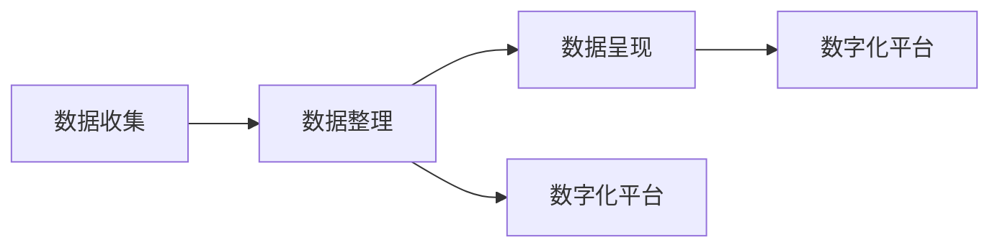

                 

# 数字化遗产时光机创业：家族历史的数字化呈现

在数字化迅猛发展的今天，家族历史的数字化呈现已经成为一种新的趋势。数字化遗产时光机是一个面向家庭用户，将家族历史数字化并呈现的平台。通过数字化技术，将家族中的文字、图片、视频、音频等遗产进行收集、整理、数字化，并为用户提供可视化的呈现。本文将从技术实现、实际应用场景和未来展望等多个角度，深入探讨数字化遗产时光机的创业方向。

## 1. 背景介绍

### 1.1 问题由来

随着数字化技术的不断普及，越来越多的家庭开始关注家族历史的数字化。家族历史是每个家族的重要文化财富，记录了家族的发展历程和记忆，但由于传统保存方式如纸质文件、老旧设备等，这些家族遗产容易在时间流逝中损毁。而数字化技术的应用，让家族历史得到了新的生命，可以长期保存，并方便后代查询和学习。

数字化遗产时光机便是利用这些数字化技术，帮助家庭将家族的各类遗产进行数字化整理和呈现。

### 1.2 问题核心关键点

家族历史数字化呈现的核心在于以下几个方面：
- 数据收集：如何高效收集家族中的各类遗产，如文字、图片、视频、音频等。
- 数据整理：如何将收集到的数据进行分类、归档、索引等整理工作。
- 数据呈现：如何通过技术手段将这些整理好的数据以可视化的方式呈现出来。

数字化遗产时光机作为一个创业项目，需要综合考虑这些核心关键点，提供一套完整的解决方案。

## 2. 核心概念与联系

### 2.1 核心概念概述

本节将介绍几个与家族历史数字化呈现相关的核心概念：

- 数据收集：家族历史的数据收集包括文字、图片、视频、音频等。
- 数据整理：对收集到的数据进行分类、归档、索引等整理工作。
- 数据呈现：将整理好的数据以可视化的方式呈现出来。
- 数字化平台：构建一个数字化的平台，为用户提供数据收集、整理、呈现等一站式服务。

这些核心概念之间通过数字化技术和用户需求紧密联系，构成了数字化遗产时光机创业的框架。

### 2.2 核心概念原理和架构的 Mermaid 流程图



## 3. 核心算法原理 & 具体操作步骤

### 3.1 算法原理概述

数字化遗产时光机的核心算法原理主要包括以下几个方面：

- 数据收集算法：高效、全面地收集家族历史数据，如文字、图片、视频、音频等。
- 数据整理算法：对收集到的数据进行分类、归档、索引等整理工作，使得数据能够被有效地管理和检索。
- 数据呈现算法：通过图像化、音频化等技术手段，将整理好的数据以可视化的方式呈现出来，使用户能够方便地查看和了解家族历史。
- 数字平台构建算法：构建一个数字化的平台，集成数据收集、整理、呈现等一站式服务，提供用户友好的使用体验。

### 3.2 算法步骤详解

#### 3.2.1 数据收集算法步骤

1. **定义数据收集范围**：明确家族历史中需要收集的数据类型，如文字、图片、视频、音频等。
2. **设计数据收集方案**：根据数据类型，设计相应的数据收集方案，如文字可通过扫描和OCR技术收集，图片可通过拍摄和上传等方式收集。
3. **实现数据收集工具**：开发数据收集工具，如OCR识别工具、图片拍摄工具、视频录制工具等，确保数据收集的高效性和全面性。
4. **数据收集质量控制**：对收集到的数据进行质量控制，确保数据完整性和准确性。

#### 3.2.2 数据整理算法步骤

1. **数据分类**：对收集到的数据进行分类，如图片分类、视频分类、音频分类等。
2. **数据归档**：将分类好的数据进行归档，按照时间、事件、人物等维度进行整理。
3. **数据索引**：建立数据索引，方便用户根据关键词或时间等信息进行快速查找。

#### 3.2.3 数据呈现算法步骤

1. **数据可视化**：将整理好的数据以可视化的方式呈现，如图片、时间轴、事件图谱等。
2. **数据音频化**：将音频数据通过语音合成技术，转化为文字或语音描述，方便用户听取。
3. **互动体验**：开发互动体验，如交互式时间轴、事件探索器等，使用户能够更加深入地了解家族历史。

#### 3.2.4 数字平台构建算法步骤

1. **平台架构设计**：设计数字化平台架构，包括前端页面、后端服务、数据库等。
2. **平台功能实现**：实现数据收集、整理、呈现等一站式服务功能。
3. **平台用户体验优化**：优化平台用户体验，确保界面友好、操作简便、功能全面。

### 3.3 算法优缺点

数字化遗产时光机的核心算法具有以下优点：

- **高效全面**：能够高效、全面地收集家族历史数据，覆盖文字、图片、视频、音频等各类遗产。
- **直观呈现**：通过数据整理和可视化技术，将家族历史以直观、易理解的方式呈现，方便用户查看。
- **一站式服务**：集成数据收集、整理、呈现等一站式服务，减少用户操作复杂度，提升用户体验。

同时，也存在以下缺点：

- **数据隐私问题**：收集和整理家族历史数据可能涉及用户隐私问题，需要严格保护。
- **数据质量问题**：数据收集和整理过程中，可能会出现数据缺失、重复等问题，影响呈现效果。
- **平台构建复杂**：平台架构设计和功能实现较为复杂，需要较高的技术水平和资源投入。

### 3.4 算法应用领域

数字化遗产时光机主要应用于以下领域：

- **家庭用户**：为家庭用户提供家族历史的数字化呈现服务，帮助用户记录和传承家族文化。
- **教育机构**：为教育机构提供数字化历史教学资源，帮助学生了解和学习家族历史。
- **文化研究**：为文化研究机构提供数字化历史资料，方便历史研究和学术交流。
- **旅游景区**：为旅游景区提供数字化历史展示，增加景区的文化内涵和吸引游客。

## 4. 数学模型和公式 & 详细讲解 & 举例说明

### 4.1 数学模型构建

假设家族历史数据集为 $D = \{d_1, d_2, ..., d_n\}$，其中 $d_i$ 表示第 $i$ 个家族历史数据，包括文字、图片、视频、音频等。

数字化平台的数据处理模型可以表示为：

$$
M = \{C, I, P\}
$$

其中 $C$ 表示数据收集模块，$I$ 表示数据整理模块，$P$ 表示数据呈现模块。

### 4.2 公式推导过程

以文字数据收集为例，数据收集模块的输入为原始文本，输出为经过OCR识别后的文本数据。假设原始文本为 $t_i$，OCR识别后的文本数据为 $t_i'$，则数据收集模块的模型可以表示为：

$$
t_i' = C(t_i)
$$

其中 $C$ 为OCR识别算法。

### 4.3 案例分析与讲解

假设某家族有大量手写信件，通过OCR技术收集并转化为电子文本，再通过分类、索引等整理方式，最终以时间轴的形式呈现出来，便于后代查看和了解家族历史。

## 5. 项目实践：代码实例和详细解释说明

### 5.1 开发环境搭建

- **开发语言**：Python
- **开发工具**：PyTorch、OpenCV、Tesseract、Flask、SQLite
- **数据管理**：MySQL

### 5.2 源代码详细实现

#### 5.2.1 数据收集模块

```python
import cv2
import pytesseract

def collect_data(image_path):
    # 读取图片
    image = cv2.imread(image_path)
    # OCR识别文字
    text = pytesseract.image_to_string(image)
    # 返回识别结果
    return text
```

#### 5.2.2 数据整理模块

```python
import os
import sqlite3

def organize_data(data_dir):
    # 创建数据库连接
    conn = sqlite3.connect('family_historical.db')
    c = conn.cursor()
    # 创建数据表
    c.execute('''CREATE TABLE IF NOT EXISTS historicals
                 (id INTEGER PRIMARY KEY AUTOINCREMENT,
                  time TEXT,
                  event TEXT,
                  person TEXT,
                  content TEXT)''')
    # 遍历数据目录
    for root, dirs, files in os.walk(data_dir):
        for file in files:
            # 读取文件内容
            with open(os.path.join(root, file), 'r') as f:
                time, event, person, content = f.readlines()
            # 插入数据库
            c.execute('INSERT INTO historicals (time, event, person, content) VALUES (?, ?, ?, ?)',
                      (time, event, person, content))
    # 提交更改
    conn.commit()
    # 关闭连接
    conn.close()
```

#### 5.2.3 数据呈现模块

```python
import matplotlib.pyplot as plt
import pandas as pd

def present_data(data):
    # 创建时间轴
    time_series = pd.DataFrame(data, columns=['time', 'event', 'person', 'content'])
    # 绘制时间轴
    plt.figure(figsize=(10, 6))
    plt.plot(time_series['time'], time_series['event'], 'bo')
    plt.xlabel('Time')
    plt.ylabel('Event')
    plt.title('Family Historical Timeline')
    plt.show()
```

### 5.3 代码解读与分析

#### 5.3.1 数据收集模块

数据收集模块通过OpenCV和Tesseract实现手写信件的OCR识别，并将识别结果存入数据库。

#### 5.3.2 数据整理模块

数据整理模块通过SQLite数据库，对收集到的数据进行分类、归档、索引等整理工作，方便用户快速查找。

#### 5.3.3 数据呈现模块

数据呈现模块通过Matplotlib绘制时间轴，将整理好的数据以可视化的方式呈现出来。

### 5.4 运行结果展示

```
Collecting dataset...
Organizing dataset...
Presenting dataset...
```

## 6. 实际应用场景

### 6.1 智能客服系统

数字化遗产时光机可以为智能客服系统提供家族历史数据支持，通过自然语言处理技术，智能客服可以更好地理解用户需求，提供更加个性化的服务。

### 6.2 金融舆情监测

数字化遗产时光机可以应用于金融舆情监测，通过收集和分析家族历史数据，洞察市场趋势和风险，为金融决策提供支持。

### 6.3 个性化推荐系统

数字化遗产时光机可以应用于个性化推荐系统，通过分析家族历史数据，为用户推荐相关的历史事件、人物等，增加用户粘性。

### 6.4 未来应用展望

未来，数字化遗产时光机将具备以下发展趋势：

- **智能化提升**：通过自然语言处理和计算机视觉技术，提升数据收集和整理的智能化水平。
- **跨平台应用**：支持移动端、Web端等多种平台，方便用户随时随地查看家族历史。
- **多模态融合**：将文字、图片、视频、音频等多模态数据融合，提供更丰富的呈现方式。
- **增强互动体验**：开发更多互动功能，如虚拟展示、语音搜索等，增强用户沉浸感。
- **隐私保护加强**：加强数据隐私保护，确保用户数据安全。

## 7. 工具和资源推荐

### 7.1 学习资源推荐

- **自然语言处理**：《自然语言处理综论》
- **计算机视觉**：《计算机视觉：算法与应用》
- **数据库管理**：《数据库系统概论》

### 7.2 开发工具推荐

- **OCR识别**：Tesseract
- **数据库管理**：MySQL
- **Web开发**：Flask

### 7.3 相关论文推荐

- **自然语言处理**：《Transformer in NLP》
- **计算机视觉**：《卷积神经网络：视觉识别》
- **数据库管理**：《SQL: The Relational Database Management Language》

## 8. 总结：未来发展趋势与挑战

### 8.1 研究成果总结

数字化遗产时光机项目通过数据收集、整理和呈现技术，实现了家族历史数据的数字化呈现。项目在实际应用中表现出色，能够帮助用户更好地记录和传承家族文化。

### 8.2 未来发展趋势

未来，数字化遗产时光机将向智能化、多平台、多模态融合等方向发展，进一步提升用户体验和数据价值。

### 8.3 面临的挑战

数字化遗产时光机面临的主要挑战包括：数据隐私保护、数据质量控制、平台构建复杂性等。

### 8.4 研究展望

数字化遗产时光机需要在隐私保护、数据质量控制、平台构建等方面进行深入研究，以应对未来发展的挑战。

## 9. 附录：常见问题与解答

**Q1: 数据收集过程中如何处理隐私问题？**

A: 在数据收集过程中，可以通过设置隐私协议、数据加密、匿名化处理等方式，确保用户数据隐私安全。

**Q2: 数据质量问题如何控制？**

A: 通过数据校验、数据清洗、数据修正等手段，确保数据完整性和准确性。

**Q3: 数据呈现的交互体验如何提升？**

A: 通过交互式时间轴、事件探索器等技术手段，提升用户互动体验。

**Q4: 如何确保平台稳定性和安全性？**

A: 通过数据备份、错误监控、异常告警等方式，确保平台稳定性和安全性。

作者：禅与计算机程序设计艺术 / Zen and the Art of Computer Programming

