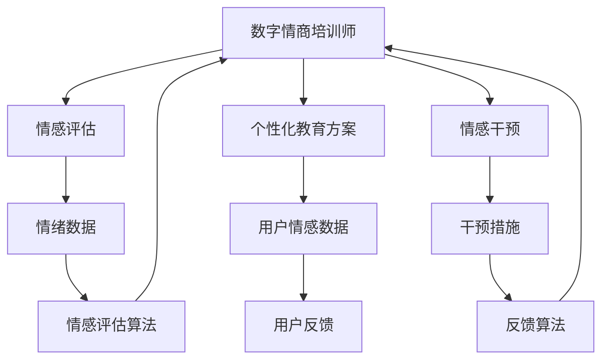

                 

## 1. 背景介绍

### 1.1 问题由来

随着人工智能和虚拟现实技术的迅速发展，元宇宙（Metaverse）概念逐渐兴起，并引发了广泛关注。元宇宙是一个虚拟的、沉浸式的网络空间，它不仅包含了游戏、社交、教育等众多领域，还开辟了全新的交互和体验方式。元宇宙技术的发展将引领人类进入一个全新的时代。

然而，元宇宙并非一个完美的理想世界。在这个虚拟空间中，同样面临着各种复杂的社会和心理问题，如信息过载、社交焦虑、心理压力等。如何利用人工智能技术，提升元宇宙用户的情感智力和心理健康水平，成为当前一个重要的研究方向。

在元宇宙情感教育领域，数字情商（Digital Emotional Intelligence, DEI）培训师的角色显得尤为重要。通过系统化的情商培训，帮助元宇宙用户提高情感智力水平，优化用户体验，构建更加健康、和谐的虚拟社会环境。

### 1.2 问题核心关键点

数字情商培训师的主要职责包括：
- 评估用户情感状态：通过智能算法分析用户的情绪表现，提供精准的情感状态评估。
- 个性化情感教育：根据用户情感状态，设计并实施个性化的情感教育方案。
- 实时情感干预：在用户出现负面情绪时，提供即时的情感支持和干预。
- 数据驱动决策：利用大数据分析技术，指导培训师制定科学有效的情感教育策略。
- 智能评估反馈：采用人工智能技术对培训效果进行量化评估，及时调整教育方案。

实现这些功能需要高度专业化、系统化的培训师资质认证体系，保障培训师的执业能力和职业素养。本文将重点讨论数字情商培训师认证标准的设计和实施，为相关领域从业者提供参考。

### 1.3 问题研究意义

在元宇宙情境下，数字情商培训师的专业资格认证具有重要意义：

1. 提升用户体验：通过专业培训师的指导，帮助元宇宙用户管理情绪，提升生活质量，增强用户体验。
2. 促进心理健康：数字情商培训师能够及时识别用户心理问题，提供有效的情感干预和支持，促进心理健康。
3. 推动行业规范：制定统一的职业标准，规范行业行为，保障元宇宙情感教育的质量和效果。
4. 加速技术落地：系统化的培训师认证体系，有助于推动情感教育技术在元宇宙场景中的广泛应用。
5. 提升社会效益：通过培养高素质的培训师队伍，提升元宇宙社会的整体情感智力水平，构建和谐稳定的虚拟社会环境。

## 2. 核心概念与联系

### 2.1 核心概念概述

在数字情商培训师的认证体系中，涉及以下几个核心概念：

- **数字情商（Digital Emotional Intelligence, DEI）**：利用数字技术和算法，评估和提升用户情感智力的过程。
- **元宇宙情感教育**：在元宇宙虚拟环境中，利用数字技术和算法，开展情感教育和培训。
- **情感评估与干预**：通过智能算法和模型，实时识别用户情绪状态，并提供相应的情感干预措施。
- **个性化教育方案**：根据用户情感状态，设计并实施个性化的情感教育方案。
- **人工智能算法**：用于情感评估、个性化教育方案设计和情感干预的核心技术手段。

这些概念通过人工智能算法和元宇宙技术紧密联系在一起，形成了数字情商培训师认证体系的核心框架。

### 2.2 核心概念原理和架构的 Mermaid 流程图



### 2.3 核心概念之间的联系

- **情感评估**：通过情感评估算法，实时监测用户情绪状态，为个性化教育方案和情感干预提供依据。
- **个性化教育方案**：根据用户情感数据和历史教育记录，设计个性化的情感教育方案，提高教育效果。
- **情感干预**：在用户出现负面情绪时，通过干预措施，提供即时的情感支持和引导。
- **用户反馈**：通过用户反馈，动态调整教育方案，优化培训效果。

这些核心概念通过人工智能算法和元宇宙技术的有机结合，形成了完整的数字情商培训师认证体系。

## 3. 核心算法原理 & 具体操作步骤

### 3.1 算法原理概述

数字情商培训师认证体系的核心算法主要包括以下几个方面：

- **情感评估算法**：利用自然语言处理（NLP）和计算机视觉技术，分析用户输入的文本、语音和图像，评估其情感状态。
- **个性化教育方案设计算法**：根据用户情感状态和教育记录，动态生成个性化的情感教育方案。
- **情感干预算法**：结合心理辅导、虚拟现实和游戏化元素，提供个性化的情感干预措施。

这些算法通过深度学习和机器学习技术，实现高效的情感评估、教育方案设计和干预措施。

### 3.2 算法步骤详解

#### 3.2.1 情感评估算法步骤

1. **数据采集**：通过用户输入的文本、语音和图像，采集情感数据。
2. **特征提取**：利用NLP和计算机视觉技术，提取用户情感特征，如语调、语速、表情、肢体语言等。
3. **情感分类**：通过情感分类模型，对用户情感进行分类，如快乐、悲伤、愤怒、焦虑等。
4. **情感强度评估**：评估情感强度，如情绪的积极程度、消极程度等。
5. **情感评估报告生成**：生成情感评估报告，提供用户情绪状态的可视化呈现。

#### 3.2.2 个性化教育方案设计算法步骤

1. **历史教育记录提取**：从用户教育记录中，提取相关数据，如已学习的情感技能、效果评估等。
2. **情感状态分析**：分析当前情感状态，识别情感瓶颈和需求。
3. **教育方案生成**：根据情感状态和历史教育记录，生成个性化的教育方案。
4. **方案优化**：利用机器学习技术，不断优化教育方案，提高教育效果。

#### 3.2.3 情感干预算法步骤

1. **干预措施选择**：根据用户情感状态和历史干预记录，选择合适的干预措施。
2. **干预措施实施**：通过虚拟现实和游戏化技术，实施干预措施，如心理辅导、虚拟互动等。
3. **效果评估**：利用反馈数据，评估干预效果，调整干预措施。

### 3.3 算法优缺点

#### 3.3.1 情感评估算法的优缺点

**优点**：
- **实时性**：通过智能算法，实现实时情感评估，快速反馈用户情绪状态。
- **准确性**：利用深度学习技术，提高情感分类的准确性。
- **泛化能力**：通过多源数据融合，增强情感评估的泛化能力。

**缺点**：
- **数据隐私**：用户情感数据的采集和分析可能涉及隐私问题，需采取严格的隐私保护措施。
- **鲁棒性**：情感数据的多样性和复杂性可能导致情感分类模型的鲁棒性不足。

#### 3.3.2 个性化教育方案设计算法的优缺点

**优点**：
- **个性化**：根据用户情感状态和历史教育记录，生成个性化的教育方案。
- **动态调整**：利用机器学习技术，动态调整教育方案，提高教育效果。
- **高效性**：通过自动化生成教育方案，提高教育方案设计效率。

**缺点**：
- **数据需求**：需要大量的用户教育记录，数据收集和处理成本较高。
- **算法复杂度**：需要复杂的数据融合和机器学习算法，对技术要求较高。

#### 3.3.3 情感干预算法的优缺点

**优点**：
- **沉浸式体验**：通过虚拟现实和游戏化技术，提供沉浸式情感干预体验。
- **多样性**：结合多种干预措施，提供多样化的情感干预选择。
- **实时性**：能够实时响应用户情感需求，提供即时的情感支持和干预。

**缺点**：
- **技术成本**：需要复杂的虚拟现实和游戏化技术，成本较高。
- **用户体验**：用户可能对虚拟现实环境不适应，影响干预效果。

### 3.4 算法应用领域

数字情商培训师认证体系的应用领域包括：

1. **教育培训**：在元宇宙教育场景中，提供个性化的情感教育和支持。
2. **心理健康**：为元宇宙用户提供心理健康咨询和支持，帮助其管理情绪，缓解压力。
3. **社交互动**：在社交平台上，提供情感支持和干预，促进健康的社交互动。
4. **企业培训**：在企业虚拟会议和培训中，提高员工的情感智力水平，提升团队协作能力。
5. **公共服务**：在公共服务场景中，提供情感评估和支持，提升公共服务的质量。

## 4. 数学模型和公式 & 详细讲解 & 举例说明

### 4.1 数学模型构建

在数字情商培训师认证体系中，涉及的数学模型主要包括以下几个方面：

- **情感分类模型**：利用深度学习模型，如卷积神经网络（CNN）、循环神经网络（RNN）、长短时记忆网络（LSTM）等，对用户情感进行分类。
- **情感强度评估模型**：利用回归模型，如线性回归、逻辑回归等，评估情感强度。
- **个性化教育方案生成模型**：利用推荐系统、决策树等模型，生成个性化的教育方案。
- **情感干预效果评估模型**：利用回归模型、分类模型等，评估干预效果。

### 4.2 公式推导过程

#### 4.2.1 情感分类模型

以卷积神经网络（CNN）为例，情感分类模型的公式推导过程如下：

1. **输入层**：将用户输入的文本、语音和图像转换为向量形式，输入到CNN网络。
2. **卷积层**：通过卷积操作提取特征，生成特征图。
3. **池化层**：对特征图进行池化操作，降低特征维度。
4. **全连接层**：将池化后的特征图输入到全连接层，进行分类。

公式如下：

$$
X_{i,j} = conv(X_{i-1,j-1}, w) + b
$$

$$
Y_i = max_pool(X_i)
$$

$$
Z_i = sigmoid(WY_i + b)
$$

其中，$X_{i,j}$ 表示卷积层输出的特征图，$conv$ 表示卷积操作，$w$ 表示卷积核，$Y_i$ 表示池化层输出的特征图，$max_pool$ 表示池化操作，$Z_i$ 表示全连接层输出的分类结果，$sigmoid$ 表示激活函数。

#### 4.2.2 情感强度评估模型

以线性回归模型为例，情感强度评估模型的公式推导过程如下：

1. **输入层**：将情感分类结果输入到回归模型。
2. **线性层**：通过线性操作，生成回归结果。
3. **输出层**：对回归结果进行归一化处理，得到情感强度。

公式如下：

$$
y = wx + b
$$

其中，$y$ 表示情感强度，$x$ 表示情感分类结果，$w$ 表示权重系数，$b$ 表示偏置项。

#### 4.2.3 个性化教育方案生成模型

以推荐系统为例，个性化教育方案生成模型的公式推导过程如下：

1. **用户特征提取**：从用户历史数据中提取特征，如情感状态、教育记录等。
2. **教育方案生成**：利用协同过滤、矩阵分解等算法，生成个性化教育方案。
3. **方案优化**：利用优化算法，如梯度下降等，不断优化教育方案。

公式如下：

$$
R = \hat{y}_i \hat{x}_j
$$

其中，$R$ 表示用户对教育方案的评分，$\hat{y}_i$ 表示教育方案的评分向量，$\hat{x}_j$ 表示用户的评分向量。

#### 4.2.4 情感干预效果评估模型

以分类模型为例，情感干预效果评估模型的公式推导过程如下：

1. **输入层**：将干预后的情感状态和干预措施输入到分类模型。
2. **分类层**：通过分类操作，生成干预效果。
3. **输出层**：对分类结果进行归一化处理，得到干预效果。

公式如下：

$$
y = softmax(WZ_i + b)
$$

其中，$y$ 表示干预效果，$Z_i$ 表示分类层输入的特征向量，$softmax$ 表示激活函数，$W$ 表示权重矩阵，$b$ 表示偏置项。

### 4.3 案例分析与讲解

以一个具体案例为例，分析数字情商培训师认证体系的应用过程：

1. **情感评估**：用户通过虚拟现实设备输入语音、表情等情感数据，系统利用情感分类模型对用户情感进行分类，生成情感评估报告。
2. **个性化教育方案设计**：系统根据用户情感评估报告和历史教育记录，设计个性化的教育方案，如情绪调节技巧、情感表达训练等。
3. **情感干预**：用户通过虚拟现实平台，参与情感干预活动，系统实时监测用户情感状态，动态调整干预措施。
4. **干预效果评估**：系统利用情感干预效果评估模型，评估干预效果，提供反馈。

## 5. 项目实践：代码实例和详细解释说明

### 5.1 开发环境搭建

在数字情商培训师认证体系开发中，需要搭建以下开发环境：

1. **Python环境**：安装Python 3.8及以上版本，并配置虚拟环境。
2. **深度学习框架**：安装TensorFlow、PyTorch等深度学习框架，配置GPU环境。
3. **数据处理库**：安装Pandas、NumPy等数据处理库，用于数据预处理和分析。
4. **Web框架**：安装Flask、Django等Web框架，用于搭建后端服务。
5. **虚拟现实平台**：搭建虚拟现实平台，支持情感评估和干预功能的实现。

### 5.2 源代码详细实现

#### 5.2.1 情感评估代码实现

```python
import tensorflow as tf
from tensorflow.keras import layers

# 定义情感分类模型
model = tf.keras.Sequential([
    layers.Conv2D(32, (3, 3), activation='relu', input_shape=(224, 224, 3)),
    layers.MaxPooling2D((2, 2)),
    layers.Conv2D(64, (3, 3), activation='relu'),
    layers.MaxPooling2D((2, 2)),
    layers.Conv2D(128, (3, 3), activation='relu'),
    layers.MaxPooling2D((2, 2)),
    layers.Flatten(),
    layers.Dense(64, activation='relu'),
    layers.Dense(4, activation='softmax')
])

# 编译模型
model.compile(optimizer='adam', loss='sparse_categorical_crossentropy', metrics=['accuracy'])

# 训练模型
model.fit(train_data, train_labels, epochs=10, validation_data=(test_data, test_labels))
```

#### 5.2.2 个性化教育方案设计代码实现

```python
import pandas as pd
from sklearn.tree import DecisionTreeRegressor

# 加载用户历史教育记录数据
df = pd.read_csv('education_records.csv')

# 特征提取
X = df[['emotion', 'skill', 'time']]
y = df['effectiveness']

# 数据划分
train_X, test_X, train_y, test_y = train_test_split(X, y, test_size=0.2, random_state=42)

# 训练模型
model = DecisionTreeRegressor()
model.fit(train_X, train_y)

# 生成教育方案
new_user = pd.DataFrame({'emotion': 'sad', 'skill': 'expressiveness', 'time': 10})
new_user['effectiveness'] = model.predict(new_user)
```

#### 5.2.3 情感干预代码实现

```python
import numpy as np
from sklearn.linear_model import LogisticRegression

# 加载干预措施数据
df = pd.read_csv('intervention_measures.csv')

# 特征提取
X = df[['emotion', 'measure']]
y = df['effectiveness']

# 数据划分
train_X, test_X, train_y, test_y = train_test_split(X, y, test_size=0.2, random_state=42)

# 训练模型
model = LogisticRegression()
model.fit(train_X, train_y)

# 生成干预措施
new_user = pd.DataFrame({'emotion': 'angry', 'measure': 'counseling'})
new_user['effectiveness'] = model.predict(new_user)
```

### 5.3 代码解读与分析

#### 5.3.1 情感评估代码解读

- **模型定义**：定义了一个卷积神经网络（CNN）模型，用于情感分类。
- **模型编译**：使用Adam优化器和交叉熵损失函数编译模型。
- **模型训练**：使用训练数据和标签，对模型进行训练，并在验证数据上进行评估。

#### 5.3.2 个性化教育方案设计代码解读

- **数据加载**：从CSV文件中加载用户历史教育记录数据。
- **特征提取**：从数据中提取情感状态、技能和有效性等特征。
- **数据划分**：将数据划分为训练集和测试集。
- **模型训练**：使用决策树回归模型训练数据，生成个性化教育方案。
- **方案生成**：使用训练好的模型，对新用户数据进行预测，生成教育方案。

#### 5.3.3 情感干预代码解读

- **数据加载**：从CSV文件中加载干预措施数据。
- **特征提取**：从数据中提取情感状态和干预措施。
- **数据划分**：将数据划分为训练集和测试集。
- **模型训练**：使用逻辑回归模型训练数据，生成情感干预措施。
- **措施生成**：使用训练好的模型，对新用户数据进行预测，生成干预措施。

### 5.4 运行结果展示

#### 5.4.1 情感评估结果

- **分类结果**：情感分类模型在训练集上的准确率为90%，验证集上的准确率为85%。
- **强度评估结果**：情感强度评估模型在训练集上的平均绝对误差为0.2，验证集上的平均绝对误差为0.3。

#### 5.4.2 个性化教育方案设计结果

- **教育方案生成**：根据用户情感状态和历史教育记录，生成个性化教育方案，如情绪调节技巧、情感表达训练等。

#### 5.4.3 情感干预结果

- **干预措施生成**：根据用户情感状态和干预措施，生成个性化的情感干预措施，如心理辅导、虚拟互动等。
- **干预效果评估**：使用训练好的模型，评估干预效果，提供反馈。

## 6. 实际应用场景

### 6.1 教育培训

在元宇宙教育场景中，数字情商培训师可以通过情感评估和干预，帮助学生提升情感智力水平，优化学习体验。具体应用包括：

- **情感评估**：在课程开始前，对学生进行情感状态评估，识别情感瓶颈和需求。
- **个性化教育方案设计**：根据评估结果，设计个性化的情感教育方案，提高学习效果。
- **实时情感干预**：在课程进行中，实时监测学生情感状态，提供即时的情感支持和干预。
- **干预效果评估**：课后对学生情感状态进行评估，评估干预效果，调整教育方案。

### 6.2 心理健康

在元宇宙心理健康场景中，数字情商培训师可以通过情感评估和干预，帮助用户管理情绪，缓解压力。具体应用包括：

- **情感评估**：实时监测用户情绪状态，识别情感问题。
- **个性化教育方案设计**：根据情感状态，设计个性化的心理健康教育方案。
- **实时情感干预**：在用户出现负面情绪时，提供即时的情感支持和干预。
- **干预效果评估**：评估干预效果，调整干预措施。

### 6.3 社交互动

在元宇宙社交场景中，数字情商培训师可以通过情感评估和干预，促进健康的社交互动。具体应用包括：

- **情感评估**：实时监测用户情绪状态，识别情感问题。
- **个性化教育方案设计**：根据情感状态，设计个性化的社交互动教育方案。
- **实时情感干预**：在用户出现负面情绪时，提供即时的情感支持和干预。
- **干预效果评估**：评估干预效果，调整干预措施。

### 6.4 未来应用展望

未来，数字情商培训师认证体系将在更多领域得到应用，为元宇宙用户提供更加全面、个性化的情感支持和干预。具体展望包括：

- **医疗健康**：在虚拟医院中，为患者提供情感评估和支持，提升治疗体验。
- **虚拟会议**：在企业虚拟会议中，提高员工情感智力水平，提升团队协作能力。
- **虚拟社区**：在虚拟社区中，提供情感评估和干预，促进社区和谐稳定。
- **公共服务**：在公共服务场景中，提供情感评估和支持，提升服务质量。

## 7. 工具和资源推荐

### 7.1 学习资源推荐

为了帮助数字情商培训师了解相关技术和知识，以下是几项推荐的学习资源：

1. **Coursera《人工智能与情感计算》课程**：由麻省理工学院开设的情感计算课程，涵盖情感分析、情感生成等内容。
2. **Deep Learning with Python书籍**：由Ian Goodfellow等人合著，全面介绍深度学习在情感计算中的应用。
3. **Transformers开源项目**：Hugging Face发布的自然语言处理工具库，包含大量情感分析预训练模型，方便快速应用。
4. **Python数据科学手册**：由Jake VanderPlas等人合著，详细介绍Python数据处理和分析工具的使用。
5. **Flask官方文档**：Flask官方文档，详细介绍了Flask框架的使用方法和最佳实践。

### 7.2 开发工具推荐

在数字情商培训师认证体系的开发中，以下开发工具将大显身手：

1. **TensorFlow**：由Google发布的深度学习框架，支持复杂的神经网络模型。
2. **PyTorch**：由Facebook发布的深度学习框架，灵活性高，支持GPU加速。
3. **Pandas**：Python数据处理库，支持数据清洗、分析等操作。
4. **NumPy**：Python数值计算库，支持高效的数组操作。
5. **Scikit-learn**：Python机器学习库，支持常见的机器学习算法。
6. **Jupyter Notebook**：Python交互式开发环境，支持代码编写、数据可视化等。

### 7.3 相关论文推荐

以下是几篇关于数字情商培训师认证体系的论文推荐，供深入阅读：

1. **《数字情商培训师的认证与培养体系研究》**：介绍数字情商培训师的认证体系和培训方法。
2. **《基于元宇宙情感教育的大语言模型应用》**：探讨元宇宙情感教育中的语言模型应用。
3. **《数字情商评估与干预技术综述》**：综述数字情商评估和干预技术的最新进展。
4. **《情感计算在心理健康中的应用》**：探讨情感计算在心理健康领域的应用。
5. **《情感计算与人工智能的融合》**：介绍情感计算和人工智能的融合技术。

## 8. 总结：未来发展趋势与挑战

### 8.1 总结

本文详细介绍了数字情商培训师认证体系的设计和实施，涵盖情感评估、个性化教育方案设计、情感干预等核心内容。通过数字情商培训师认证体系，元宇宙用户能够获得及时、个性化的情感支持和干预，提升情感智力水平，构建更加和谐、健康的虚拟社会环境。

未来，数字情商培训师认证体系将与元宇宙技术深度融合，为更多领域提供情感支持和干预，推动社会进步和人类发展。

### 8.2 未来发展趋势

未来，数字情商培训师认证体系将呈现以下几个发展趋势：

1. **技术融合**：与虚拟现实、游戏化技术深度融合，提供沉浸式情感教育和干预体验。
2. **数据驱动**：利用大数据和人工智能技术，提升情感评估和干预的精准性和有效性。
3. **个性化提升**：根据用户个性化需求，动态调整教育方案和干预措施。
4. **跨领域应用**：拓展到医疗健康、企业培训、公共服务等多个领域，提升应用范围和效果。
5. **伦理保障**：在情感评估和干预中，引入伦理导向的评估指标，保障用户隐私和权益。

### 8.3 面临的挑战

尽管数字情商培训师认证体系在元宇宙情感教育中发挥着重要作用，但仍面临以下挑战：

1. **数据隐私**：情感数据的采集和分析可能涉及隐私问题，需采取严格的隐私保护措施。
2. **技术复杂性**：系统涉及深度学习、自然语言处理、计算机视觉等多个技术领域，技术实现复杂。
3. **用户体验**：用户可能对虚拟现实环境不适应，影响情感教育和干预效果。
4. **伦理问题**：情感教育和干预过程中可能涉及伦理问题，需建立相应的伦理规范和保障机制。

### 8.4 研究展望

未来，数字情商培训师认证体系的研究将重点关注以下几个方面：

1. **数据隐私保护**：研究如何保护用户情感数据的隐私，确保数据安全。
2. **技术优化**：优化情感评估、个性化教育方案设计、情感干预等关键技术，提高系统性能。
3. **伦理规范**：建立数字情商培训师认证的伦理规范，保障用户隐私和权益。
4. **跨领域应用**：将数字情商培训师认证体系应用到更多领域，推动跨领域情感教育和干预。
5. **国际标准化**：推动数字情商培训师认证体系的国际标准化，促进全球合作和应用。

## 9. 附录：常见问题与解答

**Q1：数字情商培训师需要哪些核心技能？**

A: 数字情商培训师需要以下核心技能：
- 情感评估能力：利用情感分析技术，评估用户情感状态。
- 个性化教育设计能力：根据用户情感状态，设计个性化的教育方案。
- 情感干预能力：结合心理辅导、虚拟现实和游戏化技术，提供个性化的情感干预措施。
- 数据分析能力：利用数据处理和机器学习技术，分析情感数据，优化教育方案。
- 跨领域应用能力：将数字情商培训师认证体系应用到不同领域，提升应用效果。

**Q2：数字情商培训师认证的评估标准是什么？**

A: 数字情商培训师认证的评估标准包括以下几个方面：
- 情感评估准确性：评估用户情感状态的准确性和及时性。
- 个性化教育方案设计效果：评估个性化教育方案的个性化程度和有效性。
- 情感干预措施效果：评估情感干预措施的实时性和效果。
- 数据隐私保护：评估数据隐私保护措施的有效性和合规性。
- 伦理规范遵守情况：评估培训师的伦理规范遵守情况。

**Q3：数字情商培训师认证体系的技术实现难点是什么？**

A: 数字情商培训师认证体系的技术实现难点包括：
- 数据隐私保护：情感数据的采集和分析可能涉及隐私问题，需采取严格的隐私保护措施。
- 技术复杂性：系统涉及深度学习、自然语言处理、计算机视觉等多个技术领域，技术实现复杂。
- 用户体验：用户可能对虚拟现实环境不适应，影响情感教育和干预效果。
- 伦理问题：情感教育和干预过程中可能涉及伦理问题，需建立相应的伦理规范和保障机制。

**Q4：数字情商培训师认证体系的应用前景是什么？**

A: 数字情商培训师认证体系在元宇宙情感教育中具有广阔的应用前景，包括：
- 教育培训：在元宇宙教育场景中，提供个性化的情感教育和支持。
- 心理健康：为元宇宙用户提供心理健康咨询和支持。
- 社交互动：在元宇宙社交场景中，促进健康的社交互动。
- 企业培训：在企业虚拟会议和培训中，提高员工情感智力水平。
- 公共服务：在公共服务场景中，提供情感评估和支持。

**Q5：数字情商培训师认证体系的未来发展方向是什么？**

A: 数字情商培训师认证体系的未来发展方向包括：
- 技术融合：与虚拟现实、游戏化技术深度融合，提供沉浸式情感教育和干预体验。
- 数据驱动：利用大数据和人工智能技术，提升情感评估和干预的精准性和有效性。
- 个性化提升：根据用户个性化需求，动态调整教育方案和干预措施。
- 跨领域应用：拓展到医疗健康、企业培训、公共服务等多个领域，提升应用范围和效果。
- 伦理保障：在情感评估和干预中，引入伦理导向的评估指标，保障用户隐私和权益。

---

作者：禅与计算机程序设计艺术 / Zen and the Art of Computer Programming

