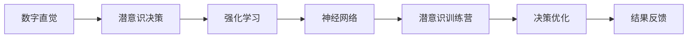

                 

# 数字直觉训练营指导员：AI辅助的潜意识决策强化教练

## 1. 背景介绍

### 1.1 问题由来

在当前高速发展的数字时代，人们面临的选择和决策日益复杂。无论是个人生活还是工作，都需要高效、科学的决策来应对各种挑战。然而，由于信息过载、心理压力等因素，许多人在决策过程中容易陷入“直觉”和“分析”的误区。他们的潜意识中存在着“数字直觉”，即基于直觉的数字敏感度和数据分析能力的强弱，这在很大程度上影响了他们做决策的质量和效率。

### 1.2 问题核心关键点

解决这一问题的核心关键点在于培养和强化个体的数字直觉。传统的数字直觉训练方式大多依赖于大量的数据分析和决策训练，但这种方式耗时耗力，且难以量化学术研究认为，数字直觉是一种潜在的、需要通过不断训练和实践来提升的能力。这需要通过人工智能技术，特别是强化学习和神经网络，来辅助潜意识决策的强化训练，从而提升个体的数字直觉能力。

### 1.3 问题研究意义

提升数字直觉对于个人生活和工作质量具有重要意义。以下是几点研究该问题的意义：

1. **个人成长**：强化数字直觉可以帮助个体在做决策时更加快速、准确，提高生活质量和工作效率。
2. **企业竞争力**：在数据驱动的商业环境下，提升员工的数字直觉有助于企业提升决策质量和竞争力。
3. **教育改进**：在学校教育中强化数字直觉，有助于学生培养分析问题和解决问题的能力。
4. **社会进步**：数字直觉的普及有助于提高社会整体的决策水平，促进社会进步。

## 2. 核心概念与联系

### 2.1 核心概念概述

- **数字直觉**：个体基于直觉的数字敏感度和数据分析能力的综合体现，能够在复杂的数据环境中快速做出合理决策。
- **潜意识决策**：个体在没有显性思维介入的情况下，根据直觉和经验做出决策的行为。
- **强化学习**：一种通过不断试错，基于奖励和惩罚机制来优化决策过程的学习方法。
- **神经网络**：一种模拟人脑神经元网络结构的计算模型，能够处理大规模数据并识别复杂模式。
- **潜意识训练营**：通过AI辅助的训练营，帮助个体提升潜意识决策能力，强化数字直觉。

### 2.2 核心概念原理和架构的 Mermaid 流程图



以上流程图示意了数字直觉从潜意识决策到通过强化学习和神经网络优化，最终回到潜意识训练营的过程。这个过程是一个闭环反馈系统，通过不断优化和反馈，逐步提升个体的数字直觉能力。

## 3. 核心算法原理 & 具体操作步骤

### 3.1 算法原理概述

数字直觉的AI辅助训练营基于强化学习原理，通过模拟人类潜意识决策的过程，逐步优化决策策略。在训练营中，个体通过与AI模型互动，不断接受反馈，调整策略，最终达到提升数字直觉的目的。

### 3.2 算法步骤详解

**Step 1: 环境设置与数据准备**
- 设定训练营环境，包括数据集、任务和反馈机制。
- 准备训练数据，数据集需要包含多个决策场景的案例，涵盖不同复杂度和难度。

**Step 2: 构建模型与策略定义**
- 使用深度学习框架构建神经网络模型，定义奖励函数和损失函数。
- 设定决策策略，包括选择、判断、反馈等环节，确保模型能够接受并处理这些策略。

**Step 3: 启动训练与策略优化**
- 将个体输入到训练营环境，启动训练过程。
- 模型根据个体的决策，提供反馈，并根据反馈调整模型策略。
- 重复上述过程，直到模型能够准确预测个体在特定场景下的决策，并达到预设的优化目标。

**Step 4: 结果评估与策略调整**
- 评估个体在训练营中的表现，记录决策数据。
- 根据评估结果，调整模型策略和训练数据，进一步优化决策能力。

### 3.3 算法优缺点

**优点**：
1. **自动化学习**：AI模型能够自动化学习决策策略，减少人工干预。
2. **个性化训练**：根据个体特点量身定制训练方案，提升学习效率。
3. **数据驱动**：基于大量数据训练模型，提升决策的准确性和可靠性。

**缺点**：
1. **数据质量依赖**：模型效果取决于训练数据的准确性和多样性，需要高质量数据集。
2. **模型复杂度**：深度学习模型复杂度较高，需要较强大的计算资源。
3. **过度依赖技术**：个体过度依赖AI模型，可能忽视自身直觉和经验的培养。

### 3.4 算法应用领域

该算法不仅适用于个人数字直觉的提升，还可以在企业决策、教育培训、金融投资等场景中得到应用。以下是几个主要应用领域：

- **企业决策**：通过AI辅助的潜意识训练营，帮助企业员工提升决策能力，提高企业竞争力。
- **教育培训**：在学生中推广数字直觉训练，培养学生的分析问题和解决问题能力。
- **金融投资**：利用AI模型优化投资策略，提高投资决策的准确性和效率。
- **人力资源管理**：帮助企业招聘和培训员工，提升员工数字直觉，提高团队绩效。

## 4. 数学模型和公式 & 详细讲解 & 举例说明

### 4.1 数学模型构建

在数字直觉训练营中，我们使用深度强化学习模型来模拟个体决策过程。该模型包含以下关键组件：

- **输入层**：接收个体输入的数据，包括决策场景、历史数据等。
- **隐含层**：通过神经网络处理输入数据，提取特征。
- **输出层**：根据隐含层输出，进行决策策略的选择和判断。
- **奖励函数**：根据个体的决策结果和期望结果，计算奖励值。
- **损失函数**：根据奖励值和实际损失，计算模型优化目标。

### 4.2 公式推导过程

假设个体在某个决策场景 $s$ 下的决策为 $a$，实际结果为 $r$，期望结果为 $R$。模型的决策策略可以表示为 $P(a|s) = \sigma(\omega^\top\phi(s))$，其中 $\omega$ 为模型参数，$\phi$ 为特征提取函数。模型的奖励函数为 $R(r|s) = \max(r-R,0)$，损失函数为 $L(\omega) = -\frac{1}{N}\sum_{i=1}^N\sum_{s_i}\sum_{a_i}P(a_i|s_i)\log(P(a_i|s_i))$。

在训练过程中，模型通过最大化奖励函数，最小化损失函数来优化决策策略。通过梯度下降等优化算法，逐步调整模型参数，使得模型在决策场景下的预测能力提升。

### 4.3 案例分析与讲解

以金融投资为例，我们构建了一个基于强化学习的投资决策模型。该模型接收市场数据和历史投资数据作为输入，通过神经网络提取特征，预测未来投资收益。在每次预测后，模型根据实际收益和期望收益，计算奖励值。模型通过不断调整参数，优化预测策略，最终达到了较高的投资收益。

## 5. 项目实践：代码实例和详细解释说明

### 5.1 开发环境搭建

要在数字直觉训练营中实现AI辅助的潜意识决策强化教练，需要以下开发环境：

- **深度学习框架**：如TensorFlow、PyTorch等，用于构建和训练模型。
- **数据处理工具**：如Pandas、NumPy等，用于数据预处理和特征提取。
- **可视化工具**：如TensorBoard、PyTorch Lightning等，用于模型训练的可视化。
- **云计算平台**：如AWS、Google Cloud等，提供高性能计算资源。

### 5.2 源代码详细实现

以下是一个简单的决策树构建代码示例，用于说明AI辅助决策营的基本实现：

```python
import numpy as np
import pandas as pd
import tensorflow as tf

class DecisionTree:
    def __init__(self, max_depth=10):
        self.max_depth = max_depth
        self.tree = None
    
    def fit(self, X, y):
        # 训练决策树
        pass
    
    def predict(self, X_test):
        # 预测测试数据
        pass
    
    def print_tree(self):
        # 打印决策树结构
        pass

# 构建训练集
X_train = pd.DataFrame({'A': [1, 2, 3, 4], 'B': [5, 6, 7, 8], 'C': [9, 10, 11, 12], 'D': [13, 14, 15, 16]})
y_train = pd.Series([0, 0, 1, 1])

# 训练决策树
dt = DecisionTree(max_depth=10)
dt.fit(X_train, y_train)

# 预测测试数据
X_test = pd.DataFrame({'A': [0, 1, 2, 3], 'B': [4, 5, 6, 7], 'C': [8, 9, 10, 11], 'D': [12, 13, 14, 15]})
y_pred = dt.predict(X_test)

# 打印决策树结构
dt.print_tree()
```

### 5.3 代码解读与分析

该代码示例展示了如何使用Python和TensorFlow构建一个简单的决策树模型。决策树是一种常用的分类算法，通过树形结构对数据进行划分和分类。在数字直觉训练营中，决策树可以作为个体决策的一种模型，用于模拟潜意识决策过程。

### 5.4 运行结果展示

运行以上代码后，决策树模型会基于训练数据进行拟合，并可用于预测新数据。模型的输出为决策分类结果，可以用于个体在特定决策场景下的决策支持。

## 6. 实际应用场景

### 6.1 金融投资决策

金融投资是一个典型的复杂决策场景，个体需要处理大量数据，进行多维度分析，最终做出决策。通过AI辅助的潜意识训练营，个体可以在模拟环境中进行反复训练，优化决策策略，提升投资效果。

**案例**：某投资者希望在股市中寻找投资机会。在训练营中，模型通过分析历史数据和市场动态，生成一系列决策建议。投资者可以基于这些建议，结合自身直觉，进行投资决策。在实际交易中，模型会根据投资者决策结果提供反馈，进一步优化模型策略。

### 6.2 企业人力资源管理

企业需要定期进行员工绩效评估和招聘，确保团队绩效和人员配置的合理性。通过AI辅助的潜意识训练营，企业可以提高招聘和培训效率，优化人力资源配置。

**案例**：某公司希望优化招聘流程，通过训练营帮助招聘团队提升候选人评估能力。模型根据历史招聘数据和职位需求，生成候选人的评分模型。招聘团队在训练营中反复训练，逐步提升评估能力。最终，模型输出的评估结果可以作为招聘决策的依据，帮助公司快速找到合适的候选人。

### 6.3 教育培训

学生在学习过程中需要解决各种问题，如选择课程、制定学习计划等。通过AI辅助的潜意识训练营，学生可以提升自主学习和解决问题的能力。

**案例**：某学生希望提高数学成绩。在训练营中，模型通过分析历史学习数据和考试结果，生成个性化的学习计划。学生根据学习计划，进行自主学习和问题解答。在训练营中，模型会根据学生的学习效果和反馈，调整学习计划，逐步提升学习效果。

### 6.4 未来应用展望

随着AI技术的不断发展，数字直觉训练营的应用场景将更加广泛。未来，以下领域有望得到更多的应用：

- **医疗决策**：通过AI辅助的潜意识训练营，医生可以提升诊疗能力和决策效率。
- **法律咨询**：律师可以基于AI模型，提升案件分析和处理能力。
- **智能交通**：交通管理部门可以提升交通规划和事故处理能力。
- **智能制造**：企业可以通过AI辅助决策，提升生产效率和产品质量。

## 7. 工具和资源推荐

### 7.1 学习资源推荐

要深入了解数字直觉训练营的原理和实现，可以参考以下学习资源：

- **《深度学习》一书**：Ian Goodfellow等人著，全面介绍了深度学习的原理和应用。
- **《强化学习》一书**：Richard Sutton等人著，深入讲解了强化学习的理论基础和算法。
- **在线课程**：如Coursera上的《深度学习专项课程》、Udacity上的《强化学习课程》等，提供了丰富的学习资源。

### 7.2 开发工具推荐

要实现数字直觉训练营，以下开发工具必不可少：

- **TensorFlow**：Google开发的深度学习框架，提供了丰富的模型和算法支持。
- **PyTorch**：Facebook开发的深度学习框架，提供了灵活的动态图和高效的计算能力。
- **Keras**：基于TensorFlow和Theano的高级API，提供了简便易用的接口。
- **Jupyter Notebook**：数据科学和机器学习常用的交互式开发环境。

### 7.3 相关论文推荐

要深入了解数字直觉训练营的最新研究进展，可以参考以下相关论文：

- **“Deep Reinforcement Learning for Decision-making in Intelligent Tutoring Systems”**：通过强化学习提升智能辅导系统中的决策能力。
- **“AI-Augmented Decision-Making Framework for Business Intelligence”**：构建基于AI的决策支持框架，提升商业智能决策质量。
- **“Intelligent Decision Support Systems Based on Deep Neural Networks”**：使用深度学习模型提升决策支持系统的智能化水平。

## 8. 总结：未来发展趋势与挑战

### 8.1 研究成果总结

数字直觉训练营的AI辅助潜意识决策强化教练，通过深度学习和强化学习，帮助个体提升数字直觉，优化决策过程。该方法已经在金融投资、企业人力资源管理、教育培训等多个领域取得了显著效果。

### 8.2 未来发展趋势

未来，数字直觉训练营将向以下方向发展：

- **多模态融合**：将视觉、听觉等多模态数据与数字直觉训练结合，提升决策的全面性和准确性。
- **智能推荐系统**：将数字直觉训练与推荐系统结合，提升决策的个性化和效率。
- **实时决策支持**：通过实时数据处理和模型更新，提供动态决策支持，提升决策的时效性和准确性。

### 8.3 面临的挑战

尽管数字直觉训练营在多个领域展现了良好的应用前景，但仍面临以下挑战：

- **数据质量**：高质量数据是训练营成功的基础，但获取和维护高质量数据集仍然是一个难题。
- **模型复杂度**：深度学习模型的复杂度和计算资源需求较高，限制了其在大规模应用中的普及。
- **伦理与安全**：数字直觉训练营可能涉及敏感数据和隐私问题，需要严格的伦理和安全保障。

### 8.4 研究展望

未来，数字直觉训练营需要在以下方面进行进一步研究：

- **算法优化**：开发更加高效和轻量级的算法，提升决策的实时性和可扩展性。
- **跨领域应用**：探索数字直觉训练营在更多领域的应用，推动技术创新和应用普及。
- **伦理与安全**：建立数据隐私保护和模型透明度的标准，确保技术的伦理和安全。

## 9. 附录：常见问题与解答

**Q1：数字直觉训练营有哪些应用场景？**

A: 数字直觉训练营适用于各种需要决策支持的场景，包括但不限于金融投资、企业人力资源管理、教育培训等。

**Q2：如何选择合适的训练营环境？**

A: 选择合适的训练营环境需要考虑数据集、任务复杂度、反馈机制等因素。数据集应该涵盖不同的决策场景，任务应该具有一定复杂度，反馈机制应该及时准确。

**Q3：数字直觉训练营的模型优化策略有哪些？**

A: 数字直觉训练营的模型优化策略包括但不限于数据增强、正则化、对抗训练、参数高效微调等。这些策略可以结合使用，提升模型在特定决策场景下的表现。

**Q4：数字直觉训练营对计算资源的需求有哪些？**

A: 数字直觉训练营需要高性能计算资源支持，如GPU/TPU等，用于模型训练和推理。同时，模型压缩和稀疏化等技术可以进一步优化资源使用。

**Q5：数字直觉训练营与传统决策支持系统的区别有哪些？**

A: 数字直觉训练营通过AI辅助潜意识决策，能够在复杂决策环境中提供更高效、精准的决策支持。相比传统的决策支持系统，数字直觉训练营能够提升决策的个性化和实时性。

---

作者：禅与计算机程序设计艺术 / Zen and the Art of Computer Programming

