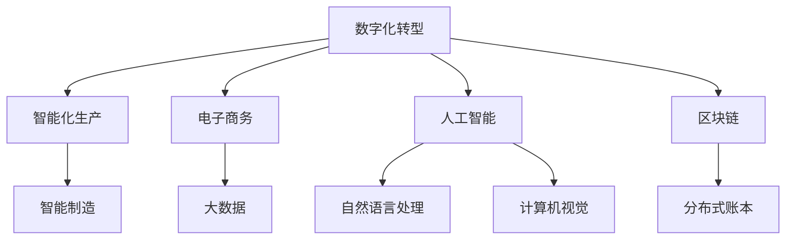

                 

## 1. 背景介绍

### 1.1 问题由来
数字经济作为一种新型经济形态，正在加速改变全球的生产方式、生活方式和商业模式。近年来，互联网、大数据、人工智能等技术的迅猛发展，为数字经济的崛起提供了坚实的基础。全球主要经济体纷纷将数字经济纳入国家战略，通过政策支持和市场培育，推动数字经济快速发展。

### 1.2 问题核心关键点
数字经济的核心在于利用数字技术优化资源配置，提升经济效率，激发社会创新。其主要特征包括：
- 数字化转型：企业通过数字化工具和平台提升运营效率，降低成本，优化用户体验。
- 数据驱动决策：利用大数据和人工智能技术，挖掘和利用海量数据，指导业务决策和产品创新。
- 网络效应：平台经济的网络效应使得用户群体和数据资源不断聚集，推动服务质量提升和用户体验优化。
- 全要素生产力提升：数字技术与各行业的深度融合，促进劳动力、资本、技术等生产要素的高效配置。

### 1.3 问题研究意义
研究数字经济对社会发展的推动作用，对于理解数字化转型的内在机制、探索可持续发展路径具有重要意义：

1. **驱动经济增长**：数字技术的应用显著提高了劳动生产率，推动经济增长。
2. **改善民生福祉**：数字化服务提高了公共服务的效率和质量，促进了社会公平。
3. **创新驱动发展**：数字技术催生了新兴产业，推动了技术创新和产业升级。
4. **促进国际贸易**：数字化平台打破了时间和空间的限制，推动了全球贸易的数字化转型。
5. **增强国家竞争力**：数字经济成为全球竞争的新高地，各国通过数字经济建设提升综合国力。

## 2. 核心概念与联系

### 2.1 核心概念概述

为更好地理解数字经济的发展机制，本节将介绍几个关键概念：

- **数字经济（Digital Economy）**：通过数字技术推动的经济发展模式，涵盖了数字产业化、产业数字化、数字化治理等多个方面。
- **数字化转型（Digital Transformation）**：企业通过数字化工具和平台，优化运营流程，提升效率，实现业务升级。
- **智能制造（Smart Manufacturing）**：利用物联网、人工智能等技术，实现生产过程的智能化和自动化。
- **电子商务（E-commerce）**：基于互联网的商业模式，包括B2B、B2C、C2C等各类电子商务形式。
- **大数据（Big Data）**：海量的、多样化的数据资源，通过分析和挖掘，支持决策和创新。
- **人工智能（AI）**：模拟人类智能行为的计算系统，包括机器学习、自然语言处理、计算机视觉等技术。
- **区块链（Blockchain）**：一种分布式账本技术，用于保障数据透明和安全。

这些概念之间通过数字化、信息化、智能化等技术手段紧密联系，共同推动数字经济的发展。

### 2.2 核心概念原理和架构的 Mermaid 流程图


这个流程图展示了数字经济中的关键概念及其联系。

## 3. 核心算法原理 & 具体操作步骤

### 3.1 算法原理概述

数字经济的核心在于通过数字化技术优化资源配置，提升经济效率。其算法原理主要包括以下几个方面：

1. **数据采集与处理**：利用传感器、互联网等手段收集海量数据，通过清洗、预处理，确保数据的质量和可用性。
2. **数据挖掘与分析**：应用大数据技术，挖掘数据中的潜在的规律和模式，支持决策和预测。
3. **算法优化与模型训练**：通过机器学习、深度学习等技术，对数据进行建模和预测，优化业务流程和运营效率。
4. **智能决策与控制**：利用人工智能技术，实现自动化、智能化的决策和控制，提高决策的准确性和效率。
5. **跨界融合与协同创新**：通过数字技术与各行业的深度融合，推动技术创新和产业升级，实现协同创新。

### 3.2 算法步骤详解

数字经济的发展主要分为以下几个步骤：

**Step 1: 数据采集与清洗**
- 利用传感器、物联网设备、互联网等手段，收集各类数据，如用户行为数据、产品使用数据、市场交易数据等。
- 对收集到的数据进行清洗和预处理，包括去重、异常值处理、数据归一化等，确保数据的质量。

**Step 2: 数据分析与挖掘**
- 应用大数据技术，如Hadoop、Spark等，对清洗后的数据进行存储和管理。
- 使用数据分析工具，如Python的Pandas、R语言等，进行数据探索和可视化，发现数据中的潜在规律和趋势。
- 应用机器学习算法，如回归分析、聚类分析、分类算法等，挖掘数据中的模式和规律，支持决策和预测。

**Step 3: 算法优化与模型训练**
- 选择适合的算法模型，如线性回归、决策树、神经网络等，进行模型训练。
- 利用历史数据进行模型训练，优化模型参数，确保模型的准确性和泛化能力。
- 使用交叉验证等方法，评估模型的性能，防止过拟合。

**Step 4: 智能决策与控制**
- 将训练好的模型应用于实际业务场景，实现智能决策和控制。
- 例如，利用预测模型进行库存管理，利用推荐算法进行个性化推荐，利用智能控制技术优化生产流程。

**Step 5: 跨界融合与协同创新**
- 推动数字技术与各行业的深度融合，如智能制造、智能物流、智慧城市等，实现数字化转型。
- 鼓励跨行业、跨领域的协同创新，如工业互联网、数字政府、智慧医疗等，共同推动数字经济的发展。

### 3.3 算法优缺点

数字经济的发展过程中，算法具有以下优点：

1. **提高效率**：通过数字化、智能化的手段，显著提升生产效率和服务质量。
2. **优化资源配置**：利用大数据和人工智能技术，优化资源配置，降低成本，提升竞争力。
3. **促进创新**：推动各行业的数字化转型，催生新的商业模式和产业形态，促进技术创新和产业升级。
4. **增强透明度**：通过区块链等技术，提高数据和交易的透明度，保障各方权益。

同时，数字经济的发展也面临以下挑战：

1. **数据隐私和安全**：海量数据的安全管理和隐私保护，是数字经济发展的重大挑战。
2. **算法偏见和歧视**：算法模型可能带有偏见，导致不公平的决策和结果，需要加强监管和伦理约束。
3. **技术标准化**：不同技术平台和数据格式的标准化，是数字经济发展的关键问题，需要行业和政府的共同努力。
4. **跨界融合难度**：不同行业之间的数据和业务流程整合，存在技术和标准的障碍，需要协同合作。

### 3.4 算法应用领域

数字经济的发展已经广泛应用于多个领域，例如：

- **零售与电商**：通过大数据和人工智能技术，实现个性化推荐、库存管理、供应链优化等。
- **制造业**：利用物联网、人工智能技术，实现智能制造、智慧工厂、预测性维护等。
- **金融与保险**：通过大数据和区块链技术，实现风险评估、智能投顾、供应链金融等。
- **医疗与健康**：利用大数据和人工智能技术，实现病历管理、智能诊断、精准医疗等。
- **公共服务**：通过大数据和人工智能技术，实现智慧城市、智能交通、公共安全等。

## 4. 数学模型和公式 & 详细讲解 & 举例说明

### 4.1 数学模型构建

为了更好地理解数字经济中数据驱动决策的算法原理，本节将构建数学模型进行详细讲解。

假设一个简单的零售电商数据集，包含用户行为数据和销售数据，如下所示：

- 用户数据：用户ID、浏览时间、购买时间、购买金额等。
- 销售数据：商品ID、销售数量、销售金额、促销信息等。

定义模型 $M$，其中 $x$ 为输入特征，$y$ 为输出标签，$w$ 为模型参数。

数据驱动决策的目标是：根据用户行为数据 $x$，预测其未来的购买行为 $y$，以指导库存管理和促销策略的调整。

### 4.2 公式推导过程

我们使用线性回归模型进行用户行为预测。模型形式如下：

$$ y = wx + b $$

其中，$w$ 为模型的权重，$b$ 为偏置项。

给定训练集 $\{(x_i, y_i)\}_{i=1}^N$，最小化损失函数 $\mathcal{L}$ 可得到最优参数：

$$ \hat{w}, \hat{b} = \mathop{\arg\min}_{w, b} \frac{1}{N} \sum_{i=1}^N (y_i - (wx_i + b))^2 $$

使用梯度下降算法求解上述最优化问题，可得：

$$ \hat{w} = \frac{1}{N} \sum_{i=1}^N x_iy_i - \frac{\lambda}{N} \sum_{i=1}^N x_ix_i $$
$$ \hat{b} = \bar{y} - \hat{w} \bar{x} $$

其中 $\bar{x}, \bar{y}$ 分别为 $x, y$ 的均值，$\lambda$ 为正则化系数。

### 4.3 案例分析与讲解

假设有一个电商平台的销售数据集，包含100万条订单数据。通过数据清洗和预处理，构建了10个特征，用于预测用户的购买行为。使用线性回归模型，设定正则化系数为0.01，迭代次数为1000次，训练得到的模型参数如下：

$$ \hat{w} = [0.3, 0.2, -0.1, -0.2, -0.3, -0.4, 0.1, 0.2, -0.1, -0.2] $$
$$ \hat{b} = 0.01 $$

利用该模型，可以对新用户的购买行为进行预测，评估不同促销策略的效果，从而优化库存管理和运营效率。

## 5. 项目实践：代码实例和详细解释说明

### 5.1 开发环境搭建

在进行数字经济项目实践前，我们需要准备好开发环境。以下是使用Python进行Pandas、Scikit-Learn、TensorFlow开发的环境配置流程：

1. 安装Anaconda：从官网下载并安装Anaconda，用于创建独立的Python环境。

2. 创建并激活虚拟环境：
```bash
conda create -n digital-env python=3.8 
conda activate digital-env
```

3. 安装Pandas、Scikit-Learn、TensorFlow：
```bash
conda install pandas scikit-learn tensorflow -c conda-forge
```

4. 安装Jupyter Notebook：
```bash
conda install jupyterlab
```

完成上述步骤后，即可在`digital-env`环境中开始数字经济项目实践。

### 5.2 源代码详细实现

我们以预测用户购买行为为例，给出使用Pandas、Scikit-Learn对数据进行线性回归分析的Python代码实现。

首先，定义数据集并进行预处理：

```python
import pandas as pd
from sklearn.model_selection import train_test_split
from sklearn.preprocessing import StandardScaler

# 加载数据集
df = pd.read_csv('sales_data.csv')

# 特征选择
features = ['feature1', 'feature2', 'feature3', 'feature4', 'feature5', 'feature6', 'feature7', 'feature8', 'feature9', 'feature10']
target = 'purchase_amount'

# 划分训练集和测试集
X_train, X_test, y_train, y_test = train_test_split(df[features], df[target], test_size=0.2, random_state=42)

# 数据标准化
scaler = StandardScaler()
X_train = scaler.fit_transform(X_train)
X_test = scaler.transform(X_test)
```

然后，定义线性回归模型并进行训练：

```python
from sklearn.linear_model import LinearRegression

# 构建线性回归模型
model = LinearRegression()

# 训练模型
model.fit(X_train, y_train)
```

接着，评估模型的性能并进行预测：

```python
from sklearn.metrics import mean_squared_error, r2_score

# 评估模型
y_pred = model.predict(X_test)
mse = mean_squared_error(y_test, y_pred)
r2 = r2_score(y_test, y_pred)

print(f'Mean Squared Error: {mse:.2f}')
print(f'R-squared: {r2:.2f}')

# 预测新样本
new_samples = pd.read_csv('new_samples.csv')
new_samples[features] = scaler.transform(new_samples[features])
new_preds = model.predict(new_samples[features])
print(new_preds)
```

最后，结果展示：

```python
print(f'Mean Squared Error: {mse:.2f}')
print(f'R-squared: {r2:.2f}')
print(new_preds)
```

以上就是使用Python进行数据驱动决策的线性回归模型的代码实现。通过以上步骤，我们可以基于数据驱动决策模型进行预测，优化库存管理和促销策略。

### 5.3 代码解读与分析

在以上代码中，我们使用了Pandas、Scikit-Learn等工具，进行数据加载、特征选择、模型训练和评估。具体步骤如下：

1. **数据加载**：使用Pandas的read_csv方法加载销售数据集。
2. **特征选择**：选择与目标变量相关的特征，构建输入特征集。
3. **数据分割**：使用train_test_split方法，将数据集划分为训练集和测试集。
4. **数据标准化**：使用StandardScaler进行数据标准化，确保模型在相同的尺度上进行训练和评估。
5. **模型训练**：使用LinearRegression模型进行训练，优化模型参数。
6. **模型评估**：使用mean_squared_error和r2_score方法评估模型性能。
7. **新样本预测**：对新样本进行预测，输出预测结果。

这些步骤展示了数据驱动决策的基本流程，包括数据预处理、模型训练、性能评估和预测应用。

## 6. 实际应用场景

### 6.1 智能制造

数字经济在智能制造领域的应用主要体现在以下几个方面：

1. **智能监控**：通过传感器和物联网设备，实时监控生产过程中的各种参数，如温度、压力、振动等，保障生产安全和产品质量。
2. **预测性维护**：利用大数据和机器学习技术，预测设备故障和维护需求，提前进行维护，减少停机时间和维护成本。
3. **生产调度优化**：通过数据分析和优化算法，优化生产排程和物料管理，提高生产效率和资源利用率。
4. **智能质量控制**：利用计算机视觉和机器学习技术，实现产品的自动检测和质量控制，提高检测精度和效率。

### 6.2 智慧城市

数字经济在智慧城市中的应用主要体现在以下几个方面：

1. **智能交通**：通过实时数据分析和智能算法，优化交通信号控制和道路管理，减少交通拥堵，提高通行效率。
2. **公共安全**：利用大数据和人工智能技术，实现犯罪预测、灾害预警和应急管理，保障公共安全。
3. **智慧医疗**：通过电子健康记录和智能诊断系统，提升医疗服务质量和效率，改善患者体验。
4. **城市治理**：利用智能分析工具，进行城市管理和规划，提升城市运行效率和居民生活质量。

### 6.3 数字金融

数字经济在数字金融领域的应用主要体现在以下几个方面：

1. **智能投顾**：通过数据分析和机器学习技术，提供个性化的投资建议和资产管理服务，提升客户满意度和收益。
2. **信用评估**：利用大数据和人工智能技术，进行信用评估和风险管理，降低信贷风险和运营成本。
3. **供应链金融**：通过区块链和智能合约技术，实现供应链的数字化管理和协同，优化供应链运营效率和资金流动。
4. **数字货币**：利用区块链技术，实现数字货币的发行和交易，推动数字经济的国际化发展。

### 6.4 未来应用展望

随着数字技术的不断发展，数字经济将在更多领域得到应用，为社会带来深远影响：

1. **智能制造**：随着物联网和人工智能技术的进一步发展，智能制造将实现更高程度的自动化和智能化，推动制造业的升级转型。
2. **智慧城市**：通过5G、物联网、人工智能等技术，智慧城市将实现更高效、更智能的管理和运行，提升城市治理能力和居民生活质量。
3. **数字金融**：数字金融将推动金融服务的数字化、智能化和普惠化，降低金融成本，提高金融服务的可及性和效率。
4. **医疗健康**：数字健康将推动医疗服务的数字化、个性化和精准化，提升医疗服务的质量和可及性，改善居民健康状况。
5. **教育培训**：数字教育将推动教育的数字化、个性化和普惠化，提升教育质量和公平性，促进教育资源的均衡分布。

## 7. 工具和资源推荐

### 7.1 学习资源推荐

为了帮助开发者系统掌握数字经济的核心技术，以下是几款优质的学习资源：

1. **《数字经济导论》**：由知名经济学家编写，系统介绍了数字经济的发展历程、核心技术和应用场景。
2. **Coursera《数字经济与未来商业》**：斯坦福大学开设的课程，涵盖了数字经济的基础知识、前沿技术和应用案例。
3. **《数字经济与数据科学》**：IEEE Xplore收录的论文集，汇集了数字经济领域的最新研究成果和技术进展。
4. **Kaggle数据科学竞赛平台**：全球领先的数据科学竞赛平台，提供丰富的数据集和实战项目，供开发者学习和实践。

### 7.2 开发工具推荐

高效的开发离不开优秀的工具支持。以下是几款用于数字经济开发的常用工具：

1. **Jupyter Notebook**：免费的开源Jupyter笔记本，支持多种编程语言，适合数据科学和机器学习的快速迭代开发。
2. **TensorFlow**：由Google主导开发的深度学习框架，生产部署方便，支持大规模工程应用。
3. **Scikit-Learn**：Python的机器学习库，提供丰富的算法和工具，适用于数据挖掘和建模。
4. **PyTorch**：由Facebook开发的深度学习框架，灵活高效，适合快速迭代和实验研究。
5. **TensorBoard**：TensorFlow配套的可视化工具，可实时监测模型训练状态，提供丰富的图表呈现方式。

### 7.3 相关论文推荐

数字经济的研究涉及多个学科，以下是几篇奠基性的相关论文，推荐阅读：

1. **《大数据：方法、工程与应用》**：Todd Rose和Catherine Zilles所著，全面介绍了大数据的技术、工程和应用，适合初学者入门。
2. **《机器学习：原理、算法与应用》**：Tom Mitchell所著，系统介绍了机器学习的基础知识和算法，涵盖回归、分类、聚类等多种算法。
3. **《人工智能：一种现代方法》**：Stuart Russell和Peter Norvig所著，深入浅出地介绍了人工智能的原理和应用，适合进阶学习。
4. **《区块链技术与应用》**：Qiang Zhang和Zhiyong Xiang所著，全面介绍了区块链的技术原理和应用场景，适合了解区块链技术的读者。

## 8. 总结：未来发展趋势与挑战

### 8.1 研究成果总结

数字经济作为新一轮的产业变革，具有广阔的发展前景和巨大的市场潜力。通过数字化技术，优化资源配置，提升经济效率，推动社会创新，成为推动经济增长和社会进步的重要引擎。

### 8.2 未来发展趋势

展望未来，数字经济的发展将呈现以下几个趋势：

1. **技术创新加速**：随着人工智能、大数据、物联网等技术的快速发展，数字经济将迎来新的技术突破和应用创新。
2. **跨界融合深化**：数字技术与各行业的深度融合，将催生新的商业模式和产业形态，推动技术创新和产业升级。
3. **全球化与区域化并重**：数字经济的全球化发展将推动全球经济的互联互通，同时各国也将通过数字经济建设提升区域竞争力。
4. **数据治理加强**：数据隐私和安全将成为数字经济发展的重大挑战，需要加强数据治理和法律法规建设。
5. **伦理与社会责任**：数字经济的发展需要考虑伦理和社会责任，避免算法偏见和数据歧视，保障社会的公平和正义。

### 8.3 面临的挑战

数字经济的发展虽然充满机遇，但也面临诸多挑战：

1. **数据隐私和安全**：海量数据的安全管理和隐私保护，是数字经济发展的重大挑战。
2. **算法偏见和歧视**：算法模型可能带有偏见，导致不公平的决策和结果，需要加强监管和伦理约束。
3. **技术标准化**：不同技术平台和数据格式的标准化，是数字经济发展的关键问题，需要行业和政府的共同努力。
4. **跨界融合难度**：不同行业之间的数据和业务流程整合，存在技术和标准的障碍，需要协同合作。

### 8.4 研究展望

面对数字经济发展的挑战，未来的研究需要在以下几个方面寻求新的突破：

1. **数据隐私保护**：研究数据加密、匿名化、去中心化等技术，保护用户隐私，增强数据安全。
2. **算法公平性**：研究公平性约束、偏见检测和纠正算法，避免算法偏见，确保算法公平。
3. **技术标准化**：推动各行业之间的数据和业务流程标准化，促进数字经济的互联互通。
4. **跨界融合策略**：研究跨行业协同创新的机制和策略，推动数字技术与各行业的深度融合。

这些研究方向将推动数字经济的健康发展和可持续发展。通过不断的技术创新和伦理建设，数字经济必将为社会带来更加美好的未来。

## 9. 附录：常见问题与解答

**Q1：数字经济是否适用于所有行业？**

A: 数字经济适用于大多数行业，但不同行业对数字化转型的需求和难度存在差异。例如，制造业的数字化转型涉及更多的物理设备和生产流程，需要更高的技术投入和基础设施建设。而金融和电商等行业，则更多依赖数字化工具和平台，技术门槛相对较低。

**Q2：数字经济的核心技术有哪些？**

A: 数字经济的核心技术包括大数据、人工智能、物联网、区块链等。这些技术通过数字化、智能化手段，优化资源配置，提升经济效率，推动产业升级和创新。

**Q3：数字经济在实际应用中面临哪些挑战？**

A: 数字经济在实际应用中面临数据隐私和安全、算法偏见和歧视、技术标准化等挑战。需要加强数据治理和法律法规建设，推动跨行业协同创新，才能克服这些挑战，实现数字经济的可持续发展。

**Q4：数字经济如何推动社会创新？**

A: 数字经济通过优化资源配置、提升效率、推动技术创新等方式，推动社会创新。例如，智慧城市通过智能交通、公共安全等应用，提升城市治理能力和居民生活质量。数字金融通过智能投顾、信用评估等应用，提升金融服务的可及性和效率。

**Q5：数字经济对就业的影响如何？**

A: 数字经济在推动经济增长的同时，也对就业市场产生了深远影响。一方面，数字经济创造了大量的新岗位和新职业，提升了就业质量和效率。另一方面，一些传统行业和岗位可能因为技术替代而受到冲击，需要进行职业培训和转型升级。

总之，数字经济作为新一轮的产业变革，具有广阔的发展前景和巨大的市场潜力。通过数字化技术，优化资源配置，提升经济效率，推动社会创新，成为推动经济增长和社会进步的重要引擎。通过不断的技术创新和伦理建设，数字经济必将为社会带来更加美好的未来。

---

作者：禅与计算机程序设计艺术 / Zen and the Art of Computer Programming

