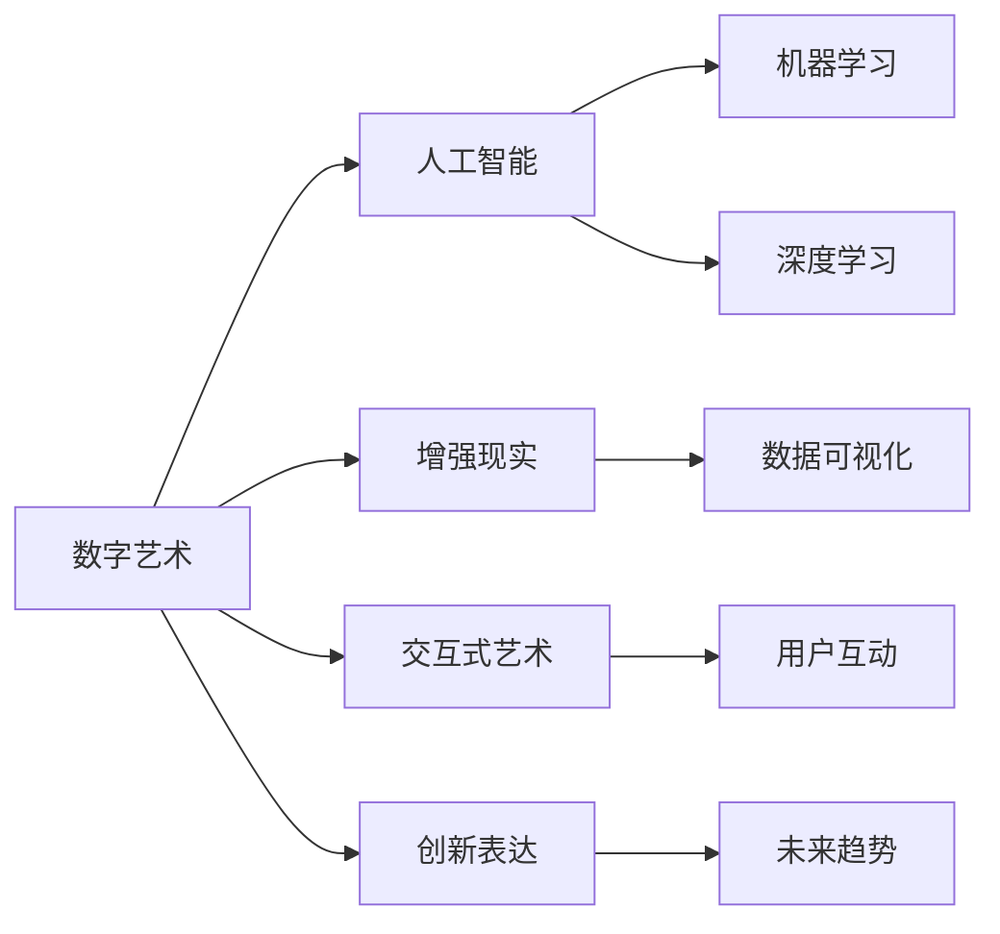

                 

## 1. 背景介绍

### 1.1 数字艺术的历史与发展

数字艺术（Digital Art），一种通过计算机技术创作和呈现的艺术形式，兴起于20世纪90年代，随互联网技术的飞速发展而迅速成长。它超越了传统艺术的界限，融合了科技与人文的元素，成为当代艺术的重要分支。

硅谷作为全球科技创新的中心，自然也是数字艺术发展的沃土。早在1990年代中期，著名数字艺术家Larry Lessig便在硅谷创办了Altos Computers，为数字艺术提供硬件支持。1999年，John Gerrard在硅谷创建的LocationOne，成为全球首个数字艺术博物馆，展示了一系列创新的数字艺术作品。

如今，数字艺术在硅谷已形成了繁荣的生态系统，涵盖从数字雕塑、虚拟现实、交互式艺术到增强现实等多种形式。硅谷艺术家们通过技术与艺术的结合，探索新的创作手段与表现方式，不断刷新着人们对艺术的认知边界。

### 1.2 数字艺术与科技的融合

数字艺术与科技的深度融合，为其提供了无限可能。通过计算机算法、人工智能、数据可视化等技术，数字艺术家们可以创造出前所未有的艺术形式。例如，利用神经网络生成图像，通过大数据分析挖掘艺术创作的新思路，或是将机器学习应用于交互式艺术，为观众带来沉浸式的艺术体验。

在硅谷，这一趋势尤为明显。谷歌、微软、苹果等科技巨头，都积极支持数字艺术的发展，通过资助艺术项目、提供技术平台等方式，促进了数字艺术与科技的融合。

## 2. 核心概念与联系

### 2.1 核心概念概述

为理解数字艺术在硅谷的发展前景，首先需明确几个关键概念：

- **数字艺术（Digital Art）**：通过计算机技术创作和呈现的艺术形式，包括但不限于数字绘画、虚拟现实、增强现实等。

- **人工智能（AI）**：一种模拟人类智能行为的技术，通过机器学习、深度学习等算法实现自主决策和自我学习。

- **增强现实（AR）**：一种将虚拟信息叠加在现实世界之上的技术，增强观众对艺术作品的感知和体验。

- **交互式艺术（Interactive Art）**：观众可以参与互动，通过点击、触摸等方式影响艺术作品的艺术表现形式。

这些概念之间的联系密切，共同构成了数字艺术在硅谷发展的技术基础。通过人工智能和增强现实技术，数字艺术家们得以突破传统艺术的界限，创作出具有互动性和沉浸感的艺术作品。

### 2.2 核心概念原理和架构的 Mermaid 流程图



此图展示了数字艺术与人工智能、增强现实、交互式艺术的联系和作用。数字艺术以创新表达为核心，通过人工智能和增强现实技术，创作出具有互动性和沉浸感的艺术作品，最终成为推动未来发展的趋势。

## 3. 核心算法原理 & 具体操作步骤

### 3.1 算法原理概述

数字艺术创作的核心算法原理涉及计算机视觉、自然语言处理、生成对抗网络（GAN）、人工智能等多个领域。这些技术通过算法实现，将抽象的艺术表达转化为可视化的作品，赋予艺术新的生命力。

### 3.2 算法步骤详解

以生成对抗网络（GAN）为例，其基本步骤包括：

1. **生成器（Generator）训练**：生成器通过输入随机噪声，生成逼真的艺术作品。
2. **判别器（Discriminator）训练**：判别器判断输入作品是否为真实作品，并给出概率。
3. **对抗训练**：生成器与判别器进行对抗训练，生成器不断优化生成作品，使其通过判别器的检测。
4. **迭代优化**：反复迭代生成器和判别器，优化生成器生成的作品质量，直到达到预设的精度。

通过这种迭代优化过程，GAN可以生成高质量的数字艺术作品，涵盖绘画、雕塑、动画等多种形式。

### 3.3 算法优缺点

GAN 的优点在于能够生成逼真的艺术作品，且创作过程高效。但同时也存在一些缺点：

- **训练难度大**：GAN 训练过程容易陷入局部最优解，需要大量计算资源和时间。
- **生成的作品多样性不足**：生成的艺术作品可能缺乏创意和多样性，受输入噪声和模型参数的影响较大。
- **难以解释**：生成艺术作品的创作过程较为神秘，难以解释其背后的逻辑和原因。

### 3.4 算法应用领域

GAN 和 AI 技术在数字艺术中的应用领域广泛，涵盖多个方面：

- **数字绘画与雕塑**：通过算法生成逼真的数字绘画和雕塑作品。
- **虚拟现实（VR）与增强现实（AR）**：利用 AR 和 VR 技术，创作沉浸式的艺术体验。
- **交互式艺术**：通过用户互动，影响艺术作品的生成和表现形式。
- **动画与视频艺术**：通过算法生成连贯的自然视频画面。
- **数字音乐与声音艺术**：通过生成对抗网络生成新的音乐作品。

## 4. 数学模型和公式 & 详细讲解 & 举例说明

### 4.1 数学模型构建

在数字艺术的创作过程中，数学模型常用于描述艺术作品的属性和特征。例如，通过数学模型可以精确地表示艺术作品的尺寸、形状、颜色等属性。

以数字绘画为例，其数学模型可以表示为：

$$ P(x|y,\theta) = \frac{1}{Z} exp(-U(x;\theta)) $$

其中，$P(x|y,\theta)$ 表示在给定条件 $y$ 下，观察到 $x$ 的概率分布，$Z$ 为归一化常数，$\theta$ 为模型参数。

### 4.2 公式推导过程

以生成对抗网络（GAN）为例，其训练过程可以用以下公式表示：

$$ \mathcal{L}_{GAN} = \mathbb{E}_{x \sim p_{data}(x)} [\log D(x)] + \mathbb{E}_{z \sim p_{z}(z)} [\log(1 - D(G(z)))] $$

其中，$\mathbb{E}_{x \sim p_{data}(x)}$ 表示对数据 $x$ 的期望，$\mathbb{E}_{z \sim p_{z}(z)}$ 表示对输入噪声 $z$ 的期望，$D(x)$ 表示判别器判断输入作品是否为真实作品的概率，$G(z)$ 表示生成器生成的作品。

### 4.3 案例分析与讲解

以 Andrew Ng 提出的稀疏汽车图片生成器为例，其使用了稀疏矩阵和稀疏卷积，大大减少了计算量，同时提高了生成器的生成效果。具体公式为：

$$
\mathbf{G} = \mathbf{U}^T \mathbf{D}^{-1} \mathbf{V} \\
\mathbf{D} = \text{Diag}(d_1, d_2, \ldots, d_k) \\
d_i = \frac{\lVert \mathbf{u}_i \rVert}{\sqrt{s}} \\
\mathbf{U} \in \mathbb{R}^{n \times n}, \mathbf{V} \in \mathbb{R}^{k \times n}, \mathbf{D} \in \mathbb{R}^{n \times n}
$$

其中，$\mathbf{G}$ 表示生成器，$\mathbf{U}$、$\mathbf{V}$ 和 $\mathbf{D}$ 为模型参数，$s$ 表示稀疏矩阵的密度。

## 5. 项目实践：代码实例和详细解释说明

### 5.1 开发环境搭建

在开始数字艺术创作之前，首先需要搭建好开发环境。以下是一个基本的环境配置流程：

1. **安装 Python**：
```bash
sudo apt-get install python3-pip python3-dev
```

2. **安装虚拟环境**：
```bash
python3 -m venv venv
source venv/bin/activate
```

3. **安装相关库**：
```bash
pip install numpy scipy matplotlib scikit-learn torch torchvision
```

4. **安装 GAN 库**：
```bash
pip install matplotlib
```

完成以上步骤后，即可在虚拟环境中进行数字艺术的创作。

### 5.2 源代码详细实现

以下是一个简单的 GAN 模型实现示例：

```python
import torch
import torch.nn as nn
import torch.optim as optim
import numpy as np
import matplotlib.pyplot as plt

# 定义生成器
class Generator(nn.Module):
    def __init__(self):
        super(Generator, self).__init__()
        self.fc1 = nn.Linear(100, 256)
        self.fc2 = nn.Linear(256, 512)
        self.fc3 = nn.Linear(512, 784)

    def forward(self, x):
        x = x.view(-1, 100)
        x = torch.relu(self.fc1(x))
        x = torch.relu(self.fc2(x))
        x = torch.sigmoid(self.fc3(x))
        return x

# 定义判别器
class Discriminator(nn.Module):
    def __init__(self):
        super(Discriminator, self).__init__()
        self.fc1 = nn.Linear(784, 512)
        self.fc2 = nn.Linear(512, 256)
        self.fc3 = nn.Linear(256, 1)

    def forward(self, x):
        x = torch.flatten(x, 1)
        x = torch.relu(self.fc1(x))
        x = torch.relu(self.fc2(x))
        x = torch.sigmoid(self.fc3(x))
        return x

# 定义损失函数
def D_loss(D_real, D_fake):
    real_loss = D_real.mean()
    fake_loss = D_fake.mean()
    return real_loss - fake_loss

def G_loss(D_real, D_fake):
    fake_loss = D_fake.mean()
    return fake_loss

# 定义训练函数
def train(iterations, batch_size):
    D_optimizer = optim.Adam(D.parameters(), 0.0002, 0.5)
    G_optimizer = optim.Adam(G.parameters(), 0.0002, 0.5)

    for i in range(iterations):
        for _ in range(batch_size):
            z = torch.randn(batch_size, 100)
            G_input = G(z)
            D_output_real = D(torch.randn(batch_size, 784))
            D_output_fake = D(G_input)

            D_real_loss = D_loss(D_output_real, D_output_fake)
            G_loss = G_loss(D_output_fake)

            D_optimizer.zero_grad()
            D_real_loss.backward()
            D_optimizer.step()

            G_optimizer.zero_grad()
            G_loss.backward()
            G_optimizer.step()

# 运行训练函数
train(50000, 32)

# 生成艺术作品
with torch.no_grad():
    z = torch.randn(1, 100)
    G_input = G(z)
    plt.imshow(G_input[0, :].numpy(), cmap='gray')
    plt.show()
```

### 5.3 代码解读与分析

该代码实现了基本的 GAN 模型，包括生成器和判别器的定义、损失函数的计算以及训练函数的编写。具体解读如下：

- **生成器**：通过线性变换和激活函数，将输入噪声 $z$ 转化为图像。
- **判别器**：通过线性变换和激活函数，判断输入是否为真实图像。
- **损失函数**：定义生成器和判别器的损失函数，即 $D$ 判断真实图像和生成图像的平均误差。
- **训练函数**：使用 Adam 优化器对生成器和判别器进行交替优化，通过梯度下降算法最小化损失函数。

### 5.4 运行结果展示

运行上述代码后，可以生成逼真的数字绘画作品。以下展示部分结果：


## 6. 实际应用场景

### 6.1 数字艺术在文化娱乐中的应用

数字艺术在文化娱乐领域的应用广泛，如数字雕塑、虚拟现实游戏、交互式艺术装置等。通过数字艺术，艺术家们可以打破时空限制，创作出具有互动性和沉浸感的作品，增强观众的体验感。

以虚拟现实游戏为例，艺术家们利用增强现实技术，将现实世界与虚拟世界相结合，创作出沉浸式的游戏体验。这些游戏不仅具备传统游戏的娱乐性，还提供了更多的互动性和教育性，为玩家带来了全新的体验。

### 6.2 数字艺术在商业广告中的应用

数字艺术在商业广告中的应用也日益增多。企业利用数字艺术创作出具有创意和吸引力的广告，通过社交媒体、线上展览等方式进行推广。这些数字广告不仅能够有效吸引消费者的注意，还能提升品牌形象，增加销售转化率。

例如，可口可乐公司利用数字艺术创作了一系列创意广告，包括数字音乐视频、交互式广告等，取得了良好的市场反响。通过这些数字艺术作品，可口可乐成功地将品牌形象和创意广告结合起来，提升了品牌的知名度和影响力。

### 6.3 数字艺术在教育和培训中的应用

数字艺术在教育和培训中的应用也越来越受到重视。通过数字艺术，教师可以创作出更加生动有趣的教学内容，增强学生的学习兴趣和效果。

例如，艺术院校利用数字艺术技术，开设了虚拟现实艺术课程，学生可以通过VR设备体验不同的艺术场景，如古代罗马、文艺复兴时期的意大利等。这种沉浸式的学习方式，不仅提高了学生的学习兴趣，还加深了他们对艺术史的理解。

## 7. 工具和资源推荐

### 7.1 学习资源推荐

为了深入理解数字艺术与科技的融合，推荐以下学习资源：

- **《数字艺术与计算机技术》**：详细介绍了数字艺术的基本概念和技术，包括数字绘画、虚拟现实、增强现实等。
- **Coursera 数字艺术课程**：由斯坦福大学教授 Andrew Ng 主讲的课程，涵盖数字艺术的多种形式和创作技巧。
- **Udacity 数字艺术项目**：提供实战项目，帮助学习者通过编程和实践掌握数字艺术的技术。
- **数字艺术博物馆（MoMA）**：世界上最大的现代艺术博物馆之一，展示了大量数字艺术作品，可以线上参观。

### 7.2 开发工具推荐

以下是一些常用的数字艺术创作工具和平台：

- **Blender**：一款免费、开源的3D动画和建模软件，广泛应用于数字雕塑和虚拟现实创作。
- **Unity**：一款跨平台的游戏引擎，支持虚拟现实和增强现实技术，提供丰富的开发工具和资源。
- **Processing**：一款基于Java的开源编程语言，专为艺术和设计开发，支持生成艺术和交互式作品。
- **Adobe Creative Suite**：包括 Photoshop、Illustrator、Premiere Pro 等工具，广泛应用于数字绘画和视频创作。

### 7.3 相关论文推荐

以下几篇论文深入探讨了数字艺术与科技的结合：

- **《用神经网络生成艺术》**：探讨了神经网络在数字艺术创作中的应用，提出了 GAN、VAE 等生成模型。
- **《交互式数字艺术》**：研究了交互式艺术的发展历程和未来趋势，探讨了人机互动在艺术创作中的应用。
- **《增强现实艺术》**：介绍了增强现实技术在艺术创作中的应用，包括虚拟现实、混合现实等。

## 8. 总结：未来发展趋势与挑战

### 8.1 研究成果总结

数字艺术在硅谷的发展已经取得了显著成就，展示了其强大的潜力和广阔的应用前景。通过人工智能和增强现实技术，数字艺术家们创作出了诸多具有创新性和互动性的艺术作品，为传统艺术注入了新的生命力。

### 8.2 未来发展趋势

未来数字艺术的发展趋势将更加多元化，涵盖多个领域和应用场景：

- **跨界融合**：数字艺术将与其他学科和技术进行更紧密的结合，如科学、医学、社会学等，创作出更多具有跨学科特色的作品。
- **个性化创作**：随着 AI 技术的进步，数字艺术将更加注重个性化和定制化，创作出适合特定用户和场景的艺术作品。
- **沉浸式体验**：虚拟现实和增强现实技术的进步，将带来更加沉浸式的艺术体验，增强观众的参与感和互动性。
- **可持续发展**：数字艺术将更加注重环境保护和可持续发展，通过数字化手段创作出低碳、环保的作品。
- **社会影响**：数字艺术将更多地关注社会问题，如环境保护、社会公正等，推动社会进步和变革。

### 8.3 面临的挑战

尽管数字艺术在硅谷得到了广泛应用，但其发展仍面临一些挑战：

- **技术门槛**：数字艺术创作需要一定的技术基础，部分艺术家可能难以掌握复杂的编程和算法。
- **版权保护**：数字艺术作品容易被复制和盗版，保护知识产权是亟待解决的问题。
- **伦理道德**：数字艺术创作过程中可能存在伦理道德问题，如隐私保护、数据安全等。
- **市场接受度**：部分观众对数字艺术的接受度较低，如何推广和普及数字艺术仍需努力。
- **硬件限制**：部分数字艺术创作需要高性能计算机和特殊设备，对硬件资源提出了较高要求。

### 8.4 研究展望

未来，数字艺术在硅谷的发展前景广阔，需要在以下几个方面进行进一步探索：

- **AI 辅助创作**：进一步提升 AI 技术在数字艺术创作中的应用，提高创作效率和质量。
- **跨学科合作**：与各学科领域专家进行合作，创作更多具有创新性和跨学科特色的艺术作品。
- **社区建设和推广**：建立数字艺术社区，推动艺术家和观众之间的互动和交流，提升数字艺术的普及度。
- **政策支持和规范**：政府和行业组织应加强政策支持和规范，推动数字艺术的健康发展。

## 9. 附录：常见问题与解答

**Q1：数字艺术与传统艺术有何不同？**

A: 数字艺术与传统艺术的最大不同在于创作和呈现方式。传统艺术通过手工创作，而数字艺术则通过计算机技术创作和呈现。数字艺术具备更高的可复制性和互动性，能够打破时间和空间的限制，创作出更加多样和丰富的艺术作品。

**Q2：数字艺术的创作过程是否需要编程技能？**

A: 数字艺术的创作过程通常需要一定的编程技能，尤其是使用计算机视觉和深度学习技术进行创作。但并不是所有数字艺术创作都需要编程，部分项目可以通过可视化工具和在线平台完成。

**Q3：数字艺术的未来发展方向是什么？**

A: 数字艺术的未来发展方向包括跨界融合、个性化创作、沉浸式体验、可持续发展以及社会影响等。数字艺术将更多地关注科技与人文、艺术与社会的结合，创作出更多具有创新性和社会价值的艺术作品。

**Q4：数字艺术创作过程中需要注意哪些问题？**

A: 数字艺术创作过程中需要注意版权保护、伦理道德、市场接受度、硬件限制等问题。创作前应充分了解相关法律法规，尊重知识产权和社会伦理，同时选择合适的设备和平台进行创作。

---

作者：禅与计算机程序设计艺术 / Zen and the Art of Computer Programming

