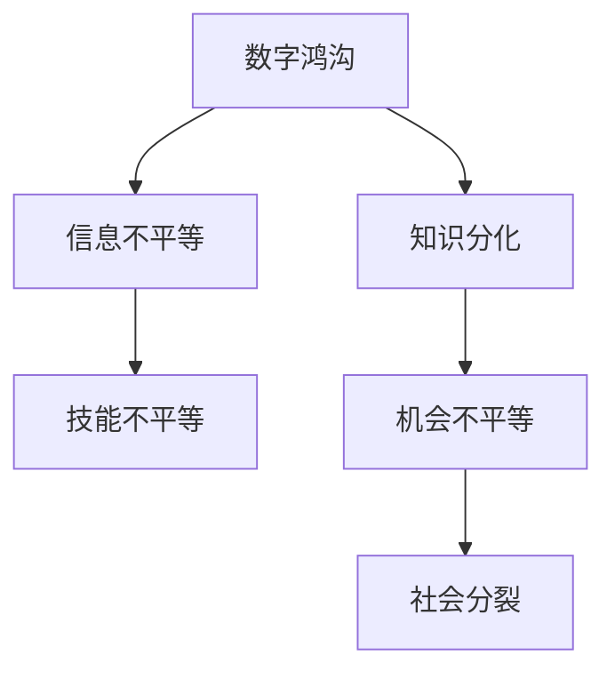

                 

## 1. 背景介绍

### 1.1 数字鸿沟的产生
随着数字技术的迅猛发展，计算能力已经成为推动经济社会发展的重要引擎。然而，数字技术的发展并没有为所有人带来平等的机会和收益。这种数字技术的普及过程中出现的不平等现象，被称为“数字鸿沟”。数字鸿沟不仅体现在经济上的差距，更体现在文化、教育、社会权利等方面的不平等待遇。

### 1.2 数字鸿沟的影响
数字鸿沟的存在导致了“知识分化”，即不同阶层、不同群体之间在知识获取、技能提升方面的差距。这对于社会的整体发展是极为不利的。数字鸿沟也会加剧社会的分裂和矛盾，阻碍知识的普及和交流，进而影响经济的长期增长。

## 2. 核心概念与联系

### 2.1 核心概念概述

为了更深入地理解数字鸿沟问题，我们将介绍几个与之紧密相关的核心概念：

- **数字鸿沟(Digital Divide)**：数字技术普及过程中不同群体之间的知识、技能和机会差距。
- **知识分化(Knowledge Divide)**：由于数字鸿沟，不同社会阶层之间在知识获取、技能提升方面的差距。
- **信息不平等(Information Inequality)**：不同群体获取信息的机会和资源不均衡。
- **技能不平等(Skill Inequality)**：由于信息不平等，不同群体在技术技能、创新能力方面的差距。
- **机会不平等(Opportunity Inequality)**：不同群体在职业发展、教育培训、社会参与等方面的机会差异。

这些概念之间存在着密切的联系，共同构成了人类计算中的公平问题。

### 2.2 核心概念原理和架构的 Mermaid 流程图


### 2.3 数字鸿沟与知识分化的关系
数字鸿沟的存在会导致知识分化。拥有先进技术设备和社会资源的人群，能够迅速获取和利用新知识，提升自身竞争力。而技术落后和资源匮乏的人群，则难以接触到最新的知识和技能，从而在社会竞争中处于劣势。

### 2.4 信息不平等与社会分裂的关系
信息不平等是数字鸿沟的直接体现，不同群体获取信息的机会和资源不均衡。信息的不平等会进一步加剧技能不平等和机会不平等，导致社会分裂。

### 2.5 技能不平等与机会不平等的联系
技能不平等是由于信息不平等导致的，拥有更多信息资源的人群，能够掌握更多的技术技能和创新能力。而技能不平等又会加剧机会不平等，技术高、知识丰富的人群更容易获得更好的职业机会和社会地位。

## 3. 核心算法原理 & 具体操作步骤
### 3.1 算法原理概述
解决数字鸿沟问题，需要综合应用多种技术手段，包括数据挖掘、机器学习、自然语言处理等。通过分析数据，可以揭示数字鸿沟的分布和影响因素，从而制定针对性的解决策略。

### 3.2 算法步骤详解

#### 3.2.1 数据收集与预处理
首先需要收集相关数据，这些数据可以来自政府统计、社交媒体、网络日志等渠道。数据收集后需要进行预处理，包括数据清洗、特征提取、数据归一化等。

#### 3.2.2 特征工程与模型训练
特征工程是数据分析的关键步骤，需要通过特征选择和特征工程，构建能够反映数字鸿沟的特征。常见的特征包括教育水平、收入水平、技术设备拥有率等。

在完成特征工程后，可以选择合适的机器学习模型进行训练，如随机森林、支持向量机、神经网络等。模型训练的目标是找到影响数字鸿沟的关键因素，并评估不同群体的风险和收益。

#### 3.2.3 结果分析与策略制定
模型训练完成后，需要对结果进行分析和解释，揭示数字鸿沟的分布和影响因素。基于分析结果，可以制定针对性的解决策略，如政策干预、资源倾斜、教育培训等。

### 3.3 算法优缺点

#### 3.3.1 优点
- **全面性**：通过数据分析可以全面揭示数字鸿沟的分布和影响因素。
- **客观性**：数据驱动的方法可以客观评估不同群体的风险和收益。
- **可操作性**：通过模型分析可以制定具体的解决策略，具有较高的可操作性。

#### 3.3.2 缺点
- **数据获取难度大**：高质量的数据获取需要大量人力和资源。
- **模型解释性差**：复杂的机器学习模型通常难以解释，难以理解其内部的决策逻辑。
- **适用范围有限**：不同地区的数字鸿沟情况各异，需要针对性地进行数据分析和策略制定。

### 3.4 算法应用领域
数字鸿沟分析方法可以应用于以下领域：

- **政府决策**：通过数据分析，政府可以制定更加公平和有效的政策，缩小数字鸿沟。
- **教育培训**：学校和培训机构可以根据分析结果，制定针对性的培训计划，提升技术技能。
- **企业人力资源**：企业可以识别数字鸿沟影响下的招聘和培训风险，优化人力资源管理。
- **非营利组织**：NGO可以基于数据分析，制定有针对性的援助和支持方案，改善弱势群体的生活条件。

## 4. 数学模型和公式 & 详细讲解 & 举例说明

### 4.1 数学模型构建
数字鸿沟的数学模型可以定义为：

$$
D = f(X, Y, Z)
$$

其中 $D$ 表示数字鸿沟，$X$ 表示个体特征，$Y$ 表示技术设备拥有情况，$Z$ 表示环境因素和社会资源。

### 4.2 公式推导过程

#### 4.2.1 特征选择
特征选择是数据分析的重要步骤，需要选择与数字鸿沟相关的特征。假设选择了 $m$ 个特征，记为 $F = \{x_1, x_2, ..., x_m\}$。

#### 4.2.2 特征工程
特征工程通过数据变换和模型选择，构建反映数字鸿沟的特征。常用的特征工程方法包括：

- 数据归一化：$x_i \rightarrow \frac{x_i - \mu}{\sigma}$
- 特征选择：使用信息增益、卡方检验等方法选择与数字鸿沟相关的特征
- 特征转换：使用PCA、LDA等方法对特征进行降维和转换

#### 4.2.3 模型训练
假设选择的模型为决策树，记为 $M$，通过训练模型来评估不同群体的风险和收益。训练过程如下：

$$
M = \arg\min_{M} \frac{1}{N}\sum_{i=1}^N L(M(x_i), y_i)
$$

其中 $L$ 表示损失函数，$N$ 表示样本数量。

### 4.3 案例分析与讲解

#### 4.3.1 案例背景
假设分析某地区数字鸿沟问题，数据包括年龄、性别、教育水平、收入水平、技术设备拥有率等。

#### 4.3.2 数据预处理
数据清洗：去除缺失值和异常值，保留有效的样本。

数据归一化：对特征进行归一化处理，使得数据在相同的量纲下进行分析。

#### 4.3.3 特征选择
选择教育水平、收入水平、技术设备拥有率等与数字鸿沟相关的特征。

#### 4.3.4 模型训练
使用随机森林模型进行训练，得到数字鸿沟的分布和影响因素。

#### 4.3.5 结果分析
分析结果显示，教育水平和收入水平对数字鸿沟的影响较大，技术设备拥有率也具有一定的影响。

## 5. 项目实践：代码实例和详细解释说明

### 5.1 开发环境搭建

#### 5.1.1 安装Python环境
首先需要安装Python环境，可以使用Anaconda或Miniconda进行Python的安装和配置。

#### 5.1.2 安装依赖包
使用pip安装所需依赖包，如numpy、pandas、scikit-learn等。

```bash
pip install numpy pandas scikit-learn
```

### 5.2 源代码详细实现

#### 5.2.1 数据加载
使用pandas加载数据，进行预处理和特征选择。

```python
import pandas as pd

# 加载数据
df = pd.read_csv('data.csv')

# 数据预处理
df = df.dropna()  # 去除缺失值
df = df.drop_duplicates()  # 去除重复数据

# 特征选择
features = ['education', 'income', 'device']
X = df[features]
y = df['digital_divide']
```

#### 5.2.2 特征工程
使用sklearn进行特征工程，包括数据归一化、特征选择等。

```python
from sklearn.preprocessing import StandardScaler
from sklearn.feature_selection import SelectKBest, f_classif

# 数据归一化
scaler = StandardScaler()
X = scaler.fit_transform(X)

# 特征选择
selector = SelectKBest(f_classif, k=3)
X = selector.fit_transform(X, y)
```

#### 5.2.3 模型训练
使用scikit-learn的决策树模型进行训练，评估数字鸿沟的影响因素。

```python
from sklearn.ensemble import RandomForestClassifier

# 训练模型
model = RandomForestClassifier()
model.fit(X, y)
```

### 5.3 代码解读与分析

#### 5.3.1 数据加载
使用pandas加载数据，进行预处理和特征选择。数据预处理包括去除缺失值和重复数据，特征选择选择与数字鸿沟相关的特征。

#### 5.3.2 特征工程
使用sklearn进行特征工程，包括数据归一化和特征选择。数据归一化可以使得数据在相同的量纲下进行分析，特征选择可以选择与数字鸿沟相关的特征。

#### 5.3.3 模型训练
使用scikit-learn的随机森林模型进行训练，评估数字鸿沟的影响因素。训练过程中需要选择合适的模型参数，如决策树的深度、节点数等。

### 5.4 运行结果展示

#### 5.4.1 模型训练结果
训练结果显示了数字鸿沟的分布和影响因素。根据分析结果，可以制定针对性的解决策略，如教育培训、资源倾斜等。

#### 5.4.2 结果可视化
使用matplotlib进行结果可视化，展示数字鸿沟的分布和影响因素。

```python
import matplotlib.pyplot as plt

# 绘制数字鸿沟分布图
plt.hist(y, bins=10)
plt.xlabel('Digital Divide')
plt.ylabel('Frequency')
plt.title('Distribution of Digital Divide')
plt.show()

# 绘制特征与数字鸿沟的关系图
plt.scatter(X[:, 0], y)
plt.xlabel('Education Level')
plt.ylabel('Digital Divide')
plt.title('Education Level vs. Digital Divide')
plt.show()
```

## 6. 实际应用场景

### 6.1 政府决策

#### 6.1.1 应用场景
政府可以通过数字鸿沟分析，制定更加公平和有效的政策，缩小数字鸿沟。例如，可以制定针对低收入家庭的数字设备普及计划，提升他们的数字技能。

#### 6.1.2 案例分析
某国政府通过对数字鸿沟的数据分析，发现低收入家庭和农村地区的数字鸿沟较为严重。政府决定在低收入家庭和农村地区实施数字设备普及计划，提供免费的互联网接入和培训课程。

### 6.2 教育培训

#### 6.2.1 应用场景
学校和培训机构可以通过数字鸿沟分析，制定针对性的培训计划，提升技术技能。例如，可以为低收入家庭的学生提供免费的计算机课程，提升他们的数字技能。

#### 6.2.2 案例分析
某大学通过对学生数字鸿沟的数据分析，发现部分学生的数字技能较差。大学决定提供免费的计算机课程，并安排针对性的培训计划，帮助这些学生提升数字技能。

### 6.3 企业人力资源

#### 6.3.1 应用场景
企业可以通过数字鸿沟分析，识别招聘和培训风险，优化人力资源管理。例如，可以通过数字鸿沟分析，优化招聘流程，避免因数字鸿沟带来的招聘风险。

#### 6.3.2 案例分析
某公司通过对员工数字鸿沟的数据分析，发现部分员工的技术技能较差。公司决定提供免费的培训课程，并调整招聘流程，确保招聘到具备基本数字技能的员工。

### 6.4 非营利组织

#### 6.4.1 应用场景
NGO可以基于数字鸿沟分析，制定有针对性的援助和支持方案，改善弱势群体的生活条件。例如，可以为低收入家庭提供免费的数字设备，提升他们的数字技能。

#### 6.4.2 案例分析
某NGO通过对低收入家庭数字鸿沟的数据分析，发现数字技能较差。NGO决定提供免费的数字设备，并安排针对性的培训课程，帮助这些家庭提升数字技能。

## 7. 工具和资源推荐

### 7.1 学习资源推荐

#### 7.1.1 数字鸿沟分析的书籍
- 《数字鸿沟：数字技术普及与信息不平等》
- 《知识分化：信息不平等与技能提升》

#### 7.1.2 数字鸿沟分析的在线课程
- Coursera上的“数字鸿沟分析”课程
- edX上的“信息不平等与社会公平”课程

### 7.2 开发工具推荐

#### 7.2.1 数据分析工具
- Python：使用pandas、numpy等库进行数据处理和分析
- R：使用ggplot2等库进行数据可视化
- SQL：使用MySQL、PostgreSQL等数据库进行数据存储和管理

#### 7.2.2 机器学习工具
- Scikit-learn：使用随机森林、支持向量机等算法进行模型训练
- TensorFlow：使用深度学习模型进行特征提取和分类
- PyTorch：使用深度学习模型进行特征提取和分类

### 7.3 相关论文推荐

#### 7.3.1 数字鸿沟分析的论文
- 《数字鸿沟：技术普及与信息不平等》
- 《知识分化：信息不平等与技能提升》

#### 7.3.2 机器学习在数字鸿沟分析中的应用
- 《基于机器学习的数字鸿沟分析》
- 《数据驱动的数字鸿沟研究》

## 8. 总结：未来发展趋势与挑战

### 8.1 研究成果总结
数字鸿沟分析已经成为解决数字技术普及问题的有力工具。通过数据分析和模型训练，可以揭示数字鸿沟的分布和影响因素，制定针对性的解决策略。未来，数字鸿沟分析还将与人工智能、大数据等技术进行深度融合，提升分析和预测的准确性和全面性。

### 8.2 未来发展趋势
数字鸿沟分析的未来发展趋势包括以下几个方面：

#### 8.2.1 数据来源多元化
数字鸿沟分析将从单一数据源向多元数据源扩展，结合社交媒体、传感器数据、卫星数据等，进行全面分析。

#### 8.2.2 分析方法多样化
数字鸿沟分析将结合机器学习、深度学习、自然语言处理等方法，进行更加全面和深入的分析。

#### 8.2.3 数据可视化高级化
数字鸿沟分析将结合高级数据可视化工具，如Tableau、Power BI等，进行更加直观和易于理解的数据展示。

#### 8.2.4 分析结果应用智能化
数字鸿沟分析将结合人工智能技术，提供智能化的决策支持，帮助政府、企业、NGO制定更加科学和有效的策略。

### 8.3 面临的挑战

#### 8.3.1 数据获取难度大
高质量的数据获取需要大量人力和资源，数据质量和完整性难以保证。

#### 8.3.2 模型解释性差
复杂的机器学习模型通常难以解释，难以理解其内部的决策逻辑。

#### 8.3.3 适用范围有限
不同地区的数字鸿沟情况各异，需要针对性地进行数据分析和策略制定。

#### 8.3.4 数据隐私保护
数字鸿沟分析需要处理大量敏感数据，需要采取措施保障数据隐私和安全。

### 8.4 研究展望
未来的数字鸿沟分析研究将注重以下几个方向：

#### 8.4.1 大数据分析技术
结合大数据分析技术，进行更加全面和深入的数字鸿沟分析。

#### 8.4.2 人工智能技术
结合人工智能技术，提供智能化的决策支持，提升分析的准确性和实用性。

#### 8.4.3 跨领域融合
结合计算机科学、社会学、心理学等领域的知识，进行更加全面和深入的分析。

#### 8.4.4 社会公平研究
关注数字鸿沟对社会公平的影响，提出公平和可行的解决策略。

## 9. 附录：常见问题与解答

### 9.1 常见问题

#### 9.1.1 数字鸿沟与知识分化的关系
数字鸿沟与知识分化密切相关，拥有先进技术设备和社会资源的人群，能够迅速获取和利用新知识，提升自身竞争力。而技术落后和资源匮乏的人群，则难以接触到最新的知识和技能，从而在社会竞争中处于劣势。

#### 9.1.2 数字鸿沟的解决方法
解决数字鸿沟问题需要综合应用多种技术手段，包括政策干预、资源倾斜、教育培训等。政府、企业、NGO等各方需要共同努力，制定针对性的解决策略，缩小数字鸿沟。

#### 9.1.3 数字鸿沟的影响因素
数字鸿沟的影响因素包括教育水平、收入水平、技术设备拥有率、环境因素和社会资源等。不同地区和群体的数字鸿沟情况各异，需要针对性地进行分析和解决。

### 9.2 解答

#### 9.2.1 数字鸿沟与知识分化的关系
数字鸿沟的存在会导致知识分化。拥有先进技术设备和社会资源的人群，能够迅速获取和利用新知识，提升自身竞争力。而技术落后和资源匮乏的人群，则难以接触到最新的知识和技能，从而在社会竞争中处于劣势。

#### 9.2.2 数字鸿沟的解决方法
解决数字鸿沟问题需要综合应用多种技术手段，包括政策干预、资源倾斜、教育培训等。政府、企业、NGO等各方需要共同努力，制定针对性的解决策略，缩小数字鸿沟。

#### 9.2.3 数字鸿沟的影响因素
数字鸿沟的影响因素包括教育水平、收入水平、技术设备拥有率、环境因素和社会资源等。不同地区和群体的数字鸿沟情况各异，需要针对性地进行分析和解决。

---

作者：禅与计算机程序设计艺术 / Zen and the Art of Computer Programming

