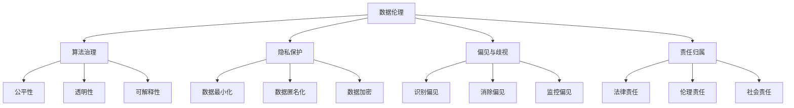

                 

# 数据伦理：算法治理与规范

## 1. 背景介绍

在数字化时代的浪潮中，数据已经成为驱动技术创新和社会发展的核心要素。从商业决策、医疗健康到公共政策，数据在各个领域的应用日益广泛，为人们带来了前所未有的便利和机遇。然而，数据的应用并非没有边界。随着数据的不断积累和深化应用，数据伦理问题愈发凸显，对数据治理和算法规范提出了新的挑战。本文将深入探讨数据伦理的核心议题，分析其在算法治理中的应用，并提出具体的规范建议。

## 2. 核心概念与联系

### 2.1 核心概念概述

在深入探讨数据伦理问题之前，有必要首先理解相关的核心概念。

- **数据伦理**：是指在数据收集、存储、处理和分享等各个环节中，遵循的道德原则和规范，确保数据的公正、透明和安全使用。
- **算法治理**：涉及算法设计、开发、部署和使用过程中的伦理和合规问题，旨在保障算法的公平性、透明性和可解释性。
- **隐私保护**：涉及如何在数据处理和分析中保护个人隐私，防止数据滥用和误用。
- **偏见与歧视**：指算法在训练和使用过程中可能引入的不公平偏见，导致对某些群体的歧视。
- **责任归属**：涉及在算法决策出现错误或滥用时，如何界定责任和承担相应的法律和社会责任。

这些概念相互关联，共同构成了数据伦理和算法治理的复杂体系。理解这些概念及其联系，对于构建公正、透明、安全的算法系统至关重要。

### 2.2 核心概念原理和架构的 Mermaid 流程图



## 3. 核心算法原理 & 具体操作步骤

### 3.1 算法原理概述

数据伦理和算法治理的原理，主要涉及如何在数据处理和算法设计中遵循伦理原则，确保数据使用的公正、透明和安全，避免偏见和歧视，明确责任归属。这不仅是一个技术问题，更是一个社会问题。

### 3.2 算法步骤详解

#### 3.2.1 数据收集与处理

- **数据源选择**：确保数据来源合法，避免非法收集和使用。
- **数据清洗**：去除重复、错误、不完整的数据，确保数据质量。
- **数据匿名化**：对个人数据进行匿名化处理，防止数据泄露和滥用。
- **数据最小化**：只收集和使用必要的数据，避免过度收集。

#### 3.2.2 算法设计

- **公平性**：确保算法在处理数据时不引入偏见，对所有群体公平对待。
- **透明性**：算法设计应尽量简单直观，便于理解和解释。
- **可解释性**：提供算法的决策依据，使用户和监管机构能够理解算法如何做出决策。

#### 3.2.3 算法部署与使用

- **监测与评估**：定期监测算法性能和数据使用情况，及时发现和纠正问题。
- **责任界定**：明确算法责任归属，确保在出现错误或滥用时能够追溯和问责。

### 3.3 算法优缺点

#### 3.3.1 优点

- **促进公平与透明**：数据伦理和算法治理可以确保算法设计和使用过程中的公正性，提高透明度。
- **保障隐私与安全**：通过数据匿名化和最小化处理，可以有效保护个人隐私，防止数据滥用。
- **避免偏见与歧视**：通过识别和消除算法中的偏见，可以避免对特定群体的歧视。

#### 3.3.2 缺点

- **实施复杂**：数据伦理和算法治理需要多方面的协调与合作，实施复杂。
- **成本高昂**：合规和治理措施的实施需要较高的成本和技术支持。
- **技术挑战**：如何设计和实现具有公平性、透明性和可解释性的算法，仍然是一个技术挑战。

### 3.4 算法应用领域

数据伦理和算法治理的应用领域非常广泛，涉及政府、企业、医疗、金融等多个行业。例如：

- **政府决策**：在公共政策的制定中，确保数据和算法的公正使用，避免偏见和歧视。
- **医疗健康**：在医疗诊断和治疗方案中，确保数据和算法的公平透明，保护患者隐私。
- **金融服务**：在风险评估和贷款审批中，确保算法的公平性，避免歧视性决策。
- **商业应用**：在市场分析和客户画像中，确保数据和算法的合规使用，防止滥用。

## 4. 数学模型和公式 & 详细讲解 & 举例说明

### 4.1 数学模型构建

在数据伦理和算法治理中，数学模型主要用来衡量算法的公平性和透明性。常见的数学模型包括：

- **公平性评估模型**：如均等机会模型、反事实公平模型等，用于衡量算法在不同群体中的公平性。
- **透明度评估模型**：如特征重要性模型、可解释性模型等，用于衡量算法的透明性和可解释性。

### 4.2 公式推导过程

以均等机会模型为例，假设有一个分类算法 $f$，输入特征为 $x$，输出为 $y$。公平性定义为所有群体的预测错误率相等，即：

$$
P(f(x)|y=1) = P(f(x)|y=0)
$$

其中 $P(f(x)|y=1)$ 表示正类样本中预测错误的概率，$P(f(x)|y=0)$ 表示负类样本中预测错误的概率。

### 4.3 案例分析与讲解

假设有一个贷款审批算法，输入特征包括性别、年龄、收入等，输出为贷款是否通过。假设样本中男性和女性各占50%，但在贷款通过率上存在显著差异。可以采用均等机会模型评估该算法的公平性：

1. 首先，将样本按性别分组，计算每个组中贷款通过率。
2. 然后，计算两个组之间的差异，如果差异超过预设阈值，则认为算法存在性别偏见。
3. 最后，调整算法参数，消除性别偏见，确保公平性。

## 5. 项目实践：代码实例和详细解释说明

### 5.1 开发环境搭建

为了进行数据伦理和算法治理的实践，我们需要一个高效的开发环境。常用的开发环境包括：

- **Python**：Python是数据科学和机器学习的主要编程语言，提供了丰富的库和框架。
- **R**：R是一种专门用于数据分析和统计的编程语言，广泛应用于数据科学领域。
- **Jupyter Notebook**：Jupyter Notebook是一种交互式编程环境，支持Python、R等多种语言。

### 5.2 源代码详细实现

以下是一个基于Python的数据伦理和算法治理实践代码示例：

```python
import pandas as pd
from sklearn.preprocessing import StandardScaler
from sklearn.linear_model import LogisticRegression
from sklearn.metrics import accuracy_score
from sklearn.model_selection import train_test_split

# 加载数据
data = pd.read_csv('loan_data.csv')

# 数据预处理
features = ['gender', 'age', 'income']
target = 'approved'
X = data[features]
y = data[target]
X_train, X_test, y_train, y_test = train_test_split(X, y, test_size=0.2, random_state=42)

# 特征标准化
scaler = StandardScaler()
X_train = scaler.fit_transform(X_train)
X_test = scaler.transform(X_test)

# 模型训练与评估
model = LogisticRegression()
model.fit(X_train, y_train)
y_pred = model.predict(X_test)
accuracy = accuracy_score(y_test, y_pred)
print(f"Accuracy: {accuracy:.2f}")
```

### 5.3 代码解读与分析

以上代码示例展示了如何通过Python进行数据伦理和算法治理的实践。具体步骤如下：

1. **数据加载**：使用Pandas库加载贷款数据集。
2. **数据预处理**：选择性别、年龄和收入作为特征，贷款是否通过为目标变量。
3. **数据分割**：将数据集划分为训练集和测试集。
4. **特征标准化**：使用StandardScaler对特征进行标准化处理，确保特征尺度一致。
5. **模型训练**：使用LogisticRegression进行模型训练。
6. **模型评估**：计算模型在测试集上的准确率。

### 5.4 运行结果展示

运行以上代码，输出准确率指标，评估模型的公平性和性能。

## 6. 实际应用场景

### 6.1 智能推荐系统

智能推荐系统广泛应用于电商、视频、音乐等平台，通过分析用户行为数据和商品特征，为用户推荐个性化内容。然而，推荐算法可能会引入偏见，导致对特定群体的不公平对待。因此，在推荐系统的设计和部署中，应引入数据伦理和算法治理原则，确保算法的公平性和透明性。

### 6.2 医疗诊断系统

医疗诊断系统通过分析患者的病历和检查结果，辅助医生进行疾病诊断和治疗方案的决策。然而，医疗数据涉及个人隐私和健康信息，必须严格遵守数据伦理和隐私保护原则。同时，诊断算法必须避免引入偏见，确保对所有患者的公平对待。

### 6.3 金融风控系统

金融风控系统通过分析客户的信用历史、收入水平等信息，评估客户的信用风险，决定是否批准贷款。然而，信用评分算法可能会对低收入群体产生偏见，导致不公平的信贷决策。因此，在设计金融风控系统时，必须引入数据伦理和算法治理原则，确保算法的公平性和透明性。

### 6.4 未来应用展望

随着人工智能技术的不断发展，数据伦理和算法治理的应用前景将更加广阔。未来，算法治理将更多地融入到系统的各个环节，从数据收集、特征选择、模型训练到模型部署，每个步骤都将受到伦理和合规的监督。此外，随着技术的进步，数据伦理和算法治理将更多地借助自动化和智能化手段，提高效率和效果。

## 7. 工具和资源推荐

### 7.1 学习资源推荐

- **《数据伦理与隐私保护》**：该书系统介绍了数据伦理和隐私保护的基本概念和实践方法，适合初学者和专业人士阅读。
- **《算法治理：理论与实践》**：该书深入探讨了算法设计和使用的伦理和合规问题，提供了具体的实践案例和建议。
- **《Python数据科学手册》**：该书介绍了Python在数据科学中的应用，包括数据预处理、特征工程、模型训练等。

### 7.2 开发工具推荐

- **TensorFlow**：TensorFlow是Google开发的开源深度学习框架，支持分布式计算和模型训练。
- **PyTorch**：PyTorch是Facebook开发的开源深度学习框架，具有动态计算图和易用性。
- **Jupyter Notebook**：Jupyter Notebook是一种交互式编程环境，支持Python、R等多种语言。

### 7.3 相关论文推荐

- **"Fairness and Accountability in AI: Integrating Interpretability, Accountability, and Inclusivity into Machine Learning"**：该论文探讨了AI中的公平性和可解释性问题，提供了具体的技术方案和应用案例。
- **"Algorithmic Fairness, Responsibility, and Accountability: Ensuring Trust in AI Systems"**：该论文系统介绍了算法公平性、责任和问责机制的理论和实践。
- **"Data Privacy in Machine Learning: Survey of Recent Advances"**：该论文综述了数据隐私保护的技术进展，介绍了具体的隐私保护方法和工具。

## 8. 总结：未来发展趋势与挑战

### 8.1 研究成果总结

数据伦理和算法治理的研究已经取得了一些重要的成果，包括：

- **公平性评估方法**：如均等机会模型、反事实公平模型等，为评估算法的公平性提供了理论基础。
- **透明性增强技术**：如特征重要性模型、可解释性模型等，提高了算法的透明性和可解释性。
- **隐私保护技术**：如数据匿名化、差分隐私等，保障了个人隐私和数据安全。

### 8.2 未来发展趋势

未来，数据伦理和算法治理将呈现以下几个发展趋势：

- **自动化与智能化**：借助自动化和智能化手段，提高数据伦理和算法治理的效率和效果。
- **跨领域融合**：与其他领域的伦理和治理机制进行融合，提升系统的综合性和可持续性。
- **标准与规范**：制定和推广数据伦理和算法治理的标准和规范，形成行业共识。

### 8.3 面临的挑战

尽管数据伦理和算法治理研究取得了一定的进展，但仍面临诸多挑战：

- **技术复杂性**：如何在技术上实现公平性、透明性和隐私保护，仍然是一个复杂的问题。
- **合规与法律**：如何在不同国家和地区遵守数据隐私和伦理法规，是一个重要的挑战。
- **利益冲突**：如何在数据的使用和保护之间找到平衡，是一个复杂的伦理问题。

### 8.4 研究展望

未来的研究需要在以下几个方面寻求新的突破：

- **技术创新**：开发新的算法和模型，解决数据伦理和算法治理中的技术难题。
- **法规制定**：制定和完善数据伦理和算法治理的法律法规，提供可操作的指导和规范。
- **跨领域合作**：与其他学科和领域进行跨学科合作，共同推动数据伦理和算法治理的发展。

## 9. 附录：常见问题与解答

**Q1：数据伦理和算法治理如何与现有的法律法规相融合？**

A: 数据伦理和算法治理的研究成果可以与现有的法律法规相结合，为法律法规的制定和实施提供技术支持。例如，欧盟的《通用数据保护条例》（GDPR）就对数据隐私和伦理提出了明确的要求，与数据伦理和算法治理的研究方向不谋而合。

**Q2：如何在数据集构建阶段避免偏见？**

A: 在数据集构建阶段，可以采用多样性和代表性强的数据源，避免数据集偏向于特定群体。同时，可以通过数据预处理技术，如平衡数据集、去除偏见数据等，进一步减少数据中的偏见。

**Q3：如何评估算法的透明性和可解释性？**

A: 可以使用特征重要性模型、可解释性模型等方法，评估算法的透明性和可解释性。具体来说，可以通过特征重要性排序、局部可解释性模型等技术，帮助用户理解算法的决策过程。

**Q4：如何在确保隐私的同时，利用数据进行公平性评估？**

A: 可以使用差分隐私技术，在数据发布前对数据进行匿名化和去标识化处理，确保隐私保护。同时，在数据处理和分析过程中，可以采用公平性评估模型，确保算法对所有群体的公平对待。

**Q5：如何在算法决策过程中确保责任归属？**

A: 可以在算法设计和部署过程中，明确算法责任归属，确保在出现错误或滥用时能够追溯和问责。同时，可以引入第三方审计和监督机制，定期对算法进行评估和审查，确保算法的合规性和公平性。

---

作者：禅与计算机程序设计艺术 / Zen and the Art of Computer Programming

