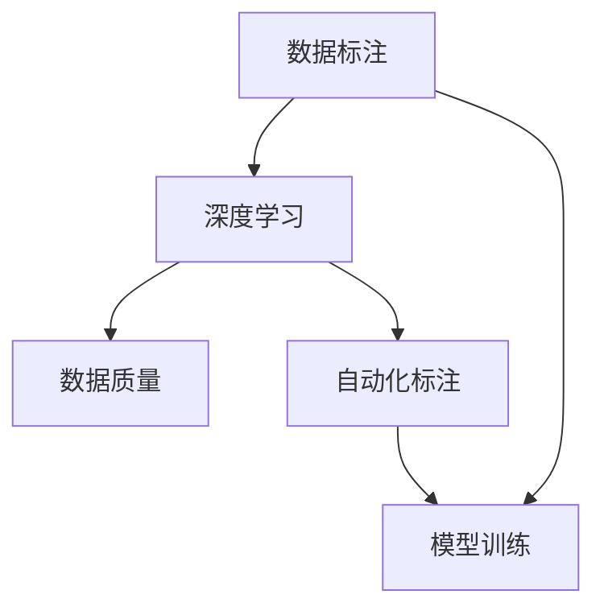

                 

# 数据标注：人工智能发展背后的无名英雄

> 关键词：数据标注,人工智能,深度学习,模型训练,深度学习,人机协同

## 1. 背景介绍

### 1.1 问题由来
在人工智能(AI)的发展过程中，数据标注作为人工智能训练的重要环节，长期以来被视为“幕后英雄”，尽管其对AI系统的性能、质量和应用效果有着至关重要的影响。在过去数十年中，尽管AI技术得到了迅猛发展，但数据标注这一基础环节的瓶颈问题依然未能得到充分关注和解决。

数据标注不仅耗费大量的人力物力，而且在标注质量和一致性方面也存在诸多挑战。错误的标注数据会导致模型学习错误的特征，从而影响模型的泛化能力和预测准确率。然而，在商业化和工程化的过程中，数据标注往往被忽视，成为了制约AI系统应用场景拓展和技术创新的关键因素。

### 1.2 问题核心关键点
数据标注的核心关键点在于：
- 如何有效地获取高质量标注数据。
- 如何在保证标注数据量的同时，确保标注一致性和准确性。
- 如何自动生成标注数据，减少人工干预，降低成本。
- 如何优化标注流程，提高标注效率和标注质量。

这些问题不仅影响到AI系统的训练效果，也决定着AI技术的落地应用范围和实际效益。因此，深入研究和解决数据标注问题，对于推动AI技术的可持续发展具有重要意义。

### 1.3 问题研究意义
数据标注问题的研究和解决对于AI技术的推广和应用具有重要的现实意义：

1. **降低开发成本**：高质量标注数据的获取和维护成本高昂，通过优化标注流程和引入自动化工具，可以有效降低标注成本。
2. **提升模型质量**：标注数据的质量直接决定模型的泛化能力，通过改进标注方法，可以显著提升模型的预测准确率和鲁棒性。
3. **加速技术创新**：标注技术的发展直接推动AI技术的迭代和创新，可以加速新技术在更多领域的落地应用。
4. **促进产业升级**：标注数据的质量和技术直接影响AI产品的市场竞争力和用户体验，对于推动AI产业的转型升级具有重要价值。
5. **保障数据安全**：标注数据的隐私和安全问题需要高度重视，保证数据标注过程的安全性和合规性，避免数据泄露和滥用。

## 2. 核心概念与联系

### 2.1 核心概念概述

为更好地理解数据标注在人工智能发展中的作用和重要性，本节将介绍几个关键概念：

- 数据标注（Data Annotation）：指通过人工或半自动化的方式，为数据集中的每个样本添加必要的标签或注释。数据标注是机器学习模型的重要前提，直接影响模型的训练效果和应用性能。
- 深度学习（Deep Learning）：以深度神经网络为基础，通过大量标注数据进行训练，使得模型能够学习和提取数据的复杂特征，并实现高效的分类、识别、生成等任务。
- 模型训练（Model Training）：通过有监督学习或无监督学习的方式，利用标注数据集对深度学习模型进行迭代优化，使其能够泛化到新数据上。
- 数据质量（Data Quality）：指数据标注的准确性、一致性、完整性等指标，直接影响模型的训练效果和泛化能力。
- 自动化标注（Automated Annotation）：利用计算机视觉、自然语言处理等技术，对大量数据自动进行标注，以减少人工标注的工作量和成本。

这些概念之间的联系可以通过以下Mermaid流程图来展示：



这个流程图展示了几者之间的逻辑关系：

1. 数据标注是深度学习模型的前提。
2. 数据标注的准确性直接影响模型的训练效果。
3. 自动化标注技术可以降低人工标注成本。
4. 数据质量控制是保证模型泛化能力的关键。

这些概念共同构成了数据标注在人工智能中的重要地位，理解这些概念是解决数据标注问题的关键。

## 3. 核心算法原理 & 具体操作步骤

### 3.1 算法原理概述

数据标注的目的是通过标注数据，为深度学习模型提供输入-输出对，以便模型能够学习和提取数据中的特征。其核心算法原理如下：

1. **数据获取**：从现实世界中收集原始数据，如文本、图像、语音等。
2. **数据清洗**：对原始数据进行预处理，去除噪声和冗余信息，确保数据质量。
3. **标注设计**：设计合适的标注方式，包括标签体系、标注格式、标注规则等，确保标注的一致性和准确性。
4. **标注执行**：通过人工标注或半自动化工具，对数据集中的每个样本进行标注。
5. **标注验证**：对标注结果进行验证，确保标注数据的准确性和一致性。
6. **标注整合**：将标注数据整合成训练集，用于深度学习模型的训练。

### 3.2 算法步骤详解

数据标注的完整流程可以概括为以下几个关键步骤：

**Step 1: 数据收集**
- 从网络、数据库、传感器等渠道获取原始数据。
- 对原始数据进行初步筛选，剔除噪声、冗余、重复数据。

**Step 2: 数据清洗**
- 对数据进行格式转换、去重、标准化等预处理。
- 识别和修正数据中的错误、缺失信息。
- 去除可能影响模型训练的数据噪声和干扰因素。

**Step 3: 标注设计**
- 设计合理的标注体系，如类别、属性、实体等。
- 确定标注格式，如文本、图像、音视频等。
- 制定详细的标注规则和标准，确保标注的一致性。

**Step 4: 标注执行**
- 选择合适的标注工具，如Labelbox、CrowdFlower等。
- 分配标注任务，按项目或时间周期进行任务划分。
- 培训标注员，确保标注员熟悉标注体系和规则。
- 对数据进行标注，生成标注数据集。

**Step 5: 标注验证**
- 随机抽取部分标注数据，进行人工验证。
- 对比标注结果与标注员标注，发现并纠正标注错误。
- 计算标注一致性指标，如Cohen's Kappa系数、F1分数等。

**Step 6: 标注整合**
- 将经过验证的标注数据进行整合，形成训练集、验证集和测试集。
- 将标注数据输入深度学习模型，进行模型训练和验证。
- 对模型进行调优和优化，提升模型的性能和泛化能力。

### 3.3 算法优缺点

数据标注的优点包括：
1. 提供高质量的训练数据，保证模型学习到的特征具有代表性。
2. 确保模型具有较好的泛化能力，能够在各种场景下进行有效推理和预测。
3. 降低模型对数据的假设限制，使其能够处理复杂多样化的数据类型。

然而，数据标注也存在一些缺点：
1. 成本高昂：人工标注需要大量时间和人力，且标注质量难以保证。
2. 标注一致性：不同标注员之间可能存在标注偏差，影响模型的泛化能力。
3. 数据量有限：高质量标注数据的获取困难，难以满足大规模深度学习模型的需求。
4. 动态更新：数据标注过程复杂，难以快速响应数据分布变化。

### 3.4 算法应用领域

数据标注在多个领域得到了广泛应用，例如：

- 计算机视觉：图像分类、目标检测、人脸识别等任务。
- 自然语言处理：文本分类、命名实体识别、机器翻译等任务。
- 语音识别：语音转写、情感分析、语音生成等任务。
- 医疗影像：疾病诊断、医学图像分析等任务。
- 自动驾驶：场景理解、行为预测、路径规划等任务。
- 金融风控：信用评估、欺诈检测、交易分析等任务。
- 物联网：设备监控、异常检测、智能家居等任务。

这些领域中，数据标注技术的应用不仅提升了模型的性能，还推动了相关行业的技术进步和产业升级。

## 4. 数学模型和公式 & 详细讲解

### 4.1 数学模型构建

在深度学习模型训练中，数据标注的质量直接影响模型的训练效果和性能。因此，我们需要使用数学模型来描述数据标注的完整过程，并确保标注数据的一致性和准确性。

假设我们有一组标注数据集 $D=\{(x_i, y_i)\}_{i=1}^N$，其中 $x_i$ 为原始数据样本，$y_i$ 为对应的标注标签。我们将数据标注过程分为三个主要阶段：

1. **标注设计**：定义标签体系 $\mathcal{Y}$，并设计标注格式和规则。
2. **标注执行**：标注员根据规则对每个样本 $x_i$ 进行标注 $y_i$。
3. **标注验证**：通过随机抽取和人工验证，对标注结果进行修正和纠正。

### 4.2 公式推导过程

对于标注设计阶段，我们引入一个先验概率分布 $p(y|x)$ 来描述标注标签的条件概率。在标注执行阶段，标注员根据主观判断生成一个标注结果 $y_i$，并引入一个标注员的标注能力 $q(y_i|x_i)$ 来描述标注员的能力水平。在标注验证阶段，我们通过随机抽取 $m$ 个样本进行人工验证，得到验证结果 $\hat{y}_i$，并引入一个验证器的验证能力 $p(\hat{y}_i|y_i)$ 来描述验证器的准确性。

因此，数据标注的数学模型可以表示为：

$$
p(\hat{y}_i|y_i) = \int q(y_i|x_i) p(y_i|x_i) \mathrm{d}y_i
$$

其中 $q(y_i|x_i)$ 表示标注员的标注能力，$p(y_i|x_i)$ 表示数据 $x_i$ 的条件概率分布，$p(\hat{y}_i|y_i)$ 表示验证器的验证能力。

### 4.3 案例分析与讲解

以图像分类任务为例，假设我们有一组图像数据集 $D=\{(x_i, y_i)\}_{i=1}^N$，其中 $x_i$ 为图像，$y_i$ 为图像所属的类别标签。在标注设计阶段，我们可以定义一个基于One-Hot编码的标签体系 $\mathcal{Y}$，并设计一个二分类任务，即每张图像属于两个预定义的类别之一。

在标注执行阶段，标注员根据图像的视觉特征，给出对应的类别标签 $y_i \in \mathcal{Y}$。例如，标注员可能会根据图像中是否存在人脸来生成 $y_i=0$ 或 $y_i=1$。

在标注验证阶段，我们随机抽取部分样本进行人工验证，并与标注员标注结果进行比对。例如，如果标注员将一张包含车标的图像错误地标注为“汽车”类别，但实际中车标表示的是“轿车”，则我们需要修正这个标注错误，确保标注结果的一致性和准确性。

## 5. 项目实践：代码实例和详细解释说明

### 5.1 开发环境搭建

在进行数据标注的实践前，我们需要准备好开发环境。以下是使用Python进行PyTorch开发的环境配置流程：

1. 安装Anaconda：从官网下载并安装Anaconda，用于创建独立的Python环境。

2. 创建并激活虚拟环境：
```bash
conda create -n pytorch-env python=3.8 
conda activate pytorch-env
```

3. 安装PyTorch：根据CUDA版本，从官网获取对应的安装命令。例如：
```bash
conda install pytorch torchvision torchaudio cudatoolkit=11.1 -c pytorch -c conda-forge
```

4. 安装各类工具包：
```bash
pip install numpy pandas scikit-learn matplotlib tqdm jupyter notebook ipython
```

完成上述步骤后，即可在`pytorch-env`环境中开始数据标注实践。

### 5.2 源代码详细实现

这里我们以图像分类任务为例，给出使用PyTorch进行数据标注的PyTorch代码实现。

首先，定义数据处理函数：

```python
from torchvision import datasets, transforms

def get_train_data():
    train_dataset = datasets.ImageFolder(root='train_data', transform=transforms.ToTensor())
    return train_dataset

def get_test_data():
    test_dataset = datasets.ImageFolder(root='test_data', transform=transforms.ToTensor())
    return test_dataset
```

然后，定义标注函数：

```python
def annotate_image(image_path, label):
    image = datasets.ImageFolder(root='train_data', transform=transforms.ToTensor()).get_image(image_path)
    image.save('annotated_' + image_path, format='JPEG')
    image_path = 'annotated_' + image_path
    return image_path, label

def annotate_images(image_paths, labels):
    annotated_paths = []
    for image_path, label in zip(image_paths, labels):
        annotated_path, new_label = annotate_image(image_path, label)
        annotated_paths.append(annotated_path)
    return annotated_paths, labels
```

接着，定义训练和评估函数：

```python
from torch.utils.data import DataLoader
from sklearn.metrics import accuracy_score

def train_model(model, train_loader, optimizer, epochs):
    model.train()
    for epoch in range(epochs):
        for images, labels in train_loader:
            optimizer.zero_grad()
            outputs = model(images)
            loss = F.cross_entropy(outputs, labels)
            loss.backward()
            optimizer.step()
    return model

def evaluate_model(model, test_loader):
    model.eval()
    correct = 0
    total = 0
    with torch.no_grad():
        for images, labels in test_loader:
            outputs = model(images)
            _, predicted = torch.max(outputs, 1)
            total += labels.size(0)
            correct += (predicted == labels).sum().item()
    return accuracy_score(labels, predicted)
```

最后，启动训练流程并在测试集上评估：

```python
model = SomeModel()

train_loader = DataLoader(get_train_data(), batch_size=32)
test_loader = DataLoader(get_test_data(), batch_size=32)

optimizer = torch.optim.Adam(model.parameters(), lr=0.001)
epochs = 10

trained_model = train_model(model, train_loader, optimizer, epochs)
accuracy = evaluate_model(trained_model, test_loader)
print('Accuracy:', accuracy)
```

以上就是使用PyTorch对图像分类任务进行数据标注的完整代码实现。可以看到，利用PyTorch的强大功能和丰富的工具库，我们可以方便地实现数据标注的各个环节，大大提高了标注效率。

### 5.3 代码解读与分析

让我们再详细解读一下关键代码的实现细节：

**get_train_data函数**：
- 使用`datasets.ImageFolder`加载图像数据集，通过`transforms.ToTensor()`将图像转换为Tensor格式，方便模型处理。
- 返回一个数据加载器，可用于模型训练。

**annotate_image函数**：
- 定义一个函数，将图像标注成指定的类别，并保存为标注后的图像。
- 函数返回标注后的图像路径和对应的标签。

**annotate_images函数**：
- 批量处理多张图像，并按顺序对它们进行标注。
- 将标注后的图像路径和标签存储在一个列表中，返回该列表。

**train_model函数**：
- 定义一个函数，用于训练模型。
- 在每个epoch内，循环遍历训练数据集，对每张图像进行前向传播和反向传播，更新模型参数。

**evaluate_model函数**：
- 定义一个函数，用于评估模型性能。
- 在测试集上计算模型的准确率，并返回结果。

**训练流程**：
- 加载模型、训练数据和测试数据。
- 定义优化器，并设置训练轮数。
- 调用`train_model`函数，训练模型。
- 调用`evaluate_model`函数，评估模型性能。

可以看到，利用PyTorch等工具，数据标注的过程可以非常简单高效，开发者只需关注模型的训练和评估，而无需过多关注底层实现细节。

## 6. 实际应用场景

### 6.1 智能客服系统

基于数据标注的智能客服系统可以大幅度提升客户咨询体验和问题解决效率。在传统的客服模式下，客户需要通过人工客服来解决问题，但人工客服往往存在响应时间长、服务质量不稳定等问题。通过数据标注，我们可以构建一个能够自动理解客户需求并提供解决方案的智能客服系统。

具体而言，我们可以通过标注大量的客服对话记录，训练出一个能够自动理解客户意图和语境的对话模型。在客户输入问题后，系统能够自动识别问题类型，并从知识库中匹配最合适的回答模板，生成自然流畅的回复。通过不断更新和优化模型，智能客服系统能够逐渐提高对话质量，提供更加高效、人性化的服务体验。

### 6.2 金融舆情监测

金融舆情监测是金融机构风险管理的重要环节。传统的舆情监测需要大量的人工分析和判断，耗时耗力且容易产生误判。通过数据标注，我们可以构建一个能够自动监测和分析金融舆情的系统。

具体而言，我们可以通过标注大量的金融新闻、评论、论坛帖子等数据，训练出一个能够自动识别舆情主题和情感倾向的模型。模型能够在实时抓取的网络数据中，自动识别负面舆情和潜在风险，并及时通知金融机构进行应对。通过不断优化和更新模型，金融舆情监测系统能够逐步提高舆情识别的准确性和及时性，帮助金融机构及时应对金融风险，提升风险管理能力。

### 6.3 个性化推荐系统

个性化推荐系统通过分析用户的历史行为数据，为用户推荐个性化的商品和服务。传统的推荐系统往往只能基于历史行为数据进行推荐，无法深入理解用户的真实兴趣和偏好。通过数据标注，我们可以构建一个能够深入挖掘用户兴趣和偏好的推荐系统。

具体而言，我们可以通过标注用户的历史浏览、点击、购买等行为数据，训练出一个能够自动理解用户兴趣和偏好的模型。在用户进行新搜索时，系统能够根据用户的历史行为数据和兴趣偏好，推荐最符合用户需求的商品和服务。通过不断优化和更新模型，个性化推荐系统能够逐步提高推荐的准确性和多样性，提升用户体验和满意度。

### 6.4 未来应用展望

随着数据标注技术的发展和应用，其在AI系统中的应用前景将更加广阔。未来，基于数据标注的AI系统将具备更强的智能化、自动化、普适性等特性，推动AI技术的进一步突破和应用。

在智慧医疗领域，通过数据标注，我们可以构建一个能够自动分析病历和影像的智能诊断系统。通过标注大量的医疗数据，模型能够自动理解病历中的症状和体征，并进行诊断和治疗方案推荐。未来，智能诊断系统将能够逐步提高诊断的准确性和效率，帮助医生提高诊疗水平，提升医疗服务质量。

在智能教育领域，通过数据标注，我们可以构建一个能够自动批改作业、分析学生学习情况的智能教育系统。通过标注学生的作业和答题数据，模型能够自动分析学生的学习情况，并生成个性化的学习建议和推荐。未来，智能教育系统将能够逐步提高教学效果和学习效率，提升教育公平性，推动教育事业的发展。

在智慧城市治理中，通过数据标注，我们可以构建一个能够自动监测和管理城市事件的智能系统。通过标注大量的城市数据，模型能够自动识别城市中的异常事件，并进行应急响应和处理。未来，智能城市治理系统将能够逐步提高城市管理的智能化水平，提升城市居民的生活质量和幸福感。

总之，数据标注技术将在更多领域得到广泛应用，推动AI技术的普及和落地。未来，随着技术的不断进步和应用的不断拓展，数据标注将成为人工智能发展的重要基础，为各行各业带来深远的影响和变革。

## 7. 工具和资源推荐

### 7.1 学习资源推荐

为了帮助开发者系统掌握数据标注的理论基础和实践技巧，这里推荐一些优质的学习资源：

1. 《机器学习实战》：通过实践项目的方式，介绍机器学习的基本概念和实现方法。
2. 《深度学习入门》：全面介绍深度学习的基本概念和常用技术，包括数据标注、模型训练等。
3. 《机器学习基础》：涵盖机器学习的基本理论和方法，适合初学者系统学习。
4. 《自然语言处理综述》：详细介绍自然语言处理的基本概念和技术，包括数据标注和模型训练。
5. 《深度学习与TensorFlow》：全面介绍深度学习的基本概念和TensorFlow的使用方法，包括数据标注和模型训练。

通过对这些资源的学习实践，相信你一定能够快速掌握数据标注的精髓，并用于解决实际的AI问题。

### 7.2 开发工具推荐

高效的开发离不开优秀的工具支持。以下是几款用于数据标注开发的常用工具：

1. Labelbox：提供用户友好的标注界面，支持多种数据类型和标注方式。
2. CrowdFlower：提供大规模标注服务，支持多种数据类型和标注方式。
3. Amazon Mechanical Turk：提供众包标注服务，支持文本、图像、音频等数据类型的标注。
4. Google Cloud Vision API：支持图像标注和分类，提供丰富的API接口和开发文档。
5. Amazon Rekognition：支持图像标注和分类，提供丰富的API接口和开发文档。

合理利用这些工具，可以显著提升数据标注的开发效率，降低标注成本，提高标注质量。

### 7.3 相关论文推荐

数据标注问题的研究和解决一直是学界和工业界关注的焦点。以下是几篇奠基性的相关论文，推荐阅读：

1. 《Semantic Annotation in Crowdsourcing》：讨论了如何通过众包标注提高标注质量，并提出了一些标注优化策略。
2. 《Labeling with Expediency: A Study on Crowdsourcing Taxonomies》：通过实验研究，提出了一些提高标注效率的方法。
3. 《Semi-supervised Learning with Generative Models》：讨论了如何利用生成模型进行半监督学习，减少标注成本。
4. 《Deep Learning with Small Data》：讨论了如何利用数据增强和迁移学习技术，提高深度学习模型在小数据上的性能。
5. 《Using Data Augmentation to Train Deep Learning Models》：讨论了如何利用数据增强技术，提高深度学习模型的泛化能力。

这些论文代表了大数据标注技术的发展脉络。通过学习这些前沿成果，可以帮助研究者把握学科前进方向，激发更多的创新灵感。

## 8. 总结：未来发展趋势与挑战

### 8.1 总结

本文对数据标注在人工智能发展中的作用和重要性进行了全面系统的介绍。首先阐述了数据标注的基础概念和关键点，明确了数据标注在AI系统中的重要地位。其次，从原理到实践，详细讲解了数据标注的数学模型和具体步骤，给出了数据标注任务开发的完整代码实例。同时，本文还广泛探讨了数据标注技术在多个领域的应用前景，展示了数据标注范式的巨大潜力。此外，本文精选了数据标注技术的各类学习资源，力求为读者提供全方位的技术指引。

通过本文的系统梳理，可以看到，数据标注技术是人工智能系统不可或缺的基础环节，其质量直接影响模型的训练效果和应用性能。未来，随着数据标注技术的发展和应用，AI技术的落地和应用将更加广泛和深入。

### 8.2 未来发展趋势

展望未来，数据标注技术将呈现以下几个发展趋势：

1. **自动化标注技术的进步**：随着自然语言处理和计算机视觉技术的不断发展，自动化标注技术将逐步普及，减少人工标注的时间和成本。
2. **多模态数据的整合**：未来，数据标注将不再局限于单一模态的数据，而是能够整合多模态数据，提升模型的综合能力。
3. **无监督和半监督标注方法的探索**：如何在大规模非标注数据上训练模型，是未来的一大研究热点。无监督和半监督标注方法将为AI技术的发展提供新的方向。
4. **数据标注与深度学习的协同优化**：未来的数据标注技术将更加关注深度学习模型的性能，通过优化标注数据，提高模型的泛化能力和鲁棒性。
5. **数据标注的安全性和隐私保护**：随着数据标注的普及，数据安全性和隐私保护问题也将更加重要。如何在保证数据标注质量的同时，确保数据的安全性和隐私性，将是未来的重要研究方向。

这些趋势凸显了数据标注技术的广阔前景，预示着未来AI技术的进一步突破和发展。

### 8.3 面临的挑战

尽管数据标注技术已经取得了一定的进展，但在实际应用中仍面临诸多挑战：

1. **标注成本高**：高质量标注数据的获取成本高昂，难以在各种场景下快速生成。
2. **标注一致性**：不同标注员之间可能存在标注偏差，影响模型的泛化能力。
3. **标注质量难以保证**：标注数据的质量直接决定模型的性能，如何确保标注数据的一致性和准确性是一个重要问题。
4. **标注过程复杂**：数据标注过程复杂，难以快速响应数据分布变化。

这些挑战需要在未来的研究中加以解决，才能充分发挥数据标注在AI系统中的潜力。

### 8.4 研究展望

面对数据标注面临的挑战，未来的研究需要在以下几个方面寻求新的突破：

1. **自动化标注技术**：发展更加高效、自动化的标注技术，减少人工标注的时间和成本。
2. **无监督和半监督标注方法**：探索无监督和半监督标注方法，提高标注数据的质量和数量。
3. **多模态数据整合**：发展多模态数据整合技术，提升模型的综合能力和泛化能力。
4. **数据标注与深度学习协同优化**：研究数据标注与深度学习的协同优化方法，提升模型的性能和鲁棒性。
5. **数据安全与隐私保护**：发展数据标注的安全性和隐私保护技术，确保数据标注过程的安全性和隐私性。

这些研究方向将为数据标注技术的发展提供新的思路，推动AI技术的进一步突破和应用。

## 9. 附录：常见问题与解答

**Q1：数据标注和数据清洗的区别是什么？**

A: 数据标注是指为数据集中的每个样本添加必要的标签或注释，是深度学习模型的前提。数据清洗是指对原始数据进行预处理，去除噪声和冗余信息，确保数据质量。两者在数据处理过程中虽然有交集，但主要目的和作用不同。

**Q2：数据标注质量如何评估？**

A: 数据标注质量评估主要包括以下几个方面：
1. 标注一致性：不同标注员之间的一致性，通常使用Cohen's Kappa系数或F1分数来衡量。
2. 标注准确性：标注结果与真实标签的一致性，可以使用准确率、召回率、F1分数等指标评估。
3. 标注完整性：标注结果是否包含所有相关信息，通常通过抽样验证来评估。

**Q3：如何提高标注质量？**

A: 提高标注质量主要从以下几个方面入手：
1. 选择高质量的标注员，确保标注员熟悉标注体系和规则。
2. 提供详细的标注指南和示例，减少标注员的理解误差。
3. 引入自动标注工具，提高标注效率和标注质量。
4. 进行多轮标注验证，发现并纠正标注错误。

**Q4：数据标注的自动化技术有哪些？**

A: 数据标注的自动化技术主要包括以下几种：
1. 数据增强：通过回译、近义替换等方式扩充训练集。
2. 半监督学习：利用少量标注数据和大量无标注数据进行联合学习，减少标注成本。
3. 无监督学习：通过自监督学习任务训练模型，提取数据中的特征和标签。
4. 自动标注工具：利用计算机视觉、自然语言处理等技术，对数据自动进行标注。

这些技术能够显著降低数据标注成本，提高标注质量和效率，推动数据标注技术的普及和发展。

**Q5：如何选择合适的标注体系？**

A: 选择合适的标注体系需要考虑以下几个因素：
1. 任务类型：根据任务类型选择合适的标签体系，如文本分类、图像分类、语音识别等。
2. 数据特性：根据数据特性选择合适的标签体系，如多标签分类、序列标注等。
3. 标注难度：根据标注难度选择合适的标签体系，如简单标签体系、复杂标签体系等。
4. 数据量和质量：根据数据量和质量选择合适的标签体系，如大规模标注、高质量标注等。

选择合适的标注体系能够提高标注效率和标注质量，确保数据标注的科学性和合理性。

---

作者：禅与计算机程序设计艺术 / Zen and the Art of Computer Programming

