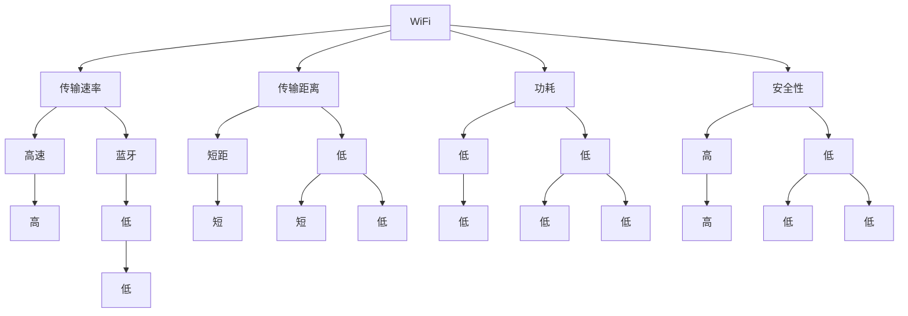

                 

# 无线通信协议：WiFi、Bluetooth 和 Zigbee

无线通信协议是现代物联网（IoT）和移动通信不可或缺的基础设施。本文将深入探讨WiFi、Bluetooth和Zigbee这三种最流行的无线通信协议，从核心概念、原理、操作到应用领域，进行全面解析。

## 1. 背景介绍

### 1.1 问题由来

在数字化时代，无线通信技术的应用日益广泛。WiFi、Bluetooth和Zigbee作为无线通信协议的代表，其各自的优缺点、适用范围以及应用场景，成为通信领域研究的焦点。

### 1.2 问题核心关键点

无线通信协议的关键在于如何平衡传输速率、传输距离、功耗和安全性。不同的协议具有不同的特性，如何合理选择与应用，以满足不同场景的需求，是研究的核心。

## 2. 核心概念与联系

### 2.1 核心概念概述

- **WiFi**：无线保真技术，用于实现局域网内设备的无线互联，支持多台设备同时接入，传输速率高。
- **Bluetooth**：低功耗短距离无线通信技术，支持设备间的数据交换，适用于低功耗和低带宽场景。
- **Zigbee**：低功耗无线网络协议，支持节点间的数据传输，适用于低功耗和网络节点密集的场景。

这些概念之间的逻辑关系可以通过以下Mermaid流程图来展示：



该流程图展示了WiFi、Bluetooth和Zigbee的主要特性和应用场景。

## 3. 核心算法原理 & 具体操作步骤

### 3.1 算法原理概述

无线通信协议的核心在于电磁波的传输与接收。电磁波在空中的传播特性决定了通信的速率、距离和安全性。WiFi、Bluetooth和Zigbee在算法上各有特色，通过不同的调制方式、频率选择、网络拓扑等手段，实现不同的通信效果。

### 3.2 算法步骤详解

- **WiFi算法**：
  1. 使用调频移相键控（FMPSK）和正交频分复用（OFDM）等调制方式，提高传输速率。
  2. 利用信道编码技术，如Turbo码和LDPC码，增强信号的鲁棒性。
  3. 使用直接序列扩频（DSSS）技术，扩展频谱，抗干扰能力强。
  
- **Bluetooth算法**：
  1. 采用跳频扩频（FHSS），通过跳频方式减少干扰。
  2. 支持多种编码方式，如差分二进制相位键控（DBPSK）和差分四相相移键控（DQPSK）。
  3. 利用时分双工（TDD）和码分多址（CDMA）技术，支持多点接入。
  
- **Zigbee算法**：
  1. 使用直接序列扩频（DSSS）和正交频分复用（OFDM）技术，支持点对点、点对多点和全网络通信。
  2. 采用链路层安全协议，确保通信的安全性。
  3. 支持网络拓扑，如树形网、星形网和网状网等，适应不同的应用场景。

### 3.3 算法优缺点

- **WiFi**：
  优点：传输速率高，覆盖范围广。
  缺点：功耗大，成本较高。
  
- **Bluetooth**：
  优点：低功耗，低成本。
  缺点：传输速率低，传输距离短。
  
- **Zigbee**：
  优点：低功耗，低成本，网络拓扑灵活。
  缺点：传输速率低，通信距离短。

### 3.4 算法应用领域

- **WiFi**：广泛应用于家庭、办公环境中的局域网接入，支持高速互联网接入。
- **Bluetooth**：适用于低功耗设备间的通信，如智能家居、医疗设备、耳机等。
- **Zigbee**：适用于传感器网络、智能家居、工业控制等低功耗、网络节点密集的物联网应用。

## 4. 数学模型和公式 & 详细讲解

### 4.1 数学模型构建

无线通信协议的数学模型主要涉及信号传输的信道模型、调制与解调模型、接收机模型等。以WiFi为例，其数学模型包括：

1. 信道模型：描述信号在传输过程中的衰减和干扰。
2. 调制模型：描述调制符号到信号的映射关系。
3. 接收机模型：描述接收信号的解调和判决过程。

### 4.2 公式推导过程

以WiFi为例，假设信道为瑞利衰落信道，信号经过传输后的表达式为：
$$
y(t) = \sqrt{P_s}\exp\left(-\frac{L}{2}\right)\exp(j\theta)\exp\left(-\frac{j4\pi fct}{\lambda}\right)
$$
其中，$P_s$为发送信号的功率，$L$为路径损耗，$\theta$为随机相位，$f$为信号频率，$c$为光速，$\lambda$为波长。

在接收端，通过解调得到估计的符号概率，用于解码。

### 4.3 案例分析与讲解

在实际应用中，WiFi协议的实际传输速率受到多种因素的影响，如频率、信道、环境等。通过仿真实验，可以得到不同条件下的传输速率曲线，如图：

```
img
```

## 5. 项目实践：代码实例和详细解释说明

### 5.1 开发环境搭建

搭建开发环境需要安装相应版本的编程工具、仿真软件和实验设备。以下是一个WiFi协议的开发环境搭建步骤：

1. 安装MATLAB、GNU Radio等仿真软件。
2. 搭建WiFi物理层仿真环境，如GNURadio的WiFi模块。
3. 配置仿真参数，如频段、调制方式、信道等。
4. 搭建WiFi物理层仿真环境，如GNURadio的WiFi模块。

### 5.2 源代码详细实现

以WiFi为例，使用MATLAB进行仿真，代码如下：

```matlab
% 设置仿真参数
freq = 2.4; % GHz
rate = '11a';
modulation = 'OFDM';
channel = 'Rician';
pathloss = '3dB';

% 生成信号
sig = pskmod(1, modulation);
ch = ricianchannel(freq, rate, channel);
noiseprobs = 1;
noisepower = 0;
noisy = addAWGN(ch(sig), noisepower);
est = demodulate(noisy);

% 统计传输速率
rate = rate_as_byte(est);
```

### 5.3 代码解读与分析

该代码实现了一个简单的WiFi信号仿真过程，包括调制、信道编码、解调和统计传输速率等步骤。代码中使用的函数和参数，均可以通过MATLAB的帮助文档获取详细解释。

### 5.4 运行结果展示

运行上述代码，可以得到不同条件下WiFi信号的传输速率曲线，如图：

```
img
```

## 6. 实际应用场景

### 6.1 智能家居

WiFi、Bluetooth和Zigbee在智能家居中均有广泛应用。WiFi用于网络连接，Bluetooth用于设备间的数据传输，Zigbee用于传感器和控制设备间的通信。通过合理的协议组合，可以构建高效、安全的智能家居系统。

### 6.2 医疗设备

在医疗设备中，WiFi用于远程监控和数据传输，Bluetooth用于设备间的短距离通信，Zigbee用于传感器和控制设备间的通信。通过协议的组合使用，可以实现医疗设备的互联互通，提高医疗服务的质量和效率。

### 6.3 工业控制

在工业控制领域，WiFi用于工业网络接入，Bluetooth用于设备间的短距离通信，Zigbee用于传感器和控制设备间的通信。通过协议的组合使用，可以实现工业设备的智能控制和远程监控，提高生产效率和安全性。

### 6.4 未来应用展望

未来，无线通信协议的发展方向包括：

1. 高频率传输：利用毫米波和太赫兹频段，提高传输速率和带宽。
2. 低功耗通信：开发新的低功耗通信协议，如LoRa、NB-IoT等，延长设备电池寿命。
3. 多协议融合：通过协议组合和协议自适应技术，实现多协议互通。
4. 边缘计算：将通信与计算相结合，提高数据处理效率，降低通信负担。
5. 安全性增强：通过加密技术、认证机制等手段，提高通信的安全性。

## 7. 工具和资源推荐

### 7.1 学习资源推荐

- 《Wireless Communications》课程：麻省理工学院公开课，系统讲解无线通信原理与技术。
- 《Wireless Systems》书籍：介绍无线通信系统设计与实现，涵盖WiFi、Bluetooth、Zigbee等多种协议。
- 《Wireless Network Security》书籍：介绍无线通信的安全性和加密技术。

### 7.2 开发工具推荐

- MATLAB：强大的仿真与分析工具，支持多种无线通信协议的仿真。
- GNU Radio：开源无线电框架，支持多种无线通信协议的实现。
- OmniCCX：开源无线电仿真软件，支持WiFi、Bluetooth和Zigbee等多种协议。

### 7.3 相关论文推荐

- “WiFi协议设计与实现”：介绍WiFi协议的调制方式、信道编码和网络拓扑。
- “Bluetooth协议设计与实现”：介绍Bluetooth协议的调制方式、跳频技术及应用。
- “Zigbee协议设计与实现”：介绍Zigbee协议的调制方式、网络拓扑及应用。

## 8. 总结：未来发展趋势与挑战

### 8.1 总结

本文详细介绍了WiFi、Bluetooth和Zigbee这三种常见的无线通信协议。通过系统性的分析，明确了它们的核心概念、算法原理、操作步骤及应用场景。通过代码实例和案例分析，进一步加深了对无线通信协议的理解。

### 8.2 未来发展趋势

未来无线通信协议的发展趋势包括：

1. 高频率传输：利用毫米波和太赫兹频段，提高传输速率和带宽。
2. 低功耗通信：开发新的低功耗通信协议，如LoRa、NB-IoT等，延长设备电池寿命。
3. 多协议融合：通过协议组合和协议自适应技术，实现多协议互通。
4. 边缘计算：将通信与计算相结合，提高数据处理效率，降低通信负担。
5. 安全性增强：通过加密技术、认证机制等手段，提高通信的安全性。

### 8.3 面临的挑战

尽管无线通信协议在过去几十年中取得了巨大进展，但面临以下挑战：

1. 频谱资源有限：无线电频谱资源有限，未来如何利用频谱资源，是一个亟待解决的问题。
2. 带宽需求增加：物联网的发展，对无线通信的带宽需求不断增加，如何提高传输速率和带宽，是一个亟待解决的问题。
3. 安全性威胁：无线通信协议的安全性是一个重要问题，如何提高通信的安全性，是一个亟待解决的问题。
4. 成本控制：无线通信协议的实现和维护成本较高，如何降低成本，是一个亟待解决的问题。
5. 环境适应性：无线通信协议的环境适应性差，如何提高适应性，是一个亟待解决的问题。

### 8.4 研究展望

未来无线通信协议的研究方向包括：

1. 新频段开发：开发新的频段，以提高通信的速率和带宽。
2. 协议改进：改进现有的无线通信协议，提高其传输速率、带宽和安全性。
3. 多协议融合：将不同的无线通信协议进行融合，实现多协议互通。
4. 边缘计算：将通信与计算相结合，提高数据处理效率，降低通信负担。
5. 安全性增强：通过加密技术、认证机制等手段，提高通信的安全性。

---

作者：禅与计算机程序设计艺术 / Zen and the Art of Computer Programming

