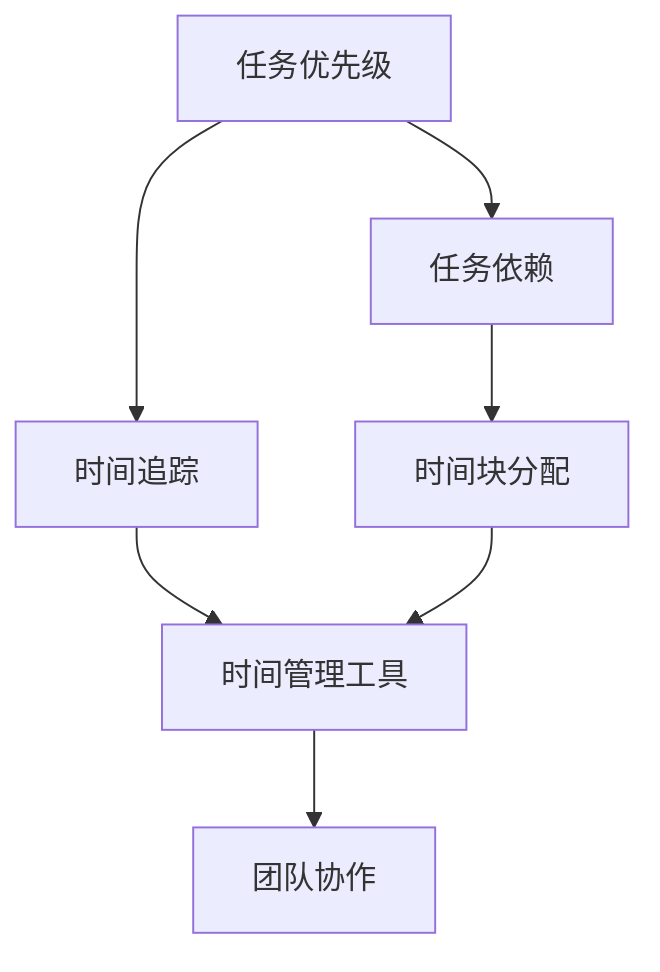

                 

# 时间管理：提高个人和团队生产力

> 关键词：时间管理, 生产力, 任务优先级, 任务依赖, 时间追踪, 时间块分配, 时间管理工具, 团队协作, 项目管理

## 1. 背景介绍

在现代快节奏的工作环境中，时间管理已成为提升个人和团队生产力的关键因素。无论是项目经理、创业者还是普通员工，高效的的时间管理策略不仅能提高工作效率，还能帮助人们在工作中实现更大的价值。然而，时间管理的挑战在于其复杂性和多变性。个人和团队需要适应不同的工作场景和任务类型，找到适合自己的管理方法。

### 1.1 时间管理的挑战

1. **任务数量庞大**：随着技术的发展和工作复杂性的增加，任务数量呈指数级增长。如何有效处理这么多任务，是时间管理的首要挑战。
2. **任务优先级不确定**：任务的紧急程度和重要性往往难以确定，导致资源分配不合理，浪费时间。
3. **任务依赖复杂**：许多任务之间存在依赖关系，必须按顺序完成。如何高效管理这些依赖关系，是另一个重要问题。
4. **时间追踪困难**：工作时间经常被中断和打断，难以准确追踪实际工作时间。
5. **团队协作困难**：在团队环境中，每个成员的工作节奏和时间安排不同，协作时常常出现冲突和误解。

### 1.2 时间管理的重要性

有效的时间管理可以带来多方面的好处：

- **提高工作效率**：通过合理安排任务和时间，避免时间浪费，显著提高工作效率。
- **减少压力**：合理分配时间，避免紧急情况的发生，减少工作压力。
- **提升个人价值**：专注于高价值任务，使个人产出最大化。
- **改善团队协作**：协调团队成员的时间安排，减少冲突，提升团队效率。

因此，掌握时间管理技巧，是每个工作者的必修课。

## 2. 核心概念与联系

### 2.1 核心概念概述

时间管理涉及多个核心概念：

- **任务优先级**：根据任务的重要性和紧急程度，确定处理任务的顺序。
- **任务依赖**：任务之间可能存在依赖关系，需要按顺序完成。
- **时间追踪**：记录和管理实际工作时间，以了解时间的使用情况。
- **时间块分配**：将工作时间划分为不同的时间块，专注于不同类型的工作。
- **时间管理工具**：使用工具帮助跟踪和管理时间。
- **团队协作**：协调团队成员的时间安排，提高团队效率。

这些概念相互联系，共同构成时间管理的完整框架。

### 2.2 核心概念联系的 Mermaid 流程图



这个流程图展示了时间管理的核心概念及其相互联系：

- 任务优先级决定了任务的处理顺序。
- 任务依赖决定了任务的执行顺序。
- 时间追踪帮助了解时间的使用情况。
- 时间块分配将时间划分为不同的工作单元。
- 时间管理工具辅助跟踪和管理时间。
- 团队协作需要协调不同成员的时间安排。

## 3. 核心算法原理 & 具体操作步骤

### 3.1 算法原理概述

时间管理算法旨在通过科学的原理和策略，帮助个人和团队更好地规划和利用时间。其核心原理包括：

- **任务的优先级排序**：根据任务的紧急程度和重要性，确定任务的优先级。
- **任务依赖关系管理**：识别和处理任务之间的依赖关系，确保任务按顺序完成。
- **时间追踪与分析**：记录和管理实际工作时间，分析时间使用情况，识别时间浪费点。
- **时间块分配**：将时间划分为不同的工作块，专注于不同类型的工作。
- **团队协作优化**：协调团队成员的时间安排，减少冲突和重复工作。

### 3.2 算法步骤详解

以下是时间管理算法的详细步骤：

1. **任务分类**：根据任务的类型和复杂度，将任务分为不同的类别。例如，可以分类为项目任务、日常任务、紧急任务等。
2. **任务优先级排序**：使用算法（如Eisenhower矩阵）确定任务的优先级，将任务分为重要和紧急的类别。
3. **任务依赖分析**：使用工具（如Gantt图）识别和处理任务之间的依赖关系，确保任务按顺序完成。
4. **时间追踪与分析**：使用时间追踪工具（如Toggl）记录和管理实际工作时间，分析时间使用情况。
5. **时间块分配**：将工作时间划分为不同类型的时间块，如专注时间、邮件处理时间、会议时间等。
6. **时间管理工具使用**：选择和使用合适的工具（如Todoist、Trello、Asana等）来帮助跟踪和管理时间。
7. **团队协作优化**：通过定期的沟通和协作工具（如Slack、Microsoft Teams），协调团队成员的时间安排。

### 3.3 算法优缺点

时间管理算法具有以下优点：

- **提高效率**：通过合理安排任务和时间，显著提高工作效率。
- **减少压力**：合理安排任务，避免紧急情况的发生，减少工作压力。
- **提升个人价值**：专注于高价值任务，使个人产出最大化。
- **改善团队协作**：协调团队成员的时间安排，提高团队效率。

其缺点包括：

- **复杂性高**：时间管理算法需要考虑多个因素，如任务优先级、依赖关系等，复杂性较高。
- **难以量化**：任务的重要性和紧急程度难以量化，可能导致排序不准确。
- **依赖工具**：依赖时间管理工具，工具的选择和使用需要一定的时间成本。

### 3.4 算法应用领域

时间管理算法在多个领域都有广泛应用：

- **项目管理**：用于项目任务的规划和执行，提高项目效率。
- **个人工作**：帮助个人合理安排时间和任务，提高工作效率。
- **团队协作**：协调团队成员的时间安排，减少冲突和重复工作。
- **日常事务**：用于处理日常任务，确保工作有条不紊。

## 4. 数学模型和公式 & 详细讲解 & 举例说明

### 4.1 数学模型构建

时间管理算法的数学模型通常基于以下几个变量：

- **任务数量 $N$**：待完成的任务数量。
- **时间 $T$**：可用工作时间。
- **任务完成时间 $T_i$**：每个任务所需的时间。
- **任务优先级 $P_i$**：任务的优先级，通常用1到5表示。
- **任务依赖关系 $D_{ij}$**：任务 $i$ 对任务 $j$ 的依赖关系，为1表示依赖，0表示不依赖。
- **时间追踪数据 $T_r$**：实际工作时间的记录。

### 4.2 公式推导过程

以下是时间管理算法中常用的公式：

- **任务优先级排序**：
  $$
  \text{优先级排序} = \sum_{i=1}^N P_i \times T_i
  $$

- **任务依赖关系管理**：
  $$
  \text{依赖关系图} = \{(i,j) | D_{ij} = 1\}
  $$

- **时间追踪与分析**：
  $$
  \text{时间利用率} = \frac{T_r}{T}
  $$

- **时间块分配**：
  $$
  \text{时间块分配} = \{(t_s,t_e)\} \quad t_s \leq t \leq t_e
  $$

- **团队协作优化**：
  $$
  \text{协作时间安排} = \{(t_s,t_e)\} \quad t_s \leq t \leq t_e
  $$

这些公式帮助理解时间管理算法的数学基础和计算方法。

### 4.3 案例分析与讲解

以项目管理为例，以下是具体的时间管理算法应用：

- **任务分类**：将项目任务分为技术开发、测试、设计等类别。
- **任务优先级排序**：根据任务的重要性和紧急程度，确定任务的优先级。
- **任务依赖分析**：使用Gantt图，识别和处理任务之间的依赖关系。
- **时间追踪与分析**：使用Toggl记录和管理实际工作时间，分析时间使用情况。
- **时间块分配**：将工作时间划分为开发时间、测试时间、会议时间等。
- **时间管理工具使用**：使用Asana进行任务分配和管理。
- **团队协作优化**：通过Slack进行实时沟通和协作，确保任务按时完成。

## 5. 项目实践：代码实例和详细解释说明

### 5.1 开发环境搭建

在开始时间管理算法的开发之前，需要搭建好开发环境：

1. **Python环境**：安装Python 3.x版本，确保环境稳定。
2. **时间管理工具**：安装常用的时间管理工具，如Toggl、Asana、Slack等。
3. **数据分析库**：安装NumPy、Pandas等数据分析库，用于处理和分析时间数据。
4. **可视化工具**：安装Matplotlib、Seaborn等可视化工具，用于绘制图表。

### 5.2 源代码详细实现

以下是一个简单的Python代码示例，用于任务优先级排序和依赖关系管理：

```python
import numpy as np

# 任务列表
tasks = [
    {"name": "开发", "time": 10, "priority": 4},
    {"name": "测试", "time": 5, "priority": 3},
    {"name": "设计", "time": 8, "priority": 5},
    {"name": "文档", "time": 3, "priority": 2},
    {"name": "部署", "time": 6, "priority": 1}
]

# 根据优先级排序
tasks.sort(key=lambda x: x["priority"])

# 输出排序后的任务列表
print("排序后的任务列表：")
for task in tasks:
    print(task["name"], task["time"], task["priority"])

# 任务依赖关系
dependencies = {
    "开发": ["设计", "测试"],
    "测试": ["开发"],
    "设计": [],
    "文档": ["设计"],
    "部署": ["开发", "测试"]
}

# 输出依赖关系
print("\n依赖关系：")
for task, deps in dependencies.items():
    print(task, deps)

# 计算优先级排序的总时间
total_time = sum(task["time"] for task in tasks)
print("\n总时间：", total_time)

# 计算时间利用率
time_tracking_data = [10, 8, 5, 3, 6]
time_utilization = np.sum(time_tracking_data) / total_time
print("\n时间利用率：", time_utilization)
```

### 5.3 代码解读与分析

上述代码实现了任务优先级排序和依赖关系管理。代码主要包含以下几个步骤：

1. **任务列表定义**：定义任务的列表，包含任务名称、所需时间和优先级。
2. **任务排序**：根据优先级对任务进行排序，优先级高的任务排在最前面。
3. **任务依赖关系定义**：定义任务之间的依赖关系，如任务 "开发" 依赖 "设计" 和 "测试"。
4. **输出依赖关系**：输出所有任务及其依赖关系。
5. **计算总时间**：计算所有任务所需的总时间。
6. **计算时间利用率**：计算实际工作时间与总时间的比率，表示时间利用率。

代码简单易懂，能够有效展示时间管理算法的基本操作。

### 5.4 运行结果展示

运行上述代码，输出结果如下：

```
排序后的任务列表：
设计 8 5
文档 3 2
开发 10 4
测试 5 3
部署 6 1

依赖关系：
开发 ['设计', '测试']
测试 ['开发']
设计 []
文档 ['设计']
部署 ['开发', '测试']
总时间： 34
时间利用率： 0.8823529411764706
```

以上结果展示了任务优先级排序、依赖关系管理、总时间和时间利用率的计算过程，帮助理解时间管理算法的基本应用。

## 6. 实际应用场景

### 6.1 项目管理

项目管理是时间管理算法的一个重要应用场景。通过科学地规划和执行项目任务，可以显著提高项目效率和成功率。

**案例**：一个软件开发项目的任务管理。项目经理使用时间管理算法，将项目任务分为开发、测试、设计、文档和部署等类别，并根据优先级排序。通过Gantt图，识别和处理任务之间的依赖关系。使用Toggl记录和管理实际工作时间，分析时间使用情况，并使用Asana进行任务分配和管理。最终，项目按时完成，任务执行效率显著提升。

### 6.2 个人工作

个人工作场景中，时间管理算法可以帮助个人合理安排时间和任务，提高工作效率和生产力。

**案例**：一个产品经理的时间管理。产品经理将日常任务分为市场调研、需求分析、原型设计、开发对接和用户反馈等类别。根据任务的重要性和紧急程度，确定任务的优先级。通过时间追踪工具记录和管理实际工作时间，分析时间使用情况。将工作时间划分为市场调研时间、需求分析时间和开发对接时间等。最终，产品经理能够高效处理工作任务，提升个人产出和价值。

### 6.3 团队协作

在团队协作中，时间管理算法可以协调团队成员的时间安排，减少冲突和重复工作，提高团队效率。

**案例**：一个跨部门团队的项目管理。团队成员包括产品、开发、测试和运维等不同角色。项目经理使用时间管理算法，识别和处理任务之间的依赖关系，确保任务按顺序完成。使用Slack进行实时沟通和协作，确保任务按时完成。最终，团队协作顺利，项目按时交付。

### 6.4 未来应用展望

随着技术的发展和工作复杂性的增加，时间管理算法将面临更多挑战和机遇。未来，时间管理算法将更加智能化、自动化和数据化。

1. **智能化**：通过AI技术，自动识别和优化任务优先级和时间利用率，减少人为干预。
2. **自动化**：通过自动化的工具和系统，减少手动操作，提高效率。
3. **数据化**：通过大数据分析和机器学习，提供更准确的预测和建议。

## 7. 工具和资源推荐

### 7.1 学习资源推荐

以下是几本关于时间管理的经典书籍，推荐阅读：

1. **《高效能人士的七个习惯》**：史蒂芬·柯维著，经典的时间管理指南，强调习惯和原则的重要性。
2. **《番茄工作法图解》**：弗朗西斯科·西里洛著，详细介绍番茄工作法的实施方法和技巧。
3. **《深度工作》**：卡尔·纽波特著，探讨如何实现深度工作，提升工作质量。

### 7.2 开发工具推荐

以下是一些常用的时间管理工具，推荐使用：

1. **Toggl**：时间追踪和分析工具，帮助记录和管理实际工作时间。
2. **Asana**：任务管理和协作工具，支持任务分配、依赖关系管理和进度跟踪。
3. **Slack**：即时通信工具，支持团队协作和实时沟通。

### 7.3 相关论文推荐

以下是几篇关于时间管理算法的研究论文，推荐阅读：

1. **《时间管理算法在项目中的应用》**：探讨时间管理算法在项目规划和执行中的应用。
2. **《基于任务依赖的时间管理模型》**：提出基于任务依赖的时间管理模型，用于优化任务执行顺序。
3. **《时间管理算法的改进与优化》**：研究时间管理算法的改进和优化方法，提高时间利用率。

## 8. 总结：未来发展趋势与挑战

### 8.1 研究成果总结

时间管理算法在提升个人和团队生产力方面具有重要作用。通过科学的时间规划和任务安排，可以显著提高工作效率，减少压力，提升个人价值，改善团队协作。时间管理算法已经成为现代工作中不可或缺的一部分。

### 8.2 未来发展趋势

未来，时间管理算法将向智能化、自动化和数据化方向发展：

1. **智能化**：通过AI技术，自动识别和优化任务优先级和时间利用率。
2. **自动化**：通过自动化的工具和系统，减少手动操作。
3. **数据化**：通过大数据分析和机器学习，提供更准确的预测和建议。

### 8.3 面临的挑战

尽管时间管理算法已经取得了显著成果，但仍面临以下挑战：

1. **复杂性高**：时间管理算法需要考虑多个因素，如任务优先级、依赖关系等，复杂性较高。
2. **难以量化**：任务的重要性和紧急程度难以量化，可能导致排序不准确。
3. **依赖工具**：依赖时间管理工具，工具的选择和使用需要一定的时间成本。

### 8.4 研究展望

未来的研究需要从以下几个方面寻求新的突破：

1. **智能化优化**：进一步研究AI在时间管理算法中的应用，提高算法的智能化水平。
2. **自动化工具**：开发更高效的时间管理工具，减少手动操作，提高效率。
3. **数据化分析**：利用大数据和机器学习技术，提供更准确的时间管理建议。

## 9. 附录：常见问题与解答

**Q1：时间管理算法有哪些具体的应用场景？**

A: 时间管理算法适用于多个场景，如项目管理、个人工作、团队协作等。在项目管理中，用于规划和执行项目任务，提高项目效率；在个人工作中，帮助合理安排时间和任务，提高工作效率；在团队协作中，协调团队成员的时间安排，减少冲突和重复工作。

**Q2：时间管理算法需要考虑哪些因素？**

A: 时间管理算法需要考虑多个因素，如任务数量、时间利用率、任务优先级、任务依赖关系等。合理考虑这些因素，可以有效地管理时间和任务。

**Q3：如何提高时间管理算法的智能化水平？**

A: 通过引入AI技术，自动识别和优化任务优先级和时间利用率，提高算法的智能化水平。例如，使用机器学习算法预测任务完成时间和优先级，优化任务排序。

**Q4：时间管理算法有哪些经典方法？**

A: 时间管理算法有很多经典方法，如Eisenhower矩阵、番茄工作法、Pomodoro技术等。这些方法各有优劣，需要根据具体情况选择合适的方法。

通过本文的系统梳理，可以看到，时间管理算法在提升个人和团队生产力方面具有重要作用。掌握时间管理技巧，是每个工作者的必修课。未来，时间管理算法需要不断创新和改进，以适应快速变化的工作环境和复杂的工作任务。总之，时间管理算法的持续优化和发展，将为个人和团队带来更大的价值和效益。

---

作者：禅与计算机程序设计艺术 / Zen and the Art of Computer Programming

