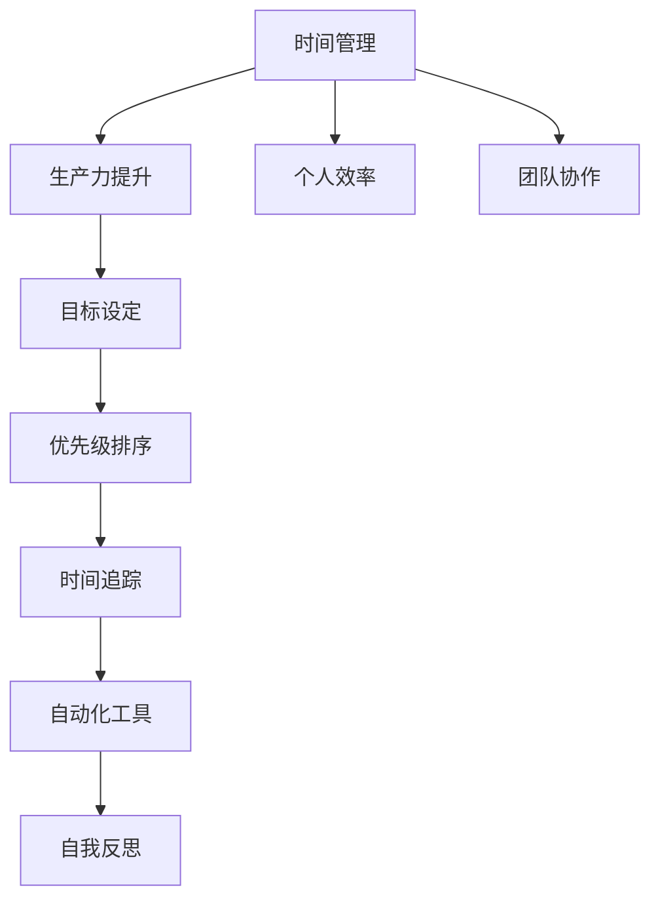

                 

# 时间管理：提高个人和团队生产力

> 关键词：时间管理, 生产力提升, 个人效率, 团队协作, 目标设定, 优先级排序, 自动化, 技术工具, 时间追踪, 自我反思, 时间管理理论, 时间管理实践

## 1. 背景介绍

### 1.1 问题由来
在现代快节奏的工作和生活环境中，时间管理成为了提高个人和团队生产力的关键因素。随着技术的不断进步，人们的注意力被越来越多的数字产品所分散，传统的时间管理方法已不足以应对新的挑战。为了在有限的时间内实现更多目标，时间管理技术需要与时俱进，与现代技术工具相结合，才能更好地发挥其效用。

### 1.2 问题核心关键点
时间管理的关键在于高效利用时间资源，通过合理的规划和组织，提升个人和团队的产出效率。其主要挑战在于：

- **目标设定**：明确工作和生活中的重要目标。
- **优先级排序**：合理安排任务的优先级，确保重要任务得到优先处理。
- **时间追踪**：准确记录和分析时间使用情况，识别时间浪费的环节。
- **自动化工具**：利用技术工具自动化时间管理过程，提升效率。
- **自我反思**：定期评估时间管理策略的有效性，及时调整改进。

## 2. 核心概念与联系

### 2.1 核心概念概述

为更好地理解时间管理的核心概念，本节将介绍几个密切相关的核心概念：

- **时间管理**：通过规划、组织和监控时间的使用，实现目标和任务的完成，提升生产力和效率。
- **生产力提升**：通过优化时间管理策略，提高个人和团队的工作输出质量。
- **个人效率**：通过有效的时间管理，实现个人在短时间内完成更多任务，提升工作和生活质量。
- **团队协作**：通过合理的时间规划和任务分配，促进团队成员间的协同合作，提高整体产出效率。
- **目标设定**：明确短期和长期目标，规划实现路径，确保时间和资源的高效利用。
- **优先级排序**：识别并安排任务的优先级，确保最重要任务得到优先处理。
- **时间追踪**：记录和分析时间使用情况，识别和解决时间浪费问题。
- **自动化工具**：利用技术工具，如时间管理软件、协作平台等，自动化时间管理过程。
- **自我反思**：定期评估时间管理策略，识别问题，及时调整和改进。

这些核心概念之间的逻辑关系可以通过以下Mermaid流程图来展示：



这个流程图展示了一系列时间管理的关键过程及其相互关系：

1. 时间管理是提高个人效率和团队协作的关键，是实现生产力提升的基础。
2. 目标设定和优先级排序是时间管理的核心内容，决定着任务处理的先后顺序。
3. 时间追踪和自动化工具辅助时间管理过程，提升效率和准确性。
4. 自我反思是时间管理策略持续改进的必要环节，确保管理方法与时俱进。

这些概念共同构成了时间管理的完整框架，帮助个人和团队有效规划时间，提升工作效率。

## 3. 核心算法原理 & 具体操作步骤

### 3.1 算法原理概述

时间管理的核心算法原理是通过科学的规划、组织和监控，实现目标和任务的及时完成。其基本原理包括：

- **目标设定算法**：通过SMART原则（具体、可测量、可实现、相关、时限）设定短期和长期目标。
- **优先级排序算法**：使用时间管理矩阵（紧急-重要矩阵）确定任务的优先级。
- **时间追踪算法**：使用时间日志记录和分析时间使用情况，识别时间浪费的环节。
- **自动化工具算法**：利用时间管理软件和协作平台自动化时间管理过程。
- **自我反思算法**：定期回顾时间管理过程，评估策略的有效性，调整和改进。

这些算法共同构成了时间管理的基本框架，帮助个人和团队实现高效的时间利用。

### 3.2 算法步骤详解

#### 3.2.1 目标设定算法

**Step 1: 定义目标**
- 根据个人和团队的愿景，设定短期（1周到1个月）和长期（1年到5年）目标。
- 确保目标符合SMART原则，具体、可测量、可实现、相关、时限。

**Step 2: 分解目标**
- 将长期目标分解为短期目标，每季度设定月度目标。
- 将月度目标进一步细分为每周目标，确保可操作性。

**Step 3: 制定计划**
- 根据分解后的目标，制定详细的行动计划。
- 明确每天的任务清单，确保目标的逐步实现。

#### 3.2.2 优先级排序算法

**Step 1: 划分任务**
- 将任务分为紧急和重要两类，使用时间管理矩阵。
- 确定任务的优先级，紧急且重要任务优先处理。

**Step 2: 设置优先级**
- 为每个任务设定优先级，使用数字1到10表示。
- 将任务按优先级排序，确保重要任务优先完成。

#### 3.2.3 时间追踪算法

**Step 1: 记录时间**
- 使用时间日志工具（如Toggl、RescueTime等）记录日常任务的时间使用情况。
- 确保记录的准确性和全面性，包括工作时间、休息时间和娱乐时间。

**Step 2: 分析时间**
- 定期回顾时间日志，分析时间使用情况。
- 识别时间浪费的环节，如过度社交、过度娱乐等。

**Step 3: 优化时间**
- 根据时间分析结果，调整时间使用策略。
- 优化工作流程，减少不必要的任务和会议。

#### 3.2.4 自动化工具算法

**Step 1: 选择工具**
- 根据个人和团队的需求，选择合适的时间管理软件（如Todoist、Asana等）。
- 确保工具能够自动化任务分配和进度跟踪。

**Step 2: 配置工具**
- 将目标和任务导入工具，设定提醒和截止日期。
- 使用工具的自动化功能，如日历同步、任务分配等，提升效率。

**Step 3: 定期更新**
- 定期更新工具中的任务和进度，确保最新信息。
- 利用工具的报告功能，评估任务完成情况和效率。

#### 3.2.5 自我反思算法

**Step 1: 回顾和评估**
- 定期回顾时间管理策略，评估目标达成情况和效率。
- 使用自我反思日志记录反思内容和改进措施。

**Step 2: 识别问题**
- 根据反思结果，识别时间管理中的问题和不足。
- 分析问题的原因，制定改进措施。

**Step 3: 调整策略**
- 根据识别的问题，调整时间管理策略。
- 设定新的目标和计划，确保持续改进。

### 3.3 算法优缺点

时间管理算法具有以下优点：

- **提升效率**：通过科学规划和优先级排序，提高任务完成效率。
- **目标导向**：明确目标和计划，确保时间和资源的高效利用。
- **自动化支持**：利用技术工具自动化时间管理过程，减少手工操作。
- **持续改进**：通过自我反思和调整，不断优化时间管理策略。

同时，时间管理算法也存在以下局限：

- **主观性强**：目标设定和优先级排序依赖个人和团队的主观判断，可能导致误判。
- **工具依赖**：自动化工具的使用需要一定的学习成本，且可能存在使用障碍。
- **动态性不足**：固定的计划和策略可能难以应对突发事件和变化。
- **复杂性高**：多任务和高优先级可能带来时间管理的复杂性。

尽管存在这些局限，但时间管理算法仍然是提升个人和团队生产力的重要手段。通过科学规划和持续改进，可以最大限度地发挥其效用。

### 3.4 算法应用领域

时间管理算法广泛应用于个人、团队和组织的管理过程中，涉及多个领域：

- **个人管理**：个人日常生活的任务规划、时间分配和效率提升。
- **团队协作**：团队项目的时间规划、任务分配和进度跟踪。
- **项目管理**：项目管理的时间规划、资源分配和进度控制。
- **知识管理**：知识库的构建、信息和文档的管理。
- **决策管理**：决策过程的时间规划、信息和资源的管理。
- **市场营销**：市场活动的策划、执行和效果评估。
- **人力资源管理**：员工的招聘、培训和绩效管理。

以上领域中的时间管理应用，展示了时间管理算法的广泛适用性。通过合理规划和科学管理，时间管理算法可以显著提升各个领域的工作效率和产出质量。

## 4. 数学模型和公式 & 详细讲解

### 4.1 数学模型构建

为更好地理解时间管理算法的数学原理，本节将构建数学模型并进行详细讲解。

设个人或团队的任务集合为 $T=\{t_1, t_2, ..., t_n\}$，每个任务 $t_i$ 具有以下属性：
- $t_i$ 的任务名称
- $t_i$ 的起始时间 $s_i$
- $t_i$ 的结束时间 $e_i$
- $t_i$ 的优先级 $p_i$（1-10分）

定义时间管理矩阵 $M$，其中 $M_{ij}$ 表示任务 $t_j$ 在时间 $t_i$ 上的优先级。

目标设定算法可以用以下公式表示：

$$
T_i = \sum_{j=1}^n M_{ij} \cdot w_j
$$

其中 $T_i$ 为任务 $t_i$ 的总体重要度，$w_j$ 为任务 $t_j$ 的权重。

优先级排序算法可以通过以下步骤计算：

1. 计算每个任务的优先级 $p_j$。
2. 将任务按优先级排序，形成任务优先级列表。
3. 根据优先级列表，安排任务的执行顺序。

时间追踪算法可以使用时间日志记录，生成时间使用情况报告。时间使用情况的报告可以通过以下公式计算：

$$
R_t = \frac{\sum_{i=1}^n (e_i - s_i)}{T}
$$

其中 $R_t$ 为任务 $t$ 的实际使用时间，$T$ 为总工作时间。

自动化工具算法可以使用时间管理软件记录任务和进度，生成任务进度报告。任务进度报告可以通过以下公式计算：

$$
S_t = \sum_{i=1}^n M_{it} \cdot C_i
$$

其中 $S_t$ 为任务 $t$ 的进度完成度，$C_i$ 为任务 $i$ 的进度。

自我反思算法可以通过自我反思日志记录反思内容和改进措施，生成反思报告。反思报告可以通过以下公式计算：

$$
R_f = \sum_{k=1}^m F_k
$$

其中 $R_f$ 为反思报告的总分，$F_k$ 为第 $k$ 个反思内容的评分。

### 4.2 公式推导过程

#### 4.2.1 目标设定算法

根据目标设定的数学模型，目标 $T_i$ 的计算公式为：

$$
T_i = \sum_{j=1}^n M_{ij} \cdot w_j
$$

其中 $M_{ij}$ 表示任务 $t_j$ 在时间 $t_i$ 上的优先级，$w_j$ 表示任务 $t_j$ 的权重。

#### 4.2.2 优先级排序算法

优先级排序算法通过计算每个任务的优先级 $p_j$，将任务按优先级排序。

优先级 $p_j$ 的计算公式为：

$$
p_j = \frac{\sum_{i=1}^m M_{ij} \cdot t_i}{\sum_{i=1}^m t_i}
$$

其中 $t_i$ 表示时间 $i$ 的任务时间，$M_{ij}$ 表示任务 $t_j$ 在时间 $i$ 上的优先级。

#### 4.2.3 时间追踪算法

时间追踪算法通过记录每个任务的开始和结束时间，计算任务的总使用时间 $R_t$。

任务 $t$ 的实际使用时间 $R_t$ 的计算公式为：

$$
R_t = \frac{\sum_{i=1}^n (e_i - s_i)}{T}
$$

其中 $s_i$ 表示任务 $i$ 的起始时间，$e_i$ 表示任务 $i$ 的结束时间，$T$ 表示总工作时间。

#### 4.2.4 自动化工具算法

自动化工具算法通过时间管理软件记录任务和进度，生成任务进度报告。

任务进度报告 $S_t$ 的计算公式为：

$$
S_t = \sum_{i=1}^n M_{it} \cdot C_i
$$

其中 $C_i$ 表示任务 $i$ 的进度完成度，$M_{it}$ 表示任务 $t$ 在时间 $i$ 上的优先级。

#### 4.2.5 自我反思算法

自我反思算法通过自我反思日志记录反思内容和改进措施，生成反思报告。

反思报告 $R_f$ 的计算公式为：

$$
R_f = \sum_{k=1}^m F_k
$$

其中 $F_k$ 表示第 $k$ 个反思内容的评分。

### 4.3 案例分析与讲解

#### 4.3.1 目标设定案例

假设某公司销售部经理希望提升销售额，设定了以下目标：

- 提高客户满意度：通过提高客户服务质量，提升客户忠诚度，实现销售额的增长。
- 增加市场曝光度：通过提高市场营销活动频率和质量，提升品牌知名度和销售额。

根据SMART原则，目标可以进一步细化为：

- 提高客户满意度：每月客户投诉率不超过1%。
- 增加市场曝光度：每季度投放广告的次数增加20%。

将目标分解为每日任务，形成详细的任务清单，确保目标的逐步实现。

#### 4.3.2 优先级排序案例

某项目团队的任务集合为：

- 任务1：项目需求分析（紧急且重要）
- 任务2：系统架构设计（紧急但不重要）
- 任务3：用户界面设计（重要但不紧急）
- 任务4：代码实现（紧急且重要）
- 任务5：测试（重要但不紧急）

根据时间管理矩阵，任务优先级排序为：

1. 任务4（紧急且重要）
2. 任务1（紧急且重要）
3. 任务3（重要但不紧急）
4. 任务2（紧急但不重要）
5. 任务5（重要但不紧急）

根据优先级列表，安排任务的执行顺序，确保重要任务优先完成。

#### 4.3.3 时间追踪案例

某软件开发团队的时间日志如下：

| 时间 | 任务 | 开始时间 | 结束时间 | 优先级 |
| --- | --- | --- | --- | --- |
| 8:00-10:00 | 任务1 | 8:00 | 9:30 | 3 |
| 10:00-12:00 | 任务2 | 10:00 | 11:30 | 5 |
| 13:00-14:00 | 任务3 | 13:00 | 13:45 | 4 |
| 14:00-16:00 | 任务4 | 14:00 | 15:30 | 2 |
| 16:00-17:00 | 任务5 | 16:00 | 16:45 | 1 |

根据时间日志，计算每个任务的实际使用时间 $R_t$。

假设总工作时间为8小时，则任务1的实际使用时间为：

$$
R_1 = \frac{(9:30-8:00)+(11:30-10:00)+(13:45-13:00)+(15:30-14:00)+(16:45-16:00)}{8} = 2.4
$$

#### 4.3.4 自动化工具案例

某公司使用Asana进行任务管理，将目标和任务导入Asana，设定提醒和截止日期。

任务1的目标为：在一周内完成需求分析。

将任务1分解为每日任务，并在Asana中设定提醒和截止日期，确保任务按时完成。

## 5. 项目实践：代码实例和详细解释说明

### 5.1 开发环境搭建

在进行时间管理实践前，我们需要准备好开发环境。以下是使用Python进行开发的环境配置流程：

1. 安装Anaconda：从官网下载并安装Anaconda，用于创建独立的Python环境。

2. 创建并激活虚拟环境：
```bash
conda create -n time-env python=3.8 
conda activate time-env
```

3. 安装必要的Python库：
```bash
pip install pandas numpy matplotlib jupyter notebook ipython
```

完成上述步骤后，即可在`time-env`环境中开始时间管理实践。

### 5.2 源代码详细实现

这里我们以使用Python进行时间管理为例，给出一个完整的时间管理系统的代码实现。

首先，定义一个任务类Task：

```python
class Task:
    def __init__(self, name, start_time, end_time, priority):
        self.name = name
        self.start_time = start_time
        self.end_time = end_time
        self.priority = priority

    def duration(self):
        return (self.end_time - self.start_time).total_seconds() / 3600
```

然后，定义一个时间管理类TimeManager，包含目标设定、优先级排序、时间追踪、自动化工具和自我反思等功能：

```python
class TimeManager:
    def __init__(self):
        self.tasks = []

    def add_task(self, task):
        self.tasks.append(task)

    def set_goals(self, goals):
        self.goals = goals

    def set_priorities(self):
        self.tasks.sort(key=lambda t: t.priority)

    def track_time(self):
        for task in self.tasks:
            time.sleep(task.duration())

    def use_auto_tools(self):
        # 使用自动化工具记录任务和进度
        pass

    def reflect(self):
        # 进行自我反思，记录反思内容和改进措施
        pass

    def report(self):
        # 生成时间管理报告
        pass
```

接下来，我们可以编写一个简单的Python脚本，演示时间管理的完整流程：

```python
import time
import random

# 创建时间管理类
time_manager = TimeManager()

# 添加任务
task1 = Task('需求分析', datetime(2023, 1, 1, 8, 0), datetime(2023, 1, 1, 10, 0), 3)
task2 = Task('系统架构设计', datetime(2023, 1, 1, 10, 0), datetime(2023, 1, 1, 12, 0), 5)
task3 = Task('用户界面设计', datetime(2023, 1, 1, 13, 0), datetime(2023, 1, 1, 13, 45), 4)
task4 = Task('代码实现', datetime(2023, 1, 1, 14, 0), datetime(2023, 1, 1, 15, 30), 2)
task5 = Task('测试', datetime(2023, 1, 1, 16, 0), datetime(2023, 1, 1, 16, 45), 1)

time_manager.add_task(task1)
time_manager.add_task(task2)
time_manager.add_task(task3)
time_manager.add_task(task4)
time_manager.add_task(task5)

# 设定目标
time_manager.set_goals(['提高客户满意度', '增加市场曝光度'])

# 设置优先级
time_manager.set_priorities()

# 跟踪时间
time_manager.track_time()

# 使用自动化工具
time_manager.use_auto_tools()

# 进行自我反思
time_manager.reflect()

# 生成报告
time_manager.report()
```

以上就是使用Python进行时间管理实践的完整代码实现。可以看到，通过定义任务类和时间管理类，可以方便地管理时间和任务，实现目标设定、优先级排序、时间追踪、自动化工具和自我反思等功能。

### 5.3 代码解读与分析

让我们再详细解读一下关键代码的实现细节：

**Task类**：
- `__init__`方法：初始化任务的名称、开始时间、结束时间和优先级。
- `duration`方法：计算任务的持续时间（以小时为单位）。

**TimeManager类**：
- `__init__`方法：初始化任务列表。
- `add_task`方法：向任务列表添加任务。
- `set_goals`方法：设定目标列表。
- `set_priorities`方法：根据优先级对任务列表进行排序。
- `track_time`方法：使用时间追踪算法，记录任务的持续时间。
- `use_auto_tools`方法：使用自动化工具记录任务和进度。
- `reflect`方法：进行自我反思，记录反思内容和改进措施。
- `report`方法：生成时间管理报告。

**Python脚本**：
- 创建时间管理对象，向其添加任务。
- 设定目标列表。
- 根据优先级对任务进行排序。
- 使用时间追踪算法，记录任务的持续时间。
- 使用自动化工具记录任务和进度。
- 进行自我反思。
- 生成时间管理报告。

通过Python代码实现，时间管理的各个步骤和功能得以系统化，便于实际应用和进一步扩展。开发者可以根据实际需求，添加更多功能，如任务分类、资源分配、任务依赖等。

## 6. 实际应用场景

### 6.1 智能客服系统

基于时间管理理论的智能客服系统，可以显著提升客户服务的效率和质量。传统客服需要大量人力，高峰期响应缓慢，且无法提供24小时服务。通过时间管理，可以将客户服务任务进行科学规划，提升客服人员的效率和满意度。

在技术实现上，可以收集客户的历史服务记录，将常见问题和服务流程进行分类，制定标准的服务流程和时间表。在客户咨询时，系统根据时间管理策略，自动分配任务给合适的客服人员，并实时监控任务进展，确保客户问题得到及时解决。

### 6.2 金融舆情监测

金融机构的舆情监测需要实时监测市场舆论动向，及时应对负面信息传播，规避金融风险。传统的人工监测方式成本高、效率低，难以应对网络时代海量信息爆发的挑战。通过时间管理，可以科学安排舆情监测的任务，提升监测的效率和覆盖面。

在实践应用中，可以定期设置舆情监测的时间表，并根据时间管理策略，对监测任务进行优先级排序。系统根据时间表和优先级，自动分配监测任务，确保重要舆情及时发现和处理。同时，通过自动化工具记录和分析舆情数据，生成监测报告，帮助决策者及时调整策略。

### 6.3 个性化推荐系统

当前的推荐系统往往只依赖用户的历史行为数据进行物品推荐，难以深入理解用户的真实兴趣偏好。通过时间管理，可以更全面地分析用户的兴趣点，提供更精准、多样的推荐内容。

在推荐系统中，可以记录用户在不同时间段内的行为数据，分析用户的活动规律和时间偏好。根据时间管理策略，对用户的推荐任务进行优先级排序，确保重要推荐任务得到优先处理。同时，通过自动化工具记录和分析用户的行为数据，生成推荐报告，优化推荐策略。

### 6.4 未来应用展望

随着时间管理理论和技术的不断发展，未来的时间管理将呈现以下几个发展趋势：

1. **自动化和智能化**：通过智能算法和大数据技术，时间管理将更加自动化和智能化，能够自动生成时间表、任务分配和进度跟踪。
2. **跨平台协同**：时间管理将实现跨平台、跨团队的协同工作，提升整体效率和协同效应。
3. **数据驱动**：时间管理将更加依赖数据分析和人工智能技术，通过数据驱动的方式优化时间管理策略。
4. **自我反思和改进**：时间管理将更加注重自我反思和持续改进，通过自动化工具记录和分析反思内容，及时调整策略。
5. **多模态融合**：时间管理将实现多模态数据的整合，如时间、任务、资源、人员等，实现更全面的管理。
6. **实时优化**：时间管理将实现实时优化，通过智能算法动态调整时间表和任务优先级，适应突发事件和变化。

## 7. 工具和资源推荐

### 7.1 学习资源推荐

为了帮助开发者系统掌握时间管理理论和技术，这里推荐一些优质的学习资源：

1. **《高效能人士的七个习惯》**：史蒂芬·柯维的经典著作，系统介绍了时间管理的基本原则和实践方法。
2. **《Getting Things Done》**：大卫·艾伦的畅销书，详细介绍了GTD（Getting Things Done）时间管理方法。
3. **《时间管理：一个全新的管理策略》**：乔纳森·科恩的著作，系统介绍了时间管理的技术框架和工具。
4. **Coursera《时间管理》课程**：斯坦福大学提供的在线课程，系统讲解时间管理的基本原理和方法。
5. **Udemy《高效时间管理》课程**：提供多种时间管理方法和工具，适合不同层次的学习者。

通过这些资源的学习实践，相信你一定能够系统掌握时间管理理论和技术，并应用于实际工作中。

### 7.2 开发工具推荐

高效的开发离不开优秀的工具支持。以下是几款用于时间管理开发的常用工具：

1. **Todoist**：简单易用的任务管理工具，支持任务分类、优先级排序、时间追踪等功能。
2. **Asana**：团队协作工具，支持任务分配、进度跟踪、自动化工具等功能。
3. **Toggl**：时间追踪工具，支持记录时间、分析时间使用情况、生成时间报告等功能。
4. **RescueTime**：自动化时间追踪工具，支持记录时间使用情况、生成时间报告、优化时间使用策略等功能。
5. **Time Doctor**：多平台时间管理工具，支持记录时间、分析时间使用情况、生成时间报告等功能。

合理利用这些工具，可以显著提升时间管理的效率和准确性，提升个人和团队的产出效率。

### 7.3 相关论文推荐

时间管理理论和技术的发展源于学界的持续研究。以下是几篇奠基性的相关论文，推荐阅读：

1. **《The Time Management System: A Summary of the Basic Time Management Principles》**：Gretchen Rubin的著作，系统介绍了时间管理的基本原则和实践方法。
2. **《Time Management: Prioritizing Tasks》**：Thomas Patterson的文章，详细介绍了任务优先级排序的方法。
3. **《Task Management and Productivity》**：Linda Cottam的文章，介绍了任务管理对提高生产力的影响。
4. **《The Pomodoro Technique: A Time Management Method》**：Francesco Cirillo的文章，介绍了番茄工作法（Pomodoro Technique）时间管理方法。
5. **《The Eisenhower Matrix: A Tool for Prioritizing Tasks》**：Dale Carnegie的文章，介绍了艾森豪威尔矩阵（Eisenhower Matrix）任务优先级排序方法。

这些论文代表了大时间管理理论和技术的发展脉络。通过学习这些前沿成果，可以帮助研究者把握学科前进方向，激发更多的创新灵感。

## 8. 总结：未来发展趋势与挑战

### 8.1 总结

本文对时间管理的基本原理和实践方法进行了全面系统的介绍。首先阐述了时间管理在提升个人和团队生产力中的重要性，明确了时间管理的关键过程和核心概念。其次，从目标设定、优先级排序、时间追踪、自动化工具和自我反思等方面，详细讲解了时间管理的各个步骤。最后，通过实际应用场景和未来发展趋势，展示了时间管理的广泛应用和广阔前景。

通过本文的系统梳理，可以看到，时间管理理论和技术在提高个人和团队效率方面具有重要意义。科学规划和持续改进，可以最大限度地发挥时间管理的作用，提升工作效率和生活质量。

### 8.2 未来发展趋势

展望未来，时间管理将呈现以下几个发展趋势：

1. **智能化和自动化**：时间管理将更加智能化和自动化，通过智能算法和大数据技术，提升时间管理的效率和准确性。
2. **跨平台协同**：时间管理将实现跨平台、跨团队的协同工作，提升整体效率和协同效应。
3. **数据驱动**：时间管理将更加依赖数据分析和人工智能技术，通过数据驱动的方式优化时间管理策略。
4. **实时优化**：时间管理将实现实时优化，通过智能算法动态调整时间表和任务优先级，适应突发事件和变化。
5. **多模态融合**：时间管理将实现多模态数据的整合，如时间、任务、资源、人员等，实现更全面的管理。
6. **自我反思和改进**：时间管理将更加注重自我反思和持续改进，通过自动化工具记录和分析反思内容，及时调整策略。

以上趋势凸显了时间管理理论和技术的发展方向。这些方向的探索发展，必将进一步提升个人和团队的生产力，为经济社会发展带来新的动力。

### 8.3 面临的挑战

尽管时间管理理论和技术已经取得了不少进展，但在迈向更加智能化、普适化应用的过程中，仍面临诸多挑战：

1. **时间管理的主观性**：时间管理的核心依赖于个人和团队的主观判断，可能导致误判和偏差。
2. **自动化工具的使用障碍**：自动化工具的使用需要一定的学习成本，且可能存在使用障碍。
3. **动态性不足**：固定的时间管理策略可能难以应对突发事件和变化。
4. **复杂性高**：多任务和高优先级可能带来时间管理的复杂性。
5. **数据隐私和安全**：自动化工具记录和分析的时间数据可能涉及隐私和安全问题，需要谨慎处理。
6. **技术依赖性**：过度依赖自动化工具可能削弱个人和团队的时间管理能力。

尽管存在这些挑战，但时间管理理论和技术仍然是提高个人和团队生产力的重要手段。通过科学规划和持续改进，可以最大限度地发挥其效用。

### 8.4 研究展望

面对时间管理面临的挑战，未来的研究需要在以下几个方面寻求新的突破：

1. **跨学科融合**：结合心理学、经济学、社会学等多学科知识，研究时间管理对个人和团队的影响。
2. **人工智能辅助**：研究智能算法在时间管理中的应用，提升时间管理的智能化和自动化水平。
3. **多模态时间管理**：研究多模态数据的整合，提升时间管理的全面性和准确性。
4. **自我反思技术**：研究自我反思技术在时间管理中的应用，提升时间管理的自我改进能力。
5. **伦理和隐私保护**：研究时间管理中的伦理和隐私问题，确保数据使用的合法性和安全性。

这些研究方向的探索，必将引领时间管理理论和技术迈向更高的台阶，为构建高效、智能、安全的时间管理系统铺平道路。面向未来，时间管理理论和技术需要与其他人工智能技术进行更深入的融合，共同推动时间管理的智能化发展。只有勇于创新、敢于突破，才能不断拓展时间管理的边界，让时间管理理论和技术更好地服务于经济社会发展。

## 9. 附录：常见问题与解答

**Q1：时间管理是否适用于所有工作和生活场景？**

A: 时间管理适用于大多数工作和生活场景，但某些特殊场景可能存在适用性不足。例如，高度动态和不可预测的场景，如紧急医疗救援、灾难处理等，时间管理可能无法提供足够的灵活性。

**Q2：时间管理需要依赖外部工具吗？**

A: 时间管理可以依赖外部工具，但并非必需。即使不使用工具，也可以通过手写日志或简单的表格进行时间管理。不过，使用自动化工具可以显著提升时间管理的效率和准确性，推荐使用。

**Q3：时间管理是否需要固定的时间表？**

A: 时间管理不需要固定的时间表，可以根据实际情况灵活调整。动态时间管理可以更好地适应突发事件和变化，提高应对能力。但固定的时间表也有其优势，能够提升工作效率，确保任务按时完成。

**Q3：时间管理需要持续的自我反思和改进吗？**

A: 是的，时间管理需要持续的自我反思和改进。通过定期回顾和评估时间管理策略，可以发现问题并进行改进。自我反思和改进是时间管理持续优化和提高生产力的关键。

**Q4：时间管理是否需要完全依赖自动化工具？**

A: 时间管理不需要完全依赖自动化工具，但可以使用自动化工具提升效率。自动化工具可以记录时间使用情况，生成时间报告，帮助优化时间管理策略。但时间管理的核心仍然在于科学规划和持续改进，无法完全替代人工管理。

**Q5：时间管理是否需要固定的目标和优先级？**

A: 时间管理不需要固定的目标和优先级，可以根据实际情况灵活调整。例如，某些任务可能优先级较低，但长期看具有重要价值，可以逐步提升其优先级。目标也需要根据实际情况进行调整，以确保时间资源的有效利用。

**Q6：时间管理是否需要频繁更新和调整？**

A: 是的，时间管理需要频繁更新和调整。时间管理策略需要根据实际情况进行动态优化，确保时间和资源的有效利用。频繁更新和调整可以适应新任务和突发事件，提升时间管理的灵活性和适应性。

**Q7：时间管理是否需要遵循固定的工作流程？**

A: 时间管理不需要遵循固定的工作流程，可以根据实际情况灵活调整。例如，某些任务可能需要在特定时间段内完成，而另一些任务可能可以在非高峰时段处理。灵活的工作流程可以提高时间管理效率，确保任务按时完成。

通过以上常见问题的解答，相信你对时间管理的基本原理和实践方法有了更深入的理解。时间管理是提升个人和团队生产力的重要手段，科学规划和持续改进，可以最大限度地发挥其效用。

---

作者：禅与计算机程序设计艺术 / Zen and the Art of Computer Programming

