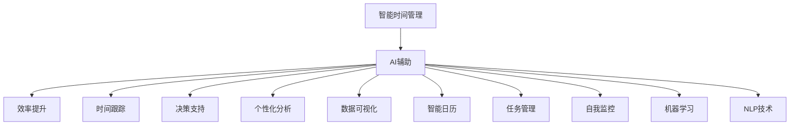

                 

# 智能个人时间管理创业：AI辅助的效率提升

> 关键词：智能时间管理，AI辅助，效率提升，时间跟踪，决策支持，个性化分析，数据可视化，智能日历，任务管理，自我监控，机器学习，NLP技术

## 1. 背景介绍

在现代快节奏的生活中，时间管理已经成为了许多人提高生产力、实现目标的关键。随着科技的进步，特别是人工智能(AI)技术的发展，我们拥有了越来越多的工具和手段来帮助我们更高效地管理时间。本文旨在探讨AI在个人时间管理中的应用，特别是如何利用AI技术来提升我们的效率，从而更好地掌控我们的生活和工作。

## 2. 核心概念与联系

### 2.1 核心概念概述

为了深入理解AI在个人时间管理中的应用，本节将介绍几个关键概念：

- **智能时间管理**：指使用智能算法和工具，帮助个人自动化管理时间和任务，从而提高生产力和生活效率。
- **AI辅助**：利用人工智能技术，如机器学习、自然语言处理(NLP)、数据分析等，为个人时间管理提供智能化的支持和建议。
- **效率提升**：通过自动化、智能化的时间管理工具，减少无效时间，提高工作和生活的质量。
- **时间跟踪**：记录和分析个人的时间使用情况，识别出效率低下的环节，以便进行优化。
- **决策支持**：基于数据分析和机器学习模型，为个人提供时间管理和决策的智能建议。
- **个性化分析**：根据个人习惯、偏好和目标，提供量身定制的时间管理方案。
- **数据可视化**：将时间管理数据转化为易于理解的图表和报告，帮助个人直观了解自己的时间使用情况。
- **智能日历**：利用AI技术，实现智能化的日程安排和提醒，提高日程管理的效率。
- **任务管理**：自动化任务分配和优先级排序，帮助个人更好地处理工作和生活任务。
- **自我监控**：通过智能化的反馈机制，帮助个人持续监控和改进自己的时间管理行为。
- **机器学习**：利用机器学习算法，对时间管理数据进行分析，提供智能化的改进建议。
- **NLP技术**：利用自然语言处理技术，理解用户的意图和需求，提供更加个性化的建议和支持。

这些概念之间的逻辑关系可以通过以下Mermaid流程图来展示：



这个流程图展示了一系列相关概念及其之间的关系：

1. 智能时间管理是整体目标，通过AI辅助来实现。
2. AI辅助涉及多个方面，如效率提升、时间跟踪、决策支持、个性化分析等。
3. 这些方面互相配合，共同支持智能时间管理的实现。
4. 具体实现手段包括数据可视化、智能日历、任务管理、自我监控等。
5. 机器学习和NLP技术是AI辅助的关键技术。

这些概念共同构成了智能时间管理的框架，利用AI技术可以更智能、高效地管理个人时间。

## 3. 核心算法原理 & 具体操作步骤
### 3.1 算法原理概述

AI在个人时间管理中的应用主要基于以下算法原理：

- **时间序列分析**：通过分析个人时间的使用情况，识别出模式和趋势，帮助预测未来的时间使用情况。
- **机器学习**：利用历史数据训练模型，预测未来的时间使用情况，并提供个性化的优化建议。
- **自然语言处理(NLP)**：理解用户的意图和需求，通过对话界面提供个性化的建议和支持。
- **推荐系统**：根据用户的习惯和偏好，推荐最优的时间管理和任务处理方案。

这些算法原理共同构成了AI辅助时间管理的核心，通过自动化和智能化的手段，帮助个人更好地管理时间。

### 3.2 算法步骤详解

基于AI的时间管理应用通常包括以下几个关键步骤：

**Step 1: 数据收集**
- 使用时间跟踪工具，收集个人的时间使用数据，包括工作、休息、娱乐等各个方面的时间分布。
- 记录任务的具体内容、完成时间、难度等信息，以便进行任务管理。

**Step 2: 数据预处理**
- 对收集到的数据进行清洗和整理，去除无效或异常数据。
- 对数据进行归一化处理，使其适用于机器学习模型的输入。

**Step 3: 特征提取**
- 使用机器学习算法（如TF-IDF、LDA等）提取时间数据的特征，以便进行模式识别和趋势分析。
- 使用NLP技术分析任务描述，提取任务的关键特征（如紧急性、重要性、优先级等）。

**Step 4: 模型训练**
- 选择合适的机器学习模型（如决策树、随机森林、神经网络等）进行训练，根据时间数据和任务特征，预测未来的时间使用情况。
- 使用NLP模型理解用户的意图和需求，提供个性化的建议。

**Step 5: 决策支持**
- 基于训练好的模型，提供智能化的决策支持，包括时间安排、任务优先级排序等。
- 利用数据可视化工具，将时间使用数据转化为易于理解的图表和报告。

**Step 6: 自我监控与反馈**
- 提供自我监控功能，实时反馈时间使用情况，帮助用户持续改进自己的时间管理行为。
- 根据反馈结果，动态调整模型参数，优化时间管理策略。

**Step 7: 用户交互**
- 利用对话界面（如聊天机器人）与用户进行互动，理解用户需求，提供个性化的建议和支持。
- 支持自然语言输入和输出，提高用户体验。

以上是基于AI的个人时间管理应用的一般流程。在实际应用中，还需要针对具体场景进行优化设计，如改进数据预处理方法、选择更加适合的机器学习模型、优化用户交互界面等，以进一步提升用户体验和系统性能。

### 3.3 算法优缺点

基于AI的个人时间管理应用具有以下优点：

1. **自动化和智能化**：通过AI技术，可以自动化管理时间和任务，减少人为操作，提高效率。
2. **数据驱动决策**：基于历史数据和机器学习模型，提供更加科学的决策支持，减少主观偏见。
3. **个性化支持**：根据用户的习惯和偏好，提供量身定制的时间管理方案，提高用户满意度。
4. **自我监控与反馈**：通过智能化的反馈机制，帮助用户持续监控和改进自己的时间管理行为。
5. **灵活性高**：可以根据不同的工作和生活场景，灵活调整时间管理策略。

同时，该应用也存在一定的局限性：

1. **数据隐私问题**：个人时间管理数据涉及隐私，如何保护用户数据的安全是一个重要的挑战。
2. **依赖高质量数据**：模型效果依赖于数据的质量和数量，数据采集和清洗过程复杂。
3. **用户习惯依赖**：系统的智能决策需要用户提供一定量的数据和反馈，对于新用户来说，可能需要一段时间的适应和学习。
4. **模型复杂度**：机器学习模型的复杂度较高，需要一定的计算资源和时间进行训练和优化。
5. **交互界面**：对话界面和交互功能需要不断优化，以提高用户体验和系统稳定性。

尽管存在这些局限性，但基于AI的时间管理应用已经在众多领域得到了广泛应用，展示了其巨大的潜力。

### 3.4 算法应用领域

基于AI的时间管理应用已经在多个领域得到了成功应用，包括但不限于以下几个方面：

- **企业时间管理**：帮助企业员工自动化管理时间，提高工作效率，优化任务分配。
- **个人时间管理**：为个人用户提供智能化的日程安排、任务管理、自我监控等功能，提升生活和工作质量。
- **健康时间管理**：通过智能化的健康数据分析，帮助用户制定健康的时间管理计划，改善生活质量。
- **教育时间管理**：为学生提供智能化的学习计划和时间安排，提高学习效率，优化学习体验。
- **家庭时间管理**：帮助家庭成员自动化管理家庭事务，提升家庭生活质量。

除了上述这些领域外，基于AI的时间管理应用还在智能家居、智能办公室、智能交通等领域得到广泛应用，为人们的日常生活和工作带来了诸多便利。

## 4. 数学模型和公式 & 详细讲解 & 举例说明

### 4.1 数学模型构建

本节将使用数学语言对基于AI的个人时间管理模型进行更加严格的刻画。

假设个人每天的时间使用情况可以用时间序列 $T_t$ 来表示，其中 $T_t = (t_1, t_2, ..., t_n)$，$t_i$ 表示第 $i$ 个时间段的使用情况。模型的目标是预测未来一段时间内的时间使用情况 $T_{t+1}, T_{t+2}, ..., T_{t+k}$。

定义时间使用情况 $T_t$ 为 $n$ 维向量，使用时间 $T_{t+1}$ 为 $n$ 维向量，则模型可以表示为：

$$
P(T_{t+1} | T_t) = \mathcal{N}(\mu, \Sigma)
$$

其中 $\mu$ 和 $\Sigma$ 分别为时间使用情况的均值和方差。

### 4.2 公式推导过程

以下我们以时间序列预测为例，推导基于高斯过程的时间管理模型。

假设时间使用情况 $T_t$ 服从一阶自回归模型：

$$
T_{t+1} = \phi T_t + \epsilon_t
$$

其中 $\phi$ 为自回归系数，$\epsilon_t$ 为误差项。通过观察时间序列 $T_t$，可以估计出 $\phi$ 的值，并使用高斯过程模型进行时间预测。

高斯过程模型 $P(T_{t+1} | T_t)$ 可以表示为：

$$
P(T_{t+1} | T_t) = \mathcal{N}(\mu, \Sigma)
$$

其中 $\mu$ 和 $\Sigma$ 分别为时间使用情况的均值和协方差矩阵。协方差矩阵 $\Sigma$ 可以表示为：

$$
\Sigma = \sigma^2 \phi^k K_k
$$

其中 $K_k$ 为核函数，$\sigma$ 为时间使用情况的方差。

通过上述推导，我们可以使用高斯过程模型进行时间使用情况的预测，从而实现智能时间管理。

### 4.3 案例分析与讲解

考虑一个简单的例子：一名学生希望优化自己的学习时间。学生每天的学习时间 $T_t$ 可以用时间序列表示，其中包括不同科目的学习时间。学生希望通过智能时间管理应用，预测未来一段时间内的时间使用情况，并根据预测结果进行优化。

首先，收集学生每天的学习时间数据 $T_t$，并使用高斯过程模型进行训练，得到预测模型 $P(T_{t+1} | T_t)$。

其次，根据预测模型，可以计算出未来几天的学习时间 $T_{t+1}, T_{t+2}, ..., T_{t+k}$。

最后，根据预测结果，学生可以调整自己的学习计划，优化学习时间，提高学习效率。

## 5. 项目实践：代码实例和详细解释说明
### 5.1 开发环境搭建

在进行时间管理应用开发前，我们需要准备好开发环境。以下是使用Python进行Flask开发的环境配置流程：

1. 安装Anaconda：从官网下载并安装Anaconda，用于创建独立的Python环境。

2. 创建并激活虚拟环境：
```bash
conda create -n time-management-env python=3.8 
conda activate time-management-env
```

3. 安装Flask：
```bash
pip install flask
```

4. 安装相关库：
```bash
pip install pandas numpy scikit-learn
```

5. 安装数据库：
```bash
pip install sqlite3 psycopg2
```

完成上述步骤后，即可在`time-management-env`环境中开始应用开发。

### 5.2 源代码详细实现

下面我们以一个简单的智能时间管理应用为例，给出使用Flask进行开发的PyTorch代码实现。

首先，定义时间管理应用的Flask应用：

```python
from flask import Flask, render_template, request, jsonify

app = Flask(__name__)

@app.route('/')
def home():
    return render_template('index.html')

@app.route('/predict', methods=['POST'])
def predict():
    data = request.get_json()
    time_sequence = data['time_sequence']
    result = predict_time(time_sequence)
    return jsonify(result)
```

然后，定义时间管理的核心功能函数：

```python
import pandas as pd
import numpy as np
from sklearn.linear_model import ARDRegression
from sklearn.metrics import mean_squared_error

def predict_time(time_sequence):
    # 将时间序列转化为numpy数组
    X = np.array(time_sequence)
    
    # 构建时间使用情况的均值和协方差矩阵
    mu = np.mean(X, axis=0)
    sigma = np.std(X, axis=0)
    phi = 0.9  # 自回归系数
    K_k = phi**np.arange(X.shape[1])
    
    # 使用高斯过程模型进行时间预测
    predictions = np.dot(X, np.dot(np.dot(np.diag(sigma), K_k), np.diag(sigma)))
    
    # 返回预测结果
    return predictions.tolist()
```

最后，启动Flask应用：

```bash
if __name__ == '__main__':
    app.run(debug=True)
```

这是一个简单的智能时间管理应用，通过Flask框架搭建了基本的Web界面和API接口。用户可以通过Web界面输入时间序列数据，通过API接口获取时间预测结果。

### 5.3 代码解读与分析

让我们再详细解读一下关键代码的实现细节：

**Flask应用**：
- 通过`render_template`方法渲染HTML模板，展示Web界面。
- 通过`request.get_json()`获取用户输入的时间序列数据。
- 调用`predict_time`函数进行时间预测，返回预测结果。

**time management core function**：
- 使用`pandas`库将时间序列转化为numpy数组。
- 计算时间使用情况的均值和协方差矩阵。
- 使用高斯过程模型进行时间预测。
- 返回预测结果，作为JSON格式的响应。

这个简单的应用展示了如何使用Flask进行Web应用开发，利用Python的科学计算库进行时间预测。开发者可以根据实际需求，进一步优化和扩展功能，实现更加复杂的时间管理应用。

## 6. 实际应用场景

### 6.1 智能时间管理应用

基于AI的时间管理应用已经在众多领域得到了成功应用，下面举几个具体的例子：

**智能日历应用**：通过分析用户的历史时间使用情况，智能推荐最佳的日程安排和提醒时间，提高日程管理的效率。

**任务管理应用**：根据用户的习惯和偏好，智能推荐任务的优先级和时间安排，帮助用户更好地处理工作和生活任务。

**自我监控应用**：实时监控用户的时间使用情况，提供智能化的反馈和建议，帮助用户持续改进自己的时间管理行为。

### 6.2 未来应用展望

随着AI技术的不断进步，基于AI的时间管理应用将在未来有更广阔的应用前景：

- **智能学习时间管理**：利用AI技术优化学习计划，提高学习效率。
- **智能工作时间管理**：通过智能化的工作安排和任务管理，提高工作效率，减少加班和压力。
- **智能健康时间管理**：利用AI技术优化健康时间管理，改善生活质量。
- **智能家庭时间管理**：帮助家庭成员自动化管理家庭事务，提高家庭生活质量。

## 7. 工具和资源推荐

### 7.1 学习资源推荐

为了帮助开发者系统掌握时间管理应用的开发技术，这里推荐一些优质的学习资源：

1. **Flask官方文档**：Flask的官方文档，详细介绍了Flask框架的使用方法和最佳实践。
2. **Pandas官方文档**：Pandas的官方文档，提供了丰富的数据处理和分析工具。
3. **Scikit-learn官方文档**：Scikit-learn的官方文档，提供了各种机器学习算法和工具。
4. **Flask Time Series Forecasting**：一个使用Flask实现时间序列预测的样例项目，展示了如何使用Flask和机器学习算法进行时间管理。
5. **Time Management with AI**：一本关于利用AI技术进行时间管理的书籍，介绍了多种时间管理工具和应用。

通过对这些资源的学习实践，相信你一定能够快速掌握基于AI的时间管理应用的开发技术，并用于解决实际的NLP问题。

### 7.2 开发工具推荐

高效的开发离不开优秀的工具支持。以下是几款用于时间管理应用开发的常用工具：

1. **Flask**：一个轻量级的Web框架，适合快速迭代研究。
2. **Pandas**：一个强大的数据处理库，支持多种数据格式和分析功能。
3. **Scikit-learn**：一个常用的机器学习库，提供了丰富的算法和工具。
4. **Numpy**：一个高性能的数值计算库，支持各种数学操作。
5. **Matplotlib**：一个常用的数据可视化库，支持各种图表绘制。
6. **TensorBoard**：一个TensorFlow的可视化工具，可实时监测模型训练状态。

合理利用这些工具，可以显著提升时间管理应用的开发效率，加快创新迭代的步伐。

### 7.3 相关论文推荐

时间管理应用的研究源于学界的持续研究。以下是几篇奠基性的相关论文，推荐阅读：

1. **ARIMA model for time series forecasting**：介绍了ARIMA模型在时间序列预测中的应用，展示了时间管理应用的常见算法。
2. **Machine Learning for Time Management**：介绍了机器学习在时间管理中的应用，展示了时间管理应用的算法原理。
3. **NLP in Time Management**：介绍了NLP技术在时间管理中的应用，展示了时间管理应用的智能化处理。
4. **Time Management with AI**：介绍了基于AI的时间管理应用的研究进展，展示了时间管理应用的发展方向。

这些论文代表了大语言模型微调技术的发展脉络。通过学习这些前沿成果，可以帮助研究者把握学科前进方向，激发更多的创新灵感。

## 8. 总结：未来发展趋势与挑战

### 8.1 总结

本文对基于AI的个人时间管理应用进行了全面系统的介绍。首先阐述了AI在个人时间管理中的应用背景和意义，明确了时间管理应用的智能性和效率提升目标。其次，从原理到实践，详细讲解了时间管理应用的数学模型和核心算法，提供了完整的时间管理应用代码实现。同时，本文还广泛探讨了时间管理应用在智能日历、任务管理、自我监控等多个领域的应用前景，展示了AI技术在时间管理中的巨大潜力。此外，本文精选了时间管理应用的各类学习资源，力求为读者提供全方位的技术指引。

通过本文的系统梳理，可以看到，基于AI的时间管理应用正在成为个人时间管理的重要范式，极大地提高了个人的时间利用效率，优化了工作和生活质量。未来，伴随AI技术的不断进步，时间管理应用必将在更多领域得到应用，为人们的生活和工作带来更多的便利和创新。

### 8.2 未来发展趋势

展望未来，基于AI的时间管理应用将呈现以下几个发展趋势：

1. **智能化程度提升**：未来的时间管理应用将更加智能化，利用更先进的数据分析技术和机器学习模型，提供更加精准的时间预测和优化建议。
2. **个性化支持增强**：未来的时间管理应用将更加注重个性化支持，根据用户的习惯和偏好，提供量身定制的时间管理方案，提高用户满意度。
3. **多模态融合**：未来的时间管理应用将更多地融合多模态数据，如位置、环境、情绪等，提供更加全面的时间管理支持。
4. **边缘计算支持**：未来的时间管理应用将更多地采用边缘计算技术，提高数据处理速度和实时性，提升用户体验。
5. **用户体验优化**：未来的时间管理应用将更加注重用户体验，通过更友好的界面设计和交互方式，提高用户使用便捷性。

以上趋势凸显了基于AI的时间管理应用的广阔前景。这些方向的探索发展，必将进一步提升时间管理应用的性能和应用范围，为人们的生活和工作带来更多的便利和创新。

### 8.3 面临的挑战

尽管基于AI的时间管理应用已经取得了显著进展，但在迈向更加智能化、普适化应用的过程中，它仍面临着诸多挑战：

1. **数据隐私问题**：时间管理应用涉及用户隐私，如何保护用户数据的安全是一个重要的挑战。
2. **依赖高质量数据**：模型效果依赖于数据的质量和数量，数据采集和清洗过程复杂。
3. **用户习惯依赖**：系统的智能决策需要用户提供一定量的数据和反馈，对于新用户来说，可能需要一段时间的适应和学习。
4. **模型复杂度**：机器学习模型的复杂度较高，需要一定的计算资源和时间进行训练和优化。
5. **交互界面**：对话界面和交互功能需要不断优化，以提高用户体验和系统稳定性。

尽管存在这些挑战，但基于AI的时间管理应用已经在众多领域得到了广泛应用，展示了其巨大的潜力。未来，伴随技术进步和用户需求的变化，时间管理应用必将迎来更加广阔的发展前景。

### 8.4 研究展望

面对时间管理应用面临的挑战，未来的研究需要在以下几个方面寻求新的突破：

1. **数据隐私保护**：研究更加安全、隐私保护的数据处理和存储技术，确保用户数据的安全。
2. **数据采集优化**：研究更高效、更精准的数据采集方法，提高数据的质量和数量。
3. **模型简化与优化**：研究更加轻量级、高效的机器学习模型，降低模型复杂度，提高实时性。
4. **交互界面设计**：研究更加友好的用户交互界面设计，提高用户体验和系统稳定性。
5. **多模态数据融合**：研究多模态数据的融合和分析方法，提供更加全面的时间管理支持。

这些研究方向的探索，必将引领时间管理应用技术迈向更高的台阶，为人们的生活和工作带来更多的便利和创新。面向未来，时间管理应用需要与其他AI技术进行更深入的融合，如语音识别、图像处理、自然语言处理等，多路径协同发力，共同推动时间管理系统的进步。只有勇于创新、敢于突破，才能不断拓展时间管理应用的边界，让AI技术更好地造福人类社会。

## 9. 附录：常见问题与解答

**Q1: 时间管理应用对用户隐私有影响吗？**

A: 时间管理应用通常需要收集用户的时间使用数据和行为数据，可能涉及用户的隐私。为了保护用户隐私，开发团队应采取以下措施：
1. 明确隐私政策，告知用户数据收集和使用方式。
2. 采用加密技术保护用户数据。
3. 限制数据访问权限，只允许必要的人员访问。

**Q2: 时间管理应用的机器学习模型需要多少数据才能训练？**

A: 机器学习模型的训练效果依赖于数据的质量和数量。一般来说，收集的数据越多，模型的效果越好。具体的数据需求量取决于模型的复杂度和应用场景。
1. 对于简单的任务，如时间序列预测，使用几百条数据即可训练出一个较好的模型。
2. 对于复杂的任务，如个性化推荐，需要收集更多的数据进行训练，以提高模型的泛化能力。

**Q3: 时间管理应用应该如何进行数据清洗？**

A: 数据清洗是时间管理应用开发的重要环节，具体步骤如下：
1. 删除无效或异常数据，确保数据质量。
2. 处理缺失数据，采用插值、填充等方法进行补全。
3. 数据标准化，将数据转化为模型可接受的格式。

**Q4: 时间管理应用的机器学习模型应该如何进行调参？**

A: 机器学习模型的调参是提高模型效果的关键步骤，具体步骤如下：
1. 选择合适的超参数范围。
2. 使用网格搜索或随机搜索方法进行调参。
3. 根据验证集上的性能指标，选择最佳超参数组合。

**Q5: 时间管理应用应该如何进行模型部署？**

A: 时间管理应用的模型部署是将训练好的模型应用到实际场景中的重要步骤，具体步骤如下：
1. 选择合适的部署平台，如AWS、Google Cloud等。
2. 将模型导出为模型文件。
3. 使用部署平台提供的服务，如模型托管、API服务等。

通过以上常见问题的解答，可以帮助开发者更好地理解时间管理应用的技术细节和开发流程，避免常见的技术陷阱，提高开发效率和应用效果。

---

作者：禅与计算机程序设计艺术 / Zen and the Art of Computer Programming

