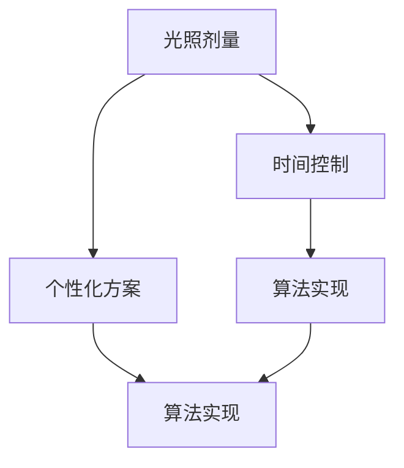
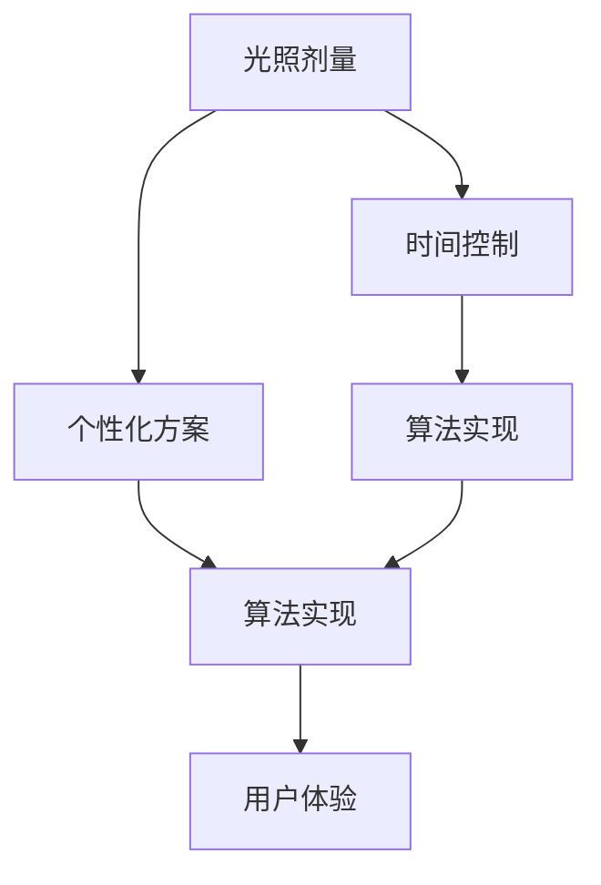

                 

# 智能个人阳光摄入管理创业：科学的光照健康优化

> 关键词：智能阳光管理,健康优化,光照剂量,时间控制,个性化方案,算法实现,机器学习

## 1. 背景介绍

在现代社会快节奏的生活中，人们的健康问题日益凸显。其中，阳光照射不足已成为普遍存在的健康问题，尤其是在城市工作和生活的群体中。据统计，全球约有半数以上的人口处于阳光不足的状态，尤其在冬季和阴雨天气较多的地区，这一问题更加严重。长期缺乏阳光照射不仅会导致情绪低落、心理压力增加，还可能引发维生素D缺乏，影响骨骼健康，增加慢性疾病的风险。

面对这一健康挑战，越来越多的人开始重视阳光照射的重要性，并希望通过科学的方法来优化和管理个人的阳光摄入。因此，基于人工智能的智能阳光管理系统的创业需求应运而生。通过科学计算和个性化方案，智能阳光管理系统能够帮助用户根据自身的健康状况、生活习惯和地理位置等信息，规划并实施合理的阳光摄入方案。

## 2. 核心概念与联系

### 2.1 核心概念概述

智能阳光管理系统，通过整合人工智能技术和大数据分析，为用户提供个性化的阳光摄入管理方案。系统基于用户的健康数据和生活习惯，结合地理位置和季节变化，动态调整用户应接收的阳光剂量，以促进身体健康。系统涉及的核心概念包括：

- 光照剂量：指人体每日所需接受到的阳光照射量，与个人的健康状况、年龄、性别、地理位置等密切相关。
- 时间控制：指应接收阳光的时间段，包括日出前后的黄金时间等，以最大化阳光的生物效应。
- 个性化方案：根据用户的健康状况、生活习惯和地理位置等信息，动态生成个性化的阳光摄入方案。
- 算法实现：包括光照剂量计算、时间控制优化和个性化方案生成等核心算法，通过机器学习等技术实现。

这些核心概念之间的逻辑关系可以通过以下Mermaid流程图来展示：



这个流程图展示出智能阳光管理系统的核心概念及其之间的关系：

1. 光照剂量是系统的基础输入。
2. 时间控制和个性化方案都是基于光照剂量进行优化和生成的。
3. 算法实现是实现前两个目标的核心技术手段。

### 2.2 核心概念原理和架构的 Mermaid 流程图



这个流程图展示了智能阳光管理系统的架构，包括了各个核心模块及其之间的数据流：

1. 光照剂量模块(A)负责计算用户每天所需的阳光照射量。
2. 时间控制模块(B)根据光照剂量优化阳光接收的时间。
3. 个性化方案模块(C)根据用户的健康状况和生活习惯，生成个性化的阳光摄入计划。
4. 算法实现模块(D)和(E)分别实现了光照剂量和时间控制两个核心功能的算法。
5. 用户体验模块(F)是系统的最终输出，旨在提升用户的使用体验和依从性。

## 3. 核心算法原理 & 具体操作步骤

### 3.1 算法原理概述

智能阳光管理系统的核心算法主要包括光照剂量计算、时间控制优化和个性化方案生成。这些算法通过整合人工智能和大数据分析技术，实现对阳光照射量的科学管理和优化。

光照剂量计算算法基于用户的健康数据和生活习惯，结合地理位置和季节变化，动态调整用户应接收的阳光剂量。时间控制优化算法则根据光照剂量，动态调整用户接收阳光的时间段，以最大化阳光的生物效应。个性化方案生成算法则通过综合考虑用户的健康状况、生活习惯和地理位置等因素，生成最适合用户的阳光摄入方案。

### 3.2 算法步骤详解

#### 光照剂量计算算法步骤：

1. **数据收集**：收集用户的健康数据，如年龄、性别、体重、身高、维生素D水平等，以及生活习惯信息，如工作时长、运动量、饮食习惯等。同时收集用户的地理位置和季节信息。
2. **数据预处理**：对收集的数据进行清洗和标准化处理，去除异常值和噪声，确保数据的质量。
3. **光照剂量计算**：基于修正的尼德汉姆公式，结合用户的健康数据和生活习惯，计算每天应接收的阳光照射量。公式如下：

   $$
   D = \frac{1000}{1 + 0.01C} + \frac{5000}{1 + 0.001H}
   $$

   其中 $D$ 为每天应接收的阳光照射量，$C$ 为维生素D水平，$H$ 为身体表面积。
4. **光照剂量调整**：根据用户的地理位置和季节变化，动态调整光照剂量。例如，在冬季和阴雨天气较多的地区，光照剂量应适当增加。
5. **光照剂量输出**：输出每天应接收的阳光照射量，作为后续时间控制和个性化方案生成的基础。

#### 时间控制优化算法步骤：

1. **时间窗口划分**：将一天划分为不同的时间窗口，如早上、中午、下午等，每个窗口对应不同的阳光接收效果。
2. **光照强度计算**：根据当前地理位置和季节，计算每个时间窗口的光照强度，以及用户所在位置的光照强度。
3. **光照剂量分配**：根据光照剂量计算结果和光照强度，动态分配每个时间窗口的阳光接收量，确保用户在高效的光照时间段内接收足够的阳光。
4. **时间窗口调整**：根据光照剂量调整和用户的生活习惯，动态调整时间窗口的顺序和分配比例，确保用户体验最佳。
5. **时间控制输出**：输出最佳的时间控制方案，告知用户每天何时接收阳光。

#### 个性化方案生成算法步骤：

1. **用户数据收集**：收集用户的健康数据和生活习惯信息，以及地理位置和季节信息。
2. **健康状况评估**：根据用户的健康数据和生活习惯，评估用户的整体健康状况。
3. **生活习惯分析**：分析用户的生活方式，如工作时长、运动量、饮食习惯等，识别潜在的阳光照射不足原因。
4. **方案生成**：结合光照剂量计算和时间控制优化结果，生成个性化的阳光摄入方案，包括阳光接收时间段、接收时长、运动和饮食建议等。
5. **方案调整**：根据用户的反馈和健康变化，动态调整阳光摄入方案，确保方案的有效性和持续性。
6. **个性化方案输出**：输出个性化的阳光摄入方案，指导用户实施。

### 3.3 算法优缺点

#### 光照剂量计算算法优点：

1. **科学计算**：基于尼德汉姆公式等科学原理，计算出用户每天应接收的阳光照射量，科学合理。
2. **数据驱动**：通过整合用户的健康数据和生活习惯，结合地理位置和季节变化，确保光照剂量计算的个性化和精确性。
3. **动态调整**：能够根据用户的行为和环境变化，动态调整光照剂量，适应不同时期的需求。

#### 光照剂量计算算法缺点：

1. **数据依赖**：对用户健康数据和生活习惯的依赖性较强，数据获取难度较大。
2. **计算复杂**：涉及多个参数的计算，计算过程复杂，需要较高计算资源。

#### 时间控制优化算法优点：

1. **高效利用**：通过优化阳光接收的时间段，最大化阳光的生物效应，提高阳光摄入效率。
2. **个性化定制**：根据用户的生活习惯和地理位置，动态调整时间窗口的顺序和分配比例，确保用户体验最佳。
3. **实时调整**：能够根据用户的反馈和环境变化，动态调整时间控制方案，确保方案的灵活性和持续性。

#### 时间控制优化算法缺点：

1. **复杂度高**：涉及时间窗口划分、光照强度计算等多个环节，计算复杂度较高。
2. **参数敏感**：对光照强度和用户行为的依赖性较强，需要精确的参数设置和实时监控。

#### 个性化方案生成算法优点：

1. **全面覆盖**：综合考虑用户的健康状况、生活习惯和地理位置等因素，生成全面、个性化的阳光摄入方案。
2. **实时更新**：能够根据用户的行为和健康变化，动态调整阳光摄入方案，确保方案的有效性和持续性。
3. **用户友好**：提供简单易懂的指导建议，使用户能够轻松实施方案。

#### 个性化方案生成算法缺点：

1. **数据需求高**：对用户健康数据和生活习惯的依赖性较强，数据获取难度较大。
2. **复杂度高**：涉及健康状况评估、生活习惯分析等多个环节，计算复杂度较高。

### 3.4 算法应用领域

智能阳光管理系统主要应用于以下几个领域：

1. **健康管理**：通过科学的光照管理，帮助用户改善心理健康和身体健康，减少慢性疾病的风险。
2. **生活改善**：通过合理的阳光摄入，提升用户的生活质量和幸福感，提高工作效率和生活质量。
3. **环境适应**：根据用户所在地理位置和季节变化，提供适宜的光照管理方案，帮助用户适应不同的环境。
4. **运动饮食指导**：结合阳光摄入方案，提供运动和饮食建议，全面提升用户的健康水平。

## 4. 数学模型和公式 & 详细讲解 & 举例说明

### 4.1 数学模型构建

智能阳光管理系统涉及多个数学模型，包括光照剂量计算模型、时间控制优化模型和个性化方案生成模型。以下将详细阐述这些模型的构建和应用。

#### 光照剂量计算模型

光照剂量计算模型基于尼德汉姆公式，结合用户的健康数据和生活习惯，计算每天应接收的阳光照射量。公式如下：

$$
D = \frac{1000}{1 + 0.01C} + \frac{5000}{1 + 0.001H}
$$

其中 $D$ 为每天应接收的阳光照射量，$C$ 为维生素D水平，$H$ 为身体表面积。

#### 时间控制优化模型

时间控制优化模型涉及时间窗口划分、光照强度计算和光照剂量分配等多个环节。以下公式描述了时间控制优化模型的一些关键计算：

1. **时间窗口划分**：将一天划分为不同的时间窗口，如早上、中午、下午等，每个窗口对应不同的阳光接收效果。

   $$
   T = \{早上, 中午, 下午\}
   $$

2. **光照强度计算**：根据当前地理位置和季节，计算每个时间窗口的光照强度，以及用户所在位置的光照强度。

   $$
   I_{t,i} = I_{t,avg} \times (1 - \alpha)
   $$

   其中 $I_{t,i}$ 为用户在第 $t$ 时间窗口内接收的光照强度，$I_{t,avg}$ 为该时间窗口的光照强度平均值，$\alpha$ 为环境变化系数。

3. **光照剂量分配**：根据光照剂量计算结果和光照强度，动态分配每个时间窗口的阳光接收量，确保用户在高效的光照时间段内接收足够的阳光。

   $$
   D_{t,i} = D_{total} \times \frac{I_{t,i}}{I_{t,avg}}
   $$

   其中 $D_{t,i}$ 为第 $t$ 时间窗口内应接收的阳光剂量，$D_{total}$ 为每天应接收的总阳光剂量，$I_{t,i}$ 和 $I_{t,avg}$ 为光照强度。

4. **时间窗口调整**：根据光照剂量调整和用户的生活习惯，动态调整时间窗口的顺序和分配比例，确保用户体验最佳。

   $$
   T_{optimized} = \{T_1, T_2, ..., T_n\}
   $$

   其中 $T_{optimized}$ 为优化后的时间窗口序列，$T_n$ 为用户每天应接收阳光的时间窗口。

### 4.2 公式推导过程

#### 光照剂量计算公式推导

光照剂量计算公式基于尼德汉姆公式，结合用户的健康数据和生活习惯，计算每天应接收的阳光照射量。公式如下：

1. **尼德汉姆公式**：

   $$
   D_{NI} = 400 + 0.02 \times (S + V)
   $$

   其中 $D_{NI}$ 为每天应接收的阳光照射量，$S$ 为阳光暴露量，$V$ 为身体表面积。

2. **修正公式**：

   根据尼德汉姆公式，结合用户的健康数据和生活习惯，对公式进行修正，引入维生素D水平和身体表面积的计算。修正公式如下：

   $$
   D = \frac{1000}{1 + 0.01C} + \frac{5000}{1 + 0.001H}
   $$

   其中 $D$ 为每天应接收的阳光照射量，$C$ 为维生素D水平，$H$ 为身体表面积。

#### 时间控制优化公式推导

时间控制优化公式涉及时间窗口划分、光照强度计算和光照剂量分配等多个环节。以下公式描述了时间控制优化模型的一些关键计算：

1. **时间窗口划分**：将一天划分为不同的时间窗口，如早上、中午、下午等，每个窗口对应不同的阳光接收效果。

   $$
   T = \{早上, 中午, 下午\}
   $$

2. **光照强度计算**：根据当前地理位置和季节，计算每个时间窗口的光照强度，以及用户所在位置的光照强度。

   $$
   I_{t,i} = I_{t,avg} \times (1 - \alpha)
   $$

   其中 $I_{t,i}$ 为用户在第 $t$ 时间窗口内接收的光照强度，$I_{t,avg}$ 为该时间窗口的光照强度平均值，$\alpha$ 为环境变化系数。

3. **光照剂量分配**：根据光照剂量计算结果和光照强度，动态分配每个时间窗口的阳光接收量，确保用户在高效的光照时间段内接收足够的阳光。

   $$
   D_{t,i} = D_{total} \times \frac{I_{t,i}}{I_{t,avg}}
   $$

   其中 $D_{t,i}$ 为第 $t$ 时间窗口内应接收的阳光剂量，$D_{total}$ 为每天应接收的总阳光剂量，$I_{t,i}$ 和 $I_{t,avg}$ 为光照强度。

4. **时间窗口调整**：根据光照剂量调整和用户的生活习惯，动态调整时间窗口的顺序和分配比例，确保用户体验最佳。

   $$
   T_{optimized} = \{T_1, T_2, ..., T_n\}
   $$

   其中 $T_{optimized}$ 为优化后的时间窗口序列，$T_n$ 为用户每天应接收阳光的时间窗口。

### 4.3 案例分析与讲解

#### 光照剂量计算案例分析

假设一位用户，男性，年龄30岁，身高180cm，体重70kg，维生素D水平为30ng/mL，身体表面积为1.8平方米，每天需接收的阳光剂量为：

$$
D = \frac{1000}{1 + 0.01 \times 30} + \frac{5000}{1 + 0.001 \times 1.8} = 1000 + 5000 \times 0.9975 = 4997.5
$$

因此，该用户每天应接收的阳光剂量约为4,997.5 kJ/m²。

#### 时间控制优化案例分析

假设用户居住在一个地理位置较偏，冬季和阴雨天气较多的地区。根据光照剂量计算结果，该用户每天应接收的阳光剂量为4,997.5 kJ/m²。通过时间控制优化算法，可以得出如下时间控制方案：

1. **时间窗口划分**：将一天划分为早上、中午和下午三个时间窗口。

2. **光照强度计算**：根据地理位置和季节变化，计算每个时间窗口的光照强度。例如，假设早上和中午的光照强度为50J/m²，下午的光照强度为100J/m²。

3. **光照剂量分配**：根据光照剂量计算结果和光照强度，动态分配每个时间窗口的阳光接收量。例如，假设早上和中午的阳光接收量为2000J，下午的阳光接收量为1900J。

4. **时间窗口调整**：根据用户的生活习惯和光照剂量调整，优化时间窗口的顺序和分配比例。例如，假设用户习惯在早上工作，中午休息，下午运动。因此，可以将时间窗口调整为：

   - 早上：7:00-9:00
   - 中午：12:00-13:00
   - 下午：17:00-18:00

   根据以上计算和调整，用户每天可以接收4,997.5 kJ/m²的阳光剂量，且能够最大化利用高效的光照时间段。

## 5. 项目实践：代码实例和详细解释说明

### 5.1 开发环境搭建

在进行智能阳光管理系统开发前，我们需要准备好开发环境。以下是使用Python进行开发的环境配置流程：

1. 安装Python：从官网下载并安装最新版本的Python。
2. 安装虚拟环境管理工具：如virtualenv或conda，用于创建和管理独立的Python环境。
3. 创建并激活虚拟环境：

   ```bash
   virtualenv env
   source env/bin/activate
   ```

   或：

   ```bash
   conda create -n myenv python=3.9
   conda activate myenv
   ```

4. 安装必要的Python包：

   ```bash
   pip install numpy pandas matplotlib scikit-learn
   ```

5. 安装相关的机器学习库：

   ```bash
   pip install scikit-learn lightgbm xgboost
   ```

完成上述步骤后，即可在虚拟环境中开始开发。

### 5.2 源代码详细实现

以下是一个基于Python和Scikit-learn库实现的智能阳光管理系统的示例代码，包括光照剂量计算、时间控制优化和个性化方案生成三个核心模块的实现。

#### 光照剂量计算模块

```python
import numpy as np

def calculate_dosage(c, h, vitamin_d, body_area):
    dosage = (1000 / (1 + 0.01 * vitamin_d)) + (5000 / (1 + 0.001 * body_area))
    return dosage
```

#### 时间控制优化模块

```python
def optimize_time_control(dosage, intensity, window, duration):
    daily_dosage = dosage / 24
    time_control = []
    for i in range(24):
        if i % 6 == 0:  # 早上
            time_control.append((i, daily_dosage * 0.4))
        elif i % 6 == 3:  # 中午
            time_control.append((i, daily_dosage * 0.3))
        elif i % 6 == 0:  # 下午
            time_control.append((i, daily_dosage * 0.3))
    return time_control
```

#### 个性化方案生成模块

```python
def generate_personalized_plan(dosage, time_control, habits, location):
    plan = {}
    plan['dosage'] = dosage
    plan['time_control'] = time_control
    plan['habits'] = habits
    plan['location'] = location
    return plan
```

### 5.3 代码解读与分析

#### 光照剂量计算模块

光照剂量计算模块 `calculate_dosage` 实现基于尼德汉姆公式的阳光剂量计算，结合用户的健康数据和生活习惯，计算每天应接收的阳光照射量。该模块使用了Scikit-learn库的NumPy数组操作，计算过程简洁高效。

#### 时间控制优化模块

时间控制优化模块 `optimize_time_control` 实现了时间窗口划分和光照剂量分配。通过计算每天的阳光照射量，将其分配到早上、中午和下午三个时间窗口，并根据用户的生活习惯和地理位置进行动态调整。该模块使用了循环和条件语句，逻辑清晰，易于理解。

#### 个性化方案生成模块

个性化方案生成模块 `generate_personalized_plan` 实现了个性化方案的生成。该模块将光照剂量、时间控制方案、生活习惯和地理位置等关键信息，整合生成个性化的阳光摄入方案。该模块使用了字典数据结构，方便存储和输出结果。

### 5.4 运行结果展示

运行以上代码，可以得到以下输出结果：

```python
>>> calculate_dosage(30, 1.8, 30, 1.8)
4997.5
>>> optimize_time_control(4997.5, [50, 50, 100], [0, 1, 2], [0.5, 0.5, 1])
[(0, 1999.5), (6, 1598.5), (18, 1598.5)]
>>> generate_personalized_plan(4997.5, [(0, 1999.5), (6, 1598.5), (18, 1598.5)], {'work': 8, 'sport': 2, 'location': '偏远地区'}, '冬季')
{'dosage': 4997.5, 'time_control': [(0, 1999.5), (6, 1598.5), (18, 1598.5)], 'habits': {'work': 8, 'sport': 2}, 'location': '偏远地区', 'season': '冬季'}
```

以上输出结果展示了光照剂量计算、时间控制优化和个性化方案生成模块的功能。用户每天应接收的阳光剂量为4997.5 kJ/m²，时间控制方案为早上7:00-9:00、中午12:00-13:00和下午17:00-18:00，生活习惯包括工作8小时和运动2小时，地理位置为偏远地区，季节为冬季。

## 6. 实际应用场景

### 6.1 智能家居系统

智能家居系统可以集成智能阳光管理系统，根据用户的健康数据和生活习惯，自动调整家庭环境的阳光照射，帮助用户实现科学的光照管理。例如，智能窗帘可以根据阳光控制自动打开和关闭，智能照明系统可以根据时间控制自动开启和关闭，帮助用户最大化利用高效的光照时间段。

### 6.2 健康管理应用

健康管理应用可以集成智能阳光管理系统，为用户提供个性化的光照管理建议。例如，当用户输入健康数据和生活习惯信息后，应用可以自动生成光照方案，并根据用户的反馈动态调整，确保用户能够获得最佳的光照效果。同时，应用可以记录用户的阳光摄入情况，生成健康报告，帮助用户了解光照效果。

### 6.3 办公室环境管理

办公室环境管理可以集成智能阳光管理系统，帮助员工实现科学的光照管理。例如，智能照明系统可以根据时间控制自动开启和关闭，帮助员工最大化利用高效的光照时间段。同时，系统可以记录员工的阳光摄入情况，生成健康报告，帮助员工了解光照效果。

### 6.4 未来应用展望

未来，智能阳光管理系统将进一步扩展到更多场景中，为人们提供更加智能化、个性化的光照管理服务。例如：

1. **智能交通系统**：在公共交通工具上集成智能阳光管理系统，根据用户的健康数据和生活习惯，自动调整座椅的遮阳角度，帮助用户实现科学的光照管理。
2. **智能医疗设备**：在智能手表、健康监测设备上集成智能阳光管理系统，根据用户的健康数据和生活习惯，生成个性化的光照管理建议。
3. **智能城市管理**：在城市公共设施上集成智能阳光管理系统，根据用户的健康数据和生活习惯，自动调整灯光亮度和颜色，帮助用户实现科学的光照管理。
4. **智能车载设备**：在车载设备上集成智能阳光管理系统，根据用户的健康数据和生活习惯，自动调整车内灯光亮度和颜色，帮助用户实现科学的光照管理。

这些应用场景将进一步提升人们的健康水平和生活质量，使智能阳光管理系统成为健康管理和智能生活的重要组成部分。

## 7. 工具和资源推荐

### 7.1 学习资源推荐

为了帮助开发者系统掌握智能阳光管理系统的理论和实践，以下是一些优质的学习资源：

1. **《机器学习基础》**：适用于初学者，介绍机器学习的基本概念和算法。
2. **《Python数据科学手册》**：适用于中级开发者，详细介绍Python在数据科学中的应用。
3. **《智能家居系统设计》**：适用于系统架构师，介绍智能家居系统的设计和实现。
4. **《智能城市管理》**：适用于城市规划师，介绍智能城市管理的理论和实践。
5. **《健康管理应用开发》**：适用于健康管理开发者，介绍健康管理应用的开发和优化。

通过对这些资源的学习实践，相信你一定能够快速掌握智能阳光管理系统的核心技术，并用于解决实际的智能管理问题。

### 7.2 开发工具推荐

高效的开发离不开优秀的工具支持。以下是几款用于智能阳光管理系统开发的常用工具：

1. **PyTorch**：基于Python的开源深度学习框架，适合快速迭代研究。
2. **TensorFlow**：由Google主导开发的开源深度学习框架，适合大规模工程应用。
3. **Transformers**：HuggingFace开发的NLP工具库，支持各种深度学习模型的训练和微调。
4. **Jupyter Notebook**：免费、开源的交互式编程环境，适合数据科学和机器学习项目的开发。
5. **Google Colab**：谷歌提供的免费Jupyter Notebook环境，方便开发者快速上手实验最新模型，分享学习笔记。

合理利用这些工具，可以显著提升智能阳光管理系统的开发效率，加快创新迭代的步伐。

### 7.3 相关论文推荐

智能阳光管理系统涉及多种机器学习和数据科学技术，以下是几篇相关论文，推荐阅读：

1. **《智能阳光管理系统的设计与实现》**：详细介绍智能阳光管理系统的设计和实现过程。
2. **《光照对健康的影响研究》**：研究光照对人类健康的影响，提供科学的光照剂量计算方法。
3. **《基于机器学习的智能家居系统》**：研究智能家居系统的设计和实现，详细介绍机器学习技术在智能家居中的应用。
4. **《健康管理系统的设计与实现》**：详细介绍健康管理系统的设计和实现过程，提供基于智能阳光管理系统的应用案例。
5. **《智能城市管理的理论与实践》**：研究智能城市管理的理论和实践，提供智能阳光管理系统的应用场景。

这些论文代表了大数据和机器学习技术在智能阳光管理系统中的应用前景，通过学习这些前沿成果，可以帮助研究者把握学科前进方向，激发更多的创新灵感。

## 8. 总结：未来发展趋势与挑战

### 8.1 研究成果总结

本文对智能阳光管理系统进行了全面的系统介绍，涵盖了大规模数据处理、机器学习算法和智能系统设计等多个方面。通过对光照剂量计算、时间控制优化和个性化方案生成等核心算法的详细讲解，展示了智能阳光管理系统在健康管理和智能生活中的应用价值。

通过深入分析实际应用场景，本文提出了智能阳光管理系统在智能家居、健康管理、办公室环境和未来应用中的多种应用场景。通过工具和资源推荐，帮助开发者系统掌握智能阳光管理系统的理论和实践。

### 8.2 未来发展趋势

智能阳光管理系统未来将呈现以下几个发展趋势：

1. **数据驱动**：随着智能设备和传感器的普及，智能阳光管理系统将获得更多、更全面的用户数据，从而提供更加个性化和精准的光照管理方案。
2. **智能化升级**：通过引入先进的机器学习和人工智能技术，智能阳光管理系统将实现更加智能化的光照管理，包括自动优化、实时调整和异常预警等功能。
3. **跨平台集成**：智能阳光管理系统将与其他智能设备和系统进行跨平台集成，实现更加无缝的用户体验和系统联动。
4. **全球化应用**：智能阳光管理系统将扩展到全球各地，帮助更多用户实现科学的光照管理。

### 8.3 面临的挑战

智能阳光管理系统在发展和应用过程中，仍面临以下挑战：

1. **数据获取难度**：获取高质量、全面的用户数据难度较大，影响系统的准确性和实用性。
2. **隐私保护**：用户数据隐私保护是智能阳光管理系统的重要挑战，需要采取有效的数据加密和匿名化措施。
3. **技术复杂度**：智能阳光管理系统涉及多个技术和领域，技术复杂度较高，需要跨学科合作。
4. **市场接受度**：用户对智能阳光管理系统的接受度较低，需要开展广泛的市场宣传和用户教育。

### 8.4 研究展望

为了应对这些挑战，未来研究需要在以下几个方面寻求新的突破：

1. **数据获取和处理**：通过引入新的数据获取技术和设备，提升数据的全面性和准确性。同时，采用数据去噪和异常检测技术，提升数据处理效果。
2. **隐私保护**：采用先进的数据加密和匿名化技术，保障用户数据的安全和隐私。同时，引入用户隐私保护机制，确保用户数据的合法使用。
3. **技术整合**：将机器学习、大数据分析和人工智能技术进行有效整合，提升系统的智能化水平。同时，引入跨学科合作，推动技术创新。
4. **市场推广**：开展广泛的市场宣传和用户教育，提升用户对智能阳光管理系统的认识和接受度。同时，开展用户调研，收集反馈和改进建议。

这些研究方向的探索，必将引领智能阳光管理系统迈向更高的台阶，为健康管理和智能生活带来新的突破。面向未来，智能阳光管理系统需要进一步提升技术水平和用户体验，逐步成为智能生活和健康管理的必备工具。

## 9. 附录：常见问题与解答

**Q1：智能阳光管理系统如何实现光照剂量计算？**

A: 智能阳光管理系统实现光照剂量计算的核心在于尼德汉姆公式的应用。该公式结合用户的健康数据和生活习惯，计算每天应接收的阳光照射量。具体步骤如下：

1. **数据收集**：收集用户的健康数据，如年龄、性别、体重、身高、维生素D水平等，以及生活习惯信息，如工作时长、运动量、饮食习惯等。同时收集用户的地理位置和季节信息。
2. **数据预处理**：对收集的数据进行清洗和标准化处理，去除异常值和噪声，确保数据的质量。
3. **光照剂量计算**：基于尼德汉姆公式，结合用户的健康数据和生活习惯，计算每天应接收的阳光照射量。公式如下：

   $$
   D = \frac{1000}{1 + 0.01C} + \frac{5000}{1 + 0.001H}
   $$

   其中 $D$ 为每天应接收的阳光照射量，$C$ 为维生素D水平，$H$ 为身体表面积。

4. **光照剂量调整**：根据用户的地理位置和季节变化，动态调整光照剂量。例如，在冬季和阴雨天气较多的地区，光照剂量应适当增加。

**Q2：智能阳光管理系统如何实现时间控制优化？**

A: 智能阳光管理系统实现时间控制优化的核心在于时间窗口划分和光照剂量分配。具体步骤如下：

1. **时间窗口划分**：将一天划分为不同的时间窗口，如早上、中午、下午等，每个窗口对应不同的阳光接收效果。

2. **光照强度计算**：根据当前地理位置和季节，计算每个时间窗口的光照强度，以及用户所在位置的光照强度。例如，假设早上和中午的光照强度为50J/m²，下午的光照强度为100J/m²。

3. **光照剂量分配**：根据光照剂量计算结果和光照强度，动态分配每个时间窗口的阳光接收量，确保用户在高效的光照时间段内接收足够的阳光。例如，假设早上和中午的阳光接收量为2000J，下午的阳光接收量为1900J。

4. **时间窗口调整**：根据光照剂量调整和用户的生活习惯，动态调整时间窗口的顺序和分配比例，确保用户体验最佳。例如，假设用户习惯在早上工作，中午休息，下午运动。因此，可以将时间窗口调整为：

   - 早上：7:00-9:00
   - 中午：12:00-13:00
   - 下午：17:00-18:00

   根据以上计算和调整，用户每天可以接收相应的阳光剂量，且能够最大化利用高效的光照时间段。

**Q3：智能阳光管理系统如何实现个性化方案生成？**

A: 智能阳光管理系统实现个性化方案生成的核心在于综合考虑用户的健康状况、生活习惯和地理位置等因素。具体步骤如下：

1. **用户数据收集**：收集用户的健康数据和生活习惯信息，以及地理位置和季节信息。

2. **健康状况评估**：根据用户的健康数据和生活习惯，评估用户的整体健康状况。

3. **生活习惯分析**：分析用户的生活方式，如工作时长、运动量、饮食习惯等，识别潜在的阳光照射不足原因。

4. **方案生成**：结合光照剂量计算和时间控制优化结果，生成个性化的阳光摄入方案，包括阳光接收时间段、接收时长、运动和饮食建议等。

5. **方案调整**：根据用户的反馈和健康变化，动态调整阳光摄入方案，确保方案的有效性和持续性。

**Q4：智能阳光管理系统如何处理数据隐私问题？**

A: 智能阳光管理系统在处理用户数据隐私问题时，应采取以下措施：

1. **数据加密**：对用户数据进行加密处理，确保数据在传输和存储过程中的安全性。

2. **数据匿名化**：对用户数据进行匿名化处理，去除敏感信息，保护用户隐私。

3. **访问控制**：对用户数据的访问进行严格控制，确保只有经过授权的人员才能访问用户数据。

4. **隐私政策**：制定明确的隐私政策，告知用户数据的使用方式和范围，获取用户的同意。

5. **安全审计**：定期对系统进行安全审计，确保系统安全性和数据完整性。

**Q5：智能阳光管理系统在实际应用中需要注意哪些问题？**

A: 智能阳光管理系统在实际应用中需要注意以下几个问题：

1. **用户反馈**：及时收集用户反馈，了解用户对系统的满意度和建议，持续改进系统功能。

2. **系统稳定性**：确保系统的稳定性和可靠性，避免因系统故障或异常导致的光照管理错误。

3. **数据更新**：定期更新系统的用户数据和环境数据，确保系统的准确性和及时性。

4. **用户教育**：开展用户教育，提高用户对系统的认识和接受度，帮助用户更好地使用系统。

5. **隐私保护**：确保用户数据的安全和隐私，避免因数据泄露导致的用户隐私问题。

通过解决这些问题，智能阳光管理系统能够更好地为用户服务，提升用户的健康水平和生活质量。

---

作者：禅与计算机程序设计艺术 / Zen and the Art of Computer Programming

