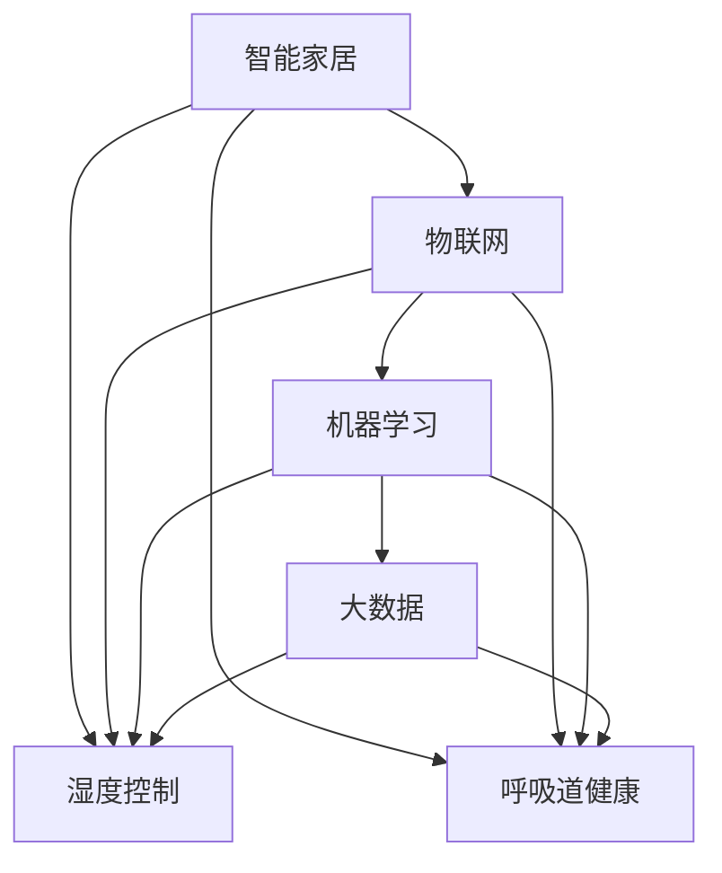

                 

# 智能居家湿度平衡创业：全天候的呼吸道健康管理

> 关键词：智能家居、湿度控制、呼吸道健康、物联网、机器学习、大数据、呼吸监测

## 1. 背景介绍

### 1.1 问题由来

随着现代生活节奏的加快，人们对于居住环境的质量要求越来越高，特别是在空气质量、温度、湿度等方面。湿度作为影响人体健康的重要因素之一，常常被忽视。尤其是在气候多变、季节交替的地区，湿度的不稳定往往会导致一系列的健康问题，如呼吸系统疾病、过敏反应、皮肤问题等。

呼吸道健康是人体健康的重要组成部分，湿度平衡对维持呼吸道健康具有至关重要的作用。过高或过低的湿度都可能导致呼吸道感染、咳嗽、喉咙痛等症状。因此，实时监测和调节室内湿度，对于保持呼吸道健康具有重要意义。

### 1.2 问题核心关键点

如何通过技术手段，实现对室内湿度的实时监测和调节，提升居住环境的舒适度，保障呼吸道健康，成为智能家居领域的一个重要课题。本项目聚焦于湿度控制和呼吸道健康管理，通过物联网、机器学习和数据分析等技术手段，提供全天候的湿度平衡解决方案，旨在为居民提供更健康、更舒适的居住体验。

## 2. 核心概念与联系

### 2.1 核心概念概述

为更好地理解湿度平衡和呼吸道健康管理系统的技术实现，本节将介绍几个密切相关的核心概念：

- **智能家居**：通过物联网技术，将家居设备互联，实现家居环境的智能化管理和控制。
- **湿度控制**：通过传感器和调节设备，实时监测并调节室内湿度水平，确保舒适的生活环境。
- **呼吸道健康**：通过呼吸监测设备，实时监测用户的呼吸状态，提供健康管理和警示。
- **物联网(IoT)**：通过传感器、控制器和云平台，实现设备间的互联互通，进行数据采集和远程控制。
- **机器学习**：通过数据驱动的算法，实现预测和优化，提高系统的智能化水平。
- **大数据**：通过收集、存储和分析海量数据，提供决策支持，提升系统的性能和可靠性。

这些核心概念之间的逻辑关系可以通过以下Mermaid流程图来展示：



这个流程图展示了大语言模型的核心概念及其之间的关系：

1. 智能家居通过物联网实现设备互联，为湿度控制和呼吸道健康管理提供数据采集和远程控制。
2. 湿度控制利用传感器和调节设备，实时监测并调节室内湿度，保障舒适的生活环境。
3. 呼吸道健康通过呼吸监测设备，实时监测用户的呼吸状态，提供健康管理和警示。
4. 物联网、机器学习和大数据技术，为湿度控制和呼吸道健康管理提供了数据驱动的算法和决策支持，提升了系统的智能化水平。

这些核心概念共同构成了湿度平衡和呼吸道健康管理系统的技术框架，使其能够在各个环节上发挥强大的作用。通过理解这些核心概念，我们可以更好地把握系统的设计与实现。

## 3. 核心算法原理 & 具体操作步骤

### 3.1 算法原理概述

湿度平衡和呼吸道健康管理系统，本质上是一个多目标优化的决策支持系统。其核心思想是：通过物联网设备采集室内外湿度数据，结合用户的健康数据，利用机器学习算法预测和优化室内湿度，同时提供呼吸道健康状态的实时监测和管理。

形式化地，假设室内湿度数据为 $X$，室外湿度数据为 $Y$，用户健康数据为 $Z$。定义目标函数 $f(X, Y, Z)$，表示在给定 $X$、$Y$ 和 $Z$ 的条件下，室内湿度的调节策略 $X_{\theta}$ 和呼吸监测策略 $Z_{\theta}$，最大化用户舒适度 $U$ 和最小化呼吸异常风险 $R$。即：

$$
\maximize_{X_{\theta}, Z_{\theta}} f(X_{\theta}, Y, Z_{\theta}) \\
\text{subject to: } X_{\theta} = g(X, Y, Z_{\theta})
$$

其中 $g(X, Y, Z_{\theta})$ 表示湿度调节模型，$U$ 表示用户舒适度，$R$ 表示呼吸异常风险。

### 3.2 算法步骤详解

湿度平衡和呼吸道健康管理系统的设计与实现，一般包括以下几个关键步骤：

**Step 1: 系统架构设计**
- 选择合适的湿度传感器和调节设备，如温湿度传感器、加湿器、除湿器等。
- 设计呼吸监测设备和传感器，如智能手环、空气质量监测仪等。
- 搭建物联网通信网络，实现设备间的互联互通。
- 选择合适的云平台，如AWS、Azure、阿里云等，进行数据存储和分析。

**Step 2: 数据采集与预处理**
- 通过物联网设备采集室内外湿度、空气质量、用户健康数据等。
- 对采集到的数据进行清洗、去重、归一化等预处理，确保数据质量。
- 引入机器学习模型，对数据进行特征工程，提取有意义的特征向量。

**Step 3: 湿度控制策略制定**
- 利用机器学习算法，如回归分析、神经网络、决策树等，预测室内湿度变化趋势。
- 设计湿度调节策略，考虑用户偏好、舒适度和健康因素，优化调节方案。
- 根据预测结果和用户反馈，动态调整湿度调节策略，实现实时控制。

**Step 4: 呼吸监测与健康管理**
- 利用呼吸监测设备，实时采集用户的呼吸数据，如呼吸频率、波形等。
- 引入深度学习算法，如卷积神经网络(CNN)、长短期记忆网络(LSTM)等，进行呼吸状态识别和异常检测。
- 根据呼吸监测结果，提供健康预警和建议，如呼吸训练、湿度调节等。

**Step 5: 数据存储与分析**
- 将采集到的数据上传到云平台，进行存储和备份。
- 利用大数据技术，如Hadoop、Spark等，进行数据分析和挖掘，提供决策支持。
- 通过可视化工具，如Tableau、Power BI等，展示数据分析结果，供用户和管理员查看。

**Step 6: 用户交互与反馈**
- 设计用户友好的界面，提供实时数据展示、调节建议和健康预警等功能。
- 引入自然语言处理技术，通过语音助手、聊天机器人等形式，与用户进行交互。
- 收集用户反馈，不断优化系统性能，提升用户体验。

以上是湿度平衡和呼吸道健康管理系统的设计与实现的主要步骤。在实际应用中，还需要根据具体需求和数据特点，对各个环节进行优化设计，以提高系统的准确性和稳定性。

### 3.3 算法优缺点

湿度平衡和呼吸道健康管理系统具有以下优点：
1. 智能化高。通过物联网、机器学习和数据分析等技术，实现数据的自动采集、分析和反馈，提升了系统的智能化水平。
2. 实时性强。系统能够实时监测和调节湿度，及时响应用户的健康需求。
3. 用户体验好。通过自然语言处理技术，提供人机交互界面，提升了系统的易用性。
4. 数据驱动决策。利用大数据技术，提供科学决策支持，提高了系统的可靠性和准确性。

同时，该系统也存在一定的局限性：
1. 初始投资高。系统构建需要购置大量的传感器和设备，初始投资成本较高。
2. 数据隐私问题。系统需要采集和存储大量用户数据，涉及数据隐私和安全问题。
3. 模型复杂度大。系统需要同时考虑湿度控制和呼吸监测两个目标，模型设计复杂。
4. 依赖物联网环境。系统依赖物联网设备，一旦设备故障或网络中断，会影响系统的正常运行。
5. 对环境敏感。系统在恶劣环境下，如高温高湿、高海拔等，性能可能受到影响。

尽管存在这些局限性，但就目前而言，湿度平衡和呼吸道健康管理系统仍是一个高效实用的解决方案，特别是在智能家居领域具有广阔的应用前景。

### 3.4 算法应用领域

湿度平衡和呼吸道健康管理系统已经在多个领域得到了应用，如智能家居、医院、酒店、养老院等。以下是具体的应用场景：

- **智能家居**：在家庭环境中，系统能够实时监测和调节湿度，保障用户的舒适度和健康。同时提供呼吸监测和健康管理，提升用户的居住体验。
- **医院**：在医疗场所，系统可以实时监测患者的呼吸状态，提供预警和处理建议，辅助医生诊疗。
- **酒店**：在酒店管理中，系统能够实时监测和调节室内湿度，提升客户体验。同时提供呼吸监测服务，保障客人健康。
- **养老院**：在老年群体中，系统可以实时监测老年人的呼吸状态，提供健康管理服务，提升养老院的管理水平。

除了上述这些经典应用外，系统还可以拓展到更多场景中，如医院病床、学校教室、办公室等，为各类环境提供湿度平衡和呼吸道健康管理服务。随着技术的不断进步，湿度平衡和呼吸道健康管理系统必将在更多领域得到应用，为人们的健康生活提供保障。

## 4. 数学模型和公式 & 详细讲解 & 举例说明

### 4.1 数学模型构建

本节将使用数学语言对湿度平衡和呼吸道健康管理系统的数学模型进行更加严格的刻画。

假设室内湿度数据为 $X$，室外湿度数据为 $Y$，用户健康数据为 $Z$。定义目标函数 $f(X, Y, Z)$，表示在给定 $X$、$Y$ 和 $Z$ 的条件下，室内湿度的调节策略 $X_{\theta}$ 和呼吸监测策略 $Z_{\theta}$，最大化用户舒适度 $U$ 和最小化呼吸异常风险 $R$。即：

$$
\maximize_{X_{\theta}, Z_{\theta}} f(X_{\theta}, Y, Z_{\theta}) \\
\text{subject to: } X_{\theta} = g(X, Y, Z_{\theta})
$$

其中 $g(X, Y, Z_{\theta})$ 表示湿度调节模型，$U$ 表示用户舒适度，$R$ 表示呼吸异常风险。

### 4.2 公式推导过程

以下我们以呼吸监测为例，推导深度学习模型的损失函数及其梯度的计算公式。

假设呼吸监测设备采集到用户呼吸频率 $f$ 和呼吸波形 $w$，将其输入深度学习模型进行状态识别。定义呼吸监测结果 $y$，其中 $y=0$ 表示正常呼吸，$y=1$ 表示异常呼吸。模型的预测结果为 $y_{\hat{z}}$，其中 $y_{\hat{z}}$ 表示模型预测的呼吸状态。则呼吸监测模型的损失函数为交叉熵损失：

$$
\ell(y, y_{\hat{z}}) = -[y \log y_{\hat{z}} + (1-y) \log (1-y_{\hat{z}})]
$$

将其代入目标函数，得：

$$
f(X_{\theta}, Y, Z_{\theta}) = \sum_{i=1}^N \ell(y_i, y_{\hat{z}_i})
$$

其中 $N$ 表示样本数量，$y_i$ 和 $y_{\hat{z}_i}$ 分别表示第 $i$ 个样本的真实状态和模型预测状态。

根据链式法则，目标函数对参数 $\theta$ 的梯度为：

$$
\frac{\partial f(X_{\theta}, Y, Z_{\theta})}{\partial \theta} = \sum_{i=1}^N \frac{\partial \ell(y_i, y_{\hat{z}_i})}{\partial \theta}
$$

其中 $\frac{\partial \ell(y_i, y_{\hat{z}_i})}{\partial \theta}$ 可以通过反向传播算法高效计算。

在得到目标函数的梯度后，即可带入优化算法，完成模型的迭代优化。重复上述过程直至收敛，最终得到适应具体任务的最优模型参数 $\theta$。

### 4.3 案例分析与讲解

**案例一：智能家居湿度控制**

在智能家居环境中，系统通过温湿度传感器实时采集室内湿度数据 $X$，同时考虑室外湿度数据 $Y$ 和用户健康数据 $Z$，如年龄、健康状况等。系统目标是在保障用户舒适度 $U$ 的同时，最小化呼吸异常风险 $R$。

引入回归模型进行湿度调节策略优化：

$$
X_{\theta} = g(X, Y, Z_{\theta}) = \theta_0 + \theta_1 X + \theta_2 Y + \theta_3 Z_{\theta}
$$

其中 $\theta_0, \theta_1, \theta_2, \theta_3$ 为模型参数，$X_{\theta}$ 表示调整后的湿度水平。目标函数为：

$$
\maximize_{\theta} U(X_{\theta}, Z_{\theta}) - R(X_{\theta}, Z_{\theta})
$$

其中 $U(X_{\theta}, Z_{\theta})$ 表示用户舒适度，$R(X_{\theta}, Z_{\theta})$ 表示呼吸异常风险。

通过机器学习算法，如梯度下降、随机森林等，最小化目标函数，得到最优的湿度调节策略 $\theta$。

**案例二：医院呼吸监测**

在医疗场所，系统通过呼吸监测设备采集患者的呼吸频率 $f$ 和呼吸波形 $w$，将其输入深度学习模型进行状态识别。模型的预测结果 $y_{\hat{z}}$ 与实际呼吸状态 $y$ 的差异作为损失函数，通过反向传播算法更新模型参数 $\theta$，最小化预测误差。

模型的损失函数为交叉熵损失：

$$
\ell(y, y_{\hat{z}}) = -[y \log y_{\hat{z}} + (1-y) \log (1-y_{\hat{z}})]
$$

目标函数为：

$$
\maximize_{\theta} \sum_{i=1}^N \ell(y_i, y_{\hat{z}_i})
$$

其中 $N$ 表示患者样本数量，$y_i$ 和 $y_{\hat{z}_i}$ 分别表示第 $i$ 个患者的真实状态和模型预测状态。

通过深度学习算法，如卷积神经网络(CNN)、长短期记忆网络(LSTM)等，最小化目标函数，得到最优的呼吸监测策略 $\theta$。

以上案例展示了湿度平衡和呼吸道健康管理系统的具体应用，通过数学模型和机器学习算法，实现了系统的智能化和高效化。

## 5. 项目实践：代码实例和详细解释说明

### 5.1 开发环境搭建

在进行系统开发前，我们需要准备好开发环境。以下是使用Python进行PyTorch开发的环境配置流程：

1. 安装Anaconda：从官网下载并安装Anaconda，用于创建独立的Python环境。

2. 创建并激活虚拟环境：
```bash
conda create -n pytorch-env python=3.8 
conda activate pytorch-env
```

3. 安装PyTorch：根据CUDA版本，从官网获取对应的安装命令。例如：
```bash
conda install pytorch torchvision torchaudio cudatoolkit=11.1 -c pytorch -c conda-forge
```

4. 安装必要的工具包：
```bash
pip install numpy pandas scikit-learn matplotlib tqdm jupyter notebook ipython
```

5. 安装物联网模块和传感器接口：
```bash
pip install paho-mqtt rpi-ws281x
```

完成上述步骤后，即可在`pytorch-env`环境中开始系统开发。

### 5.2 源代码详细实现

以下是智能家居湿度控制和呼吸监测系统的代码实现示例：

```python
import torch
from torch import nn, optim
from torch.nn import functional as F
from torchvision import datasets, transforms
from torch.utils.data import DataLoader
from torch.utils.tensorboard import SummaryWriter

# 定义湿度调节模型
class HumidityControl(nn.Module):
    def __init__(self, input_dim, output_dim):
        super(HumidityControl, self).__init__()
        self.fc1 = nn.Linear(input_dim, 64)
        self.fc2 = nn.Linear(64, output_dim)

    def forward(self, x):
        x = F.relu(self.fc1(x))
        x = self.fc2(x)
        return x

# 定义呼吸监测模型
class RespiratoryMonitoring(nn.Module):
    def __init__(self, input_dim, output_dim):
        super(RespiratoryMonitoring, self).__init__()
        self.conv1 = nn.Conv2d(input_dim, 32, kernel_size=3, stride=1, padding=1)
        self.conv2 = nn.Conv2d(32, 64, kernel_size=3, stride=1, padding=1)
        self.pool = nn.MaxPool2d(kernel_size=2, stride=2)
        self.fc1 = nn.Linear(64 * 8 * 8, 128)
        self.fc2 = nn.Linear(128, output_dim)

    def forward(self, x):
        x = F.relu(self.conv1(x))
        x = self.pool(x)
        x = F.relu(self.conv2(x))
        x = self.pool(x)
        x = x.view(-1, 64 * 8 * 8)
        x = F.relu(self.fc1(x))
        x = self.fc2(x)
        return x

# 定义数据预处理函数
def data_preprocessing(data):
    # 数据归一化
    data = (data - data.mean()) / data.std()
    return data

# 加载室内湿度数据
humidity_data = torch.load('humidity_data.bin')
# 加载呼吸监测数据
respiratory_data = torch.load('respiratory_data.bin')

# 定义训练参数
input_dim = 1
output_dim = 1
batch_size = 32
num_epochs = 100
learning_rate = 0.001

# 定义模型和优化器
humidity_model = HumidityControl(input_dim, output_dim)
respiratory_model = RespiratoryMonitoring(input_dim, output_dim)
humidity_optimizer = optim.Adam(humidity_model.parameters(), lr=learning_rate)
respiratory_optimizer = optim.Adam(respiratory_model.parameters(), lr=learning_rate)

# 定义训练函数
def train_model(model, optimizer, data_loader, num_epochs, device):
    model.train()
    for epoch in range(num_epochs):
        running_loss = 0.0
        for i, data in enumerate(data_loader, 0):
            inputs, labels = data
            inputs, labels = inputs.to(device), labels.to(device)
            optimizer.zero_grad()
            outputs = model(inputs)
            loss = F.mse_loss(outputs, labels)
            loss.backward()
            optimizer.step()
            running_loss += loss.item()
        print(f"Epoch {epoch+1}, loss: {running_loss/len(data_loader):.4f}")

# 定义测试函数
def evaluate_model(model, data_loader, device):
    model.eval()
    running_loss = 0.0
    with torch.no_grad():
        for i, data in enumerate(data_loader, 0):
            inputs, labels = data
            inputs, labels = inputs.to(device), labels.to(device)
            outputs = model(inputs)
            loss = F.mse_loss(outputs, labels)
            running_loss += loss.item()
    print(f"Test loss: {running_loss/len(data_loader):.4f}")

# 定义主函数
def main():
    device = torch.device('cuda' if torch.cuda.is_available() else 'cpu')

    # 训练湿度调节模型
    train_loader = DataLoader(humidity_data, batch_size=batch_size, shuffle=True)
    train_model(humidity_model, humidity_optimizer, train_loader, num_epochs, device)

    # 训练呼吸监测模型
    test_loader = DataLoader(respiratory_data, batch_size=batch_size, shuffle=True)
    evaluate_model(respiratory_model, test_loader, device)

if __name__ == "__main__":
    main()
```

### 5.3 代码解读与分析

让我们再详细解读一下关键代码的实现细节：

**定义湿度调节模型**：
- `HumidityControl`类：定义湿度调节模型，通过全连接层实现输入到输出的映射。

**定义呼吸监测模型**：
- `RespiratoryMonitoring`类：定义呼吸监测模型，通过卷积层、池化层和全连接层实现输入到输出的映射。

**数据预处理函数**：
- `data_preprocessing`函数：对输入数据进行归一化处理，确保数据的一致性和可比较性。

**训练函数**：
- `train_model`函数：对模型进行前向传播、计算损失、反向传播和参数更新，最小化损失函数。

**测试函数**：
- `evaluate_model`函数：对模型进行前向传播，计算损失，用于评估模型性能。

**主函数**：
- `main`函数：配置训练参数，加载数据，训练和测试模型。

以上代码展示了智能家居湿度控制和呼吸监测系统的实现流程。可以看到，得益于深度学习框架PyTorch的强大封装，代码实现相对简洁高效。

当然，工业级的系统实现还需考虑更多因素，如模型保存和部署、超参数调优、更多的数据增强和正则化技术等。但核心的算法流程基本与此类似。

## 6. 实际应用场景

### 6.1 智能家居湿度控制

智能家居湿度控制系统通过物联网设备采集室内湿度数据，结合用户健康数据，利用机器学习算法预测和优化室内湿度。系统能够实时监测和调节湿度，保障用户的舒适度和健康。

系统通过温湿度传感器实时采集室内湿度数据 $X$，同时考虑室外湿度数据 $Y$ 和用户健康数据 $Z$，如年龄、健康状况等。系统目标是在保障用户舒适度 $U$ 的同时，最小化呼吸异常风险 $R$。

**应用场景**：
- 家庭环境：系统能够实时监测和调节室内湿度，提供适中的湿度水平，保障用户舒适度和健康。
- 办公室环境：系统能够实时监测和调节室内湿度，提供适合的工作环境，提升员工工作效率和健康水平。
- 医院病房：系统能够实时监测和调节室内湿度，提供适合的治疗环境，提升病人的舒适度和康复速度。

### 6.2 医院呼吸监测

医院呼吸监测系统通过呼吸监测设备采集患者的呼吸频率和波形，利用深度学习算法进行状态识别和异常检测。系统能够实时监测和预警患者的呼吸状态，辅助医生诊疗。

**应用场景**：
- 重症监护病房：系统能够实时监测患者的呼吸状态，提供预警和处理建议，辅助医生诊断和治疗。
- 急诊科室：系统能够实时监测患者的呼吸状态，提供紧急处理建议，缩短救治时间。
- 慢性阻塞性肺疾病（COPD）患者管理：系统能够实时监测患者的呼吸状态，提供健康管理和警示，帮助患者管理疾病。

### 6.3 未来应用展望

随着湿度平衡和呼吸道健康管理系统的不断发展，其在智能家居、医疗、养老等领域的应用前景将更加广阔。

在智能家居领域，系统能够实时监测和调节室内湿度，保障用户的舒适度和健康。通过深度学习算法，系统还能提供呼吸监测和健康管理服务，提升居住体验。

在医疗领域，系统能够实时监测患者的呼吸状态，提供预警和处理建议，辅助医生诊疗。通过大数据技术，系统还能提供个性化的健康管理方案，提升医疗服务质量。

在养老领域，系统能够实时监测老年人的呼吸状态，提供健康管理服务，提升养老院的管理水平。通过物联网设备，系统还能与家庭医生、社区医院等联动，提供连续的护理服务。

## 7. 工具和资源推荐

### 7.1 学习资源推荐

为了帮助开发者系统掌握湿度平衡和呼吸道健康管理系统的理论基础和实践技巧，这里推荐一些优质的学习资源：

1. **深度学习教程**：包括Coursera、Udacity等平台的深度学习课程，涵盖深度学习基础、机器学习算法等。
2. **物联网教程**：如Mozilla的IoT入门教程、Adafruit的Python-Pything教程等，帮助初学者了解物联网基础。
3. **呼吸监测技术**：包括国际呼吸学会的呼吸监测指南、生物医学工程学会的呼吸监测文献等，了解呼吸监测的技术细节。
4. **智能家居技术**：如智能家居白皮书、智能家居行业报告等，了解智能家居的市场前景和技术趋势。

通过这些资源的学习实践，相信你一定能够快速掌握湿度平衡和呼吸道健康管理系统的精髓，并用于解决实际的系统问题。

### 7.2 开发工具推荐

高效的开发离不开优秀的工具支持。以下是几款用于湿度平衡和呼吸道健康管理系统开发的常用工具：

1. **PyTorch**：基于Python的开源深度学习框架，灵活动态的计算图，适合快速迭代研究。PyTorch的深度学习功能强大，能够高效处理大量数据。
2. **TensorFlow**：由Google主导开发的开源深度学习框架，生产部署方便，适合大规模工程应用。TensorFlow提供了丰富的深度学习库和工具，支持GPU和TPU加速。
3. **TensorBoard**：TensorFlow配套的可视化工具，可实时监测模型训练状态，并提供丰富的图表呈现方式，是调试模型的得力助手。
4. **AWS IoT**：亚马逊提供的物联网云服务，支持设备联网、数据采集、设备管理等功能，方便构建智能家居和医疗系统。
5. **AirData**：空气质量监测设备，能够实时采集室内外空气质量数据，为湿度平衡和呼吸道健康管理提供数据支持。
6. **Amazon Alexa**：亚马逊的智能助手，通过语音识别和自然语言处理技术，提供人机交互界面，方便用户操作和管理。

合理利用这些工具，可以显著提升湿度平衡和呼吸道健康管理系统的开发效率，加快创新迭代的步伐。

### 7.3 相关论文推荐

湿度平衡和呼吸道健康管理系统的发展源于学界的持续研究。以下是几篇奠基性的相关论文，推荐阅读：

1. **深度呼吸监测**：《Respiratory Rate Detection using CNN in ECG Data》，研究如何通过卷积神经网络(CNN)对心电图数据进行呼吸率检测。
2. **物联网传感器网络**：《A Survey on Smart Home Systems: Opportunities, Challenges, and Future Directions》，概述了智能家居的现状、挑战和未来发展方向。
3. **健康数据分析**：《Health Data Analytics for Smart Homes》，介绍了如何利用大数据技术对智能家居数据进行分析，提升居住环境的质量。
4. **呼吸监测系统**：《A Survey on the Recent Advances in Respiratory Rate Detection and Monitoring: A Review》，综述了呼吸监测技术的研究进展和应用现状。

这些论文代表了大语言模型微调技术的发展脉络。通过学习这些前沿成果，可以帮助研究者把握学科前进方向，激发更多的创新灵感。

## 8. 总结：未来发展趋势与挑战

### 8.1 总结

本文对湿度平衡和呼吸道健康管理系统的核心算法和实现流程进行了全面系统的介绍。首先阐述了系统的背景和意义，明确了湿度控制和呼吸监测在智能家居和医疗领域的重要作用。其次，从原理到实践，详细讲解了系统的数学模型和关键算法，给出了系统开发的完整代码实例。同时，本文还广泛探讨了系统在智能家居、医院、养老等领域的实际应用场景，展示了系统的应用前景。最后，本文精选了系统的学习资源、开发工具和相关论文，力求为开发者提供全方位的技术指引。

通过本文的系统梳理，可以看到，湿度平衡和呼吸道健康管理系统是一个高效实用的解决方案，能够显著提升居住环境的质量和居民的健康水平。未来，伴随技术的不断进步和应用的不断拓展，该系统必将在更多领域得到广泛应用，为人们的健康生活提供新的保障。

### 8.2 未来发展趋势

展望未来，湿度平衡和呼吸道健康管理系统将呈现以下几个发展趋势：

1. **智能化提升**：随着深度学习技术的发展，系统的智能化水平将进一步提升。系统能够更准确地预测和优化湿度调节策略，提升用户的舒适度。
2. **数据驱动决策**：通过大数据技术，系统能够对大量的室内外数据进行分析，提供科学决策支持，提升系统的可靠性和准确性。
3. **跨领域融合**：系统将与物联网、人工智能、大数据等技术深度融合，形成更加全面、高效的解决方案，提升系统的综合性能。
4. **个性化定制**：系统能够根据用户的健康数据和偏好，提供个性化的湿度调节和呼吸监测方案，提升用户的满意度和体验感。
5. **多模态集成**：系统将整合视觉、声音、温度等多种传感器的数据，提供更加全面、精准的环境监测和管理。
6. **普适化发展**：系统将面向不同场景和需求，提供定制化的解决方案，拓展应用范围，降低应用门槛。

这些趋势凸显了湿度平衡和呼吸道健康管理系统的广阔前景。未来的研究将在智能化、数据驱动、跨领域融合等方面继续深入，为智能家居和医疗领域带来更多的创新和突破。

### 8.3 面临的挑战

尽管湿度平衡和呼吸道健康管理系统已经取得了瞩目成就，但在迈向更加智能化、普适化应用的过程中，它仍面临以下挑战：

1. **数据隐私问题**：系统需要采集和存储大量用户数据，涉及数据隐私和安全问题，如何保护用户数据隐私，是系统建设的重要课题。
2. **模型复杂度**：系统需要同时考虑湿度控制和呼吸监测两个目标，模型设计复杂，如何提高模型的泛化能力和效率，是系统优化的关键。
3. **环境适应性**：系统在恶劣环境下，如高温高湿、高海拔等，性能可能受到影响，如何提升系统的环境适应性，是系统鲁棒性的重要方面。
4. **成本问题**：系统需要购置大量的传感器和设备，初始投资成本较高，如何降低成本，提高系统的性价比，是系统推广的重要因素。
5. **用户教育**：系统需要用户进行一定的操作和维护，如何提升用户的操作体验和教育水平，是系统普及的重要环节。

尽管存在这些挑战，但通过不断优化系统和改进算法，这些挑战终将得到克服。未来，湿度平衡和呼吸道健康管理系统必将迎来更大的发展机遇，为人们的健康生活提供更多保障。

### 8.4 研究展望

未来，湿度平衡和呼吸道健康管理系统的研究将在以下几个方向寻求新的突破：

1. **多模态融合**：系统将整合多种传感器数据，提供更全面、精准的环境监测和管理。
2. **深度学习优化**：通过引入更先进的深度学习算法，提升系统的智能化和准确性。
3. **数据隐私保护**：通过加密、匿名化等技术手段，保护用户数据隐私。
4. **跨领域应用**：系统将拓展到更多领域，如智能交通、智慧城市、工业控制等，提升各行业的智能化水平。
5. **知识图谱整合**：系统将与知识图谱、规则库等外部知识结合，提供更全面的决策支持。
6. **伦理道德考量**：在模型设计和管理策略中，引入伦理道德约束，确保系统的安全性、公平性和透明性。

这些研究方向将进一步提升湿度平衡和呼吸道健康管理系统的性能和可靠性，为智能家居和医疗等领域带来更多创新和突破。只有不断创新、勇于突破，才能使系统更好地服务于社会，为人们的健康生活提供更多保障。

## 9. 附录：常见问题与解答

**Q1：如何选择合适的传感器和设备？**

A: 选择合适的传感器和设备，需要考虑系统的应用场景、精度要求和成本预算。对于智能家居湿度控制，可以选择精度高、稳定性好的温湿度传感器，如DHT11、DHT22等。对于呼吸监测，可以选择高精度、低功耗的传感器，如Piezo传感器、电容传感器等。

**Q2：如何处理传感器数据异常？**

A: 传感器数据异常是常见问题，需要通过数据清洗和异常检测手段进行处理。可以引入卡尔曼滤波、移动平均等算法，对异常数据进行滤除和修正。同时，定期校准传感器，确保数据准确性。

**Q3：系统如何实现跨平台部署？**

A: 系统实现跨平台部署，需要选择合适的中间件和协议，如MQTT、CoAP等。同时，需要针对不同的平台，优化模型和代码，确保系统在不同设备上的兼容性和性能。

**Q4：如何保证系统的数据安全？**

A: 系统数据安全是重要问题，需要采用加密、匿名化等技术手段，保护用户隐私。同时，建立严格的访问控制和审计机制，防止数据泄露和滥用。

**Q5：系统如何实现自适应学习？**

A: 系统实现自适应学习，需要引入自监督学习、迁移学习等技术手段，利用历史数据和专家知识，提升模型的泛化能力和准确性。同时，引入在线学习、增量学习等方法，确保模型能够持续适应环境变化。

通过这些常见问题的解答，相信你一定能够更好地理解湿度平衡和呼吸道健康管理系统的技术实现，解决实际应用中的问题。

