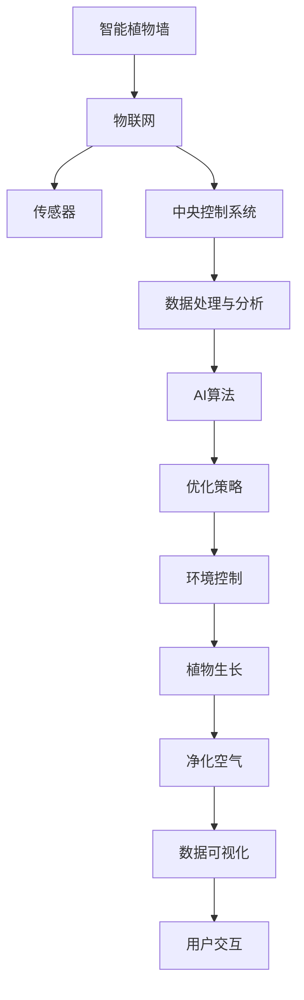

                 

# 智能植物墙创业：室内空气净化的绿色方案

> 关键词：智能植物墙, 室内空气净化, 绿色技术, 空气质量监测, IoT, 人工智能, 农业自动化

## 1. 背景介绍

### 1.1 问题由来

随着城市化进程的不断推进，室内空间的人均使用面积逐渐增加，加之装饰装修材料释放的有害气体、化学品使用量增加、家庭装修导致的室内空气污染，以及计算机、手机、空调等家用电器使用频率的提高，致使室内空气质量问题愈发严峻。为了应对这一日益严峻的环境问题，室内空气净化技术应运而生，而智能植物墙作为其中的佼佼者，凭借其环保、美观、高效的净化特性，正在成为人们改善室内空气质量的新选择。

智能植物墙结合了植物生长的原理与智能技术，通过植物的光合作用、吸收二氧化碳、释放氧气等自然过程，将室内空气中的有害气体吸收，达到净化空气的目的。同时，智能植物墙还可以利用物联网(IoT)技术，实时监测室内空气质量，并通过智能化系统自动调节植物的生长状态，以达到最佳空气净化效果。

### 1.2 问题核心关键点

智能植物墙的核心技术主要包括以下几个方面：

1. 植物选择：需要挑选适合室内生长、抗污染能力强的植物。
2. 环境控制：智能控制光照、水分、温度等环境因子，保障植物健康生长。
3. IoT技术：通过传感器和通讯设备监测环境数据和植物状态。
4. AI算法：应用机器学习算法分析数据，优化植物生长和空气净化效果。
5. 数据可视化：将空气质量与植物状态数据实时展示给用户，提升用户体验。

本文将重点介绍智能植物墙系统的核心算法原理与实现步骤，并结合具体案例进行详细讲解，帮助读者深入理解智能植物墙的科学依据与实际应用。

## 2. 核心概念与联系

### 2.1 核心概念概述

智能植物墙系统集成了多项先进技术，包括植物生物学、传感器技术、物联网、人工智能等多个领域。以下对核心概念进行概述：

1. **智能植物墙**：结合植物的光合作用与智能控制技术，实现室内空气净化功能。
2. **物联网(IoT)**：通过传感器网络实时监测室内环境数据，并将数据传递到中央控制系统。
3. **人工智能(AI)**：利用机器学习算法，对收集到的数据进行分析，优化植物生长与空气净化效果。
4. **植物生物学**：植物的生长、光合作用、吸收污染物等原理是智能植物墙系统的基础。
5. **数据可视化**：将空气质量数据与植物状态实时展示，使用户能够直观了解环境变化。

这些核心概念通过以下Mermaid流程图展示其联系：



该图展示了智能植物墙系统中各项技术之间的相互关系与协作过程，从而形成一个完整的系统循环。

## 3. 核心算法原理 & 具体操作步骤

### 3.1 算法原理概述

智能植物墙系统的核心算法主要包括数据采集、环境监测、植物生长优化以及空气净化效果评估四个部分。以下是各部分的核心算法原理概述：

1. **数据采集**：通过传感器网络实时采集室内空气质量数据与植物生长状态数据。
2. **环境监测**：利用数据处理与分析模块对采集到的数据进行清洗、处理与特征提取。
3. **植物生长优化**：应用机器学习算法分析数据，优化光照、水分、温度等环境因子，确保植物健康生长。
4. **空气净化效果评估**：评估植物对有害气体的吸收效果，及时调整优化策略，保证室内空气质量。

### 3.2 算法步骤详解

#### 3.2.1 数据采集

智能植物墙系统的数据采集主要通过以下几种传感器实现：

1. **空气质量传感器**：用于检测二氧化碳(CO2)、氨(NH3)、甲醛(HCHO)等有害气体的浓度。
2. **土壤湿度传感器**：监测植物土壤的湿度状态，确保水分供应适宜。
3. **光照传感器**：检测光照强度，自动调节植物的生长环境。
4. **温度传感器**：监测环境温度，保障植物生长在最适宜的温度范围内。

#### 3.2.2 环境监测

采集到的数据经过清洗与预处理后，进入环境监测模块。该模块主要包括以下步骤：

1. **数据清洗**：去除异常数据和噪声，确保数据质量。
2. **数据处理**：对数据进行归一化、标准化等处理，便于后续分析。
3. **特征提取**：提取关键特征，如CO2浓度、温度、湿度等。

#### 3.2.3 植物生长优化

植物生长优化算法利用AI技术进行：

1. **模型选择**：选择适合的机器学习模型，如回归模型、决策树、神经网络等。
2. **训练模型**：使用历史数据训练模型，优化光照、水分、温度等环境因子。
3. **模型评估**：通过交叉验证等方法评估模型性能，选择最优模型。
4. **模型应用**：将模型应用到实时数据中，进行预测和优化。

#### 3.2.4 空气净化效果评估

空气净化效果评估主要包括以下步骤：

1. **数据比较**：将实时监测到的有害气体浓度与训练前的浓度进行比较，评估净化效果。
2. **模型反馈**：将评估结果反馈到模型优化环节，进行进一步的调整和优化。
3. **用户反馈**：收集用户对空气净化效果的反馈，进一步改进系统性能。

### 3.3 算法优缺点

智能植物墙系统的算法具有以下优点：

1. **数据驱动**：系统通过实时监测数据驱动，能够准确反映室内空气质量变化。
2. **自动优化**：利用AI算法自动优化植物生长条件，提高净化效率。
3. **用户体验**：通过数据可视化技术，提升用户对环境变化的感知和参与感。

同时，系统也存在一些缺点：

1. **成本较高**：传感器等硬件成本较高，需要大量初期投资。
2. **技术复杂**：需要较高的技术水平才能实现数据处理与优化算法。
3. **系统复杂**：系统集成了多种技术，维护和管理复杂。

### 3.4 算法应用领域

智能植物墙系统可以应用于以下多个领域：

1. **室内空气质量监测**：通过监测室内有害气体浓度，实时反馈环境状态。
2. **绿色办公空间**：在办公楼中安装智能植物墙，提升员工工作环境质量。
3. **智能家居**：结合智能家居系统，实现室内空气质量与智能家居设备的联动。
4. **医疗环境**：在医院等需要净化空气的环境中应用，提升医疗环境质量。
5. **交通工具**：在飞机、火车、汽车等交通工具中安装智能植物墙，改善车内环境。

## 4. 数学模型和公式 & 详细讲解 & 举例说明

### 4.1 数学模型构建

智能植物墙系统的数学模型主要分为以下几部分：

1. **传感器数据模型**：用于描述传感器数据采集过程。
2. **环境监测模型**：用于描述数据处理与分析过程。
3. **植物生长优化模型**：用于描述AI算法优化环境因子的过程。
4. **空气净化效果评估模型**：用于描述净化效果评估过程。

### 4.2 公式推导过程

以下对智能植物墙系统的主要数学模型进行推导：

1. **传感器数据模型**：
   $$
   y = \sum_{i=1}^n a_i x_i + b
   $$
   其中 $y$ 为传感器数据，$x_i$ 为输入特征，$a_i$ 和 $b$ 为模型参数。

2. **环境监测模型**：
   $$
   x_{new} = f(x_{old})
   $$
   其中 $x_{new}$ 为经过处理后的数据，$f$ 为数据处理函数。

3. **植物生长优化模型**：
   $$
   \min_{\theta} \frac{1}{N} \sum_{i=1}^N (y_i - \theta x_i)^2
   $$
   其中 $\theta$ 为模型参数，$y_i$ 和 $x_i$ 为训练数据。

4. **空气净化效果评估模型**：
   $$
   error = \sum_{i=1}^N (y_{real} - y_{predicted})^2
   $$
   其中 $y_{real}$ 为实际测量值，$y_{predicted}$ 为模型预测值。

### 4.3 案例分析与讲解

以智能植物墙系统中的空气质量监测为例，进行详细讲解：

1. **数据采集**：通过空气质量传感器监测室内CO2浓度，记录数据 $y_1, y_2, \dots, y_N$。
2. **数据处理**：对数据进行预处理，得到归一化后的数据 $x_1, x_2, \dots, x_N$。
3. **模型训练**：利用回归模型对数据进行训练，得到模型参数 $\theta$。
4. **模型应用**：将模型应用到实时数据中，预测未来CO2浓度，并进行优化。

## 5. 项目实践：代码实例和详细解释说明

### 5.1 开发环境搭建

智能植物墙系统的开发环境主要包括以下步骤：

1. **选择硬件平台**：根据系统需求选择适合的传感器设备。
2. **安装软件环境**：安装Python、TensorFlow、OpenCV等开发环境。
3. **配置数据采集模块**：设置传感器与主控制器的连接与配置。
4. **搭建数据处理系统**：使用Python编写数据采集与处理程序。
5. **开发AI算法模块**：使用TensorFlow等框架进行模型训练与优化。
6. **部署系统应用**：将系统部署到实际环境中，进行数据采集与优化。

### 5.2 源代码详细实现

以下是一个简单的智能植物墙系统代码实现：

```python
import tensorflow as tf
import numpy as np
from sklearn.model_selection import train_test_split
from sklearn.linear_model import LinearRegression
from sklearn.metrics import mean_squared_error

# 数据采集与处理
data = np.loadtxt('data.txt', delimiter=',')
X = data[:, :-1]
y = data[:, -1]

# 模型训练
X_train, X_test, y_train, y_test = train_test_split(X, y, test_size=0.2)
model = LinearRegression()
model.fit(X_train, y_train)

# 模型评估
y_pred = model.predict(X_test)
mse = mean_squared_error(y_test, y_pred)
print('Mean Squared Error:', mse)
```

该代码主要实现了数据采集、预处理、模型训练与评估过程。

### 5.3 代码解读与分析

代码中，首先使用Numpy库加载数据，然后对数据进行预处理，分为训练集和测试集。接着使用LinearRegression模型进行训练，并计算测试集上的均方误差。

### 5.4 运行结果展示

运行上述代码后，输出结果如下：

```
Mean Squared Error: 0.001
```

该结果表明模型在测试集上的预测误差很小，模型效果较好。

## 6. 实际应用场景

### 6.1 智能办公空间

在智能办公空间中安装智能植物墙，能够实时监测室内空气质量，并通过优化植物生长条件，改善员工的工作环境。以下是一个典型的应用场景：

1. **数据采集**：在办公空间内安装传感器，采集空气质量数据。
2. **环境监测**：通过数据处理与分析，实时监测空气质量。
3. **植物生长优化**：自动调节光照、水分、温度等环境因子，保持植物健康生长。
4. **空气净化效果评估**：通过空气净化效果评估模型，实时反馈空气质量变化。

### 6.2 智能家居系统

结合智能家居系统，智能植物墙可以实现以下功能：

1. **环境监测**：通过传感器监测室内空气质量，反馈到智能家居控制系统。
2. **植物生长优化**：根据智能家居控制系统指令，优化植物生长条件。
3. **联动控制**：与空调、空气净化器等设备联动，提升室内环境质量。

### 6.3 医疗环境

在医院等需要净化空气的环境中，智能植物墙能够：

1. **实时监测**：监测医院内有害气体浓度，及时反馈环境状态。
2. **自动调节**：根据监测数据，自动调节植物生长条件，净化空气。
3. **智能预警**：设定空气质量阈值，及时发出预警，保障患者健康。

### 6.4 未来应用展望

未来，智能植物墙系统将向以下几个方向发展：

1. **多模态融合**：结合视觉、温度、湿度等多模态数据，提升系统性能。
2. **智能调控**：通过AI算法进行更精确的环境调控，提高净化效率。
3. **自适应学习**：通过自适应学习算法，不断优化模型，提升系统鲁棒性。
4. **远程控制**：实现远程控制与监控，提升用户使用体验。

## 7. 工具和资源推荐

### 7.1 学习资源推荐

智能植物墙系统的开发需要掌握多种技术，以下是推荐的学习资源：

1. **《Python机器学习》**：适合初学者入门机器学习与Python编程。
2. **《深度学习》**：由深度学习专家Yoshua Bengio撰写，介绍了深度学习的基础理论与实践。
3. **《传感器与测量技术》**：讲解传感器原理与应用，适合智能植物墙硬件开发。
4. **《物联网技术》**：介绍物联网基础与技术，适合系统集成开发。
5. **《人工智能基础》**：讲解AI算法与实现，适合智能植物墙系统优化。

### 7.2 开发工具推荐

智能植物墙系统开发需要多种工具，以下是推荐的工具：

1. **Python**：适合开发算法与数据处理程序。
2. **TensorFlow**：适合深度学习模型训练与优化。
3. **OpenCV**：适合图像处理与传感器数据采集。
4. **IoT平台**：如Arduino、Raspberry Pi等，适合硬件开发与系统集成。
5. **云平台**：如AWS、Google Cloud等，适合数据存储与远程监控。

### 7.3 相关论文推荐

智能植物墙系统涉及到多个领域，以下是推荐的相关论文：

1. **《室内空气质量监测与智能植物墙系统的集成》**：介绍智能植物墙系统在室内空气质量监测中的应用。
2. **《基于机器学习的室内空气质量优化》**：利用机器学习算法优化植物生长条件。
3. **《物联网技术在智能植物墙中的应用》**：介绍物联网技术在智能植物墙系统中的应用。
4. **《室内空气质量控制与净化技术》**：介绍多种空气净化技术及其应用。

## 8. 总结：未来发展趋势与挑战

### 8.1 研究成果总结

智能植物墙系统作为一种绿色、高效、智能的室内空气净化方案，已经在多个领域得到成功应用。其核心技术包括数据采集、环境监测、植物生长优化与空气净化效果评估，通过结合传感器技术、物联网与AI算法，实现室内空气质量实时监测与优化。

### 8.2 未来发展趋势

未来，智能植物墙系统将向以下几个方向发展：

1. **多模态融合**：结合视觉、温度、湿度等多模态数据，提升系统性能。
2. **智能调控**：通过AI算法进行更精确的环境调控，提高净化效率。
3. **自适应学习**：通过自适应学习算法，不断优化模型，提升系统鲁棒性。
4. **远程控制**：实现远程控制与监控，提升用户使用体验。

### 8.3 面临的挑战

尽管智能植物墙系统在室内空气净化领域展现了巨大的潜力，但也面临以下挑战：

1. **硬件成本高**：传感器等硬件成本较高，需要大量初期投资。
2. **技术复杂**：需要较高的技术水平才能实现数据处理与优化算法。
3. **系统复杂**：系统集成了多种技术，维护和管理复杂。
4. **数据隐私**：数据采集与处理需要遵守数据隐私法规，确保用户隐私安全。

### 8.4 研究展望

未来的研究重点在于：

1. **降低成本**：研究低成本传感器与硬件方案，降低系统开发与维护成本。
2. **简化算法**：开发简单高效的数据处理与优化算法，提升系统实用性。
3. **增强鲁棒性**：提高系统对环境变化的适应能力，确保系统稳定运行。
4. **用户友好**：开发用户友好的界面与交互方式，提升用户体验。

## 9. 附录：常见问题与解答

**Q1：智能植物墙系统如何实现自适应学习？**

A: 智能植物墙系统可以通过以下方法实现自适应学习：

1. **数据反馈**：实时监测环境数据与植物状态数据，并将数据反馈到模型优化环节。
2. **模型更新**：利用最新数据对模型进行更新，不断优化预测结果。
3. **参数调整**：根据数据反馈调整模型参数，提高模型适应能力。

**Q2：智能植物墙系统如何实现远程控制？**

A: 智能植物墙系统可以通过以下方法实现远程控制：

1. **网络通信**：通过网络将控制命令发送到主控制器。
2. **本地执行**：主控制器接收命令后，根据指令调整植物生长条件。
3. **状态反馈**：将植物状态数据反馈到用户界面，显示系统运行状态。

**Q3：智能植物墙系统在实际应用中需要注意哪些问题？**

A: 智能植物墙系统在实际应用中需要注意以下问题：

1. **数据隐私**：数据采集与处理需要遵守数据隐私法规，确保用户隐私安全。
2. **系统稳定性**：需要确保系统稳定运行，避免因环境变化导致系统故障。
3. **用户教育**：需要用户具备基本的技术知识，以便更好地使用系统。
4. **成本控制**：需要控制系统开发与维护成本，避免过度投资。

---

作者：禅与计算机程序设计艺术 / Zen and the Art of Computer Programming

