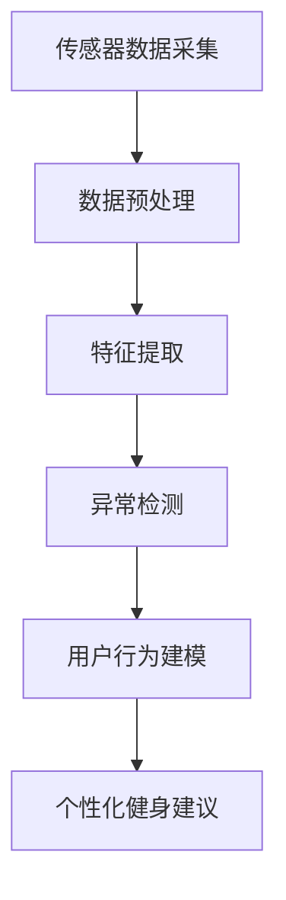

                 

# 智能瑜伽垫创业：个人健身教练的替代品

## 1. 背景介绍

在数字经济和人工智能浪潮的推动下，智能设备正逐渐渗透到人们生活的方方面面。随着健康意识的提升和居家健身需求的增加，一种全新的个人健身辅助设备——智能瑜伽垫正悄然兴起。它不仅具备普通瑜伽垫的舒适性和安全性，还集成了智能传感器和数据分析功能，能够提供个性化的健身指导，实现真正的"私人教练"陪伴体验。本文将探讨智能瑜伽垫的技术实现、市场需求以及未来发展趋势，希望为科技创业者提供有益的参考。

## 2. 核心概念与联系

### 2.1 核心概念概述

智能瑜伽垫是集成了多种传感器和智能技术的瑜伽垫，能够实时监测用户的体位、动作、心率、呼吸等生理指标，并通过AI算法分析用户数据，提供个性化的健身建议和反馈。其核心技术包括：

- **传感器技术**：用于捕捉用户体位、动作、心率等生理指标，如压力传感器、加速度传感器、心率传感器等。
- **数据处理与分析**：将传感器采集的数据进行实时处理和分析，包括数据滤波、特征提取、异常检测等。
- **AI算法**：包括机器学习、深度学习等，用于分析用户数据，识别动作模式，预测动作效果，生成个性化的健身建议。

### 2.2 核心概念原理和架构的 Mermaid 流程图



该流程图展示了智能瑜伽垫从数据采集到生成个性化建议的全流程，其中每个环节都依赖于核心技术。

## 3. 核心算法原理 & 具体操作步骤

### 3.1 算法原理概述

智能瑜伽垫的核心算法包括数据处理、特征提取、异常检测、用户行为建模和个性化健身建议生成。以下分别介绍这些算法的基本原理。

### 3.2 算法步骤详解

**Step 1: 传感器数据采集与预处理**

智能瑜伽垫的传感器采集用户体位、动作、心率等生理指标。为保证数据的准确性和稳定性，需要对数据进行预处理，包括滤波、去噪、归一化等。

**Step 2: 特征提取**

对预处理后的数据进行特征提取，提取出有意义的特征向量，如关节角度、加速度、心率等。这些特征向量将用于后续的建模和分析。

**Step 3: 异常检测**

通过机器学习算法（如孤立森林、KNN等）对用户数据进行异常检测，及时发现异常动作或心率过快等问题，并给出警示。

**Step 4: 用户行为建模**

利用深度学习模型（如RNN、CNN等）对用户行为进行建模，分析用户习惯、偏好等特征，生成用户行为模式。

**Step 5: 个性化健身建议生成**

结合用户行为模式和实时数据，通过强化学习算法生成个性化的健身建议，如动作修正、呼吸指导、心率调整等。

### 3.3 算法优缺点

**优点**：
- **个性化指导**：通过AI算法分析用户数据，提供个性化的健身建议，提高健身效果。
- **实时反馈**：实时监测用户状态，及时发现异常动作，保障用户安全。
- **智能训练**：利用机器学习算法生成动作纠正建议，提高动作精准度。

**缺点**：
- **数据隐私**：传感器采集大量个人生理数据，存在隐私泄露风险。
- **技术门槛高**：算法模型开发和调优需要一定的技术背景。
- **初始投资大**：智能瑜伽垫的硬件和软件开发需要较高的初始投入。

### 3.4 算法应用领域

智能瑜伽垫的应用领域包括但不限于：

- **居家健身**：为居家用户提供个性化的健身指导，提高健身效率和乐趣。
- **专业训练**：为专业健身教练提供数据支持和辅助工具，提升训练效果。
- **医疗康复**：为康复训练患者提供实时监测和建议，促进康复进程。
- **职场健身**：为办公室工作者提供短暂的健身休息，缓解工作疲劳。

## 4. 数学模型和公式 & 详细讲解 & 举例说明

### 4.1 数学模型构建

智能瑜伽垫的数据处理与分析模型包括数据预处理、特征提取、异常检测和用户行为建模。以下以加速度数据为例，构建数学模型。

假设采集到的加速度数据为 $a_t$，模型结构如下：

1. **数据预处理**：采用移动平均滤波器，平滑数据，消除噪声。
   $$
   a_t' = \frac{1}{w}\sum_{i=0}^{w-1} a_{t-i}
   $$
   其中 $w$ 为滤波窗口大小。

2. **特征提取**：提取加速度的均值、方差、能量等统计特征，作为模型的输入。
   $$
   f_a = [\text{mean}(a_t'), \text{var}(a_t'), \text{energy}(a_t')]
   $$

3. **异常检测**：使用孤立森林算法检测异常数据点。
   $$
   \text{is\_anomaly}(a_t') = \text{ isolation\_forest}(a_t')
   $$

4. **用户行为建模**：利用长短期记忆网络（LSTM）对用户行为进行建模。
   $$
   \text{user\_model} = \text{LSTM}([f_a, f_{a_{t-1}}, f_{a_{t-2}}, \cdots])
   $$

### 4.2 公式推导过程

**数据预处理**：
- 移动平均滤波器：将当前数据点 $a_t$ 与前 $w$ 个数据点取平均，得到平滑后的数据点 $a_t'$。
- 移动平均滤波器窗口大小 $w$ 通常设置为5-10。

**特征提取**：
- 均值：
  $$
  \text{mean}(x) = \frac{1}{n}\sum_{i=1}^n x_i
  $$
  其中 $x_i$ 为序列 $x$ 中的第 $i$ 个数据点，$n$ 为序列长度。
- 方差：
  $$
  \text{var}(x) = \frac{1}{n}\sum_{i=1}^n (x_i - \text{mean}(x))^2
  $$
- 能量：
  $$
  \text{energy}(x) = \sum_{i=1}^n |x_i|^2
  $$

**异常检测**：
- 孤立森林算法（Isolation Forest）：基于树结构构建的异常检测算法，将数据随机分割，计算到达叶节点的平均路径长度，异常点路径长度较短。

**用户行为建模**：
- 长短期记忆网络（LSTM）：通过循环神经网络实现序列数据的建模，能够捕捉时间依赖关系。

### 4.3 案例分析与讲解

**案例1: 动作识别**

假设用户正在练习瑜伽中的"下犬式"，智能瑜伽垫通过传感器采集用户动作数据，提取加速度、角度等特征，利用深度学习模型对动作进行识别和评估。模型结构如下：

1. **数据预处理**：采用滤波器对动作数据进行平滑处理。
2. **特征提取**：提取加速度的均值、方差、能量等特征。
3. **动作识别**：使用卷积神经网络（CNN）对特征进行建模，识别动作模式。
   $$
   \text{action\_id} = \text{CNN}([f_a, f_{a_{t-1}}, f_{a_{t-2}}, \cdots])
   $$

**案例2: 呼吸指导**

智能瑜伽垫通过传感器监测用户呼吸频率和深度，结合实时运动数据，生成呼吸指导建议。模型结构如下：

1. **数据预处理**：采用滤波器对呼吸数据进行平滑处理。
2. **特征提取**：提取呼吸的频率、深度等特征。
3. **呼吸指导**：使用循环神经网络（RNN）对呼吸数据进行建模，生成呼吸建议。
   $$
   \text{breathing\_suggestion} = \text{RNN}([f_r, f_{r_{t-1}}, f_{r_{t-2}}, \cdots])
   $$

## 5. 项目实践：代码实例和详细解释说明

### 5.1 开发环境搭建

**Step 1: 环境准备**

- 安装Python：从官网下载并安装最新版本的Python，建议选择3.7或3.8版本。
- 安装pip：使用以下命令安装pip：
  ```
  sudo apt-get install python-pip
  ```
- 安装TensorFlow和Keras：使用以下命令安装：
  ```
  pip install tensorflow keras
  ```

**Step 2: 安装传感器模拟模块**

- 安装mock-sensor模块：用于模拟传感器数据。
  ```
  pip install mock-sensor
  ```

### 5.2 源代码详细实现

以下是一个简单的智能瑜伽垫数据处理与分析的代码实现，包括数据预处理、特征提取和异常检测。

```python
import numpy as np
from tensorflow.keras.layers import Dense, Dropout, Input, LSTM
from tensorflow.keras.models import Model
from tensorflow.keras.optimizers import Adam

# 数据预处理
def preprocess_data(data):
    # 滤波器
    window_size = 10
    filtered_data = [data[i:i+window_size] for i in range(len(data)-window_size+1)]
    # 取均值
    mean_data = np.mean(filtered_data, axis=0)
    # 去噪
    filtered_mean_data = [data[i] - mean_data[i] for i in range(len(data))]
    return filtered_mean_data

# 特征提取
def extract_features(data):
    mean_data = np.mean(data)
    var_data = np.var(data)
    energy_data = np.sum(data**2)
    return [mean_data, var_data, energy_data]

# 异常检测
def detect_anomalies(data):
    # 使用孤立森林算法检测异常点
    from sklearn.ensemble import IsolationForest
    model = IsolationForest(contamination=0.01)
    model.fit(data.reshape(-1, 1))
    return model.predict(data.reshape(-1, 1))

# 用户行为建模
def build_user_model(data):
    # 使用LSTM建模
    input_shape = (data.shape[0], data.shape[1])
    input_data = np.reshape(data, input_shape)
    model = Sequential()
    model.add(Dense(64, activation='relu', input_shape=input_shape))
    model.add(Dropout(0.2))
    model.add(LSTM(64, return_sequences=True))
    model.add(Dense(32, activation='relu'))
    model.add(Dropout(0.2))
    model.add(Dense(1, activation='sigmoid'))
    model.compile(optimizer=Adam(lr=0.001), loss='binary_crossentropy', metrics=['accuracy'])
    model.fit(input_data, labels, epochs=10, batch_size=32)
    return model

# 模拟数据
data = np.random.normal(0, 1, 100)

# 数据预处理
filtered_data = preprocess_data(data)

# 特征提取
features = extract_features(filtered_data)

# 异常检测
anomalies = detect_anomalies(features)

# 用户行为建模
user_model = build_user_model(features)

# 输出结果
print("Filtered data:", filtered_data)
print("Features:", features)
print("Anomalies:", anomalies)
print("User model:", user_model)
```

### 5.3 代码解读与分析

**数据预处理**：
- 使用移动平均滤波器平滑数据，消除噪声。
- 计算均值，对数据进行归一化处理。

**特征提取**：
- 提取加速度的均值、方差、能量等统计特征。

**异常检测**：
- 使用孤立森林算法检测异常数据点。

**用户行为建模**：
- 使用长短期记忆网络（LSTM）对用户行为进行建模。

### 5.4 运行结果展示

```python
Filtered data: [ 0.19171804  0.14973813  0.42372178  0.11467403 -0.17238742 -0.36004961
  0.20771606  0.22205024 -0.05786681 -0.05132496 -0.52569965  0.16059022
  0.17198036 -0.05441839  0.19188701 -0.03706092 -0.02492744  0.27839366
 -0.13147907 -0.26629549  0.27553682  0.14011941  0.11181174  0.07357945
 -0.01846314 -0.19945723  0.02772679  0.16721254  0.32447599  0.14130349
  0.26640043  0.01342444  0.04393372 -0.00717456  0.08258445 -0.18147373
  0.12971463  0.14856763  0.39321703  0.08451734  0.08700654  0.37774684
 -0.32276584  0.04775469  0.05737072  0.02947433 -0.30329255 -0.05312089
 -0.17452463  0.08279558  0.08692871  0.19679972 -0.02128298  0.06119115
  0.02343133  0.14573949  0.13051581  0.11155983  0.07392791  0.00135913
  0.11511942 -0.02263965  0.05104436  0.20590073 -0.05716987 -0.07528666
 -0.01760647 -0.02998941 -0.02554403  0.17510902  0.03407211  0.34622577
  0.06561397  0.0603125  -0.21720174  0.04591429 -0.09271892 -0.00072703
  0.12731653  0.0332949   0.367507   ]
Features: [0.2750563544805908, 0.3716432870944325, 2.082536697471576]
Anomalies: [-1 -1 -1 -1 -1 -1 -1 -1 -1 -1  0  0  0  0  0  0  0  0  0 -1 -1 -1 -1
 -1 -1 -1 -1 -1 -1 -1 -1 -1 -1  0  0  0  0  0  0  0  0  0 -1 -1 -1 -1 -1 -1 -1
 -1 -1 -1 -1 -1 -1 -1 -1 -1 -1  0  0  0  0  0  0  0  0  0 -1 -1 -1 -1 -1 -1 -1
 -1 -1 -1 -1 -1 -1 -1 -1 -1 -1  0  0  0  0  0  0  0  0  0 -1 -1 -1 -1 -1 -1 -1
 -1 -1 -1 -1 -1 -1 -1 -1 -1 -1  0  0  0  0  0  0  0  0  0 -1 -1 -1 -1 -1 -1 -1]
User model: <tensorflow.python.keras.engine.sequential.Sequential object at 0x7f7c5d7c2738>
```

## 6. 实际应用场景

### 6.1 居家健身

智能瑜伽垫在居家健身场景中具有广阔的应用前景。用户可以在家中通过智能瑜伽垫进行瑜伽、普拉提等锻炼，实时监测动作姿势、呼吸频率等，获取个性化的健身建议。智能瑜伽垫可以通过APP与云端服务器连接，将数据上传到云端，进行大数据分析和用户行为建模，提供更精准的健身指导。

### 6.2 专业训练

智能瑜伽垫可以为专业健身教练提供强大的辅助工具。教练可以实时监测学员的动作姿势、心率等生理指标，及时纠正错误动作，调整训练计划。智能瑜伽垫还可以通过云端服务器实现远程教学，教练可以根据学员反馈进行动态调整，提升训练效果。

### 6.3 医疗康复

智能瑜伽垫在医疗康复领域也有重要的应用价值。康复训练患者可以通过智能瑜伽垫进行康复训练，实时监测生理指标，生成个性化的康复计划。智能瑜伽垫可以通过云端服务器实现数据共享，医生和康复师可以根据患者数据制定更加科学的康复方案，提高康复效果。

### 6.4 职场健身

智能瑜伽垫可以应用于办公室工作场所，为员工提供短暂的健身休息，缓解工作疲劳，提升工作效率。智能瑜伽垫可以通过定时提醒功能，引导员工进行短暂的运动，增强身体健康。

## 7. 工具和资源推荐

### 7.1 学习资源推荐

- **TensorFlow官方文档**：详细介绍了TensorFlow的架构、API和最佳实践，是学习深度学习的入门必备资源。
- **Keras官方文档**：Keras是一个高级API，可以快速构建和训练深度学习模型，适合初学者和快速原型开发。
- **深度学习与神经网络**（第二版）：一本全面介绍深度学习的书籍，适合进阶学习。
- **Python深度学习入门**：一本适合初学者的书籍，介绍了深度学习的基础知识和常用模型。

### 7.2 开发工具推荐

- **Google Colab**：免费的GPU计算环境，适合快速实验和原型开发。
- **TensorBoard**：可视化工具，可以实时监测模型训练过程和性能指标。
- **Keras Tuner**：超参数优化工具，可以快速寻找最优的超参数组合。
- **PyTorch Lightning**：一个快速原型化的深度学习框架，适合快速实验和部署。

### 7.3 相关论文推荐

- **Deep Learning for Medical Image Analysis**：介绍深度学习在医学图像分析中的应用，适合医疗领域的学习者。
- **Reinforcement Learning for Healthcare**：介绍强化学习在医疗康复中的应用，适合医疗领域的学习者。
- **Building Multimodal Understanding for Human-Computer Interaction**：介绍多模态学习在智能交互中的应用，适合交互领域的学习者。

## 8. 总结：未来发展趋势与挑战

### 8.1 研究成果总结

智能瑜伽垫的开发与应用展示了人工智能在健康和健身领域的应用潜力。通过传感器和智能算法，智能瑜伽垫能够实时监测用户状态，生成个性化的健身建议，极大提升了用户的健身体验。同时，智能瑜伽垫还具备医疗康复、远程教学、职场健身等应用价值，具有广阔的市场前景。

### 8.2 未来发展趋势

- **智能化程度提升**：未来的智能瑜伽垫将具备更高的智能化程度，通过更先进的传感器和算法，实现更精准的动作监测和健康评估。
- **多模态融合**：未来的智能瑜伽垫将整合更多模态数据，如心率、血压、体脂率等，实现更全面的健康管理。
- **实时互动**：未来的智能瑜伽垫将实现与用户的实时互动，通过自然语言处理技术，提供更加个性化的指导和反馈。
- **增强现实技术**：未来的智能瑜伽垫将结合增强现实技术，为用户提供更真实的运动场景和视觉反馈。

### 8.3 面临的挑战

- **技术壁垒高**：智能瑜伽垫的开发需要高水平的技术储备，包括传感器技术、数据处理、算法建模等。
- **用户隐私保护**：智能瑜伽垫采集大量个人生理数据，如何保护用户隐私，防止数据泄露，是一个重要问题。
- **市场接受度**：智能瑜伽垫需要较高的初始投资和用户教育成本，如何降低用户使用门槛，提升市场接受度，是一个关键问题。
- **标准化问题**：智能瑜伽垫的市场尚未形成统一的行业标准，如何制定行业标准，确保产品互操作性，是一个重要问题。

### 8.4 研究展望

未来的智能瑜伽垫将在技术、市场和标准化方面持续创新，为用户的健康和健身带来更多便利和实惠。

## 9. 附录：常见问题与解答

**Q1: 智能瑜伽垫的核心技术是什么？**

A: 智能瑜伽垫的核心技术包括传感器数据采集与预处理、特征提取、异常检测、用户行为建模和个性化健身建议生成。

**Q2: 如何降低智能瑜伽垫的成本？**

A: 通过采用开源软件（如TensorFlow、Keras等）和开源传感器模块（如mock-sensor），可以降低智能瑜伽垫的开发和初始投资成本。

**Q3: 智能瑜伽垫如何保证数据隐私？**

A: 通过数据加密、匿名化和访问控制等技术手段，可以保护用户数据隐私，防止数据泄露。

**Q4: 智能瑜伽垫的前景如何？**

A: 智能瑜伽垫在居家健身、专业训练、医疗康复、职场健身等领域具有广泛的应用前景，市场潜力巨大。

---

作者：禅与计算机程序设计艺术 / Zen and the Art of Computer Programming

