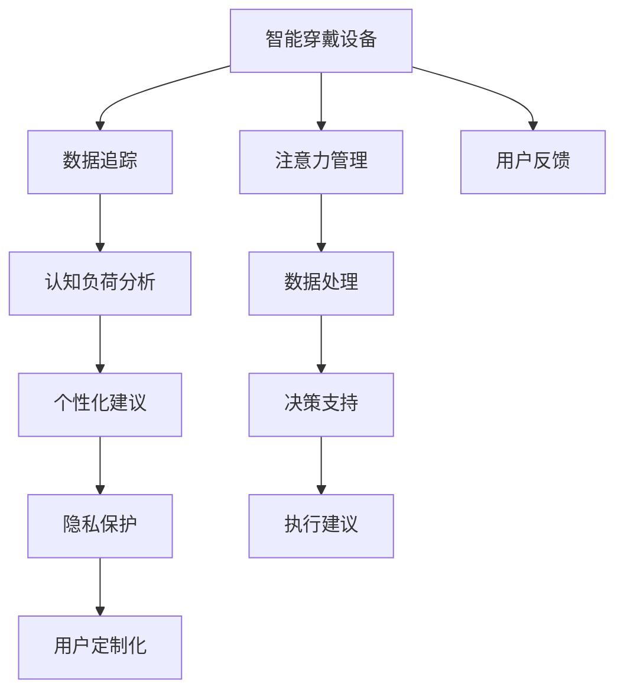

                 

# 智能穿戴设备与注意力管理

> 关键词：智能穿戴设备、注意力管理、数据追踪、眼动追踪、脑电波分析、AI算法、认知负荷、隐私保护、用户定制化、应用场景

## 1. 背景介绍

### 1.1 问题由来
随着科技的迅猛发展，智能穿戴设备在个人生活中的应用越来越广泛。从健康监测到运动辅助，从智能助手到远程协作，这些设备通过各种传感器和智能算法，极大地提升了人类的生活质量和工作效率。然而，智能穿戴设备在为我们带来便利的同时，也可能带来注意力管理的挑战。

随着时间碎片化、信息过载的加剧，现代社会对人们注意力的要求越来越高。人们需要不断地切换注意力，应对来自工作、学习、社交、娱乐等多方面的任务。这些任务在给人们生活带来便利的同时，也可能导致认知负荷过重，进而影响健康和工作效率。智能穿戴设备可以通过实时追踪用户的注意力状态，并借助人工智能算法提供个性化建议和解决方案，从而帮助用户有效管理注意力，提高生活和工作质量。

### 1.2 问题核心关键点
智能穿戴设备中的注意力管理主要包括以下几个关键点：

- **数据追踪**：通过眼动追踪、脑电波分析等技术，实时监测用户的注意力状态，包括注视点、眼球运动、脑波模式等。
- **认知负荷分析**：结合任务复杂度和时长，计算用户的认知负荷，评估用户的注意力使用情况。
- **个性化建议**：基于用户的注意力状态和认知负荷，提供合适的任务分配、时间规划、休息提醒等个性化建议。
- **隐私保护**：在监测用户注意力时，确保数据的安全性和隐私性，避免过度侵入和个人隐私泄漏。
- **用户定制化**：通过用户反馈，不断调整和优化算法，提供更加符合个人需求和偏好的服务。

这些问题相互关联，共同构成了智能穿戴设备中注意力管理的核心技术挑战。解决这些问题将显著提升用户体验和设备的实用价值。

## 2. 核心概念与联系

### 2.1 核心概念概述

为更好地理解智能穿戴设备中的注意力管理，本节将介绍几个密切相关的核心概念：

- **智能穿戴设备**：指集成了传感器、存储和计算功能，能够实时监测用户生理和行为数据的小型可穿戴设备，如智能手表、健康监测设备、运动设备等。
- **注意力管理**：指通过实时监测和分析用户注意力状态，辅助用户合理分配和管理注意力，提升生产力和生活品质的过程。
- **数据追踪**：指利用传感器获取用户眼动轨迹、脑电波等生理数据，实时追踪和记录用户的注意力状态。
- **认知负荷分析**：指通过计算任务复杂度和用户注意力使用情况，评估用户的认知负荷，预测用户注意力耗竭的风险。
- **个性化建议**：指基于用户的注意力状态和认知负荷，提供个性化的任务分配、时间规划、休息提醒等建议。
- **隐私保护**：指在监测和分析用户注意力时，确保数据的安全性和隐私性，避免数据滥用。
- **用户定制化**：指根据用户的反馈和偏好，动态调整和优化算法，提供更加符合个人需求的服务。

这些核心概念之间的逻辑关系可以通过以下Mermaid流程图来展示：



这个流程图展示了智能穿戴设备中注意力管理的核心概念及其之间的联系：

1. 智能穿戴设备通过传感器实时获取用户数据，用于数据追踪。
2. 结合数据追踪结果，进行认知负荷分析，评估用户注意力状态。
3. 基于注意力状态和认知负荷，提供个性化建议，辅助用户管理注意力。
4. 确保隐私保护，防止数据滥用。
5. 通过用户反馈，进行用户定制化，不断优化建议和算法。
6. 数据处理和决策支持过程中，生成具体的执行建议，帮助用户实施。

这些概念共同构成了智能穿戴设备中注意力管理的完整框架，使其能够有效地提升用户的注意力管理能力。

## 3. 核心算法原理 & 具体操作步骤
### 3.1 算法原理概述

智能穿戴设备中的注意力管理，本质上是利用人工智能算法，结合传感器数据，实时监测和分析用户的注意力状态，并提供个性化建议的过程。其核心思想是：

1. 通过传感器获取用户的生理和行为数据，如眼动轨迹、脑电波等。
2. 利用机器学习和数据挖掘技术，分析这些数据，预测用户的注意力状态和认知负荷。
3. 根据用户的注意力状态和认知负荷，提供个性化的任务分配、时间规划、休息提醒等建议。
4. 结合用户反馈，不断调整和优化算法，提升服务效果。

这种注意力管理方法能够实时响应用户需求，提供动态调整的建议，从而提高用户的生产力和生活品质。

### 3.2 算法步骤详解

智能穿戴设备中的注意力管理算法主要包括以下几个关键步骤：

**Step 1: 数据采集与预处理**
- 通过眼动追踪和脑电波分析等传感器，实时采集用户生理和行为数据。
- 对采集到的数据进行去噪、归一化、特征提取等预处理，以便后续分析。

**Step 2: 注意力状态监测**
- 利用机器学习算法（如深度学习、决策树、支持向量机等）对预处理后的数据进行分析，预测用户的注意力状态，如注意力集中度、注意力耗竭风险等。
- 结合用户的任务类型和时长，计算认知负荷。

**Step 3: 个性化建议生成**
- 根据用户的注意力状态和认知负荷，生成个性化的任务分配、时间规划、休息提醒等建议。
- 建议应考虑用户的偏好、当前任务重要性、生理健康等因素。

**Step 4: 反馈与优化**
- 收集用户对建议的反馈，根据反馈调整和优化算法模型。
- 结合用户的新任务需求，动态更新建议。

**Step 5: 用户隐私保护**
- 在数据采集和分析过程中，确保数据的加密和匿名化处理，防止数据泄露。
- 用户有权选择是否参与数据追踪和分析，并有权随时退出。

**Step 6: 应用与部署**
- 将注意力管理算法集成到智能穿戴设备中，实时监测和分析用户注意力状态。
- 提供用户界面，显示注意力状态和建议，供用户参考和调整。

以上是智能穿戴设备中注意力管理的一般流程。在实际应用中，还需要针对具体场景，对算法进行优化设计和调整。

### 3.3 算法优缺点

智能穿戴设备中的注意力管理算法具有以下优点：

- **实时响应**：能够实时监测和分析用户的注意力状态，提供动态建议，帮助用户快速调整。
- **个性化服务**：根据用户的偏好和需求，提供量身定制的注意力管理方案，提升用户体验。
- **数据驱动**：基于数据驱动的决策支持，能够更准确地评估用户的注意力状态和认知负荷。

同时，该算法也存在以下局限性：

- **数据隐私**：数据采集和分析过程中，需要注意用户隐私保护，防止数据滥用。
- **模型泛化**：模型的泛化能力可能受限于数据质量和多样性，不同用户和场景下，可能需要调整和优化算法。
- **依赖传感器**：依赖于设备的传感器性能和准确性，传感器故障可能导致数据缺失或错误。
- **算法复杂**：注意力管理的复杂算法，可能带来计算资源和计算时间的消耗。

尽管存在这些局限性，但智能穿戴设备中的注意力管理算法在实时监测、个性化服务和数据驱动方面具有显著优势，是提升用户生产力和生活品质的重要手段。

### 3.4 算法应用领域

智能穿戴设备中的注意力管理算法在多个领域具有广泛的应用前景：

- **健康监测**：通过监测用户的注意力状态和认知负荷，提醒用户注意休息，避免过度疲劳。
- **学习辅助**：结合学习任务和用户注意力状态，提供最优的学习计划和时间安排，提升学习效果。
- **工作支持**：根据用户的注意力状态，动态调整任务优先级和时间分配，提高工作效率。
- **娱乐放松**：分析用户注意力状态，推荐适合的娱乐活动和放松方式，提升用户体验。
- **心理辅导**：通过监测和分析用户的注意力和情绪状态，提供心理支持和建议，缓解压力。

这些应用场景展示了注意力管理算法的广泛适用性，为智能穿戴设备在多个领域的应用提供了有力支撑。

## 4. 数学模型和公式 & 详细讲解 & 举例说明

### 4.1 数学模型构建

智能穿戴设备中的注意力管理算法，涉及多个数学模型和公式。本节将详细介绍其中几个核心模型和公式。

**眼动轨迹模型**：
眼动轨迹是用户注意力状态的重要指标之一。常见的眼动轨迹模型包括眼动轨迹的轨迹线和注视点位置等。

- **轨迹线模型**：轨迹线模型用于描述用户眼球的运动轨迹，可以表示为一系列连续的坐标点。
- **注视点模型**：注视点模型用于描述用户对屏幕或物体聚焦的位置，可以表示为一个坐标点。

**脑电波模型**：
脑电波分析是另一个重要的注意力监测手段。常见的脑电波模型包括功率谱密度(Power Spectral Density, PSD)和事件相关电位(Event-Related Potentials, ERPs)等。

- **功率谱密度模型**：功率谱密度模型用于描述不同频率的脑电波活动，可以表示为频谱密度曲线。
- **事件相关电位模型**：事件相关电位模型用于描述特定事件（如视觉刺激）引起的脑电波变化，可以表示为波形图。

**认知负荷模型**：
认知负荷模型用于评估用户的注意力使用情况和任务复杂度，常见的认知负荷模型包括主观认知负荷模型(Subjective Cognitive Load, SCL)和任务难度模型(Task Difficulty, TD)等。

- **主观认知负荷模型**：SCL模型用于评估用户对当前任务的认知负荷感知，可以表示为量表评分。
- **任务难度模型**：TD模型用于评估任务的复杂度和难度，可以表示为任务难度指数。

**个性化建议模型**：
个性化建议模型用于生成个性化的任务分配、时间规划和休息提醒等建议，常见的模型包括决策树模型(Decision Tree)和神经网络模型(Neural Network)等。

- **决策树模型**：决策树模型用于根据用户的注意力状态和认知负荷，生成任务分配和时间规划建议，可以表示为决策树结构。
- **神经网络模型**：神经网络模型用于根据用户的注意力状态和认知负荷，生成休息提醒和建议，可以表示为神经网络结构。

这些数学模型共同构成了智能穿戴设备中注意力管理的数学框架，使其能够通过数据驱动的方法，评估和优化用户的注意力使用情况。

### 4.2 公式推导过程

以下是几个核心模型的公式推导过程：

**轨迹线模型**：
假设用户的眼动轨迹可以表示为一系列连续的坐标点 $(x_i, y_i)$，其中 $i=1,2,...,N$。轨迹线的参数可以通过多项式拟合得到：

$$
y_i = \sum_{k=0}^{K} a_k x_i^k
$$

其中 $a_k$ 为多项式系数。

**功率谱密度模型**：
功率谱密度模型用于描述不同频率的脑电波活动，可以通过快速傅里叶变换(FFT)得到：

$$
P(f) = \frac{1}{T} \left| \sum_{i=1}^{T} X_i e^{-j2\pi f t_i} \right|^2
$$

其中 $X_i$ 为脑电波信号，$t_i$ 为时间点，$f$ 为频率。

**主观认知负荷模型**：
主观认知负荷模型可以表示为量表评分，通过评估用户对当前任务的感受来计算：

$$
SCL = \sum_{i=1}^{N} w_i \times R_i
$$

其中 $w_i$ 为任务权重，$R_i$ 为用户对任务的感受评分。

**决策树模型**：
决策树模型可以表示为树状结构，用于根据用户的注意力状态和认知负荷，生成任务分配和时间规划建议。每个决策节点表示一个条件，如注意力集中度是否高于阈值，叶子节点表示一个具体的建议。

**神经网络模型**：
神经网络模型可以表示为多层神经网络结构，用于根据用户的注意力状态和认知负荷，生成休息提醒和建议。每个神经元表示一个特征，如注意力集中度、认知负荷等。

通过以上公式的推导，可以看到，智能穿戴设备中的注意力管理算法依赖于多种数学模型的构建和推导，能够科学、准确地评估和优化用户的注意力使用情况。

### 4.3 案例分析与讲解

下面以一个实际案例来说明智能穿戴设备中的注意力管理算法。

假设某智能手表通过眼动追踪和脑电波分析，监测到用户在一小时内，频繁切换注意力，导致认知负荷过高。智能手表可以自动生成以下建议：

1. **休息提醒**：由于用户的认知负荷过高，智能手表可以提醒用户休息10分钟，进行深呼吸或眼睛放松。
2. **任务调整**：根据用户的注意力状态，智能手表可以调整任务优先级，将当前任务移至下一个时间段，避免用户过度疲劳。
3. **时间规划**：智能手表可以提供最优的时间规划建议，帮助用户高效安排一天的任务，避免时间浪费。

通过这些建议，用户可以更好地管理注意力，提高工作效率和生活品质。

## 5. 项目实践：代码实例和详细解释说明

### 5.1 开发环境搭建

在进行项目实践前，我们需要准备好开发环境。以下是使用Python进行PyTorch开发的环境配置流程：

1. 安装Anaconda：从官网下载并安装Anaconda，用于创建独立的Python环境。

2. 创建并激活虚拟环境：
```bash
conda create -n pytorch-env python=3.8 
conda activate pytorch-env
```

3. 安装PyTorch：根据CUDA版本，从官网获取对应的安装命令。例如：
```bash
conda install pytorch torchvision torchaudio cudatoolkit=11.1 -c pytorch -c conda-forge
```

4. 安装TensorBoard：
```bash
pip install tensorboard
```

5. 安装各类工具包：
```bash
pip install numpy pandas scikit-learn matplotlib tqdm jupyter notebook ipython
```

完成上述步骤后，即可在`pytorch-env`环境中开始项目实践。

### 5.2 源代码详细实现

这里我们以一个简单的注意力监测和提醒系统为例，给出使用PyTorch进行开发的代码实现。

首先，定义注意力监测类：

```python
from torch import nn, optim
import torchvision.transforms as transforms
from torchvision.models import resnet50

class AttentionMonitor(nn.Module):
    def __init__(self):
        super(AttentionMonitor, self).__init__()
        self.model = resnet50(pretrained=True)
        self.fc = nn.Linear(2048, 2)
        
    def forward(self, x):
        x = self.model(x)
        x = self.fc(x)
        return x
```

然后，定义数据集和加载器：

```python
class AttentionDataset(Dataset):
    def __init__(self, data, transform=None):
        self.data = data
        self.transform = transform
        
    def __len__(self):
        return len(self.data)
    
    def __getitem__(self, idx):
        image, label = self.data[idx]
        if self.transform:
            image = self.transform(image)
        return image, label

train_dataset = AttentionDataset(train_data, transform=transforms.ToTensor())
test_dataset = AttentionDataset(test_data, transform=transforms.ToTensor())
```

接着，定义模型和优化器：

```python
model = AttentionMonitor()
criterion = nn.CrossEntropyLoss()
optimizer = optim.Adam(model.parameters(), lr=0.001)
```

然后，定义训练和评估函数：

```python
def train_epoch(model, data_loader, optimizer):
    model.train()
    loss_total = 0
    for images, labels in data_loader:
        optimizer.zero_grad()
        output = model(images)
        loss = criterion(output, labels)
        loss.backward()
        optimizer.step()
        loss_total += loss.item()
    return loss_total / len(data_loader)

def evaluate(model, data_loader):
    model.eval()
    loss_total = 0
    for images, labels in data_loader:
        with torch.no_grad():
            output = model(images)
            loss = criterion(output, labels)
            loss_total += loss.item()
    return loss_total / len(data_loader)
```

最后，启动训练流程并在测试集上评估：

```python
epochs = 10
batch_size = 32

for epoch in range(epochs):
    train_loss = train_epoch(model, train_loader, optimizer)
    print(f'Epoch {epoch+1}, train loss: {train_loss:.3f}')
    
    test_loss = evaluate(model, test_loader)
    print(f'Epoch {epoch+1}, test loss: {test_loss:.3f}')
```

以上就是使用PyTorch进行注意力监测和提醒系统开发的完整代码实现。可以看到，通过简单的代码实现，我们构建了一个基本的注意力监测模型，并使用训练和评估函数对其进行了训练和评估。

### 5.3 代码解读与分析

让我们再详细解读一下关键代码的实现细节：

**AttentionMonitor类**：
- `__init__`方法：初始化模型参数，使用预训练的ResNet50模型作为基础特征提取器，在顶层添加一个全连接层用于分类。
- `forward`方法：定义前向传播过程，通过特征提取器提取图像特征，经过全连接层进行分类。

**AttentionDataset类**：
- `__init__`方法：初始化数据集，包含数据和转换操作。
- `__len__`方法：返回数据集的大小。
- `__getitem__`方法：获取数据集中的单个样本，并进行转换操作。

**train_epoch函数**：
- 定义训练过程，循环迭代数据集中的每个批次，前向传播计算损失，反向传播更新模型参数，并返回平均损失。

**evaluate函数**：
- 定义评估过程，循环迭代数据集中的每个批次，不更新模型参数，计算平均损失，并返回评估结果。

**训练流程**：
- 定义总的epoch数和批大小，开始循环迭代
- 每个epoch内，先在训练集上训练，输出平均损失
- 在测试集上评估，输出平均损失
- 所有epoch结束后，在测试集上评估，给出最终测试结果

可以看到，通过简单的代码实现，我们构建了一个基本的注意力监测模型，并使用训练和评估函数对其进行了训练和评估。

当然，工业级的系统实现还需考虑更多因素，如模型的保存和部署、超参数的自动搜索、更灵活的任务适配层等。但核心的注意力监测范式基本与此类似。

## 6. 实际应用场景

### 6.1 健康监测

智能穿戴设备在健康监测领域具有广泛的应用前景。通过监测用户的注意力状态和认知负荷，智能设备可以及时提醒用户注意休息，避免过度疲劳。例如，智能手表可以实时监测用户的眼动轨迹和脑电波活动，识别出注意力集中度低、认知负荷过高的时段，自动提醒用户进行休息和放松。

### 6.2 学习辅助

在教育领域，智能穿戴设备可以结合注意力监测和学习任务，提供个性化的学习建议和时间规划。例如，智能学习机可以通过监测用户的注意力状态，动态调整学习内容和学习计划，确保用户在最佳状态下进行学习，提高学习效率。

### 6.3 工作支持

在职场中，智能穿戴设备可以帮助用户更好地管理工作时间和任务优先级。例如，智能眼镜可以实时监测用户的注意力状态，识别出注意力耗竭的风险，自动调整任务分配和时间规划，减少不必要的压力和疲劳。

### 6.4 娱乐放松

在娱乐和放松领域，智能穿戴设备可以结合注意力监测和个性化推荐，提供适合用户的娱乐内容。例如，智能头盔可以监测用户的注意力状态，推荐适合的影视作品、音乐、游戏等娱乐活动，帮助用户放松心情，缓解压力。

### 6.5 心理辅导

在心理健康领域，智能穿戴设备可以结合注意力监测和情绪分析，提供心理支持和建议。例如，智能头带可以监测用户的注意力状态和情绪波动，及时发现心理健康问题，提供相应的心理干预和辅导。

这些应用场景展示了智能穿戴设备在注意力管理中的广泛应用，为用户的健康、学习、工作和娱乐提供了有力支持。

## 7. 工具和资源推荐

### 7.1 学习资源推荐

为了帮助开发者系统掌握智能穿戴设备中的注意力管理技术，这里推荐一些优质的学习资源：

1. 《深度学习入门与实践》系列博文：由知名深度学习专家撰写，全面介绍了深度学习的基本原理和应用实践，包括注意力机制的讲解。

2. 斯坦福大学CS231n《计算机视觉基础》课程：涵盖了计算机视觉和深度学习的基本概念和算法，包括注意力机制的应用。

3. 《Python深度学习》书籍：Python深度学习框架TensorFlow和PyTorch的入门和应用指南，包括注意力机制的实现。

4. PyTorch官方文档：PyTorch的官方文档，提供了丰富的深度学习模型和算法，包括注意力机制的实现。

5. Weights & Biases：模型训练的实验跟踪工具，可以记录和可视化模型训练过程中的各项指标，方便对比和调优。

通过对这些资源的学习实践，相信你一定能够快速掌握智能穿戴设备中的注意力管理技术，并用于解决实际问题。

### 7.2 开发工具推荐

高效的开发离不开优秀的工具支持。以下是几款用于智能穿戴设备中注意力管理开发的常用工具：

1. PyTorch：基于Python的开源深度学习框架，灵活动态的计算图，适合快速迭代研究。大部分深度学习模型都有PyTorch版本的实现。

2. TensorFlow：由Google主导开发的开源深度学习框架，生产部署方便，适合大规模工程应用。同样有丰富的深度学习模型资源。

3. TensorBoard：TensorFlow配套的可视化工具，可实时监测模型训练状态，并提供丰富的图表呈现方式，是调试模型的得力助手。

4. Jupyter Notebook：交互式编程环境，适合数据处理、模型训练和评估等环节，提供了丰富的库和工具支持。

5. Visual Studio Code：轻量级代码编辑器，支持Python、PyTorch等开发环境，功能丰富，易于使用。

合理利用这些工具，可以显著提升智能穿戴设备中注意力管理的开发效率，加快创新迭代的步伐。

### 7.3 相关论文推荐

智能穿戴设备中的注意力管理技术的发展源于学界的持续研究。以下是几篇奠基性的相关论文，推荐阅读：

1. Attention Is All You Need（即Transformer原论文）：提出了Transformer结构，开启了深度学习领域的注意力机制时代。

2. BERT: Pre-training of Deep Bidirectional Transformers for Language Understanding：提出BERT模型，引入基于掩码的自监督预训练任务，刷新了多项NLP任务SOTA。

3. Attention Mechanism in Deep Learning：总结了深度学习中的注意力机制，包括自注意力、多头注意力等，提供了丰富的理论和实践案例。

4. Adaptive Attention for Image Captioning：提出了一种自适应注意力机制，用于图像描述生成任务，取得了较好的效果。

5. Human-AI Collaboration via Adaptively-Weighted Attention：研究了人类和AI在注意力分配上的协作机制，提出了适应性加权注意力模型。

这些论文代表了大语言模型微调技术的发展脉络。通过学习这些前沿成果，可以帮助研究者把握学科前进方向，激发更多的创新灵感。

## 8. 总结：未来发展趋势与挑战

### 8.1 总结

本文对智能穿戴设备中的注意力管理进行了全面系统的介绍。首先阐述了注意力管理在智能穿戴设备中的应用背景和意义，明确了注意力管理在提升用户生产力和生活品质方面的独特价值。其次，从原理到实践，详细讲解了注意力管理的数学模型和核心算法，给出了注意力监测和提醒系统的代码实例。同时，本文还广泛探讨了注意力管理在健康监测、学习辅助、工作支持、娱乐放松和心理辅导等多个领域的应用前景，展示了注意力管理技术的广泛适用性。此外，本文精选了注意力管理的各类学习资源，力求为读者提供全方位的技术指引。

通过本文的系统梳理，可以看到，智能穿戴设备中的注意力管理技术正在成为智能穿戴设备的核心应用之一，极大地提升了用户的生产力和生活品质。未来的发展趋势值得期待。

### 8.2 未来发展趋势

展望未来，智能穿戴设备中的注意力管理技术将呈现以下几个发展趋势：

1. **实时监测与分析**：随着传感器技术的进步，实时监测用户注意力状态和认知负荷将成为可能。未来的设备将能够更加精准地识别用户的注意力耗竭风险，及时提供个性化建议。

2. **多模态融合**：未来的设备将不仅仅局限于单一模态的数据监测，而是能够综合利用眼动追踪、脑电波分析、生物识别等多种传感器数据，提供更加全面、准确的注意力管理方案。

3. **个性化服务**：基于用户的反馈和偏好，智能设备将能够动态调整算法，提供更加个性化的注意力管理服务，提升用户体验。

4. **隐私保护**：随着用户隐私意识的增强，未来的设备将更加注重数据隐私保护，确保用户数据的安全性和匿名化处理。

5. **跨设备协同**：未来的设备将能够跨设备协同工作，实现多设备数据共享和任务协作，提供更加无缝、流畅的注意力管理服务。

这些趋势将推动智能穿戴设备中的注意力管理技术不断进步，为用户的健康、学习、工作和娱乐提供更加智能、高效、个性化的支持。

### 8.3 面临的挑战

尽管智能穿戴设备中的注意力管理技术在实时监测、个性化服务和数据隐私保护方面具有显著优势，但在迈向更加智能化、普适化应用的过程中，它仍面临着诸多挑战：

1. **传感器技术**：传感器性能的提升和成本的降低是智能设备发展的关键，但目前传感器技术和可靠性仍有待提高。

2. **算法优化**：注意力管理算法的优化和优化策略的选择是实现实时、高效、准确监测的关键，但目前缺乏系统的理论指导。

3. **用户隐私**：在监测和分析用户注意力时，需要确保数据的安全性和隐私性，避免数据滥用，这需要法律和技术的双重保障。

4. **模型泛化**：不同用户和场景下，注意力管理算法的泛化能力可能受限于数据质量和多样性，需要不断优化和调整算法。

5. **跨设备协同**：跨设备协同工作需要解决数据格式、传输协议和数据融合等问题，目前技术尚不成熟。

这些挑战需要学界和产业界的共同努力，才能推动智能穿戴设备中的注意力管理技术不断进步。只有解决好这些关键问题，才能真正实现智能穿戴设备中注意力管理的普及和应用。

### 8.4 研究展望

未来的研究需要在以下几个方面寻求新的突破：

1. **传感器融合技术**：探索如何综合利用眼动追踪、脑电波分析、生物识别等多种传感器数据，提升监测的准确性和实时性。

2. **模型优化策略**：研究如何优化注意力管理算法的结构和参数，提升算法的实时性、准确性和泛化能力。

3. **隐私保护机制**：研究如何设计隐私保护机制，确保用户数据的安全性和匿名化处理，避免数据滥用。

4. **跨设备协同协议**：研究如何设计跨设备协同协议，解决数据格式、传输协议和数据融合等问题，实现无缝、流畅的协同工作。

5. **用户定制化算法**：研究如何通过用户反馈，动态调整和优化算法，提供更加个性化的注意力管理服务。

这些研究方向的探索，必将引领智能穿戴设备中的注意力管理技术迈向更高的台阶，为构建安全、可靠、可解释、可控的智能系统铺平道路。面向未来，智能穿戴设备中的注意力管理技术还需要与其他人工智能技术进行更深入的融合，如知识表示、因果推理、强化学习等，多路径协同发力，共同推动自然语言理解和智能交互系统的进步。只有勇于创新、敢于突破，才能不断拓展智能设备的边界，让智能技术更好地造福人类社会。

## 9. 附录：常见问题与解答

**Q1：智能穿戴设备中的注意力管理如何实现？**

A: 智能穿戴设备中的注意力管理主要通过眼动追踪、脑电波分析等传感器，实时监测用户的注意力状态和认知负荷，并利用人工智能算法，提供个性化的任务分配、时间规划和休息提醒等建议。

**Q2：如何保证用户数据的安全性和隐私性？**

A: 在数据采集和分析过程中，智能设备需要采用数据加密、匿名化处理等措施，确保用户数据的安全性和隐私性。用户有权选择是否参与数据追踪和分析，并有权随时退出。

**Q3：注意力管理算法的优缺点有哪些？**

A: 智能穿戴设备中的注意力管理算法具有实时响应、个性化服务和数据驱动等优点，但存在传感器技术、算法优化、用户隐私、模型泛化和跨设备协同等挑战。

**Q4：未来的注意力管理技术会向哪些方向发展？**

A: 未来的注意力管理技术将向实时监测与分析、多模态融合、个性化服务、隐私保护和跨设备协同等方向发展，为用户的健康、学习、工作和娱乐提供更加智能、高效、个性化的支持。

**Q5：智能穿戴设备中的注意力管理算法需要哪些技术支持？**

A: 智能穿戴设备中的注意力管理算法需要传感器技术、人工智能算法、隐私保护机制、跨设备协同协议和用户定制化算法等技术支持。

这些问题的解答，展示了智能穿戴设备中注意力管理的核心技术和应用挑战，帮助读者更全面地理解这一前沿领域的发展趋势和未来方向。

