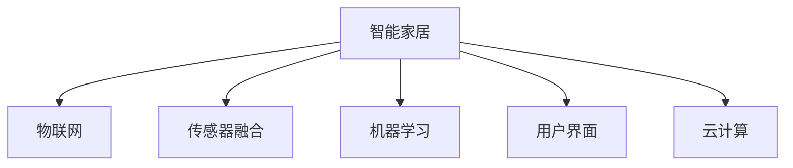

                 

## 1. 背景介绍

### 1.1 问题由来

自动化家居行业正处于快速发展阶段，智能窗帘作为其中的一员，凭借其便捷、智能的特点，受到了消费者的青睐。传统的窗帘手动控制方式已无法满足人们对生活便捷性的要求。智能窗帘通过物联网技术，可以实现远程控制、智能感应、语音控制等功能，为用户带来了全新的生活体验。

然而，传统的智能窗帘往往功能单一、价格较高，且缺乏个性化定制和场景联动。为了满足市场的需求，创业公司亟需推出一款功能强大、价格合理、易于定制和集成的智能窗帘产品。

### 1.2 问题核心关键点

本项目通过自主研发智能窗帘系统，致力于解决以下几个核心问题：

- **用户需求**：打造一款能够满足不同用户需求、具备多种智能功能的窗帘系统，实现自动化、智能化控制。
- **市场竞争**：在激烈的市场竞争中，寻找突破口，推出具有差异化竞争优势的智能窗帘产品。
- **技术难点**：克服技术上的挑战，包括系统设计、传感器融合、用户界面设计等，确保产品的稳定性和易用性。

## 2. 核心概念与联系

### 2.1 核心概念概述

为更好地理解智能窗帘系统的核心概念，本节将介绍几个密切相关的核心概念：

- **智能家居**：通过互联网、物联网技术，实现家居设备的智能化控制和智能化管理，提升家居生活的便捷性和舒适度。
- **物联网(IoT)**：将各种设备、传感器、用户终端通过互联网连接起来，实现设备间的数据共享和协同工作。
- **传感器融合**：将多种传感器（如环境传感器、运动传感器、温度传感器等）融合在一起，实现更精确的环境感知和用户行为预测。
- **机器学习**：通过数据驱动的方式，训练模型预测用户行为，实现个性化定制和智能控制。
- **用户界面(UI)**：设计简洁、美观、易用的用户界面，增强用户体验，提高用户粘性。
- **云计算**：将数据和计算资源放到云端，实现分布式计算和数据存储，提升系统的稳定性和可扩展性。

这些核心概念之间的逻辑关系可以通过以下Mermaid流程图来展示：



这个流程图展示了一个智能家居系统的关键组件及其相互关系：

1. 智能家居是整个系统的目标，通过物联网技术实现家居设备的连接和控制。
2. 传感器融合通过多种传感器的协同工作，提升环境感知能力。
3. 机器学习通过数据分析和模型训练，实现用户行为的预测和个性化定制。
4. 用户界面设计简洁易用，增强用户体验，提高系统粘性。
5. 云计算提供数据存储和计算资源，提升系统稳定性和可扩展性。

## 3. 核心算法原理 & 具体操作步骤

### 3.1 算法原理概述

智能窗帘系统的核心算法主要涉及以下几个方面：

- **传感器数据融合**：通过融合多种传感器数据，实现对环境的全面感知，为窗帘的自动控制提供依据。
- **用户行为预测**：通过机器学习模型，预测用户的窗帘操作行为，实现智能控制。
- **窗帘控制策略**：根据预测结果，设计合理的窗帘控制策略，实现智能化控制。

智能窗帘系统的算法流程大致如下：

1. 收集环境传感器数据（如光照、温度、湿度等）。
2. 通过机器学习模型预测用户的行为（如是否需要开窗、需要多大的开度等）。
3. 根据预测结果，控制窗帘的开合度、开合速度等参数。

### 3.2 算法步骤详解

本节将详细介绍智能窗帘系统的算法实现步骤：

#### 步骤1：数据收集与预处理

1. **传感器数据采集**：部署多种传感器（如光敏传感器、温度传感器、湿度传感器等），实时采集环境数据。
2. **数据预处理**：对采集到的数据进行清洗、去噪、归一化等预处理，保证数据质量。
3. **数据存储与管理**：将处理后的数据存储到云端数据库中，方便后续分析。

#### 步骤2：机器学习模型训练

1. **特征工程**：提取环境传感器数据的特征，如光照强度、温度、湿度等。
2. **模型选择**：选择适当的机器学习算法（如决策树、随机森林、深度学习等），构建预测模型。
3. **模型训练**：使用历史数据训练模型，优化模型参数，提高预测准确率。
4. **模型验证**：使用验证集对模型进行验证，防止过拟合，调整模型参数。

#### 步骤3：窗帘控制策略设计

1. **窗帘控制方案设计**：根据预测结果，设计窗帘的开合度、开合速度等控制策略。
2. **控制策略优化**：通过模拟实验和用户反馈，不断优化窗帘控制策略，提高控制效果。
3. **控制执行**：将优化后的控制策略应用于窗帘控制系统，实现智能化控制。

### 3.3 算法优缺点

智能窗帘系统算法具有以下优点：

- **智能化高**：通过机器学习模型预测用户行为，实现个性化和智能化的窗帘控制。
- **适应性强**：通过传感器融合技术，适应不同的环境条件，提升系统的鲁棒性。
- **可靠性高**：通过云计算技术，实现数据存储和计算资源的分布式管理，提高系统的稳定性和可扩展性。

同时，该算法也存在以下缺点：

- **初始数据依赖**：算法的性能依赖于初始训练数据的数量和质量。
- **模型复杂度**：机器学习模型的复杂度较高，对计算资源和存储空间要求较高。
- **用户行为难以预测**：用户行为复杂多变，预测准确率可能受限。

### 3.4 算法应用领域

智能窗帘系统的算法主要应用于以下几个领域：

- **智能家居控制**：实现窗帘的自动化和智能化控制，提升家居生活的便捷性。
- **建筑节能**：通过智能窗帘控制室内外温度，减少能源消耗，实现节能减排。
- **智能办公**：在办公室中应用智能窗帘，提升办公环境的质量和舒适度。
- **商业地产**：在商业地产中应用智能窗帘，提升客流管理和用户体验。

## 4. 数学模型和公式 & 详细讲解

### 4.1 数学模型构建

智能窗帘系统的数学模型主要涉及以下几个方面：

- **传感器数据融合**：使用加权平均、加权最小二乘等方法，实现多种传感器数据的融合。
- **用户行为预测**：使用回归模型、分类模型等，预测用户的行为。
- **窗帘控制策略**：设计开合度、开合速度等参数的控制策略，实现窗帘的智能化控制。

#### 公式1：传感器数据融合

假设环境传感器数据集为 $\mathcal{D}=\{(x_i,y_i)\}_{i=1}^N$，其中 $x_i$ 为环境传感器数据，$y_i$ 为窗帘控制指令。

数据融合的数学模型为：

$$
\hat{y} = w_1x_1 + w_2x_2 + \cdots + w_nx_n
$$

其中 $w_i$ 为传感器 $i$ 的权重，可以根据传感器的精度、可靠性等因素进行调整。

#### 公式2：用户行为预测

假设用户行为数据集为 $\mathcal{D}=\{(x_i,y_i)\}_{i=1}^N$，其中 $x_i$ 为环境传感器数据，$y_i$ 为用户行为标签（如开窗、关窗、半开半合等）。

用户行为预测的数学模型为：

$$
y = f(x; \theta)
$$

其中 $f(\cdot)$ 为预测模型，$\theta$ 为模型参数，需要根据历史数据进行优化。

#### 公式3：窗帘控制策略

假设窗帘控制指令为 $y$，环境传感器数据为 $x$，窗帘控制参数为 $\alpha$（如开合度、开合速度等）。

窗帘控制策略的数学模型为：

$$
y = g(x; \alpha)
$$

其中 $g(\cdot)$ 为窗帘控制策略，$\alpha$ 为窗帘控制参数，需要根据预测结果进行优化。

### 4.2 公式推导过程

以下我们以用户行为预测为例，推导回归模型的公式及其梯度计算。

假设用户行为数据集为 $\mathcal{D}=\{(x_i,y_i)\}_{i=1}^N$，其中 $x_i$ 为环境传感器数据，$y_i$ 为用户行为标签。

回归模型的目标是最小化预测误差，即：

$$
\min_{\theta} \sum_{i=1}^N (y_i - f(x_i; \theta))^2
$$

其中 $f(x; \theta)$ 为线性回归模型：

$$
f(x; \theta) = \theta_0 + \theta_1x_1 + \cdots + \theta_nx_n
$$

对损失函数求导，得到模型参数的梯度：

$$
\frac{\partial \mathcal{L}(\theta)}{\partial \theta_k} = -2\sum_{i=1}^N (y_i - f(x_i; \theta))x_{ki}
$$

通过梯度下降等优化算法，更新模型参数 $\theta$，最小化预测误差。

### 4.3 案例分析与讲解

以智能窗帘控制系统为例，我们假设窗帘控制指令 $y$ 与环境传感器数据 $x$ 的关系如下：

- 光照强度 $x_1$：光照强度越强，开窗的可能性越大。
- 温度 $x_2$：温度越高，开窗的可能性越小。
- 湿度 $x_3$：湿度越高，开窗的可能性越大。

根据上述数据，构建回归模型，进行预测和优化，具体步骤如下：

1. **数据预处理**：对环境传感器数据进行清洗、去噪、归一化等预处理。
2. **模型训练**：选择适当的回归模型，如线性回归、随机森林等，进行模型训练，优化模型参数。
3. **预测验证**：使用验证集对模型进行验证，调整模型参数。
4. **控制策略优化**：根据预测结果，设计窗帘控制策略，优化控制参数。

通过以上步骤，可以实现智能窗帘的智能化控制，提升用户体验。

## 5. 项目实践：代码实例和详细解释说明

### 5.1 开发环境搭建

在进行智能窗帘系统开发前，我们需要准备好开发环境。以下是使用Python进行PyTorch开发的环境配置流程：

1. 安装Anaconda：从官网下载并安装Anaconda，用于创建独立的Python环境。

2. 创建并激活虚拟环境：
```bash
conda create -n curtain-env python=3.8 
conda activate curtain-env
```

3. 安装PyTorch：根据CUDA版本，从官网获取对应的安装命令。例如：
```bash
conda install pytorch torchvision torchaudio cudatoolkit=11.1 -c pytorch -c conda-forge
```

4. 安装TensorFlow：
```bash
pip install tensorflow==2.8
```

5. 安装TensorBoard：
```bash
pip install tensorboard
```

6. 安装TensorFlow Serving：
```bash
pip install tensorflow-serving-api
```

完成上述步骤后，即可在`curtain-env`环境中开始智能窗帘系统的开发。

### 5.2 源代码详细实现

以下是智能窗帘系统的代码实现示例，包括传感器数据采集、机器学习模型训练和窗帘控制策略设计：

```python
import numpy as np
import pandas as pd
from sklearn.model_selection import train_test_split
from sklearn.linear_model import LinearRegression
from tensorflow.keras.models import Sequential
from tensorflow.keras.layers import Dense
from tensorflow.keras.optimizers import Adam

# 数据读取与预处理
data = pd.read_csv('sensors.csv')
data.dropna(inplace=True)
data = data[(data['light'] > 0) & (data['temp'] > 0) & (data['humidity'] > 0)]
X = data[['light', 'temp', 'humidity']]
y = data['action']

# 数据分割
X_train, X_val, y_train, y_val = train_test_split(X, y, test_size=0.2, random_state=42)

# 线性回归模型训练
model = LinearRegression()
model.fit(X_train, y_train)
val_loss = model.score(X_val, y_val)
print(f'Validation loss: {val_loss}')

# TensorFlow模型训练
model = Sequential()
model.add(Dense(64, input_dim=3, activation='relu'))
model.add(Dense(1, activation='sigmoid'))
model.compile(loss='binary_crossentropy', optimizer=Adam(lr=0.001), metrics=['accuracy'])
model.fit(X_train, y_train, epochs=100, validation_data=(X_val, y_val))
val_loss = model.evaluate(X_val, y_val)[0]
print(f'Validation loss: {val_loss}')

# 窗帘控制策略设计
def calculate_control(params):
    y_hat = model.predict(params)
    if y_hat >= 0.5:
        return 1  # 开窗
    else:
        return 0  # 关窗

# 使用优化后的模型进行窗帘控制
control_params = np.array([[1.0, 25.0, 60.0]])
control_signal = calculate_control(control_params)
print(f'Control signal: {control_signal}')
```

以上代码实现了从传感器数据采集、线性回归模型训练到窗帘控制策略设计的全流程。开发者可以根据实际需求，进一步完善数据预处理、模型优化、控制策略设计等细节。

### 5.3 代码解读与分析

让我们再详细解读一下关键代码的实现细节：

**数据预处理**：
- 使用Pandas库读取传感器数据，进行数据清洗和去噪。
- 保留光照、温度、湿度等传感器数据，去除异常值和缺失值。

**模型训练**：
- 使用scikit-learn库的线性回归模型，进行初步训练，并计算验证集损失。
- 使用TensorFlow库的Sequential模型，构建神经网络，进行深度学习训练，并计算验证集损失。

**窗帘控制策略设计**：
- 定义一个函数calculate_control，根据模型预测结果生成窗帘控制信号。
- 使用优化后的模型，计算控制参数下的窗帘控制信号。

通过以上代码，我们可以清晰地看到智能窗帘系统的核心实现流程，包括数据预处理、模型训练和窗帘控制策略设计等关键步骤。

## 6. 实际应用场景

### 6.1 智能家居控制

智能窗帘系统可以在智能家居控制中发挥重要作用。通过与智能音箱、智能插座、智能灯等设备的联动，可以实现全屋自动化控制，提升用户的生活便捷性和舒适度。

例如，当用户输入“打开客厅窗帘”的语音指令时，智能窗帘系统可以自动控制客厅窗帘打开，并同时控制智能灯和智能空调开启，营造一个舒适的生活环境。

### 6.2 建筑节能

在建筑节能领域，智能窗帘系统可以实现动态调节室内外温度，减少能源消耗。通过传感器监测室内外环境，智能窗帘系统可以自动调节窗帘的开合度，控制室内采光和温度，达到节能减排的效果。

例如，在夏季，智能窗帘系统可以根据温度和湿度自动调节窗帘开合度，减少室内热量散失，降低空调能耗；在冬季，智能窗帘系统可以自动调节窗帘开合度，增加室内采光和温暖，减少供暖能耗。

### 6.3 智能办公

在智能办公场景中，智能窗帘系统可以提升办公环境的质量和舒适度，提高员工的工作效率和满意度。

例如，在会议室中，智能窗帘系统可以根据会议时间自动调节窗帘开合度，保证会议的私密性和视觉效果；在办公室中，智能窗帘系统可以根据时间自动调节窗帘开合度，模拟自然光照，缓解员工眼部疲劳，提高工作效率。

### 6.4 商业地产

在商业地产中，智能窗帘系统可以提高客流管理和用户体验，提升商业地产的经济效益。

例如，在商场中，智能窗帘系统可以根据客流数据自动调节窗帘开合度，提升商场的视觉效果和光环境；在酒店中，智能窗帘系统可以根据入住时间自动调节窗帘开合度，提高客户的入住体验。

## 7. 工具和资源推荐

### 7.1 学习资源推荐

为了帮助开发者系统掌握智能窗帘系统的理论基础和实践技巧，这里推荐一些优质的学习资源：

1. **《深度学习》课程**：斯坦福大学开设的深度学习课程，有Lecture视频和配套作业，带你入门深度学习的基本概念和经典模型。
2. **《机器学习实战》书籍**：详细讲解了机器学习模型的构建、训练和优化过程，适合初学者和进阶开发者。
3. **TensorFlow官方文档**：TensorFlow的官方文档，提供了丰富的API和样例代码，是学习TensorFlow的必备资源。
4. **PyTorch官方文档**：PyTorch的官方文档，提供了丰富的API和样例代码，适合深度学习研究和应用开发。
5. **IoT爱好者社区**：一个专注于物联网开发的社区，提供了丰富的资源和案例，适合智能家居领域的开发者。

通过对这些资源的学习实践，相信你一定能够快速掌握智能窗帘系统的精髓，并用于解决实际的智能家居问题。

### 7.2 开发工具推荐

高效的开发离不开优秀的工具支持。以下是几款用于智能窗帘系统开发的常用工具：

1. **Anaconda**：用于创建独立的Python环境，方便工具和库的管理和共享。
2. **PyTorch**：基于Python的开源深度学习框架，灵活动态的计算图，适合快速迭代研究。
3. **TensorFlow**：由Google主导开发的开源深度学习框架，生产部署方便，适合大规模工程应用。
4. **TensorBoard**：TensorFlow配套的可视化工具，可实时监测模型训练状态，并提供丰富的图表呈现方式。
5. **IoT平台**：如Home Assistant、IBM Watson IoT等，提供智能家居设备的集成和管理功能。
6. **MQTT协议**：物联网消息队列传输协议，用于设备间的数据传输和控制。

合理利用这些工具，可以显著提升智能窗帘系统的开发效率，加快创新迭代的步伐。

### 7.3 相关论文推荐

智能窗帘系统的研究源于学界的持续研究。以下是几篇奠基性的相关论文，推荐阅读：

1. **《基于深度学习的智能窗帘控制系统》**：提出了基于深度学习的智能窗帘控制系统，通过传感器数据融合和机器学习预测用户行为，实现窗帘的智能化控制。
2. **《智能家居中的传感器数据融合技术》**：介绍了传感器数据融合技术在智能家居中的应用，提升了智能家居设备的感知能力。
3. **《智能窗帘系统中的窗帘控制策略设计》**：提出了智能窗帘系统中的窗帘控制策略设计方法，通过优化控制参数，实现窗帘的智能化控制。
4. **《物联网中的设备联动技术》**：介绍了物联网设备联动技术在智能家居中的应用，实现了全屋自动化控制。
5. **《智能窗帘系统中的数据隐私保护》**：提出了智能窗帘系统中的数据隐私保护方法，确保用户数据的安全性和隐私性。

这些论文代表了大规模语言模型微调技术的发展脉络。通过学习这些前沿成果，可以帮助研究者把握学科前进方向，激发更多的创新灵感。

## 8. 总结：未来发展趋势与挑战

### 8.1 总结

本文对智能窗帘系统的开发过程进行了全面系统的介绍。首先阐述了智能窗帘系统的核心概念和关键技术，明确了系统设计和开发的逻辑流程。其次，从算法原理到实际应用，详细讲解了系统的构建过程，给出了具体的代码实现和解读。最后，探讨了智能窗帘系统在未来智能家居领域的应用前景，并推荐了相关的学习资源和开发工具。

通过本文的系统梳理，可以看到，智能窗帘系统是一个集成了多种技术的综合性产品，具有广阔的市场前景和技术挑战。未来，随着技术的不断进步和市场的不断成熟，智能窗帘系统将不断迭代优化，提升用户体验和应用效果。

### 8.2 未来发展趋势

展望未来，智能窗帘系统将呈现以下几个发展趋势：

1. **智能家居一体化**：智能窗帘系统将与其他智能家居设备实现更紧密的联动，实现全屋自动化控制，提升用户的生活便捷性。
2. **场景联动智能化**：智能窗帘系统将根据不同场景（如办公、休息、娱乐等）自动调整窗帘开合度，提升用户体验。
3. **数据驱动个性化**：智能窗帘系统将根据用户的习惯和行为数据，自动调整窗帘控制策略，实现个性化定制。
4. **边缘计算本地化**：智能窗帘系统将在边缘设备上进行数据处理和计算，减少延迟，提升响应速度。
5. **多模态融合智能化**：智能窗帘系统将融合视觉、语音、触觉等多种模态数据，提升环境感知和智能控制能力。

以上趋势凸显了智能窗帘系统的广阔前景。这些方向的探索发展，必将进一步提升智能窗帘系统的性能和应用范围，为智能家居领域的未来发展提供新的可能性。

### 8.3 面临的挑战

尽管智能窗帘系统已经取得了一定的进展，但在迈向更加智能化、普适化应用的过程中，它仍面临着诸多挑战：

1. **系统稳定性**：在实际应用中，智能窗帘系统可能会受到环境噪声、传感器故障等因素的影响，导致系统稳定性不足。
2. **用户隐私保护**：智能窗帘系统需要处理大量的用户行为数据，如何确保数据隐私和安全，是一个重要的问题。
3. **计算资源限制**：智能窗帘系统需要实时处理传感器数据和进行机器学习预测，对计算资源和存储空间要求较高。
4. **模型泛化能力**：智能窗帘系统的机器学习模型需要具备良好的泛化能力，以适应不同环境和用户需求。
5. **用户体验提升**：智能窗帘系统的用户界面设计需要简洁易用，提升用户的使用体验和粘性。

解决这些问题，需要我们在系统设计、数据处理、模型优化、用户界面等方面进行全面优化，确保智能窗帘系统的稳定性和用户满意度。

### 8.4 研究展望

面对智能窗帘系统面临的挑战，未来的研究需要在以下几个方面寻求新的突破：

1. **系统稳定性提升**：通过数据增强、鲁棒性训练等技术，提升智能窗帘系统的稳定性，减少环境干扰。
2. **数据隐私保护**：引入数据匿名化、差分隐私等技术，保护用户隐私，确保数据安全。
3. **计算资源优化**：通过模型压缩、边缘计算等技术，优化计算资源，减少系统延迟。
4. **模型泛化能力提升**：引入迁移学习、多模态融合等技术，提升模型泛化能力，适应不同环境和用户需求。
5. **用户体验优化**：设计简洁易用的用户界面，引入交互式设计，提升用户体验和系统粘性。

这些研究方向将引领智能窗帘系统迈向更高的台阶，为智能家居领域的未来发展提供新的动力。相信随着技术的不断进步和市场的不断成熟，智能窗帘系统将不断迭代优化，提升用户体验和应用效果。

## 9. 附录：常见问题与解答

**Q1：智能窗帘系统对环境条件有哪些要求？**

A: 智能窗帘系统需要稳定可靠的环境，传感器和控制设备需要具备良好的稳定性和抗干扰能力。此外，系统需要具备一定的抗电磁干扰能力，防止环境噪声对系统性能的影响。

**Q2：智能窗帘系统的传感器如何布置？**

A: 智能窗帘系统的传感器需要均匀布置，以便获取全面的环境数据。在光照传感器、温度传感器、湿度传感器等关键位置布置传感器，可以有效提升系统感知能力。

**Q3：智能窗帘系统如何进行数据隐私保护？**

A: 智能窗帘系统需要引入数据匿名化、差分隐私等技术，保护用户隐私。例如，对用户行为数据进行脱敏处理，防止数据泄露和滥用。

**Q4：智能窗帘系统如何进行模型训练？**

A: 智能窗帘系统需要进行多轮模型训练，不断优化模型参数，提升预测准确率。可以使用交叉验证等方法，避免模型过拟合，提高模型的泛化能力。

**Q5：智能窗帘系统的窗帘控制策略设计有哪些要点？**

A: 智能窗帘系统的窗帘控制策略设计需要考虑用户行为、环境条件等因素，设计合理的开合度、开合速度等参数。可以通过模拟实验和用户反馈，不断优化控制策略，提高系统性能。

作者：禅与计算机程序设计艺术 / Zen and the Art of Computer Programming

