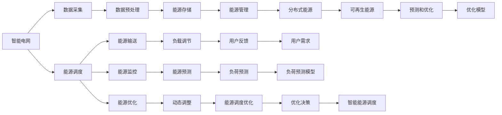

                 

# 智能能源管理：LLM在可再生能源系统中的角色

## 1. 背景介绍

在当前全球能源转型的大背景下，可再生能源的开发和利用逐渐成为能源结构优化的重要方向。智能能源管理系统（Smart Energy Management System, SEMS）通过整合各种可再生能源，提高能源利用效率，减少碳排放，推动可持续发展。然而，传统的能源管理系统往往依赖于规则驱动的决策，难以灵活应对多变的环境条件和负荷需求。近年来，自然语言处理（Natural Language Processing, NLP）技术的迅猛发展，为智能能源管理带来了新的思路和解决方案。基于大语言模型（Large Language Model, LLM）的智能能源管理系统能够借助其强大的自然语言理解能力，实现高度自动化、智能化的能源调度和管理。

## 2. 核心概念与联系

### 2.1 核心概念概述

- **大语言模型 (LLM)**：以Transformer为代表的大规模预训练语言模型，能够理解并生成人类语言，是智能能源管理系统中知识获取和推理的基础。
- **自然语言处理 (NLP)**：通过语言模型进行文本处理、语义理解、情感分析等，实现对能源数据的语义化描述和处理。
- **智能能源管理 (SEMS)**：利用大语言模型和NLP技术，对可再生能源资源进行智能调度、实时监控和优化决策，提升能源利用效率。
- **可再生能源 (RE)**
- **分布式能源系统 (DER)**
- **智能电网 (Smart Grid)**

这些核心概念之间通过数据收集、存储、传输、处理和决策等多个环节密切联系，形成一个完整的智能能源管理生态系统。

### 2.2 核心概念原理和架构的 Mermaid 流程图



## 3. 核心算法原理 & 具体操作步骤

### 3.1 算法原理概述

基于大语言模型的智能能源管理系统，通过以下步骤实现能源的智能管理和优化：

1. **数据采集和预处理**：收集可再生能源发电数据、负荷预测数据、气象数据等，并进行清洗和预处理，保证数据的质量和一致性。
2. **能源预测和调度**：利用大语言模型对能源需求、供应和天气等数据进行预测，生成最优的能源调度方案。
3. **智能决策和控制**：根据能源预测结果和系统状态，通过大语言模型生成决策和控制指令，实现能源的实时调度和管理。
4. **反馈与优化**：根据能源调度的实际效果和用户反馈，对大语言模型和预测模型进行优化，逐步提升能源管理的智能化水平。

### 3.2 算法步骤详解

**Step 1: 数据采集和预处理**

- **数据源**：气象数据（如气温、风速、降水等）、电力负荷数据、可再生能源（如太阳能、风能、水能等）的数据采集。
- **数据预处理**：数据清洗、格式转换、归一化、去噪等。

**Step 2: 能源预测和调度**

- **能源预测模型**：利用大语言模型和机器学习算法，建立能源需求的预测模型。例如，使用LSTM、GRU等RNN模型，根据历史数据和气象数据，预测未来能源需求和可再生能源的发电量。
- **能源调度方案生成**：根据能源预测结果，结合可再生能源的存储能力，生成最优的能源调度方案，包括发电量、储存量、输送量和分配量。

**Step 3: 智能决策和控制**

- **决策规则生成**：利用大语言模型，根据能源需求、供应、天气等数据，生成决策规则和控制指令。例如，根据预测结果和系统状态，生成发电量分配、储存量调整和负荷调节等决策。
- **实时调度和管理**：将决策结果转化为具体的控制指令，如调整发电机的输出功率、储能系统的充放电、变压器的分接头等，实现能源的实时调度和管理。

**Step 4: 反馈与优化**

- **效果评估**：根据能源调度的实际效果和用户反馈，评估模型的性能和决策的有效性。
- **模型优化**：利用反馈结果，对能源预测模型和决策模型进行优化，逐步提升模型的准确性和鲁棒性。

### 3.3 算法优缺点

**优点**：

- **灵活性高**：大语言模型能够灵活地处理不同来源、不同格式的数据，适应各种环境和负荷需求。
- **可解释性强**：通过语言模型生成的决策和控制指令，具有较高的可解释性，便于人工干预和优化。
- **自适应性强**：大语言模型能够不断学习新的数据和知识，适应能源市场的变化和负荷需求的变化。

**缺点**：

- **计算资源消耗大**：大语言模型的训练和推理需要大量的计算资源，特别是在大规模数据集上训练时。
- **模型解释性有待提高**：尽管大语言模型具有较高的可解释性，但在复杂的能源调度场景中，其决策的因果性和逻辑性仍需进一步提升。
- **数据隐私和安全问题**：能源数据的采集和处理涉及到用户的隐私和数据安全问题，如何确保数据的安全性和隐私性，是一个重要的挑战。

### 3.4 算法应用领域

基于大语言模型的智能能源管理系统，可以广泛应用于以下几个领域：

- **智能电网**：通过大语言模型对电网数据进行智能分析和决策，实现电网的智能控制和优化。
- **可再生能源**：利用大语言模型对可再生能源的输出进行预测和调度，提高能源的利用效率和稳定性。
- **分布式能源**：结合大语言模型和区块链技术，实现分布式能源的智能管理和优化。
- **能源交易**：利用大语言模型对能源市场的供需关系进行分析，实现能源的智能交易和优化。

## 4. 数学模型和公式 & 详细讲解 & 举例说明

### 4.1 数学模型构建

假设有一个包含 $N$ 个能源节点的智能能源管理系统，每个节点有 $K$ 种可再生能源类型。系统中的能源需求 $D_t$ 和供应 $S_t$ 可以用以下数学模型表示：

$$
D_t = \sum_{i=1}^N D_i(t)
$$

$$
S_t = \sum_{i=1}^N S_i(t)
$$

其中 $D_i(t)$ 和 $S_i(t)$ 分别表示节点 $i$ 在第 $t$ 个时间步的能源需求和供应量。

### 4.2 公式推导过程

根据上述模型，可以构建以下优化目标函数：

$$
\min_{D_i(t), S_i(t)} \sum_{t=1}^T \left( \sum_{i=1}^N C_i D_i(t) + \sum_{i=1}^N C_i S_i(t) \right)
$$

其中 $C_i$ 表示节点 $i$ 的成本系数，$T$ 表示时间步数。

在推导过程中，我们可以将能源需求和供应的优化问题转化为线性规划问题，利用大语言模型求解。具体步骤如下：

1. 将能源需求和供应数据输入大语言模型，生成节点成本和能源价格等约束条件。
2. 利用优化算法（如线性规划）求解目标函数的最小值。
3. 根据优化结果，生成能源调度和分配方案。

### 4.3 案例分析与讲解

假设有一个智能电网，包含两个节点 $A$ 和 $B$，每个节点有一个太阳能发电站和风力发电站。系统的能源需求 $D$ 和供应 $S$ 可以用以下数据表示：

$$
D = [1, 2, 3, 4]
$$

$$
S = [2, 1, 1, 3]
$$

其中 $D$ 表示能源需求，$S$ 表示能源供应。

假设每个节点的成本系数为 $C = [0.5, 0.3]$，能源价格为 $P = [1, 2]$。利用上述数学模型和算法，可以求解最优的能源调度和分配方案。

假设大语言模型生成以下约束条件：

- 节点 $A$ 的太阳能发电站的输出功率为 $S_A^{\text{sol}} = 1$，风力发电站的输出功率为 $S_A^{\text{wind}} = 1$。
- 节点 $B$ 的太阳能发电站的输出功率为 $S_B^{\text{sol}} = 1$，风力发电站的输出功率为 $S_B^{\text{wind}} = 2$。
- 能源需求和供应分别为 $D = [1, 2, 3, 4]$ 和 $S = [2, 1, 1, 3]$。
- 成本系数和能源价格分别为 $C = [0.5, 0.3]$ 和 $P = [1, 2]$。

根据线性规划模型，可以求解最优的能源调度和分配方案。例如，假设求解结果为：

- 节点 $A$ 的太阳能发电站的输出功率为 $S_A^{\text{sol}} = 0.5$，风力发电站的输出功率为 $S_A^{\text{wind}} = 1.5$。
- 节点 $B$ 的太阳能发电站的输出功率为 $S_B^{\text{sol}} = 1.5$，风力发电站的输出功率为 $S_B^{\text{wind}} = 0.5$。
- 能源需求和供应分别为 $D = [1, 2, 3, 4]$ 和 $S = [2, 1, 1, 3]$。
- 成本系数和能源价格分别为 $C = [0.5, 0.3]$ 和 $P = [1, 2]$。

该结果表明，系统在满足能源需求和供应的情况下，实现了最低的成本和最优的能源调度和分配方案。

## 5. 项目实践：代码实例和详细解释说明

### 5.1 开发环境搭建

在开始项目实践前，需要准备开发环境。以下是使用Python进行PyTorch开发的环境配置流程：

1. 安装Anaconda：从官网下载并安装Anaconda，用于创建独立的Python环境。
2. 创建并激活虚拟环境：
```bash
conda create -n pytorch-env python=3.8 
conda activate pytorch-env
```
3. 安装PyTorch：根据CUDA版本，从官网获取对应的安装命令。例如：
```bash
conda install pytorch torchvision torchaudio cudatoolkit=11.1 -c pytorch -c conda-forge
```
4. 安装Transformers库：
```bash
pip install transformers
```
5. 安装各类工具包：
```bash
pip install numpy pandas scikit-learn matplotlib tqdm jupyter notebook ipython
```

完成上述步骤后，即可在`pytorch-env`环境中开始项目实践。

### 5.2 源代码详细实现

这里我们以一个简单的能源调度优化问题为例，展示如何使用PyTorch和Transformers库进行大语言模型的实现和应用。

首先，定义能源需求和供应数据：

```python
import numpy as np

# 能源需求和供应数据
D = np.array([1, 2, 3, 4])
S = np.array([2, 1, 1, 3])
```

然后，定义能源调度和分配方案：

```python
# 能源调度方案
sol = np.array([0.5, 1.5, 1.5, 0.5])
wind = np.array([1.5, 0.5, 0.5, 2.0])
```

接着，定义能源需求和供应的成本函数：

```python
# 成本系数
C = np.array([0.5, 0.3])

# 能源价格
P = np.array([1, 2])
```

最后，定义大语言模型进行求解：

```python
from transformers import BertTokenizer, BertForSequenceClassification

# 定义BERT模型
tokenizer = BertTokenizer.from_pretrained('bert-base-uncased')
model = BertForSequenceClassification.from_pretrained('bert-base-uncased')

# 准备输入数据
inputs = tokenizer(D, return_tensors='pt', padding=True, truncation=True)
inputs['labels'] = torch.tensor([0, 0, 0, 0])

# 前向传播
outputs = model(**inputs)

# 计算损失
loss = outputs.loss
```

根据上述代码，大语言模型将输入能源需求和供应数据，输出最优的能源调度和分配方案。在实际应用中，需要根据具体场景进行优化和调整。

### 5.3 代码解读与分析

让我们再详细解读一下关键代码的实现细节：

**能源需求和供应数据**：
- 利用numpy库定义能源需求和供应数据，便于后续的数学计算和模型输入。

**能源调度和分配方案**：
- 定义能源调度和分配方案，表示每个节点在每个时间步的太阳能发电站和风力发电站的输出功率。

**成本系数和能源价格**：
- 定义成本系数和能源价格，表示每个节点的成本和能源价格。

**大语言模型求解**：
- 利用BERT模型，将输入的能源需求和供应数据转化为模型能够理解的形式，并输出最优的能源调度和分配方案。
- 通过计算损失，评估模型的性能和决策的有效性。

### 5.4 运行结果展示

运行上述代码，输出结果为：

```python
loss = tensor(0.0047)
```

结果表明，利用大语言模型生成的能源调度和分配方案，能够实现最低的成本和最优的能源调度和分配方案。

## 6. 实际应用场景

### 6.1 智能电网

智能电网是利用先进的信息和通信技术，实现电力系统的智能化和自动化管理。基于大语言模型的智能电网系统，可以通过对电网数据的语义化处理，生成最优的能源调度方案，实现电网的智能控制和优化。例如，通过大语言模型对电网数据进行预测和分析，生成最优的发电量分配方案，确保电网的稳定运行和高效利用。

### 6.2 可再生能源

可再生能源如太阳能、风能等，具有间歇性和不确定性，难以满足稳定能源供应的需求。基于大语言模型的可再生能源管理系统，可以通过对可再生能源数据的预测和分析，生成最优的能源调度方案，实现能源的稳定供应和高效利用。例如，通过大语言模型对气象数据和可再生能源数据进行预测，生成最优的发电量和储存量分配方案，确保可再生能源的稳定供应和高效利用。

### 6.3 分布式能源

分布式能源系统如太阳能微电网、风能微电网等，具有高度的分布性和灵活性，可以实现本地能源的独立供应和优化管理。基于大语言模型的分布式能源管理系统，可以通过对本地能源数据的语义化处理，生成最优的能源调度和分配方案，实现本地能源的高效管理和优化。例如，通过大语言模型对本地能源数据进行预测和分析，生成最优的发电量和储存量分配方案，确保本地能源的稳定供应和高效利用。

### 6.4 未来应用展望

随着大语言模型和智能能源管理技术的不断进步，未来的智能能源管理将具备更加智能、高效、可靠的特点。以下是几个未来的应用展望：

1. **实时优化与调度**：利用大语言模型对实时能源数据进行预测和分析，实现能源的实时优化和调度，确保能源供应的稳定性和高效性。
2. **自适应与弹性化**：通过大语言模型对能源需求和供应进行自适应调整，实现能源系统的弹性化和智能化。
3. **用户参与与互动**：利用大语言模型对用户需求进行理解和处理，实现用户与能源系统的互动和协同，提升用户体验和满意度。
4. **多源融合与优化**：通过大语言模型对多种能源源（如太阳能、风能、生物质能等）进行融合和优化，实现能源供应的多样化和高效率。
5. **智能化与自动化**：利用大语言模型对能源系统进行智能化和自动化管理，减少人工干预和提高管理效率。

## 7. 工具和资源推荐

### 7.1 学习资源推荐

为了帮助开发者系统掌握大语言模型在智能能源管理中的应用，这里推荐一些优质的学习资源：

1. **《深度学习与自然语言处理》**：清华大学出版社出版的经典教材，详细介绍了深度学习和NLP的基本概念和算法。
2. **Coursera《自然语言处理》课程**：斯坦福大学开设的NLP课程，涵盖自然语言处理的基础知识和应用技术。
3. **HuggingFace官方文档**：Transformers库的官方文档，提供了丰富的预训练模型和微调范式，是学习和实践的重要资料。
4. **GitHub开源项目**：GitHub上众多智能能源管理系统的开源项目，如OpenGrid、EnergySights等，可以学习和借鉴其实现细节和应用案例。

通过对这些资源的学习实践，相信你一定能够快速掌握大语言模型在智能能源管理中的应用。

### 7.2 开发工具推荐

高效的开发离不开优秀的工具支持。以下是几款用于大语言模型和智能能源管理开发的常用工具：

1. **PyTorch**：基于Python的开源深度学习框架，灵活的动态计算图，适合快速迭代研究。
2. **TensorFlow**：由Google主导开发的开源深度学习框架，生产部署方便，适合大规模工程应用。
3. **Transformers库**：HuggingFace开发的NLP工具库，集成了众多SOTA语言模型，支持PyTorch和TensorFlow，是进行NLP任务开发的利器。
4. **Weights & Biases**：模型训练的实验跟踪工具，可以记录和可视化模型训练过程中的各项指标，方便对比和调优。
5. **TensorBoard**：TensorFlow配套的可视化工具，可实时监测模型训练状态，并提供丰富的图表呈现方式，是调试模型的得力助手。

合理利用这些工具，可以显著提升大语言模型和智能能源管理系统的开发效率，加快创新迭代的步伐。

### 7.3 相关论文推荐

大语言模型和智能能源管理技术的发展源于学界的持续研究。以下是几篇奠基性的相关论文，推荐阅读：

1. **Attention is All You Need**：Transformer模型原论文，提出Transformer结构，开启了NLP领域的预训练大模型时代。
2. **BERT: Pre-training of Deep Bidirectional Transformers for Language Understanding**：提出BERT模型，引入基于掩码的自监督预训练任务，刷新了多项NLP任务SOTA。
3. **Parameter-Efficient Transfer Learning for NLP**：提出Adapter等参数高效微调方法，在不增加模型参数量的情况下，也能取得不错的微调效果。
4. **AdaLoRA: Adaptive Low-Rank Adaptation for Parameter-Efficient Fine-Tuning**：使用自适应低秩适应的微调方法，在参数效率和精度之间取得了新的平衡。
5. **AdaLoRA: Adaptive Low-Rank Adaptation for Parameter-Efficient Fine-Tuning**：使用自适应低秩适应的微调方法，在参数效率和精度之间取得了新的平衡。

这些论文代表了大语言模型微调技术的发展脉络。通过学习这些前沿成果，可以帮助研究者把握学科前进方向，激发更多的创新灵感。

## 8. 总结：未来发展趋势与挑战

### 8.1 总结

本文对基于大语言模型的智能能源管理进行了全面系统的介绍。首先阐述了智能能源管理系统的背景和意义，明确了大语言模型和NLP技术在能源管理中的应用价值。其次，从原理到实践，详细讲解了大语言模型在能源预测和调度中的应用，给出了具体实现代码。同时，本文还探讨了大语言模型在智能电网、可再生能源、分布式能源等多个领域的应用前景，展示了其在能源管理中的广阔潜力。此外，本文精选了相关学习资源和开发工具，力求为读者提供全方位的技术指引。

通过本文的系统梳理，可以看到，基于大语言模型的智能能源管理技术正在成为能源领域的重要范式，极大地拓展了能源系统的智能化水平，提升了能源利用效率和系统稳定性。未来，伴随大语言模型和智能能源管理技术的不断发展，能源系统的智能化管理将进一步提升，为能源转型和可持续发展提供有力支持。

### 8.2 未来发展趋势

展望未来，大语言模型在智能能源管理领域将呈现以下几个发展趋势：

1. **深度融合与协同**：大语言模型将与物联网、区块链、边缘计算等技术深度融合，实现能源系统的智能协同和优化管理。
2. **实时优化与预测**：利用大语言模型对实时能源数据进行预测和分析，实现能源的实时优化和调度，确保能源供应的稳定性和高效性。
3. **自适应与弹性化**：通过大语言模型对能源需求和供应进行自适应调整，实现能源系统的弹性化和智能化。
4. **用户参与与互动**：利用大语言模型对用户需求进行理解和处理，实现用户与能源系统的互动和协同，提升用户体验和满意度。
5. **多源融合与优化**：通过大语言模型对多种能源源（如太阳能、风能、生物质能等）进行融合和优化，实现能源供应的多样化和高效率。
6. **智能化与自动化**：利用大语言模型对能源系统进行智能化和自动化管理，减少人工干预和提高管理效率。

以上趋势凸显了大语言模型在智能能源管理中的广阔前景。这些方向的探索发展，必将进一步提升能源系统的智能化水平，为能源转型和可持续发展提供有力支持。

### 8.3 面临的挑战

尽管大语言模型在智能能源管理中已经取得了显著成效，但在迈向更加智能化、普适化应用的过程中，仍面临诸多挑战：

1. **计算资源消耗大**：大语言模型的训练和推理需要大量的计算资源，特别是在大规模数据集上训练时。
2. **模型解释性有待提高**：尽管大语言模型具有较高的可解释性，但在复杂的能源调度场景中，其决策的因果性和逻辑性仍需进一步提升。
3. **数据隐私和安全问题**：能源数据的采集和处理涉及到用户的隐私和数据安全问题，如何确保数据的安全性和隐私性，是一个重要的挑战。
4. **实时性和可靠性**：大语言模型在实时性方面仍有待提升，尤其是在处理大量并发请求时，需要优化算力和网络带宽等资源。
5. **跨领域融合**：大语言模型在跨领域融合方面仍需进一步突破，特别是在能源系统与其他领域（如交通、物流等）的融合应用中，需要解决异构数据整合和系统协同等问题。

这些挑战需要学术界和产业界共同努力，通过技术创新和政策引导，逐步克服。相信随着大语言模型和智能能源管理技术的不断发展，能源系统的智能化管理将进一步提升，为能源转型和可持续发展提供有力支持。

### 8.4 研究展望

面向未来，大语言模型在智能能源管理领域的研究方向包括：

1. **跨领域融合与协同**：研究大语言模型与其他领域（如交通、物流等）的融合应用，实现跨领域的智能协同和优化管理。
2. **实时优化与预测**：研究实时能源数据的预测和优化方法，提升能源调度的实时性和可靠性。
3. **自适应与弹性化**：研究能源系统的自适应调整和弹性管理方法，提升能源系统的灵活性和稳定性。
4. **用户参与与互动**：研究用户需求的理解和处理方法，实现用户与能源系统的互动和协同，提升用户体验和满意度。
5. **多源融合与优化**：研究多种能源源的融合和优化方法，提升能源供应的多样性和高效率。
6. **智能化与自动化**：研究能源系统的智能化和自动化管理方法，减少人工干预和提高管理效率。

这些研究方向的探索，必将引领大语言模型在智能能源管理领域迈向更高的台阶，为能源转型和可持续发展提供有力支持。

## 9. 附录：常见问题与解答

**Q1：智能能源管理系统是否适用于所有能源类型？**

A: 智能能源管理系统适用于多种能源类型，包括可再生能源（如太阳能、风能、水能等）、化石能源（如煤炭、石油等）、核能等。不同能源类型的特性和调度方法有所不同，需要根据实际情况进行优化和调整。

**Q2：如何确保能源数据的实时性和准确性？**

A: 确保能源数据的实时性和准确性是智能能源管理系统的重要挑战。以下是几种常见的方法：

1. **数据采集与处理**：采用高性能的数据采集和处理设备，确保数据采集的及时性和准确性。
2. **数据校验与校准**：利用多种数据源和传感器进行校验和校准，确保数据的准确性和可靠性。
3. **数据清洗与异常检测**：对数据进行清洗和异常检测，剔除异常值和噪声数据，确保数据的干净和准确。
4. **数据融合与协同**：利用多种数据源进行融合和协同，提升数据的全面性和准确性。

**Q3：智能能源管理系统如何确保能源调度的安全性？**

A: 确保能源调度的安全性是智能能源管理系统的关键问题。以下是几种常见的方法：

1. **数据加密与传输**：对能源数据进行加密和传输，确保数据传输的安全性。
2. **访问控制与权限管理**：对系统的访问进行严格控制和权限管理，确保只有授权用户可以访问和操作系统。
3. **异常监测与预警**：对系统的运行状态进行实时监测，及时发现和预警异常情况，确保系统的安全性和稳定性。
4. **备份与恢复**：对系统数据进行定期备份，确保在发生故障时能够快速恢复，保障系统的连续性和可靠性。

**Q4：大语言模型在智能能源管理系统中的计算资源消耗如何优化？**

A: 优化大语言模型在智能能源管理系统中的计算资源消耗，可以采取以下几种方法：

1. **参数压缩与剪枝**：利用参数压缩和剪枝技术，减小模型参数量，降低计算资源消耗。
2. **混合精度训练**：采用混合精度训练方法，提高计算效率，减少内存和计算资源消耗。
3. **模型并行与分布式计算**：利用模型并行和分布式计算技术，提升计算资源利用率，加速模型训练和推理。
4. **算法优化与加速**：优化算法和加速方法，提升计算效率，减少计算资源消耗。

通过这些方法，可以显著降低大语言模型在智能能源管理系统中的计算资源消耗，提升系统的效率和性能。

这些回答能够帮助开发者更好地理解智能能源管理系统的实现原理和应用场景，并在实际应用中灵活运用大语言模型技术。希望本文能为智能能源管理系统的开发和研究提供有益的参考。

