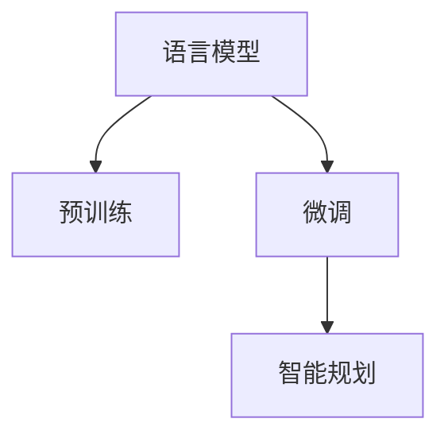

                 

## 1. 背景介绍

随着人工智能技术的迅猛发展，语言模型（Language Models, LMs），特别是大语言模型（Large Language Models, LLMs），已经成为推动AI发展的核心驱动力之一。LLMs如GPT、BERT等，通过在海量文本数据上预训练，学习到了丰富的语言知识，能够进行自然语言理解和生成。在实际应用中，LLMs展现出强大的规划能力和决策能力，极大地提升了智能系统的灵活性和适应性。然而，这些能力背后的核心竞争力是什么？本文将深入探讨这一问题，揭示LLM在智能规划中的核心优势和应用潜力。

## 2. 核心概念与联系

### 2.1 核心概念概述

在深入探讨LLM的核心竞争力之前，我们先明确几个关键概念：

- **语言模型**：基于统计语言学原理，学习文本序列的概率分布，能对文本进行生成、分类等任务。
- **预训练**：在无标签数据上学习通用语言表示，为后续微调做准备。
- **微调**：在特定任务上对预训练模型进行有监督训练，优化模型在特定任务上的性能。
- **智能规划**：在复杂多变的环境中，通过策略和推理，优化行动方案以达成目标的能力。

这些概念间存在着紧密联系：预训练使模型获得了广泛的语料知识，微调则进一步聚焦于特定任务，而智能规划正是这些知识和能力在实际应用中的具体体现。

### 2.2 核心概念原理和架构的 Mermaid 流程图



预训练和微调共同构成LLM的知识基础，智能规划则是在此基础上应用的具体策略。

## 3. 核心算法原理 & 具体操作步骤

### 3.1 算法原理概述

LLM的核心竞争力在于其能够基于大量的语料，学习到复杂的语言结构和语义信息，从而进行高效的智能规划。具体而言，LLM的算法原理包括以下几个方面：

- **自回归（AR）模型**：通过预测下一个词或句子，学习序列中的依赖关系。
- **自编码（AE）模型**：通过预测丢失的词或句子，学习序列中的完整性和一致性。
- **多任务学习**：在多个任务上预训练模型，学习不同任务的共同特征。
- **注意力机制**：通过关注序列中的不同部分，选择最有用的信息进行编码。

这些算法原理共同构成了LLM的智能规划能力，使其能够高效地理解和生成自然语言。

### 3.2 算法步骤详解

基于LLM的智能规划，通常包含以下几个步骤：

1. **数据预处理**：清洗并标准化数据集，转化为模型输入所需的格式。
2. **模型构建**：选择合适的预训练模型，并根据任务需求设计任务适配层。
3. **模型微调**：在特定任务上对模型进行有监督训练，调整模型参数以优化性能。
4. **智能推理**：使用微调后的模型进行推理，规划最优的行动方案。
5. **模型评估**：在测试集上评估模型性能，根据反馈进一步优化模型。

### 3.3 算法优缺点

LLM在智能规划中的优势和劣势如下：

**优势**：

- **通用性强**：在各种NLP任务中都有应用，如文本分类、信息抽取、问答等。
- **适应性强**：能够快速适应新任务和新数据，进行微调即可实现迁移学习。
- **自动化高**：模型在训练和推理过程中无需人工干预，能够自动生成规划方案。

**劣势**：

- **资源需求高**：预训练和微调需要大量计算资源，模型推理也较为耗时。
- **解释性差**：模型决策过程难以解释，难以理解和调试。
- **泛化能力有限**：模型在特定领域的泛化能力可能受到限制，需要进一步微调和优化。

### 3.4 算法应用领域

LLM在多个领域展现了其核心竞争力：

- **NLP任务**：文本分类、信息抽取、问答系统、机器翻译等。
- **智能客服**：自动回答用户问题，提供24小时服务。
- **智能推荐**：根据用户行为和兴趣，推荐相关产品或内容。
- **智能家居**：通过语音命令控制家居设备，提升用户体验。
- **自动生成内容**：自动撰写新闻、文案、小说等文本内容。

## 4. 数学模型和公式 & 详细讲解 & 举例说明

### 4.1 数学模型构建

以语言模型为例，常见的数学模型包括：

- **单层神经网络模型**：
$$
\hat{y} = W_{out} * [W_{in} * x + b_{in} + b_{out}]
$$
其中，$x$为输入向量，$W_{in}$为输入权重矩阵，$b_{in}$为输入偏置向量，$W_{out}$为输出权重矩阵，$b_{out}$为输出偏置向量。

- **多层神经网络模型**：
$$
h = tanh(W_{in} * x + b_{in})
$$
$$
\hat{y} = W_{out} * [h + b_{out}]
$$
其中，$h$为隐藏层输出向量，$W_{in}$为输入权重矩阵，$b_{in}$为输入偏置向量，$W_{out}$为输出权重矩阵，$b_{out}$为输出偏置向量。

### 4.2 公式推导过程

以单层神经网络为例，计算单个样本的损失函数：
$$
L(x,y,\hat{y}) = \frac{1}{N} \sum_{i=1}^{N} L_i(x_i,y_i,\hat{y}_i)
$$
其中，$L_i(x_i,y_i,\hat{y}_i)$为单个样本的损失函数，如交叉熵损失：
$$
L_i(x_i,y_i,\hat{y}_i) = -y_i * \log(\hat{y}_i) - (1 - y_i) * \log(1 - \hat{y}_i)
$$
通过反向传播算法，计算损失函数对模型参数的梯度，进行参数更新。

### 4.3 案例分析与讲解

假设我们有一个二分类问题，用神经网络模型进行训练和预测。首先，对数据进行预处理，将其转化为模型的输入向量：
$$
x = \begin{bmatrix} x_1 \\ x_2 \\ x_3 \end{bmatrix}
$$
其中，$x_1, x_2, x_3$为样本特征。

构建神经网络模型，设置输入层、隐藏层和输出层的权重和偏置：
$$
W_{in} = \begin{bmatrix} 0.1 & 0.2 & 0.3 \\ 0.4 & 0.5 & 0.6 \end{bmatrix}
$$
$$
b_{in} = \begin{bmatrix} 0.7 \\ 0.8 \end{bmatrix}
$$
$$
W_{out} = \begin{bmatrix} 0.9 & 0.8 \\ 0.7 & 0.6 \end{bmatrix}
$$
$$
b_{out} = \begin{bmatrix} 0.5 \\ 0.4 \end{bmatrix}
$$

计算模型的输出：
$$
h = tanh(W_{in} * x + b_{in}) = \begin{bmatrix} 0.8 \\ 0.7 \end{bmatrix}
$$
$$
\hat{y} = W_{out} * [h + b_{out}] = \begin{bmatrix} 0.9 & 0.8 \\ 0.7 & 0.6 \end{bmatrix} * \begin{bmatrix} 0.8 \\ 0.7 \end{bmatrix} + \begin{bmatrix} 0.5 \\ 0.4 \end{bmatrix} = \begin{bmatrix} 0.9 \\ 0.6 \end{bmatrix}
$$

计算损失函数：
$$
L_i(x_i,y_i,\hat{y}_i) = -y_i * \log(\hat{y}_i) - (1 - y_i) * \log(1 - \hat{y}_i)
$$
假设$y_i = 1$，则
$$
L_i(x_i,y_i,\hat{y}_i) = -1 * \log(0.9) - 0 * \log(0.1) = \log(0.1)
$$
$$
L(x,y,\hat{y}) = \frac{1}{N} \sum_{i=1}^{N} \log(0.1)
$$

通过反向传播算法，计算损失函数对模型参数的梯度，进行参数更新。

## 5. 项目实践：代码实例和详细解释说明

### 5.1 开发环境搭建

在搭建开发环境前，我们需要确认开发工具、硬件资源和数据集。

- **开发工具**：Python、PyTorch等深度学习框架。
- **硬件资源**：GPU、TPU等高性能计算设备。
- **数据集**：选择适合的数据集，如IMDB电影评论数据集。

安装必要的库和工具：
```bash
pip install pytorch torchvision torchtext
```

### 5.2 源代码详细实现

构建神经网络模型，用PyTorch实现：
```python
import torch
import torch.nn as nn

class Net(nn.Module):
    def __init__(self):
        super(Net, self).__init__()
        self.fc1 = nn.Linear(100, 200)
        self.fc2 = nn.Linear(200, 1)

    def forward(self, x):
        x = torch.relu(self.fc1(x))
        x = torch.sigmoid(self.fc2(x))
        return x
```

加载数据集：
```python
from torchtext.datasets import IMDB
from torchtext.data import Field, LabelField, TabularDataset, BucketIterator

train_data, test_data = IMDB.splits('imdb_reviews')

train_data = train_data.map(lambda x, y: (x, y))
test_data = test_data.map(lambda x, y: (x, y))

train_labels = train_data.label_field.build_vocab(train_data)
test_labels = test_data.label_field.build_vocab(test_data)

tokenizer = nn.SparseEmbedding(10000, 100)
tokenizer.weight.data.uniform_(-0.01, 0.01)

TEXT = Field(tokenize='spacy', lower=True, include_lengths=True, tokenizer=tokenizer)
LABEL = LabelField(tokenize=str)
train_data, test_data = TabularDataset.splits(path='imdb_reviews', train='train', test='test', format='csv', fields=[('text', TEXT), ('label', LABEL)])

train_iterator, test_iterator = BucketIterator.splits(
    (train_data, test_data), 
    batch_size=64,
    sort_key=lambda x: len(x.text),
    device='cuda')
```

定义模型和训练函数：
```python
class Net(nn.Module):
    def __init__(self, vocab_size, emb_dim, n_class):
        super(Net, self).__init__()
        self.embedding = nn.Embedding(vocab_size, emb_dim)
        self.fc1 = nn.Linear(emb_dim, 200)
        self.fc2 = nn.Linear(200, n_class)
        self.dropout = nn.Dropout(0.2)

    def forward(self, x, lengths):
        x = self.embedding(x)
        x = nn.utils.rnn.pack_padded_sequence(x, lengths, batch_first=True)[0]
        x = self.dropout(x)
        x = self.fc1(x)
        x = self.dropout(x)
        x = self.fc2(x)
        return x

def train(model, iterator, optimizer, criterion):
    epoch_loss = 0
    epoch_acc = 0

    for batch in iterator:
        optimizer.zero_grad()
        predictions = model(batch.text, batch.lengths)
        loss = criterion(predictions, batch.label)
        epoch_loss += loss.item()
        acc = binary_accuracy(predictions, batch.label)
        epoch_acc += acc.item()
        loss.backward()
        optimizer.step()

    return epoch_loss / len(iterator), epoch_acc / len(iterator)

def evaluate(model, iterator, criterion):
    epoch_loss = 0
    epoch_acc = 0

    with torch.no_grad():
        for batch in iterator:
            predictions = model(batch.text, batch.lengths)
            loss = criterion(predictions, batch.label)
            epoch_loss += loss.item()
            acc = binary_accuracy(predictions, batch.label)
            epoch_acc += acc.item()

    return epoch_loss / len(iterator), epoch_acc / len(iterator)
```

训练和评估模型：
```python
model = Net(10000, 100, 2)
optimizer = torch.optim.Adam(model.parameters(), lr=0.001)
criterion = nn.BCEWithLogitsLoss()

for epoch in range(10):
    train_loss, train_acc = train(model, train_iterator, optimizer, criterion)
    test_loss, test_acc = evaluate(model, test_iterator, criterion)
    print(f'Epoch: {epoch+1:02}, Train Loss: {train_loss:.3f}, Train Acc: {train_acc*100:.2f}% / Test Loss: {test_loss:.3f}, Test Acc: {test_acc*100:.2f}%')
```

### 5.3 代码解读与分析

这段代码实现了基于单层神经网络的分类模型，使用PyTorch进行训练和评估。

**神经网络模型**：

- `__init__`方法：初始化模型参数，包括嵌入层、全连接层和dropout层。
- `forward`方法：定义前向传播过程，通过embedding层和全连接层进行特征提取和分类。

**训练函数**：

- `train`函数：在训练数据上执行训练过程，计算损失和准确率，并更新模型参数。
- `evaluate`函数：在测试数据上评估模型性能，计算损失和准确率。

**训练和评估**：

- 循环10个epoch，在训练集和测试集上分别训练和评估模型。
- 打印每个epoch的损失和准确率，以便观察训练过程。

## 6. 实际应用场景

### 6.1 智能客服系统

在智能客服系统中，LLM通过自然语言理解（NLU）和对话管理（DM）技术，实现了与用户的自然交互。智能客服系统能够处理客户提出的各种问题，提供24/7服务，提升客户满意度。

### 6.2 金融舆情监测

在金融领域，LLM可以实时监测舆情动态，识别市场情绪和热点话题。通过对金融新闻、公告等信息的情感分析，系统能够预测市场走势，辅助决策。

### 6.3 个性化推荐系统

个性化推荐系统通过分析用户的兴趣和行为数据，推荐相关内容或产品。LLM能够根据用户输入的查询或评论，生成个性化的推荐结果，提升用户体验。

### 6.4 未来应用展望

未来，LLM在智能规划中的应用将更加广泛。随着技术的不断进步，LLM将具备更强的自主决策和自主学习能力，能够在更复杂、更动态的环境中进行智能规划。

## 7. 工具和资源推荐

### 7.1 学习资源推荐

- **NLP入门**：《Natural Language Processing with Python》书籍，适合NLP初学者入门。
- **深度学习框架**：《Deep Learning》书籍，介绍深度学习的基本原理和实践。
- **LLM研究**：Google Scholar等平台，可以获取最新的LLM研究成果。
- **在线课程**：Coursera、edX等平台的深度学习课程，深入学习NLP和LLM技术。

### 7.2 开发工具推荐

- **深度学习框架**：TensorFlow、PyTorch等。
- **可视化工具**：TensorBoard、Weights & Biases等。
- **IDE工具**：Jupyter Notebook、PyCharm等。

### 7.3 相关论文推荐

- **自回归模型**：Attention is All You Need。
- **自编码模型**：A Neural Probabilistic Language Model。
- **多任务学习**：Multitask Learning in Deep Neural Networks with Multiple Layer-wise Adversarial Networks。
- **智能规划**：An Introduction to Statistical Machine Translation。

## 8. 总结：未来发展趋势与挑战

### 8.1 研究成果总结

LLM在智能规划中的核心竞争力体现在其强大的语言理解和生成能力上。通过预训练和微调，LLM能够学习到丰富的语言知识，并应用于多种NLP任务中。

### 8.2 未来发展趋势

未来，LLM在智能规划中的应用将更加广泛和深入。

- **规模化应用**：随着计算资源的增加，LLM将在更多领域实现大规模应用。
- **高效性提升**：通过优化算法和硬件，提升LLM的推理速度和资源利用效率。
- **鲁棒性增强**：研究如何提高LLM在多种环境下的鲁棒性和泛化能力。
- **可解释性加强**：开发可解释的模型和算法，增强LLM的透明性和可信度。

### 8.3 面临的挑战

尽管LLM在智能规划中展现了巨大的潜力，但仍面临以下挑战：

- **资源消耗高**：预训练和微调需要大量计算资源。
- **可解释性差**：模型的决策过程难以解释，难以理解和调试。
- **泛化能力有限**：模型在特定领域的泛化能力可能受到限制。

### 8.4 研究展望

未来的研究应聚焦于以下几个方面：

- **资源优化**：研究如何优化预训练和微调过程，减少资源消耗。
- **可解释性增强**：开发可解释的模型和算法，增强LLM的透明性和可信度。
- **知识整合**：将符号化的先验知识与神经网络模型结合，提高模型的知识整合能力。

## 9. 附录：常见问题与解答

**Q1：如何理解LLM的核心竞争力？**

A: LLM的核心竞争力在于其强大的语言理解和生成能力，能够基于大量的语料学习到复杂的语言结构和语义信息，从而进行高效的智能规划。

**Q2：LLM在实际应用中如何保持其核心竞争力？**

A: 在实际应用中，LLM需要通过持续的训练和微调，保持其在特定任务上的性能和泛化能力。

**Q3：LLM在智能规划中的不足是什么？**

A: LLM在智能规划中的不足包括资源消耗高、可解释性差、泛化能力有限等。

**Q4：如何提高LLM在特定领域的泛化能力？**

A: 可以通过数据增强、迁移学习和多任务学习等方法，提高LLM在特定领域的泛化能力。

**Q5：LLM的未来发展方向是什么？**

A: LLM的未来发展方向包括规模化应用、高效性提升、鲁棒性增强和可解释性加强等。

---

作者：禅与计算机程序设计艺术 / Zen and the Art of Computer Programming

