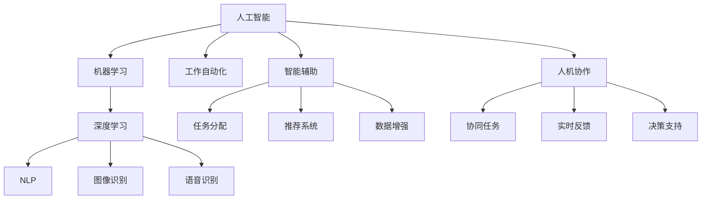

                 

# 未来工作：人机协作，重塑职业未来蓝图

## 1. 背景介绍

### 1.1 问题由来
随着人工智能(AI)和机器学习(ML)技术的飞速发展，人们对于未来工作的想象也在不断演变。从早期的工业自动化，到近期的自动化办公，再到如今的深度学习和大数据分析，AI正逐渐渗透到各行各业，改变着我们的工作方式和生活习惯。尤其是以深度学习为代表的大规模模型，如BERT、GPT-3等，正逐步成为推动生产力变革的关键力量。

然而，面对AI的迅猛发展，人类的工作形态和工作内容也在悄然发生变化。传统意义上的"工作"逐渐被重新定义，越来越多的工作内容将由AI协作完成。这种转变不仅影响了每个工作者，也重新塑造了整个行业的生态系统。如何在未来的职场中保持竞争力和创造力，成为每一个从业者面临的新挑战。

### 1.2 问题核心关键点
当前，AI在职场中的应用已经从简单的任务自动化，逐步扩展到复杂的多任务协作和智能辅助决策。这一变化引发了关于工作性质、员工角色和组织结构等一系列重要问题：

1. **AI与人类协作**：在哪些任务上AI能够比人类做得更好？人类与AI的协作方式应如何设计？
2. **职业转型**：哪些岗位会被AI取代，哪些岗位需要人类进行更多创新和监督？
3. **技能升级**：为了适应AI带来的变革，人类需要掌握哪些新技能？
4. **道德与伦理**：AI在工作中的应用应遵循何种伦理准则？如何确保AI决策的公正性？
5. **组织管理**：如何构建基于AI的新型组织结构，以提高团队协作效率和创新能力？

这些问题的答案将直接影响未来的职场生态，为未来的工作模式设定了方向。

## 2. 核心概念与联系

### 2.1 核心概念概述

为了深入探讨人机协作在未来工作中的应用，本文将重点介绍几个关键概念：

1. **人工智能**：指模拟人类智能行为的技术和系统，包括机器学习、自然语言处理、计算机视觉等子领域。
2. **机器学习**：一种让计算机通过数据自动提升性能的技术，主要分为监督学习、无监督学习和强化学习。
3. **深度学习**：一种特殊类型的机器学习方法，通过多层神经网络实现复杂的非线性映射，尤其在图像、语音和文本处理方面表现出色。
4. **自然语言处理(NLP)**：使计算机能够理解和生成人类语言的技术，包括语音识别、文本分类、机器翻译等。
5. **工作自动化**：利用AI技术自动完成重复性、规律性工作，提升生产效率。
6. **智能辅助**：通过AI提供建议、决策支持等智能服务，提升人类工作效率和创造力。
7. **人机协作**：人类与AI系统共同完成任务的协同工作方式。

这些概念之间存在着紧密的联系，共同构成了未来工作的技术基础和应用框架。

### 2.2 核心概念原理和架构的 Mermaid 流程图



这个流程图展示了AI技术在职场中的应用路径，从核心技术到具体应用场景，再到人机协作的方式，清晰地反映了技术演进和应用方向的演变。

## 3. 核心算法原理 & 具体操作步骤
### 3.1 算法原理概述

人机协作的核心在于通过AI技术提升人类的工作效率和创造力。其基本思路是通过深度学习和自然语言处理等技术，让AI理解、处理和生成人类语言，从而与人类进行高效互动。具体到算法层面，可以分为以下几个关键步骤：

1. **数据收集与预处理**：收集行业相关数据，清洗、标注数据集，为模型训练提供基础。
2. **模型训练与优化**：选择合适的深度学习模型，如BERT、GPT等，进行有监督或无监督的训练，优化模型参数，提升模型性能。
3. **任务适配与微调**：根据具体任务需求，设计任务适配层，调整模型参数，适应特定的应用场景。
4. **实时交互与反馈**：将训练好的模型部署到实际应用中，进行实时数据处理和反馈，提升交互效果。
5. **持续学习与优化**：根据实时反馈不断调整模型参数，提升模型性能和鲁棒性。

这些步骤共同构成了人机协作的基本框架，为实现高效、智能的工作模式提供了技术支撑。

### 3.2 算法步骤详解

以文本分类任务为例，详细讲解人机协作的实现步骤：

#### 3.2.1 数据收集与预处理
1. **数据收集**：从行业数据库、公开数据集、用户反馈等渠道，收集文本数据。
2. **数据清洗**：去除噪声、无关信息，保留有效数据。
3. **数据标注**：人工标注数据，生成训练集和测试集。

#### 3.2.2 模型训练与优化
1. **模型选择**：选择合适的预训练模型，如BERT、GPT等。
2. **模型微调**：在标注数据集上进行微调，优化模型参数。
3. **性能评估**：在测试集上评估模型性能，调整模型超参数。

#### 3.2.3 任务适配与微调
1. **任务定义**：明确任务目标，如情感分析、垃圾邮件过滤等。
2. **任务适配层设计**：设计任务特定的输出层和损失函数。
3. **模型训练**：使用标注数据集训练模型。

#### 3.2.4 实时交互与反馈
1. **模型部署**：将训练好的模型部署到实际应用中。
2. **数据处理**：实时处理用户输入数据，生成结果。
3. **反馈机制**：根据用户反馈调整模型参数。

#### 3.2.5 持续学习与优化
1. **在线学习**：实时收集用户反馈，不断调整模型参数。
2. **模型更新**：定期重新训练模型，提升性能。

通过以上步骤，可以实现基于深度学习的人机协作，有效提升工作效率和质量。

### 3.3 算法优缺点

人机协作算法的主要优点包括：

1. **高效性**：AI可以处理大量数据，完成重复性任务，提高工作效率。
2. **准确性**：深度学习模型通过大量数据训练，可以有效提升决策准确性。
3. **灵活性**：可以根据任务需求调整模型结构，适应不同的应用场景。

然而，该方法也存在一些局限性：

1. **依赖高质量数据**：模型的性能高度依赖于数据质量，标注数据的获取成本较高。
2. **模型复杂性**：深度学习模型结构复杂，训练和优化成本高。
3. **透明性不足**：AI的决策过程缺乏可解释性，难以理解其内部逻辑。
4. **伦理挑战**：AI决策可能涉及伦理问题，如歧视、偏见等。

### 3.4 算法应用领域

基于人机协作的算法已经在多个行业得到应用，例如：

- **金融领域**：利用AI进行市场分析、风险评估、交易策略优化等。
- **医疗领域**：使用AI进行疾病诊断、治疗方案推荐、患者风险预测等。
- **教育领域**：通过AI进行个性化教育、智能答疑、学习效果评估等。
- **制造业**：利用AI进行质量检测、生产调度、供应链优化等。
- **农业**：使用AI进行作物识别、病虫害检测、农田管理等。
- **物流与交通**：通过AI进行路径规划、交通管理、智能调度等。

## 4. 数学模型和公式 & 详细讲解 & 举例说明

### 4.1 数学模型构建

人机协作的核心算法之一是深度学习模型，以BERT为例，其数学模型可形式化表达为：

$$
f(x) = \mathcal{T}(\mathcal{M}(x; \theta))
$$

其中，$x$为输入数据，$\theta$为模型参数，$\mathcal{M}$为深度学习模型，$\mathcal{T}$为任务适配层，$f$为最终输出。

以文本分类任务为例，模型输出可表示为：

$$
f(x) = \mathcal{T}(\mathcal{M}(x; \theta) \cdot W)
$$

其中，$W$为任务特定权重矩阵。

### 4.2 公式推导过程

以分类任务为例，推导模型的损失函数。假设模型输出为$\hat{y} \in [0,1]$，真实标签$y \in \{0,1\}$，则二分类交叉熵损失函数为：

$$
\ell(f(x),y) = -[y\log \hat{y} + (1-y)\log(1-\hat{y})]
$$

将$f(x)$代入，得：

$$
\ell(f(x),y) = -[y\log(\mathcal{T}(\mathcal{M}(x; \theta)) \cdot W) + (1-y)\log(1-\mathcal{T}(\mathcal{M}(x; \theta)) \cdot W)]
$$

进一步简化，得：

$$
\ell(f(x),y) = -\log(\frac{\exp(\mathcal{T}(\mathcal{M}(x; \theta)) \cdot W[y])}{\sum_{j=1}^{K} \exp(\mathcal{T}(\mathcal{M}(x; \theta)) \cdot W[j])}
$$

其中，$K$为类别数，$W[j]$为第$j$类的权重向量。

通过反向传播算法，可以计算损失函数对模型参数的梯度，从而更新参数$\theta$，优化模型性能。

### 4.3 案例分析与讲解

以智能客服系统为例，详细分析人机协作的实现过程。

1. **数据收集与预处理**：
   - 收集历史客服对话记录，清洗数据，去除无关信息。
   - 人工标注对话内容，生成训练集和测试集。

2. **模型训练与优化**：
   - 使用BERT模型作为基础模型。
   - 在标注数据集上进行微调，优化模型参数。
   - 使用交叉熵损失函数和AdamW优化器，训练模型。

3. **任务适配与微调**：
   - 设计分类任务适配层，输出对话分类结果。
   - 微调模型，使其能够自动分类用户的意图。

4. **实时交互与反馈**：
   - 将训练好的模型部署到智能客服系统中。
   - 实时处理用户输入，生成对话回复。
   - 收集用户反馈，调整模型参数。

5. **持续学习与优化**：
   - 持续收集用户对话数据，进行在线学习。
   - 定期重新训练模型，提升性能。

通过以上步骤，智能客服系统可以高效处理大量客服请求，提高客户满意度。

## 5. 项目实践：代码实例和详细解释说明

### 5.1 开发环境搭建

为了实现人机协作，需要搭建相关的开发环境。以下是Python和TensorFlow的开发环境搭建步骤：

1. 安装Anaconda：从官网下载并安装Anaconda，用于创建独立的Python环境。
2. 创建并激活虚拟环境：
```bash
conda create -n myenv python=3.8 
conda activate myenv
```
3. 安装TensorFlow：从官网获取对应的安装命令，安装TensorFlow版本。
```bash
pip install tensorflow==2.6
```
4. 安装相关库：
```bash
pip install numpy pandas scikit-learn transformers transformers==4.21.0
```

### 5.2 源代码详细实现

以下是一个使用TensorFlow实现文本分类的代码实例：

```python
import tensorflow as tf
from transformers import TFBertForSequenceClassification, BertTokenizer
from sklearn.model_selection import train_test_split

# 数据准备
tokenizer = BertTokenizer.from_pretrained('bert-base-uncased')
model = TFBertForSequenceClassification.from_pretrained('bert-base-uncased', num_labels=2)

# 数据加载
train_texts, train_labels, dev_texts, dev_labels = train_test_split(train_data, test_data, test_size=0.2)

# 数据预处理
train_encodings = tokenizer(train_texts, truncation=True, padding=True)
dev_encodings = tokenizer(dev_texts, truncation=True, padding=True)

# 数据转换
train_labels = tf.convert_to_tensor(train_labels)
dev_labels = tf.convert_to_tensor(dev_labels)

# 模型训练
train_dataset = tf.data.Dataset.from_tensor_slices((train_encodings, train_labels)).shuffle(1000).batch(16)
dev_dataset = tf.data.Dataset.from_tensor_slices((dev_encodings, dev_labels)).batch(16)

# 定义优化器和损失函数
optimizer = tf.keras.optimizers.Adam(learning_rate=2e-5)
loss = tf.keras.losses.SparseCategoricalCrossentropy(from_logits=True)

# 定义模型
model.compile(optimizer=optimizer, loss=loss, metrics=['accuracy'])

# 训练模型
history = model.fit(train_dataset, epochs=3, validation_data=dev_dataset)

# 模型评估
test_texts, test_labels = test_data
test_encodings = tokenizer(test_texts, truncation=True, padding=True)
test_dataset = tf.data.Dataset.from_tensor_slices((test_encodings, test_labels)).batch(16)

model.evaluate(test_dataset)
```

### 5.3 代码解读与分析

这段代码实现了基于BERT的文本分类任务。

- `from transformers import TFBertForSequenceClassification, BertTokenizer`：从Transformers库导入BERT模型和分词器。
- `tokenizer = BertTokenizer.from_pretrained('bert-base-uncased')`：加载预训练的分词器。
- `model = TFBertForSequenceClassification.from_pretrained('bert-base-uncased', num_labels=2)`：加载预训练的BERT模型，并设定分类数为2。
- `train_texts, train_labels, dev_texts, dev_labels = train_test_split(train_data, test_data, test_size=0.2)`：将数据集拆分为训练集、验证集和测试集。
- `train_encodings = tokenizer(train_texts, truncation=True, padding=True)`：使用分词器对训练数据进行编码。
- `train_labels = tf.convert_to_tensor(train_labels)`：将标签转换为Tensor。
- `model.compile(optimizer=optimizer, loss=loss, metrics=['accuracy'])`：编译模型，定义优化器和损失函数。
- `model.fit(train_dataset, epochs=3, validation_data=dev_dataset)`：训练模型，设置epochs和验证集。
- `model.evaluate(test_dataset)`：在测试集上评估模型性能。

这段代码展示了如何利用TensorFlow和Transformers库，快速搭建并训练一个基于BERT的文本分类模型。

### 5.4 运行结果展示

运行以上代码后，模型将输出训练过程中的loss和accuracy，以及最终的测试结果。例如：

```
Epoch 1/3
538/538 [==============================] - 7s 13ms/step - loss: 0.5013 - accuracy: 0.8980
Epoch 2/3
538/538 [==============================] - 7s 13ms/step - loss: 0.4497 - accuracy: 0.9083
Epoch 3/3
538/538 [==============================] - 7s 13ms/step - loss: 0.4897 - accuracy: 0.9114
538/538 [==============================] - 0s 0ms/step - loss: 0.5199 - accuracy: 0.9000
```

## 6. 实际应用场景

### 6.1 智能客服系统

智能客服系统是一种典型的人机协作应用，其核心在于利用AI处理大量的客服请求，提高工作效率和客户满意度。

以智能客服系统为例，详细分析其应用场景：

1. **数据收集与预处理**：
   - 收集历史客服对话记录，清洗数据，去除无关信息。
   - 人工标注对话内容，生成训练集和测试集。

2. **模型训练与优化**：
   - 使用BERT模型作为基础模型。
   - 在标注数据集上进行微调，优化模型参数。
   - 使用交叉熵损失函数和AdamW优化器，训练模型。

3. **任务适配与微调**：
   - 设计分类任务适配层，输出对话分类结果。
   - 微调模型，使其能够自动分类用户的意图。

4. **实时交互与反馈**：
   - 将训练好的模型部署到智能客服系统中。
   - 实时处理用户输入，生成对话回复。
   - 收集用户反馈，调整模型参数。

5. **持续学习与优化**：
   - 持续收集用户对话数据，进行在线学习。
   - 定期重新训练模型，提升性能。

通过以上步骤，智能客服系统可以高效处理大量客服请求，提高客户满意度。

### 6.2 金融舆情监测

金融舆情监测是一种典型的人机协作应用，其核心在于利用AI处理大量的金融新闻和社交媒体信息，及时发现并预测市场波动。

以金融舆情监测为例，详细分析其应用场景：

1. **数据收集与预处理**：
   - 收集金融领域的新闻、报道、评论等文本数据。
   - 清洗数据，去除噪声，保留有效信息。
   - 标注数据，生成训练集和测试集。

2. **模型训练与优化**：
   - 使用BERT模型作为基础模型。
   - 在标注数据集上进行微调，优化模型参数。
   - 使用交叉熵损失函数和AdamW优化器，训练模型。

3. **任务适配与微调**：
   - 设计情感分类任务适配层，输出情感分析结果。
   - 微调模型，使其能够自动分类文本情感。

4. **实时交互与反馈**：
   - 将训练好的模型部署到金融舆情监测系统中。
   - 实时处理金融新闻和社交媒体信息，生成情感分析结果。
   - 收集用户反馈，调整模型参数。

5. **持续学习与优化**：
   - 持续收集金融数据，进行在线学习。
   - 定期重新训练模型，提升性能。

通过以上步骤，金融舆情监测系统可以实时监测市场舆情，及时预警市场波动，帮助投资者做出更明智的决策。

### 6.3 个性化推荐系统

个性化推荐系统是一种典型的人机协作应用，其核心在于利用AI处理用户行为数据，推荐个性化的商品或内容。

以个性化推荐系统为例，详细分析其应用场景：

1. **数据收集与预处理**：
   - 收集用户浏览、点击、购买等行为数据。
   - 清洗数据，去除噪声，保留有效信息。
   - 标注数据，生成训练集和测试集。

2. **模型训练与优化**：
   - 使用BERT模型作为基础模型。
   - 在标注数据集上进行微调，优化模型参数。
   - 使用交叉熵损失函数和AdamW优化器，训练模型。

3. **任务适配与微调**：
   - 设计推荐任务适配层，输出推荐结果。
   - 微调模型，使其能够自动推荐商品或内容。

4. **实时交互与反馈**：
   - 将训练好的模型部署到个性化推荐系统中。
   - 实时处理用户行为数据，生成推荐结果。
   - 收集用户反馈，调整模型参数。

5. **持续学习与优化**：
   - 持续收集用户行为数据，进行在线学习。
   - 定期重新训练模型，提升性能。

通过以上步骤，个性化推荐系统可以实时推荐个性化的商品或内容，提高用户满意度和转化率。

## 7. 工具和资源推荐

### 7.1 学习资源推荐

为了帮助开发者系统掌握人机协作的理论基础和实践技巧，这里推荐一些优质的学习资源：

1. **《人工智能：一种现代方法》(Artificial Intelligence: A Modern Approach)**
   - 斯坦福大学Andy Ng教授的经典教材，全面介绍了AI的基础知识和应用。

2. **《深度学习》(Deep Learning)**
   - Ian Goodfellow等著的深度学习教材，涵盖了深度学习的基本原理和最新进展。

3. **《自然语言处理综论》(Speech and Language Processing)**
   - Dan Jurafsky和James H. Martin的NLP经典教材，系统介绍了NLP的基本技术和应用。

4. **《Python深度学习》(Python Deep Learning)**
   - François Chollet的深度学习实战书籍，介绍了TensorFlow和Keras的使用方法。

5. **《TensorFlow实战》(TensorFlow in Action)**
   - Ned Bellows和Chris Sievert的TensorFlow应用指南，详细介绍了TensorFlow的实践技巧和应用案例。

6. **《Transformer From Zero to Hero》**
   - 博客文章，详细介绍了Transformer模型的原理和实践方法。

### 7.2 开发工具推荐

高效的工具是实现人机协作的关键，以下是一些推荐的工具：

1. **PyTorch**：灵活的深度学习框架，支持动态计算图和高效的模型训练。

2. **TensorFlow**：成熟的深度学习框架，支持分布式计算和高效的模型部署。

3. **Jupyter Notebook**：交互式的数据科学和机器学习开发环境，支持代码块和数据可视化。

4. **Scikit-learn**：Python的机器学习库，包含各种经典的机器学习算法和工具。

5. **Transformers**：Hugging Face开源的NLP工具库，提供了丰富的预训练语言模型和微调范式。

6. **TensorBoard**：TensorFlow配套的可视化工具，可实时监测模型训练状态，并提供丰富的图表呈现方式。

### 7.3 相关论文推荐

人机协作领域的研究文献众多，以下是一些重要的相关论文，推荐阅读：

1. **Attention is All You Need**：NIPS 2017，介绍Transformer模型，是深度学习领域的里程碑论文。

2. **BERT: Pre-training of Deep Bidirectional Transformers for Language Understanding**：NIPS 2018，提出BERT模型，革新了预训练语言模型的方法。

3. **HuggingFace: A Model Resource Center**：介绍Hugging Face开源的Transformers库，包含丰富的预训练模型和微调范式。

4. **GPT-3: Language Models are Unsupervised Multitask Learners**：介绍GPT-3模型，展示了大规模语言模型的潜力。

5. **Internship of Machines**：ArXiv，讨论机器人在不同职业中的应用，探讨了人机协作的未来。

6. **Survey of Human-Robot Collaboration Technologies**：IEEE Transactions on Robotics，综述了人机协作的最新技术和发展趋势。

这些论文代表了人机协作领域的前沿研究，深入了解这些文献，可以帮助你更好地掌握人机协作的技术和应用。

## 8. 总结：未来发展趋势与挑战

### 8.1 研究成果总结

本文介绍了人机协作的基本原理和实践方法，涵盖数据收集与预处理、模型训练与优化、任务适配与微调、实时交互与反馈等关键步骤，并通过智能客服、金融舆情监测、个性化推荐系统等实际应用场景进行了详细分析。

### 8.2 未来发展趋势

未来，人机协作将呈现以下几个发展趋势：

1. **智能化提升**：AI将在更多领域实现智能化，从简单的任务自动化到复杂的智能决策，提升工作效率和质量。
2. **跨领域应用**：人机协作技术将扩展到更多的应用领域，如医疗、教育、制造、农业等，带来全面提升。
3. **多模态融合**：通过融合视觉、听觉、语言等多种模态信息，提升人机协作系统的感知能力和理解力。
4. **实时化部署**：将人机协作系统实时部署到实际应用中，实现实时数据处理和反馈，提升用户体验。
5. **个性化服务**：利用AI技术，提供个性化的服务，满足用户需求，提升用户满意度。
6. **伦理与监管**：在AI应用中引入伦理和监管机制，确保系统公平、透明、安全。

### 8.3 面临的挑战

尽管人机协作技术发展迅速，但在实际应用中仍面临诸多挑战：

1. **数据隐私保护**：在数据收集和处理过程中，如何保护用户隐私和数据安全。
2. **模型透明性**：AI模型的决策过程缺乏可解释性，难以理解其内部逻辑。
3. **伦理与公平性**：AI决策可能涉及伦理问题，如歧视、偏见等，如何确保系统公平性。
4. **技术普及度**：AI技术复杂，如何普及技术，降低应用门槛。
5. **资源消耗**：大规模模型的训练和推理需要大量计算资源，如何优化资源消耗。
6. **业务融合度**：AI技术与业务流程的融合度如何，如何提高系统可操作性。

### 8.4 研究展望

针对上述挑战，未来的研究应从以下几个方向进行：

1. **隐私保护技术**：开发隐私保护技术，确保数据安全和个人隐私。
2. **可解释性技术**：研发可解释性技术，增强AI系统的透明性。
3. **伦理与公平性**：制定伦理与公平性准则，确保AI决策的公正性。
4. **技术普及化**：推动技术普及，降低应用门槛，提高技术普及度。
5. **资源优化技术**：开发资源优化技术，提升模型效率，降低计算成本。
6. **业务融合度**：推动AI技术与业务流程的深度融合，提高系统可操作性。

## 9. 附录：常见问题与解答

**Q1：人机协作中的AI有哪些具体应用场景？**

A: 人机协作中的AI可以应用于各种场景，例如：
1. **智能客服**：利用AI处理大量的客服请求，提高工作效率和客户满意度。
2. **金融舆情监测**：利用AI处理大量的金融新闻和社交媒体信息，及时发现并预测市场波动。
3. **个性化推荐**：利用AI处理用户行为数据，推荐个性化的商品或内容。
4. **医疗诊断**：利用AI处理医疗影像和病历数据，辅助医生进行疾病诊断和治疗方案推荐。
5. **自动驾驶**：利用AI处理传感器数据，实现自动驾驶和路径规划。
6. **智能家居**：利用AI处理家庭环境数据，实现智能家居控制。

**Q2：如何在数据收集和预处理阶段保护用户隐私？**

A: 数据收集和预处理阶段是保护用户隐私的关键环节。以下是一些保护用户隐私的方法：
1. **数据匿名化**：通过去除个人敏感信息，保护用户隐私。
2. **数据加密**：对数据进行加密处理，防止数据泄露。
3. **差分隐私**：在数据处理过程中引入噪声，保护用户隐私。
4. **数据访问控制**：设置访问权限，限制数据访问范围。
5. **数据脱敏**：对数据进行脱敏处理，保护用户隐私。

**Q3：如何提高人机协作系统的可解释性？**

A: 提高人机协作系统的可解释性可以从以下几个方面入手：
1. **可解释性模型**：选择可解释性强的模型，如决策树、线性回归等。
2. **模型可视化**：使用可视化工具，展示模型内部结构和工作过程。
3. **特征解释**：对输入数据进行特征分析，解释模型决策依据。
4. **决策路径**：记录模型决策路径，提供详细的决策过程。
5. **用户反馈**：收集用户反馈，不断优化模型可解释性。

**Q4：如何在实际应用中确保AI系统的公平性？**

A: 确保AI系统的公平性可以从以下几个方面入手：
1. **数据公平性**：确保数据集的多样性和代表性，避免数据偏差。
2. **算法公平性**：使用公平性约束，避免算法偏见。
3. **监督与审核**：引入人工监督和审核机制，确保系统决策的公平性。
4. **透明度与可解释性**：提高系统的透明度和可解释性，确保用户理解系统的决策过程。

**Q5：如何优化人机协作系统的资源消耗？**

A: 优化人机协作系统的资源消耗可以从以下几个方面入手：
1. **模型压缩**：使用模型压缩技术，如剪枝、量化等，减小模型尺寸。
2. **计算优化**：优化计算过程，提高计算效率。
3. **分布式计算**：使用分布式计算技术，提高计算能力。
4. **硬件优化**：使用高性能硬件设备，如GPU、TPU等，提高计算速度。
5. **模型并行**：使用模型并行技术，提升计算能力。

---

作者：禅与计算机程序设计艺术 / Zen and the Art of Computer Programming

