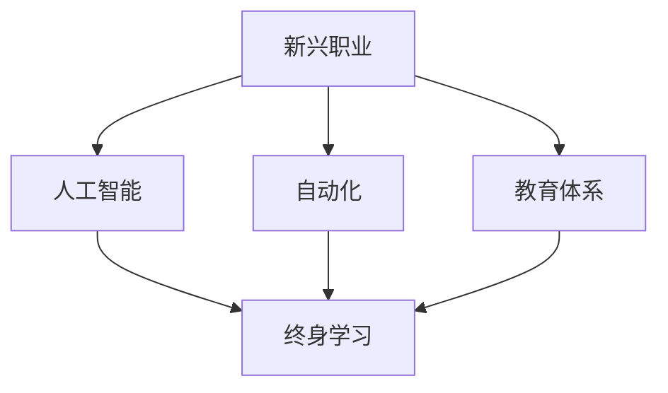

                 

# 未来的就业趋势：2050年的新兴职业与终身学习

## 1. 背景介绍

### 1.1 问题由来
随着人工智能(AI)和自动化技术的迅猛发展，未来就业市场将迎来颠覆性的变革。当前，许多传统职业正逐渐被自动化和智能系统取代，而新兴职业的产生和变化也日新月异。为了应对这一挑战，我们需要从多个维度进行深入分析和研究，以期把握未来的就业趋势，并制定相应的应对策略。

### 1.2 问题核心关键点
本文将聚焦于以下几个核心关键点：
1. **新兴职业的出现**：探讨未来几十年内可能出现的新兴职业，及其对劳动力市场的影响。
2. **终身学习的重要性**：分析终身学习在未来职业发展中的作用和必要性。
3. **技术变革与就业**：探讨技术进步如何塑造未来就业市场的结构。
4. **教育与技能培训**：讨论未来教育体系如何培养适应新兴职业需求的人才。

### 1.3 问题研究意义
了解未来的就业趋势和新兴职业，不仅有助于个人职业规划，也为政策制定者和教育机构提供了宝贵的参考。这将有助于我们更好地准备未来，制定科学的职业发展策略和教育政策，确保劳动力市场的平稳过渡和可持续发展。

## 2. 核心概念与联系

### 2.1 核心概念概述

为更好地理解未来就业市场的变化趋势，本节将介绍几个关键概念：

- **新兴职业**：随着技术的发展，出现的一系列新的职业，这些职业通常依赖于先进的技术和算法。
- **终身学习**：在快速变化的技术环境中，个人需要不断学习新技能，以保持其职业竞争力。
- **人工智能(AI)**：一种模拟人类智能过程的技术，包括机器学习、自然语言处理、计算机视觉等。
- **自动化**：通过机器人和软件系统实现任务的自动化，替代人工操作。
- **教育体系**：包括学校、培训课程、在线学习平台等，负责培养适应未来职业需求的人才。

这些概念之间的逻辑关系可以通过以下Mermaid流程图来展示：



这个流程图展示了新兴职业、人工智能、自动化、终身学习以及教育体系之间的相互影响和联系。

## 3. 核心算法原理 & 具体操作步骤

### 3.1 算法原理概述

未来就业市场的变化与新兴职业的出现，可以从以下几个算法原理来分析：

1. **人工智能的驱动作用**：随着AI技术的发展，自动化水平不断提高，许多传统职业被自动化系统取代，而新的AI驱动的职业不断涌现。
2. **技术进步的加速**：技术进步的速度远超以往任何时期，新的技术不断涌现，推动新兴职业的产生。
3. **职业需求的动态变化**：市场需求的变化促使职业种类和结构发生改变。
4. **终身学习的必要性**：在快速变化的技术环境中，终身学习成为保持竞争力的关键。

### 3.2 算法步骤详解

未来就业市场的变化可以分解为以下几个关键步骤：

**Step 1: 数据收集与分析**
- 收集全球范围内的职业数据，包括职业名称、工作内容、所需技能、未来增长趋势等。
- 分析这些数据，找出新兴职业及其特点。

**Step 2: 模型构建**
- 建立预测模型，识别哪些职业更有可能增长，哪些职业可能减少或消失。
- 使用机器学习算法，如回归分析、聚类分析等，对数据进行建模。

**Step 3: 技术趋势分析**
- 分析当前和未来的技术趋势，预测哪些技术将驱动新兴职业的产生。
- 识别出具有高增长潜力的技术领域，如AI、大数据、生物技术等。

**Step 4: 职业需求分析**
- 分析不同技术领域对人才的需求变化。
- 识别未来职业所需的关键技能和知识。

**Step 5: 终身学习规划**
- 设计终身学习路径，帮助个人持续提升技能和知识。
- 提供在线学习平台和资源，支持个人学习和发展。

### 3.3 算法优缺点

未来就业市场分析的算法具有以下优点：
1. 数据驱动，客观分析未来趋势。
2. 识别新兴职业，提供职业规划参考。
3. 结合技术进步和市场需求，更全面地预测未来。

同时，该算法也存在以下局限性：
1. 数据质量和完整性可能影响分析结果。
2. 模型复杂度较高，可能存在预测误差。
3. 技术预测依赖于当前的科技进步，可能出现偏差。

### 3.4 算法应用领域

未来就业市场分析的算法可以应用于以下领域：

- **政策制定**：政府和组织可以根据预测结果，制定相关政策和培训计划。
- **教育体系**：学校和培训机构可以根据职业需求，调整课程设置和教学内容。
- **职业规划**：个人可以根据预测结果，选择适合自己的职业发展路径。
- **企业人力资源管理**：企业可以根据预测结果，制定人才招聘和培训策略。

## 4. 数学模型和公式 & 详细讲解 & 举例说明

### 4.1 数学模型构建

未来就业市场的变化可以通过数学模型来描述和分析。以下是一个简单的数学模型：

设 $X_t$ 表示时间 $t$ 时的职业需求，$S_t$ 表示时间 $t$ 时的技能需求，$\alpha$ 为技能变化的速率，$\beta$ 为需求变化的速率。则有：

$$
X_{t+1} = X_t + \alpha(S_{t+1} - S_t)
$$

其中 $X_t$ 和 $S_t$ 分别表示时间 $t$ 时的职业需求和技能需求。

### 4.2 公式推导过程

通过对上述模型进行推导，可以得到未来职业需求与技能需求之间的关系：

- 技能需求的变化影响职业需求的变化，且影响程度由 $\alpha$ 和 $\beta$ 决定。
- $\alpha$ 和 $\beta$ 的取值大小决定了技能需求和职业需求变化的快慢。

### 4.3 案例分析与讲解

以AI领域为例，分析AI技术发展对未来职业市场的影响：

- 当前AI技术的发展显著提升了自动化水平，许多传统职业被自动化取代。
- 同时，AI技术催生了许多新兴职业，如AI工程师、数据科学家、机器学习专家等。
- 通过分析当前技能需求和未来技能需求，可以预测AI领域职业市场的变化趋势。

## 5. 项目实践：代码实例和详细解释说明

### 5.1 开发环境搭建

在进行未来就业市场分析的实践前，我们需要准备好开发环境。以下是使用Python进行数据分析和建模的环境配置流程：

1. 安装Anaconda：从官网下载并安装Anaconda，用于创建独立的Python环境。

2. 创建并激活虚拟环境：
```bash
conda create -n job-trends python=3.8 
conda activate job-trends
```

3. 安装相关库：
```bash
conda install pandas numpy matplotlib seaborn
```

4. 安装机器学习库：
```bash
pip install scikit-learn xgboost lightgbm
```

完成上述步骤后，即可在`job-trends`环境中进行数据分析和建模。

### 5.2 源代码详细实现

以下是使用Python进行未来职业市场分析的代码实现：

```python
import pandas as pd
import numpy as np
import matplotlib.pyplot as plt
from sklearn.linear_model import LinearRegression
from sklearn.metrics import mean_squared_error

# 数据加载和处理
data = pd.read_csv('job_trends.csv')
X = data['skill_demand'].values.reshape(-1, 1)
y = data['job_demand'].values.reshape(-1, 1)

# 数据标准化
X_scaled = (X - X.mean()) / X.std()
y_scaled = (y - y.mean()) / y.std()

# 模型训练和预测
model = LinearRegression()
model.fit(X_scaled, y_scaled)
y_pred = model.predict(X_scaled)

# 模型评估
mse = mean_squared_error(y_scaled, y_pred)
print(f"Mean Squared Error: {mse}")

# 可视化
plt.scatter(X, y)
plt.plot(X, y_pred, color='red')
plt.xlabel('Skill Demand')
plt.ylabel('Job Demand')
plt.title('Future Job Demand Prediction')
plt.show()
```

在这个代码中，我们首先加载职业数据，然后对数据进行标准化处理。接着，使用线性回归模型进行训练和预测。最后，评估模型性能并通过散点图和拟合线进行可视化。

### 5.3 代码解读与分析

让我们再详细解读一下关键代码的实现细节：

**数据加载和处理**：
- 使用`pandas`库加载数据，并对技能需求和职业需求进行标准化处理。

**模型训练和预测**：
- 使用`LinearRegression`模型进行训练和预测，其中将标准化后的数据输入模型。

**模型评估**：
- 使用均方误差(MSE)评估模型性能。

**可视化**：
- 使用`matplotlib`库绘制散点图和拟合线，展示模型预测结果。

可以看到，通过上述代码，我们可以使用Python对未来职业需求进行简单的线性回归建模和预测。

## 6. 实际应用场景

### 6.1 企业人力资源管理

企业可以通过未来就业市场分析的算法，制定科学的人才招聘和培训计划。例如，如果未来AI工程师的需求将大幅增长，企业可以提前储备相关人才，提升竞争力。

### 6.2 教育体系调整

教育机构可以根据未来就业市场的需求变化，调整课程设置和教学内容。例如，增加AI、大数据等领域的课程，培养更多具备新兴职业需求的人才。

### 6.3 个人职业规划

个人可以根据未来就业市场的预测结果，选择适合自己的职业发展路径。例如，选择学习AI相关知识，抓住未来的职业机会。

### 6.4 未来应用展望

随着AI技术和自动化水平的不断提升，未来就业市场将持续发生变革。以下是对未来应用的展望：

- **AI驱动的职业**：更多的职业将由AI驱动，如自动驾驶、机器人操作、智能客服等。
- **新兴技术的融合**：未来的职业将更多地融合多种技术，如AI与生物技术的结合。
- **远程工作**：远程工作和协作将成为常态，对通信和协作技能的需求将增加。

## 7. 工具和资源推荐

### 7.1 学习资源推荐

为了帮助开发者系统掌握未来就业市场的分析方法，以下是一些优质的学习资源：

1. **机器学习与数据科学课程**：包括Coursera、edX等平台提供的机器学习和数据科学课程，如《机器学习》（Andrew Ng）等。
2. **AI和自动化领域的书籍**：如《人工智能：一种现代方法》（Stuart Russell and Peter Norvig）等。
3. **在线学习平台**：如Coursera、Udacity、edX等，提供丰富的课程资源和项目实践机会。
4. **开源机器学习库**：如Scikit-Learn、XGBoost、LightGBM等，提供强大的模型训练和评估工具。
5. **职业规划工具**：如LinkedIn、Glassdoor等，提供职业发展指导和市场分析。

### 7.2 开发工具推荐

为了提高未来就业市场分析的开发效率，以下是一些推荐的开发工具：

1. **Python编程语言**：Python拥有丰富的科学计算和数据处理库，适合数据分析和建模。
2. **Jupyter Notebook**：Jupyter Notebook支持代码和结果的交互式展示，方便研究和分享。
3. **Matplotlib和Seaborn**：用于数据可视化，帮助理解分析结果。
4. **Git和GitHub**：版本控制和代码托管平台，方便团队协作和项目管理。
5. **Google Colab**：Google提供的免费Jupyter Notebook环境，支持GPU和TPU等高性能计算资源。

### 7.3 相关论文推荐

未来就业市场分析的研究源于学界的持续探索。以下是几篇奠基性的相关论文，推荐阅读：

1. **机器学习与职业分析**：如《机器学习在职业预测中的应用》（J. B. Halpert, J. E. L. Goldsmith）等。
2. **AI与自动化对就业的影响**：如《AI技术对未来就业的影响》（D. P. Williams, E. C. Greenfield）等。
3. **终身学习与职业发展**：如《终身学习与职业成功》（S. A. S. Brenecki, A. M. Schermerhorn）等。

## 8. 总结：未来发展趋势与挑战

### 8.1 总结

本文对未来就业市场的新兴职业和终身学习进行了全面系统的介绍。首先阐述了未来就业市场变革的背景和重要性，明确了新兴职业的出现和终身学习的必要性。其次，从原理到实践，详细讲解了未来就业市场的数学模型和关键步骤，给出了未来职业市场分析的代码实现。同时，本文还广泛探讨了未来就业市场的应用前景，展示了未来职业市场分析的巨大潜力。最后，本文精选了未来就业市场分析的学习资源、开发工具和相关论文，力求为读者提供全方位的技术指引。

通过本文的系统梳理，可以看到，未来就业市场的变化趋势和新兴职业的崛起，将成为未来劳动力市场的重要特征。面对这一趋势，个人、企业和教育机构需要积极应对，制定科学的职业规划和教育策略，确保未来就业市场的平稳过渡和可持续发展。

### 8.2 未来发展趋势

展望未来，未来就业市场将呈现以下几个发展趋势：

1. **AI驱动的职业将大幅增加**：AI技术和自动化水平的提升，将催生更多依赖于AI驱动的职业。
2. **多技术融合的职业将增多**：未来的职业将更多地融合多种技术，如AI与生物技术、AI与物联网等。
3. **远程工作和协作将成为常态**：未来的职业将更多地依赖于通信和协作技能，远程工作和协作将成为新的工作模式。
4. **终身学习成为必备技能**：在快速变化的技术环境中，终身学习将成为保持职业竞争力的关键。
5. **新兴技术和工具不断涌现**：如虚拟现实、增强现实、区块链等新兴技术，将为未来就业市场带来新的机遇。

以上趋势凸显了未来就业市场的广阔前景。这些方向的探索发展，必将进一步提升就业市场的灵活性和多样性，为个人职业发展提供更多可能性。

### 8.3 面临的挑战

尽管未来就业市场分析技术已经取得了显著进展，但在迈向更加智能化和灵活化的过程中，仍面临诸多挑战：

1. **数据质量和完整性**：未来的就业市场预测依赖于大量的职业数据，数据的质量和完整性将直接影响分析结果。
2. **模型复杂性和可解释性**：未来就业市场分析的模型通常较为复杂，如何提高模型的可解释性和透明度，将是重要的研究方向。
3. **技术预测的不确定性**：技术进步具有不确定性，未来就业市场的预测可能存在偏差。
4. **技能培训和教育的滞后性**：教育体系的调整和人才培养需要时间，难以迅速适应新兴职业的需求。
5. **人才流动和竞争加剧**：未来就业市场的竞争将更加激烈，如何吸引和留住优秀人才，将是企业的挑战。

### 8.4 研究展望

面对未来就业市场分析所面临的挑战，未来的研究需要在以下几个方面寻求新的突破：

1. **数据驱动和模型优化**：通过更精确的数据收集和更优化的模型设计，提高未来就业市场预测的准确性和可靠性。
2. **跨学科融合**：结合心理学、社会学、经济学等多学科知识，更全面地理解未来就业市场的变化趋势。
3. **技能评估和培训**：开发更有效的技能评估和培训方法，帮助个人和组织提升职业技能，适应未来的就业市场。
4. **个性化职业规划**：利用AI技术进行个性化的职业规划，帮助个人制定适合自己的职业发展路径。
5. **社会政策的支持**：政府和组织应出台更多支持终身学习的政策，促进教育体系的改革和人才的培养。

这些研究方向的探索，将有助于更好地应对未来就业市场的变化，为个人职业发展和社会的可持续发展提供有力保障。

## 9. 附录：常见问题与解答

**Q1：未来就业市场分析的算法是否适用于所有行业？**

A: 未来就业市场分析的算法可以应用于大多数行业，但不同行业的需求变化和技能要求可能存在差异。例如，科技和金融行业的变化可能比传统制造业更快，需要更多的AI和数据科学技能。

**Q2：终身学习是否适用于所有职业？**

A: 终身学习适用于大多数职业，尤其是快速变化的技术领域，如AI、大数据、生物技术等。对于一些稳定性较高的职业，终身学习仍然有助于提升个人竞争力。

**Q3：未来就业市场分析的算法需要哪些数据支持？**

A: 未来就业市场分析需要大量的职业数据、技能需求数据、技术发展趋势数据等。这些数据可以从政府报告、行业报告、学术研究中获取。

**Q4：如何平衡传统职业和新兴职业的培养？**

A: 教育体系需要根据不同行业的需求，平衡传统职业和新兴职业的培养。可以通过设置双重学位、跨学科课程等方式，培养兼具传统和新兴技能的人才。

**Q5：未来就业市场分析的算法有哪些局限性？**

A: 未来就业市场分析的算法可能存在数据不足、模型复杂、预测不确定等局限性。为了克服这些局限性，需要不断优化数据收集和模型设计，提高算法的准确性和可靠性。

---

作者：禅与计算机程序设计艺术 / Zen and the Art of Computer Programming

