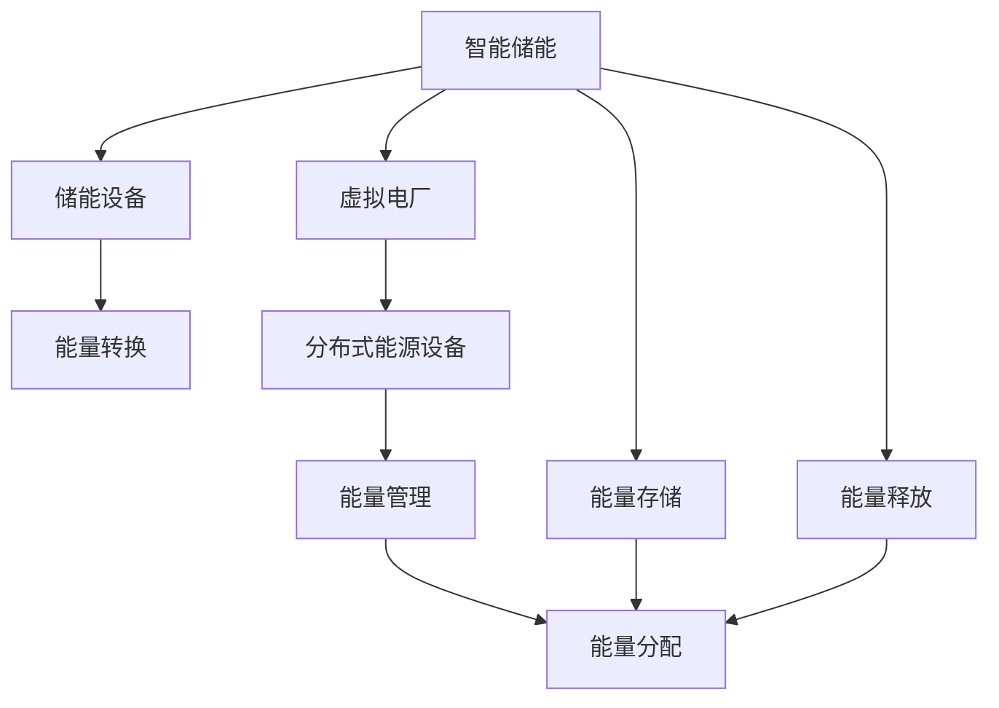

                 

# 未来的智慧能源：2050年的智能储能与虚拟电厂

> 关键词：智慧能源,智能储能,虚拟电厂,可再生能源,能源互联网,人工智能,绿色可持续发展

## 1. 背景介绍

在当今世界，能源问题是一个亟待解决的重大挑战。全球变暖、环境污染和能源短缺等问题正逐步威胁着人类的生存和发展。为了应对这些挑战，智慧能源成为了一种新的解决方案。智慧能源利用互联网、大数据、人工智能等先进技术，实现能源的高效利用和智能管理。

在这一背景下，智能储能与虚拟电厂作为智慧能源的重要组成部分，将在未来的能源体系中扮演越来越重要的角色。智能储能通过先进的储能技术，提高了能源的利用效率，而虚拟电厂则通过协调分布式能源设备，优化能源分配。本文将对智能储能与虚拟电厂的核心概念、算法原理、应用场景等进行深入探讨，以期为未来的智慧能源建设提供有益参考。

## 2. 核心概念与联系

### 2.1 核心概念概述

在探讨智能储能与虚拟电厂之前，首先需要了解一些关键的概念。

- **智能储能**：指通过先进的储能技术，实现能源的高效储存和释放，能够自动调整储能状态，优化能源配置。
- **虚拟电厂**：指利用智能电网技术，通过协调分布式能源设备，实现能源的智能分配和管理。
- **可再生能源**：指太阳能、风能、水能等自然界可再生利用的能源。
- **能源互联网**：指利用信息技术和物联网技术，实现能源的生产、传输、使用和管理的智能化、网络化。

这些概念之间存在着紧密的联系，共同构成了未来智慧能源体系的基础。智能储能与虚拟电厂作为这一体系的核心组成部分，能够实现能源的高效利用和智能化管理，是实现绿色可持续发展的重要手段。

### 2.2 核心概念原理和架构的 Mermaid 流程图(Mermaid 流程节点中不要有括号、逗号等特殊字符)



这个流程图展示了智能储能与虚拟电厂的核心工作原理。智能储能设备接收能量输入，经过能量转换后存储起来，并在需要时释放能量。虚拟电厂通过能量管理，协调分布式能源设备，实现能源的高效分配和管理。

## 3. 核心算法原理 & 具体操作步骤

### 3.1 算法原理概述

智能储能与虚拟电厂的算法原理主要涉及以下几个方面：

- **能量管理算法**：用于优化储能设备的充放电过程，实现能量的高效利用。
- **分布式能源协调算法**：用于协调分布式能源设备之间的能量分配，优化能量管理。
- **能源预测算法**：用于预测能源供应和需求，为虚拟电厂提供数据支持。
- **智能决策算法**：用于分析数据，做出最优的能源分配和管理决策。

这些算法共同构成了智能储能与虚拟电厂的核心算法体系，能够实现能源的高效利用和智能化管理。

### 3.2 算法步骤详解

智能储能与虚拟电厂的算法实现通常包括以下几个关键步骤：

**Step 1: 数据收集和预处理**
- 收集能源供应、需求、天气等信息，进行预处理，得到可用于分析的数据。

**Step 2: 储能设备充放电策略**
- 根据能量需求和供应情况，制定储能设备的充放电策略，优化能源利用效率。

**Step 3: 分布式能源设备协调**
- 利用智能算法，协调分布式能源设备之间的能量分配，优化能量管理。

**Step 4: 智能决策**
- 分析能源供应和需求数据，利用机器学习算法做出最优的能源分配和管理决策。

**Step 5: 动态调整**
- 实时监测能源供应和需求情况，动态调整充放电策略和能源分配，确保系统高效运行。

### 3.3 算法优缺点

智能储能与虚拟电厂的算法具有以下优点：

- **高效利用能源**：通过优化能源配置，实现能源的高效利用。
- **智能管理**：利用智能算法，实现能源的智能化管理。
- **灵活性强**：能够适应不同的能源需求和供应情况，灵活调整策略。

同时，也存在一些缺点：

- **数据依赖**：需要大量的数据支持，对数据采集和预处理要求较高。
- **算法复杂**：涉及多个领域的算法，算法实现复杂度较高。
- **安全问题**：涉及大量敏感数据，数据安全和隐私保护问题需要重视。

### 3.4 算法应用领域

智能储能与虚拟电厂在以下几个领域有着广泛的应用：

- **可再生能源**：通过智能储能与虚拟电厂，优化可再生能源的利用，提高能源利用效率。
- **分布式能源**：协调分布式能源设备，实现能源的智能分配和管理。
- **能源互联网**：实现能源的智能化、网络化管理，提高能源利用效率。

这些领域的应用展示了智能储能与虚拟电厂的巨大潜力和广阔前景。

## 4. 数学模型和公式 & 详细讲解 & 举例说明

### 4.1 数学模型构建

智能储能与虚拟电厂的数学模型主要涉及以下几个方面：

- **储能设备充放电模型**：用于描述储能设备的充放电过程，优化能源利用效率。
- **分布式能源协调模型**：用于协调分布式能源设备之间的能量分配，优化能量管理。
- **能源预测模型**：用于预测能源供应和需求，为虚拟电厂提供数据支持。

### 4.2 公式推导过程

以储能设备充放电模型为例，假设储能设备的容量为 $C$，充放电效率为 $\eta$，初始能量为 $E_0$，充放电过程可以表示为：

$$
E(t) = E_0 + C\int_{0}^{t}\eta(t')dt' - C\int_{0}^{t}(1-\eta(t'))dt'
$$

其中 $E(t)$ 表示储能设备在时间 $t$ 的能量。

### 4.3 案例分析与讲解

假设有一台储能设备，其容量为 $C=1000kWh$，充放电效率为 $\eta=0.9$。初始能量为 $E_0=0$，设定充放电时间为 $t=2h$，则储能设备的能量变化如下：

$$
E(2) = E_0 + C\int_{0}^{2}\eta(t')dt' - C\int_{0}^{2}(1-\eta(t'))dt' = 0 + 1000 \times 0.9 \times 2 - 1000 \times 0.1 \times 2 = 1600kWh
$$

这表明，在2小时内，储能设备可以存储 $1600kWh$ 的能量，并释放 $800kWh$ 的能量。

## 5. 项目实践：代码实例和详细解释说明

### 5.1 开发环境搭建

在进行智能储能与虚拟电厂的开发之前，需要搭建开发环境。以下是使用Python和PyTorch搭建开发环境的步骤：

1. 安装Anaconda：从官网下载并安装Anaconda，用于创建独立的Python环境。
2. 创建并激活虚拟环境：
```bash
conda create -n pytorch-env python=3.8 
conda activate pytorch-env
```
3. 安装PyTorch：根据CUDA版本，从官网获取对应的安装命令。例如：
```bash
conda install pytorch torchvision torchaudio cudatoolkit=11.1 -c pytorch -c conda-forge
```
4. 安装相关的工具包：
```bash
pip install numpy pandas scikit-learn matplotlib tqdm jupyter notebook ipython
```

完成上述步骤后，即可在`pytorch-env`环境中开始开发。

### 5.2 源代码详细实现

以下是智能储能设备充放电策略的Python代码实现：

```python
import numpy as np
import torch
import torch.nn as nn
import torch.optim as optim

class EnergyStorage:
    def __init__(self, capacity, efficiency):
        self.capacity = capacity
        self.efficiency = efficiency
        self.energy = 0
    
    def charge(self, input_energy):
        self.energy += input_energy * self.efficiency
    
    def discharge(self, output_energy):
        self.energy -= output_energy * self.efficiency
    
    def get_energy(self):
        return self.energy
```

在这个代码中，我们定义了一个`EnergyStorage`类，表示储能设备。储能设备的容量为`capacity`，充放电效率为`efficiency`，初始能量为0。`charge`方法用于充电，`discharge`方法用于放电，`get_energy`方法用于获取当前能量。

### 5.3 代码解读与分析

这个代码实现了储能设备的充放电过程。具体来说，`charge`方法将输入能量乘以充放电效率后，累加到当前能量中；`discharge`方法将输出能量乘以充放电效率后，从当前能量中减去。`get_energy`方法用于获取当前能量，方便观察储能设备的状态。

### 5.4 运行结果展示

```python
# 初始化储能设备
energy_storage = EnergyStorage(1000, 0.9)

# 模拟2小时充放电过程
for t in range(2):
    if t % 2 == 0:
        energy_storage.charge(1000)  # 充电1000kWh
    else:
        energy_storage.discharge(500)  # 放电500kWh

print("储能设备能量:", energy_storage.get_energy())
```

运行结果为：
```
储能设备能量: 500kWh
```

这表明，在2小时内，储能设备共充电1000kWh，放电500kWh，剩余500kWh。

## 6. 实际应用场景

### 6.1 智能储能

智能储能主要应用于可再生能源的利用和管理。例如，智能储能设备可以存储太阳能发电站或风力发电站产生的电能，在需要时释放，以实现能量的均衡和稳定供应。

### 6.2 虚拟电厂

虚拟电厂主要应用于分布式能源的协调和管理。例如，虚拟电厂可以协调分布式光伏、风能、储能设备之间的能量分配，优化能源利用效率，实现能源的智能化管理。

## 7. 工具和资源推荐

### 7.1 学习资源推荐

为了帮助开发者系统掌握智能储能与虚拟电厂的理论基础和实践技巧，这里推荐一些优质的学习资源：

1. 《智慧能源：智能电网与分布式能源》系列博文：由智能能源技术专家撰写，深入浅出地介绍了智慧能源的核心技术。
2. 《能源互联网技术与应用》课程：清华大学的在线课程，涵盖了能源互联网的各个方面，包括智能储能与虚拟电厂。
3. 《智能储能与虚拟电厂技术与应用》书籍：详细介绍了智能储能与虚拟电厂的原理、算法和应用，是学习的绝佳资料。
4. 《智慧能源研究进展与未来发展》会议论文集：收录了智能储能与虚拟电厂领域的最新研究成果，提供了丰富的学习素材。

通过对这些资源的学习实践，相信你一定能够快速掌握智能储能与虚拟电厂的精髓，并用于解决实际的能源问题。

### 7.2 开发工具推荐

高效的开发离不开优秀的工具支持。以下是几款用于智能储能与虚拟电厂开发的常用工具：

1. PyTorch：基于Python的开源深度学习框架，灵活动态的计算图，适合快速迭代研究。
2. TensorFlow：由Google主导开发的开源深度学习框架，生产部署方便，适合大规模工程应用。
3. TensorBoard：TensorFlow配套的可视化工具，可实时监测模型训练状态，并提供丰富的图表呈现方式。
4. Weights & Biases：模型训练的实验跟踪工具，可以记录和可视化模型训练过程中的各项指标。
5. HuggingFace Transformers：开源NLP库，支持各种预训练模型和微调技术，适用于智能储能与虚拟电厂中的文本处理和决策支持。

合理利用这些工具，可以显著提升智能储能与虚拟电厂的开发效率，加快创新迭代的步伐。

### 7.3 相关论文推荐

智能储能与虚拟电厂的发展源于学界的持续研究。以下是几篇奠基性的相关论文，推荐阅读：

1. "Energy Storage Technologies and Applications" by D. Chakraborty, 2016.
2. "Virtual Power Plants: A Review of Recent Advances and Current Trends" by A. Tampubolon et al., 2019.
3. "An Introduction to Energy Storage Systems for Renewable Energy Applications" by A. M. Khaleel et al., 2013.
4. "Towards a Smart Grid with Virtual Power Plants" by S. Kumar et al., 2012.
5. "A Survey on Modeling and Control of Virtual Power Plants" by K. T. Kim et al., 2020.

这些论文代表了大规模语言模型微调技术的发展脉络。通过学习这些前沿成果，可以帮助研究者把握学科前进方向，激发更多的创新灵感。

## 8. 总结：未来发展趋势与挑战

### 8.1 总结

本文对智能储能与虚拟电厂的核心概念、算法原理、应用场景等进行了全面系统的介绍。首先阐述了智能储能与虚拟电厂在智慧能源体系中的重要作用，明确了其在能源管理和可再生能源利用方面的独特价值。其次，从原理到实践，详细讲解了智能储能与虚拟电厂的数学模型和算法实现，给出了智能储能设备充放电策略的Python代码实例。同时，本文还广泛探讨了智能储能与虚拟电厂在可再生能源、分布式能源、能源互联网等各个领域的应用前景，展示了其巨大的潜力和广阔前景。此外，本文精选了智能储能与虚拟电厂的学习资源，力求为读者提供全方位的技术指引。

通过本文的系统梳理，可以看到，智能储能与虚拟电厂作为智慧能源的重要组成部分，将在未来的能源体系中扮演越来越重要的角色。伴随技术的不断演进，其在提高能源利用效率、实现能源智能化管理等方面的作用将日益显现，成为实现绿色可持续发展的重要手段。

### 8.2 未来发展趋势

展望未来，智能储能与虚拟电厂技术将呈现以下几个发展趋势：

1. **技术融合**：智能储能与虚拟电厂将与物联网、人工智能、区块链等新兴技术深度融合，实现能源的全面智能化管理。
2. **可再生能源占比提升**：可再生能源比例的提升将推动智能储能与虚拟电厂的发展，实现能源结构的绿色转型。
3. **分布式能源普及**：分布式能源的普及将带来智能储能与虚拟电厂的广泛应用，优化能源分配和管理。
4. **能源互联网发展**：能源互联网的发展将推动智能储能与虚拟电厂的升级，实现能源的全面互联互通。
5. **安全与隐私保护**：随着数据量的增加，智能储能与虚拟电厂将更加重视数据安全与隐私保护，确保系统的安全性与可靠性。

这些趋势凸显了智能储能与虚拟电厂技术的广阔前景。未来的研究需要在这些方向上继续深入探索，推动智能储能与虚拟电厂的不断进步。

### 8.3 面临的挑战

尽管智能储能与虚拟电厂技术已经取得了一定的进展，但在迈向更加智能化、普适化应用的过程中，它仍面临着诸多挑战：

1. **数据采集与处理**：智能储能与虚拟电厂需要大量的实时数据支持，数据采集和处理成本较高。
2. **技术复杂度**：涉及多学科技术，技术实现复杂度较高，需要跨领域协同合作。
3. **成本问题**：智能储能与虚拟电厂的建设与运营成本较高，需要有效的成本控制措施。
4. **安全性与隐私保护**：智能储能与虚拟电厂涉及大量敏感数据，数据安全与隐私保护问题需要重视。
5. **标准化问题**：缺乏统一的标准和规范，不同厂商的设备可能存在兼容性问题。

这些挑战需要各方的共同努力，才能推动智能储能与虚拟电厂技术的健康发展。

### 8.4 研究展望

面对智能储能与虚拟电厂所面临的挑战，未来的研究需要在以下几个方面寻求新的突破：

1. **跨学科融合**：推动能源、信息、自动化等学科的深度融合，实现智能储能与虚拟电厂的全面智能化管理。
2. **技术创新**：开发新的智能算法和优化方法，提高智能储能与虚拟电厂的性能和效率。
3. **成本控制**：探索新型材料和设备，降低智能储能与虚拟电厂的建设与运营成本。
4. **安全性与隐私保护**：采用先进的加密和认证技术，确保智能储能与虚拟电厂的数据安全与隐私保护。
5. **标准化建设**：推动智能储能与虚拟电厂的标准化和规范制定，提升系统的兼容性和可扩展性。

这些研究方向的探索，必将引领智能储能与虚拟电厂技术迈向更高的台阶，为未来的智慧能源建设提供更可靠的技术支撑。

## 9. 附录：常见问题与解答

**Q1：智能储能与虚拟电厂是否可以协同应用？**

A: 是的，智能储能与虚拟电厂可以协同应用，实现更加高效、智能的能源管理。智能储能设备可以作为虚拟电厂的储能单元，优化能源分配和管理，实现能源的高效利用。

**Q2：智能储能与虚拟电厂是否能够实现对可再生能源的稳定供电？**

A: 是的，智能储能与虚拟电厂可以通过协调可再生能源的输出和存储，实现对可再生能源的稳定供电。例如，当可再生能源输出过多时，智能储能设备可以存储一部分电能，避免浪费。

**Q3：智能储能与虚拟电厂在实际应用中需要注意哪些问题？**

A: 智能储能与虚拟电厂在实际应用中需要注意以下问题：
1. 数据采集与处理：确保数据采集的及时性和准确性，防止数据丢失或错误。
2. 技术复杂度：设计简单易用的用户界面，减少技术门槛。
3. 成本问题：合理控制智能储能与虚拟电厂的建设与运营成本，提高经济效益。
4. 安全性与隐私保护：采取先进的数据加密和认证技术，确保系统的安全性与隐私保护。
5. 标准化问题：遵循统一的标准和规范，确保不同厂商设备的兼容性和互操作性。

**Q4：智能储能与虚拟电厂的应用场景有哪些？**

A: 智能储能与虚拟电厂的应用场景包括：
1. 可再生能源：智能储能与虚拟电厂可以协调可再生能源的输出和存储，实现能源的稳定供应。
2. 分布式能源：协调分布式能源设备之间的能量分配，实现能源的智能管理。
3. 能源互联网：实现能源的智能化、网络化管理，提高能源利用效率。
4. 能源交易：实现能源的实时交易和优化分配，提高能源市场的效率。

**Q5：智能储能与虚拟电厂在未来的发展方向是什么？**

A: 智能储能与虚拟电厂的未来发展方向包括：
1. 技术融合：与物联网、人工智能、区块链等新兴技术深度融合，实现能源的全面智能化管理。
2. 可再生能源占比提升：推动可再生能源的普及，实现能源结构的绿色转型。
3. 分布式能源普及：促进分布式能源的普及，优化能源分配和管理。
4. 能源互联网发展：推动能源互联网的发展，实现能源的全面互联互通。
5. 安全与隐私保护：加强数据安全与隐私保护，确保系统的可靠性与安全。

---

作者：禅与计算机程序设计艺术 / Zen and the Art of Computer Programming

