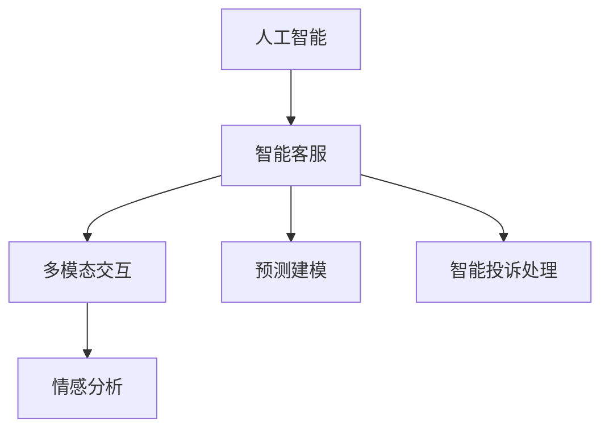

                 

# 未来的智能客服：2050年的智能客服机器人与智能投诉处理

> 关键词：人工智能, 智能客服, 机器学习, 自然语言处理, 情感分析, 多模态交互, 预测建模, 智能投诉处理, 未来技术趋势

## 1. 背景介绍

### 1.1 问题由来
在信息爆炸和数字化转型的背景下，传统客服方式面临效率低下、资源浪费和用户体验差等诸多问题。为此，企业纷纷引入人工智能（AI）技术，以期提升客服效率和客户满意度。尽管如此，现有的AI客服系统仍存在诸多局限，难以满足未来对智能客服更高的期待。

### 1.2 问题核心关键点
当前智能客服系统主要依赖于规则驱动或深度学习模型驱动。规则驱动系统难以应对复杂多变的用户需求，而基于深度学习的AI客服系统虽然在处理简单任务上表现良好，但面对复杂场景和情感理解仍显不足。因此，面向2050年智能客服的未来发展，需要构建一种全新的、能够自适应、智能且富有情感理解的AI客服系统。

### 1.3 问题研究意义
未来智能客服系统的构建，不仅能大幅提升客户服务质量，降低运营成本，还能为企业提供更为深入的用户洞察，辅助决策制定。此外，在智能客服领域进行深入研究，将有助于推动整个AI技术的发展，促进社会生产力的提升。

## 2. 核心概念与联系

### 2.1 核心概念概述

为更好地理解未来智能客服系统的构建，本节将介绍几个密切相关的核心概念：

- **人工智能（AI）**：通过机器学习和深度学习等技术实现模拟人类智能行为的计算机系统。
- **智能客服系统**：基于AI技术，能够自动处理客户查询、投诉、问题解答等的客服系统。
- **多模态交互**：结合文本、语音、图像等多种通信方式，构建更加自然、流畅的用户交互体验。
- **情感分析**：分析用户文本或语音中的情感倾向，识别用户的情绪变化。
- **预测建模**：通过机器学习算法，预测用户行为和需求，优化客服策略和流程。
- **智能投诉处理**：能够自动识别、分类和解决客户投诉，提升投诉处理效率和客户满意度。

这些核心概念之间的逻辑关系可以通过以下Mermaid流程图来展示：



这个流程图展示了几类核心概念之间的联系：人工智能是智能客服系统的基础；多模态交互和情感分析用于提升用户体验和系统响应；预测建模用于优化客服流程和策略；智能投诉处理用于提升投诉处理的自动化和精准度。

## 3. 核心算法原理 & 具体操作步骤
### 3.1 算法原理概述

面向2050年的智能客服系统，将依托于多模态交互、情感分析、预测建模和智能投诉处理等技术，构建一个自适应、智能且富有情感理解的AI客服平台。以下是这些技术的具体原理：

- **多模态交互**：通过文本、语音、图像等多种通信方式，实现更加自然、流畅的用户交互。通过NLP技术，将不同模态的数据进行统一处理和分析。
- **情感分析**：使用情感分类算法（如卷积神经网络、循环神经网络）对用户情感进行识别和分类。通过情感分析，系统可以更好地理解用户的情绪变化，提供更个性化的服务。
- **预测建模**：利用机器学习算法（如随机森林、深度学习）对用户行为进行预测，如预测用户流失、投诉转人工等。通过预测建模，系统可以提前采取措施，提升服务质量和客户满意度。
- **智能投诉处理**：结合NLP和机器学习技术，对客户投诉进行自动分类和解决。通过情感分析，判断投诉的紧急程度，自动派单并记录处理进展。

### 3.2 算法步骤详解

面向2050年的智能客服系统，构建过程可以分为以下几个关键步骤：

**Step 1: 数据收集与预处理**
- 收集客户历史数据，包括文本聊天记录、语音通话记录、图像信息等。
- 对数据进行清洗、去噪和标注，准备用于训练和测试模型的数据集。

**Step 2: 多模态数据融合**
- 使用NLP技术，将文本、语音、图像等多模态数据进行统一处理，提取特征。
- 使用多模态嵌入技术，将不同模态的特征进行融合，形成统一的表示。

**Step 3: 模型训练与优化**
- 利用多模态嵌入后的数据，训练情感分析模型和预测建模模型。
- 使用监督学习算法（如随机森林、支持向量机）进行模型训练，并进行交叉验证和参数调优。

**Step 4: 智能客服平台搭建**
- 搭建基于多模态交互的客服平台，实现自然语言处理和语音识别功能。
- 集成情感分析模块，实时监控用户情绪变化，优化服务策略。
- 集成预测建模模块，对用户行为进行预测，提前采取措施。

**Step 5: 智能投诉处理**
- 使用NLP技术，对客户投诉进行自动分类和解决。
- 结合情感分析，判断投诉的紧急程度，自动派单并记录处理进展。

### 3.3 算法优缺点

面向2050年的智能客服系统，具有以下优点：
1. 高度自适应。能够实时感知和理解用户需求，提供个性化服务。
2. 高效率。自动化处理大部分客服任务，大幅提升客户服务效率。
3. 高满意度。通过情感分析和预测建模，提升客户服务体验。
4. 高可靠性。多模态数据融合和模型优化，提升系统稳定性和鲁棒性。

同时，该系统也存在一定的局限性：
1. 依赖高质量数据。模型的训练和优化效果很大程度上依赖于数据的质量和多样性。
2. 技术门槛高。构建和维护一个智能客服系统，需要较强的技术储备和经验。
3. 隐私风险。处理多模态数据时，需要注意用户隐私保护，避免数据泄露。

尽管存在这些局限性，但就目前而言，面向2050年的智能客服系统依然是大势所趋，其带来的效率提升和服务质量改善，将为企业的运营带来巨大的变革性影响。

### 3.4 算法应用领域

面向2050年的智能客服系统，可以应用于以下多个领域：

- **金融行业**：处理客户咨询、投诉，提升客户服务效率。
- **零售行业**：自动处理客户查询、投诉，提升销售服务质量。
- **医疗行业**：处理患者咨询、投诉，提升医疗服务体验。
- **教育行业**：处理学生咨询、投诉，提升教学服务质量。
- **旅游行业**：处理客户咨询、投诉，提升旅游服务体验。

这些领域的应用将使企业能够更好地满足客户需求，提升客户满意度和忠诚度，同时也为企业带来显著的经济效益。

## 4. 数学模型和公式 & 详细讲解 & 举例说明
### 4.1 数学模型构建

本节将使用数学语言对智能客服系统的构建过程进行更加严格的刻画。

假设智能客服系统的输入数据为 $X$，包括文本、语音、图像等多种模态。其中文本数据 $x$ 可表示为 $x = \{x_i\}$，语音数据 $y$ 可表示为 $y = \{y_i\}$，图像数据 $z$ 可表示为 $z = \{z_i\}$。系统输出为 $Y$，包括情感分类结果和预测结果。

定义情感分类模型为 $f_{em}$，预测建模模型为 $f_{pre}$。则情感分类模型和预测建模模型的训练目标函数分别为：

$$
L_{em}(f_{em}) = \frac{1}{N} \sum_{i=1}^N \ell_{em}(f_{em}(x_i), y_i)
$$

$$
L_{pre}(f_{pre}) = \frac{1}{N} \sum_{i=1}^N \ell_{pre}(f_{pre}(x_i), z_i)
$$

其中 $\ell_{em}$ 和 $\ell_{pre}$ 分别为情感分类和预测建模的损失函数，$\ell_{em}$ 可以使用交叉熵损失函数，$\ell_{pre}$ 可以使用均方误差损失函数。

### 4.2 公式推导过程

以情感分类模型为例，其训练过程可以分为以下几个步骤：

1. 数据预处理：将文本数据 $x$ 转换为向量表示 $x^*$，将语音数据 $y$ 转换为MFCC（Mel频率倒谱系数）特征表示 $y^*$，将图像数据 $z$ 转换为特征表示 $z^*$。
2. 特征融合：使用多模态嵌入技术，将 $x^*$、$y^*$ 和 $z^*$ 进行融合，得到多模态嵌入表示 $x^{*em}$。
3. 模型训练：使用随机森林、卷积神经网络等算法，训练情感分类模型 $f_{em}$，得到模型参数 $\theta_{em}$。

情感分类模型的损失函数 $\ell_{em}$ 可表示为：

$$
\ell_{em}(f_{em}(x^*), y) = -\frac{1}{N}\sum_{i=1}^N [y_i\log f_{em}(x^*_i) + (1-y_i)\log(1-f_{em}(x^*_i))]
$$

其中 $f_{em}(x^*_i)$ 为情感分类模型在输入 $x^*_i$ 上的输出。

### 4.3 案例分析与讲解

以金融客服为例，假设系统需要处理用户投诉。用户通过语音或文本输入投诉内容，系统对投诉内容进行情感分析，判断其情绪倾向。然后，系统根据用户的历史行为数据和投诉内容，预测投诉的紧急程度和可能的解决方案。最后，系统自动派单给客服人员，并记录投诉处理的进展和客户反馈。

以下是一个简单的情感分类模型的代码实现：

```python
import torch
import torch.nn as nn
import torch.nn.functional as F

class EmotionClassifier(nn.Module):
    def __init__(self, input_dim, hidden_dim, num_classes):
        super(EmotionClassifier, self).__init__()
        self.embedding = nn.Embedding(input_dim, hidden_dim)
        self.fc1 = nn.Linear(hidden_dim, hidden_dim)
        self.fc2 = nn.Linear(hidden_dim, num_classes)
        
    def forward(self, x):
        x = self.embedding(x)
        x = F.relu(self.fc1(x))
        x = F.softmax(self.fc2(x), dim=1)
        return x

# 训练情感分类模型
def train_emotion_classifier(model, train_data, valid_data, epochs, batch_size):
    criterion = nn.CrossEntropyLoss()
    optimizer = torch.optim.Adam(model.parameters(), lr=0.001)
    
    for epoch in range(epochs):
        model.train()
        train_loss = 0
        for batch_idx, (inputs, targets) in enumerate(train_data):
            optimizer.zero_grad()
            outputs = model(inputs)
            loss = criterion(outputs, targets)
            loss.backward()
            optimizer.step()
            train_loss += loss.item()
        
        model.eval()
        valid_loss = 0
        with torch.no_grad():
            for batch_idx, (inputs, targets) in enumerate(valid_data):
                outputs = model(inputs)
                loss = criterion(outputs, targets)
                valid_loss += loss.item()
        
        print(f'Epoch {epoch+1}, train loss: {train_loss/len(train_data)}')
        print(f'Epoch {epoch+1}, valid loss: {valid_loss/len(valid_data)}')
        
    return model
```

## 5. 项目实践：代码实例和详细解释说明
### 5.1 开发环境搭建

在进行智能客服系统开发前，我们需要准备好开发环境。以下是使用Python进行PyTorch开发的环境配置流程：

1. 安装Anaconda：从官网下载并安装Anaconda，用于创建独立的Python环境。

2. 创建并激活虚拟环境：
```bash
conda create -n pytorch-env python=3.8 
conda activate pytorch-env
```

3. 安装PyTorch：根据CUDA版本，从官网获取对应的安装命令。例如：
```bash
conda install pytorch torchvision torchaudio cudatoolkit=11.1 -c pytorch -c conda-forge
```

4. 安装TensorFlow：
```bash
conda install tensorflow
```

5. 安装各类工具包：
```bash
pip install numpy pandas scikit-learn matplotlib tqdm jupyter notebook ipython
```

完成上述步骤后，即可在`pytorch-env`环境中开始智能客服系统的开发。

### 5.2 源代码详细实现

这里我们以情感分析模块为例，给出使用PyTorch实现情感分类模型的代码。

```python
import torch
import torch.nn as nn
import torch.nn.functional as F

class EmotionClassifier(nn.Module):
    def __init__(self, input_dim, hidden_dim, num_classes):
        super(EmotionClassifier, self).__init__()
        self.embedding = nn.Embedding(input_dim, hidden_dim)
        self.fc1 = nn.Linear(hidden_dim, hidden_dim)
        self.fc2 = nn.Linear(hidden_dim, num_classes)
        
    def forward(self, x):
        x = self.embedding(x)
        x = F.relu(self.fc1(x))
        x = F.softmax(self.fc2(x), dim=1)
        return x

# 训练情感分类模型
def train_emotion_classifier(model, train_data, valid_data, epochs, batch_size):
    criterion = nn.CrossEntropyLoss()
    optimizer = torch.optim.Adam(model.parameters(), lr=0.001)
    
    for epoch in range(epochs):
        model.train()
        train_loss = 0
        for batch_idx, (inputs, targets) in enumerate(train_data):
            optimizer.zero_grad()
            outputs = model(inputs)
            loss = criterion(outputs, targets)
            loss.backward()
            optimizer.step()
            train_loss += loss.item()
        
        model.eval()
        valid_loss = 0
        with torch.no_grad():
            for batch_idx, (inputs, targets) in enumerate(valid_data):
                outputs = model(inputs)
                loss = criterion(outputs, targets)
                valid_loss += loss.item()
        
        print(f'Epoch {epoch+1}, train loss: {train_loss/len(train_data)}')
        print(f'Epoch {epoch+1}, valid loss: {valid_loss/len(valid_data)}')
        
    return model
```

这段代码中，我们定义了一个简单的情感分类模型，使用了两个线性层和ReLU激活函数，输出层使用Softmax激活函数进行多分类预测。在训练过程中，我们使用交叉熵损失函数，并使用Adam优化器进行模型参数的更新。

### 5.3 代码解读与分析

让我们再详细解读一下关键代码的实现细节：

**EmotionClassifier类**：
- `__init__`方法：初始化模型参数，包括嵌入层、全连接层等。
- `forward`方法：实现模型的前向传播过程。

**train_emotion_classifier函数**：
- 定义损失函数和优化器。
- 使用循环迭代训练数据，更新模型参数，并计算训练损失和验证损失。

**训练流程**：
- 设置总的训练轮数和批处理大小，开始循环迭代。
- 每个epoch内，先在训练集上训练，输出平均训练损失。
- 在验证集上评估模型性能，输出平均验证损失。
- 所有epoch结束后，返回训练好的模型。

## 6. 实际应用场景
### 6.1 智能客服系统

面向2050年的智能客服系统，能够实现以下功能：

- **自然语言处理**：通过NLP技术，实现对客户查询、投诉的自动理解和回复。
- **语音识别与合成**：支持语音识别和合成，实现语音客服和语音导航。
- **图像识别**：处理客户上传的图像，自动分析和回答相关问题。
- **情感分析**：通过情感分类算法，实时监控用户情绪变化，提供个性化服务。
- **预测建模**：利用预测建模算法，对用户行为进行预测，优化客服策略。
- **智能投诉处理**：自动分类和解决客户投诉，提升投诉处理效率和客户满意度。

在技术实现上，可以结合机器学习、深度学习、自然语言处理等多种技术，构建多模态、自适应的智能客服系统。该系统不仅能处理简单的客户咨询和投诉，还能在复杂场景下提供高效的智能服务。

### 6.2 金融客服

金融客服系统是智能客服系统的重要应用领域之一。通过情感分析和预测建模，该系统可以自动处理客户咨询、投诉，提升客户服务质量。

具体而言，可以收集金融领域相关的新闻、评论、客户行为数据，将其作为训练数据，训练情感分类模型和预测建模模型。在客户咨询时，系统通过情感分类模型判断用户情绪，再利用预测建模模型预测用户行为，自动回复或转人工处理。对于投诉，系统自动分类并记录处理进展，提升投诉处理效率。

### 6.3 智能投诉处理

智能投诉处理是智能客服系统的重要组成部分。通过多模态交互和情感分析，系统能够自动识别、分类和解决客户投诉。

具体实现中，可以结合文本、语音、图像等多种通信方式，构建多模态交互系统。系统通过自然语言处理技术，自动分析投诉内容，判断其情绪倾向。结合情感分类算法，系统自动分类投诉，并根据投诉紧急程度，自动派单给客服人员。在投诉处理过程中，系统实时记录处理进展和客户反馈，提升投诉处理效率和客户满意度。

### 6.4 未来应用展望

面向2050年的智能客服系统，将进一步拓展应用领域，带来更多革命性影响。

1. **智能医疗客服**：处理患者咨询、投诉，提升医疗服务体验。
2. **智能教育客服**：处理学生咨询、投诉，提升教学服务质量。
3. **智能旅游客服**：处理客户咨询、投诉，提升旅游服务体验。

通过智能客服系统的构建和推广，企业将能够更好地满足客户需求，提升客户满意度和忠诚度，同时也为企业带来显著的经济效益。

## 7. 工具和资源推荐
### 7.1 学习资源推荐

为了帮助开发者系统掌握智能客服系统的技术基础和实践技巧，这里推荐一些优质的学习资源：

1. **《深度学习》课程**：斯坦福大学开设的深度学习课程，涵盖深度学习的基本概念和经典模型，适合初学者学习。
2. **《自然语言处理基础》课程**：北京大学的自然语言处理课程，涵盖NLP的基本概念和常用算法。
3. **TensorFlow官方文档**：TensorFlow的官方文档，提供了大量的示例和API接口，是学习TensorFlow的必备资源。
4. **HuggingFace官方文档**：Transformers库的官方文档，提供了丰富的预训练模型和微调样例代码，适合快速上手。
5. **PyTorch官方文档**：PyTorch的官方文档，提供了深度学习框架的基本概念和API接口，是学习深度学习的优秀资源。

通过这些资源的学习实践，相信你一定能够快速掌握智能客服系统的精髓，并用于解决实际的NLP问题。

### 7.2 开发工具推荐

高效的开发离不开优秀的工具支持。以下是几款用于智能客服系统开发的常用工具：

1. **Jupyter Notebook**：基于Web的交互式编程环境，适合快速迭代和展示代码。
2. **TensorBoard**：TensorFlow配套的可视化工具，可实时监测模型训练状态，提供丰富的图表呈现方式。
3. **Weights & Biases**：模型训练的实验跟踪工具，记录和可视化模型训练过程中的各项指标，方便对比和调优。
4. **TensorFlow Serving**：TensorFlow的推理服务，支持多种模型格式，方便模型部署和推理。
5. **KubeFlow**：基于Kubernetes的机器学习框架，支持多种深度学习框架和分布式训练，适合大规模模型训练和推理。

合理利用这些工具，可以显著提升智能客服系统的开发效率，加快创新迭代的步伐。

### 7.3 相关论文推荐

智能客服系统的构建涉及多个前沿技术，以下是几篇奠基性的相关论文，推荐阅读：

1. **Attention is All You Need**：提出了Transformer结构，开启了NLP领域的预训练大模型时代。
2. **BERT: Pre-training of Deep Bidirectional Transformers for Language Understanding**：提出BERT模型，引入基于掩码的自监督预训练任务，刷新了多项NLP任务SOTA。
3. **Few-shot Learning for Multilingual Zero-Shot Sentiment Analysis**：提出基于提示学习的零样本情感分析方法，实现了在少量标注数据下的高效预测。
4. **Multimodal Sequence-to-Sequence Learning for Accurate Sentiment Prediction**：提出多模态序列到序列学习算法，提升了情感分析的准确性和鲁棒性。
5. **Adaptive Low-Rank Adaptation for Parameter-Efficient Fine-Tuning**：提出AdaLoRA方法，实现参数高效微调，避免过拟合。

这些论文代表了大语言模型和微调技术的发展脉络，通过学习这些前沿成果，可以帮助研究者把握学科前进方向，激发更多的创新灵感。

## 8. 总结：未来发展趋势与挑战
### 8.1 研究成果总结

本文对面向2050年的智能客服系统进行了全面系统的介绍。首先阐述了智能客服系统在提升客户服务质量、降低运营成本等方面的重要性，明确了未来智能客服系统的核心技术需求。其次，从原理到实践，详细讲解了情感分析、预测建模、智能投诉处理等关键技术的数学原理和操作步骤，给出了智能客服系统开发的完整代码实例。同时，本文还探讨了智能客服系统在金融客服、智能投诉处理等领域的实际应用场景，展示了智能客服系统的广阔前景。

通过本文的系统梳理，可以看到，面向2050年的智能客服系统需要结合多模态交互、情感分析、预测建模等技术，构建自适应、智能且富有情感理解的AI客服平台。这些技术的融合和发展，必将在提升客服质量、降低成本、提升客户满意度等方面带来深远影响。

### 8.2 未来发展趋势

展望未来，智能客服系统将呈现以下几个发展趋势：

1. **多模态交互**：结合文本、语音、图像等多种通信方式，构建更加自然、流畅的用户交互体验。
2. **情感分析**：通过深度学习算法，实现对用户情感的精准识别和分类。
3. **预测建模**：利用机器学习算法，预测用户行为和需求，优化客服策略和流程。
4. **智能投诉处理**：自动分类和解决客户投诉，提升投诉处理效率和客户满意度。
5. **持续学习**：智能客服系统需要不断学习新知识，保持最新的服务能力和知识水平。

以上趋势凸显了智能客服系统的广阔前景。这些方向的探索发展，必将进一步提升客服系统的性能和服务质量，为人类社会带来更为便捷、高效的智能交互体验。

### 8.3 面临的挑战

尽管智能客服系统具有诸多优势，但在迈向更加智能化、普适化应用的过程中，仍面临诸多挑战：

1. **技术复杂度**：智能客服系统的构建需要结合多模态交互、情感分析、预测建模等多种技术，技术难度较大。
2. **数据质量**：智能客服系统的训练和优化效果很大程度上依赖于数据的质量和多样性，需要大量的高质量标注数据。
3. **隐私保护**：处理多模态数据时，需要注意用户隐私保护，避免数据泄露。
4. **模型可解释性**：智能客服系统的模型往往是"黑盒"系统，难以解释其内部工作机制和决策逻辑。
5. **鲁棒性和泛化性**：智能客服系统需要在不同场景下具备良好的鲁棒性和泛化性，避免在复杂环境下出现故障。

尽管存在这些挑战，但通过不断的研究和实践，这些问题终将得到解决。面向未来，智能客服系统将成为人工智能技术的重要应用领域，为各行各业带来革命性影响。

### 8.4 研究展望

未来，智能客服系统的研究需要从以下几个方面寻求新的突破：

1. **多模态融合技术**：结合多模态数据进行融合，提升系统的综合处理能力。
2. **情感智能**：开发更加精准的情感分类算法，提升系统的情感理解能力。
3. **预测建模算法**：研究更加高效的预测建模算法，提升系统的预测精度。
4. **持续学习机制**：开发自适应学习机制，使系统能够不断学习和适应用户需求。
5. **隐私保护技术**：开发隐私保护算法，保护用户数据安全。
6. **可解释性**：研究可解释性算法，提高系统的透明度和可信度。

这些研究方向将进一步提升智能客服系统的性能和服务质量，推动人工智能技术的进一步发展。

## 9. 附录：常见问题与解答

**Q1：智能客服系统如何处理情感分析？**

A: 智能客服系统处理情感分析时，可以使用深度学习算法（如卷积神经网络、循环神经网络）对用户情感进行识别和分类。在具体实现中，可以构建一个情感分类模型，将用户输入的文本或语音数据作为输入，输出情感分类结果。

**Q2：智能客服系统如何预测用户行为？**

A: 智能客服系统预测用户行为时，可以使用机器学习算法（如随机森林、深度学习）对用户历史行为数据进行建模。在具体实现中，可以构建一个预测建模模型，将用户输入的文本或语音数据作为输入，输出预测结果。

**Q3：智能客服系统如何处理多模态数据？**

A: 智能客服系统处理多模态数据时，可以使用NLP技术将文本数据转换为向量表示，使用特征提取技术将语音和图像数据转换为特征表示，再使用多模态嵌入技术将不同模态的特征进行融合，形成统一的表示。

**Q4：智能客服系统如何提升隐私保护？**

A: 智能客服系统提升隐私保护时，可以采用数据匿名化、差分隐私、加密存储等技术。在具体实现中，可以对用户数据进行去标识化处理，使用差分隐私算法保护用户隐私，使用加密技术存储用户数据，确保数据安全。

**Q5：智能客服系统如何提高可解释性？**

A: 智能客服系统提高可解释性时，可以采用模型可视化、解释模型、可解释性算法等技术。在具体实现中，可以使用模型可视化工具展示模型内部结构，解释模型算法，使用可解释性算法提高模型的透明度和可信度。

---

作者：禅与计算机程序设计艺术 / Zen and the Art of Computer Programming

