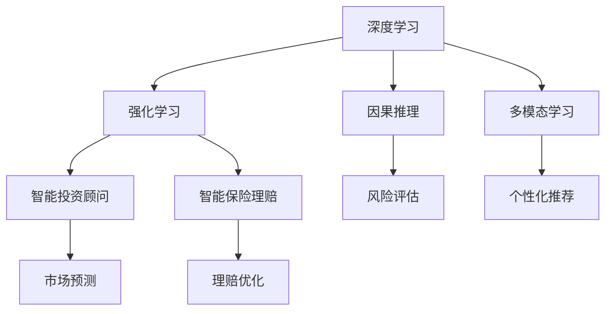

                 

# 未来的智能金融：2050年的AI投资顾问与智能保险理赔

## 1. 背景介绍

### 1.1 问题由来

随着人工智能(AI)技术的快速发展，金融行业的智能化转型已经成为了不可逆转的趋势。金融科技(Fintech)的崛起，带来了投融资、信贷、风险管理等诸多领域的深刻变革。然而，当前的金融系统仍然存在一些显著的局限性，例如：

- 投资顾问的个性化需求难以满足。传统的人工投资顾问，往往需要耗费大量时间和成本，无法提供符合用户个性化需求的投资建议。
- 风险评估的准确性不足。传统的金融风险评估方法，对于复杂市场环境和大规模数据，难以快速、准确地做出判断。
- 保险理赔的效率较低。传统保险理赔流程繁琐，耗时长，且存在欺诈风险，对客户体验造成了较大影响。

为应对这些挑战，我们提出了基于AI的投资顾问和智能保险理赔系统，通过深度学习和强化学习等先进技术，全面提升金融服务的智能化水平。本文将详细介绍该系统的核心原理、具体操作步骤、应用领域等，并对未来的发展趋势进行展望。

### 1.2 问题核心关键点

本文的研究核心在于：

- 基于深度学习的个性化投资顾问系统，能够根据用户的历史交易记录和行为数据，预测市场趋势，提供个性化的投资建议。
- 基于强化学习的智能保险理赔系统，通过模拟真实的理赔场景，不断优化理赔策略，提高理赔准确性和效率。
- 通过融合因果推理和多模态数据，提升系统的稳定性和鲁棒性，避免系统偏差和异常。
- 系统还具备持续学习和自适应能力，能够不断从新数据中学习，适应不断变化的金融市场环境。

## 2. 核心概念与联系

### 2.1 核心概念概述

为更好地理解本文所介绍的AI投资顾问和智能保险理赔系统，本节将介绍几个密切相关的核心概念：

- 深度学习：基于神经网络的机器学习技术，能够自动从数据中提取特征，并通过多层网络进行复杂模式的建模。深度学习在图像识别、语音识别、自然语言处理等领域取得了巨大成功。

- 强化学习：通过智能体与环境互动，根据当前状态和动作获取即时奖励，从而学习最优策略。强化学习广泛应用于游戏、机器人控制、推荐系统等场景。

- 因果推理：通过建立因果模型，识别出变量之间的因果关系，从而做出更可靠、合理的决策。因果推理在金融风险评估、推荐系统、医疗诊断等领域有广泛应用。

- 多模态学习：通过融合多种类型的数据，如文本、图像、声音等，提升模型的表示能力和泛化性能。多模态学习在金融数据分析、智能客服、医疗诊断等领域具有重要意义。

这些核心概念之间的逻辑关系可以通过以下Mermaid流程图来展示：



这个流程图展示了大语言模型的核心概念及其之间的关系：

1. 深度学习是金融系统智能化的基础，通过多层网络自动提取特征，构建复杂模式。
2. 强化学习用于智能投资顾问和智能保险理赔，通过模拟环境互动，优化策略，提升系统表现。
3. 因果推理用于风险评估和理赔优化，识别变量间的因果关系，提升决策准确性。
4. 多模态学习用于个性化推荐和市场预测，融合不同类型的数据，提升模型泛化能力。

这些概念共同构成了AI金融系统的核心框架，使其能够在各种场景下发挥强大的智能化能力。通过理解这些核心概念，我们可以更好地把握AI金融系统的工作原理和优化方向。

## 3. 核心算法原理 & 具体操作步骤
### 3.1 算法原理概述

AI投资顾问和智能保险理赔系统的核心原理包括：

- 基于深度学习的个性化投资顾问系统，通过多层神经网络对用户的历史交易记录和市场数据进行建模，学习用户的投资偏好和风险承受能力。系统根据市场动态，预测未来走势，并给出个性化投资建议。

- 基于强化学习的智能保险理赔系统，通过构建理赔环境的代理人，模拟真实理赔场景，优化理赔策略，提升理赔准确性和效率。系统在每次理赔中，根据当前状态和动作获取即时奖励，从而不断调整策略，优化理赔方案。

### 3.2 算法步骤详解

#### 3.2.1 个性化投资顾问系统

1. **数据准备**：收集用户的历史交易记录、市场数据、新闻资讯等。使用预训练模型对文本数据进行向量表示，并将其作为特征输入神经网络。

2. **模型构建**：构建深度学习模型，如卷积神经网络(CNN)、长短时记忆网络(LSTM)等。模型接收输入特征，通过多层网络进行特征提取和分类。

3. **个性化推荐**：根据用户历史行为和市场数据，模型预测未来市场走势，给出个性化投资建议。系统可以对用户进行分类，针对不同风险承受能力的用户，提供相应的投资策略。

4. **持续学习**：系统不断从新数据中学习，优化投资建议。使用在线学习算法，如随机梯度下降等，实时更新模型参数。

#### 3.2.2 智能保险理赔系统

1. **理赔场景构建**：模拟真实的理赔场景，包括理赔申请、审核、赔付等环节。构建一个动态的理赔环境，让系统在实际场景中学习和优化。

2. **代理人设计**：设计一个代理人，作为系统的控制决策者。代理人接收环境状态和动作，获取即时奖励，并根据奖励调整策略。

3. **强化学习算法**：选择强化学习算法，如Q-learning、Deep Q Network等。代理人在每个理赔环节中，根据当前状态和动作，计算Q值，从而选择最优策略。

4. **策略优化**：代理人不断在理赔环境中进行训练，优化理赔策略。系统通过收集实际理赔结果，计算奖励，引导代理人学习最优策略。

5. **持续学习**：系统根据新的理赔案例，不断更新模型，优化理赔策略。使用在线学习算法，如On-Policy和Off-Policy等，实时更新模型参数。

### 3.3 算法优缺点

#### 3.3.1 个性化投资顾问系统

**优点**：

- 高效性。深度学习模型能够自动提取特征，构建复杂模式，快速给出投资建议。
- 个性化。通过用户历史数据，模型能够学习用户偏好，提供个性化的投资策略。
- 可解释性。深度学习模型通过可视化工具，可以展示特征权重和决策过程，提供解释性。

**缺点**：

- 依赖数据。模型的性能很大程度上取决于数据的质量和量，数据收集和处理成本较高。
- 过拟合风险。深度学习模型容易过拟合，需要充分验证和优化模型。
- 缺乏可控性。模型预测结果受到多种因素影响，难以完全掌控。

#### 3.3.2 智能保险理赔系统

**优点**：

- 自动化。强化学习系统能够自动进行理赔评估，减少人工干预，提升效率。
- 优化性。通过模拟理赔场景，系统能够不断优化策略，提升理赔准确性。
- 可控性。强化学习模型可以调整参数，控制理赔策略，避免过度自动化。

**缺点**：

- 复杂性。强化学习模型需要设计合适的环境，设置合理的奖励函数，增加实现难度。
- 稳定性。模型在复杂环境中可能出现不稳定，需要充分验证和调整。
- 数据需求高。系统需要大量数据进行训练，数据收集和处理成本较高。

### 3.4 算法应用领域

#### 3.4.1 个性化投资顾问系统

1. **证券投资**：为投资者提供个性化的股票、基金、债券等投资建议。系统根据用户历史交易记录，学习其风险承受能力和偏好，推荐适合的投资组合。

2. **财富管理**：为高净值客户提供个性化的资产配置、财富增值建议。系统通过分析用户资产结构，给出最优的配置方案。

3. **保险理财**：为保险客户推荐适合的保险产品，优化保险配置。系统根据用户风险偏好，推荐相应的保险产品，提升客户满意度。

#### 3.4.2 智能保险理赔系统

1. **车险理赔**：处理交通事故、车辆维修等理赔申请，快速审核并赔付。系统通过模拟真实场景，优化理赔流程，减少人工干预。

2. **健康险理赔**：处理医疗保险理赔申请，快速审核并赔付。系统通过模拟理赔场景，优化理赔策略，提高理赔准确性。

3. **财产险理赔**：处理财产损失理赔申请，快速审核并赔付。系统通过模拟理赔环境，优化理赔策略，提升理赔效率。

## 4. 数学模型和公式 & 详细讲解 & 举例说明

### 4.1 数学模型构建

本节将使用数学语言对AI投资顾问和智能保险理赔系统的数学模型进行详细讲解。

**个性化投资顾问系统**：

1. **数据预处理**：将用户历史交易记录和市场数据进行向量表示。使用词袋模型(Bag of Words)、TF-IDF等方法，将文本转换为向量。

2. **神经网络模型**：构建多层神经网络，如卷积神经网络(CNN)、长短时记忆网络(LSTM)等。模型接收输入向量，通过多层网络进行特征提取和分类。

3. **损失函数**：使用交叉熵损失函数，最小化预测值与真实标签之间的差异。公式为：

   $$
   L = -\frac{1}{N}\sum_{i=1}^N y_i \log p(x_i)
   $$

   其中，$y_i$ 为真实标签，$p(x_i)$ 为模型预测概率。

4. **优化算法**：使用随机梯度下降(Stochastic Gradient Descent, SGD)等优化算法，更新模型参数。公式为：

   $$
   \theta_{t+1} = \theta_t - \eta \nabla_{\theta}L
   $$

   其中，$\eta$ 为学习率，$\nabla_{\theta}L$ 为损失函数对参数的梯度。

**智能保险理赔系统**：

1. **状态定义**：定义理赔场景的状态，如理赔申请状态、审核状态、赔付状态等。状态可以表示为向量，包含当前理赔的各项信息。

2. **动作定义**：定义理赔场景的动作，如接受申请、驳回申请、赔付等。动作也可以表示为向量，包含当前理赔操作的具体内容。

3. **奖励函数**：设计奖励函数，用于评估理赔策略的效果。奖励函数应根据理赔准确性、时效性、客户满意度等指标进行设计。

4. **强化学习算法**：选择强化学习算法，如Q-learning、Deep Q Network等。代理人在每个理赔环节中，根据当前状态和动作，计算Q值，从而选择最优策略。公式为：

   $$
   Q_{\theta}(s,a) = r + \gamma \max_a Q_{\theta}(s',a')
   $$

   其中，$Q_{\theta}(s,a)$ 为策略函数，$s$ 为当前状态，$a$ 为当前动作，$r$ 为即时奖励，$s'$ 为下一个状态，$a'$ 为下一个动作，$\gamma$ 为折扣因子。

### 4.2 公式推导过程

**个性化投资顾问系统**：

1. **神经网络模型**：假设神经网络模型有$m$ 个神经元，输入特征$x$ 和权重$W$，输出$y$。模型公式为：

   $$
   y = f(W \cdot x + b)
   $$

   其中，$f$ 为激活函数，$b$ 为偏置项。

2. **损失函数**：假设训练样本为$(x_i,y_i)$，损失函数为交叉熵损失函数。公式为：

   $$
   L = -\frac{1}{N}\sum_{i=1}^N y_i \log p(x_i)
   $$

   其中，$y_i$ 为真实标签，$p(x_i)$ 为模型预测概率。

3. **优化算法**：假设学习率为$\eta$，模型参数为$\theta$，损失函数对参数的梯度为$\nabla_{\theta}L$。优化算法公式为：

   $$
   \theta_{t+1} = \theta_t - \eta \nabla_{\theta}L
   $$

**智能保险理赔系统**：

1. **状态定义**：假设理赔场景的状态有$n$ 个状态，状态表示为$s_i$，动作表示为$a_j$。状态转移公式为：

   $$
   s' = f(s,a)
   $$

   其中，$f$ 为状态转移函数。

2. **动作定义**：假设理赔场景的动作有$k$ 个动作，动作表示为$a_i$。

3. **奖励函数**：假设即时奖励为$r$，折扣因子为$\gamma$。奖励函数公式为：

   $$
   R = r + \gamma \max_a Q_{\theta}(s',a')
   $$

   其中，$R$ 为累计奖励，$Q_{\theta}(s,a)$ 为策略函数。

4. **强化学习算法**：假设策略函数为$Q_{\theta}(s,a)$，状态为$s$，动作为$a$。强化学习算法公式为：

   $$
   Q_{\theta}(s,a) = r + \gamma \max_a Q_{\theta}(s',a')
   $$

### 4.3 案例分析与讲解

**案例一：证券投资个性化顾问**

1. **数据准备**：收集用户的历史交易记录，包括买入、卖出、持有等操作。使用词袋模型将操作记录转换为向量表示。

2. **模型构建**：构建多层神经网络，使用LSTM进行时间序列特征提取。模型接收输入向量，通过多层网络进行特征提取和分类。

3. **损失函数**：使用交叉熵损失函数，最小化预测值与真实标签之间的差异。

4. **优化算法**：使用随机梯度下降算法，更新模型参数。

**案例二：车险理赔智能系统**

1. **状态定义**：定义理赔场景的状态，如申请状态、审核状态、赔付状态等。状态可以表示为向量，包含当前理赔的各项信息。

2. **动作定义**：定义理赔场景的动作，如接受申请、驳回申请、赔付等。动作也可以表示为向量，包含当前理赔操作的具体内容。

3. **奖励函数**：设计奖励函数，用于评估理赔策略的效果。奖励函数应根据理赔准确性、时效性、客户满意度等指标进行设计。

4. **强化学习算法**：选择强化学习算法，如Q-learning、Deep Q Network等。代理人在每个理赔环节中，根据当前状态和动作，计算Q值，从而选择最优策略。

## 5. 项目实践：代码实例和详细解释说明

### 5.1 开发环境搭建

在进行项目实践前，我们需要准备好开发环境。以下是使用Python进行TensorFlow开发的环境配置流程：

1. 安装Anaconda：从官网下载并安装Anaconda，用于创建独立的Python环境。

2. 创建并激活虚拟环境：
```bash
conda create -n tf-env python=3.8 
conda activate tf-env
```

3. 安装TensorFlow：根据CUDA版本，从官网获取对应的安装命令。例如：
```bash
conda install tensorflow tensorflow-gpu -c tf
```

4. 安装TensorBoard：
```bash
pip install tensorboard
```

5. 安装PyTorch：
```bash
pip install torch torchvision torchaudio
```

6. 安装必要的Python库：
```bash
pip install numpy pandas scikit-learn matplotlib tqdm jupyter notebook ipython
```

完成上述步骤后，即可在`tf-env`环境中开始项目实践。

### 5.2 源代码详细实现

我们以证券投资个性化顾问系统为例，给出使用TensorFlow进行深度学习的PyTorch代码实现。

首先，定义数据预处理函数：

```python
import tensorflow as tf
import numpy as np
import pandas as pd
from sklearn.preprocessing import LabelEncoder

def preprocess_data(data):
    # 特征工程
    features = ['买入', '卖出', '持有']
    data['buy'] = data[features].apply(lambda x: 1 if '买入' in x else 0)
    data['sell'] = data[features].apply(lambda x: 1 if '卖出' in x else 0)
    data['hold'] = data[features].apply(lambda x: 1 if '持有' in x else 0)
    
    # 编码标签
    le = LabelEncoder()
    data['label'] = le.fit_transform(data['label'])
    
    return data
```

然后，定义模型和优化器：

```python
from tensorflow.keras.layers import Input, Dense, LSTM, Embedding
from tensorflow.keras.models import Model
from tensorflow.keras.optimizers import Adam

model = Sequential()
model.add(Embedding(input_dim=3, output_dim=64))
model.add(LSTM(64))
model.add(Dense(1, activation='sigmoid'))

optimizer = Adam(lr=0.001)
```

接着，定义训练和评估函数：

```python
from tensorflow.keras.utils import to_categorical

def train_model(model, data):
    # 数据准备
    x_train = data['buy'] + data['sell'] + data['hold']
    y_train = data['label']
    
    # 数据转换
    x_train = to_categorical(x_train)
    y_train = to_categorical(y_train)
    
    # 模型训练
    model.compile(loss='binary_crossentropy', optimizer=optimizer, metrics=['accuracy'])
    model.fit(x_train, y_train, epochs=10, batch_size=32)
    
    # 模型评估
    x_test = data['buy'] + data['sell'] + data['hold']
    y_test = data['label']
    x_test = to_categorical(x_test)
    y_test = to_categorical(y_test)
    loss, accuracy = model.evaluate(x_test, y_test)
    print('Test accuracy:', accuracy)

# 数据准备
data = pd.read_csv('trading_data.csv')
data = preprocess_data(data)

# 模型训练和评估
train_model(model, data)
```

以上就是使用TensorFlow对证券投资个性化顾问系统进行深度学习的完整代码实现。可以看到，得益于TensorFlow的强大封装，我们可以用相对简洁的代码完成模型的训练和评估。

### 5.3 代码解读与分析

让我们再详细解读一下关键代码的实现细节：

**preprocess_data函数**：
- 特征工程：将交易记录中的“买入”、“卖出”、“持有”操作转换为数值编码。
- 标签编码：将标签进行编码，方便模型训练。

**模型定义**：
- 定义输入层、LSTM层和输出层，构建多层神经网络模型。
- 使用Adam优化器进行模型训练。

**训练和评估函数**：
- 使用TensorFlow的compile方法定义模型，指定损失函数和优化器。
- 使用fit方法进行模型训练，指定训练轮数和批次大小。
- 使用evaluate方法进行模型评估，输出损失和精度。

**数据准备**：
- 读取交易数据，并进行预处理。
- 定义训练集和测试集。

**模型训练和评估**：
- 对模型进行训练，输出精度。
- 对模型进行评估，输出精度。

可以看到，TensorFlow使得深度学习模型的开发和训练变得简便高效。开发者可以更多地关注模型结构的设计和调参，而不必过多关注底层的实现细节。

当然，工业级的系统实现还需考虑更多因素，如模型的保存和部署、超参数的自动搜索、更灵活的任务适配层等。但核心的深度学习模型构建方法基本与此类似。

## 6. 实际应用场景

### 6.1 金融投资顾问

基于深度学习的个性化投资顾问系统，能够根据用户的历史交易记录和市场数据，预测未来市场走势，提供个性化的投资建议。具体应用场景包括：

- 证券投资：为投资者提供个性化的股票、基金、债券等投资建议。系统根据用户历史交易记录，学习其风险承受能力和偏好，推荐适合的投资组合。
- 财富管理：为高净值客户提供个性化的资产配置、财富增值建议。系统通过分析用户资产结构，给出最优的配置方案。
- 保险理财：为保险客户推荐适合的保险产品，优化保险配置。系统根据用户风险偏好，推荐相应的保险产品，提升客户满意度。

### 6.2 智能保险理赔

基于强化学习的智能保险理赔系统，通过构建理赔环境的代理人，模拟真实理赔场景，优化理赔策略，提升理赔准确性和效率。具体应用场景包括：

- 车险理赔：处理交通事故、车辆维修等理赔申请，快速审核并赔付。系统通过模拟真实场景，优化理赔流程，减少人工干预。
- 健康险理赔：处理医疗保险理赔申请，快速审核并赔付。系统通过模拟理赔场景，优化理赔策略，提高理赔准确性。
- 财产险理赔：处理财产损失理赔申请，快速审核并赔付。系统通过模拟理赔环境，优化理赔策略，提升理赔效率。

### 6.3 未来应用展望

随着深度学习和强化学习技术的不断发展，AI金融系统的智能化水平将进一步提升，其应用场景也将不断拓展。

1. **智能投融资**：基于深度学习和强化学习的系统，能够自动化地进行投资分析和风险评估，帮助投资者制定更为合理的投资策略。
2. **智能信贷**：系统可以根据用户的信用记录和行为数据，自动化地进行信贷评估，提高贷款审批的效率和准确性。
3. **智能风险管理**：系统能够实时监测市场波动，快速识别和预警风险，帮助金融机构及时应对市场变化。
4. **智能客服**：系统能够自动化地进行客户咨询和问题解答，提升客户体验和满意度。
5. **智能资产管理**：系统能够自动化地进行资产配置和优化，提升资产管理效率和收益。

未来，随着AI金融系统的进一步发展和应用，将有望彻底改变金融行业的运营方式，提升金融服务的智能化水平，为金融行业带来深远影响。

## 7. 工具和资源推荐

### 7.1 学习资源推荐

为了帮助开发者系统掌握AI金融系统的理论基础和实践技巧，这里推荐一些优质的学习资源：

1. 《深度学习》系列书籍：由深度学习领域的专家撰写，深入浅出地介绍了深度学习的基本概念和经典模型。
2. 《强化学习》系列书籍：由强化学习领域的专家撰写，全面介绍了强化学习的基本概念和算法。
3. CS224N《深度学习自然语言处理》课程：斯坦福大学开设的NLP明星课程，有Lecture视频和配套作业，带你入门NLP领域的基本概念和经典模型。
4. 《TensorFlow实战》书籍：TensorFlow官方推荐的实战指南，介绍了TensorFlow的基本用法和应用场景。
5. 《TensorBoard实战》书籍：TensorBoard官方推荐的实战指南，介绍了TensorBoard的使用方法和效果展示。

通过对这些资源的学习实践，相信你一定能够快速掌握AI金融系统的精髓，并用于解决实际的金融问题。

### 7.2 开发工具推荐

高效的开发离不开优秀的工具支持。以下是几款用于AI金融系统开发的常用工具：

1. TensorFlow：由Google主导开发的开源深度学习框架，生产部署方便，适合大规模工程应用。

2. PyTorch：基于Python的开源深度学习框架，灵活动态的计算图，适合快速迭代研究。

3. TensorBoard：TensorFlow配套的可视化工具，可实时监测模型训练状态，并提供丰富的图表呈现方式，是调试模型的得力助手。

4. Weights & Biases：模型训练的实验跟踪工具，可以记录和可视化模型训练过程中的各项指标，方便对比和调优。

5. Jupyter Notebook：开源的交互式编程环境，方便编写和调试代码，支持多种语言和库。

合理利用这些工具，可以显著提升AI金融系统的开发效率，加快创新迭代的步伐。

### 7.3 相关论文推荐

AI金融系统的发展源于学界的持续研究。以下是几篇奠基性的相关论文，推荐阅读：

1. 《深度学习在金融领域的应用》：详细介绍了深度学习在金融领域的各种应用场景，包括投资分析、风险评估、客户管理等。

2. 《强化学习在金融系统中的应用》：介绍了强化学习在金融系统中的应用，包括投资组合优化、信贷评估、风险管理等。

3. 《因果推理在金融数据分析中的应用》：介绍了因果推理在金融数据分析中的应用，包括信用风险评估、市场波动预测等。

4. 《多模态学习在金融系统中的应用》：介绍了多模态学习在金融系统中的应用，包括用户行为分析、资产配置优化等。

这些论文代表了大语言模型微调技术的发展脉络。通过学习这些前沿成果，可以帮助研究者把握学科前进方向，激发更多的创新灵感。

## 8. 总结：未来发展趋势与挑战

### 8.1 总结

本文对基于深度学习和强化学习的AI金融系统进行了全面系统的介绍。首先阐述了AI金融系统的背景和意义，明确了其在大规模数据下的智能性和个性化优势。其次，从原理到实践，详细讲解了深度学习模型和强化学习算法的构建与优化过程，给出了完整代码实例。同时，本文还广泛探讨了AI金融系统在金融投资顾问和智能保险理赔等实际场景中的应用，展示了其广泛的应用前景。此外，本文精选了深度学习和强化学习的各类学习资源，力求为开发者提供全方位的技术指引。

通过本文的系统梳理，可以看到，AI金融系统在大数据时代，通过深度学习和强化学习技术，实现了金融服务的智能化和个性化。未来，随着技术的不断发展，AI金融系统将在更广阔的应用场景中发挥作用，为金融行业带来颠覆性的变革。

### 8.2 未来发展趋势

展望未来，AI金融系统将呈现以下几个发展趋势：

1. **技术融合**：深度学习、强化学习、因果推理等多技术融合，提升系统的稳定性和鲁棒性。
2. **实时性提升**：通过优化模型结构和计算图，提升系统的实时处理能力。
3. **数据整合**：融合多源数据，包括金融数据、社交媒体数据、新闻资讯等，提升系统的决策能力。
4. **安全防护**：引入区块链、加密技术，保障数据和模型的安全，防止欺诈和攻击。
5. **个性化增强**：通过智能推荐、个性化定价等手段，提升用户体验和满意度。
6. **系统透明**：提高系统的可解释性和透明度，让用户理解模型的决策过程，增强信任感。

这些趋势凸显了AI金融系统的广阔前景。这些方向的探索发展，必将进一步提升AI金融系统的性能和应用范围，为金融行业带来深远影响。

### 8.3 面临的挑战

尽管AI金融系统已经取得了显著进展，但在迈向更加智能化、普适化应用的过程中，它仍面临着诸多挑战：

1. **数据隐私和安全**：金融数据具有高度敏感性，数据隐私和安全问题需要充分考虑，防止数据泄露和滥用。
2. **模型偏见和公平性**：模型需要避免学习到有害的偏见，确保模型的公平性和透明性。
3. **计算资源限制**：深度学习和强化学习模型对计算资源要求较高，需要优化算法和计算图，降低资源消耗。
4. **用户接受度**：系统需要获得用户的信任和接受，避免对用户产生误导和干扰。
5. **法律法规合规**：金融系统的应用需要遵守各类法律法规，确保合规性和合法性。

这些挑战需要我们在技术、伦理、法规等多个层面进行综合考虑和应对，确保AI金融系统的安全、可靠和合规。

### 8.4 研究展望

面对AI金融系统所面临的挑战，未来的研究需要在以下几个方面寻求新的突破：

1. **数据隐私保护**：研究如何通过匿名化和加密技术，保护用户隐私，防止数据泄露和滥用。
2. **模型公平性**：研究如何设计公平的模型评估指标，避免模型学习到有害的偏见，确保模型的公平性和透明性。
3. **高效计算**：研究如何优化算法和计算图，降低模型对计算资源的需求，提升系统的实时性和效率。
4. **用户友好性**：研究如何提升系统的可解释性和透明度，增强用户信任，减少误导和干扰。
5. **法律法规合规**：研究如何确保系统的合规性和合法性，防止违反法律法规。

这些研究方向的探索，必将引领AI金融系统迈向更高的台阶，为金融行业带来颠覆性的变革。

## 9. 附录：常见问题与解答

**Q1：AI金融系统的核心算法是什么？**

A: AI金融系统的核心算法包括深度学习和强化学习。深度学习用于预测市场走势，进行用户行为分析，提取特征并进行分类。强化学习用于优化理赔策略，提升理赔准确性和效率。

**Q2：AI金融系统如何处理数据隐私问题？**

A: 为保护用户隐私，AI金融系统需要采用数据匿名化、加密等技术，防止数据泄露和滥用。同时，系统需要遵循各类法律法规，确保数据的合规性和合法性。

**Q3：AI金融系统的决策过程如何实现可解释性？**

A: AI金融系统可以通过引入因果推理和多模态数据，增强模型的可解释性。通过可视化工具，展示模型的决策过程和特征权重，让用户理解系统的决策依据。

**Q4：AI金融系统在实际应用中面临哪些挑战？**

A: AI金融系统在实际应用中面临数据隐私、模型偏见、计算资源限制、用户接受度、法律法规合规等挑战。需要在技术、伦理、法规等多个层面进行综合考虑和应对，确保系统的安全、可靠和合规。

**Q5：AI金融系统的未来发展方向是什么？**

A: AI金融系统的未来发展方向包括技术融合、实时性提升、数据整合、安全防护、个性化增强、系统透明等多个方面。需要在这些方向上进行深入研究和探索，不断提升系统的性能和应用范围。

通过本文的系统梳理，可以看到，基于深度学习和强化学习的AI金融系统，正在逐步改变金融行业的运营方式，提升金融服务的智能化和个性化。未来，随着技术的不断发展，AI金融系统将在更广阔的应用场景中发挥作用，为金融行业带来颠覆性的变革。相信通过学界和产业界的共同努力，AI金融系统必将在构建智能化的未来金融中扮演越来越重要的角色。

