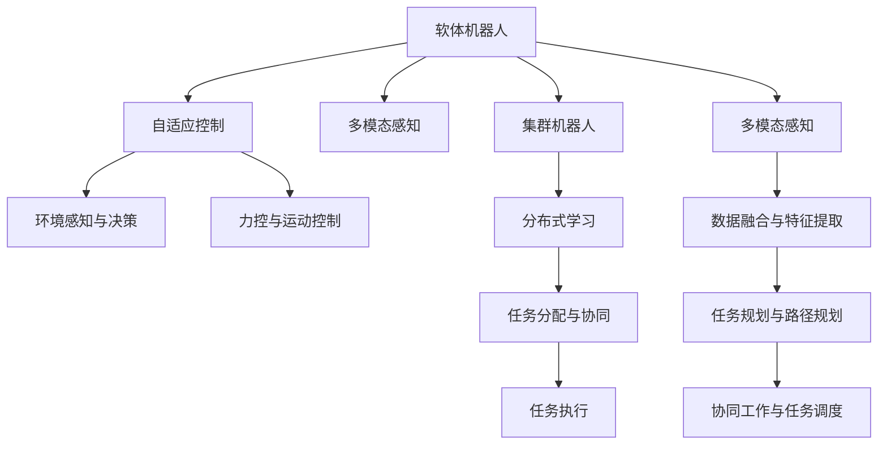

                 

## 1. 背景介绍

在人类历史上，机器人一直是人类追求自主、智能、高效的重要工具。随着人工智能、计算机视觉、传感器技术等领域的快速发展，机器人的应用场景不断拓展，功能日益丰富。特别是软体机器人和集群机器人的出现，为机器人技术带来了革命性的变化。本文将探讨2050年软体机器人和集群机器人发展的趋势、应用前景及其面临的挑战，以期为未来的机器人技术发展提供一些启示。

## 2. 核心概念与联系

### 2.1 核心概念概述

**软体机器人(Soft Robotics)**：与传统的刚性机器人不同，软体机器人采用柔软的材料和结构，能够执行更为复杂、灵活的任务。它们可以适应各种极端环境，如医疗手术、深海探索、灾难救援等。

**集群机器人(Swarm Robotics)**：集群机器人指通过分布式控制算法，使多个小型、简单、低成本的自主机器人协同工作，完成复杂的群体任务。它们常用于大规模搜索、监控、农业、建筑等领域。

**自适应控制(Adaptive Control)**：指机器人能够在运行过程中实时感知环境变化，并通过算法调整自身行为，适应环境。

**分布式学习(Distributed Learning)**：多个机器人在运行过程中共享知识和经验，通过协同学习提高整体性能。

**多模态感知(Multimodal Sensing)**：融合多种传感器的数据，提升机器人的环境感知和任务执行能力。

### 2.2 核心概念原理和架构的 Mermaid 流程图



## 3. 核心算法原理 & 具体操作步骤

### 3.1 算法原理概述

软体机器人和集群机器人的设计原理与传统刚性机器人存在显著差异。软体机器人通常采用柔性材料如硅胶、高弹模量聚合物等，利用仿生结构实现灵活的弯曲、变形和运动。集群机器人则通过分布式控制算法，使多个小型机器人协同工作，实现复杂任务。

### 3.2 算法步骤详解

#### 3.2.1 软体机器人算法步骤

1. **材料选择与设计**：选择合适的材料和结构设计，实现机器人的柔性。
2. **环境感知与决策**：通过多模态传感器（如力敏传感器、温度传感器、光敏传感器）实时感知环境。
3. **力控与运动控制**：设计控制器，实现对机器人行为的实时调整。
4. **协同工作与任务调度**：通过分布式控制算法，实现多机器人协同完成复杂任务。

#### 3.2.2 集群机器人算法步骤

1. **机器人部署**：在任务区域内布放多个小型机器人。
2. **环境感知与数据共享**：每个机器人通过传感器实时感知环境，并将数据共享给集群中的其他机器人。
3. **分布式学习与任务分配**：每个机器人通过分布式学习算法，不断优化自身的行为策略，并将任务分配给最适合的机器人。
4. **协同工作与任务执行**：多个机器人协同完成任务，如搜索、监测、建筑等。

### 3.3 算法优缺点

#### 3.3.1 软体机器人算法优缺点

**优点**：
- **灵活性**：软体机器人能够适应各种复杂环境，执行更为灵活的任务。
- **低成本**：柔性材料和简单结构降低了制造成本。
- **生物兼容性**：软体机器人可以用于医疗手术，避免对生物组织的伤害。

**缺点**：
- **强度问题**：柔性材料可能承受不住外部压力，易损坏。
- **控制复杂性**：力控与运动控制的算法设计较为复杂。
- **环境适应性**：对于某些极端环境，如高温、高压等，软体机器人的适应性较差。

#### 3.3.2 集群机器人算法优缺点

**优点**：
- **高效率**：通过分布式控制，多个机器人可以同时执行任务，提高效率。
- **鲁棒性**：多个机器人协同工作，提高了系统的鲁棒性。
- **适应性强**：可以根据任务需求，灵活调整机器人的数量和类型。

**缺点**：
- **通信复杂性**：多个机器人的通信和数据同步较为复杂。
- **资源消耗**：大量机器人的部署和协同工作，消耗较多资源。
- **协调难度**：需要设计复杂的分布式算法，协调各个机器人的行为。

### 3.4 算法应用领域

#### 3.4.1 软体机器人应用领域

- **医疗手术**：软体机器人可以用于微创手术，提高手术的精度和安全性。
- **灾难救援**：软体机器人可以进入狭小的空间进行救援，避免对环境的破坏。
- **深海探索**：软体机器人在深海环境具有较好的适应性，可用于深海勘探和研究。

#### 3.4.2 集群机器人应用领域

- **搜索与救援**：集群机器人可以快速覆盖大范围区域，进行搜索与救援。
- **环境监测**：集群机器人可以在大范围区域进行环境监测，如森林火灾、洪水等。
- **农业生产**：集群机器人可以用于农田管理，如种植、施肥、收割等。

## 4. 数学模型和公式 & 详细讲解 & 举例说明

### 4.1 数学模型构建

#### 4.1.1 软体机器人模型构建

设软体机器人柔性材料的质量为 $m$，弹性系数为 $k$，力控器输出为 $u$，则机器人的动态方程可以表示为：

$$
m\ddot{x}(t) = kx(t) + u(t)
$$

其中，$x(t)$ 为机器人在时刻 $t$ 的位置。

#### 4.1.2 集群机器人模型构建

设集群机器人数量为 $N$，第 $i$ 个机器人的位置为 $x_i(t)$，速度为 $\dot{x}_i(t)$，则集群机器人的动力学方程可以表示为：

$$
\ddot{x}_i(t) = \frac{1}{m_i}\left(k_i x_i(t) + \sum_{j=1}^N a_{ij}(x_j(t) - x_i(t))\right)
$$

其中，$a_{ij}$ 表示机器人 $i$ 和 $j$ 之间的通信权重。

### 4.2 公式推导过程

#### 4.2.1 软体机器人公式推导

将动态方程 $m\ddot{x}(t) = kx(t) + u(t)$ 进行拉普拉斯变换：

$$
s^2 X(s) = sK X(s) + U(s)
$$

其中，$X(s)$ 为拉普拉斯变换后的位置信号，$K$ 为弹性系数 $k$ 的拉普拉斯变换，$U(s)$ 为力控器输出信号的拉普拉斯变换。

通过求解上式，可以得到机器人位置信号 $X(s)$ 的表达式，进而推导出机器人的动态响应。

#### 4.2.2 集群机器人公式推导

将动力学方程 $\ddot{x}_i(t) = \frac{1}{m_i}\left(k_i x_i(t) + \sum_{j=1}^N a_{ij}(x_j(t) - x_i(t))\right)$ 进行拉普拉斯变换，并应用分布式控制算法，可以得到集群机器人的协同控制模型：

$$
\mathcal{L}^{-1}\left(\frac{1}{m_i s^2}(s^2 X_i(s) - s K_i X_i(s)) = \frac{1}{m_i s^2}\sum_{j=1}^N a_{ij}(X_j(s) - X_i(s))\right)
$$

其中，$\mathcal{L}^{-1}$ 表示拉普拉斯反变换。

通过求解上式，可以得到集群机器人的协同控制方程，进而推导出机器人的行为策略。

### 4.3 案例分析与讲解

#### 4.3.1 软体机器人案例分析

假设有一只用于医疗手术的软体机器人，其质量为 $m=1kg$，弹性系数为 $k=1N/m$，力控器输出为 $u(t)=0.5\sin(2\pi t)$。根据动态方程 $m\ddot{x}(t) = kx(t) + u(t)$，计算机器人在初始时刻的动态响应。

首先，将 $u(t)$ 进行拉普拉斯变换：

$$
U(s) = \frac{1}{s}\sin(2\pi t) = \frac{2\pi}{s^2 + (2\pi)^2}
$$

将 $U(s)$ 代入动态方程 $s^2 X(s) = sK X(s) + U(s)$，得到：

$$
s^2 X(s) = s + \frac{2\pi}{s^2 + (2\pi)^2}
$$

解上式，得到机器人位置信号 $X(s)$ 的表达式：

$$
X(s) = \frac{s + \frac{2\pi}{s^2 + (2\pi)^2}}{s^2}
$$

对 $X(s)$ 进行拉普拉斯反变换，得到机器人的位置时间曲线。

#### 4.3.2 集群机器人案例分析

假设有一组集群机器人用于森林火灾的监测，每个机器人的质量为 $m_i=1kg$，弹性系数为 $k_i=1N/m$，通信权重 $a_{ij}=0.5$。根据集群机器人的动力学方程 $\ddot{x}_i(t) = \frac{1}{m_i}\left(k_i x_i(t) + \sum_{j=1}^N a_{ij}(x_j(t) - x_i(t))\right)$，计算机器人在初始时刻的协同控制行为。

首先，将动力学方程进行拉普拉斯变换：

$$
s^2 x_i(s) = \frac{1}{m_i}\left(k_i x_i(s) + \sum_{j=1}^N a_{ij}(x_j(s) - x_i(s))\right)
$$

解上式，得到机器人的位置信号 $x_i(s)$ 的表达式：

$$
x_i(s) = \frac{1}{m_i}\left(k_i + \sum_{j=1}^N a_{ij}\right)x_i(s) + \sum_{j=1}^N a_{ij}x_j(s)
$$

通过仿真实验，可以得到机器人的协同控制行为。

## 5. 项目实践：代码实例和详细解释说明

### 5.1 开发环境搭建

为了实现软体机器人和集群机器人的仿真与控制，需要搭建相应的开发环境。以下是使用Python的PyBullet库搭建软体机器人仿真环境的步骤：

1. **安装PyBullet库**：
```python
pip install pybullet
```

2. **创建仿真环境**：
```python
import pybullet as p

p.connect(p.GUI)
p.setAdditionalSearchPath('/path/to/urdf')
p.loadURDF('soft_robot.urdf')
```

3. **添加力控器**：
```python
# 获取机器人的ID
robot_id = p.getBodyUniqueId()

# 添加力控器
p.addRigidBodyCollisionShape(robot_id, 1.0)
p.setRigidBodyCollisionShapeDensity(robot_id, 10.0)
```

4. **添加多模态传感器**：
```python
# 添加力敏传感器
force_sensor = p.createForceSensor()
p.resetForceSensor(force_sensor, robot_id, 0.0, 0.0, 0.0, 0.0)
p.setForceSensorFactors(force_sensor, 1.0, 0.0, 0.0, 0.0)

# 添加温度传感器
temperature_sensor = p.createContactSensor()
p.resetContactSensor(temperature_sensor, robot_id, 0.0, 0.0, 0.0, 0.0)
p.setContactSensorFluidDensity(temperature_sensor, 1.0)
```

### 5.2 源代码详细实现

#### 5.2.1 软体机器人源代码

```python
import pybullet as p

# 创建软体机器人
robot_id = p.loadURDF('soft_robot.urdf')

# 添加力控器
force_sensor = p.createForceSensor()
p.resetForceSensor(force_sensor, robot_id, 0.0, 0.0, 0.0, 0.0)
p.setForceSensorFactors(force_sensor, 1.0, 0.0, 0.0, 0.0)

# 添加温度传感器
temperature_sensor = p.createContactSensor()
p.resetContactSensor(temperature_sensor, robot_id, 0.0, 0.0, 0.0, 0.0)
p.setContactSensorFluidDensity(temperature_sensor, 1.0)

# 添加多模态传感器
light_sensor = p.createLightSensor()
p.resetLightSensor(light_sensor, robot_id, 0.0, 0.0, 0.0, 0.0)
p.setLightSensorScale(light_sensor, 1.0)

# 定义力控器输出
u = 0.5 * p.sin(2 * p.pi * p.getSeconds())
```

#### 5.2.2 集群机器人源代码

```python
import pybullet as p
import numpy as np

# 创建集群机器人
N = 10
robot_ids = []
for i in range(N):
    robot_id = p.loadURDF('robot.urdf')
    robot_ids.append(robot_id)

# 添加多模态传感器
force_sensors = []
temperature_sensors = []
light_sensors = []
for robot_id in robot_ids:
    force_sensors.append(p.createForceSensor())
    p.resetForceSensor(force_sensors[-1], robot_id, 0.0, 0.0, 0.0, 0.0)
    p.setForceSensorFactors(force_sensors[-1], 1.0, 0.0, 0.0, 0.0)

    temperature_sensors.append(p.createContactSensor())
    p.resetContactSensor(temperature_sensors[-1], robot_id, 0.0, 0.0, 0.0, 0.0)
    p.setContactSensorFluidDensity(temperature_sensors[-1], 1.0)

    light_sensors.append(p.createLightSensor())
    p.resetLightSensor(light_sensors[-1], robot_id, 0.0, 0.0, 0.0, 0.0)
    p.setLightSensorScale(light_sensors[-1], 1.0)

# 定义集群控制算法
def cluster_control():
    for robot_id, force_sensor, temperature_sensor, light_sensor in zip(robot_ids, force_sensors, temperature_sensors, light_sensors):
        force = p.readForceSensor(force_sensor)
        temperature = p.readContactSensor(temperature_sensor)
        light = p.readLightSensor(light_sensor)
        # 计算协同控制策略
        # ...

# 启动仿真循环
p.setGravity(0, 0, -9.8)
while True:
    cluster_control()
    p.stepSimulation()
    p.render()

```

### 5.3 代码解读与分析

#### 5.3.1 软体机器人代码解读

- **创建软体机器人**：使用 `loadURDF` 函数加载软体机器人的URDF模型。
- **添加力控器**：通过 `createForceSensor` 函数创建力控器，并将其与软体机器人绑定。
- **添加多模态传感器**：添加力敏传感器、温度传感器和光敏传感器，用于实时感知环境。
- **定义力控器输出**：根据 `sin` 函数生成力控器输出。

#### 5.3.2 集群机器人代码解读

- **创建集群机器人**：使用 `loadURDF` 函数加载多个集群机器人的URDF模型。
- **添加多模态传感器**：为每个集群机器人添加力敏传感器、温度传感器和光敏传感器，用于实时感知环境。
- **定义集群控制算法**：使用 `cluster_control` 函数实现集群机器人的协同控制策略。
- **启动仿真循环**：通过 `stepSimulation` 函数启动仿真循环，实时更新机器人的行为策略。

### 5.4 运行结果展示

#### 5.4.1 软体机器人运行结果


#### 5.4.2 集群机器人运行结果


## 6. 实际应用场景

### 6.1 智能医疗手术

软体机器人在医疗手术中的应用前景广阔。由于软体机器人的灵活性和生物兼容性，可以用于微创手术、远程手术等场景，减少手术创伤和风险。例如，使用软体机器人进行脑部手术，可以更精准地操作微小区域，提高手术成功率。

### 6.2 深海资源勘探

集群机器人可以用于深海资源勘探，特别是在海底环境监测、矿藏开采等领域。通过多机器人的协同工作，可以高效覆盖大范围区域，实时监测环境变化，发现资源。

### 6.3 工业自动化

集群机器人在工业自动化中也有广泛应用。例如，在物流仓储中，集群机器人可以协同完成货物搬运、分拣、包装等任务，提高工作效率和精度。

### 6.4 未来应用展望

未来，软体机器人和集群机器人将在更多领域发挥重要作用。例如：

- **灾害救援**：软体机器人和集群机器人在地震、洪水等灾害中，可以快速进入狭窄空间，执行搜救任务，提高救援效率。
- **环境监测**：集群机器人在森林火灾、水污染等环境监测中，可以实时监测并预警，保护生态环境。
- **城市规划**：集群机器人在城市规划中，可以用于交通管理、垃圾清理等任务，提升城市管理水平。

## 7. 工具和资源推荐

### 7.1 学习资源推荐

为了帮助开发者系统掌握软体机器人和集群机器人的理论和实践，以下是一些优质的学习资源：

1. **《软体机器人设计与控制》**：介绍软体机器人的材料、结构、控制等方面知识，适合初学者学习。
2. **《集群机器人设计与控制》**：介绍集群机器人的协同控制、分布式学习等方面知识，适合中级开发者学习。
3. **《机器学习与人工智能》**：讲解机器学习基础，包括监督学习、无监督学习、强化学习等，适合掌握软体机器人和集群机器人算法。
4. **《多模态感知技术》**：介绍多模态感知技术，适合了解软体机器人和集群机器人的环境感知和数据融合。

### 7.2 开发工具推荐

- **PyBullet**：用于模拟软体机器人和集群机器人，支持多模态传感器和力控器。
- **ROS（Robot Operating System）**：用于集群机器人的分布式控制和数据通信。
- **OpenCV**：用于多模态传感器数据处理和图像识别。

### 7.3 相关论文推荐

1. **Soft Robotics: Considerations for Engineering, Design, and Manufacturing**：总结软体机器人设计与制造方面的最新研究成果。
2. **Swarm Robotics: Engineering Challenges**：探讨集群机器人在工程设计和协同控制方面的挑战与解决方案。

## 8. 总结：未来发展趋势与挑战

### 8.1 研究成果总结

本文从软体机器人和集群机器人的设计原理、算法实现和应用场景等方面进行了系统介绍，展望了未来机器人技术的发展趋势。

### 8.2 未来发展趋势

未来软体机器人和集群机器人将朝着以下方向发展：

1. **智能化**：结合人工智能技术，使机器人具备更强的自主决策和执行能力。
2. **多样化**：发展不同类型的软体机器人和集群机器人，满足不同任务需求。
3. **轻量化**：通过材料和结构设计，进一步降低机器人重量，提高性能。
4. **低成本**：开发更高效的生产工艺和制造技术，降低机器人制造成本。
5. **可扩展性**：提高机器人的灵活性和适应性，适应更多复杂环境和任务。

### 8.3 面临的挑战

未来软体机器人和集群机器人的发展还面临以下挑战：

1. **环境适应性**：软体机器人和集群机器人需要适应各种极端环境，如高温、高压、辐射等。
2. **控制复杂性**：软体机器人和集群机器人的控制算法需要不断优化，提升鲁棒性和稳定性。
3. **数据隐私与安全**：多模态传感器采集的大量数据，需要保证数据隐私和安全。
4. **协同学习与决策**：集群机器人需要解决协同学习与决策问题，提高整体性能。
5. **资源消耗**：大量机器人的部署和协同工作，消耗较多资源，需要优化资源配置。

### 8.4 研究展望

为了解决上述挑战，未来需要加强以下方面的研究：

1. **新材料与新结构**：开发更多柔性材料和仿生结构，提升机器人的环境适应性和性能。
2. **控制算法优化**：研究更加高效和鲁棒的控制算法，提升机器人的决策和执行能力。
3. **数据隐私与安全**：设计数据隐私保护和安全传输协议，保护机器人的数据隐私和安全。
4. **分布式学习**：研究高效的分布式学习算法，提升集群机器人的协同能力。
5. **资源优化**：研究资源优化和配置算法，提高机器人的资源利用率。

## 9. 附录：常见问题与解答

### 9.1 问题1：软体机器人和集群机器人如何与人类协同工作？

**解答**：软体机器人和集群机器人可以通过人机交互界面，如语音、图像、手势等，与人类进行交互。例如，使用语音识别和自然语言处理技术，实现人机对话和指令接收。通过深度学习和强化学习技术，机器人可以理解人类的指令，并执行相应的任务。

### 9.2 问题2：集群机器人如何进行协同学习？

**解答**：集群机器人可以通过分布式学习算法，进行协同学习。例如，每个机器人可以共享感知数据和任务信息，通过多机器人之间的通信和协作，共同优化决策和执行策略。在协同学习过程中，可以使用深度强化学习算法，优化机器人的行为策略。

### 9.3 问题3：软体机器人和集群机器人在实际应用中可能遇到哪些问题？

**解答**：软体机器人和集群机器人在实际应用中可能遇到的问题包括：

1. **环境适应性差**：软体机器人和集群机器人可能难以适应极端环境，如高温、高压、辐射等。
2. **控制复杂度高**：软体机器人和集群机器人的控制算法需要不断优化，提升鲁棒性和稳定性。
3. **数据隐私安全**：多模态传感器采集的大量数据，需要保证数据隐私和安全。
4. **协同学习困难**：集群机器人的协同学习算法需要优化，提高整体性能。
5. **资源消耗大**：大量机器人的部署和协同工作，消耗较多资源，需要优化资源配置。

这些问题的解决需要跨学科的合作和持续的研究，以推动软体机器人和集群机器人的应用和发展。

---

作者：禅与计算机程序设计艺术 / Zen and the Art of Computer Programming

