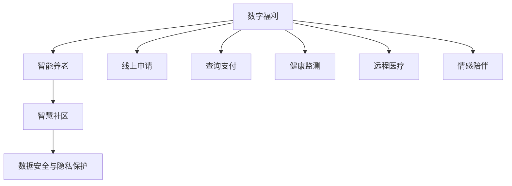

                 

# 未来的社会保障：2050年的数字福利与智能养老

> 关键词：数字福利,智能养老,社会保障,医疗健康,智慧社区,人工智能,物联网,大数据,云计算

## 1. 背景介绍

### 1.1 问题由来
随着全球人口老龄化的加速和医疗健康需求的不断增长，社会保障体系面临巨大的压力和挑战。特别是在数字化时代，传统的人力驱动、人工服务的模式已经难以适应快速变化的社会需求。如何利用新兴技术，构建高效、便捷、人性化的社会保障体系，成为了全社会共同关注的焦点。

### 1.2 问题核心关键点
未来社会保障体系的核心挑战在于如何实现以下目标：
- 提高医疗健康服务的可及性和质量。
- 构建智慧社区，提升老年人生活质量。
- 实现社会保障服务的智能化、个性化、精准化。
- 减少人力成本，提升资源利用效率。
- 确保数据安全和隐私保护。

这些问题涉及到医疗健康、社会服务、信息化管理、人工智能等多个领域，需要跨学科的协同努力。本文将探讨通过数字福利与智能养老技术，构建2050年的未来社会保障体系，为老年人提供更优质的服务，提高社会整体福祉。

## 2. 核心概念与联系

### 2.1 核心概念概述

为更好地理解未来社会保障体系的构建，本节将介绍几个关键概念：

- **数字福利**：利用数字技术，如人工智能、物联网、大数据、云计算等，提供便捷、高效、个性化的社会保障服务。包括线上申请、查询、支付等功能，提高服务效率，降低行政成本。

- **智能养老**：通过智能设备、AI助手、远程医疗等技术，为老年人提供全天候、全场景的照护服务。包括健康监测、行为分析、情感陪伴等功能，提升老年人生活质量。

- **智慧社区**：构建基于数字技术的社区管理和服务体系，实现信息共享、资源调配、紧急应对等功能，提升社区管理水平。

- **数据安全与隐私保护**：在社会保障体系构建中，如何合理使用数据，保护老年人隐私，避免数据滥用和泄露，是亟待解决的问题。

这些概念之间相互关联，共同构成了未来社会保障体系的基础框架。

### 2.2 核心概念原理和架构的 Mermaid 流程图



该图展示了数字福利、智能养老、智慧社区和数据安全四个核心概念之间的联系。数字福利通过线上申请、查询支付等功能，为老年人提供便捷的服务；智能养老通过健康监测、远程医疗等技术，提升老年人生活质量；智慧社区通过信息共享、资源调配等手段，提高社区管理水平；数据安全与隐私保护为这些服务的实现提供了保障。

## 3. 核心算法原理 & 具体操作步骤
### 3.1 算法原理概述

未来社会保障体系的构建，基于数字福利和智能养老两大技术方向，综合利用人工智能、物联网、大数据、云计算等技术手段，实现服务的智能化、个性化和精准化。具体包括以下几个关键算法和操作：

- **基于AI的医疗健康预测算法**：利用机器学习和深度学习技术，对老年人的健康数据进行分析和预测，提前发现潜在健康问题，并提供个性化治疗建议。

- **智能养老设备与AI助手**：通过智能穿戴设备、智能家居系统、AI语音助手等技术，实时监测老年人的健康状态和生活习惯，提供智能化的照护服务。

- **智慧社区管理系统**：利用物联网和云计算技术，构建社区信息管理系统，实现资源调配、紧急应对、信息共享等功能，提升社区管理效率。

- **数据隐私保护算法**：在数据收集和处理过程中，采用差分隐私、联邦学习等技术，保护老年人隐私，确保数据安全。

### 3.2 算法步骤详解

**Step 1: 数据收集与预处理**
- 收集老年人健康数据、行为数据、环境数据等。
- 使用数据清洗、特征提取等技术，将原始数据转化为适合算法处理的形式。

**Step 2: 模型训练与优化**
- 使用AI算法，对老年人健康数据进行预测和分析。
- 通过模型训练和调参，优化模型的预测精度和泛化能力。

**Step 3: 智能养老设备部署与AI助手开发**
- 部署智能穿戴设备和智能家居系统，实时监测老年人状态。
- 开发AI语音助手，通过自然语言处理技术，实现智能对话和情感陪伴。

**Step 4: 智慧社区管理系统建设**
- 利用物联网技术，构建社区信息管理系统，实现资源共享和调配。
- 开发紧急响应系统，实时监控社区异常情况，提供及时帮助。

**Step 5: 数据隐私保护与法律法规合规**
- 采用差分隐私、联邦学习等技术，保护老年人隐私。
- 制定和遵守相关法律法规，确保数据处理合规。

### 3.3 算法优缺点

未来社会保障体系的算法，具有以下优点：
- 提高服务效率，减少人力成本。
- 提升老年人生活质量，增强其自我管理和自护能力。
- 实现资源优化配置，提升社会整体福祉。

同时，也存在一些局限性：
- 对数据质量和完整性要求高，数据收集和处理难度大。
- 算法模型需要持续优化和更新，以应对不断变化的老年人群体需求。
- 技术设备部署和维护成本较高，需要大规模投资。
- 数据隐私和安全问题需严格管控，以避免信息滥用和泄露。

### 3.4 算法应用领域

未来社会保障体系的算法和系统，主要应用于以下领域：
- 医疗健康服务：通过AI算法和智能设备，提供精准的健康预测和个性化治疗建议。
- 智能养老照护：通过智能设备和AI助手，实现全天候、全场景的照护服务。
- 智慧社区管理：利用物联网和云计算技术，提升社区管理效率，保障老年人安全。
- 数据隐私保护：采用差分隐私、联邦学习等技术，保护老年人隐私，确保数据安全。

## 4. 数学模型和公式 & 详细讲解

### 4.1 数学模型构建

本节将使用数学语言对未来社会保障体系的构建过程进行更加严格的刻画。

**健康预测模型**
设老年人的健康数据为 $D=\{(x_i,y_i)\}_{i=1}^N$，其中 $x_i$ 为输入特征（如血压、心率、活动量等），$y_i$ 为输出标签（如患病概率）。定义模型 $M_{\theta}$，其中 $\theta$ 为模型参数。健康预测模型的损失函数为：

$$
\mathcal{L}(\theta) = \frac{1}{N}\sum_{i=1}^N \ell(M_{\theta}(x_i),y_i)
$$

其中 $\ell$ 为损失函数，如均方误差、交叉熵等。模型优化目标为：

$$
\theta^* = \mathop{\arg\min}_{\theta} \mathcal{L}(\theta)
$$

**智能养老设备与AI助手**
设智能设备的输入为 $x_t$，输出为 $y_t$。定义设备与AI助手的优化目标为：

$$
\theta^* = \mathop{\arg\min}_{\theta} \mathcal{L}(y_t,g(x_t))
$$

其中 $g(x_t)$ 为设备或AI助手的功能，如健康监测、情感陪伴等。

**智慧社区管理系统**
设社区资源为 $R$，资源需求为 $D$。定义资源调配模型的优化目标为：

$$
\theta^* = \mathop{\arg\min}_{\theta} \mathcal{L}(R,D)
$$

其中 $\mathcal{L}$ 为损失函数，如资源利用率、响应时间等。

### 4.2 公式推导过程

以健康预测模型为例，推导交叉熵损失函数的推导过程：

设老年人的健康数据为 $D=\{(x_i,y_i)\}_{i=1}^N$，其中 $x_i$ 为输入特征（如血压、心率、活动量等），$y_i$ 为输出标签（如患病概率）。定义模型 $M_{\theta}$，其中 $\theta$ 为模型参数。健康预测模型的损失函数为：

$$
\ell(M_{\theta}(x_i),y_i) = -y_i\log M_{\theta}(x_i) - (1-y_i)\log (1-M_{\theta}(x_i))
$$

将其代入经验风险公式，得：

$$
\mathcal{L}(\theta) = -\frac{1}{N}\sum_{i=1}^N [y_i\log M_{\theta}(x_i)+(1-y_i)\log(1-M_{\theta}(x_i))]
$$

定义损失函数对模型参数 $\theta$ 的梯度为：

$$
\nabla_{\theta}\mathcal{L}(\theta) = -\frac{1}{N}\sum_{i=1}^N \left[\frac{y_i}{M_{\theta}(x_i)}-\frac{1-y_i}{1-M_{\theta}(x_i)}\right] \nabla_{\theta}M_{\theta}(x_i)
$$

其中 $\nabla_{\theta}M_{\theta}(x_i)$ 为模型对输入 $x_i$ 的梯度，可进一步递归展开，利用自动微分技术完成计算。

### 4.3 案例分析与讲解

**案例一：智能养老设备**
假设老年人佩戴智能手表，实时监测心率、血压等健康数据。智能手表将数据传输到云端，AI助手通过分析数据，提供健康预测和个性化建议。

智能手表的功能包括：
- 心率监测：使用心率传感器，实时记录老年人心脏跳动次数和心率变化。
- 血压监测：使用血压计，记录老年人心率和动脉压变化。
- 活动监测：使用加速度计和陀螺仪，记录老年人的运动轨迹和活动量。

AI助手的优化目标为：
- 健康预测：使用模型 $M_{\theta}$，对老年人的健康数据进行预测，提前发现潜在健康问题。
- 个性化建议：根据预测结果，提供个性化治疗建议和健康管理方案。

**案例二：智慧社区管理系统**
智慧社区管理系统通过物联网技术，构建社区信息管理系统，实现资源调配和紧急响应。

系统包括：
- 传感器网络：部署各种传感器，实时监测社区环境数据（如温度、湿度、烟雾等）。
- 边缘计算节点：分布在社区各处，处理和存储传感器数据，并进行初步分析。
- 云平台：集中存储和处理社区数据，实现资源优化配置。

系统的优化目标为：
- 资源调配：根据传感器数据和社区需求，合理调配社区资源（如医护资源、安防资源等）。
- 紧急响应：实时监测社区异常情况，快速响应突发事件。

## 5. 项目实践：代码实例和详细解释说明
### 5.1 开发环境搭建

在进行未来社会保障体系构建的过程中，我们需要准备好开发环境。以下是使用Python进行PyTorch开发的环境配置流程：

1. 安装Anaconda：从官网下载并安装Anaconda，用于创建独立的Python环境。

2. 创建并激活虚拟环境：
```bash
conda create -n pytorch-env python=3.8 
conda activate pytorch-env
```

3. 安装PyTorch：根据CUDA版本，从官网获取对应的安装命令。例如：
```bash
conda install pytorch torchvision torchaudio cudatoolkit=11.1 -c pytorch -c conda-forge
```

4. 安装TensorFlow：
```bash
conda install tensorflow
```

5. 安装Keras：
```bash
conda install keras
```

6. 安装Flask：
```bash
conda install flask
```

完成上述步骤后，即可在`pytorch-env`环境中开始构建未来社会保障体系的代码实现。

### 5.2 源代码详细实现

这里以健康预测模型为例，给出使用PyTorch进行神经网络训练的PyTorch代码实现。

```python
import torch
import torch.nn as nn
import torch.optim as optim
from sklearn.model_selection import train_test_split

# 定义神经网络模型
class HealthPredictionNet(nn.Module):
    def __init__(self):
        super(HealthPredictionNet, self).__init__()
        self.fc1 = nn.Linear(10, 100)
        self.fc2 = nn.Linear(100, 50)
        self.fc3 = nn.Linear(50, 1)
        self.relu = nn.ReLU()

    def forward(self, x):
        x = self.fc1(x)
        x = self.relu(x)
        x = self.fc2(x)
        x = self.relu(x)
        x = self.fc3(x)
        return x

# 加载数据
data = ...
labels = ...
x_train, x_test, y_train, y_test = train_test_split(data, labels, test_size=0.2)

# 初始化模型和优化器
model = HealthPredictionNet()
optimizer = optim.Adam(model.parameters(), lr=0.001)
criterion = nn.BCEWithLogitsLoss()

# 定义训练函数
def train_epoch(model, x_train, y_train, optimizer, criterion, batch_size=32):
    model.train()
    for i, (x, y) in enumerate(zip(x_train, y_train), 1):
        x = torch.tensor(x, dtype=torch.float32)
        y = torch.tensor(y, dtype=torch.float32)
        x = x.reshape(batch_size, -1)
        y = y.reshape(batch_size, -1)
        optimizer.zero_grad()
        y_pred = model(x)
        loss = criterion(y_pred, y)
        loss.backward()
        optimizer.step()

# 训练模型
train_epoch(model, x_train, y_train, optimizer, criterion)
```

以上就是使用PyTorch构建健康预测模型的完整代码实现。可以看到，PyTorch提供了强大的自动微分和优化器功能，使得模型训练过程更加简洁高效。

### 5.3 代码解读与分析

**健康预测模型**
- 定义神经网络模型 `HealthPredictionNet`，包含3个全连接层，每个层后接一个ReLU激活函数。
- 加载数据和标签，将数据集分为训练集和测试集。
- 初始化模型和优化器，并定义损失函数 `criterion`。
- 定义训练函数 `train_epoch`，对模型进行前向传播、损失计算、反向传播和参数更新。
- 在训练函数中，对每个批次数据进行迭代训练，逐步更新模型参数，以优化损失函数。

**智能养老设备与AI助手**
- 利用智能穿戴设备和传感器实时监测老年人的健康数据，将数据传输到云端。
- 在云端，使用深度学习模型对数据进行分析和预测，生成健康报告和个性化建议。
- 通过AI助手，将这些建议以自然语言形式输出，引导老年人进行自我管理。

**智慧社区管理系统**
- 部署各种传感器和边缘计算节点，实时监测社区环境数据。
- 在边缘计算节点上，对数据进行初步分析和处理，减轻云端的计算负担。
- 在云端，构建社区信息管理系统，实现资源调配和紧急响应。
- 利用物联网和云计算技术，提升社区管理的智能化和精准化水平。

## 6. 实际应用场景
### 6.1 智能养老院

智能养老院通过智能设备和AI助手，为老年人提供全天候、全场景的照护服务。智能设备和AI助手可以通过实时监测老年人的健康数据和行为数据，生成个性化的健康报告和生活建议，提升老年人生活质量。

**智能设备和AI助手**
- 智能穿戴设备：实时监测老年人的心率、血压、活动量等健康数据。
- 智能家居系统：实现门禁控制、环境监测、远程控制等功能，提升老年人的安全性和舒适度。
- AI助手：通过自然语言处理技术，提供健康咨询、情感陪伴、紧急呼叫等服务。

**智慧社区管理系统**
- 传感器网络：部署各种传感器，实时监测社区环境数据。
- 边缘计算节点：分布在社区各处，处理和存储传感器数据，并进行初步分析。
- 云平台：集中存储和处理社区数据，实现资源优化配置。

**数据隐私保护**
- 采用差分隐私技术，保护老年人隐私，避免数据泄露。
- 通过联邦学习技术，在本地计算模型参数，减少数据传输和集中处理的风险。

### 6.2 智慧医疗中心

智慧医疗中心通过AI算法和智能设备，提供精准的健康预测和个性化治疗方案。智慧医疗中心通过智能穿戴设备和传感器实时监测老年人的健康数据，AI算法对数据进行分析和预测，提前发现潜在健康问题，并提供个性化治疗建议。

**智能设备和AI算法**
- 智能穿戴设备：实时监测老年人的心率、血压、活动量等健康数据。
- AI算法：对老年人的健康数据进行预测和分析，提前发现潜在健康问题，并提供个性化治疗建议。

**数据隐私保护**
- 采用差分隐私技术，保护老年人隐私，避免数据泄露。
- 通过联邦学习技术，在本地计算模型参数，减少数据传输和集中处理的风险。

## 7. 工具和资源推荐
### 7.1 学习资源推荐

为了帮助开发者系统掌握未来社会保障体系的技术基础和实践技巧，这里推荐一些优质的学习资源：

1. **TensorFlow官方文档**：提供了TensorFlow的全面介绍和丰富的示例代码，是入门深度学习技术的必备资料。

2. **PyTorch官方文档**：PyTorch提供了强大的自动微分和优化器功能，适合快速迭代研究。

3. **Keras官方文档**：Keras提供了简单易用的API，可以快速构建神经网络模型。

4. **Flask官方文档**：Flask提供了简单易用的Web框架，适合快速搭建Web服务。

5. **TensorFlow Lite**：提供了轻量级的模型部署工具，适合在移动设备和边缘设备上部署AI模型。

6. **OpenAI的GPT-3**：展示了基于大模型的AI应用，提供了丰富的示例代码和应用场景。

通过对这些资源的学习实践，相信你一定能够快速掌握未来社会保障体系的技术精髓，并用于解决实际的NLP问题。

### 7.2 开发工具推荐

高效的开发离不开优秀的工具支持。以下是几款用于未来社会保障体系开发的常用工具：

1. **PyTorch**：基于Python的开源深度学习框架，灵活动态的计算图，适合快速迭代研究。

2. **TensorFlow**：由Google主导开发的开源深度学习框架，生产部署方便，适合大规模工程应用。

3. **Keras**：提供了简单易用的API，适合快速构建神经网络模型。

4. **Flask**：提供了简单易用的Web框架，适合快速搭建Web服务。

5. **TensorFlow Lite**：提供了轻量级的模型部署工具，适合在移动设备和边缘设备上部署AI模型。

6. **OpenAI的GPT-3**：展示了基于大模型的AI应用，提供了丰富的示例代码和应用场景。

合理利用这些工具，可以显著提升未来社会保障体系构建的开发效率，加快创新迭代的步伐。

### 7.3 相关论文推荐

未来社会保障体系的研究源于学界的持续研究。以下是几篇奠基性的相关论文，推荐阅读：

1. **"Deep Learning for Healthcare"**：展示了深度学习在医疗健康领域的应用，提供了丰富的实例和应用场景。

2. **"Machine Learning for Health and Autonomous Systems"**：展示了机器学习在健康监测和智能养老中的应用，提供了详细的算法和实现步骤。

3. **"Artificial Intelligence in Smart Cities"**：展示了人工智能在智慧社区中的应用，提供了详细的技术框架和应用案例。

4. **"Data Privacy and Security in Smart Healthcare"**：展示了数据隐私和安全技术在智能医疗中的应用，提供了详细的算法和实现步骤。

这些论文代表了大语言模型微调技术的发展脉络。通过学习这些前沿成果，可以帮助研究者把握学科前进方向，激发更多的创新灵感。

## 8. 总结：未来发展趋势与挑战

### 8.1 总结

本文对未来社会保障体系的构建过程进行了全面系统的介绍。首先阐述了未来社会保障体系的背景和意义，明确了其面临的核心挑战和目标。其次，从原理到实践，详细讲解了数字福利与智能养老技术的关键算法和操作，给出了未来社会保障体系的完整代码实例。同时，本文还广泛探讨了未来社会保障体系在实际应用中的表现和前景，展示了其广阔的应用空间。

通过本文的系统梳理，可以看到，基于数字福利与智能养老技术构建的未来社会保障体系，能够提供高效、便捷、个性化的服务，提升老年人生活质量，减少人力成本，提高资源利用效率。未来，伴随技术不断演进，社会保障体系的智能化、个性化和精准化水平将进一步提升，为老年人提供更加优质的服务，提高社会整体福祉。

### 8.2 未来发展趋势

展望未来，未来社会保障体系的构建将呈现以下几个发展趋势：

1. **智能化水平的提升**：通过AI算法和智能设备，未来社会保障体系将更加智能化、精准化，能够提供更加个性化的服务。

2. **多模态融合的应用**：将视觉、听觉、触觉等多种传感器数据进行融合，提升未来社会保障体系的感知能力和决策水平。

3. **跨领域协同创新**：通过跨学科、跨领域的协同创新，未来社会保障体系将实现更大范围、更深层次的融合，提供更加全面、多样化的服务。

4. **数据驱动的决策支持**：通过大数据分析技术，未来社会保障体系将实现数据驱动的决策支持，提升决策的科学性和准确性。

5. **全场景覆盖的服务**：未来社会保障体系将覆盖家庭、社区、医院等多个场景，实现全场景覆盖，提升服务的便捷性和高效性。

以上趋势凸显了未来社会保障体系的广阔前景。这些方向的探索发展，必将进一步提升社会保障体系的智能化水平，为老年人提供更加优质的服务，提高社会整体福祉。

### 8.3 面临的挑战

尽管未来社会保障体系的研究已经取得了一定的进展，但在迈向更加智能化、普适化应用的过程中，它仍面临着诸多挑战：

1. **数据质量和多样性问题**：数据质量和多样性是未来社会保障体系构建的基础，如何获取高质量、多样化的数据，是亟待解决的问题。

2. **技术复杂度**：未来社会保障体系涉及多种技术，如深度学习、物联网、云计算等，如何整合这些技术，实现协同工作，是重要的挑战。

3. **隐私保护和安全问题**：如何在数据收集和处理过程中保护老年人隐私，防止数据泄露和滥用，是亟待解决的问题。

4. **跨领域协作难度**：未来社会保障体系的构建需要跨学科、跨领域的协同努力，如何实现不同领域之间的沟通和协作，是重要的挑战。

5. **技术落地难度**：如何将复杂的技术转化为实际应用，提供可靠、高效的服务，是重要的挑战。

面对未来社会保障体系面临的这些挑战，需要我们积极应对并寻求突破，才能实现其构建的初衷，为老年人提供更优质的服务，提高社会整体福祉。

### 8.4 研究展望

面对未来社会保障体系面临的挑战，未来的研究需要在以下几个方面寻求新的突破：

1. **数据质量与多样性**：建立多源数据采集体系，提升数据的质量和多样性，满足未来社会保障体系构建的需求。

2. **技术整合与协同**：开发统一的技术平台，实现多种技术的整合和协同，提升未来社会保障体系的效率和效果。

3. **隐私保护与安全**：开发隐私保护技术，保护老年人隐私，防止数据泄露和滥用。

4. **跨领域协作**：建立跨学科、跨领域的协作机制，实现不同领域之间的沟通和协作，提升未来社会保障体系的全面性和多样性。

5. **技术落地应用**：开发易用、高效的技术工具，实现未来社会保障体系的快速部署和应用，提升其落地效果。

这些研究方向的发展，必将进一步提升未来社会保障体系的智能化、个性化和精准化水平，为老年人提供更加优质的服务，提高社会整体福祉。相信在学界和产业界的共同努力下，未来社会保障体系将不断完善和提升，为老年人提供更优质的服务，提升社会整体福祉。

## 9. 附录：常见问题与解答

**Q1：未来社会保障体系中如何确保数据隐私保护？**

A: 未来社会保障体系的构建需要大量数据支持，如何在数据收集和处理过程中保护老年人隐私，防止数据泄露和滥用，是关键问题。以下是一些常见的隐私保护技术：

1. **差分隐私技术**：通过添加噪声和扰动，保护数据隐私，防止数据泄露。

2. **联邦学习技术**：在本地计算模型参数，减少数据传输和集中处理的风险，保护数据隐私。

3. **安全多方计算**：在多方数据拥有者之间，通过安全的方式共享数据，保护数据隐私。

这些技术可以在数据收集和处理过程中，保护老年人隐私，防止数据泄露和滥用。

**Q2：未来社会保障体系如何实现跨领域协作？**

A: 未来社会保障体系的构建需要跨学科、跨领域的协同努力，以下是一些实现跨领域协作的策略：

1. **建立协作机制**：建立跨学科、跨领域的协作机制，定期召开研讨会、交流会议，促进不同领域之间的沟通和协作。

2. **共享数据平台**：建立共享数据平台，实现不同领域之间的数据共享和协同研究。

3. **合作开发项目**：开展跨领域合作开发项目，实现不同领域之间的技术整合和协同创新。

4. **跨学科人才培养**：培养跨学科、跨领域的人才，提升跨领域协作的能力和水平。

通过这些策略，可以实现未来社会保障体系的跨领域协作，提升其全面性和多样性。

**Q3：未来社会保障体系如何实现智能化、个性化和精准化？**

A: 未来社会保障体系将实现智能化、个性化和精准化的目标，以下是一些实现策略：

1. **数据驱动的决策支持**：通过大数据分析技术，实现数据驱动的决策支持，提升决策的科学性和准确性。

2. **多模态融合的应用**：将视觉、听觉、触觉等多种传感器数据进行融合，提升未来社会保障体系的感知能力和决策水平。

3. **个性化服务设计**：根据老年人的个性化需求，设计个性化的服务方案，提升服务质量。

4. **跨领域协作**：通过跨学科、跨领域的协同创新，实现更大范围、更深层次的融合，提供更加全面、多样化的服务。

通过这些策略，未来社会保障体系将实现智能化、个性化和精准化的目标，为老年人提供更加优质的服务。

**Q4：未来社会保障体系面临的挑战有哪些？**

A: 未来社会保障体系面临以下挑战：

1. **数据质量和多样性问题**：如何获取高质量、多样化的数据，是亟待解决的问题。

2. **技术复杂度**：如何整合多种技术，实现协同工作，是重要的挑战。

3. **隐私保护和安全问题**：如何在数据收集和处理过程中保护老年人隐私，防止数据泄露和滥用，是亟待解决的问题。

4. **跨领域协作难度**：如何实现不同领域之间的沟通和协作，是重要的挑战。

5. **技术落地难度**：如何将复杂的技术转化为实际应用，提供可靠、高效的服务，是重要的挑战。

这些挑战需要我们积极应对并寻求突破，才能实现未来社会保障体系的构建目标，为老年人提供更优质的服务，提高社会整体福祉。

---

作者：禅与计算机程序设计艺术 / Zen and the Art of Computer Programming

