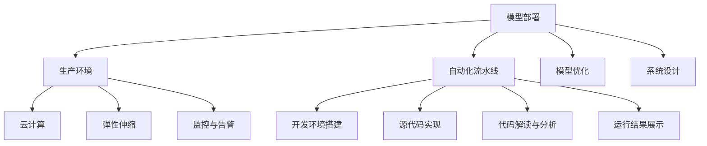

                 

# 机器学习模型部署：从开发到生产的最佳实践

> 关键词：模型部署,生产环境,自动化流水线,模型优化,系统设计,云计算,弹性伸缩,监控与告警

## 1. 背景介绍

在人工智能（AI）和机器学习（ML）领域，模型开发和训练是一项艰巨的任务，但将模型部署到生产环境并确保其在真实世界中稳定运行，同样具有重大挑战。模型部署不仅是一个技术问题，更是一个跨部门协作和系统设计的复杂过程。本文旨在深入探讨机器学习模型部署的最佳实践，从开发到生产的全流程，为模型部署提供全方位的指导。

## 2. 核心概念与联系

### 2.1 核心概念概述

在模型部署过程中，涉及以下几个关键概念：

- **模型部署**：将经过训练和验证的机器学习模型从开发环境迁移到生产环境，使其能够被实际业务系统调用。
- **生产环境**：指模型部署后的实际应用场景，如在线服务、手机应用、物联网设备等。
- **自动化流水线**：指通过自动化工具和脚本，将模型部署的各个环节串联起来，实现模型从开发到生产的自动化流程。
- **模型优化**：在模型部署后，根据实际运行情况进行性能调优，包括模型压缩、参数剪枝、模型调优等。
- **系统设计**：涉及模型部署的基础设施和架构设计，如服务器配置、负载均衡、数据存储等。
- **云计算**：指利用云平台提供的弹性计算资源和分布式服务，实现模型的便捷部署和扩展。
- **弹性伸缩**：指根据业务流量自动调整计算资源，确保模型在高峰期的稳定运行。
- **监控与告警**：通过实时监控系统运行状态，设置异常告警机制，及时发现并处理系统故障。

这些概念之间的联系可以通过以下Mermaid流程图来展示：



此流程图展示了模型部署的各个关键环节及其相互关系：

1. 模型部署是从开发环境迁移到生产环境的过程。
2. 自动化流水线将模型部署的各个环节串联起来，实现自动化流程。
3. 模型优化在模型部署后进行，包括模型压缩、参数剪枝等。
4. 系统设计涉及基础设施和架构的构建，如服务器配置、负载均衡等。
5. 云计算提供弹性计算资源和分布式服务，方便模型部署。
6. 弹性伸缩根据业务流量自动调整计算资源，确保系统稳定。
7. 监控与告警实时监控系统运行状态，及时发现并处理异常。

这些概念共同构成了模型部署的全流程，确保模型在生产环境中高效、稳定地运行。

## 3. 核心算法原理 & 具体操作步骤

### 3.1 算法原理概述

模型部署的核心目标是确保模型能够高效、稳定地运行在生产环境中，为实际业务提供准确的预测结果。这需要考虑模型的性能、稳定性和可扩展性。模型部署的算法原理主要包括以下几个方面：

- **模型压缩**：减少模型参数量，降低计算复杂度，提高模型部署和推理速度。
- **参数剪枝**：去除冗余参数，减少模型大小，提高模型运行效率。
- **模型调优**：通过微调、权重调整等方法，提升模型性能。
- **自动化流水线**：通过脚本和工具，自动化完成模型部署的各个环节，提高效率和准确性。
- **系统设计**：设计高效、可靠的系统架构，确保模型稳定运行。
- **云计算**：利用云平台提供的弹性计算资源和分布式服务，实现模型的便捷部署和扩展。
- **弹性伸缩**：根据业务流量自动调整计算资源，确保模型在高峰期的稳定运行。
- **监控与告警**：实时监控系统运行状态，设置异常告警机制，及时发现并处理系统故障。

### 3.2 算法步骤详解

模型部署的详细步骤包括：

1. **模型训练与验证**：在开发环境使用大规模数据集训练和验证模型。
2. **模型保存与导出**：保存训练好的模型参数，导出模型格式，便于部署。
3. **自动化流水线配置**：配置自动化流水线，包括脚本编写、工具集成等。
4. **开发环境搭建**：搭建与生产环境一致的开发环境。
5. **模型部署**：将模型部署到生产环境，并进行必要的配置。
6. **模型优化**：在生产环境中对模型进行优化，包括模型压缩、参数剪枝等。
7. **系统设计**：设计高效、可靠的系统架构，确保模型稳定运行。
8. **云计算配置**：利用云平台提供的弹性计算资源和分布式服务，实现模型的便捷部署和扩展。
9. **弹性伸缩配置**：配置弹性伸缩策略，根据业务流量自动调整计算资源。
10. **监控与告警配置**：配置实时监控和异常告警机制，确保系统稳定运行。

### 3.3 算法优缺点

模型部署的优点包括：

- 提高模型部署和推理速度。
- 提升模型的稳定性和可扩展性。
- 确保模型在实际应用中的准确性和可靠性。
- 降低人工干预和操作成本。
- 提供高效的自动化流程，减少人为错误。

然而，模型部署也存在一些缺点：

- 需要额外的硬件和软件资源。
- 模型优化和调优工作复杂，需要专业知识。
- 系统设计和监控告警需要跨部门协作。
- 模型在实际应用中的表现可能与预期有差异。
- 可能需要面对新的安全性和隐私问题。

### 3.4 算法应用领域

模型部署技术广泛应用于各种领域，如金融、医疗、电商、物流等。以下是几个典型的应用场景：

- **金融领域**：用于信用评估、风险管理、欺诈检测等。通过模型部署，可以在实时交易中提供精准的风险预测。
- **医疗领域**：用于疾病诊断、治疗方案推荐等。通过模型部署，可以在医院系统中实时提供准确的诊断结果。
- **电商领域**：用于推荐系统、个性化广告等。通过模型部署，可以提供精准的商品推荐和广告投放。
- **物流领域**：用于路径规划、库存管理等。通过模型部署，可以优化物流配送路径，提高配送效率。
- **自动驾驶**：用于交通预测、道路识别等。通过模型部署，可以实时提供交通情况分析，提升驾驶安全。

## 4. 数学模型和公式 & 详细讲解 & 举例说明

### 4.1 数学模型构建

模型部署的数学模型主要涉及模型的压缩和调优。以模型压缩为例，常用的方法包括权重剪枝、稀疏量化、知识蒸馏等。

- **权重剪枝**：通过移除模型中冗余权重，减少模型参数量。公式为：

  $$
  C = \frac{\sum_{i=1}^n w_i^2}{n}
  $$

  其中，$C$为权重平方的平均值，$w_i$为第$i$个权重。

- **稀疏量化**：将模型中的浮点数参数转换为定点数或整数数，减少存储空间。公式为：

  $$
  w_i = \text{Clip}(\frac{w_i}{S})
  $$

  其中，$w_i$为原始权重，$S$为量化步长，$\text{Clip}$为量化函数。

### 4.2 公式推导过程

以模型压缩中的权重剪枝为例，推导如下：

1. 计算权重平方和：
  
  $$
  \sum_{i=1}^n w_i^2
  $$

2. 计算权重平方平均值：

  $$
  C = \frac{\sum_{i=1}^n w_i^2}{n}
  $$

3. 根据平均值调整权重：

  $$
  w_i = \frac{w_i}{C}
  $$

  确保每个权重的值在[0, 1]范围内。

4. 根据新的权重计算损失函数：

  $$
  L = \frac{1}{N}\sum_{i=1}^N \sum_{j=1}^M (\hat{y}_{ij} - y_{ij})^2
  $$

  其中，$\hat{y}_{ij}$为模型预测结果，$y_{ij}$为实际标签。

### 4.3 案例分析与讲解

以金融领域的信用评估为例，分析模型部署的过程：

1. **模型训练与验证**：在开发环境使用历史数据集训练信用评估模型，验证模型性能。

2. **模型保存与导出**：将训练好的模型参数保存为`.h5`文件，导出为`.pb`文件，便于部署。

3. **自动化流水线配置**：配置自动化流水线，包括脚本编写、工具集成等。

4. **开发环境搭建**：搭建与生产环境一致的开发环境，确保模型在实际应用中的表现一致。

5. **模型部署**：将模型部署到生产环境，并进行必要的配置，如API接口、参数设置等。

6. **模型优化**：在生产环境中对模型进行优化，包括模型压缩、参数剪枝等。

7. **系统设计**：设计高效、可靠的系统架构，确保模型稳定运行。

8. **云计算配置**：利用云平台提供的弹性计算资源和分布式服务，实现模型的便捷部署和扩展。

9. **弹性伸缩配置**：配置弹性伸缩策略，根据业务流量自动调整计算资源，确保系统在高峰期的稳定运行。

10. **监控与告警配置**：配置实时监控和异常告警机制，确保系统稳定运行。

## 5. 项目实践：代码实例和详细解释说明

### 5.1 开发环境搭建

为了进行模型部署，首先需要搭建开发环境。以下是使用Python进行TensorFlow模型部署的环境配置流程：

1. 安装Anaconda：从官网下载并安装Anaconda，用于创建独立的Python环境。

2. 创建并激活虚拟环境：

   ```bash
   conda create -n tf-env python=3.8 
   conda activate tf-env
   ```

3. 安装TensorFlow：根据CUDA版本，从官网获取对应的安装命令。例如：

   ```bash
   conda install tensorflow -c conda-forge -c pytorch
   ```

4. 安装相关工具包：

   ```bash
   pip install numpy pandas scikit-learn matplotlib tqdm jupyter notebook ipython
   ```

完成上述步骤后，即可在`tf-env`环境中开始模型部署实践。

### 5.2 源代码详细实现

以下是使用TensorFlow进行信用评估模型部署的PyTorch代码实现：

```python
import tensorflow as tf
import numpy as np
from tensorflow.keras.models import load_model
from tensorflow.keras.optimizers import Adam
from tensorflow.keras.losses import MeanSquaredError

# 加载预训练模型
model = load_model('path/to/model.h5')

# 配置优化器和损失函数
optimizer = Adam(learning_rate=0.001)
loss_fn = MeanSquaredError()

# 配置输入和输出
input_shape = (10,)
output_shape = (1,)

# 配置监控和告警
tensorboard_callback = tf.keras.callbacks.TensorBoard(log_dir='logs')
early_stopping_callback = tf.keras.callbacks.EarlyStopping(monitor='val_loss', patience=10)

# 进行模型训练与验证
x_train = np.random.randn(1000, *input_shape)
y_train = np.random.randn(1000, *output_shape)
x_val = np.random.randn(100, *input_shape)
y_val = np.random.randn(100, *output_shape)
model.compile(optimizer=optimizer, loss=loss_fn)
model.fit(x_train, y_train, validation_data=(x_val, y_val), callbacks=[tensorboard_callback, early_stopping_callback])

# 保存模型
model.save('path/to/model.h5')
```

### 5.3 代码解读与分析

让我们再详细解读一下关键代码的实现细节：

- **load_model**：加载预训练模型，可以是Keras或TensorFlow的模型文件。
- **Adam优化器和MeanSquaredError损失函数**：配置模型训练的优化器和损失函数。
- **输入和输出配置**：定义模型的输入和输出形状，适应实际业务需求。
- **TensorBoard回调和EarlyStopping回调**：配置监控和异常告警机制，确保模型训练的稳定性和准确性。
- **model.compile**：编译模型，指定优化器、损失函数和评估指标。
- **model.fit**：训练模型，指定训练数据、验证数据和回调函数。
- **model.save**：保存模型，可以导出为Keras或TensorFlow格式。

## 6. 实际应用场景

### 6.1 智能客服系统

智能客服系统利用模型部署技术，通过微调预训练模型，实现实时智能回答用户咨询。模型部署在云端服务器上，用户通过API接口访问，实时接收模型预测结果。系统可以自动分类用户咨询，引导到对应的客服团队，提高服务效率。

### 6.2 金融舆情监测

金融舆情监测系统通过模型部署，实时监测社交媒体、新闻报道等海量数据，识别市场情绪变化。系统部署在云服务器上，采用弹性伸缩策略，确保在高峰期能够快速响应。实时监控和告警机制确保系统稳定运行，及时发现异常情况，避免金融风险。

### 6.3 个性化推荐系统

个性化推荐系统通过模型部署，实时分析用户行为数据，推荐用户可能感兴趣的商品。系统部署在分布式集群上，利用云平台的弹性资源，确保在大规模用户访问时的高效稳定。模型优化和调优策略确保推荐系统能够提供精准、个性化的推荐结果。

### 6.4 未来应用展望

未来，随着模型部署技术的不断演进，人工智能将更加广泛地应用于各个领域，带来更加深刻的变革。例如：

- **医疗领域**：通过模型部署，实现智能诊断和治疗方案推荐，提升医疗服务的精准性和效率。
- **自动驾驶**：通过模型部署，实现实时环境感知和路径规划，提高驾驶安全性和效率。
- **智能制造**：通过模型部署，优化生产流程和设备维护，提高生产效率和设备利用率。
- **智慧城市**：通过模型部署，实现交通预测、环境监测、公共安全等智能化应用，提升城市管理水平。

## 7. 工具和资源推荐

### 7.1 学习资源推荐

为了帮助开发者掌握模型部署的最佳实践，推荐以下学习资源：

1. **TensorFlow官方文档**：提供了详细的TensorFlow模型部署指南和示例代码，适合初学者和进阶用户。

2. **Keras官方文档**：提供了Keras模型部署和微调的最佳实践，适合Keras用户。

3. **TensorBoard和TensorFlow Extended（TFX）**：提供了模型监控和自动化流水线的最佳实践，适合模型部署和运维人员。

4. **Docker和Kubernetes**：提供了容器化和容器编排的最佳实践，适合云平台和分布式系统部署。

5. **GitLab CI/CD**：提供了自动化流水线和持续集成的最佳实践，适合模型开发和部署的自动化流程。

### 7.2 开发工具推荐

以下是几款用于模型部署开发的常用工具：

1. **TensorFlow和Keras**：提供了丰富的模型部署和微调功能，适合模型开发和部署。

2. **TensorBoard和TensorFlow Extended（TFX）**：提供了模型监控和自动化流水线的功能，适合模型部署和运维。

3. **Docker和Kubernetes**：提供了容器化和容器编排的功能，适合云平台和分布式系统部署。

4. **GitLab CI/CD**：提供了自动化流水线和持续集成的功能，适合模型开发和部署的自动化流程。

5. **Jupyter Notebook和PyCharm**：提供了便捷的开发环境，适合模型开发和调试。

合理利用这些工具，可以显著提升模型部署的开发效率，加快创新迭代的步伐。

### 7.3 相关论文推荐

以下是几篇奠基性的相关论文，推荐阅读：

1. **TensorFlow: A System for Large-Scale Machine Learning**：介绍了TensorFlow模型的部署和优化技术，适合模型部署和优化实践。

2. **Keras: Deep Learning for Humans**：介绍了Keras模型的部署和微调技术，适合Keras用户。

3. **Model-Based Exploration in Reinforcement Learning**：介绍了模型部署在强化学习中的应用，适合强化学习用户。

4. **TensorFlow Extended: A Library for TensorFlow Components**：介绍了TensorFlow Extended的模型部署和自动化流水线功能，适合模型部署和运维人员。

5. **Distributed TensorFlow**：介绍了TensorFlow在分布式系统中的部署和优化技术，适合云平台和分布式系统部署。

## 8. 总结：未来发展趋势与挑战

### 8.1 总结

本文对机器学习模型部署的最佳实践进行了全面系统的介绍。首先阐述了模型部署的重要性和意义，明确了模型部署在模型从开发到生产的全流程中的关键作用。其次，从原理到实践，详细讲解了模型部署的数学模型和操作步骤，给出了模型部署任务开发的完整代码实例。同时，本文还广泛探讨了模型部署在各个行业领域的应用前景，展示了模型部署范式的广泛应用。最后，本文精选了模型部署技术的各类学习资源，力求为开发者提供全方位的技术指引。

通过本文的系统梳理，可以看到，模型部署技术正在成为机器学习落地的重要保障，极大地拓展了模型应用的范围，提升了模型的稳定性和可扩展性。未来，伴随模型部署技术的持续演进，机器学习技术将在更广泛的领域发挥作用，带来更加深远的影响。

### 8.2 未来发展趋势

展望未来，模型部署技术将呈现以下几个发展趋势：

1. **云平台和分布式系统**：模型部署将更加依赖云平台和分布式系统，实现资源的弹性扩展和高效管理。

2. **自动化流水线和持续集成**：模型部署将更加依赖自动化流水线和持续集成工具，实现模型的快速迭代和高效部署。

3. **模型压缩和优化**：模型压缩和优化技术将进一步发展，实现更小模型规模、更高运行效率。

4. **实时监控和异常告警**：实时监控和异常告警机制将更加完善，确保模型在实际应用中的稳定性和可靠性。

5. **跨部门协作和数据共享**：模型部署将更加依赖跨部门协作和数据共享，实现数据的高效利用和模型的精准调优。

以上趋势凸显了模型部署技术的广阔前景，这些方向的探索发展，必将进一步提升模型的性能和应用范围，为机器学习技术的产业化进程提供有力支持。

### 8.3 面临的挑战

尽管模型部署技术已经取得了瞩目成就，但在迈向更加智能化、普适化应用的过程中，仍面临诸多挑战：

1. **数据安全和隐私**：模型在实际应用中的数据安全和隐私问题亟待解决，确保用户数据不被滥用。

2. **模型复杂性和可解释性**：模型部署后的复杂性和可解释性问题仍需解决，确保模型在实际应用中的可靠性和透明度。

3. **跨领域模型迁移**：模型在不同领域间的迁移仍需优化，确保模型在实际应用中的广泛适应性。

4. **资源优化和成本控制**：模型部署和优化的资源优化和成本控制问题仍需解决，确保模型在实际应用中的高效性和经济性。

5. **模型更新和迭代**：模型在实际应用中的更新和迭代问题仍需优化，确保模型的长期稳定性和时效性。

6. **自动化流水线的自动化程度**：自动化流水线的自动化程度仍有待提高，确保模型的高效部署和快速迭代。

7. **多模型集成和融合**：多模型集成和融合技术仍有待发展，确保模型在实际应用中的多样性和适应性。

这些挑战需要更多的技术创新和跨学科合作，共同推动模型部署技术向更高的水平迈进。

### 8.4 研究展望

面向未来，模型部署技术需要在以下几个方向进行深入研究：

1. **自动化流水线的自动化程度**：提升自动化流水线的自动化程度，实现模型的快速迭代和高效部署。

2. **模型压缩和优化**：进一步发展模型压缩和优化技术，实现更小模型规模、更高运行效率。

3. **实时监控和异常告警**：完善实时监控和异常告警机制，确保模型在实际应用中的稳定性和可靠性。

4. **跨部门协作和数据共享**：加强跨部门协作和数据共享，实现数据的高效利用和模型的精准调优。

5. **多模型集成和融合**：发展多模型集成和融合技术，确保模型在实际应用中的多样性和适应性。

6. **模型安全和隐私保护**：提升模型在实际应用中的数据安全和隐私保护能力，确保用户数据不被滥用。

7. **模型复杂性和可解释性**：提升模型的复杂性和可解释性，确保模型在实际应用中的可靠性和透明度。

8. **模型部署的跨领域适应性**：提升模型部署的跨领域适应性，确保模型在实际应用中的广泛适应性。

9. **模型更新和迭代**：优化模型在实际应用中的更新和迭代机制，确保模型的长期稳定性和时效性。

这些研究方向将为模型部署技术带来新的突破，推动机器学习技术在更多领域的应用。

## 9. 附录：常见问题与解答

**Q1：模型部署过程中如何选择合适的硬件和软件资源？**

A: 选择合适的硬件和软件资源是模型部署的重要前提。需要考虑以下因素：

1. **计算能力**：选择具备高计算能力的硬件设备，如GPU、TPU等，确保模型训练和推理的高效性。
2. **存储能力**：选择具备大存储容量的硬件设备，确保模型参数和数据的存储需求。
3. **网络带宽**：选择具备高网络带宽的设备，确保模型在分布式环境中的通信效率。
4. **兼容性**：选择与模型部署平台兼容的设备，确保模型的稳定运行。

**Q2：如何优化模型部署后的性能？**

A: 模型部署后的性能优化主要包括以下几个方面：

1. **模型压缩**：通过权重剪枝、稀疏量化等方法，减少模型参数量，提高模型推理速度。
2. **模型量化**：将模型中的浮点数参数转换为定点数或整数数，减少存储空间，提高计算效率。
3. **模型调优**：通过微调、权重调整等方法，提升模型性能。
4. **模型缓存**：使用缓存机制，减少模型加载时间，提高推理效率。
5. **并行计算**：利用多核CPU和GPU等并行计算资源，提高模型训练和推理效率。

**Q3：如何确保模型在实际应用中的稳定性和可靠性？**

A: 确保模型在实际应用中的稳定性和可靠性，主要需要以下几点：

1. **实时监控**：通过实时监控系统运行状态，设置异常告警机制，及时发现并处理系统故障。
2. **冗余设计**：设计冗余系统架构，确保系统在高可用性环境中的稳定运行。
3. **负载均衡**：配置负载均衡策略，确保系统在高峰期的高效稳定。
4. **模型更新**：定期更新模型参数和超参数，确保模型在实际应用中的长期稳定性和时效性。
5. **自动化流水线**：通过自动化流水线，确保模型在实际应用中的快速迭代和高效部署。

**Q4：模型部署中的数据安全和隐私问题如何解决？**

A: 解决模型部署中的数据安全和隐私问题，主要需要以下几点：

1. **数据脱敏**：对用户数据进行脱敏处理，确保数据隐私保护。
2. **访问控制**：设置严格的访问控制策略，确保数据访问的安全性。
3. **加密传输**：使用加密传输协议，确保数据在传输过程中的安全性。
4. **数据备份**：定期备份数据，确保数据丢失时的恢复能力。
5. **合规性检查**：确保模型部署符合相关法律法规和行业标准，保障数据安全和隐私保护。

**Q5：模型部署中的自动化流水线如何实现？**

A: 实现模型部署中的自动化流水线，主要需要以下几点：

1. **脚本编写**：编写自动化脚本，实现模型部署的各个环节的自动化。
2. **工具集成**：集成各种自动化工具，如CI/CD工具、容器化工具等，确保自动化流水线的稳定性和可靠性。
3. **版本控制**：使用版本控制系统，确保模型部署的版本管理。
4. **持续集成**：通过持续集成工具，实现模型的快速迭代和高效部署。
5. **自动化测试**：配置自动化测试机制，确保模型在实际应用中的可靠性。

综上所述，模型部署是机器学习技术落地的重要保障，通过系统化、自动化的方法，确保模型在实际应用中的稳定性和可靠性，是推动模型部署技术发展的重要方向。

---

作者：禅与计算机程序设计艺术 / Zen and the Art of Computer Programming

