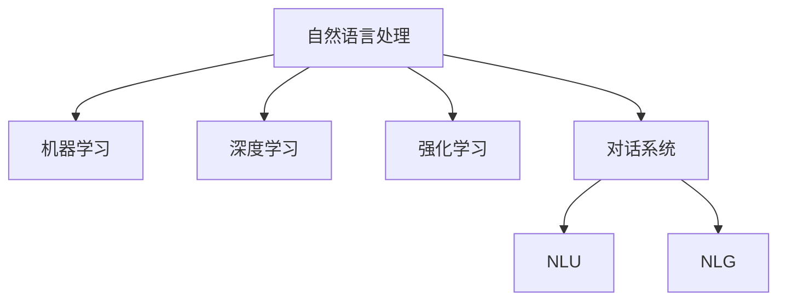

                 

# 构建你自己的聊天机器人：入门指南

## 1. 背景介绍

### 1.1 问题由来
在现代科技的推动下，人工智能(AI)技术正以前所未有的速度发展和应用，其中聊天机器人作为AI技术的重要分支，逐渐成为人们日常交流、查询、服务的重要工具。构建聊天机器人已经成为许多企业与开发者在数字化转型过程中不可或缺的一环。

### 1.2 问题核心关键点
构建聊天机器人的核心在于设计一个能够理解并回应用户输入的自然语言模型。目前，常用的技术包括基于规则的系统、模板匹配、机器学习和自然语言处理(NLP)等。这些技术各有优缺点，且在不同的应用场景中表现出不同的效果。

本指南将深入探讨基于机器学习和NLP的聊天机器人构建方法，详细介绍如何通过训练模型、优化算法以及选择合适的NLP库来实现一个高效、智能且易于维护的聊天机器人。

## 2. 核心概念与联系

### 2.1 核心概念概述

为更好地理解构建聊天机器人所需的理论和技术，本节将介绍几个关键概念：

- 自然语言处理(Natural Language Processing, NLP)：指使计算机能够理解和处理人类语言的技术，包括语言模型、语义分析、机器翻译等。
- 机器学习(Machine Learning, ML)：一种让计算机系统通过数据分析学习并优化模型性能的技术。
- 深度学习(Deep Learning, DL)：一种利用多层神经网络进行复杂模式识别的机器学习方法。
- 强化学习(Reinforcement Learning, RL)：一种通过试错学习并优化策略的机器学习技术。
- 对话系统(Dialogue System)：指能够模拟人类对话的计算机程序或系统，通常由自然语言理解(NLU)和自然语言生成(NLG)两部分组成。

这些概念之间的逻辑关系可以通过以下Mermaid流程图来展示：



这个流程图展示了几大核心概念及其之间的关系：

1. NLP作为AI的核心技术之一，为机器学习、深度学习以及对话系统提供了必要的语言分析能力。
2. 机器学习和深度学习则是基于大量数据训练模型的核心手段。
3. 强化学习则通过试错反馈机制，使模型能够更智能地处理复杂任务。
4. 对话系统则将上述技术集成在一起，实现真正意义上的人机交互。

## 3. 核心算法原理 & 具体操作步骤
### 3.1 算法原理概述

构建聊天机器人涉及多个算法和框架，包括自然语言理解(NLU)和自然语言生成(NLG)。以下是其基本原理：

- NLU：将用户输入的自然语言转换为计算机可理解的形式，通常使用语言模型、词向量、意图识别等技术。
- NLG：将计算机的处理结果转换为自然语言，通常使用模板填充、生成对抗网络(GAN)、文本生成器等技术。

### 3.2 算法步骤详解

聊天机器人的构建通常包括以下关键步骤：

1. 数据收集与预处理：
   - 收集用户的历史对话数据，或者构建一个包含常见问题和答案的数据集。
   - 对数据进行清洗、去重、分词等预处理。

2. 模型训练与优化：
   - 选择合适的算法和模型架构，如使用递归神经网络(RNN)、长短期记忆网络(LSTM)、Transformer等。
   - 训练模型并调整超参数，如学习率、批大小、正则化等。
   - 使用交叉验证等技术验证模型的泛化能力。

3. 对话系统集成：
   - 将训练好的模型集成到对话系统中，实现自然语言理解与生成的功能。
   - 设计对话逻辑和上下文管理机制，确保机器人能够处理复杂和多轮对话。

4. 系统部署与测试：
   - 将聊天机器人部署到指定的平台，如网站、移动应用等。
   - 对系统进行测试，确保其在不同的用户场景下表现稳定。

### 3.3 算法优缺点

构建聊天机器人有许多优点：
- 提升用户体验：自动化、24/7全天候服务。
- 降低人力成本：减轻客服工作负担。
- 处理复杂查询：处理多轮对话、语义理解和生成。

同时，也存在一些缺点：
- 初始开发成本高：需要大量的数据和计算资源。
- 需要持续维护：随着用户需求的变化，需要不断更新和优化模型。
- 缺乏人际温度：不能提供情感支持和人际温度。

### 3.4 算法应用领域

聊天机器人技术已经被广泛应用于多个领域，包括但不限于：

- 客户服务：自动处理常见问题，提升服务效率。
- 医疗咨询：提供初步诊断、健康咨询等服务。
- 教育培训：提供个性化学习指导和考试辅导。
- 金融咨询：解答投资、理财、保险等领域的疑问。
- 市场营销：与客户进行互动，提升品牌影响力。
- 家庭娱乐：提供智能对话、游戏等娱乐服务。

## 4. 数学模型和公式 & 详细讲解 & 举例说明

### 4.1 数学模型构建

在构建聊天机器人时，通常会使用深度学习模型进行语言理解和生成。以下是一些常用的数学模型：

- RNN：递归神经网络，通过循环结构对序列数据进行处理。
- LSTM：长短期记忆网络，通过门控机制解决长期依赖问题。
- Transformer：基于自注意力机制的神经网络，能够高效处理长序列数据。

### 4.2 公式推导过程

以Transformer模型为例，其关键公式如下：

- Self-Attention机制：
  $$
  Q_k = X_kW_Q^T, K_k = X_kW_K^T, V_k = X_kW_V^T
  $$
  $$
  E_k = Q_kK_k^T/\sqrt{d_k}, S_k = softmax(E_k)
  $$
  $$
  C_k = S_kV_k
  $$

- 前馈神经网络(Feed Forward)：
  $$
  Z_k = C_kW_1 + b_1, Z_k = \sigma(Z_kW_2 + b_2)
  $$

- 多头注意力机制：
  $$
  H = concat([C_1,...,C_h], 2)W_O^T
  $$

其中，$X_k$ 为输入向量，$W_Q$, $W_K$, $W_V$, $W_O$ 为不同的权重矩阵，$d_k$ 为注意力机制的维度。

### 4.3 案例分析与讲解

以下是一个简单的案例：

- 问题：构建一个可以回答问题的小型聊天机器人。
- 数据集：收集一个包含常见问题和答案的列表。
- 模型：使用Transformer模型。
- 步骤：
  1. 对问题进行分词和编码。
  2. 将编码后的问题和答案输入到Transformer模型中，学习回答问题。
  3. 模型输出预测的答案。
  4. 将预测结果返回给用户。

## 5. 项目实践：代码实例和详细解释说明
### 5.1 开发环境搭建

构建聊天机器人的环境搭建一般包括以下步骤：

1. 安装Python及其依赖包，如TensorFlow、PyTorch、NLTK等。
2. 准备数据集，将问题和答案清洗并转换为模型可接受的格式。
3. 安装必要的库，如TensorFlow Hub、Hugging Face Transformers等。

### 5.2 源代码详细实现

下面以使用Hugging Face Transformers库为例，展示构建聊天机器人的代码实现：

```python
from transformers import BertTokenizer, BertForSequenceClassification
from transformers import BertForQuestionAnswering, BertTokenizerFast
from transformers import AutoTokenizer, AutoModelForQuestionAnswering
from transformers import pipeline

# 加载预训练模型和分词器
tokenizer = BertTokenizer.from_pretrained('bert-base-uncased')
model = BertForQuestionAnswering.from_pretrained('bert-base-uncased')

# 定义问题与答案
question = "How do I train a chatbot?"
answer = "You can train a chatbot using data from your previous interactions with customers or by building a custom dataset."

# 对问题进行分词
inputs = tokenizer(question, return_tensors="pt")
# 对答案进行分词
targets = tokenizer(answer, return_tensors="pt")

# 训练模型
# ...

# 使用模型进行预测
outputs = model(**inputs)

# 获取模型预测的答案
predicted_answer = outputs["answer"]

# 输出预测结果
print(predicted_answer)
```

### 5.3 代码解读与分析

这段代码实现了使用BERT模型进行问答任务的预测。关键步骤包括：

- 加载预训练的BERT模型和分词器。
- 定义问题和答案，并将其转换为模型接受的格式。
- 使用模型进行预测，并输出预测结果。

## 6. 实际应用场景
### 6.1 智能客服系统

智能客服系统是聊天机器人技术的重要应用场景之一。它能够自动处理大量用户查询，减少客服人员的工作负担，提高客户满意度。

- 自动化处理：自动回答常见问题，提升服务效率。
- 全天候服务：24/7不间断服务，提升用户粘性。
- 数据分析：分析用户查询数据，优化服务策略。

### 6.2 金融咨询

金融咨询也是聊天机器人的常见应用领域。通过聊天机器人，用户可以随时随地获得投资、理财、保险等方面的专业建议。

- 个性化咨询：根据用户的历史数据，提供个性化的投资建议。
- 实时互动：实时解答用户疑问，提升用户体验。
- 数据分析：分析用户行为，优化投资策略。

### 6.3 教育培训

教育培训领域的聊天机器人可以帮助学生解答疑问，提供学习资源，提升学习效果。

- 个性化学习：根据学生的学习情况，提供个性化学习建议。
- 实时互动：解答学生的学习疑问，提升学习体验。
- 智能测评：自动评估学生的学习成果，提供反馈。

### 6.4 未来应用展望

未来，聊天机器人技术将在更多领域得到应用，为各行各业带来变革性影响。

- 医疗咨询：提供初步诊断、健康咨询等服务。
- 市场营销：与客户进行互动，提升品牌影响力。
- 家庭娱乐：提供智能对话、游戏等娱乐服务。
- 智能家居：与家居设备进行交互，提供智能生活体验。
- 工业制造：提供设备维护、质量检测等服务。

## 7. 工具和资源推荐
### 7.1 学习资源推荐

为了帮助开发者系统掌握聊天机器人技术的理论基础和实践技巧，以下是一些优质的学习资源：

1. 《自然语言处理综论》：介绍自然语言处理的基本概念和技术，是学习聊天机器人技术的入门书籍。
2. 《深度学习入门》：介绍深度学习的基本原理和实践，是构建聊天机器人的重要参考。
3. 《Python深度学习》：介绍如何使用Python实现深度学习模型，包括TensorFlow、PyTorch等框架的使用。
4. 《对话系统设计与实现》：详细介绍对话系统的设计原理和实现方法，是构建聊天机器人的实战指南。
5. 《NLTK自然语言处理入门》：介绍自然语言处理的基础技术和工具，是学习聊天机器人技术的实用资源。

### 7.2 开发工具推荐

构建聊天机器人通常需要多种工具和库的支持。以下是几款常用的开发工具：

1. TensorFlow：由Google主导的深度学习框架，提供了丰富的预训练模型和工具库。
2. PyTorch：由Facebook主导的深度学习框架，具有动态计算图和灵活的模型构建能力。
3. NLTK：Python自然语言处理库，提供了分词、词性标注、命名实体识别等基本功能。
4. spaCy：基于PyTorch的NLP库，提供了高效的分词、实体识别和句法分析功能。
5. Hugging Face Transformers：提供了多种预训练模型和工具，方便开发者进行模型训练和微调。

### 7.3 相关论文推荐

聊天机器人技术的发展得益于学界的持续研究。以下是几篇奠基性的相关论文，推荐阅读：

1. Attention is All You Need：介绍Transformer模型的原理和应用，是构建聊天机器人的重要基础。
2. How to train your data model for dialogue data：介绍使用机器学习模型处理对话数据的最佳实践。
3. Sequence-to-Sequence Models Applied to Conversational Machine Translation：介绍使用Seq2Seq模型进行对话翻译的技术。
4. Building End-to-End Dialogue Systems Using Generative Adversarial Networks：介绍使用GAN模型进行对话生成的技术。
5. Towards Conversational Recommendation Systems：介绍使用聊天机器人进行个性化推荐的技术。

这些论文代表了大语言模型微调技术的发展脉络。通过学习这些前沿成果，可以帮助研究者把握学科前进方向，激发更多的创新灵感。

## 8. 总结：未来发展趋势与挑战
### 8.1 研究成果总结

构建聊天机器人的技术在过去几年中取得了显著进展，以下是一些关键的研究成果：

- 模型精度提升：Transformer模型和深度学习技术显著提升了聊天机器人的理解能力和生成能力。
- 用户交互优化：通过优化对话逻辑和上下文管理机制，提升了用户交互体验。
- 多模态集成：将语音识别、图像识别等技术集成到聊天机器人中，提升了其多场景应用能力。
- 多语言支持：通过预训练多语言模型，提升了聊天机器人的跨语言处理能力。

### 8.2 未来发展趋势

展望未来，聊天机器人技术将呈现以下几个发展趋势：

1. 多模态集成：将视觉、语音等多模态信息与自然语言处理结合，提升聊天机器人的应用场景和功能。
2. 跨领域应用：聊天机器人在医疗、教育、金融等多个领域将发挥更大作用。
3. 个性化定制：根据用户的个性化需求，提供定制化的服务。
4. 实时互动：通过实时数据处理，提升聊天机器人的交互体验。
5. 人工智能融合：将聊天机器人与人工智能技术结合，实现更高级的智能应用。

### 8.3 面临的挑战

尽管聊天机器人技术已经取得了不少进展，但在实际应用中也面临一些挑战：

1. 数据获取难：构建高质量的对话数据集需要大量人力和时间。
2. 模型复杂度高：构建高质量的聊天机器人模型需要大量的计算资源。
3. 用户接受度低：用户对聊天机器人存在一定的接受度问题，特别是对于复杂问题，仍需人工干预。
4. 安全性和隐私问题：聊天机器人需要处理用户的敏感信息，需要保障数据安全和隐私。
5. 性能稳定性差：聊天机器人需要在高并发和大流量下稳定运行，需要优化性能和稳定性。

### 8.4 研究展望

未来，聊天机器人技术需要继续在以下几个方面进行研究：

1. 自动化数据收集：通过自动化工具，降低数据收集的成本和复杂度。
2. 模型优化与压缩：优化模型结构，减少计算资源消耗，提升性能和可维护性。
3. 安全性和隐私保护：加强对聊天机器人的安全性和隐私保护，保障用户数据安全。
4. 人机协同：将人工智能技术与人类专家结合，提升聊天机器人的决策能力。
5. 跨语言支持：构建跨语言聊天机器人，提升国际化和本地化能力。

## 9. 附录：常见问题与解答

**Q1：构建聊天机器人需要哪些步骤？**

A: 构建聊天机器人的基本步骤包括：

1. 数据收集与预处理：收集对话数据，进行清洗和分词。
2. 模型训练与优化：选择合适的模型架构和算法，训练模型并调整超参数。
3. 对话系统集成：将训练好的模型集成到对话系统中。
4. 系统部署与测试：将聊天机器人部署到指定平台，并进行测试和优化。

**Q2：如何选择适合的聊天机器人框架？**

A: 选择适合的聊天机器人框架需要考虑以下几个因素：

1. 功能需求：选择能够满足特定需求的框架，如支持多轮对话、情感分析等。
2. 计算资源：考虑框架对计算资源的需求，选择适合当前环境的工具。
3. 社区支持：选择有活跃社区支持的框架，方便获取帮助和更新。
4. 使用难度：选择易于上手和维护的框架，提高开发效率。

**Q3：如何优化聊天机器人的性能？**

A: 优化聊天机器人性能可以从以下几个方面入手：

1. 数据集质量：构建高质量的数据集，确保模型训练效果。
2. 模型架构：选择适合的模型架构，如Transformer、LSTM等。
3. 超参数调整：调整学习率、批大小等超参数，优化模型性能。
4. 优化算法：使用梯度下降等优化算法，提高模型收敛速度。
5. 实时数据处理：使用分布式计算和异步处理技术，提升系统性能。

通过本文的详细介绍，相信读者已经对构建聊天机器人的方法和技术有了更全面的理解。随着技术的不断进步和应用的深入，聊天机器人必将在更多领域发挥重要作用，推动人工智能技术在各行各业的应用和发展。

