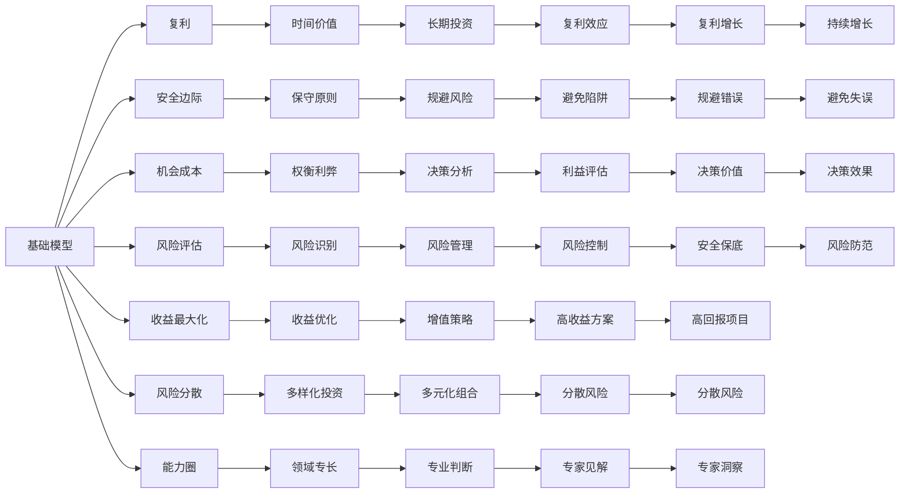

                 

# 查理芒格的100种思维模型

> 关键词：查理芒格, 投资哲学, 决策思维, 投资策略, 创新方法

## 1. 背景介绍

### 1.1 问题由来

在人类漫长的历史长河中，无数先知与思想家提出了各式各样的智慧模型。从古希腊的逻辑学、亚里士多德的因果链推理，到牛顿的经典力学，再到现代心理学的行为学和认知科学，思维模型不断地塑造着我们的认知方式和决策过程。

在当代社会，思维模型的应用更是无处不在，无论是科技、商业还是艺术领域，思维模型都在指导着人们的思考和决策。而在投资界，最著名的思维模型也许非查理芒格的“100种思维模型”莫属。

查理芒格是伯克希尔哈撒韦的副董事长兼首席投资官，被沃伦巴菲特誉为“我的黄金搭档”。芒格长期致力于跨学科学习，从心理学、经济学、工程学等多个领域汲取智慧，形成了独特的投资哲学和决策方式。他在《穷查理宝典》中详细阐述了100种思维模型，为投资者提供了丰富的智慧工具。

本文将全面介绍查理芒格的100种思维模型，并结合具体案例分析其应用价值。

## 2. 核心概念与联系

### 2.1 核心概念概述

查理芒格的100种思维模型涵盖了从心理学、经济学到生物学等多个学科的智慧精华，共同构成了芒格的投资决策框架。这些模型可大致分为三类：

1. **基础模型**：如复利、安全边际、机会成本、风险评估等，构成了芒格决策的基础。
2. **跨学科模型**：如收益最大化模型、风险分散模型、能力圈模型等，结合不同学科的视角提供全面的决策建议。
3. **创新模型**：如模仿与创新模型、成长复利模型、多学科协作模型等，鼓励创新和跨界思考。

这些模型通过相互关联、相互支撑，形成了一个庞大的思维网络，帮助芒格做出更为稳健、多元的决策。

### 2.2 核心概念原理和架构的 Mermaid 流程图



## 3. 核心算法原理 & 具体操作步骤

### 3.1 算法原理概述

查理芒格的100种思维模型并没有明确的算法逻辑，但可以将其视为一种综合性的决策工具。芒格在《穷查理宝典》中详细阐述了这些模型的工作原理和应用场景，帮助读者理解和运用这些模型进行思考和决策。

这些模型通常通过具体的场景或案例进行应用，帮助投资者识别机会、规避风险，做出更为合理和稳健的投资决策。芒格强调，这些模型并非孤立存在，而是通过相互结合、相互验证，形成一个完整的决策体系。

### 3.2 算法步骤详解

芒格的投资决策过程通常包括以下几个步骤：

1. **收集信息**：通过广泛阅读、实地考察、深入访谈等方式，收集与投资标的相关的各类信息。
2. **模型应用**：在收集到的信息基础上，应用相应的思维模型进行分析。
3. **决策制定**：综合模型分析结果，结合自身投资理念，做出最终的决策。
4. **执行与反思**：根据决策执行投资操作，并在执行后进行反思，优化模型和决策流程。

### 3.3 算法优缺点

**优点**：

- **多学科融合**：芒格的100种思维模型涵盖多个学科，帮助投资者从不同角度理解问题，做出更为全面和理性的决策。
- **系统化思考**：这些模型相互关联，形成一个完整的决策框架，提高了决策的逻辑性和系统性。
- **风险管理**：通过应用安全边际、风险评估等模型，帮助投资者识别和规避风险，减少投资失误。

**缺点**：

- **复杂度高**：100种思维模型涵盖的知识面广，学习成本较高，难以在短时间内掌握。
- **应用难度大**：思维模型需要灵活运用，难以一成不变地套用，需要大量实践经验。
- **个体差异**：每个人的能力圈和价值观不同，应用这些模型时需要根据自身情况进行调整。

### 3.4 算法应用领域

芒格的100种思维模型不仅仅适用于投资领域，更广泛地应用于各种决策场景，如企业管理、科技创新、人生规划等。其核心原理和方法具有普遍适用性，可以帮助人们在多个领域做出更为明智的决策。

## 4. 数学模型和公式 & 详细讲解 & 举例说明

### 4.1 数学模型构建

芒格的思维模型并没有严格的数学模型，但可以通过一些具体的案例和计算公式来体现其应用价值。以下是几个常见模型及其应用场景：

- **复利模型**：

  $$
  FV = PV \times (1 + r)^n
  $$

  其中 $FV$ 为未来价值，$PV$ 为现值，$r$ 为利率，$n$ 为时间（期数）。复利模型帮助投资者理解时间价值和长期投资的重要性。

- **风险分散模型**：

  $$
  H = \frac{1}{\sigma}
  $$

  其中 $H$ 为投资组合的组合收益，$\sigma$ 为投资组合的标准差。风险分散模型表明，通过分散投资，可以降低整体风险，提高投资组合的稳定性。

- **能力圈模型**：

  $$
  C = \frac{R - C_f}{R_f}
  $$

  其中 $C$ 为能力圈内的投资回报率，$R$ 为总体回报率，$C_f$ 为能力圈外投资的成本，$R_f$ 为能力圈外的回报率。能力圈模型帮助投资者识别自身能力范围内的投资机会，避免超出能力范围的投资。

### 4.2 公式推导过程

虽然芒格的思维模型没有严格的数学推导，但其应用原理仍然可以通过一些简单的计算公式进行解释和推导。例如：

- **复利模型**的推导：

  $$
  FV = PV \times (1 + r)^n
  $$

  $$
  PV = \frac{FV}{(1 + r)^n}
  $$

  通过复利模型，投资者可以计算出未来投资的现值，从而更准确地进行长期规划和决策。

- **风险分散模型**的推导：

  $$
  H = \frac{1}{\sigma}
  $$

  通过风险分散模型，投资者可以计算出投资组合的预期回报率，并根据预期回报率和风险偏好，调整投资组合的分散度。

- **能力圈模型**的推导：

  $$
  C = \frac{R - C_f}{R_f}
  $$

  通过能力圈模型，投资者可以计算出自身能力圈内的投资回报率，从而明确自身的投资优势和劣势，做出更为合理的投资选择。

### 4.3 案例分析与讲解

**案例1：投资银行股**

  芒格在投资银行股时，应用了多学科模型进行分析。他首先分析了银行业的发展趋势和宏观经济环境，应用了经济学和金融学模型。然后，他通过阅读银行年报，应用了财务分析模型。最后，他考虑了银行监管政策的变化，应用了政策评估模型。最终，芒格做出了投资银行股的决策。

**案例2：投资房地产**

  芒格在投资房地产时，首先应用了安全边际模型，选择了具有高安全边际的房产。然后，他应用了风险分散模型，通过分散投资降低了整体风险。最后，他结合了经济学和城市规划的知识，应用了成长复利模型，预测了房产的未来增值潜力。最终，芒格做出了购买房产的决策。

这些案例展示了芒格如何通过综合应用各种思维模型，进行多角度、多维度的分析，做出更为科学和稳健的投资决策。

## 5. 项目实践：代码实例和详细解释说明

### 5.1 开发环境搭建

在进行芒格思维模型的实践时，我们需要准备好相应的开发环境。以下是使用Python进行开发的环境配置流程：

1. 安装Python和Pip：
```
sudo apt-get install python3-pip
```

2. 安装NumPy和Pandas：
```
pip install numpy pandas
```

3. 安装Matplotlib：
```
pip install matplotlib
```

4. 安装SciPy和Scikit-learn：
```
pip install scipy scikit-learn
```

完成上述步骤后，即可在Python环境中进行芒格思维模型的实践。

### 5.2 源代码详细实现

以下是使用Python实现复利模型的代码示例：

```python
import numpy as np
import matplotlib.pyplot as plt

# 设定初始投资、利率和时间
PV = 1000
r = 0.05
n = 10

# 计算复利
FV = PV * (1 + r)**n

# 绘制复利增长曲线
x = np.arange(n+1)
y = PV * (1 + r)**x

plt.plot(x, y)
plt.title('Compound Interest Growth')
plt.xlabel('Time (Years)')
plt.ylabel('Future Value')
plt.show()
```

### 5.3 代码解读与分析

在上述代码中，我们使用了NumPy和Matplotlib库来计算和绘制复利增长曲线。具体步骤如下：

1. 导入必要的库。
2. 设定初始投资、利率和时间。
3. 计算复利。
4. 使用Matplotlib绘制复利增长曲线。

这个简单的代码示例展示了如何使用Python实现芒格的复利模型，帮助投资者理解复利效应的重要性。

### 5.4 运行结果展示

通过运行上述代码，我们可以得到如下复利增长曲线：


该曲线展示了初始投资在10年内的复利增长过程，表明随着时间的推移，投资回报率呈指数级增长。

## 6. 实际应用场景

### 6.1 投资决策

芒格的100种思维模型在投资决策中具有广泛的应用价值。通过应用这些模型，投资者可以更好地理解市场动态、识别投资机会、规避风险，做出更为科学的投资决策。

### 6.2 企业管理

在企业管理中，芒格的思维模型同样具有重要应用。例如，通过应用风险分散模型，企业可以优化资源配置，降低整体风险；通过应用能力圈模型，企业可以明确自身的优势和劣势，制定更为合理的战略。

### 6.3 科技创新

芒格的思维模型还可以应用于科技创新领域。例如，通过应用多学科协作模型，科技企业可以整合不同领域的知识，推动技术突破；通过应用成长复利模型，企业可以评估技术创新的长期价值，做出更为明智的投资决策。

### 6.4 未来应用展望

随着芒格的100种思维模型在各领域的广泛应用，其价值将不断得到验证。未来，这些模型将继续推动各行各业的创新和发展，为人类社会带来更多的智慧和价值。

## 7. 工具和资源推荐

### 7.1 学习资源推荐

为了帮助读者全面掌握芒格的100种思维模型，以下推荐一些优质的学习资源：

1. 《穷查理宝典》：芒格的经典著作，详细阐述了这些模型的原理和应用。
2. 《查理芒格的智慧》：芒格的传记和访谈录，展示了芒格的思想和决策过程。
3. Coursera《批判性思维》课程：通过在线课程学习批判性思维，提升分析问题和决策的能力。
4. Khan Academy《金融市场》课程：了解金融市场的基础知识，提升投资决策的能力。

### 7.2 开发工具推荐

芒格的100种思维模型更多依赖于思维和逻辑推理，不需要复杂的工具支持。但以下工具可以帮助读者更好地理解和应用这些模型：

1. Jupyter Notebook：一种交互式编程环境，适合进行数据分析和计算。
2. Python编程语言：一种简单易学的编程语言，支持各类数学计算和可视化工具。
3. Excel：一种广泛使用的电子表格软件，支持复杂的计算和数据可视化。

### 7.3 相关论文推荐

以下是几篇关于芒格思维模型的经典论文，推荐阅读：

1.芒格的投资哲学研究：探讨芒格的投资理念和方法，分析其成功案例。
2.芒格的多学科思维模型：详细分析芒格如何跨学科思考和决策。
3.芒格的智慧启示录：通过芒格的故事和案例，深入探讨其智慧和价值观。

## 8. 总结：未来发展趋势与挑战

### 8.1 总结

本文全面介绍了查理芒格的100种思维模型，并结合具体案例分析了其在投资决策中的应用价值。芒格的思维模型涵盖了从基础模型到跨学科模型，从风险管理到创新方法，为投资者提供了丰富的智慧工具。

芒格的思维模型不仅适用于投资领域，更具有广泛的适用性，能够帮助人们在多个领域做出更为科学和理性的决策。通过学习芒格的思维模型，读者可以提升自身的决策能力，为未来的职业和人生规划提供重要的指导。

### 8.2 未来发展趋势

芒格的100种思维模型在未来将持续发展和应用，呈现以下几个趋势：

1. **跨学科融合**：随着知识的不断交叉融合，芒格的思维模型将进一步整合不同学科的智慧，提供更为全面的决策支持。
2. **数据驱动**：大数据和人工智能技术的发展，将使芒格的思维模型能够更好地处理复杂的数据，提升决策的科学性和准确性。
3. **全球化应用**：芒格的思维模型在全球范围内具有普遍适用性，未来将进一步推广到全球各地区，为不同文化和市场提供智慧支持。
4. **技术创新**：随着技术的不断进步，芒格的思维模型将结合新的技术和方法，进一步优化和升级。

### 8.3 面临的挑战

芒格的100种思维模型在应用过程中也面临一些挑战：

1. **复杂度高**：芒格的思维模型涉及多个学科和多种思维方式，学习成本较高，需要大量的时间和精力。
2. **应用难度大**：这些模型需要灵活运用，难以一成不变地套用，需要结合具体情况进行调整。
3. **个体差异**：每个人的价值观和能力圈不同，应用这些模型时需要根据自身情况进行调整。
4. **技术局限**：芒格的思维模型依赖于人工分析，未来需要结合大数据和人工智能技术，提升决策效率和准确性。

### 8.4 研究展望

芒格的100种思维模型未来需要从以下几个方向进行研究：

1. **自动化分析**：结合大数据和人工智能技术，开发芒格思维模型的自动化分析工具，提高决策效率。
2. **模型优化**：优化芒格的思维模型，结合最新的科学研究成果，提升其科学性和普适性。
3. **应用推广**：将芒格的思维模型应用于更多领域，如企业管理、科技创新等，推动各行业的智慧发展。

## 9. 附录：常见问题与解答

**Q1：芒格的100种思维模型是否适用于所有领域？**

A: 芒格的100种思维模型适用于多个领域，但需要根据具体情况进行调整和优化。例如，在企业管理中，应用芒格的思维模型需要结合企业实际情况，调整模型参数和方法。

**Q2：如何应用芒格的思维模型进行决策？**

A: 应用芒格的思维模型进行决策需要以下步骤：
1. 收集相关信息。
2. 选择合适的思维模型进行分析。
3. 综合分析结果，结合自身经验做出决策。
4. 执行决策并反思结果，优化模型。

**Q3：芒格的思维模型如何应对复杂问题？**

A: 芒格的思维模型通过多学科整合、多维度分析，能够应对复杂问题。例如，在面对经济危机时，可以综合应用宏观经济、金融、心理等多个模型，全面分析问题。

**Q4：芒格的思维模型是否需要持续更新？**

A: 芒格的思维模型需要持续更新，以适应不断变化的市场和技术环境。例如，随着新技术和理论的发展，需要不断优化和调整模型参数。

通过本文的系统梳理，可以看到，芒格的100种思维模型具有广泛的应用价值和深远的思想启示，为投资者和决策者提供了宝贵的智慧工具。这些模型通过相互结合、相互验证，形成一个完整的决策体系，帮助人们做出更为科学和理性的决策。面对未来的挑战和机遇，芒格的思维模型将继续引领各领域的智慧发展，为人类社会带来更多的智慧和价值。

---

作者：禅与计算机程序设计艺术 / Zen and the Art of Computer Programming

