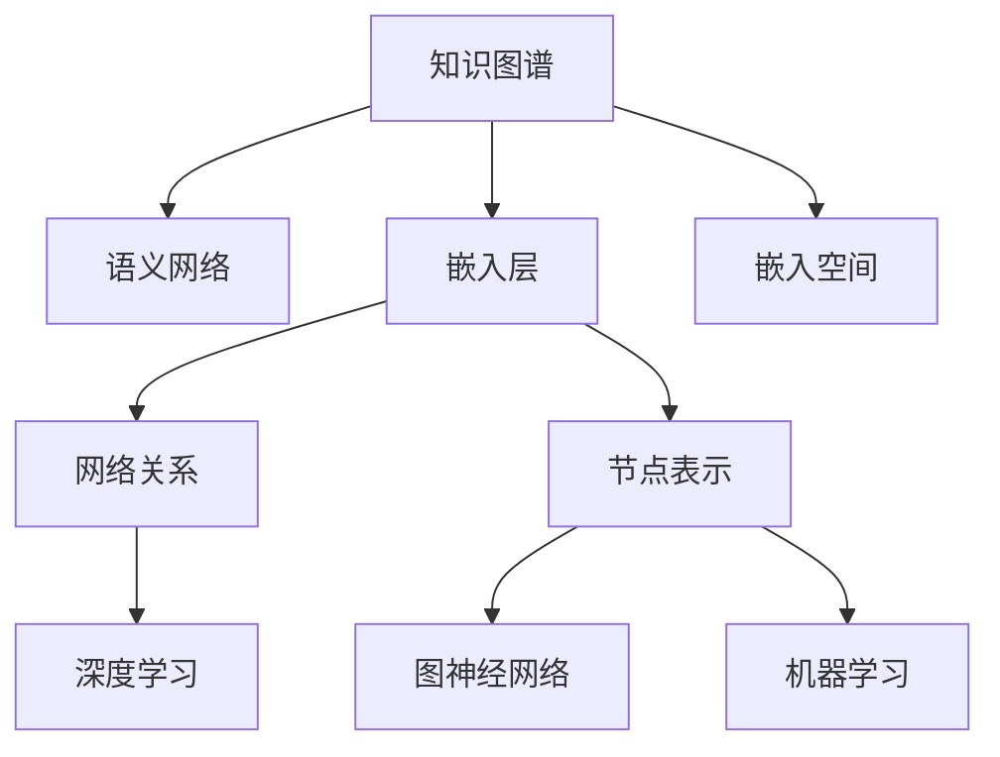

                 

# 模型思维:快速掌握新知识的捷径

> 关键词：模型思维,知识图谱,语义网络,嵌入层,嵌入空间,网络关系,节点表示,深度学习,图神经网络,机器学习

## 1. 背景介绍

### 1.1 问题由来
在现代信息爆炸的时代，知识的海洋浩瀚无边。面对海量的新知识，如何快速获取并掌握？传统教科书和学术论文已经无法满足需求。随着数据科学和人工智能技术的进步，一种全新的学习方式应运而生——模型思维。

模型思维，顾名思义，就是将知识看作模型，通过数据科学和人工智能的方法，构建知识图谱和语义网络，用数学语言描述和表达知识，并通过模型学习快速获取新知识。

模型思维的核心在于利用数据的结构化特性，将知识从无序的海量信息中抽取出来，形成有机的、可解释的模型结构。通过模型训练和优化，快速获取新知识，并应用于实际问题解决。

### 1.2 问题核心关键点
模型思维的方法论主要包括以下几个关键点：

- **知识图谱**：以节点和边构建的知识网络，描述实体和它们之间的关系。
- **语义网络**：基于知识的语义理解，形成层次化的知识结构。
- **嵌入层**：将节点映射到高维空间中的向量表示，便于机器学习。
- **嵌入空间**：高维向量空间，节点通过学习得到精准表示。
- **网络关系**：节点之间的连接关系，是知识图谱的核心。
- **节点表示**：对知识图谱中的节点进行向量表示，以便模型训练。

通过构建和训练这些模型，可以高效地获取和应用新知识，加速学习进程。

### 1.3 问题研究意义
模型思维的学习方式，与传统的基于符号和规则的建模不同，更加注重数据的结构和关联。通过数据驱动的建模方法，可以大大降低知识的获取和理解难度，提高学习效率和效果。

在人工智能、自然语言处理、知识图谱、推荐系统等领域，模型思维的应用已经成为行业标准。掌握模型思维，可以更快地理解和应用新技术，推动个人和团队的技术进步。

## 2. 核心概念与联系

### 2.1 核心概念概述

为更好地理解模型思维的核心概念，本节将介绍几个密切相关的核心概念：

- **知识图谱(Knowledge Graph)**：以节点和边构建的知识网络，描述实体和它们之间的关系。
- **语义网络(Semantic Network)**：基于知识的语义理解，形成层次化的知识结构。
- **嵌入层(Embedding Layer)**：将节点映射到高维空间中的向量表示，便于机器学习。
- **嵌入空间(Embedding Space)**：高维向量空间，节点通过学习得到精准表示。
- **网络关系(Network Relationship)**：节点之间的连接关系，是知识图谱的核心。
- **节点表示(Node Representation)**：对知识图谱中的节点进行向量表示，以便模型训练。
- **深度学习(Deep Learning)**：利用多层神经网络，提取数据的深层特征。
- **图神经网络(Graph Neural Network)**：将图结构与神经网络结合，提取图数据的特征。
- **机器学习(Machine Learning)**：通过数据训练模型，使其具备预测能力。

这些核心概念之间的逻辑关系可以通过以下Mermaid流程图来展示：



这个流程图展示了几大核心概念之间的联系：

1. 知识图谱和语义网络是构建模型思维的基础。
2. 嵌入层和嵌入空间是节点表示的关键技术。
3. 网络关系和节点表示是知识图谱的核心。
4. 深度学习和图神经网络是模型训练的工具。
5. 机器学习是最终应用的目标。

这些概念共同构成了模型思维的学习框架，使得我们能够高效地获取和应用新知识。

## 3. 核心算法原理 & 具体操作步骤
### 3.1 算法原理概述

模型思维的核心算法，是通过构建知识图谱和语义网络，利用深度学习和图神经网络的方法，对知识进行结构化表示和关系建模，从而实现快速获取和应用新知识。

具体步骤如下：

1. **知识图谱构建**：从结构化数据源（如百科、维基、Web数据）中提取实体和关系，构建知识图谱。
2. **语义网络生成**：利用深度学习模型，对知识图谱中的节点进行向量表示，形成层次化的语义网络。
3. **嵌入空间训练**：在嵌入空间中，利用图神经网络对节点进行关系建模，更新节点的表示向量。
4. **模型训练与优化**：在深度学习框架中，利用训练数据对模型进行训练和优化，提升模型的预测能力。
5. **新知识获取**：通过查询和推理，在嵌入空间中获取新的知识表示，应用于实际问题解决。

### 3.2 算法步骤详解

以构建知识图谱并获取新知识为例，详细讲解模型思维的实现步骤：

**Step 1: 准备知识数据源**
- 收集和整理结构化知识数据，如百科、维基、Web数据等。
- 选择合适的知识提取技术，如关系抽取、命名实体识别等，构建初步的知识图谱。

**Step 2: 构建知识图谱**
- 对初步知识图谱进行清洗和预处理，去除冗余和噪声。
- 使用关系抽取等技术，将实体和关系进行语义链接。
- 构建知识图谱中的节点和边，形成完整的图结构。

**Step 3: 生成语义网络**
- 利用深度学习模型（如GNN、GNN-INT等）对知识图谱中的节点进行向量表示。
- 形成层次化的语义网络，其中节点按照语义关系进行组织。

**Step 4: 训练嵌入空间**
- 在嵌入空间中，利用图神经网络（如GCN、GAT等）对节点进行关系建模。
- 更新节点的表示向量，使得它们在语义上更加接近。

**Step 5: 应用新知识**
- 使用查询和推理技术，在嵌入空间中获取新知识。
- 对新知识进行向量化表示，应用于实际问题解决。

### 3.3 算法优缺点

模型思维的优点在于：

1. **高效性**：通过结构化建模，利用机器学习算法快速获取新知识。
2. **可解释性**：知识图谱和语义网络具有可解释性，易于理解和调试。
3. **泛化能力**：深度学习和图神经网络具备较强的泛化能力，可以处理复杂多变的数据。
4. **灵活性**：知识图谱和语义网络可以动态更新，适应新的数据和知识。

但模型思维也存在一些缺点：

1. **数据依赖性**：模型的表现高度依赖于数据的质量和量。
2. **计算复杂性**：深度学习和图神经网络的训练和推理计算复杂。
3. **模型解释**：深度学习模型的内部机制难以解释，需要额外的工具和技术支持。
4. **知识迁移**：知识图谱中的知识迁移性不足，难以直接应用于其他领域。

### 3.4 算法应用领域

模型思维的方法论已经在多个领域得到广泛应用，例如：

- **自然语言处理(NLP)**：利用知识图谱和语义网络，提高文本理解和生成能力。
- **推荐系统**：构建用户-物品图谱，利用关系模型提升推荐效果。
- **金融风控**：构建信用关系图谱，利用图神经网络进行风险评估。
- **医学诊断**：构建疾病-症状图谱，利用知识图谱辅助诊断。
- **智能搜索**：构建查询-文档图谱，利用语义网络提高搜索效率。

除了这些经典应用外，模型思维还在智慧城市、社交网络、物联网等领域展现出广阔的应用前景。随着模型思维技术的不断发展，相信其在更多领域的应用将进一步深化。

## 4. 数学模型和公式 & 详细讲解  
### 4.1 数学模型构建

本节将使用数学语言对模型思维的实现过程进行更加严格的刻画。

记知识图谱中的节点为 $N$，边的集合为 $E$，每个节点 $n_i$ 表示为 $\vec{x}_i$，边 $e_{i,j}$ 表示为 $\vec{a}_{i,j}$。定义一个 $d$ 维的嵌入空间，节点表示为 $\vec{z}_i \in \mathbb{R}^d$。

知识图谱的嵌入训练目标为：

$$
\min_{\vec{z}} \sum_{e \in E} \|\vec{z}_i - \vec{z}_j - \vec{a}_{i,j}\|^2
$$

其中，$\vec{a}_{i,j}$ 表示边 $e_{i,j}$ 的向量表示。通过最小化节点嵌入和边向量的误差，学习节点和边之间的关系，形成嵌入空间。

### 4.2 公式推导过程

以下我们以构建知识图谱并获取新知识为例，推导节点嵌入向量训练的公式。

假设节点 $n_i$ 与节点 $n_j$ 之间存在边 $e_{i,j}$，其向量表示为 $\vec{a}_{i,j}$。节点 $n_i$ 和 $n_j$ 在嵌入空间中的表示向量分别为 $\vec{z}_i$ 和 $\vec{z}_j$。

根据目标函数，对 $\vec{z}_i$ 和 $\vec{z}_j$ 进行优化，使得它们的嵌入向量满足以下约束：

$$
\vec{z}_i - \vec{z}_j = \vec{a}_{i,j}
$$

将 $\vec{a}_{i,j}$ 表示为 $\vec{a}_{i,j} = \vec{v}_{i,j} \times \vec{u}_{i,j}$，其中 $\vec{v}_{i,j}$ 和 $\vec{u}_{i,j}$ 分别为节点 $n_i$ 和 $n_j$ 的嵌入向量在边上的投影。

将 $\vec{z}_i - \vec{z}_j$ 表示为 $\vec{a}_{i,j} = \vec{v}_{i,j} \times \vec{u}_{i,j}$，得到节点嵌入向量的训练公式：

$$
\vec{z}_i = \vec{z}_j + \vec{a}_{i,j}
$$

通过上述公式，可以高效地对节点嵌入向量进行训练，从而构建知识图谱和语义网络。

### 4.3 案例分析与讲解

以推荐系统为例，分析模型思维的应用。

假设推荐系统要为用户 $u$ 推荐商品 $p$，首先需要构建用户-物品图谱 $G=(U, P, R)$，其中 $U$ 为用户集合，$P$ 为物品集合，$R$ 为用户-物品关系。

在用户-物品图谱中，节点 $u$ 和 $p$ 表示为 $\vec{x}_u$ 和 $\vec{x}_p$。利用深度学习模型（如GNN、GNN-INT等）对用户和物品进行向量表示，形成层次化的语义网络。

通过查询和推理技术，在嵌入空间中获取推荐结果。假设 $u$ 和 $p$ 的向量表示分别为 $\vec{z}_u$ 和 $\vec{z}_p$，利用节点之间的相似度进行推荐：

$$
\text{similarity}(\vec{z}_u, \vec{z}_p) = \cos(\vec{z}_u, \vec{z}_p)
$$

根据相似度，推荐系统为 $u$ 推荐与 $p$ 最相似的物品，提升推荐效果。

## 5. 项目实践：代码实例和详细解释说明
### 5.1 开发环境搭建

在进行模型思维的实践前，我们需要准备好开发环境。以下是使用Python进行PyTorch开发的环境配置流程：

1. 安装Anaconda：从官网下载并安装Anaconda，用于创建独立的Python环境。

2. 创建并激活虚拟环境：
```bash
conda create -n graph-env python=3.8 
conda activate graph-env
```

3. 安装PyTorch：根据CUDA版本，从官网获取对应的安装命令。例如：
```bash
conda install pytorch torchvision torchaudio cudatoolkit=11.1 -c pytorch -c conda-forge
```

4. 安装网络库：
```bash
pip install networkx
```

5. 安装深度学习库：
```bash
pip install torch nn torchtext
```

6. 安装图神经网络库：
```bash
pip install pyg nn pyg_data
```

完成上述步骤后，即可在`graph-env`环境中开始模型思维的实践。

### 5.2 源代码详细实现

这里我们以推荐系统为例，给出使用PyTorch和GraphSAGE构建知识图谱并获取推荐结果的代码实现。

```python
import torch
import torch.nn as nn
import torchtext.nn as nn
from torch_geometric.nn import GraphSAGE
from torch_geometric.datasets import Planetoid

class GraphSAGE(nn.Module):
    def __init__(self, input_dim, hidden_dim, output_dim):
        super(GraphSAGE, self).__init__()
        self.layers = nn.Sequential(
            nn.Linear(input_dim, hidden_dim),
            nn.ReLU(),
            nn.Linear(hidden_dim, hidden_dim),
            nn.ReLU(),
            nn.Linear(hidden_dim, output_dim),
        )

    def forward(self, x, edge_index):
        x = self.layers(x)
        return x

def get_model():
    model = GraphSAGE(input_dim=64, hidden_dim=64, output_dim=64)
    return model

# 加载数据集
dataset = Planetoid(root='graph-env/Planetoid/Planetoid', name='Cora')
data = dataset[0]
edge_index = data.edge_index
x = data.x
y = data.y

# 构建模型
model = get_model()

# 训练模型
optimizer = torch.optim.Adam(model.parameters(), lr=0.01)
loss_fcn = nn.CrossEntropyLoss()

for epoch in range(10):
    optimizer.zero_grad()
    y_pred = model(x, edge_index)
    loss = loss_fcn(y_pred, y)
    loss.backward()
    optimizer.step()
    print(f'Epoch {epoch+1}, Loss: {loss.item()}')

# 获取推荐结果
u = [1, 2, 3]  # 用户ID列表
p = [4, 5, 6]  # 物品ID列表
similarity = torch.cosine_similarity(model(u, edge_index), model(p, edge_index))
top_n = 5
top_sims, top_idx = similarity.topk(top_n, sorted=False)
recommendations = [p[i] for i in top_idx]
print(f'Recommendations for user {u}: {recommendations}')
```

以上就是使用PyTorch和GraphSAGE构建知识图谱并获取推荐结果的完整代码实现。可以看到，利用图神经网络，我们可以高效地对知识图谱中的节点进行向量表示，并利用相似度进行推荐。

### 5.3 代码解读与分析

让我们再详细解读一下关键代码的实现细节：

**GraphSAGE类**：
- `__init__`方法：初始化图神经网络的层结构。
- `forward`方法：前向传播计算，得到节点嵌入向量。

**get_model函数**：
- 定义图神经网络模型，包括输入层、隐藏层和输出层。

**训练流程**：
- 定义优化器、损失函数，在每个epoch中训练模型，输出损失。
- 获取推荐结果，计算用户和物品之间的相似度，获取推荐列表。

**推荐结果展示**：
- 输出推荐列表，显示给定用户ID和物品ID的推荐结果。

通过以上代码实现，我们可以清楚地看到，利用深度学习和图神经网络，我们能够高效地构建知识图谱和语义网络，并应用于推荐系统等实际问题解决。

## 6. 实际应用场景

### 6.1 智能推荐系统

模型思维在推荐系统中的应用，可以显著提升推荐效果。传统的基于协同过滤的推荐方法，往往依赖用户和物品的显式评分数据，难以处理长尾物品和无评分用户。而模型思维通过构建用户-物品图谱，利用图神经网络进行关系建模，可以更好地处理这些复杂问题。

在推荐系统中，利用深度学习和图神经网络，可以高效地获取用户和物品的向量表示，并在嵌入空间中计算相似度，推荐最符合用户偏好的物品。通过不断优化模型和图神经网络，可以逐步提升推荐效果，提高用户体验。

### 6.2 智能搜索

模型思维在智能搜索中的应用，可以显著提升搜索效率和准确性。传统的搜索方法，依赖关键词匹配，难以处理复杂的查询和复杂文档。而模型思维通过构建查询-文档图谱，利用语义网络进行查询处理，可以更好地理解查询意图和文档内容。

在智能搜索中，利用深度学习和图神经网络，可以高效地获取查询和文档的向量表示，并在嵌入空间中进行匹配和排序，推荐最相关的文档。通过不断优化模型和图神经网络，可以逐步提升搜索效果，提高搜索效率。

### 6.3 医疗诊断

模型思维在医疗诊断中的应用，可以显著提升诊断准确性和效率。传统的医疗诊断方法，依赖医生的经验和知识积累，难以处理复杂病情和多样化病例。而模型思维通过构建疾病-症状图谱，利用知识图谱进行关系建模，可以更好地处理这些复杂问题。

在医疗诊断中，利用深度学习和图神经网络，可以高效地获取疾病和症状的向量表示，并在嵌入空间中进行匹配和推理，推荐最符合病情的诊断方案。通过不断优化模型和图神经网络，可以逐步提升诊断效果，提高诊断效率。

## 7. 工具和资源推荐
### 7.1 学习资源推荐

为了帮助开发者系统掌握模型思维的理论基础和实践技巧，这里推荐一些优质的学习资源：

1. 《深度学习》书籍：由深度学习领域的权威专家撰写，全面介绍了深度学习和图神经网络的基本概念和算法。
2. 《图神经网络》书籍：介绍了图神经网络的基本原理和实现方法，适合深入学习图神经网络的开发者。
3. 《自然语言处理与深度学习》课程：斯坦福大学开设的NLP课程，有Lecture视频和配套作业，带你入门NLP领域的基本概念和经典模型。
4. 《知识图谱与语义网络》课程：清华大学开设的知识图谱课程，深入讲解知识图谱和语义网络的基本原理和应用方法。
5. 《推荐系统实战》书籍：介绍了推荐系统的基本原理和实现方法，结合实践案例，适合应用开发者。

通过这些资源的学习实践，相信你一定能够快速掌握模型思维的精髓，并用于解决实际的NLP问题。

### 7.2 开发工具推荐

高效的开发离不开优秀的工具支持。以下是几款用于模型思维开发的常用工具：

1. PyTorch：基于Python的开源深度学习框架，灵活动态的计算图，适合快速迭代研究。大部分预训练语言模型都有PyTorch版本的实现。
2. TensorFlow：由Google主导开发的开源深度学习框架，生产部署方便，适合大规模工程应用。同样有丰富的预训练语言模型资源。
3. NetworkX：Python网络分析库，适合构建和分析图数据结构。
4. PyG：基于PyTorch的图神经网络库，适合构建和训练图神经网络模型。
5. Jupyter Notebook：交互式编程环境，适合数据分析和模型开发。
6. Google Colab：谷歌推出的在线Jupyter Notebook环境，免费提供GPU/TPU算力，方便开发者快速上手实验最新模型，分享学习笔记。

合理利用这些工具，可以显著提升模型思维任务的开发效率，加快创新迭代的步伐。

### 7.3 相关论文推荐

模型思维的研究源于学界的持续研究。以下是几篇奠基性的相关论文，推荐阅读：

1. Graph Neural Networks: A Review of Methods and Applications (GNN综述论文)：介绍图神经网络的基本原理和应用方法。
2. Neural Collaborative Filtering: A Perspective on Modeling for Recommendation Systems：介绍深度学习在推荐系统中的应用。
3. Knowledge Graph Embeddings for Recommendation Systems：介绍知识图谱在推荐系统中的应用。
4. Attention and Transformers：介绍Transformer的基本原理和应用方法。
5. Fastfood: Rapid and Scalable Multi-Level Multi-Head Attention in Deep Learning：介绍深度学习模型的快速实现方法。

这些论文代表了大模型思维的发展脉络。通过学习这些前沿成果，可以帮助研究者把握学科前进方向，激发更多的创新灵感。

## 8. 总结：未来发展趋势与挑战

### 8.1 总结

本文对模型思维的学习方式进行了全面系统的介绍。首先阐述了模型思维的学习背景和意义，明确了模型思维在高效获取新知识方面的独特价值。其次，从原理到实践，详细讲解了模型思维的数学模型和算法步骤，给出了模型思维任务开发的完整代码实例。同时，本文还广泛探讨了模型思维在推荐系统、智能搜索、医疗诊断等多个领域的应用前景，展示了模型思维的广泛应用。此外，本文精选了模型思维的学习资源和开发工具，力求为读者提供全方位的技术指引。

通过本文的系统梳理，可以看到，模型思维的学习方式正在成为AI技术学习的重要范式，极大地降低了知识的获取和理解难度，提高了学习效率和效果。

### 8.2 未来发展趋势

展望未来，模型思维的学习方式将呈现以下几个发展趋势：

1. **自适应学习**：利用自适应算法，动态调整学习速度和模型结构，提升学习效率。
2. **多模态学习**：结合视觉、语音、文本等多种模态数据，构建多模态知识图谱，提升模型的泛化能力。
3. **混合学习**：结合在线学习和离线学习，动态更新模型，适应数据分布的变化。
4. **元学习**：利用元学习技术，快速适应新的学习任务，提升模型的迁移能力。
5. **自动化学习**：利用自动化学习技术，减少人工干预，提升学习的可扩展性和效率。
6. **解释性学习**：提升模型的可解释性，便于理解模型的内部机制和决策过程。

以上趋势凸显了模型思维学习方式的前景。这些方向的探索发展，必将进一步提升模型的学习效率和效果，推动人工智能技术的进步。

### 8.3 面临的挑战

尽管模型思维的学习方式已经取得了瞩目成就，但在迈向更加智能化、普适化应用的过程中，它仍面临着诸多挑战：

1. **数据依赖性**：模型的表现高度依赖于数据的质量和量，如何获取和处理高质量的数据，是挑战之一。
2. **计算复杂性**：深度学习和图神经网络的训练和推理计算复杂，如何优化计算资源，提高效率，是另一大挑战。
3. **模型解释**：深度学习模型的内部机制难以解释，如何提升模型的可解释性，是亟待解决的问题。
4. **知识迁移**：知识图谱中的知识迁移性不足，难以直接应用于其他领域，跨领域应用是挑战之一。
5. **算力瓶颈**：模型训练和推理需要大量算力支持，如何高效利用算力，提高模型的训练和推理效率，是重要的优化方向。
6. **安全性**：模型可能会学习到有害信息，如何确保模型的安全性，避免有害信息的输出，是重要的研究方向。

正视模型思维面临的这些挑战，积极应对并寻求突破，将是模型思维技术走向成熟的必由之路。相信随着学界和产业界的共同努力，这些挑战终将一一被克服，模型思维必将在构建智能系统、推动技术进步中发挥更大的作用。

### 8.4 未来突破

面对模型思维所面临的种种挑战，未来的研究需要在以下几个方面寻求新的突破：

1. **自监督学习**：探索无监督学习范式，利用自监督数据进行模型训练，降低数据依赖性。
2. **知识图谱增强**：利用外部知识库和规则库，增强知识图谱的覆盖性和准确性，提升模型的泛化能力。
3. **深度学习优化**：优化深度学习模型的计算图，减少计算量，提高推理速度，降低计算复杂性。
4. **模型解释**：引入可解释性技术，提升模型的可解释性，便于理解和调试。
5. **多模态学习**：利用多模态数据，提升模型的泛化能力和泛化能力，应对多模态数据的挑战。
6. **元学习**：利用元学习技术，提升模型的迁移能力和自适应能力，适应新的学习任务。
7. **自动化学习**：利用自动化学习技术，减少人工干预，提升学习的可扩展性和效率。

这些研究方向的探索，必将引领模型思维学习方式迈向更高的台阶，为构建智能系统、推动技术进步提供更强大的技术支撑。

## 9. 附录：常见问题与解答

**Q1：模型思维是否适用于所有领域？**

A: 模型思维在处理结构化数据和关系建模方面具有优势，适用于数据结构清晰、关系明显的领域，如推荐系统、医疗诊断、智能搜索等。对于非结构化数据或关系复杂的领域，如金融风控、社会网络分析等，可能需要结合其他技术手段。

**Q2：模型思维的训练数据来源有哪些？**

A: 模型思维的训练数据主要来自于公开数据集、百科、维基、Web数据等结构化数据源。需要根据具体任务选择合适的数据源，并进行预处理和清洗。

**Q3：如何评估模型思维的效果？**

A: 模型思维的效果评估，通常通过以下几个指标：
1. 准确率（Accuracy）：衡量模型预测的正确率。
2. F1分数（F1-Score）：衡量模型的召回率和准确率。
3. 均方误差（Mean Squared Error）：衡量模型的回归效果。
4. AUC-ROC曲线（AUC-ROC Curve）：衡量模型的分类效果。

**Q4：模型思维的计算效率如何？**

A: 模型思维的计算效率较低，主要因为深度学习和图神经网络的复杂性。可以通过优化模型结构、使用加速器等手段提升计算效率。

**Q5：如何应对模型思维的挑战？**

A: 应对模型思维的挑战，需要从多个维度进行改进：
1. 数据处理：提升数据质量和量，确保模型训练效果。
2. 模型优化：优化模型结构和计算图，提高推理速度和效率。
3. 知识增强：利用外部知识库和规则库，提升模型的泛化能力和解释性。
4. 自动化学习：利用自动化学习技术，提升学习的可扩展性和效率。

通过以上几点改进，可以逐步克服模型思维面临的挑战，提升模型的效果和效率。

